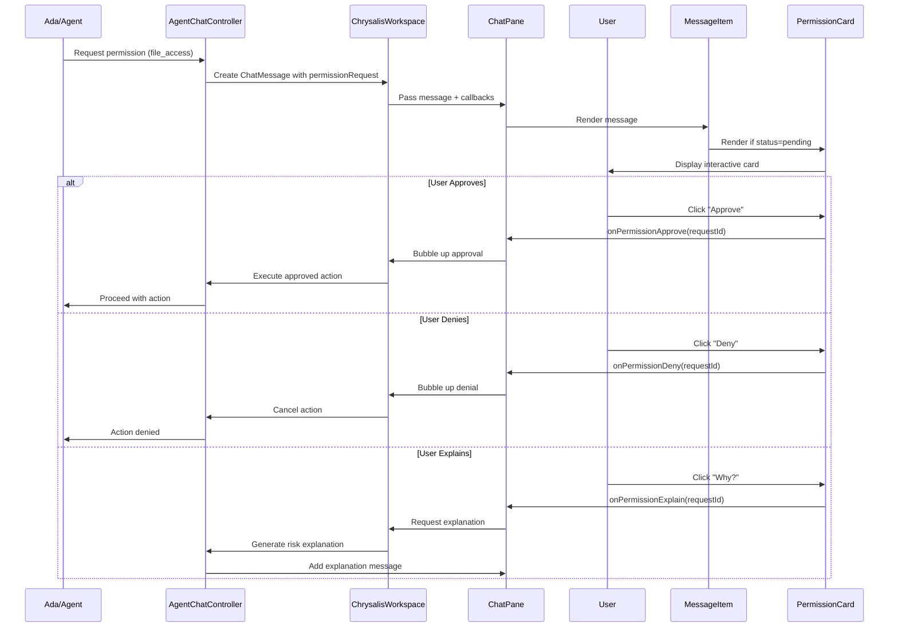

# Inline Permission System

## Overview

The Inline Permission System provides a context-aware, non-blocking approval mechanism for agent actions directly within the chat stream. Instead of modal dialogs or separate approval queues, permission requests appear as interactive cards embedded in the conversation flow.

## Architecture

### Core Components

1. **PermissionRequest Type** (`src/components/ChrysalisWorkspace/types.ts`)
2. **PermissionCard Component** (`src/components/shared/PermissionCard.tsx`)
3. **MessageItem Integration** (`src/components/ChrysalisWorkspace/ChatPane.tsx`)
4. **ThemeContext Support** (`src/components/shared/ThemeContext.tsx`)

### Data Flow



## Type Definitions

### PermissionRequest

```typescript
export interface PermissionRequest {
  requestId: string;          // Unique identifier for this request
  agentId: string;            // ID of requesting agent
  agentName: string;          // Display name of agent
  trust: 'external' | 'internal' | 'ada';  // Trust level
  action: string;             // Action identifier (e.g., 'file_access')
  summary: string;            // Human-readable summary
  scopePreview?: string;      // Optional scope details
  riskLevel?: 'low' | 'med' | 'high';  // Risk assessment
  status: 'pending' | 'approved' | 'denied' | 'expired';
}
```

### ChatMessage Extension

```typescript
export interface ChatMessage {
  // ... existing fields
  permissionRequest?: PermissionRequest;  // Optional permission request
}
```

## Implementation Details

### Message Creation Pattern

```typescript
// Agent creates a message with permission request
function createPermissionMessage(
  agentId: string,
  agentName: string,
  action: string,
  summary: string
): ChatMessage {
  return {
    id: generateId(),
    timestamp: Date.now(),
    senderId: agentId,
    senderName: agentName,
    senderType: 'agent',
    content: `I need your approval to ${action}.`,
    permissionRequest: {
      requestId: generateId(),
      agentId,
      agentName,
      trust: 'ada',  // or 'internal'/'external'
      action,
      summary,
      riskLevel: assessRisk(action),
      status: 'pending',
    },
  };
}
```

### Rendering Logic

```typescript
// In MessageItem component
const hasPermissionRequest = 
  message.permissionRequest && 
  message.permissionRequest.status === 'pending';

{hasPermissionRequest && (
  <div style={{ marginTop: '8px' }}>
    <PermissionCard
      requestId={message.permissionRequest.requestId}
      agentName={message.permissionRequest.agentName}
      trust={message.permissionRequest.trust}
      summary={message.permissionRequest.summary}
      mode={mode}
      onApprove={onPermissionApprove}
      onDeny={onPermissionDeny}
      onExplainRisk={onPermissionExplain}
    />
  </div>
)}
```

### Callback Handling

```typescript
// In ChrysalisWorkspace
const handlePermissionApprove = useCallback((requestId: string) => {
  // Update message to mark as approved
  setMessages(prev => prev.map(msg => 
    msg.permissionRequest?.requestId === requestId
      ? {
          ...msg,
          permissionRequest: {
            ...msg.permissionRequest,
            status: 'approved'
          }
        }
      : msg
  ));
  
  // Execute the approved action
  executeApprovedAction(requestId);
}, []);
```

## Best Practices & Rationale

### 1. **Context Preservation**
**Practice**: Permission requests appear inline with the conversation.

**Justification**: Users maintain full conversation context when making approval decisions. They can see what led to the request, review previous messages, and understand the agent's reasoning without switching contexts.

**Anti-pattern**: Modal dialogs or separate approval queues break conversation flow and lose context.

### 2. **Non-Blocking UI**
**Practice**: Permission cards don't prevent other interactions.

**Justification**: Users can continue chatting with other agents, reviewing the canvas, or gathering more information before deciding. Multiple pending permissions can coexist in the stream.

**Anti-pattern**: Blocking modals force immediate decisions and prevent exploration.

### 3. **Visual Trust Indicators**
**Practice**: Trust badges distinguish between external, internal, and Ada agents.

**Justification**: Users make informed decisions based on agent trust level. Different border styles (dashed/solid/double) provide instant visual recognition.

**Anti-pattern**: Uniform styling hides important security context.

### 4. **Persistent Approval History**
**Practice**: Approved/denied permissions remain in chat history.

**Justification**: Creates an audit trail. Users can review past decisions, understand why certain actions occurred, and learn agent behavior patterns.

**Anti-pattern**: Disappearing approval UI loses valuable context and audit information.

### 5. **Progressive Disclosure**
**Practice**: "Why?" button provides detailed risk explanation on demand.

**Justification**: Keeps the UI minimal while offering depth when needed. Reduces cognitive load for low-risk actions while enabling investigation for high-risk ones.

**Anti-pattern**: Showing all details upfront overwhelms users with information.

### 6. **Status-Driven Rendering**
**Practice**: Cards only render when `status === 'pending'`.

**Justification**: Once approved/denied, the card disappears but the message remains. This prevents re-approval of stale requests while preserving conversation history.

**Anti-pattern**: Persistent interactive cards could lead to accidental re-approvals.

## Theme Integration

Permission components consume `ThemeContext` for consistent light/dark mode support:

```typescript
const { mode } = useTheme();

<PermissionCard
  mode={mode}  // Automatically adapts to current theme
  {...otherProps}
/>
```

**Benefits**:
- Automatic color adaptation when theme toggles
- Consistent visual hierarchy across themes
- No hardcoded color values
- Centralized theme management

## Security Considerations

### Trust Levels

- **`external`**: Third-party agents, dashed border, higher scrutiny
- **`internal`**: First-party Chrysalis agents, solid border, standard scrutiny  
- **`ada`**: System agent, double border, elevated trust

### Risk Assessment

Permission requests include optional `riskLevel` ('low' | 'med' | 'high'):
- **Low**: Read operations, non-destructive queries
- **Medium**: Write operations, resource consumption
- **High**: System changes, external network access, data deletion

### Timeout Handling

```typescript
// Permissions can expire after a timeout
setTimeout(() => {
  updatePermissionStatus(requestId, 'expired');
}, PERMISSION_TIMEOUT_MS);
```

## Integration with Ada

The `AdaIntegrationService` (`src/components/Ada/AdaIntegrationService.ts`) includes an `awaiting_approval` state in its state machine:

```
idle → observing → assisting → awaiting_approval → executing
                                        ↓
                                   cool_down (if denied)
```

Ada creates permission requests when:
- Proposing automated fixes
- Accessing user data
- Executing system commands
- Making significant UI changes

## Future Enhancements

1. **Batch Approvals**: "Approve all from Ada" for trusted agents
2. **Remember Decisions**: "Always allow this action" with scope limits
3. **Granular Scopes**: Specific file paths, time limits, resource quotas
4. **Approval Analytics**: Track approval rates, identify friction points
5. **Smart Defaults**: ML-based risk assessment and auto-approval suggestions

## Example Implementation

```typescript
import { ChrysalisWorkspace, PermissionRequest } from './components/ChrysalisWorkspace';
import { ThemeProvider } from './components/shared';

function App() {
  const handlePermissionApprove = (requestId: string) => {
    console.log('Approved:', requestId);
    // Execute approved action
  };

  const handlePermissionDeny = (requestId: string) => {
    console.log('Denied:', requestId);
    // Cancel action, log denial
  };

  const handlePermissionExplain = (requestId: string) => {
    console.log('Explain:', requestId);
    // Generate risk explanation
  };

  return (
    <ThemeProvider defaultMode="dark">
      <ChrysalisWorkspace
        userId="user-1"
        userName="Developer"
        primaryAgent={{
          agentId: 'ada',
          agentName: 'Ada',
          agentType: 'primary',
        }}
        // Permission callbacks wired to ChatPane via props drilling
        onPermissionApprove={handlePermissionApprove}
        onPermissionDeny={handlePermissionDeny}
        onPermissionExplain={handlePermissionExplain}
      />
    </ThemeProvider>
  );
}
```

## Testing

Manual test scenarios:
1. Agent sends message with `permissionRequest` → Card renders inline
2. User clicks "Approve" → Callback fires, card disappears, action executes
3. User clicks "Deny" → Callback fires, card disappears, action cancelled
4. User clicks "Why?" → Explanation message appears
5. Toggle theme → Card adapts colors instantly
6. Scroll conversation → Permission cards stay with their messages
7. Multiple pending requests → All render independently

## Conclusion

The inline permission system balances security, usability, and context preservation. By embedding approvals in the conversation flow, we reduce friction for trusted agents while maintaining clear audit trails and user control for all actions.