# AI Lead Adaptation System - Architecture Diagrams

**Version**: 1.0.0
**Date**: 2025-01-XX
**Purpose**: Architecture diagrams for AI Lead Adaptation System using Mermaid

## Table of Contents

1. [System Architecture](#system-architecture)
2. [Component Architecture](#component-architecture)
3. [Sequence Diagrams](#sequence-diagrams)
4. [Data Flow Diagrams](#data-flow-diagrams)
5. [State Transition Diagrams](#state-transition-diagrams)
6. [Deployment Diagram](#deployment-diagram)

## System Architecture

### High-Level System Architecture

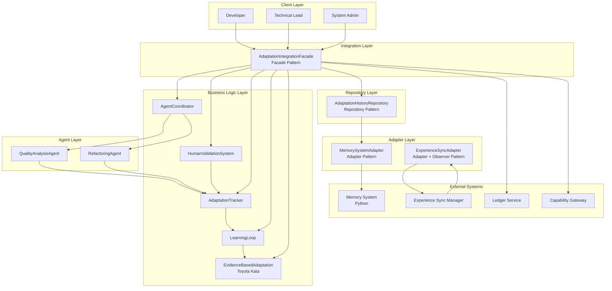
```mermaid
graph TB
    subgraph "Client Layer"
        DEV[Developer]
        LEAD[Technical Lead]
        ADMIN[System Admin]
    end

    subgraph "Integration Layer"
        FACADE[AdaptationIntegrationFacade<br/>Facade Pattern]
    end

    subgraph "Adapter Layer"
        MEM_ADAPT[MemorySystemAdapter<br/>Adapter Pattern]
        EXP_ADAPT[ExperienceSyncAdapter<br/>Adapter + Observer Pattern]
    end

    subgraph "Repository Layer"
        REPO[AdaptationHistoryRepository<br/>Repository Pattern]
    end

    subgraph "Business Logic Layer"
        COORD[AgentCoordinator]
        VALID[HumanValidationSystem]
        TRACK[AdaptationTracker]
        LEARN[LearningLoop]
        EVID[EvidenceBasedAdaptation<br/>Toyota Kata]
    end

    subgraph "Agent Layer"
        QA_AGENT[QualityAnalysisAgent]
        REF_AGENT[RefactoringAgent]
    end

    subgraph "External Systems"
        MEM_SYS[Memory System<br/>Python]
        EXP_SYNC[Experience Sync Manager]
        LEDGER[Ledger Service]
        CAP_GW[Capability Gateway]
    end

    DEV --> FACADE
    LEAD --> FACADE
    ADMIN --> FACADE

    FACADE --> COORD
    FACADE --> VALID
    FACADE --> TRACK
    FACADE --> LEARN
    FACADE --> EVID

    COORD --> QA_AGENT
    COORD --> REF_AGENT

    QA_AGENT --> TRACK
    REF_AGENT --> TRACK

    VALID --> TRACK
    TRACK --> LEARN
    LEARN --> EVID

    MEM_ADAPT --> MEM_SYS
    EXP_ADAPT --> EXP_SYNC
    REPO --> MEM_ADAPT
    FACADE --> REPO

    FACADE --> LEDGER
    FACADE --> CAP_GW

    EXP_SYNC --> EXP_ADAPT
```

## Component Architecture

### Integration Layer Architecture

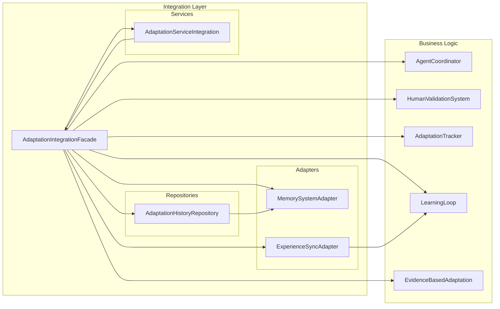
```mermaid
graph LR
    subgraph "Integration Layer"
        FACADE[AdaptationIntegrationFacade]

        subgraph "Adapters"
            MEM_ADAPT[MemorySystemAdapter]
            EXP_ADAPT[ExperienceSyncAdapter]
        end

        subgraph "Repositories"
            REPO[AdaptationHistoryRepository]
        end

        subgraph "Services"
            SERV[AdaptationServiceIntegration]
        end
    end

    subgraph "Business Logic"
        COORD[AgentCoordinator]
        VALID[HumanValidationSystem]
        TRACK[AdaptationTracker]
        LEARN[LearningLoop]
        EVID[EvidenceBasedAdaptation]
    end

    FACADE --> COORD
    FACADE --> VALID
    FACADE --> TRACK
    FACADE --> LEARN
    FACADE --> EVID

    FACADE --> MEM_ADAPT
    FACADE --> EXP_ADAPT
    FACADE --> REPO
    FACADE --> SERV

    REPO --> MEM_ADAPT
    EXP_ADAPT --> LEARN
    SERV --> FACADE
```

## Sequence Diagrams

### Quality Analysis Request Sequence

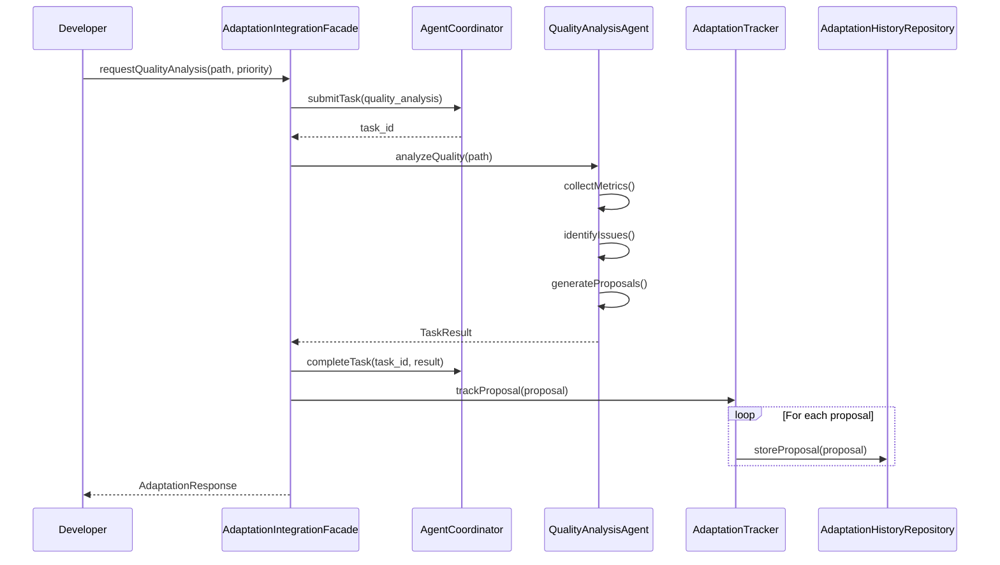
```mermaid
sequenceDiagram
    participant Dev as Developer
    participant Facade as AdaptationIntegrationFacade
    participant Coord as AgentCoordinator
    participant QA as QualityAnalysisAgent
    participant Track as AdaptationTracker
    participant Repo as AdaptationHistoryRepository

    Dev->>Facade: requestQualityAnalysis(path, priority)
    Facade->>Coord: submitTask(quality_analysis)
    Coord-->>Facade: task_id

    Facade->>QA: analyzeQuality(path)
    QA->>QA: collectMetrics()
    QA->>QA: identifyIssues()
    QA->>QA: generateProposals()
    QA-->>Facade: TaskResult

    Facade->>Coord: completeTask(task_id, result)
    Facade->>Track: trackProposal(proposal)

    loop For each proposal
        Track->>Repo: storeProposal(proposal)
    end

    Facade-->>Dev: AdaptationResponse
```

### Refactoring Request Sequence

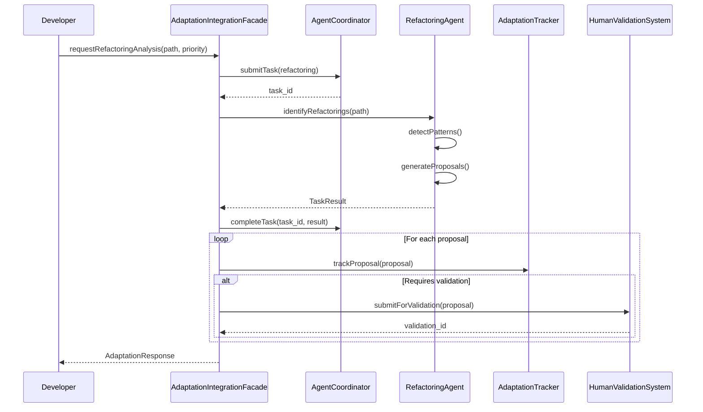
```mermaid
sequenceDiagram
    participant Dev as Developer
    participant Facade as AdaptationIntegrationFacade
    participant Coord as AgentCoordinator
    participant Ref as RefactoringAgent
    participant Track as AdaptationTracker
    participant Valid as HumanValidationSystem

    Dev->>Facade: requestRefactoringAnalysis(path, priority)
    Facade->>Coord: submitTask(refactoring)
    Coord-->>Facade: task_id

    Facade->>Ref: identifyRefactorings(path)
    Ref->>Ref: detectPatterns()
    Ref->>Ref: generateProposals()
    Ref-->>Facade: TaskResult

    Facade->>Coord: completeTask(task_id, result)

    loop For each proposal
        Facade->>Track: trackProposal(proposal)
        alt Requires validation
            Facade->>Valid: submitForValidation(proposal)
            Valid-->>Facade: validation_id
        end
    end

    Facade-->>Dev: AdaptationResponse
```

### Human Validation Sequence

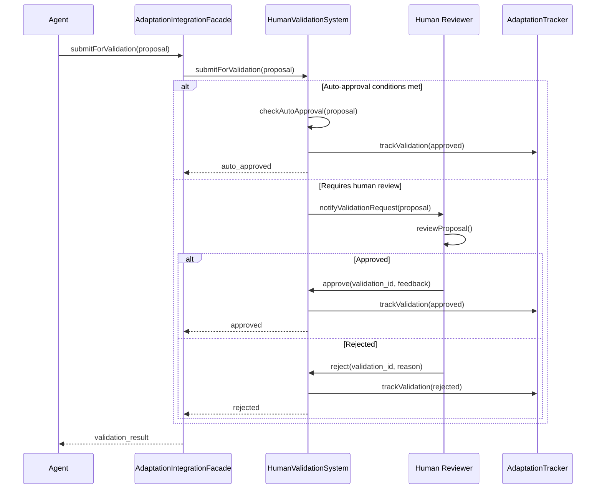
```mermaid
sequenceDiagram
    participant Agent as Agent
    participant Facade as AdaptationIntegrationFacade
    participant Valid as HumanValidationSystem
    participant Human as Human Reviewer
    participant Track as AdaptationTracker

    Agent->>Facade: submitForValidation(proposal)
    Facade->>Valid: submitForValidation(proposal)

    alt Auto-approval conditions met
        Valid->>Valid: checkAutoApproval(proposal)
        Valid->>Track: trackValidation(approved)
        Valid-->>Facade: auto_approved
    else Requires human review
        Valid->>Human: notifyValidationRequest(proposal)
        Human->>Human: reviewProposal()

        alt Approved
            Human->>Valid: approve(validation_id, feedback)
            Valid->>Track: trackValidation(approved)
            Valid-->>Facade: approved
        else Rejected
            Human->>Valid: reject(validation_id, reason)
            Valid->>Track: trackValidation(rejected)
            Valid-->>Facade: rejected
        end
    end

    Facade-->>Agent: validation_result
```

### Kata Cycle Sequence

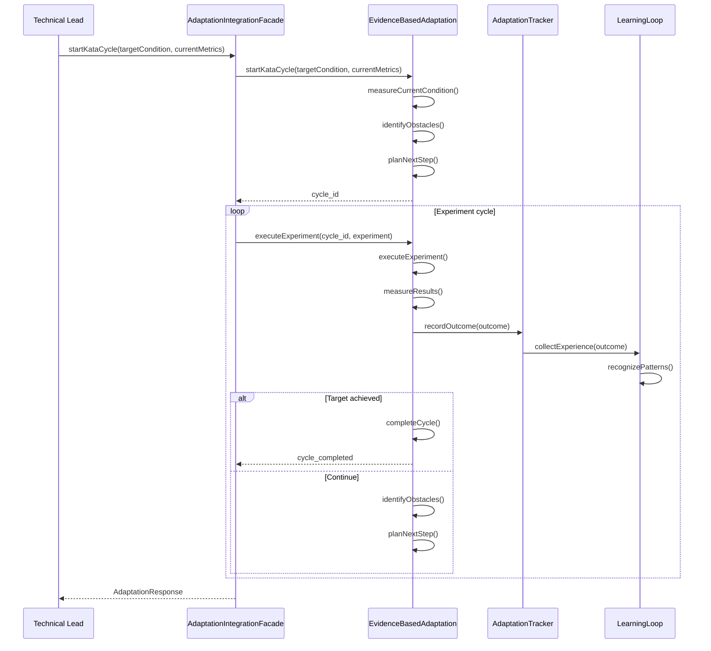
```mermaid
sequenceDiagram
    participant Lead as Technical Lead
    participant Facade as AdaptationIntegrationFacade
    participant EVID as EvidenceBasedAdaptation
    participant Track as AdaptationTracker
    participant Learn as LearningLoop

    Lead->>Facade: startKataCycle(targetCondition, currentMetrics)
    Facade->>EVID: startKataCycle(targetCondition, currentMetrics)

    EVID->>EVID: measureCurrentCondition()
    EVID->>EVID: identifyObstacles()
    EVID->>EVID: planNextStep()
    EVID-->>Facade: cycle_id

    loop Experiment cycle
        Facade->>EVID: executeExperiment(cycle_id, experiment)
        EVID->>EVID: executeExperiment()
        EVID->>EVID: measureResults()
        EVID->>Track: recordOutcome(outcome)
        Track->>Learn: collectExperience(outcome)
        Learn->>Learn: recognizePatterns()

        alt Target achieved
            EVID->>EVID: completeCycle()
            EVID-->>Facade: cycle_completed
        else Continue
            EVID->>EVID: identifyObstacles()
            EVID->>EVID: planNextStep()
        end
    end

    Facade-->>Lead: AdaptationResponse
```

### Experience Collection Sequence

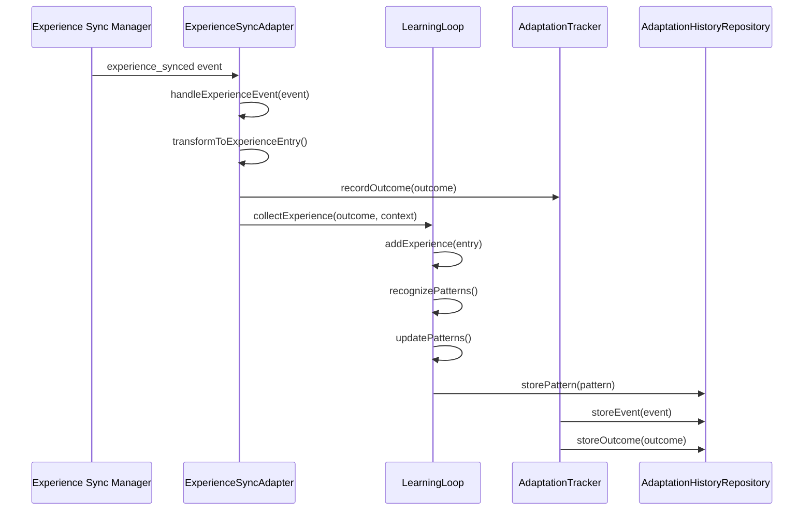
```mermaid
sequenceDiagram
    participant EXP_SYNC as Experience Sync Manager
    participant EXP_ADAPT as ExperienceSyncAdapter
    participant Learn as LearningLoop
    participant Track as AdaptationTracker
    participant Repo as AdaptationHistoryRepository

    EXP_SYNC->>EXP_ADAPT: experience_synced event
    EXP_ADAPT->>EXP_ADAPT: handleExperienceEvent(event)
    EXP_ADAPT->>EXP_ADAPT: transformToExperienceEntry()

    EXP_ADAPT->>Track: recordOutcome(outcome)
    EXP_ADAPT->>Learn: collectExperience(outcome, context)

    Learn->>Learn: addExperience(entry)
    Learn->>Learn: recognizePatterns()
    Learn->>Learn: updatePatterns()

    Learn->>Repo: storePattern(pattern)
    Track->>Repo: storeEvent(event)
    Track->>Repo: storeOutcome(outcome)
```

## Data Flow Diagrams

### Quality Analysis Data Flow

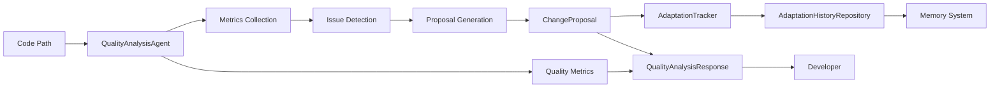
```mermaid
flowchart LR
    A[Code Path] --> B[QualityAnalysisAgent]
    B --> C[Metrics Collection]
    C --> D[Issue Detection]
    D --> E[Proposal Generation]
    E --> F[ChangeProposal]
    F --> G[AdaptationTracker]
    G --> H[AdaptationHistoryRepository]
    H --> I[Memory System]

    B --> J[Quality Metrics]
    J --> K[QualityAnalysisResponse]
    F --> K
    K --> L[Developer]
```

### Learning Loop Data Flow

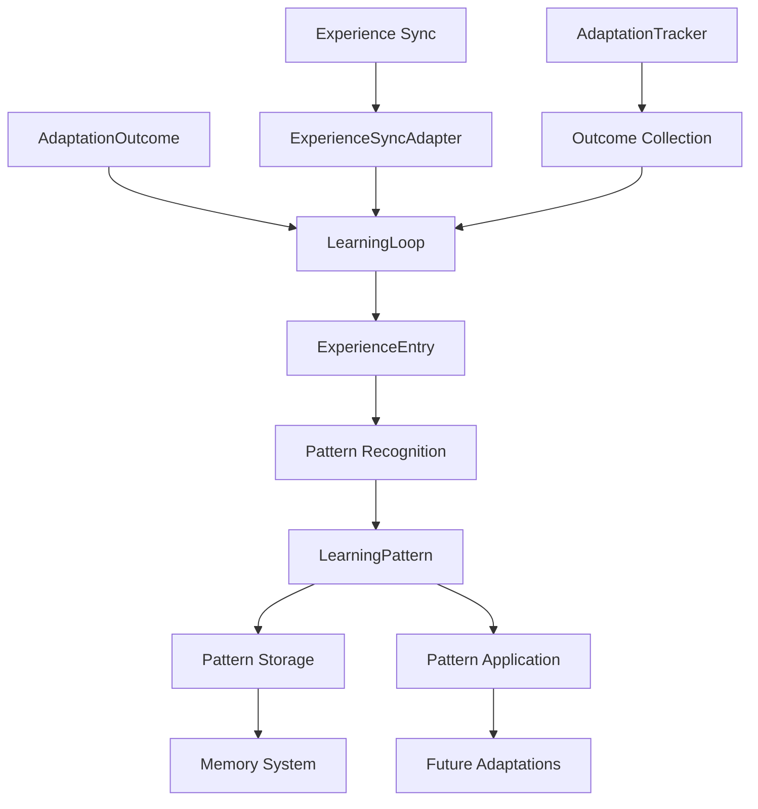
```mermaid
flowchart TB
    A[AdaptationOutcome] --> B[LearningLoop]
    B --> C[ExperienceEntry]
    C --> D[Pattern Recognition]
    D --> E[LearningPattern]
    E --> F[Pattern Storage]
    F --> G[Memory System]

    E --> H[Pattern Application]
    H --> I[Future Adaptations]

    J[Experience Sync] --> K[ExperienceSyncAdapter]
    K --> B

    L[AdaptationTracker] --> M[Outcome Collection]
    M --> B
```

### Kata Cycle Data Flow

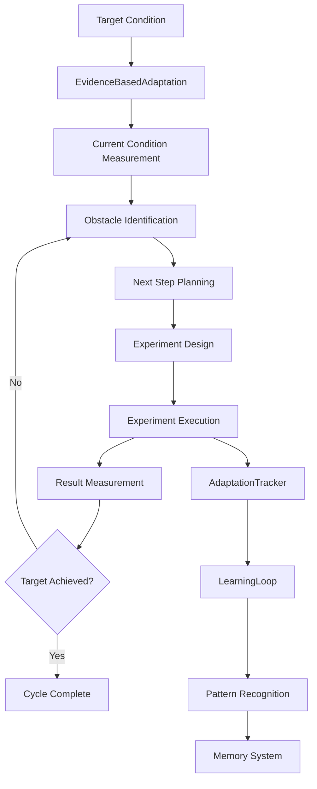
```mermaid
flowchart TB
    A[Target Condition] --> B[EvidenceBasedAdaptation]
    B --> C[Current Condition Measurement]
    C --> D[Obstacle Identification]
    D --> E[Next Step Planning]
    E --> F[Experiment Design]
    F --> G[Experiment Execution]
    G --> H[Result Measurement]
    H --> I{Target Achieved?}

    I -->|No| D
    I -->|Yes| J[Cycle Complete]

    G --> K[AdaptationTracker]
    K --> L[LearningLoop]
    L --> M[Pattern Recognition]
    M --> N[Memory System]
```

## State Transition Diagrams

### Kata Cycle State Machine

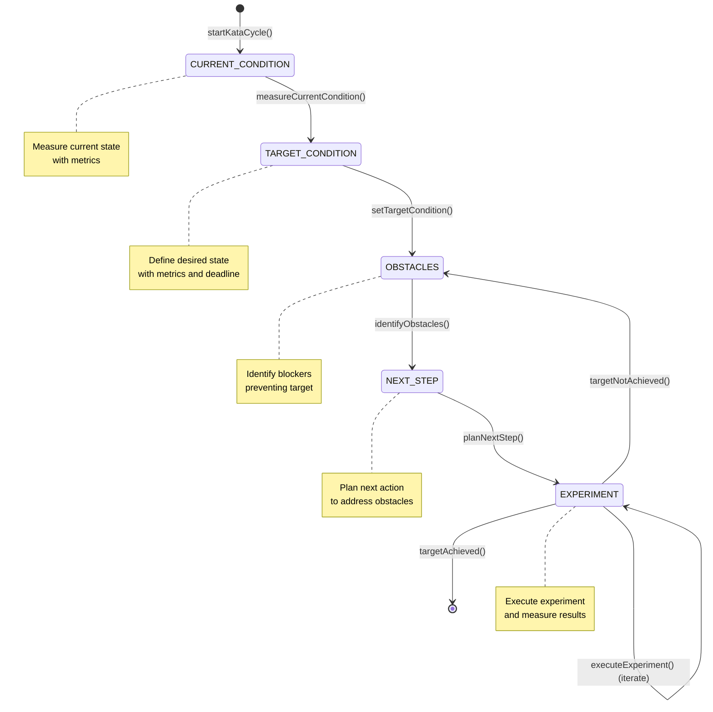
```mermaid
stateDiagram-v2
    [*] --> CURRENT_CONDITION: startKataCycle()

    CURRENT_CONDITION --> TARGET_CONDITION: measureCurrentCondition()
    TARGET_CONDITION --> OBSTACLES: setTargetCondition()
    OBSTACLES --> NEXT_STEP: identifyObstacles()
    NEXT_STEP --> EXPERIMENT: planNextStep()

    EXPERIMENT --> EXPERIMENT: executeExperiment() (iterate)
    EXPERIMENT --> OBSTACLES: targetNotAchieved()
    EXPERIMENT --> [*]: targetAchieved()

    note right of CURRENT_CONDITION
        Measure current state
        with metrics
    end note

    note right of TARGET_CONDITION
        Define desired state
        with metrics and deadline
    end note

    note right of OBSTACLES
        Identify blockers
        preventing target
    end note

    note right of NEXT_STEP
        Plan next action
        to address obstacles
    end note

    note right of EXPERIMENT
        Execute experiment
        and measure results
    end note
```

### Task Lifecycle State Machine

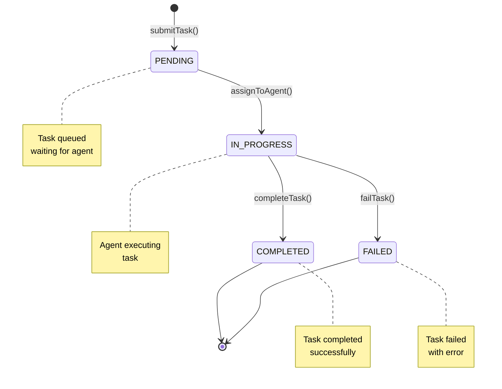
```mermaid
stateDiagram-v2
    [*] --> PENDING: submitTask()

    PENDING --> IN_PROGRESS: assignToAgent()
    IN_PROGRESS --> COMPLETED: completeTask()
    IN_PROGRESS --> FAILED: failTask()

    COMPLETED --> [*]
    FAILED --> [*]

    note right of PENDING
        Task queued
        waiting for agent
    end note

    note right of IN_PROGRESS
        Agent executing
        task
    end note

    note right of COMPLETED
        Task completed
        successfully
    end note

    note right of FAILED
        Task failed
        with error
    end note
```

### Validation State Machine

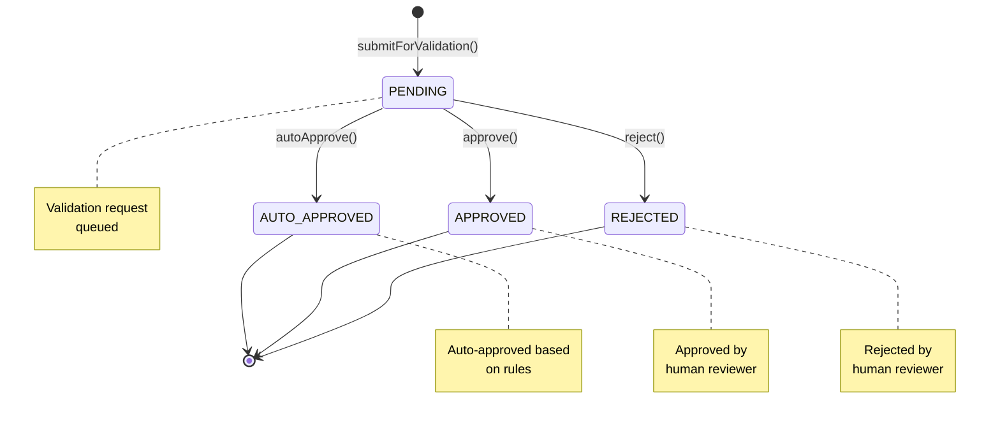
```mermaid
stateDiagram-v2
    [*] --> PENDING: submitForValidation()

    PENDING --> AUTO_APPROVED: autoApprove()
    PENDING --> APPROVED: approve()
    PENDING --> REJECTED: reject()

    AUTO_APPROVED --> [*]
    APPROVED --> [*]
    REJECTED --> [*]

    note right of PENDING
        Validation request
        queued
    end note

    note right of AUTO_APPROVED
        Auto-approved based
        on rules
    end note

    note right of APPROVED
        Approved by
        human reviewer
    end note

    note right of REJECTED
        Rejected by
        human reviewer
    end note
```

## Deployment Diagram

### System Deployment Architecture

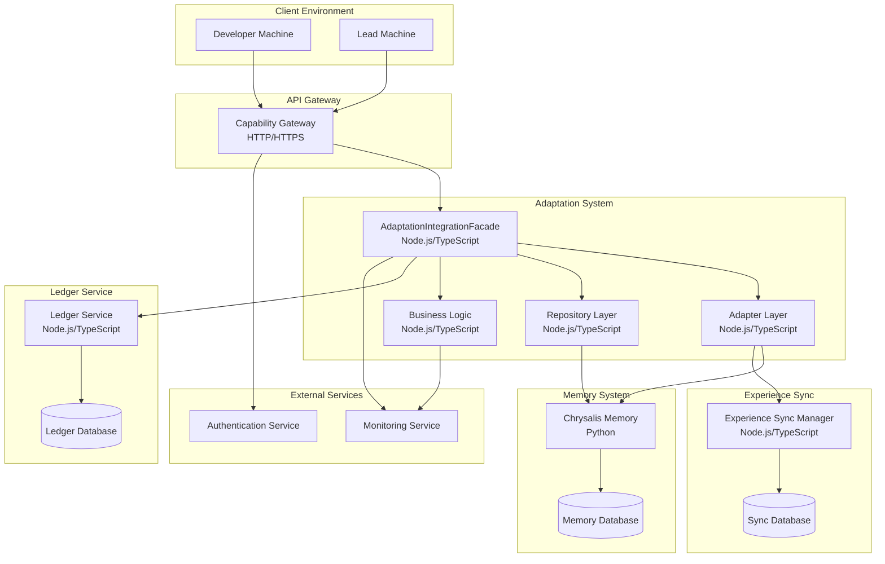
```mermaid
graph TB
    subgraph "Client Environment"
        DEV[Developer Machine]
        LEAD[Lead Machine]
    end

    subgraph "API Gateway"
        GATEWAY[Capability Gateway<br/>HTTP/HTTPS]
    end

    subgraph "Adaptation System"
        FACADE[AdaptationIntegrationFacade<br/>Node.js/TypeScript]
        ADAPTERS[Adapter Layer<br/>Node.js/TypeScript]
        REPO[Repository Layer<br/>Node.js/TypeScript]
        BUSINESS[Business Logic<br/>Node.js/TypeScript]
    end

    subgraph "Memory System"
        MEM_SYS[Chrysalis Memory<br/>Python]
        MEM_DB[(Memory Database)]
    end

    subgraph "Experience Sync"
        EXP_SYNC[Experience Sync Manager<br/>Node.js/TypeScript]
        EXP_DB[(Sync Database)]
    end

    subgraph "Ledger Service"
        LEDGER[Ledger Service<br/>Node.js/TypeScript]
        LEDGER_DB[(Ledger Database)]
    end

    subgraph "External Services"
        AUTH[Authentication Service]
        MONITOR[Monitoring Service]
    end

    DEV --> GATEWAY
    LEAD --> GATEWAY

    GATEWAY --> FACADE
    GATEWAY --> AUTH

    FACADE --> ADAPTERS
    FACADE --> REPO
    FACADE --> BUSINESS

    ADAPTERS --> MEM_SYS
    ADAPTERS --> EXP_SYNC

    REPO --> MEM_SYS
    MEM_SYS --> MEM_DB

    FACADE --> LEDGER
    LEDGER --> LEDGER_DB

    EXP_SYNC --> EXP_DB

    FACADE --> MONITOR
    BUSINESS --> MONITOR
```

### Component Deployment

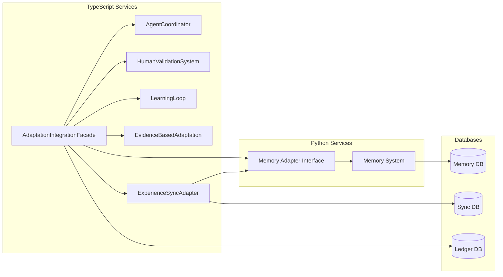
```mermaid
graph LR
    subgraph "TypeScript Services"
        TS1[AdaptationIntegrationFacade]
        TS2[AgentCoordinator]
        TS3[HumanValidationSystem]
        TS4[LearningLoop]
        TS5[EvidenceBasedAdaptation]
        TS6[ExperienceSyncAdapter]
    end

    subgraph "Python Services"
        PY1[Memory System]
        PY2[Memory Adapter Interface]
    end

    subgraph "Databases"
        DB1[(Memory DB)]
        DB2[(Sync DB)]
        DB3[(Ledger DB)]
    end

    TS1 --> TS2
    TS1 --> TS3
    TS1 --> TS4
    TS1 --> TS5
    TS1 --> TS6

    TS6 --> PY2
    TS1 --> PY2
    PY2 --> PY1

    PY1 --> DB1
    TS6 --> DB2
    TS1 --> DB3
```

## Design Pattern Visualization

### Facade Pattern

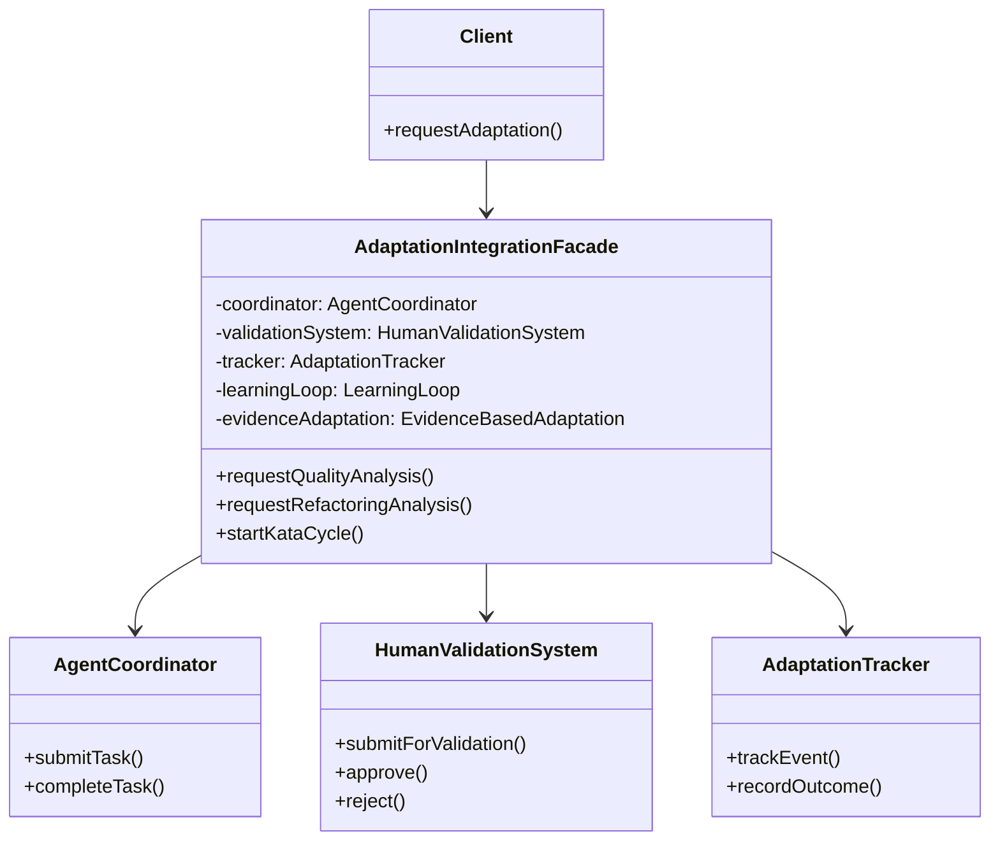
```mermaid
classDiagram
    class Client {
        +requestAdaptation()
    }

    class AdaptationIntegrationFacade {
        -coordinator: AgentCoordinator
        -validationSystem: HumanValidationSystem
        -tracker: AdaptationTracker
        -learningLoop: LearningLoop
        -evidenceAdaptation: EvidenceBasedAdaptation
        +requestQualityAnalysis()
        +requestRefactoringAnalysis()
        +startKataCycle()
    }

    class AgentCoordinator {
        +submitTask()
        +completeTask()
    }

    class HumanValidationSystem {
        +submitForValidation()
        +approve()
        +reject()
    }

    class AdaptationTracker {
        +trackEvent()
        +recordOutcome()
    }

    Client --> AdaptationIntegrationFacade
    AdaptationIntegrationFacade --> AgentCoordinator
    AdaptationIntegrationFacade --> HumanValidationSystem
    AdaptationIntegrationFacade --> AdaptationTracker
```

### Adapter Pattern

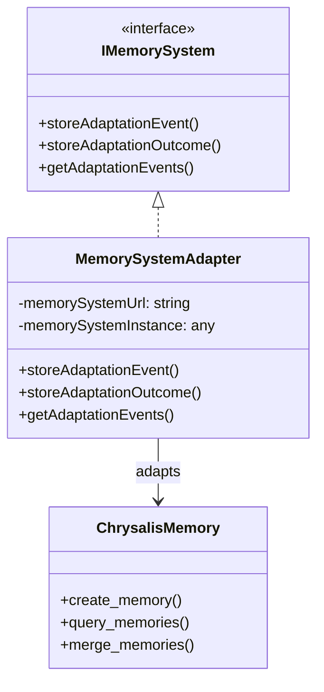
```mermaid
classDiagram
    class IMemorySystem {
        <<interface>>
        +storeAdaptationEvent()
        +storeAdaptationOutcome()
        +getAdaptationEvents()
    }

    class MemorySystemAdapter {
        -memorySystemUrl: string
        -memorySystemInstance: any
        +storeAdaptationEvent()
        +storeAdaptationOutcome()
        +getAdaptationEvents()
    }

    class ChrysalisMemory {
        +create_memory()
        +query_memories()
        +merge_memories()
    }

    IMemorySystem <|.. MemorySystemAdapter
    MemorySystemAdapter --> ChrysalisMemory : adapts
```

### Repository Pattern

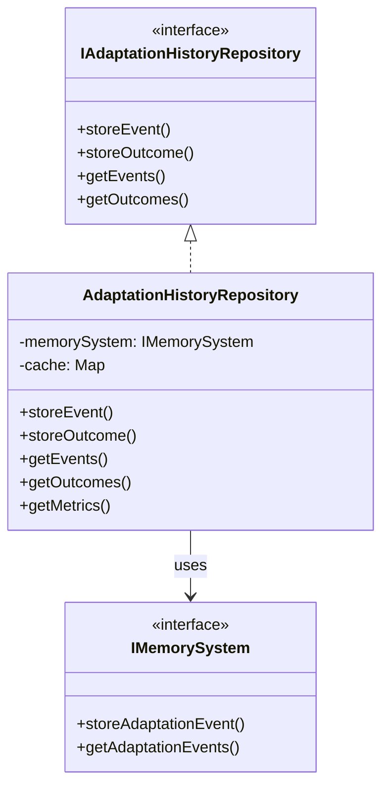
```mermaid
classDiagram
    class IAdaptationHistoryRepository {
        <<interface>>
        +storeEvent()
        +storeOutcome()
        +getEvents()
        +getOutcomes()
    }

    class AdaptationHistoryRepository {
        -memorySystem: IMemorySystem
        -cache: Map
        +storeEvent()
        +storeOutcome()
        +getEvents()
        +getOutcomes()
        +getMetrics()
    }

    class IMemorySystem {
        <<interface>>
        +storeAdaptationEvent()
        +getAdaptationEvents()
    }

    IAdaptationHistoryRepository <|.. AdaptationHistoryRepository
    AdaptationHistoryRepository --> IMemorySystem : uses
```

### Strategy Pattern

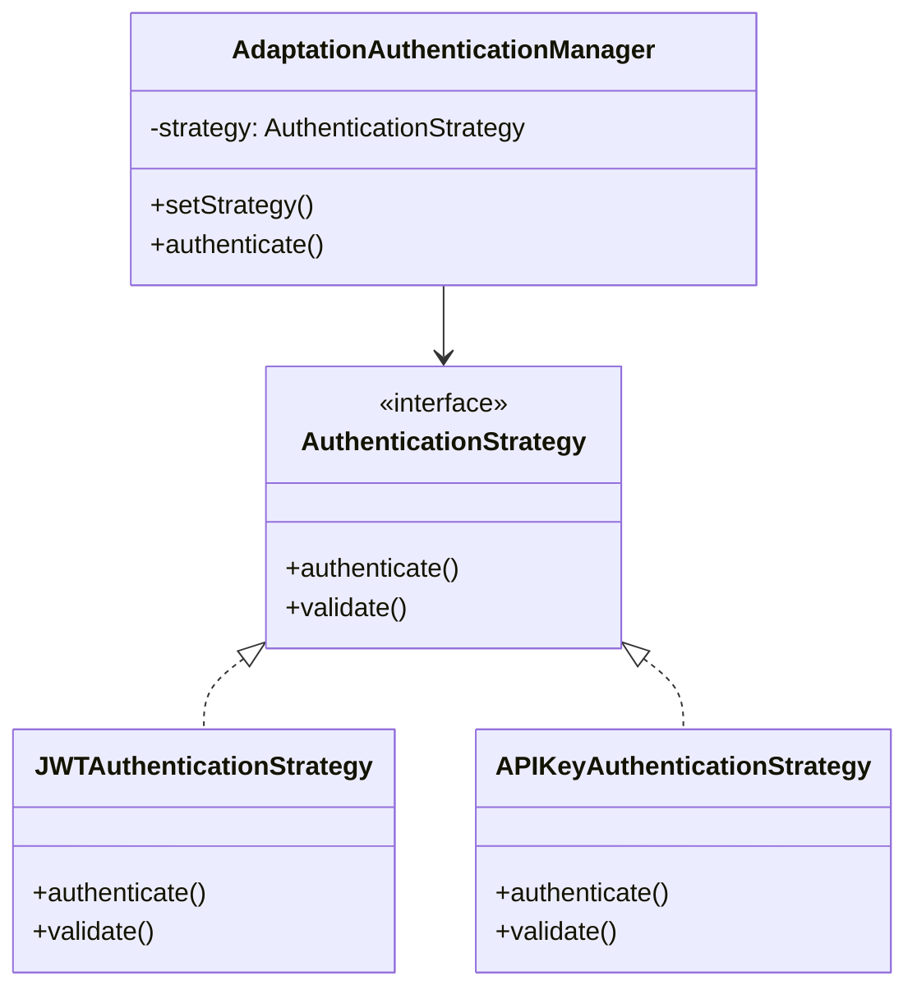
```mermaid
classDiagram
    class AuthenticationStrategy {
        <<interface>>
        +authenticate()
        +validate()
    }

    class JWTAuthenticationStrategy {
        +authenticate()
        +validate()
    }

    class APIKeyAuthenticationStrategy {
        +authenticate()
        +validate()
    }

    class AdaptationAuthenticationManager {
        -strategy: AuthenticationStrategy
        +setStrategy()
        +authenticate()
    }

    AuthenticationStrategy <|.. JWTAuthenticationStrategy
    AuthenticationStrategy <|.. APIKeyAuthenticationStrategy
    AdaptationAuthenticationManager --> AuthenticationStrategy
```

## References

1. Gamma, E., Helm, R., Johnson, R., & Vlissides, J. (1994). *Design Patterns: Elements of Reusable Object-Oriented Software*. Addison-Wesley.

2. Fowler, M. (2002). *Patterns of Enterprise Application Architecture*. Addison-Wesley.

3. Rother, M. (2009). *Toyota Kata: Managing People for Improvement, Adaptiveness and Superior Results*. McGraw-Hill Education.

4. Mermaid Documentation: https://mermaid.js.org/
