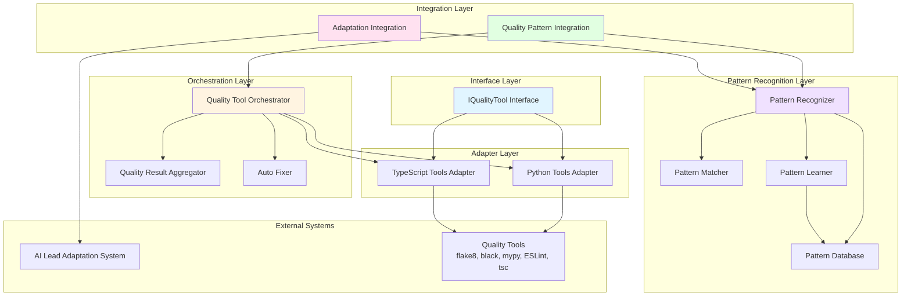
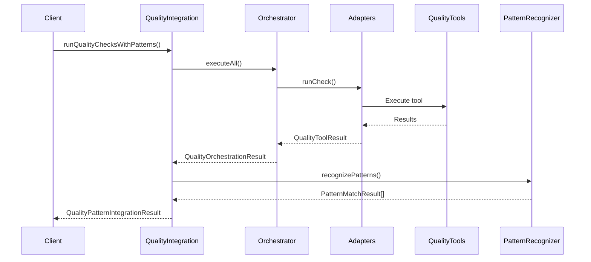
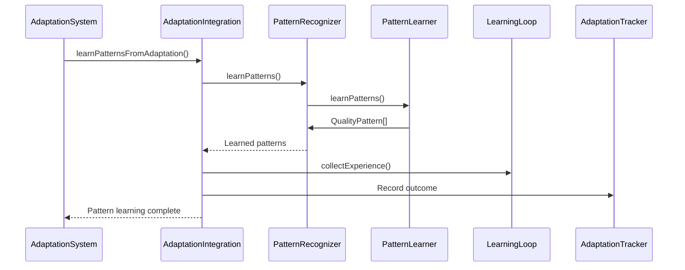
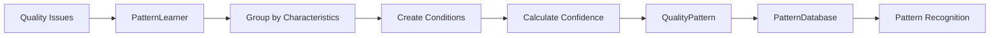

# Quality System Architecture

**Version**: 1.0.0
**Date**: 2025-01-XX
**Purpose**: Comprehensive architectural documentation for the Self-Adapting Code Quality system

---

## Executive Summary

The Quality System provides unified code quality enforcement, automated fixing, and pattern-based learning for continuous improvement. It integrates with the AI Lead Adaptation System to enable self-evolving code quality rules.

---

## Table of Contents

1. [Architecture Overview](#architecture-overview)
2. [Component Architecture](#component-architecture)
3. [Integration Architecture](#integration-architecture)
4. [Design Patterns](#design-patterns)
5. [Data Flow](#data-flow)
6. [Implementation References](#implementation-references)

---

## Architecture Overview

### System Layers

The Quality System is organized into five layers:

1. **Interface Layer** - Unified tool interfaces
2. **Adapter Layer** - Tool-specific implementations
3. **Orchestration Layer** - Tool execution coordination
4. **Pattern Recognition Layer** - Learning and adaptation
5. **Integration Layer** - External system integration

### Architecture Diagram



---

## Component Architecture

### 1. Interface Layer

**Component**: `IQualityTool`

**Purpose**: Provides unified interface for all quality tools.

**Design Pattern**: Strategy Pattern (GoF, p. 315)

**References**:
- Gamma, E., Helm, R., Johnson, R., & Vlissides, J. (1994). *Design Patterns: Elements of Reusable Object-Oriented Software*. Addison-Wesley. p. 315.
- [Strategy Pattern - Refactoring Guru](https://refactoring.guru/design-patterns/strategy)

**Key Methods**:
- `isAvailable()`: Check if tool is available
- `runCheck()`: Run quality check
- `applyFixes()`: Apply automatic fixes (optional)

**File**: `src/quality/tools/QualityToolInterface.ts`

---

### 2. Adapter Layer

**Components**:
- `PythonToolsAdapter` (Flake8Adapter, BlackAdapter, MyPyAdapter)
- `TypeScriptToolsAdapter` (ESLintAdapter, TypeScriptCompilerAdapter)

**Purpose**: Adapts external quality tools to unified interface.

**Design Pattern**: Adapter Pattern (GoF, p. 139)

**References**:
- Gamma, E., Helm, R., Johnson, R., & Vlissides, J. (1994). *Design Patterns: Elements of Reusable Object-Oriented Software*. Addison-Wesley. p. 139.
- [Adapter Pattern - Refactoring Guru](https://refactoring.guru/design-patterns/adapter)

**Files**:
- `src/quality/tools/PythonToolsAdapter.ts`
- `src/quality/tools/TypeScriptToolsAdapter.ts`

---

### 3. Orchestration Layer

**Component**: `QualityToolOrchestrator`

**Purpose**: Orchestrates execution of multiple quality tools.

**Design Pattern**: Facade Pattern (GoF, p. 185)

**References**:
- Gamma, E., Helm, R., Johnson, R., & Vlissides, J. (1994). *Design Patterns: Elements of Reusable Object-Oriented Software*. Addison-Wesley. p. 185.
- [Facade Pattern - Refactoring Guru](https://refactoring.guru/design-patterns/facade)

**Key Features**:
- Parallel or sequential execution
- Tool registration and management
- Result aggregation
- Error handling

**File**: `src/quality/tools/QualityToolOrchestrator.ts`

---

### 4. Pattern Recognition Layer

**Components**:
- `QualityPatternDatabase` - Pattern storage (Repository Pattern)
- `PatternMatcher` - Pattern matching (Strategy Pattern)
- `PatternLearner` - Pattern learning (Template Method Pattern)
- `QualityPatternRecognizer` - Unified orchestrator (Facade Pattern)

**Purpose**: Learns and recognizes quality patterns from issues.

**Design Patterns**:
- Repository Pattern (Fowler, "Patterns of Enterprise Application Architecture")
- Strategy Pattern (GoF, p. 315)
- Template Method Pattern (GoF, p. 325)
- Facade Pattern (GoF, p. 185)

**References**:
- Fowler, M. (2002). *Patterns of Enterprise Application Architecture*. Addison-Wesley.
- Gamma, E., Helm, R., Johnson, R., & Vlissides, J. (1994). *Design Patterns: Elements of Reusable Object-Oriented Software*. Addison-Wesley. p. 315, 325, 185.
- [Repository Pattern - Microsoft](https://docs.microsoft.com/en-us/dotnet/architecture/microservices/microservice-ddd-cqrs-patterns/infrastructure-persistence-layer-design)
- [Template Method Pattern - Refactoring Guru](https://refactoring.guru/design-patterns/template-method)

**Files**:
- `src/quality/patterns/QualityPatternDatabase.ts`
- `src/quality/patterns/PatternMatcher.ts`
- `src/quality/patterns/PatternLearner.ts`
- `src/quality/patterns/QualityPatternRecognizer.ts`

---

### 5. Integration Layer

**Components**:
- `QualityPatternIntegration` - Integrates patterns with quality tools
- `AdaptationIntegration` - Integrates with AI Lead Adaptation System

**Purpose**: Provides integration between quality system and external systems.

**Design Patterns**:
- Facade Pattern (GoF, p. 185)
- Adapter Pattern (GoF, p. 139)
- Observer Pattern (GoF, p. 293)

**References**:
- Gamma, E., Helm, R., Johnson, R., & Vlissides, J. (1994). *Design Patterns: Elements of Reusable Object-Oriented Software*. Addison-Wesley. p. 139, 185, 293.
- [Observer Pattern - Refactoring Guru](https://refactoring.guru/design-patterns/observer)

**Files**:
- `src/quality/integration/QualityPatternIntegration.ts`
- `src/quality/integration/AdaptationIntegration.ts`

---

## Integration Architecture

### Integration with Quality Tools



### Integration with AI Lead Adaptation System



---

## Data Flow

### Quality Check Flow

```mermaid
flowchart LR
    A[Quality Check Request] --> B[QualityToolOrchestrator]
    B --> C[Tool Adapters]
    C --> D[External Tools]
    D --> E[Tool Results]
    E --> F[QualityResultAggregator]
    F --> G[Quality Issues]
    G --> H[PatternRecognizer]
    H --> I[Pattern Matches]
    I --> J[Suggestions]
    J --> K[Response]
```



### Pattern Learning Flow



---

## Design Patterns

### Pattern Summary

| Component | Design Pattern | Reference |
|-----------|---------------|-----------|
| IQualityTool | Strategy | GoF, p. 315 |
| PythonToolsAdapter | Adapter | GoF, p. 139 |
| TypeScriptToolsAdapter | Adapter | GoF, p. 139 |
| QualityToolOrchestrator | Facade | GoF, p. 185 |
| QualityResultAggregator | Facade | GoF, p. 185 |
| QualityPatternDatabase | Repository | Fowler, EAA |
| PatternMatcher | Strategy | GoF, p. 315 |
| PatternLearner | Template Method | GoF, p. 325 |
| QualityPatternRecognizer | Facade | GoF, p. 185 |
| AutoFixer | Facade | GoF, p. 185 |
| QualityPatternIntegration | Facade + Adapter | GoF, p. 139, 185 |
| AdaptationIntegration | Adapter + Observer | GoF, p. 139, 293 |

**References**:
- Gamma, E., Helm, R., Johnson, R., & Vlissides, J. (1994). *Design Patterns: Elements of Reusable Object-Oriented Software*. Addison-Wesley.
- Fowler, M. (2002). *Patterns of Enterprise Application Architecture*. Addison-Wesley.

---

## Implementation References

### Academic and Industry Standards

1. **Design Patterns**:
   - Gamma, E., Helm, R., Johnson, R., & Vlissides, J. (1994). *Design Patterns: Elements of Reusable Object-Oriented Software*. Addison-Wesley. [ISBN: 0-201-63361-2](https://www.pearson.com/en-us/subject-catalog/p/Gamma-Design-Patterns-Elements-of-Reusable-ObjectOriented-Software/P200000006499/9780201633610)
   - Fowler, M. (2002). *Patterns of Enterprise Application Architecture*. Addison-Wesley. [ISBN: 978-0321127426](https://martinfowler.com/books/eaa.html)

2. **Testing Patterns**:
   - Meszaros, G. (2007). *xUnit Test Patterns: Refactoring Test Code*. Addison-Wesley. [ISBN: 978-0131495050](https://www.amazon.com/xUnit-Test-Patterns-Refactoring-Code/dp/0131495054)

3. **Continuous Improvement**:
   - Rother, M. (2009). *Toyota Kata: Managing People for Improvement, Adaptiveness and Superior Results*. McGraw-Hill. [ISBN: 978-0071635233](https://www.mike-rother.com/Toyota-Kata)
   - [Toyota Kata Website](https://www.mike-rother.com/Toyota-Kata)

4. **Quality Tools**:
   - [Black - The uncompromising code formatter](https://black.readthedocs.io/)
   - [Flake8 - Python style guide enforcement](https://flake8.pycqa.org/)
   - [MyPy - Static type checker for Python](https://mypy.readthedocs.io/)
   - [ESLint - Pluggable JavaScript linter](https://eslint.org/)
   - [TypeScript - Typed JavaScript at scale](https://www.typescriptlang.org/)

### Architecture Patterns

1. **Repository Pattern**:
   - [Repository Pattern - Microsoft Documentation](https://docs.microsoft.com/en-us/dotnet/architecture/microservices/microservice-ddd-cqrs-patterns/infrastructure-persistence-layer-design)
   - [Repository Pattern - Martin Fowler](https://martinfowler.com/eaaCatalog/repository.html)

2. **Strategy Pattern**:
   - [Strategy Pattern - Refactoring Guru](https://refactoring.guru/design-patterns/strategy)
   - [Strategy Pattern - SourceMaking](https://sourcemaking.com/design_patterns/strategy)

3. **Facade Pattern**:
   - [Facade Pattern - Refactoring Guru](https://refactoring.guru/design-patterns/facade)
   - [Facade Pattern - SourceMaking](https://sourcemaking.com/design_patterns/facade)

4. **Adapter Pattern**:
   - [Adapter Pattern - Refactoring Guru](https://refactoring.guru/design-patterns/adapter)
   - [Adapter Pattern - SourceMaking](https://sourcemaking.com/design_patterns/adapter)

5. **Template Method Pattern**:
   - [Template Method Pattern - Refactoring Guru](https://refactoring.guru/design-patterns/template-method)
   - [Template Method Pattern - SourceMaking](https://sourcemaking.com/design_patterns/template_method)

6. **Observer Pattern**:
   - [Observer Pattern - Refactoring Guru](https://refactoring.guru/design-patterns/observer)
   - [Observer Pattern - SourceMaking](https://sourcemaking.com/design_patterns/observer)

---

## Logical Architecture Basis

### Design Principles

1. **Separation of Concerns**: Each layer has a distinct responsibility
2. **Dependency Inversion**: High-level modules depend on abstractions (interfaces)
3. **Open/Closed Principle**: Open for extension, closed for modification
4. **Single Responsibility**: Each class has one reason to change
5. **Interface Segregation**: Interfaces are focused and minimal

**References**:
- Martin, R. C. (2003). *Agile Software Development, Principles, Patterns, and Practices*. Prentice Hall.
- [SOLID Principles - Wikipedia](https://en.wikipedia.org/wiki/SOLID)
- [SOLID Principles - Refactoring Guru](https://refactoring.guru/solid-principles)

### Learning and Adaptation Model

The system follows the **Complex Learner Pattern** and **Toyota Kata** principles:

1. **Current Condition**: Measure current quality metrics
2. **Target Condition**: Define quality goals
3. **Obstacles**: Identify quality issues and patterns
4. **Experiments**: Apply fixes and measure outcomes
5. **Learning**: Update patterns based on results

**References**:
- Rother, M. (2009). *Toyota Kata: Managing People for Improvement, Adaptiveness and Superior Results*. McGraw-Hill.
- [Toyota Kata - Mike Rother](https://www.mike-rother.com/Toyota-Kata)

---

## Implementation Status

### Phase 1: Foundation ✅ COMPLETE
- Quality Tool Interface
- Python Tools Adapter
- TypeScript Tools Adapter
- Quality Tool Orchestrator
- Quality Result Aggregator
- Enhanced Metrics Collection
- CI/CD Quality Gates

### Phase 2: Excellence ✅ COMPLETE
- AutoFixer System
- CI/CD Auto-Fix Workflow
- CLI Interface
- Quality Pattern Recognition
- Pattern Database
- Pattern Matcher
- Pattern Learner
- Quality Pattern Recognizer

### Phase 3: Integration ✅ COMPLETE
- Quality Pattern Integration
- Adaptation Integration
- Integration Tests

---

## Future Enhancements

1. **Quality Visualization**: Dashboards and reports
2. **Pattern Sharing**: Cross-project pattern sharing
3. **Advanced Learning**: Machine learning-based pattern recognition
4. **Real-time Monitoring**: Continuous quality monitoring
5. **Custom Rule Engine**: User-defined quality rules

---

## Appendices

### Appendix A: File Structure

```
src/quality/
├── tools/
│   ├── QualityToolInterface.ts
│   ├── PythonToolsAdapter.ts
│   ├── TypeScriptToolsAdapter.ts
│   ├── QualityToolOrchestrator.ts
│   ├── QualityResultAggregator.ts
│   └── index.ts
├── auto-fix/
│   ├── AutoFixer.ts
│   └── index.ts
├── patterns/
│   ├── QualityPattern.ts
│   ├── QualityPatternDatabase.ts
│   ├── PatternMatcher.ts
│   ├── PatternLearner.ts
│   ├── QualityPatternRecognizer.ts
│   └── index.ts
└── integration/
    ├── QualityPatternIntegration.ts
    ├── AdaptationIntegration.ts
    └── index.ts
```

### Appendix B: Design Pattern Citations

All design patterns are cited from:
- Gamma, E., Helm, R., Johnson, R., & Vlissides, J. (1994). *Design Patterns: Elements of Reusable Object-Oriented Software*. Addison-Wesley. ISBN: 0-201-63361-2

Repository Pattern:
- Fowler, M. (2002). *Patterns of Enterprise Application Architecture*. Addison-Wesley. ISBN: 978-0321127426
