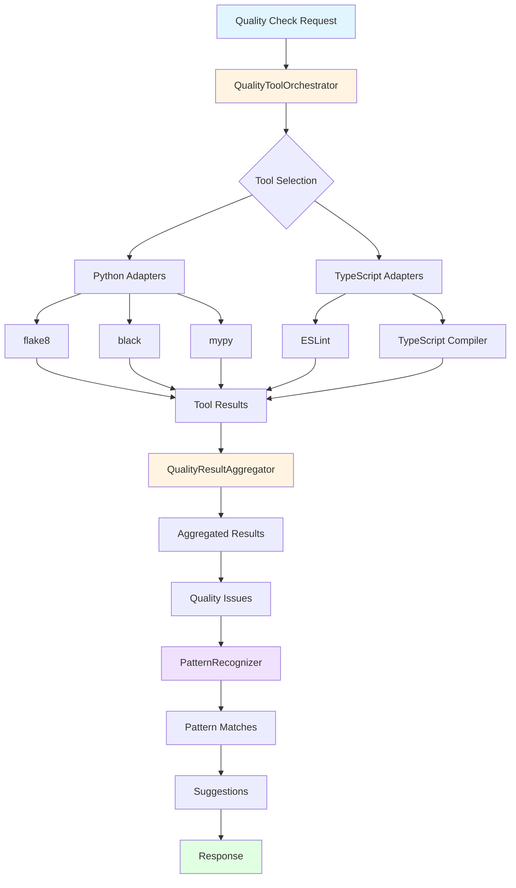
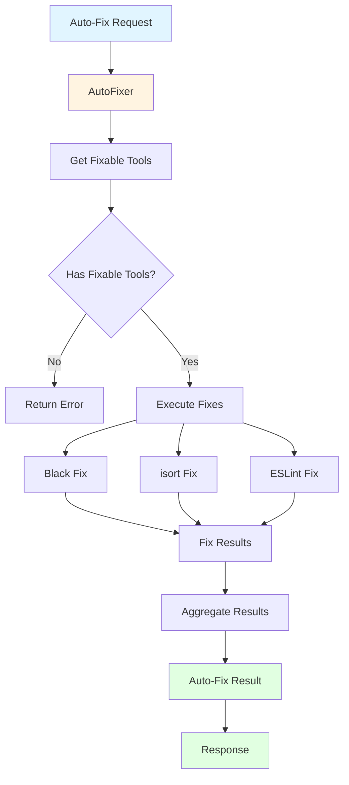
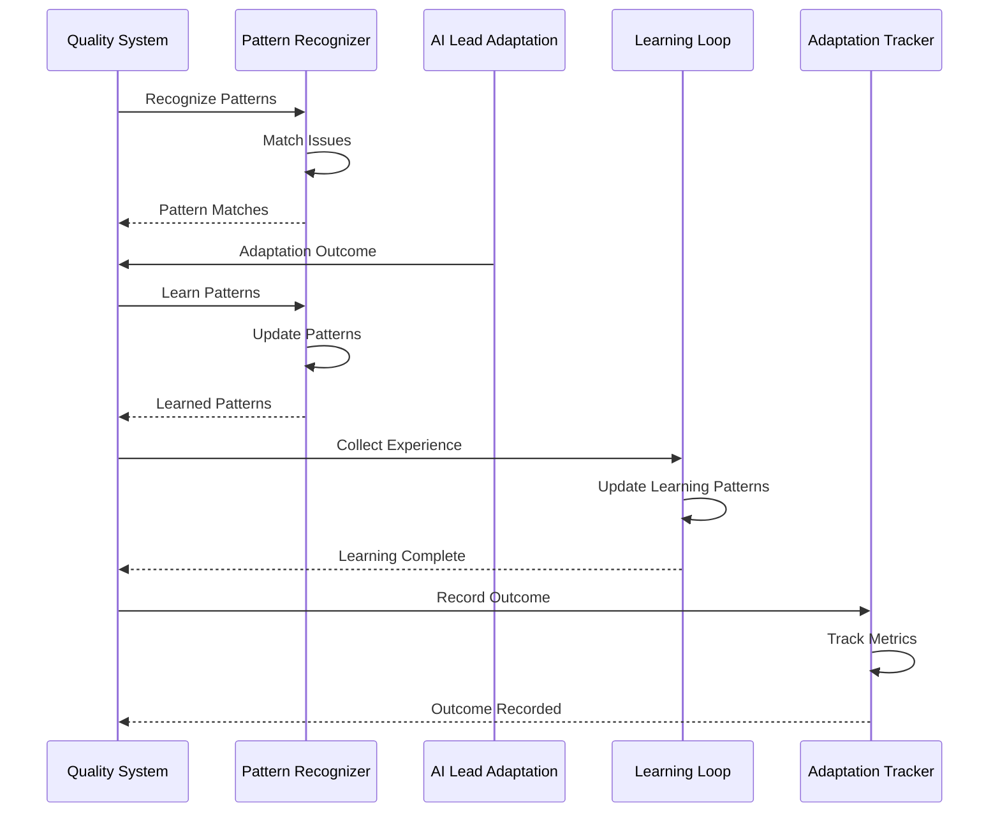

# Quality System Data Flow

**Version**: 1.0.0
**Date**: 2025-01-XX
**Purpose**: Data flow documentation for Quality System

---

## Data Flow Diagrams

### Quality Check Flow



### Pattern Learning Flow

```mermaid
flowchart LR
    A[Quality Issues] --> B[PatternLearner]
    B --> C[Group by Characteristics]
    C --> D[Extract Common Patterns]
    D --> E[Create Conditions]
    E --> F[Calculate Confidence]
    F --> G[Create Actions]
    G --> H[QualityPattern]
    H --> I[PatternDatabase]
    I --> J[Pattern Recognition]

    style A fill:#ffe1e1
    style B fill:#f0e1ff
    style H fill:#e1ffe1
    style I fill:#e1ffe1
    style J fill:#e1ffe1
```



### Auto-Fix Flow



### Integration with AI Lead Adaptation



---

## Data Structures

### Quality Issue Flow

```
QualityToolResult
  ├── errors: QualityIssue[]
  ├── warnings: QualityIssue[]
  └── metrics: QualityMetrics

QualityIssue
  ├── severity: 'error' | 'warning' | 'info'
  ├── rule_id: string
  ├── message: string
  ├── file_path: string
  └── line_number: number

↓ (Aggregation)

AggregatedQualityReport
  ├── summary: QualitySummary
  ├── by_tool: Map<string, QualityToolResult>
  ├── by_file: Map<string, FileQualityReport>
  └── by_severity: { errors, warnings, info }

↓ (Pattern Recognition)

PatternMatchResult[]
  ├── pattern: QualityPattern
  ├── match_score: number
  └── suggestions: string[]
```

---

## References

- [Mermaid Diagram Syntax](https://mermaid.js.org/intro/)
- [Sequence Diagrams - UML](https://www.uml-diagrams.org/sequence-diagrams.html)
- [Flowchart - Wikipedia](https://en.wikipedia.org/wiki/Flowchart)
