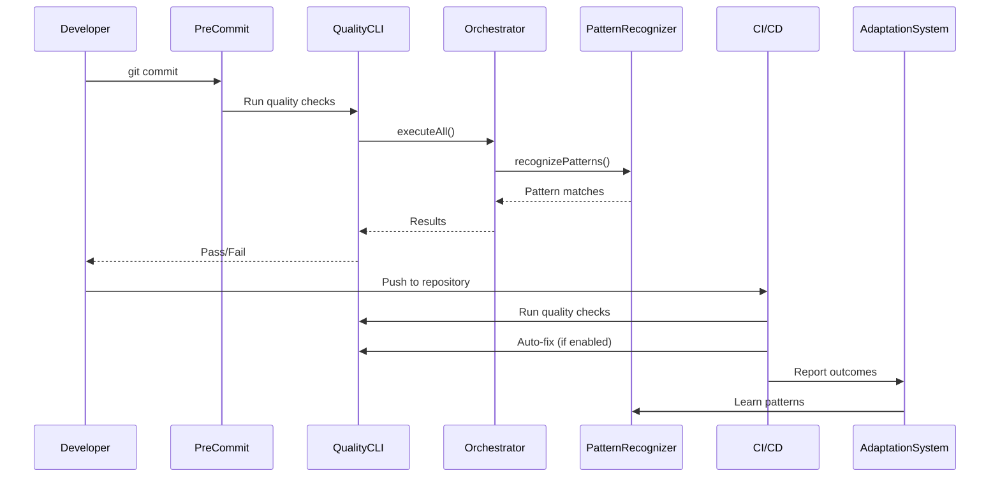

# Quality System Integration Guide

**Version**: 1.0.0
**Date**: 2025-01-XX
**Purpose**: Integration guide for Quality System with external systems

---

## Overview

This document describes how to integrate the Quality System with:
1. Quality Tools (flake8, black, mypy, ESLint, tsc)
2. AI Lead Adaptation System
3. CI/CD Pipelines
4. Pre-commit Hooks

---

## Integration with Quality Tools

### Basic Usage

```typescript
import { QualityToolOrchestrator } from './src/quality/tools/QualityToolOrchestrator';
import { Flake8Adapter } from './src/quality/tools/PythonToolsAdapter';
import { ESLintAdapter } from './src/quality/tools/TypeScriptToolsAdapter';

const orchestrator = new QualityToolOrchestrator();
const projectRoot = process.cwd();

// Register tools
orchestrator.registerTools([
    new Flake8Adapter(projectRoot),
    new ESLintAdapter(projectRoot),
]);

// Run quality checks
const result = await orchestrator.executeAll(projectRoot, {
    parallel: true,
    timeout_ms: 300000,
});

console.log(`Tools executed: ${result.tools_executed}`);
console.log(`Total issues: ${result.aggregated_metrics.total_issues}`);
```

---

## Integration with Pattern Recognition

### Quality Checks with Pattern Recognition

```typescript
import { QualityPatternIntegration } from './src/quality/integration/QualityPatternIntegration';
import { QualityPatternRecognizer } from './src/quality/patterns/QualityPatternRecognizer';
import { QualityPatternDatabase } from './src/quality/patterns/QualityPatternDatabase';

const database = new QualityPatternDatabase('./data/patterns.json');
const recognizer = new QualityPatternRecognizer(database, {
    min_confidence: 0.5,
    min_frequency: 3,
    enable_learning: true,
});

await recognizer.initialize();

const integration = new QualityPatternIntegration(
    orchestrator,
    recognizer
);

// Run quality checks with pattern recognition
const result = await integration.runQualityChecksWithPatterns(projectRoot, {
    enable_learning: true,
});

console.log(`Pattern matches: ${result.pattern_matches.length}`);
console.log(`Learned patterns: ${result.learned_patterns.length}`);
console.log(`Suggestions:`, result.suggestions);
```

---

## Integration with AI Lead Adaptation System

### Learning Patterns from Adaptations

```typescript
import { AdaptationIntegration } from './src/quality/integration/AdaptationIntegration';
import { LearningLoop } from './src/adaptation/LearningLoop';
import { AdaptationTracker } from './src/adaptation/AdaptationTracker';

const adaptationTracker = new AdaptationTracker();
const learningLoop = new LearningLoop(adaptationTracker);
const integration = new AdaptationIntegration(
    learningLoop,
    adaptationTracker,
    recognizer
);

// Learn patterns from adaptation outcome
await integration.learnPatternsFromAdaptation(
    adaptationOutcome,
    qualityIssues
);

// Get adaptation insights
const insights = await integration.getAdaptationInsights(qualityIssues);
console.log(`Recognized patterns: ${insights.recognized_patterns}`);
console.log(`Suggestions:`, insights.suggestions);
```

---

## Integration with CI/CD

### GitHub Actions Workflow

The quality system is integrated via `.github/workflows/quality.yml`:

```yaml
name: Quality Checks

on:
  pull_request:
    branches: [main, develop]

jobs:
  quality:
    runs-on: ubuntu-latest
    steps:
      - uses: actions/checkout@v4
      - name: Run Quality Checks
        run: |
          npm run build
          node dist/cli/quality-cli.js check .
```

### Auto-Fix Workflow

Auto-fix is integrated via `.github/workflows/auto-fix.yml`:

```yaml
name: Auto-Fix Quality Issues

on:
  pull_request:
    branches: [main, develop]

jobs:
  auto-fix:
    runs-on: ubuntu-latest
    steps:
      - uses: actions/checkout@v4
      - name: Auto-Fix
        run: |
          npm run build
          node dist/cli/quality-cli.js fix .
```

---

## Integration with Pre-commit Hooks

Pre-commit hooks are configured in `.pre-commit-config.yaml`:

```yaml
repos:
  - repo: https://github.com/psf/black
    rev: 23.12.1
    hooks:
      - id: black

  - repo: https://github.com/pycqa/isort
    rev: 5.13.2
    hooks:
      - id: isort
```

---

## Integration Sequence Diagram



---

## References

- [GitHub Actions Documentation](https://docs.github.com/en/actions)
- [Pre-commit Framework](https://pre-commit.com/)
- [Black Documentation](https://black.readthedocs.io/)
- [ESLint Documentation](https://eslint.org/)
