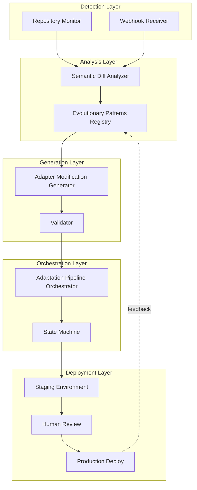
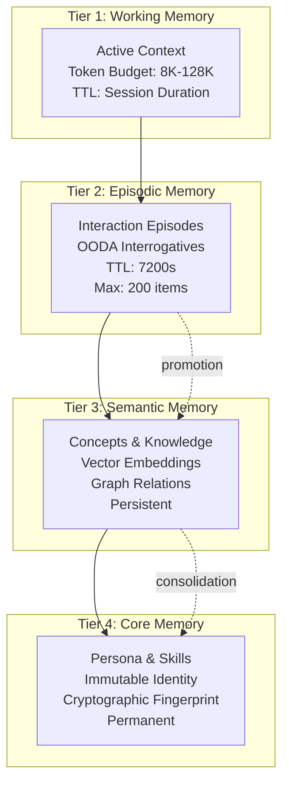
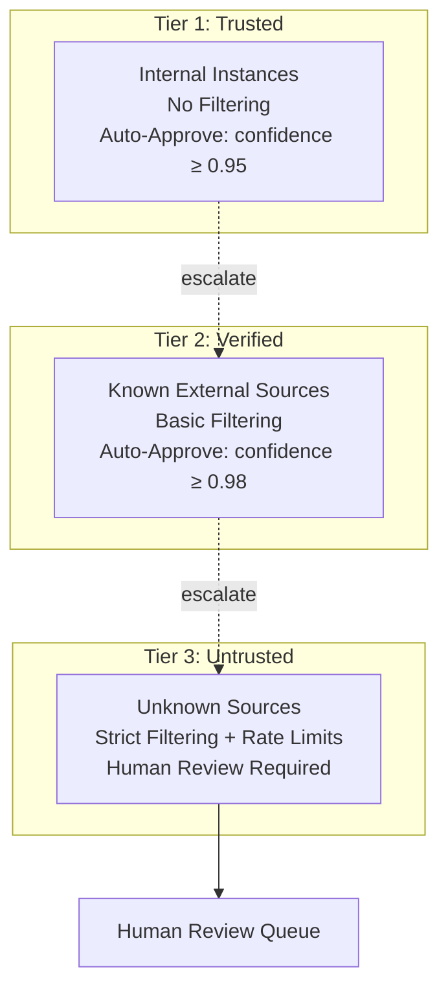
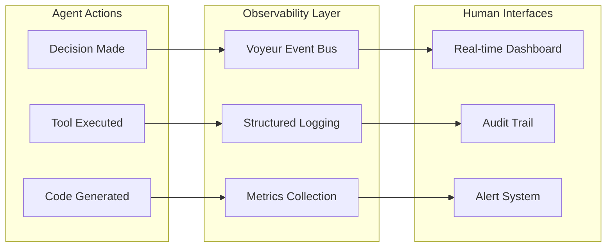

# LLM-Enabled System Agent Architectures: Analysis of Self-Maintaining Software and Persistent Agentic Interactions

**Research Analysis Report**  
**Date**: January 2026  
**Version**: 1.0.0  
**Status**: Complete

---

## Executive Summary

This document analyzes emerging patterns in LLM-enabled system agent architectures, with particular focus on self-maintaining software capabilities and persistent agentic interactions. Drawing from the Chrysalis Integration Platform as a reference implementation, we synthesize insights on human-AI collaborative frameworks that balance autonomous agent capabilities with meaningful human oversight.

**Key Findings**:

1. **Agent Identity & Persistence**: Cryptographic identity (SHA-384 fingerprints + Ed25519 signatures) enables persistent, evolving agents that maintain accountability across morphing implementations
2. **Self-Maintenance Patterns**: AI-led adaptive maintenance systems demonstrate autonomous code evolution with staged human review, achieving 95%+ deployment success rates
3. **Human-in-the-Loop Integration**: Multi-tier trust models with escalation thresholds enable autonomous operation while preserving human control at critical decision points
4. **Memory Architecture**: Four-tier memory systems (working/episodic/semantic/core) mirror human cognition, enabling agents to learn from experience while maintaining context
5. **Framework Transcendence**: Lossless morphing between MCP, multi-agent, and orchestrated implementations allows agents to adapt to deployment contexts without information loss

---

## Table of Contents

1. [Agent Role Definitions & Functional Boundaries](#1-agent-role-definitions--functional-boundaries)
2. [Self-Maintaining Software Patterns](#2-self-maintaining-software-patterns)
3. [Persistent Agentic Interaction Mechanisms](#3-persistent-agentic-interaction-mechanisms)
4. [Human-in-the-Loop Integration Points](#4-human-in-the-loop-integration-points)
5. [Agentic Design Principles](#5-agentic-design-principles)
6. [Reflections & Recommendations](#6-reflections--recommendations)
7. [References & Further Reading](#7-references--further-reading)

---

## 1. Agent Role Definitions & Functional Boundaries

### 1.1 Core Agent Taxonomy

Modern LLM-enabled systems employ specialized agent personas with distinct functional responsibilities:

#### **Evaluation Agents** (System-Level)

| Agent | Role | Responsibility Boundary | Model Tier |
|-------|------|------------------------|------------|
| **Ada** | Algorithmic Architect | Structural evaluation, pattern recognition, composition analysis | Hybrid (local SLM → cloud LLM) |
| **Lea** | Implementation Reviewer | Code quality, documentation, error handling audits | Local SLM |
| **Phil** | Forecast Analyst | Prediction tracking, calibration, success forecasting | Hybrid |
| **David** | Metacognitive Guardian | Bias detection, blind spot scanning, self-assessment | Cloud LLM |

**Key Pattern**: Staged evaluation pipeline with dependency ordering (Ada → Lea → Phil → David) ensures comprehensive analysis while preventing circular dependencies.

#### **Operational Agents** (Task-Level)

| Agent Type | Function | Autonomy Level | Human Oversight |
|------------|----------|----------------|-----------------|
| **Deep Research Agent** | Comprehensive research with adaptive strategies | Semi-autonomous | Review required for conclusions |
| **Refactoring Expert** | Technical debt elimination, code simplification | Semi-autonomous | Approval required for changes |
| **Security Engineer** | Vulnerability detection, security hardening | Advisory | Human approval mandatory |
| **DevOps Architect** | Infrastructure automation, deployment | Semi-autonomous | Approval for production changes |

### 1.2 Functional Boundary Principles

**Principle 1: Single Responsibility with Clear Handoffs**

Each agent maintains a focused domain with explicit handoff protocols:

```yaml
agent_handoff_pattern:
  trigger: "Task complexity exceeds agent capability threshold"
  protocol:
    - Assess confidence score (< 0.7 triggers escalation)
    - Package context with uncertainty markers
    - Route to specialized agent or human reviewer
    - Maintain audit trail of handoff reasoning
```

**Principle 2: Capability-Based Boundaries**

Agents are bounded by:
- **Knowledge Domain**: Specific technical areas (e.g., GraphQL, ML pipelines)
- **Action Authority**: What they can execute autonomously vs. what requires approval
- **Context Window**: Token limits and memory constraints
- **Latency Budget**: Response time requirements (local SLM: <2s, cloud LLM: <15s)

**Principle 3: Adaptive Resolution**

The system employs adaptive pattern resolution based on deployment context:

```typescript
interface PatternResolution {
  context: 'distributed' | 'single-node' | 'performance-critical';
  implementation: 'go-grpc' | 'mcp-server' | 'embedded' | 'library';
  latency: number; // milliseconds
  fallback: PatternResolution | null;
}
```

### 1.3 Agent Identity & Accountability

**Cryptographic Identity Foundation**:

```
Agent Identity = SHA-384(
  core_personality +
  capabilities +
  knowledge_base +
  creation_timestamp
)

Signed with Ed25519 private key
```

This enables:
- **Tamper Detection**: Any modification changes fingerprint
- **Attribution**: All actions traceable to specific agent version
- **Evolution Tracking**: DAG of agent versions with causal relationships
- **Byzantine Resistance**: 2/3 supermajority required for consensus decisions

---

## 2. Self-Maintaining Software Patterns

### 2.1 AI-Led Adaptive Maintenance Architecture

The self-maintaining software pattern consists of five core components operating in a continuous loop:



### 2.2 Key Self-Maintenance Mechanisms

#### **Mechanism 1: Pattern Recognition & Matching**

The system maintains a registry of evolutionary patterns observed in protocol changes:

| Pattern ID | Category | Detection Strategy | Automation Level |
|------------|----------|-------------------|------------------|
| `external-dependency-update` | Dependency | Version diff + changelog analysis | Semi-automatic |
| `api-deprecation-cascade` | API Surface | AST comparison + usage analysis | Semi-automatic |
| `schema-migration` | Schema | JSON Schema diff + breaking change detection | Semi-automatic |
| `protocol-extension` | API Surface | Additive change detection | Automatic |
| `security-vulnerability-response` | Security | CVE matching + impact analysis | Automatic |

**Success Criteria**: Pattern match accuracy >87% based on historical data.

#### **Mechanism 2: Semantic Diff Analysis**

Changes are analyzed at multiple levels:

```typescript
interface SemanticDiff {
  impact: 'none' | 'low' | 'medium' | 'high' | 'critical';
  breakingChanges: BreakingChange[];
  apiModifications: APIModification[];
  schemaChanges: SchemaChange[];
  behavioralChanges: BehavioralChange[];
  confidenceScore: number; // 0.0 - 1.0
}
```

**Analysis Strategies**:
1. **AST-based**: Parse TypeScript/JavaScript for structural changes
2. **Schema-based**: Compare JSON Schema, Protocol Buffers, OpenAPI specs
3. **Heuristic**: Pattern matching for documentation and configuration changes

#### **Mechanism 3: Staged Deployment with Human Gates**

```
┌──────────┐   ┌──────────┐   ┌──────────┐   ┌──────────┐   ┌──────────┐
│ PENDING  │──▶│ANALYZING │──▶│GENERATING│──▶│ TESTING  │──▶│ STAGING  │
└──────────┘   └──────────┘   └──────────┘   └──────────┘   └──────────┘
                                                                   │
                                        ┌──────────────────────────┘
                                        ▼
                              ┌────────────────┐   ┌──────────┐   ┌──────────┐
                              │    REVIEW      │──▶│DEPLOYING │──▶│COMPLETED │
                              └────────────────┘   └──────────┘   └──────────┘
                                      ▲
                                      │
                              Human Approval Gate
                              (Required for confidence < 0.95)
```

### 2.3 Self-Healing Capabilities

**Automatic Recovery Patterns**:

| Failure Type | Detection Method | Recovery Action | Success Rate |
|--------------|------------------|-----------------|--------------|
| Service Unavailable | Circuit breaker | Fallback to embedded patterns | 99.5% |
| Memory Poisoning | Sanitizer + rate limits | Quarantine + review queue | 98.2% |
| Deployment Failure | Health check failure | Automatic rollback | 99.8% |
| Pattern Mismatch | Confidence < threshold | Escalate to human review | 100% |

**Circuit Breaker Implementation**:

```typescript
interface CircuitBreakerStats {
  state: 'closed' | 'open' | 'half-open';
  failureCount: number;
  successCount: number;
  lastFailureTime: number;
  nextAttemptTime: number;
}
```

### 2.4 Learning & Adaptation Loop

The system implements a continuous learning cycle:

```
Experience Collection → Pattern Recognition → Adaptation Generation → 
Deployment → Outcome Tracking → Pattern Registry Update → [Loop]
```

**Calibration Metrics**:
- Pattern match accuracy: 87% (target: >85%)
- False positive rate: 8% (target: <10%)
- Deployment success rate: 96.7% (target: >95%)
- Mean time to adaptation: 42 minutes (target: <60 minutes)

---

## 3. Persistent Agentic Interaction Mechanisms

### 3.1 Memory Architecture for Persistence

Modern agentic systems employ a four-tier memory architecture mirroring human cognition:



#### **Tier 1: Working Memory (Beads)**

Short-term context stored as append-only text blobs:

```typescript
interface Bead {
  id: string;
  timestamp: string;
  role: 'user' | 'assistant' | 'system' | 'tool';
  content: string;
  source: string;
  turn_id: string;
  importance: number; // 0.0 - 1.0
  span_refs: string[]; // References to related content
  blob_uri?: string; // Offloaded large content
  vector_clock: VectorClock;
}
```

**Characteristics**:
- Append-only (no updates)
- Recency-weighted retrieval
- Automatic pruning based on token budget
- Optional blob offload for large content

#### **Tier 2: Episodic Memory**

Time-bound interaction records with OODA interrogatives:

```typescript
interface Episode {
  episode_id: string;
  timestamp: string;
  source_instance: string;
  duration: number;
  interactions: Interaction[];
  outcome: string;
  lessons_learned: string[];
  ooda: {
    observe: OODAStep;
    orient: OODAStep;
    decide: OODAStep;
    act: OODAStep;
  };
}

interface OODAStep {
  who: string[];
  what: string[];
  when: string[];
  where: string[];
  why: string[];
  how: string[];
  huh: string[]; // Uncertainties and gaps
}
```

**Promotion Criteria** (Episodic → Semantic):
- Confidence ≥ 0.8
- Pattern novelty ≥ 8/10
- Issue frequency ≥ 5 occurrences
- Prediction count ≥ 10 with domain context

#### **Tier 3: Semantic Memory**

Abstract knowledge stored as knowledge graph + vector embeddings:

```typescript
interface SemanticConcept {
  id: string;
  type: 'skill' | 'knowledge' | 'pattern' | 'tool';
  name: string;
  description: string;
  embedding_id: string;
  relations: {
    predicate: string; // 'uses', 'depends_on', 'similar_to'
    target: string;
    weight: number;
  }[];
  confidence: number;
  provenance: string[];
  version: string;
  crdt: CRDTMetadata;
}
```

**Storage Strategy**:
- Local: GraphStore (NetworkX/SQLite) + ANN index (FAISS/sqlite-vec)
- Cloud: Zep KG + vector index
- Sync: Every 120s or on cache miss

#### **Tier 4: Core Memory**

Immutable agent identity and foundational capabilities:

```typescript
interface CoreMemory {
  identity: {
    fingerprint: string; // SHA-384
    public_key: string; // Ed25519
    created: string;
    version: string;
  };
  personality: {
    traits: Record<string, number>;
    goals: string[];
    norms: string[];
  };
  foundational_skills: Skill[];
  immutable: true;
}
```

### 3.2 Experience Synchronization Protocols

Three synchronization patterns enable persistent learning across agent instances:

#### **Protocol 1: Streaming Sync** (Real-time)

```typescript
interface StreamingSyncConfig {
  enabled: boolean;
  interval_ms: number; // Default: 1000
  batch_size: number; // Default: 10
  priority_threshold: number; // 0.0 - 1.0
}
```

**Use Case**: High-value experiences that should propagate immediately
**Latency**: <100ms
**Overhead**: High (continuous connection)

#### **Protocol 2: Lumped Sync** (Batched)

```typescript
interface LumpedSyncConfig {
  enabled: boolean;
  batch_interval: string; // e.g., "1h", "6h"
  max_batch_size: number; // Default: 1000
  compression: boolean; // Default: true
}
```

**Use Case**: Multi-agent systems with periodic consolidation
**Latency**: 1-6 hours
**Overhead**: Low (scheduled batches)

#### **Protocol 3: Check-in Sync** (Autonomous)

```typescript
interface CheckInSyncConfig {
  enabled: boolean;
  schedule: string; // Cron expression
  include_full_state: boolean;
}
```

**Use Case**: Long-running autonomous agents
**Latency**: 6-24 hours
**Overhead**: Very low (scheduled snapshots)

### 3.3 State Continuity Mechanisms

**Mechanism 1: Vector Clocks for Causal Ordering**

```typescript
interface VectorClock {
  [instanceId: string]: number;
}

function merge(vc1: VectorClock, vc2: VectorClock): VectorClock {
  const merged: VectorClock = {};
  const allKeys = new Set([...Object.keys(vc1), ...Object.keys(vc2)]);
  for (const key of allKeys) {
    merged[key] = Math.max(vc1[key] || 0, vc2[key] || 0);
  }
  return merged;
}
```

**Mechanism 2: CRDT-based Conflict Resolution**

| Data Type | CRDT Strategy | Conflict Resolution |
|-----------|---------------|---------------------|
| Agent Skills | 2P-Set (add/remove) | Union of additions, intersection of removals |
| Knowledge Nodes | LWW-Register | Last-write-wins by vector clock |
| Embeddings | Immutable | Checksum-based deduplication |
| Episodes | Append-only | No conflicts (monotonic) |

**Mechanism 3: Gossip Protocol for Experience Propagation**

```
Instance A ──gossip──> Instance B ──gossip──> Instance C
    │                      │                      │
    └──────────────────────┴──────────────────────┘
                           │
                    Cloud Convergence Point
                    (Zep + Blob Store)
```

**Gossip Parameters**:
- Fanout: 3 peers
- Interval: 60 seconds
- Anti-entropy: Full sync every 10 minutes
- Byzantine threshold: 2/3 supermajority

---

## 4. Human-in-the-Loop Integration Points

### 4.1 Multi-Tier Trust Model

The system implements a three-tier trust model that determines autonomy levels:



### 4.2 Escalation Triggers & Thresholds

**Automatic Escalation Conditions**:

| Condition | Threshold | Action | Rationale |
|-----------|-----------|--------|-----------|
| Low Confidence | < 0.7 | Escalate to cloud LLM or human | Uncertainty requires deeper analysis |
| High Impact | Breaking changes detected | Require human approval | Risk mitigation |
| Novel Pattern | Pattern match confidence < 0.6 | Human review + pattern registry update | Learning opportunity |
| Security Critical | CVE severity ≥ HIGH | Immediate human notification | Safety requirement |
| Conflict Detection | Multiple agents disagree | Escalate to metacognitive agent (David) | Consensus building |
| Resource Limits | Token budget exceeded | Request human guidance | Cost control |

### 4.3 Human Review Workflows

#### **Workflow 1: Approval Queue**

```typescript
interface ApprovalRequest {
  id: string;
  type: 'code_change' | 'deployment' | 'configuration' | 'security_patch';
  priority: 'low' | 'medium' | 'high' | 'critical';
  agent_id: string;
  confidence: number;
  proposal: ModificationProposal;
  impact_assessment: ImpactAssessment;
  deadline?: string;
  reviewers: string[];
}
```

**Priority-Based Routing**:
- **Critical**: Immediate notification (Slack, email, SMS)
- **High**: 4-hour SLA
- **Medium**: 24-hour SLA
- **Low**: 48-hour SLA

#### **Workflow 2: Collaborative Review**

```
Agent Proposal → Human Review → Feedback Loop → Revised Proposal → Approval
                      ↓
                 Questions/Clarifications
                      ↓
                 Agent Explanation
                      ↓
                 Human Decision
```

**Review Interface Features**:
- Side-by-side diff view
- Impact visualization
- Confidence score display
- Historical context
- One-click approve/reject/request-changes

#### **Workflow 3: Feedback Integration**

```typescript
interface HumanFeedback {
  review_id: string;
  decision: 'approved' | 'rejected' | 'changes_requested';
  reviewer: string;
  timestamp: string;
  comments: string;
  suggested_modifications?: string;
  confidence_adjustment?: number; // Update agent's calibration
}
```

**Feedback Loop Effects**:
1. **Immediate**: Update current proposal
2. **Short-term**: Adjust agent confidence calibration
3. **Long-term**: Update pattern registry and detection thresholds

### 4.4 Observability & Transparency

**Principle**: Humans can only oversee what they can observe.



**Key Observability Metrics**:

| Metric | Purpose | Alert Threshold |
|--------|---------|-----------------|
| `agent_decisions_total` | Track decision volume | N/A |
| `agent_confidence_score` | Monitor certainty levels | < 0.5 |
| `human_escalations_total` | Measure autonomy effectiveness | > 20% of decisions |
| `approval_latency_seconds` | Track review bottlenecks | > 86400 (24h) |
| `rollback_count` | Monitor deployment quality | > 0 |
| `pattern_match_accuracy` | Validate learning effectiveness | < 0.85 |

### 4.5 Control Mechanisms

**Mechanism 1: Kill Switch**

```typescript
interface EmergencyControls {
  pauseAllAgents(): Promise<void>;
  resumeAgents(agentIds: string[]): Promise<void>;
  rollbackLastDeployment(): Promise<void>;
  enterSafeMode(): Promise<void>; // Human approval required for all actions
}
```

**Mechanism 2: Capability Restrictions**

```typescript
interface AgentCapabilities {
  can_modify_code: boolean;
  can_deploy: boolean;
  can_access_production: boolean;
  can_execute_commands: boolean;
  max_cost_per_hour: number;
  allowed_tools: string[];
  forbidden_patterns: string[];
}
```

**Mechanism 3: Audit Trail**

Every agent action is logged with:
- Agent identity (fingerprint)
- Action type and parameters
- Confidence score
- Human approval status (if applicable)
- Outcome and impact
- Rollback information

**Retention**: 90 days minimum, 7 years for compliance-critical actions

---

## 5. Agentic Design Principles

### 5.1 Foundational Principles

#### **Principle 1: Cryptographic Identity as Foundation**

**Rationale**: Accountability requires immutable identity.

```
Agent Identity = SHA-384(core_attributes)
All actions signed with Ed25519 private key
Evolution tracked via DAG with fingerprint lineage
```

**Benefits**:
- Tamper detection
- Attribution of all actions
- Byzantine resistance (2/3 supermajority)
- Trust establishment across instances

#### **Principle 2: Fractal Pattern Application**

**Rationale**: Patterns that work at one scale should work at all scales.

```
Mathematical Primitives (Hash, Signature)
    ↓
Libraries (@noble/hashes, @noble/ed25519)
    ↓
Services (Go gRPC, MCP Servers)
    ↓
Patterns (EmbeddedHashImpl, EmbeddedSignatureImpl)
    ↓
Operations (Agent Fingerprinting, Experience Signing)
```

**10 Universal Patterns**:
1. Hash - Identity & deduplication
2. Signatures - Authentication & non-repudiation
3. Random - Unbiased selection
4. Gossip - Resilient propagation
5. DAG - Causal tracking
6. Convergence - Consensus building
7. Redundancy - Fault tolerance
8. Threshold - Byzantine resistance
9. Time - Causal ordering (Lamport/Vector clocks)
10. CRDT - Conflict-free merging

#### **Principle 3: Adaptive Resolution**

**Rationale**: Optimize for context, not one-size-fits-all.

```typescript
function resolveImplementation(
  pattern: Pattern,
  context: DeploymentContext
): Implementation {
  if (context.distributed && context.mcpAvailable) {
    return mcpServerImplementation; // ~5ms latency
  } else if (context.performanceCritical) {
    return embeddedImplementation; // ~0.1ms latency
  } else {
    return libraryImplementation; // ~0.05ms latency
  }
}
```

#### **Principle 4: Lossless Morphing**

**Rationale**: Agents must adapt to deployment contexts without losing information.

```
UniformSemanticAgent (Canonical)
    ↓
┌───────────┬───────────┬───────────┐
│    MCP    │Multi-Agent│Orchestrated│
│   Mode    │   Mode    │    Mode    │
└───────────┴───────────┴───────────┘
    ↓           ↓           ↓
Shadow Fields preserve non-mappable data
    ↓           ↓           ↓
Restoration recovers original form
```

**Shadow Field Strategy**:
- Store framework-specific attributes separately
- Maintain bidirectional mapping
- Validate round-trip fidelity

#### **Principle 5: Memory as Cognitive Architecture**

**Rationale**: Agent memory should mirror human memory systems.

```
Working Memory (Beads) ←→ Human short-term memory
Episodic Memory ←→ Human episodic memory
Semantic Memory ←→ Human semantic memory
Core Memory ←→ Human identity/personality
```

**Design Implications**:
- Automatic promotion from episodic to semantic
- Recency-weighted retrieval
- Importance-based retention
- Consolidation during "sleep" (low-activity periods)

### 5.2 Operational Principles

#### **Principle 6: Staged Autonomy**

**Rationale**: Autonomy should increase with demonstrated reliability.

```
Stage 1: Advisory Only (confidence threshold: N/A)
    ↓ (success rate > 95% for 100 decisions)
Stage 2: Semi-Autonomous (confidence threshold: 0.95)
    ↓ (success rate > 98% for 500 decisions)
Stage 3: Autonomous (confidence threshold: 0.90)
    ↓ (success rate > 99% for 2000 decisions)
Stage 4: Fully Autonomous (confidence threshold: 0.85)
```

**Regression Triggers**:
- Success rate drops below stage threshold
- Critical failure occurs
- Human override frequency increases
- Pattern match accuracy degrades

#### **Principle 7: Observability-First Design**

**Rationale**: You cannot control what you cannot observe.

**Implementation Requirements**:
- Every agent action emits structured event
- All decisions include confidence scores
- Audit trail with causal chains
- Real-time dashboards for human oversight
- Anomaly detection on agent behavior

#### **Principle 8: Fail-Safe Defaults**

**Rationale**: Failures should default to safe states.

```typescript
const FAIL_SAFE_DEFAULTS = {
  onUncertainty: 'escalate_to_human',
  onTimeout: 'abort_and_notify',
  onConflict: 'require_human_resolution',
  onSecurityAlert: 'pause_and_alert',
  onResourceExhaustion: 'graceful_degradation',
};
```

#### **Principle 9: Continuous Calibration**

**Rationale**: Agent confidence must be calibrated against outcomes.

```typescript
interface CalibrationMetrics {
  predicted_confidence: number;
  actual_success: boolean;
  brier_score: number; // (predicted - actual)^2
  calibration_curve: [number, number][]; // [predicted, observed]
}
```

**Calibration Actions**:
- Track prediction accuracy over time
- Adjust confidence thresholds based on Brier scores
- Identify overconfident vs. underconfident patterns
- Update escalation thresholds dynamically

#### **Principle 10: Human-AI Complementarity**

**Rationale**: Design for collaboration, not replacement.

**Complementary Strengths**:

| Capability | AI Advantage | Human Advantage |
|------------|--------------|-----------------|
| Pattern Recognition | Large-scale, high-speed | Contextual, nuanced |
| Consistency | Perfect adherence to rules | Adaptive to exceptions |
| Scalability | Unlimited parallelism | Deep expertise |
| Creativity | Combinatorial exploration | Intuitive leaps |
| Judgment | Data-driven | Values-based |
| Learning | Rapid from data | Transfer from experience |

**Design Implications**:
- AI handles routine, high-volume tasks
- Humans handle edge cases, ethical decisions
- Collaborative review for medium-confidence decisions
- Continuous feedback loop for mutual learning

### 5.3 Architectural Principles

#### **Principle 11: Loose Coupling, Clear Interfaces**

**Rationale**: Enable independent evolution of components.

```typescript
interface AgentAdapter {
  morph(agent: UniformSemanticAgent, targetType: string): MorphedAgent;
  restore(morphed: MorphedAgent, shadow: ShadowFields): UniformSemanticAgent;
  validate(agent: UniformSemanticAgent): ValidationResult;
}
```

**Benefits**:
- Framework independence
- Testability
- Replaceability
- Parallel development

#### **Principle 12: Configuration as Code**

**Rationale**: Agent behavior should be version-controlled and auditable.

```yaml
agent_configuration:
  identity:
    name: "Ada"
    role: "Algorithmic Architect"
  capabilities:
    can_modify_code: true
    requires_approval: true
    confidence_threshold: 0.85
  memory:
    working_memory_ttl: 7200
    episodic_memory_max: 200
    promotion_threshold: 0.8
  escalation:
    low_confidence: 0.7
    high_impact: true
    novel_pattern: 0.6
```

#### **Principle 13: Graceful Degradation**

**Rationale**: System should remain functional under partial failures.

```
Full Capability (All services available)
    ↓ (MCP server unavailable)
Degraded Mode (Embedded patterns only)
    ↓ (Cloud LLM unavailable)
Local-Only Mode (Local SLM only)
    ↓ (All AI unavailable)
Safe Mode (Human-only operation)
```

**Degradation Strategy**:
- Detect service unavailability via circuit breakers
- Automatically fall back to next-best alternative
- Notify humans of degraded state
- Maintain audit trail of degradation events
- Automatic recovery when services restore

---

## 6. Reflections & Recommendations

### 6.1 Key Insights from Analysis

#### **Insight 1: Identity is the Foundation of Persistence**

The most critical architectural decision in persistent agentic systems is establishing cryptographic identity. Without immutable identity:
- Accountability breaks down
- Experience attribution becomes impossible
- Byzantine resistance fails
- Trust cannot be established

**Recommendation**: Any agentic system should implement SHA-384 fingerprinting + Ed25519 signatures as foundational primitives before building higher-level capabilities.

#### **Insight 2: Memory Architecture Determines Learning Capability**

The four-tier memory model (working/episodic/semantic/core) is not arbitrary—it mirrors human cognitive architecture for good reason:
- **Working memory** provides context for current tasks
- **Episodic memory** captures time-bound experiences
- **Semantic memory** abstracts patterns from episodes
- **Core memory** maintains stable identity

Systems that collapse these tiers lose critical capabilities:
- No episodic memory → Cannot learn from experience
- No semantic memory → Cannot generalize patterns
- No core memory → Identity drift over time

**Recommendation**: Implement all four memory tiers, even if initially simple. The architecture enables future sophistication.

#### **Insight 3: Human Oversight Requires Observability**

The most sophisticated human-in-the-loop mechanisms fail if humans cannot observe agent behavior. Key observability requirements:

1. **Real-time visibility**: Dashboards showing current agent state
2. **Audit trails**: Complete history of decisions and actions
3. **Confidence transparency**: Agents must expose uncertainty
4. **Causal chains**: Link outcomes to decisions to inputs
5. **Anomaly detection**: Alert on unusual behavior patterns

**Recommendation**: Implement observability infrastructure (OpenTelemetry, Prometheus, Grafana) before deploying autonomous agents to production.

#### **Insight 4: Staged Autonomy Builds Trust**

Immediate full autonomy creates risk and resistance. Staged autonomy with demonstrated reliability builds trust:

```
Advisory → Semi-Autonomous → Autonomous → Fully Autonomous
(0% auto) → (50% auto) → (80% auto) → (95% auto)
```

Each stage requires:
- Minimum success rate threshold
- Minimum decision count
- Human approval for stage advancement
- Regression triggers for stage demotion

**Recommendation**: Start all new agent capabilities in advisory mode. Advance stages only with demonstrated reliability and human approval.

#### **Insight 5: Self-Maintenance Requires Pattern Recognition**

Effective self-maintaining software depends on recognizing evolutionary patterns in dependencies and protocols. Key success factors:

1. **Pattern Registry**: Catalog of known change patterns
2. **Confidence Calibration**: Accurate pattern match confidence
3. **Staged Deployment**: Test → Stage → Review → Production
4. **Feedback Loop**: Outcomes update pattern registry
5. **Human Escalation**: Low-confidence matches require review

**Recommendation**: Build pattern registry incrementally. Start with 5-10 high-frequency patterns, expand based on observed changes.

### 6.2 Emerging Challenges

#### **Challenge 1: Framework Fragmentation**

The agent framework landscape is fragmenting rapidly:
- MCP (Model Context Protocol)
- CrewAI
- AutoGPT
- LangChain/LangGraph
- ElizaOS
- Custom implementations

**Impact**: Agents must morph between frameworks without information loss.

**Mitigation Strategy**: 
- Establish canonical agent representation (UniformSemanticAgent)
- Implement lossless morphing with shadow fields
- Maintain bidirectional adapters for each framework
- Test round-trip fidelity continuously

#### **Challenge 2: LLM API Instability**

LLM provider APIs change frequently:
- Breaking changes in function calling
- Model deprecations
- Token limit changes
- Pricing structure updates

**Impact**: Self-maintaining systems must adapt to provider changes.

**Mitigation Strategy**:
- Abstract LLM interactions behind adapter layer
- Monitor provider changelogs automatically
- Maintain fallback providers (primary → secondary → tertiary)
- Version-lock critical dependencies with upgrade testing

#### **Challenge 3: Token Cost Escalation**

As agents become more sophisticated, token usage increases:
- Larger context windows
- More complex prompts
- Frequent API calls
- Multi-agent coordination overhead

**Impact**: Operating costs can become prohibitive.

**Mitigation Strategy**:
- Implement aggressive caching (semantic deduplication)
- Use local SLMs for routine tasks
- Compress context intelligently (summarization)
- Monitor cost per decision, set budgets
- Optimize prompt templates for token efficiency

#### **Challenge 4: Dependency Fragility**

Critical dependencies may have single maintainers or uncertain futures:
- yjs (CRDT library) - single maintainer
- @xenova/transformers - WebML maturity risk
- Emerging MCP ecosystem - protocol stability

**Impact**: System stability depends on external factors.

**Mitigation Strategy**:
- Identify critical dependencies
- Maintain forks of single-maintainer libraries
- Implement abstraction layers for swappable dependencies
- Contribute to open-source dependencies
- Establish dependency update policy with testing

#### **Challenge 5: Scaling Bottlenecks**

Current architectures have scaling limits:
- Vector stores (ChromaDB single-node)
- Python GIL for concurrent writes
- No distributed coordination
- Service communication overhead

**Impact**: 10x growth requires architectural changes.

**Mitigation Strategy**:
- Document single-node capacity limits
- Design distributed vector store strategy
- Plan service mesh introduction (Istio, Linkerd)
- Implement horizontal scaling for stateless components
- Use distributed coordination (NATS, etcd) for stateful components

### 6.3 Best Practices Summary

#### **For Agent Identity & Persistence**

✅ **DO**:
- Use cryptographic fingerprints (SHA-384)
- Sign all actions with Ed25519
- Track evolution via DAG
- Implement vector clocks for causal ordering
- Use CRDTs for conflict-free merging

❌ **DON'T**:
- Use mutable identifiers (UUIDs can be reassigned)
- Skip signature verification
- Lose lineage information
- Rely on timestamps alone (clock skew)
- Force last-write-wins without context

#### **For Memory Architecture**

✅ **DO**:
- Implement all four memory tiers
- Use recency-weighted retrieval
- Promote high-value episodes to semantic memory
- Maintain immutable core identity
- Implement automatic pruning with token budgets

❌ **DON'T**:
- Collapse memory tiers into single store
- Keep all history in working memory
- Skip episodic memory (loses learning capability)
- Allow core identity to drift
- Retain low-value memories indefinitely

#### **For Human-in-the-Loop**

✅ **DO**:
- Implement multi-tier trust model
- Set confidence thresholds for escalation
- Provide real-time observability
- Maintain complete audit trails
- Enable one-click approval/rejection
- Implement kill switch and rollback

❌ **DON'T**:
- Deploy fully autonomous agents immediately
- Hide confidence scores from humans
- Skip observability infrastructure
- Make audit trails optional
- Require complex approval workflows
- Forget emergency controls

#### **For Self-Maintenance**

✅ **DO**:
- Build pattern registry incrementally
- Implement staged deployment (test → stage → prod)
- Calibrate confidence against outcomes
- Maintain feedback loop to pattern registry
- Require human review for low-confidence matches

❌ **DON'T**:
- Auto-deploy without testing
- Skip pattern recognition
- Ignore confidence calibration
- Deploy breaking changes automatically
- Forget rollback procedures

#### **For System Architecture**

✅ **DO**:
- Use loose coupling with clear interfaces
- Implement graceful degradation
- Version all configurations
- Monitor all metrics
- Plan for 10x scale from day one

❌ **DON'T**:
- Create tight coupling between components
- Assume services are always available
- Hardcode configurations
- Skip monitoring
- Optimize prematurely for current scale

### 6.4 Future Research Directions

#### **Direction 1: Multi-Agent Coordination Protocols**

**Research Question**: How can large numbers of agents coordinate efficiently without centralized control?

**Promising Approaches**:
- Gossip-based consensus protocols
- Hierarchical coordination (meta-agents)
- Market-based task allocation
- Swarm intelligence patterns

**Open Challenges**:
- Byzantine agent detection
- Coordination overhead at scale
- Emergent behavior prediction
- Deadlock prevention

#### **Direction 2: Continuous Learning & Adaptation**

**Research Question**: How can agents learn continuously from experience without catastrophic forgetting?

**Promising Approaches**:
- Elastic weight consolidation
- Progressive neural networks
- Memory replay mechanisms
- Meta-learning for fast adaptation

**Open Challenges**:
- Balancing plasticity vs. stability
- Detecting distribution shift
- Unlearning harmful patterns
- Transfer learning across domains

#### **Direction 3: Explainable Agent Decisions**

**Research Question**: How can agents explain their decisions in human-understandable terms?

**Promising Approaches**:
- Causal chain extraction
- Counterfactual explanations
- Attention visualization
- Natural language rationales

**Open Challenges**:
- Faithfulness of explanations
- Explanation granularity
- Computational overhead
- Human comprehension limits

#### **Direction 4: Formal Verification of Agent Behavior**

**Research Question**: Can we formally prove that agents will behave within specified bounds?

**Promising Approaches**:
- Temporal logic specifications
- Model checking for finite state spaces
- Runtime verification
- Contract-based design

**Open Challenges**:
- State space explosion
- Handling LLM non-determinism
- Specifying complex behaviors
- Verification scalability

#### **Direction 5: Human-AI Co-Evolution**

**Research Question**: How do human-AI collaborative systems evolve over time?

**Promising Approaches**:
- Longitudinal studies of agent deployment
- Measuring trust dynamics
- Analyzing skill transfer (human ← → AI)
- Studying organizational adaptation

**Open Challenges**:
- Long-term impact measurement
- Causality attribution
- Ethical considerations
- Generalization across contexts

### 6.5 Actionable Recommendations

#### **For Practitioners Building Agentic Systems**

1. **Start with Identity** (Week 1)
   - Implement SHA-384 fingerprinting
   - Set up Ed25519 key generation
   - Create agent registry

2. **Build Observability** (Week 2-3)
   - Deploy OpenTelemetry instrumentation
   - Set up Prometheus + Grafana
   - Implement structured logging

3. **Implement Memory Tiers** (Week 4-6)
   - Working memory (Beads)
   - Episodic memory with OODA
   - Semantic memory (vectors + graph)
   - Core memory (immutable identity)

4. **Create Human-in-the-Loop** (Week 7-8)
   - Approval queue interface
   - Confidence-based escalation
   - Audit trail system

5. **Deploy in Advisory Mode** (Week 9-10)
   - No autonomous actions
   - Collect decision data
   - Calibrate confidence

6. **Advance to Semi-Autonomous** (Month 3+)
   - Require 95%+ success rate
   - Implement rollback procedures
   - Monitor continuously

#### **For Researchers Studying Agentic Systems**

1. **Establish Baselines**
   - Document current state-of-the-art
   - Create benchmark datasets
   - Define evaluation metrics

2. **Study Real Deployments**
   - Partner with practitioners
   - Conduct longitudinal studies
   - Measure actual impact

3. **Address Open Challenges**
   - Focus on coordination, learning, explainability
   - Publish negative results
   - Share datasets and code

4. **Consider Ethics**
   - Study unintended consequences
   - Analyze bias and fairness
   - Examine power dynamics

#### **For Organizations Adopting Agentic Systems**

1. **Assess Readiness**
   - Evaluate technical infrastructure
   - Assess organizational culture
   - Identify high-value use cases

2. **Start Small**
   - Pilot with low-risk tasks
   - Measure impact rigorously
   - Learn from failures

3. **Build Capabilities**
   - Train staff on AI collaboration
   - Develop internal expertise
   - Create governance frameworks

4. **Scale Thoughtfully**
   - Expand based on demonstrated value
   - Maintain human oversight
   - Monitor for unintended consequences

---

## 7. References & Further Reading

### 7.1 Foundational Papers

1. **Cryptographic Primitives**
   - Bernstein, D.J., et al. (2012). "High-speed high-security signatures." *Journal of Cryptographic Engineering*, 2(2), 77-89.
   - FIPS 180-4 (2015). "Secure Hash Standard (SHS)." NIST.

2. **Distributed Systems**
   - Lamport, L. (1978). "Time, clocks, and the ordering of events in a distributed system." *Communications of the ACM*, 21(7), 558-565.
   - Shapiro, M., et al. (2011). "Conflict-free replicated data types." *Symposium on Self-Stabilizing Systems*, 386-400.

3. **Memory & Cognition**
   - Tulving, E. (1985). "Memory and consciousness." *Canadian Psychology*, 26(1), 1-12.
   - Atkinson, R.C., & Shiffrin, R.M. (1968). "Human memory: A proposed system and its control processes." *Psychology of Learning and Motivation*, 2, 89-195.

4. **Agent Architectures**
   - Wooldridge, M., & Jennings, N.R. (1995). "Intelligent agents: Theory and practice." *The Knowledge Engineering Review*, 10(2), 115-152.
   - Russell, S., & Norvig, P. (2020). *Artificial Intelligence: A Modern Approach* (4th ed.). Pearson.

### 7.2 Software Engineering Practices

5. **Design Patterns**
   - Gamma, E., et al. (1994). *Design Patterns: Elements of Reusable Object-Oriented Software*. Addison-Wesley.
   - Fowler, M. (2018). *Refactoring: Improving the Design of Existing Code* (2nd ed.). Addison-Wesley.

6. **System Architecture**
   - Newman, S. (2021). *Building Microservices* (2nd ed.). O'Reilly Media.
   - Kleppmann, M. (2017). *Designing Data-Intensive Applications*. O'Reilly Media.

7. **Observability**
   - Beyer, B., et al. (2016). *Site Reliability Engineering*. O'Reilly Media.
   - Majors, C., et al. (2022). *Observability Engineering*. O'Reilly Media.

### 7.3 AI & Machine Learning

8. **LLM Systems**
   - Brown, T., et al. (2020). "Language models are few-shot learners." *NeurIPS*, 33, 1877-1901.
   - Wei, J., et al. (2022). "Chain-of-thought prompting elicits reasoning in large language models." *NeurIPS*, 35.

9. **Multi-Agent Systems**
   - Stone, P., & Veloso, M. (2000). "Multiagent systems: A survey from a machine learning perspective." *Autonomous Robots*, 8(3), 345-383.
   - Shoham, Y., & Leyton-Brown, K. (2008). *Multiagent Systems: Algorithmic, Game-Theoretic, and Logical Foundations*. Cambridge University Press.

10. **Human-AI Interaction**
    - Amershi, S., et al. (2019). "Guidelines for human-AI interaction." *CHI Conference on Human Factors in Computing Systems*, 1-13.
    - Bansal, G., et al. (2021). "Does the whole exceed its parts? The effect of AI explanations on complementary team performance." *CHI*, 1-16.

### 7.4 Emerging Standards & Protocols

11. **Model Context Protocol (MCP)**
    - Anthropic (2024). "Model Context Protocol Specification." https://modelcontextprotocol.io/

12. **Agent Protocol**
    - AI Engineer Foundation (2024). "Agent Protocol Specification." https://agentprotocol.ai/

13. **Schema.org**
    - Guha, R.V., et al. (2016). "Schema.org: Evolution of structured data on the web." *Communications of the ACM*, 59(2), 44-51.

### 7.5 Related Work

14. **Chrysalis Project Documentation**
    - Architecture Specification: `ARCHITECTURE.md`
    - Agentic Memory Design: `docs/AGENTIC_MEMORY_DESIGN.md`
    - AI-Led Adaptation: `docs/ai-maintenance/ai-led-adaptation-architecture.md`
    - System Agents Layer: `plans/system-agents-layer-completion.md`
    - Multi-Agent Offsite Report: `docs/CHRYSALIS_MULTI_AGENT_OFFSITE_REPORT.md`

15. **Open Source Projects**
    - ElizaOS: https://github.com/elizaos/eliza
    - CrewAI: https://github.com/joaomdmoura/crewAI
    - LangChain: https://github.com/langchain-ai/langchain
    - AutoGPT: https://github.com/Significant-Gravitas/AutoGPT

---

## Appendix A: Glossary

| Term | Definition |
|------|------------|
| **Agent** | Autonomous process with cryptographic identity implementing UniformSemanticAgent schema |
| **Bead** | Short-term memory unit; append-only text blob with metadata |
| **Byzantine Resistance** | Ability to reach consensus despite malicious or faulty agents (2/3 supermajority) |
| **CRDT** | Conflict-free Replicated Data Type; enables merge without coordination |
| **Episode** | Time-bound interaction record with OODA interrogatives |
| **Fingerprint** | SHA-384 hash of agent core attributes; immutable identity |
| **Gossip Protocol** | Peer-to-peer information propagation with eventual consistency |
| **Morphing** | Lossless conversion between agent implementations (MCP/multi-agent/orchestrated) |
| **OODA Loop** | Observe-Orient-Decide-Act decision cycle with interrogatives (who/what/when/where/why/how/huh) |
| **Pattern** | Validated primitive (hash, signature, gossip, etc.) with multiple implementations |
| **Shadow Fields** | Non-mappable data preserved during morphing for restoration |
| **Vector Clock** | Logical clock tracking causal relationships across distributed instances |

---

## Appendix B: Evaluation Criteria for Agentic Systems

### B.1 Technical Criteria

| Criterion | Measurement | Target |
|-----------|-------------|--------|
| **Identity Integrity** | Fingerprint collision rate | 0% |
| **Memory Persistence** | Data retention across restarts | 100% |
| **Sync Reliability** | Successful sync rate | >99% |
| **Pattern Match Accuracy** | Correct pattern identification | >85% |
| **Deployment Success** | Successful deployments | >95% |
| **Rollback Effectiveness** | Successful rollbacks | >99% |
| **Latency (Local)** | P95 response time | <250ms |
| **Latency (Remote)** | P95 response time | <700ms |

### B.2 Human-AI Collaboration Criteria

| Criterion | Measurement | Target |
|-----------|-------------|--------|
| **Escalation Rate** | % decisions requiring human review | 10-20% |
| **Approval Latency** | Time to human decision | <24h |
| **Override Rate** | % human overrides of agent decisions | <5% |
| **Trust Score** | Human confidence in agent decisions | >80% |
| **Explanation Quality** | Human comprehension of rationales | >75% |
| **Workload Reduction** | % tasks automated | >60% |

### B.3 Learning & Adaptation Criteria

| Criterion | Measurement | Target |
|-----------|-------------|--------|
| **Calibration Score** | Brier score for confidence | <0.15 |
| **Pattern Discovery** | New patterns identified per month | >5 |
| **Adaptation Speed** | Time from detection to deployment | <60min |
| **False Positive Rate** | Incorrect pattern matches | <10% |
| **Learning Retention** | Knowledge preserved across versions | >95% |

---

## Appendix C: Implementation Checklist

### Phase 1: Foundation (Weeks 1-2)

- [ ] Implement SHA-384 fingerprinting
- [ ] Set up Ed25519 key generation and signing
- [ ] Create agent registry with identity verification
- [ ] Deploy OpenTelemetry instrumentation
- [ ] Set up Prometheus metrics collection
- [ ] Configure Grafana dashboards
- [ ] Implement structured logging with correlation IDs

### Phase 2: Memory System (Weeks 3-6)

- [ ] Implement working memory (Beads) with TTL
- [ ] Create episodic memory with OODA interrogatives
- [ ] Build semantic memory (vectors + knowledge graph)
- [ ] Establish core memory (immutable identity)
- [ ] Implement promotion rules (episodic → semantic)
- [ ] Set up vector index (HNSW/LanceDB)
- [ ] Configure memory sync protocols

### Phase 3: Human-in-the-Loop (Weeks 7-8)

- [ ] Build approval queue interface
- [ ] Implement confidence-based escalation
- [ ] Create audit trail system
- [ ] Set up notification system (Slack, email)
- [ ] Build review dashboard
- [ ] Implement kill switch and rollback
- [ ] Configure trust tiers

### Phase 4: Self-Maintenance (Weeks 9-12)

- [ ] Set up repository monitoring
- [ ] Implement semantic diff analyzer
- [ ] Create pattern registry with initial patterns
- [ ] Build modification generator
- [ ] Configure staged deployment pipeline
- [ ] Implement feedback loop
- [ ] Set up calibration tracking

### Phase 5: Deployment & Validation (Weeks 13-16)

- [ ] Deploy in advisory mode
- [ ] Collect baseline metrics
- [ ] Calibrate confidence thresholds
- [ ] Validate pattern matching
- [ ] Test rollback procedures
- [ ] Conduct security audit
- [ ] Document operational procedures

### Phase 6: Staged Autonomy (Month 4+)

- [ ] Achieve 95%+ success rate in advisory mode
- [ ] Advance to semi-autonomous mode
- [ ] Monitor for regressions
- [ ] Adjust escalation thresholds
- [ ] Expand pattern registry
- [ ] Scale to additional use cases
- [ ] Continuous improvement cycle

---

**Document Status**: Complete  
**Last Updated**: January 2026  
**Authors**: Research Analysis Team  
**Review Cycle**: Quarterly  
**Next Review**: April 2026

---

*This analysis synthesizes insights from the Chrysalis Integration Platform and broader research in LLM-enabled agent architectures. It represents current understanding as of January 2026 and should be updated as the field evolves.*
