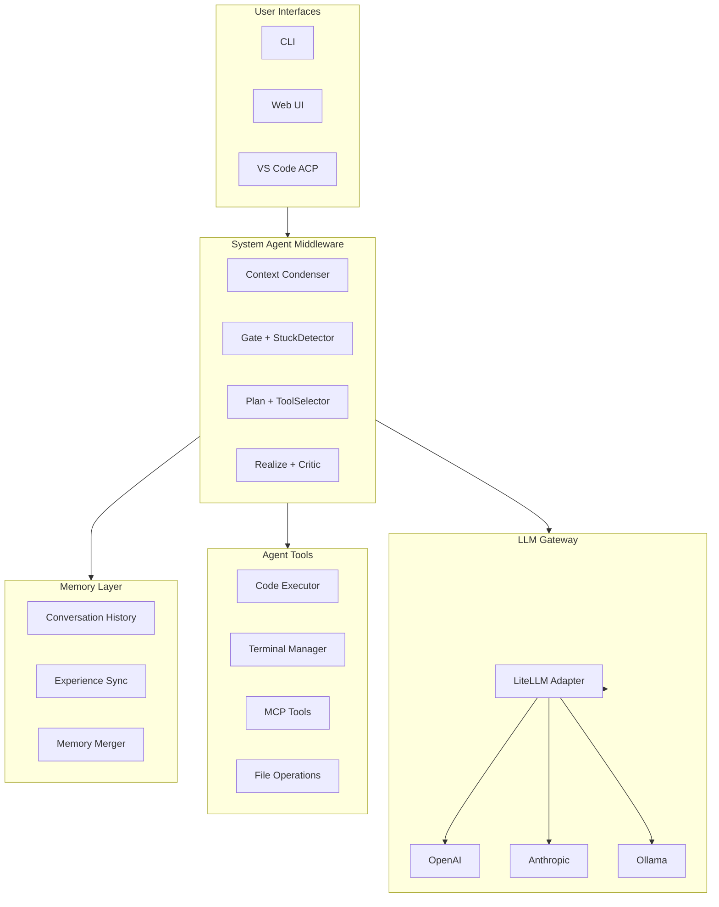

# Open Interpreter + Chrysalis Synthesis

**Date:** January 16, 2026
**Purpose:** Strategic integration of Open Interpreter patterns into Chrysalis middleware

---

## Executive Summary

**Open Interpreter** ([github.com/openinterpreter/open-interpreter](https://github.com/openinterpreter/open-interpreter)) is a 61.7K-star Python project providing natural language interface for computer control. Its architecture offers **three critical patterns** directly applicable to Chrysalis System Agents:

1. **LiteLLM Multi-Provider Abstraction** - Universal LLM adapter pattern
2. **Conversation Memory & Profiles** - Persistent agent state
3. **Code Execution Runtime** - Terminal/shell integration via `exec()`

---

## Part 1: Open Interpreter Architecture Analysis

### Core Components

```
┌─────────────────────────────────────────────────────────────────────┐
│                     OPEN INTERPRETER ARCHITECTURE                    │
├─────────────────────────────────────────────────────────────────────┤
│                                                                     │
│  ┌────────────── INTERFACE LAYER ─────────────────────────────┐    │
│  │  CLI (interpreter)  |  Python API  |  FastAPI Server        │    │
│  └──────────────────────────────────────────────────────────────┘    │
│                              │                                       │
│  ┌────────────── CONVERSATION LAYER ──────────────────────────┐    │
│  │                                                              │    │
│  │  interpreter.messages[]  |  interpreter.chat()               │    │
│  │  interpreter.system_message  |  interpreter.auto_run         │    │
│  │                                                              │    │
│  └──────────────────────────────────────────────────────────────┘    │
│                              │                                       │
│  ┌────────────── LLM LAYER (LiteLLM) ─────────────────────────┐    │
│  │                                                              │    │
│  │  OpenAI | Anthropic | Google | Local (Ollama/LM Studio)     │    │
│  │  interpreter.llm.model | interpreter.llm.api_base           │    │
│  │                                                              │    │
│  └──────────────────────────────────────────────────────────────┘    │
│                              │                                       │
│  ┌────────────── EXECUTION LAYER ─────────────────────────────┐    │
│  │                                                              │    │
│  │  exec(language, code)  |  Python | JavaScript | Shell       │    │
│  │  Streaming output  |  Permission system                     │    │
│  │                                                              │    │
│  └──────────────────────────────────────────────────────────────┘    │
│                                                                     │
└─────────────────────────────────────────────────────────────────────┘
```

### Key Patterns Extracted

| Pattern | Open Interpreter | Chrysalis Application |
|---------|------------------|----------------------|
| **Multi-Provider LLM** | LiteLLM abstraction | Enhance `GatewayLLMClient` |
| **Conversation State** | `interpreter.messages[]` | SCM conversation history |
| **Profiles/Config** | YAML profiles | Agent JSON configs |
| **Code Execution** | `exec(language, code)` | System agent tools |
| **Interactive Commands** | `%reset`, `%undo`, `%verbose` | SCM control commands |
| **Server Mode** | FastAPI streaming | System agent API |

---

## Part 2: LLM Adapter Pattern Enhancement

### Current Chrysalis LLM Architecture

```
GatewayLLMClient → Go Gateway → OpenAI/Anthropic/Ollama
```

### Enhanced with Open Interpreter Patterns

```typescript
// src/services/llm/LiteLLMAdapter.ts

export interface LLMConfig {
  model: string;           // "gpt-4", "claude-3", "ollama/llama3"
  apiBase?: string;        // For local models
  apiKey?: string;
  offline?: boolean;       // Disable online features
  contextWindow?: number;
  maxTokens?: number;
}

export class UniversalLLMAdapter {
  private config: LLMConfig;

  constructor(config: LLMConfig) {
    this.config = config;
  }

  // Pattern from Open Interpreter
  async chat(messages: Message[]): Promise<string> {
    // Route to appropriate provider based on model prefix
    if (this.config.model.startsWith('ollama/')) {
      return this.ollamaChat(messages);
    } else if (this.config.model.startsWith('openai/')) {
      return this.openaiChat(messages);
    } else if (this.config.model.startsWith('anthropic/')) {
      return this.anthropicChat(messages);
    }
    // Default to OpenAI format for local servers
    return this.openaiCompatibleChat(messages);
  }

  // Local model support (LM Studio, Ollama)
  async *stream(messages: Message[]): AsyncGenerator<string> {
    // Stream responses for real-time output
  }
}
```

---

## Part 3: System Agent Tools Integration

### Open Interpreter's exec() Pattern

```python
# Open Interpreter approach
def exec(language: str, code: str):
    """Execute code in specified language runtime"""
    if language == "python":
        return exec_python(code)
    elif language == "javascript":
        return exec_nodejs(code)
    elif language == "shell":
        return exec_shell(code)
```

### Chrysalis System Agent Code Execution Tool

```typescript
// src/agents/system/tools/CodeExecutor.ts

export interface ExecutionRequest {
  language: 'python' | 'javascript' | 'shell' | 'typescript';
  code: string;
  timeout?: number;
  sandbox?: boolean;
}

export interface ExecutionResult {
  stdout: string;
  stderr: string;
  exitCode: number;
  duration: number;
}

export class SystemAgentCodeExecutor {
  private terminalManager: TerminalManager;

  async execute(request: ExecutionRequest): Promise<ExecutionResult> {
    // Safety: require user confirmation unless auto_run
    if (!this.autoRun && !await this.requestPermission(request)) {
      throw new Error('User denied execution');
    }

    switch (request.language) {
      case 'shell':
        return this.executeShell(request.code);
      case 'python':
        return this.executePython(request.code);
      case 'javascript':
      case 'typescript':
        return this.executeNode(request.code);
    }
  }

  // Integration with existing TerminalManager
  private async executeShell(code: string): Promise<ExecutionResult> {
    const session = await this.terminalManager.createSession(
      `exec-${Date.now()}`,
      process.env.SHELL || 'bash'
    );
    // ... execute and capture output
  }
}
```

### System Agent Tool Registry

```typescript
// src/agents/system/tools/ToolRegistry.ts

export const SYSTEM_AGENT_TOOLS = {
  // Code execution (Open Interpreter pattern)
  'execute_code': CodeExecutor,

  // File operations (ACP pattern)
  'read_file': FileReader,
  'write_file': FileWriter,

  // Terminal operations (ACP + Open Interpreter)
  'create_terminal': TerminalCreator,
  'terminal_command': TerminalCommander,

  // MCP tools (OpenHands pattern)
  'mcp_search': MCPSearchTool,
  'mcp_git': MCPGitTool,

  // Meta-cognitive tools (OpenHands)
  'condense_context': ContextCondenser,
  'detect_stuck': StuckDetector,
};
```

---

## Part 4: Middleware System Agents Enhancement

### Current SCM Architecture

```
User Message → Gate → Plan → Realize → Response
```

### Enhanced with OpenHands + Open Interpreter Patterns

```
User Message
    │
    ▼
┌─────────────────────────────────────────────────────────────────────┐
│                    ENHANCED SCM MIDDLEWARE                          │
├─────────────────────────────────────────────────────────────────────┤
│                                                                     │
│  ┌─────────── CONTEXT MANAGEMENT (OpenHands) ────────────────┐     │
│  │                                                            │     │
│  │  ContextCondenser → WindowCondenser → SummarizingCondenser │     │
│  │                                                            │     │
│  └────────────────────────────────────────────────────────────┘     │
│                              │                                       │
│  ┌─────────── GATE (Enhanced) ───────────────────────────────┐     │
│  │                                                            │     │
│  │  StuckDetector → LoopPrevention → Initiative Check        │     │
│  │                                                            │     │
│  └────────────────────────────────────────────────────────────┘     │
│                              │                                       │
│  ┌─────────── PLAN (Enhanced) ───────────────────────────────┐     │
│  │                                                            │     │
│  │  Intent → ToolSelection (Open Interpreter) → ActionPlan   │     │
│  │                                                            │     │
│  └────────────────────────────────────────────────────────────┘     │
│                              │                                       │
│  ┌─────────── REALIZE (Enhanced) ────────────────────────────┐     │
│  │                                                            │     │
│  │  CodeExecutor → Critic → Response Generation              │     │
│  │                                                            │     │
│  └────────────────────────────────────────────────────────────┘     │
│                              │                                       │
│  ┌─────────── MEMORY (Chrysalis + Open Interpreter) ─────────┐     │
│  │                                                            │     │
│  │  ConversationHistory → ExperienceSync → MemoryMerger      │     │
│  │                                                            │     │
│  └────────────────────────────────────────────────────────────┘     │
│                                                                     │
└─────────────────────────────────────────────────────────────────────┘
```

---

## Part 5: Interactive Commands for System Agents

### Open Interpreter Commands → Chrysalis SCM Commands

| Open Interpreter | Chrysalis SCM | Purpose |
|------------------|---------------|---------|
| `%reset` | `/reset` | Clear conversation |
| `%undo` | `/undo` | Remove last exchange |
| `%verbose` | `/debug on/off` | Toggle debug mode |
| `%tokens [prompt]` | `/tokens` | Show token usage |
| `%help` | `/help` | Show commands |

### Implementation

```typescript
// src/agents/system/commands/SCMCommands.ts

export const SCM_COMMANDS: CommandMap = {
  '/reset': {
    handler: (ctx) => ctx.conversation.reset(),
    description: 'Clear conversation history',
  },
  '/undo': {
    handler: (ctx) => ctx.conversation.undoLast(),
    description: 'Remove last message exchange',
  },
  '/debug': {
    handler: (ctx, args) => ctx.setVerbose(args[0] === 'on'),
    description: 'Toggle debug output',
  },
  '/tokens': {
    handler: (ctx) => ctx.showTokenUsage(),
    description: 'Show token count and cost estimate',
  },
  '/delegate': {
    handler: (ctx, args) => ctx.delegateToAgent(args[0], args.slice(1).join(' ')),
    description: 'Delegate task to specific agent',
  },
  '/agents': {
    handler: (ctx) => ctx.listAvailableAgents(),
    description: 'List available system agents',
  },
};
```

---

## Part 6: Server Mode for System Agents

### Open Interpreter FastAPI Pattern

```python
# Open Interpreter server
@app.get("/chat")
def chat_endpoint(message: str):
    def event_stream():
        for result in interpreter.chat(message, stream=True):
            yield f"data: {result}\n\n"
    return StreamingResponse(event_stream())
```

### Chrysalis System Agent Server

```typescript
// src/api/system-agents/streaming-endpoint.ts

import { FastifyInstance } from 'fastify';
import { SystemAgentChatService } from '../../agents/system/SystemAgentChatService';

export async function registerStreamingEndpoints(
  fastify: FastifyInstance,
  chatService: SystemAgentChatService
) {
  // SSE streaming chat endpoint
  fastify.get('/api/agents/:agentId/chat/stream', {
    handler: async (request, reply) => {
      const { agentId } = request.params;
      const { message } = request.query;

      reply.raw.writeHead(200, {
        'Content-Type': 'text/event-stream',
        'Cache-Control': 'no-cache',
        'Connection': 'keep-alive',
      });

      const stream = chatService.streamChat(agentId, message);
      for await (const chunk of stream) {
        reply.raw.write(`data: ${JSON.stringify(chunk)}\n\n`);
      }

      reply.raw.end();
    }
  });

  // Conversation history
  fastify.get('/api/agents/:agentId/history', {
    handler: async (request, reply) => {
      const { agentId } = request.params;
      return chatService.getHistory(agentId);
    }
  });
}
```

---

## Part 7: Integration Priorities

### P0: Critical (This Sprint)

| Item | Source | Implementation |
|------|--------|----------------|
| **Context Condenser** | OpenHands | `src/experience/ContextCondenser.ts` |
| **Stuck Detector** | OpenHands | `src/experience/StuckDetector.ts` |
| **Code Executor Tool** | Open Interpreter | `src/agents/system/tools/CodeExecutor.ts` |

### P1: High (Next Sprint)

| Item | Source | Implementation |
|------|--------|----------------|
| **LiteLLM Adapter** | Open Interpreter | Enhance `GatewayLLMClient` |
| **SCM Commands** | Open Interpreter | `src/agents/system/commands/` |
| **Streaming API** | Open Interpreter | `src/api/system-agents/` |

### P2: Medium (Backlog)

| Item | Source | Implementation |
|------|--------|----------------|
| **ACP Protocol Adapter** | ACP | `src/adapters/acp/` |
| **Cross-Agent Critique** | OpenHands | `src/agents/system/critic/` |
| **Multi-Agent Delegation** | OpenHands | `src/agents/system/delegation/` |

---

## Part 8: Architecture Diagram



---

## Part 9: Quick Wins

### Quick Win 1: Context Condenser (2 days)

```typescript
// src/experience/ContextCondenser.ts

export interface Condenser {
  condense(messages: Message[], maxTokens: number): Message[];
}

export class WindowCondenser implements Condenser {
  constructor(private windowSize: number = 50) {}

  condense(messages: Message[], maxTokens: number): Message[] {
    const system = messages.filter(m => m.role === 'system');
    const recent = messages.filter(m => m.role !== 'system').slice(-this.windowSize);
    return [...system, ...recent];
  }
}

export class PipelineCondenser implements Condenser {
  constructor(private condensers: Condenser[]) {}

  condense(messages: Message[], maxTokens: number): Message[] {
    return this.condensers.reduce(
      (msgs, c) => c.condense(msgs, maxTokens),
      messages
    );
  }
}
```

### Quick Win 2: Stuck Detector (2 days)

```typescript
// src/experience/StuckDetector.ts

export interface StuckAnalysis {
  isStuck: boolean;
  loopType: 'action' | 'error' | 'monologue' | 'alternating' | null;
  repeatCount: number;
  suggestion: string;
}

export class StuckDetector {
  private recentActions: string[] = [];
  private repeatThreshold = 3;

  record(action: string): void {
    this.recentActions.push(action);
    if (this.recentActions.length > 10) {
      this.recentActions.shift();
    }
  }

  analyze(): StuckAnalysis {
    const last3 = this.recentActions.slice(-3);
    if (last3.length === 3 && last3.every(a => a === last3[0])) {
      return {
        isStuck: true,
        loopType: 'action',
        repeatCount: 3,
        suggestion: 'Try different approach or switch agent',
      };
    }
    return { isStuck: false, loopType: null, repeatCount: 0, suggestion: '' };
  }
}
```

### Quick Win 3: Code Executor Tool (3 days)

```typescript
// src/agents/system/tools/CodeExecutor.ts

export class CodeExecutor {
  async execute(
    language: 'shell' | 'python' | 'javascript',
    code: string,
    options: { timeout?: number; autoRun?: boolean } = {}
  ): Promise<{ stdout: string; stderr: string; exitCode: number }> {
    const { timeout = 30000, autoRun = false } = options;

    if (!autoRun) {
      // Would integrate with UI for permission request
      console.log(`[Permission Required] Execute ${language}:\n${code}`);
    }

    const { spawn } = require('child_process');
    const cmd = language === 'python' ? 'python3' :
                language === 'javascript' ? 'node' : 'bash';
    const args = language === 'shell' ? ['-c', code] : ['-e', code];

    return new Promise((resolve, reject) => {
      const proc = spawn(cmd, args, { timeout });
      let stdout = '', stderr = '';

      proc.stdout.on('data', (d: Buffer) => stdout += d);
      proc.stderr.on('data', (d: Buffer) => stderr += d);
      proc.on('close', (exitCode: number) => resolve({ stdout, stderr, exitCode }));
      proc.on('error', reject);
    });
  }
}
```

---

## Conclusion

Open Interpreter provides **three patterns** that directly enhance Chrysalis:

1. **LiteLLM Multi-Provider** → Enhanced LLM Adapter flexibility
2. **Conversation Memory + Commands** → SCM interaction patterns
3. **Code Execution Runtime** → System agent tool capabilities

Combined with **OpenHands** (context management, stuck detection, critics) and **ACP** (editor integration), Chrysalis can become a **meta-cognitive layer** that enhances ANY AI agent with:

- ✅ Distributed memory and experience sync
- ✅ Context compression for long conversations
- ✅ Loop/stuck detection and prevention
- ✅ Code execution and terminal integration
- ✅ Multi-provider LLM support
- ✅ Cross-agent collaboration and critique

---

## Next Steps

1. [ ] Implement `ContextCondenser` (P0)
2. [ ] Implement `StuckDetector` (P0)
3. [ ] Implement `CodeExecutor` tool (P0)
4. [ ] Add SCM commands (`/reset`, `/undo`, `/debug`)
5. [ ] Enhance `GatewayLLMClient` with LiteLLM patterns
6. [ ] Create streaming API endpoints
7. [ ] Build ACP adapter for editor integration

---

**References:**
- [Open Interpreter](https://github.com/openinterpreter/open-interpreter) - 61.7K stars
- [OpenHands V1 SDK](https://github.com/OpenHands/software-agent-sdk)
- [ACP Protocol](https://agentclientprotocol.com)
- [AgentPipe](https://github.com/sammcj/agentpipe)
