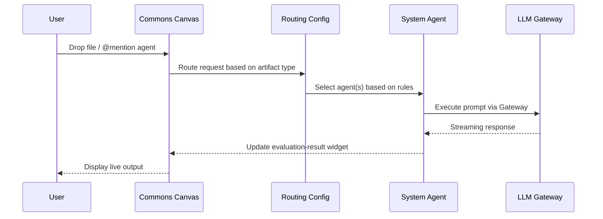

# Canvas Specification: Commons & Scratch

**Version**: 1.1.0
**Date**: January 25, 2026
**Status**: Implementation Aligned

---

## Executive Summary

This document specifies two primary workspace canvases for Chrysalis:

1. **Commons Canvas** - Shared multi-agent workspace with real-time collaboration
2. **Scratch Canvas** - Individual workspace for personal exploration

Both canvases integrate with the System Agents Layer and provide a visual interface for agent-driven workflows.

### Implementation Mapping

| Spec Concept | Implementation | Location |
|--------------|----------------|----------|
| **Commons** | Workspace AgentCanvas | `src/components/AgentCanvas/AgentCanvas.tsx` |
| **Scratch** | ScrapbookCanvas | `src/canvas/canvases/ScrapbookCanvas.tsx` |

### Canonical Canvas Types

The implementation supports these canvas kinds (defined in `src/canvas/types.ts`):

```typescript
type CanvasKind = 
  | 'agent'           // Multi-agent orchestration (Commons)
  | 'scrapbook'       // Personal notes/exploration (Scratch)
  | 'research'        // Structured investigation
  | 'settings'        // System configuration
  | 'wiki'            // Shared knowledge base
  | 'terminal-browser' // Collaborative dev workspace
  | 'custom';         // User-defined
```

---

## 1. Commons Canvas

### 1.1 Purpose

The **Commons** is the central shared workspace where:
- Multiple agents can be visualized and orchestrated
- Users collaborate in real-time (via YJS CRDT)
- Evaluation pipelines are triggered and monitored
- Agent outputs are displayed and refined

### 1.2 Key Behaviors

| Behavior | Description |
|----------|-------------|
| **Agent Cards** | Visualize each active agent (Ada, Lea, Phil, David, Milton) with status indicators |
| **Drop Zone** | Accept file drops to trigger agent evaluation pipelines |
| **Live Output** | Stream agent responses as they generate |
| **Pipeline View** | Show @evaluate pipeline progression through stages |
| **Collaboration Cursors** | Show other users' positions (YJS awareness) |
| **History Rail** | Scrollable timeline of recent agent interactions |

### 1.3 Allowed Widgets

```typescript
type CommonsWidgetType =
  | 'agent-card'        // Agent persona card with status
  | 'evaluation-result' // Output from agent evaluation
  | 'pipeline-tracker'  // Multi-agent pipeline progress
  | 'file-drop-zone'    // Drop target for artifacts
  | 'chat-thread'       // Conversation with agent(s)
  | 'activity-feed'     // Recent activity log
  | 'note'              // Collaborative notes
  ;
```

### 1.4 Agent Execution Bridge



### 1.5 Canvas Actions

| Action | Trigger | Result |
|--------|---------|--------|
| `DROP_FILE` | File dragged onto canvas | Create file-drop-zone widget, trigger routing |
| `MENTION_AGENT` | `@ada`, `@milton`, etc. in chat | Route to specified agent, create chat-thread |
| `RUN_PIPELINE` | `@evaluate` command | Create pipeline-tracker, run full evaluation |
| `SHARE_RESULT` | Click "Share" on result | Copy result widget to specified location |
| `BRANCH_THREAD` | Fork conversation | Create new chat-thread with context |

### 1.6 Persistence

- **State**: YJS document with canvas nodes/edges via `createYjsDataSource()`
- **Sync**: WebSocket to collaboration server (when YJS enabled)
- **Storage**: Fireproof for durability (future), localStorage fallback
- **Scope**: Shared across all users with canvas access

**Data Source Integration**:
```typescript
// In ChrysalisWorkspace, Commons uses AgentCanvasState directly
// managed by workspace state, synced via YJS chat arrays
const [canvasState, setCanvasState] = useState<AgentCanvasState>(...)
```

---

## 2. Scratch Canvas

### 2.1 Purpose

The **Scratch** canvas is a personal workspace for:
- Individual exploration and experimentation
- Draft work before sharing to Commons
- Private agent conversations
- Personal notes and organization

### 2.2 Key Behaviors

| Behavior | Description |
|----------|-------------|
| **Private by Default** | Only visible to the owner |
| **Quick Notes** | Rapid note capture with auto-save |
| **Agent Chat** | Private conversations with any agent |
| **Draft Results** | Hold evaluation results before sharing |
| **Promote to Commons** | Move items to shared workspace |
| **No Collaboration** | Single-user, no CRDT overhead |

### 2.3 Allowed Widgets

```typescript
type ScratchWidgetType =
  | 'note'              // Personal notes (markdown)
  | 'code-snippet'      // Code with syntax highlighting
  | 'chat-thread'       // Private agent conversation
  | 'evaluation-result' // Evaluation output (draft)
  | 'file-reference'    // Link to file (not embedded)
  | 'todo-list'         // Personal tasks
  | 'bookmark'          // Saved references
  ;
```

### 2.4 Canvas Actions

| Action | Trigger | Result |
|--------|---------|--------|
| `QUICK_NOTE` | `Cmd+N` or toolbar | Create note widget at cursor |
| `CHAT_AGENT` | `@agent` in scratch | Private conversation widget |
| `PROMOTE` | Right-click → "Share to Commons" | Copy widget to Commons canvas |
| `ARCHIVE` | Right-click → "Archive" | Move to archive (retrievable) |
| `EXPORT` | Right-click → "Export" | Download as markdown/JSON |

### 2.5 Persistence

- **State**: YJS document (if enabled) or localStorage via `createYjsDataSource()` / `createLocalStorageDataSource()`
- **Sync**: Optional real-time sync when YJS enabled
- **Storage**: localStorage for fast local access
- **Scope**: Private to user (or shared if YJS enabled)

**Data Source Integration**:
```typescript
// In ChrysalisWorkspace
const scratchDataSource = useMemo(() => {
  if (config.enableYjs && yjsDoc) {
    return createYjsDataSource(yjsDoc, 'scratch');
  }
  return createLocalStorageDataSource(`chrysalis-scratch-${sessionId}`);
}, [config.enableYjs, yjsDoc, sessionId]);
```

---

## 3. Agent Execution Bridge

### 3.1 Overview

The Agent Execution Bridge connects canvas actions to System Agent execution:

```typescript
interface AgentExecutionBridge {
  /** Route a request to appropriate agent(s) */
  route(request: CanvasRequest): Promise<AgentRoute>;

  /** Execute request through routed agent(s) */
  execute(route: AgentRoute, input: AgentInput): AsyncIterable<AgentOutput>;

  /** Cancel ongoing execution */
  cancel(executionId: string): void;

  /** Get execution status */
  status(executionId: string): ExecutionStatus;
}

interface CanvasRequest {
  canvasId: string;
  widgetId?: string;
  artifactType: ArtifactType;
  content: string | File;
  mentions: string[];  // @ada, @evaluate, etc.
  context?: Record<string, unknown>;
}

interface AgentRoute {
  agents: string[];           // ['ada', 'lea'] or ['coordinator']
  pipelineMode: boolean;      // true for @evaluate
  pipelineStages?: string[];  // ['ada', 'lea', 'phil', 'david']
  reason: string;             // "Routed to ada for structural analysis"
}

interface AgentOutput {
  agentId: string;
  type: 'chunk' | 'complete' | 'error';
  content: string;
  metadata?: {
    tokensUsed?: number;
    confidence?: number;
    verdict?: string;
  };
}
```

### 3.2 Routing Rules

From `routing_config.json`, applied in order:

1. **Telemetry/Metrics** → `@milton` (Ops Caretaker)
2. **Config/Maintenance** → `@milton` (Ops Caretaker)
3. **Short Code** → `@lea` (Quick Review)
4. **Predictions** → `@phil` (Forecast)
5. **Architecture/Schema** → `@ada` (Structure)
6. **Bias Check** → `@david` (Metacognitive)
7. **Explicit @mention** → Specified agent
8. **Default** → `@evaluate` (Full Pipeline)

### 3.3 Widget ↔ Agent Mapping

| Widget Type | Default Agent | Purpose |
|-------------|---------------|---------|
| `evaluation-result` | Varies | Display agent output |
| `chat-thread` | Mentioned | Conversation container |
| `pipeline-tracker` | coordinator | Pipeline progress |
| `agent-card` | Self | Agent status display |
| `file-drop-zone` | Auto-routed | File ingestion |

---

## 4. Canvas State Schema

### 4.1 Shared State (YJS Document)

```typescript
interface CanvasYDoc {
  /** Canvas metadata */
  meta: {
    id: string;
    kind: 'commons' | 'scratch';
    title: string;
    createdAt: number;
    updatedAt: number;
  };

  /** Widget nodes */
  nodes: YMap<WidgetNode>;

  /** Connections between widgets */
  edges: YMap<WidgetEdge>;

  /** Viewport state */
  viewport: {
    x: number;
    y: number;
    zoom: number;
  };

  /** Active executions */
  executions: YMap<ExecutionState>;

  /** User awareness (for Commons) */
  awareness?: YAwareness;
}

interface WidgetNode {
  id: string;
  type: string;
  position: { x: number; y: number };
  size: { width: number; height: number };
  data: Record<string, unknown>;
  locked?: boolean;
  createdBy?: string;
  createdAt: number;
}
```

---

## 5. Implementation Priority

### Phase 1: Minimal Viable Canvas (MVP)
1. ✅ BaseCanvas component (exists)
2. ✅ Agent Card widget (workspace AgentCanvas)
3. ⏳ Chat Thread widget
4. ⏳ Agent Execution Bridge (basic routing)
5. ✅ Local persistence (localStorage via DataSource)

### Phase 2: Collaboration
1. ✅ YJS integration (`createYjsDataSource()` in `src/canvas/DataSource.ts`)
2. ⏳ Awareness cursors
3. ⏳ Pipeline Tracker widget
4. ⏳ Activity Feed widget

### Phase 3: Polish
1. ✅ File drop handling (ChrysalisWorkspace)
2. ⏳ Evaluation Result widget (rich display)
3. ⏳ Canvas themes
4. ⏳ Accessibility audit

### Architecture Notes

**Two AgentCanvas Implementations** (intentional):
- `src/components/AgentCanvas/AgentCanvas.tsx` - Lean, workspace-specific, uses `AgentCanvasState` directly
- `src/canvas/canvases/AgentCanvas.tsx` - Widget-based, extends BaseCanvas with widget registry

**Decision**: Keep both. Workspace AgentCanvas is optimized for the three-pane layout with direct state management. Canvas system AgentCanvas is for standalone/embedded widget-based scenarios.

---

## 6. Related Documents

- [Canvas Architecture](../canvas-architecture.md)
- [Canvas Design Decisions](../CANVAS_DESIGN_DECISIONS.md)
- [Canvas Integration Status](../CANVAS_INTEGRATION_STATUS.md)
- [System Agents Layer](../../Agents/system-agents/README.md)
- [Routing Config](../../Agents/system-agents/routing_config.json)

## 7. Data Source API

Canvas persistence is abstracted via `CanvasDataSource` interface (`src/canvas/DataSource.ts`):

```typescript
interface CanvasDataSource<N, E> {
  load(): Promise<{ nodes: N[]; edges: E[] }>;
  save(nodes: N[], edges: E[]): Promise<void>;
  subscribe(callback: (event: DataSourceEvent<N, E>) => void): () => void;
  dispose(): void;
}
```

**Available Implementations**:
- `createLocalStorageDataSource(key)` - Browser localStorage
- `createMemoryDataSource(nodes, edges)` - In-memory (no persistence)
- `createYjsDataSource(yjsDoc, mapKey)` - YJS CRDT for real-time sync
- `createRemoteDataSource(options)` - REST API backend
