# Chrysalis Multi-Agent Interface Specification
## TUI vs Chat Pane Recommendation

**Date:** January 16, 2026
**Version:** 1.0
**Authors:** Architecture Research Team
**Status:** Recommendation

---

## Executive Summary

Based on comprehensive analysis of 15+ agentic coding tools and protocols[^1], we recommend a **Hybrid TUI (Terminal User Interface) with embedded chat elements** rather than a web-based chat pane for the Chrysalis multi-agent interface.

**Key Finding:** TUI-first tools dominate developer adoption in the agentic coding space, with **Letta Code**, **Claude Code/Codex**, **Open Interpreter**, and the emerging **ACP protocol** all using terminal-native architectures.

---

## Table of Contents

1. [Interface Paradigm Comparison](#interface-paradigm-comparison)
2. [Industry Analysis](#industry-analysis)
3. [Recommended Architecture](#recommended-architecture)
4. [Component Specifications](#component-specifications)
5. [Implementation Libraries](#implementation-libraries)
6. [Multi-Agent UX Patterns](#multi-agent-ux-patterns)
7. [Migration Path](#migration-path)

---

## Interface Paradigm Comparison

### Decision Matrix

| Factor | TUI | Web Chat | Hybrid TUI | Winner |
|--------|-----|----------|------------|--------|
| Developer adoption | ⭐⭐⭐⭐⭐ | ⭐⭐ | ⭐⭐⭐⭐⭐ | **TUI/Hybrid** |
| ACP protocol compatibility[^2] | ⭐⭐⭐⭐⭐ | ⭐⭐ | ⭐⭐⭐⭐⭐ | **TUI/Hybrid** |
| Editor integration | ⭐⭐⭐⭐⭐ | ⭐⭐ | ⭐⭐⭐⭐⭐ | **TUI/Hybrid** |
| Multi-agent visibility | ⭐⭐⭐ | ⭐⭐⭐⭐⭐ | ⭐⭐⭐⭐ | **Web/Hybrid** |
| Memory state display | ⭐⭐ | ⭐⭐⭐⭐⭐ | ⭐⭐⭐⭐ | **Web/Hybrid** |
| Context switching cost | ⭐⭐⭐⭐⭐ | ⭐⭐ | ⭐⭐⭐⭐⭐ | **TUI/Hybrid** |
| Mobile/remote access | ⭐ | ⭐⭐⭐⭐⭐ | ⭐⭐ | **Web** |
| Streaming tokens | ⭐⭐⭐⭐⭐ | ⭐⭐⭐⭐ | ⭐⭐⭐⭐⭐ | **TUI/Hybrid** |
| Tool output display | ⭐⭐⭐⭐⭐ | ⭐⭐⭐⭐ | ⭐⭐⭐⭐⭐ | **TUI/Hybrid** |
| **Total Score** | **38/45** | **32/45** | **42/45** | **Hybrid TUI** |

---

## Industry Analysis

### Current Landscape (2026)

```mermaid
graph TB
    subgraph "TUI-First Tools (Dominant)"
        LC[Letta Code<br/>15K ⭐]
        CC[Claude Code/Codex<br/>18K ⭐]
        OI[Open Interpreter<br/>55K ⭐]
        AI[Aider<br/>25K ⭐]
    end

    subgraph "Web-Based Tools"
        OH[OpenHands<br/>48K ⭐]
        AP[AgentPipe<br/>Dashboard]
        CP[ChatGPT<br/>Web UI]
    end

    subgraph "Protocol Standards"
        ACP[ACP Protocol<br/>ndjson/stdio]
        MCP[MCP Protocol<br/>stdio/SSE]
    end

    ACP --> LC
    ACP --> CC
    MCP --> OI
    MCP --> AI

    style LC fill:#90EE90
    style CC fill:#90EE90
    style OI fill:#90EE90
    style AI fill:#90EE90
    style ACP fill:#87CEEB
```



### Tool Architecture Survey

| Tool | Interface | Stars | Protocol | Year | Notes |
|------|-----------|-------|----------|------|-------|
| [Open Interpreter][oi] | TUI | 55K | Custom | 2023 | Magic commands, OS mode |
| [OpenHands][oh] | Web | 48K | HTTP | 2024 | Browser-based IDE |
| [Aider][aider] | TUI | 25K | Custom | 2023 | Git-aware |
| [Claude Code][cc] | TUI | 18K | ACP | 2025 | ACP reference impl |
| [Letta Code][letta] | TUI | 15K | Custom | 2025 | Memory-first |
| [Cursor][cursor] | Embedded | N/A | Custom | 2023 | IDE integration |

**Observation:** 4 of 6 major tools use TUI-first architecture.

---

## Recommended Architecture

### Overview


### Layout Specification

```
┌─────────────────────────────────────────────────────────────────────────┐
│  CHRYSALIS v0.8.0                              [Byzantine: ✅ Synced]   │
├───────────────────────────────────────────────┬─────────────────────────┤
│                                               │  AGENTS                 │
│  🤖 Architect Agent                           │  ├─ 🟢 Architect        │
│  ──────────────────────────────────────────   │  ├─ 🟡 Coder (working)  │
│  I'll analyze the codebase structure and      │  └─ ⚪ Reviewer         │
│  propose a refactoring plan for the memory    │                         │
│  module.                                      │  MEMORY                 │
│                                               │  ├─ Episodic: 1,423     │
│  📁 Reading: src/memory/                      │  ├─ Semantic: 892       │
│  ├── fusion.py                                │  └─ Skills: 47          │
│  ├── byzantine.py                             │                         │
│  └── crdt_merge.py                            │  SYNC STATUS            │
│                                               │  ├─ Instance A: ✅      │
│  🤖 Coder Agent                               │  ├─ Instance B: ✅      │
│  ──────────────────────────────────────────   │  └─ Instance C: 🔄      │
│  Based on the architecture analysis, I'll     │                         │
│  implement the proposed changes...            │  TOOLS ACTIVE           │
│                                               │  └─ file_read (3.2s)    │
│  ▌ Thinking...                                │                         │
│                                               │                         │
├───────────────────────────────────────────────┴─────────────────────────┤
│  Tokens: 4,231 / 128K │ Cost: $0.042 │ /help for commands              │
├─────────────────────────────────────────────────────────────────────────┤
│  > /skill "learn deployment pattern"                                    │
└─────────────────────────────────────────────────────────────────────────┘
```

---

## Component Specifications

### 1. Main Conversation Pane

**Purpose:** Display streaming agent conversation with multi-agent speaker labels.


**Features:**
- Streaming token display (character-by-character)
- Multi-agent speaker labels with icons
- Tool execution inline display
- Collapsible code blocks
- Timestamp on hover

### 2. Sidebar (Agent + Memory Status)

**Purpose:** Show real-time agent states and memory synchronization.

| Section | Content | Update Frequency |
|---------|---------|------------------|
| Agents | Active agents with status icons | Real-time |
| Memory | Episodic/Semantic/Skill counts | 5s |
| Sync | Byzantine consensus status | 1s |
| Tools | Currently executing tools | Real-time |

### 3. Input Bar

**Purpose:** Accept user prompts and magic commands.

**Supported Commands (inspired by Open Interpreter[^3] and Letta[^4]):**

| Command | Description | Source |
|---------|-------------|--------|
| `/skill <text>` | Learn skill from trajectory | Letta Code |
| `/remember <text>` | Add to semantic memory | Letta Code |
| `/undo` | Remove last exchange | Open Interpreter |
| `/reset` | Clear conversation, keep memory | Letta Code |
| `/tokens` | Show token usage and cost | Open Interpreter |
| `/agents` | List active agents | Chrysalis |
| `/sync` | Force Byzantine sync | Chrysalis |
| `/export [md\|json]` | Export conversation | Open Interpreter |
| `Ctrl+C` | Interrupt current agent | Standard |

### 4. Status Bar

**Content:**
- Token usage (current / context window)
- Estimated cost
- Active model
- Byzantine sync indicator
- Keyboard shortcut hint

---

## Implementation Libraries

### Recommended Stack (Node.js/TypeScript)


### Library Comparison

| Library | Use Case | Stars | Bundle Size | Notes |
|---------|----------|-------|-------------|-------|
| [Ink][ink] | React-based TUI | 27K | 45KB | Used by Vercel, Gatsby |
| [Blessed][blessed] | Full TUI framework | 11K | 120KB | More features, heavier |
| [xterm.js][xterm] | Terminal embedding | 18K | 250KB | For web fallback |
| [Ora][ora] | Spinners | 9K | 8KB | Async operation feedback |
| [Chalk][chalk] | Terminal colors | 22K | 12KB | Essential |

### Recommended Primary: **Ink v5**

**Rationale:**
1. React component model familiar to web developers
2. Composable, testable components
3. Built-in streaming support
4. Active maintenance (used by Vercel)
5. TypeScript native

**Example Implementation:**

```tsx
// src/ui/App.tsx
import React from 'react';
import { Box, Text, useInput, useApp } from 'ink';
import { ConversationPane } from './ConversationPane';
import { Sidebar } from './Sidebar';
import { InputBar } from './InputBar';
import { StatusBar } from './StatusBar';

export const ChrysalisTUI: React.FC = () => {
  const { exit } = useApp();

  useInput((input, key) => {
    if (key.ctrl && input === 'c') {
      exit();
    }
  });

  return (
    <Box flexDirection="column" height="100%">
      <Box flexGrow={1}>
        <ConversationPane flex={3} />
        <Sidebar flex={1} />
      </Box>
      <StatusBar />
      <InputBar />
    </Box>
  );
};
```

---

## Multi-Agent UX Patterns

### Pattern 1: Speaker Identification


**Implementation:**
- Unique emoji per agent role
- Color-coded backgrounds
- Indentation for handoffs

### Pattern 2: Handoff Visualization

```
  🏗️ Architect Agent
  ────────────────────────────────────────────
  Analysis complete. Handing off to Coder.

    └──→ 💻 Coder Agent
         ────────────────────────────────────────
         Received context. Starting implementation...
```

### Pattern 3: Parallel Agent Display

When multiple agents work in parallel:

```
┌─ 💻 Coder Agent ─────────────┐ ┌─ 🧪 Tester Agent ────────────┐
│ Writing: src/memory/new.ts   │ │ Running: test suite          │
│ ▌ Implementing function...   │ │ ✅ 12/15 tests passing       │
└──────────────────────────────┘ └──────────────────────────────┘
```

---

## Migration Path

### Phase 1: CLI Foundation (Week 1-2)


### Phase 1 Deliverables

1. Basic CLI entry point (`chrysalis` command)
2. ACP server implementation
3. Streaming output handler
4. Magic command parser

### Phase 2 Deliverables

1. Ink-based conversation pane
2. Multi-agent speaker labels
3. Tool execution display
4. Input bar with history

### Phase 3 Deliverables

1. Memory status sidebar
2. Byzantine sync indicator
3. xterm.js web embedding option
4. Export functionality

---

## Alternative: Web Fallback (xterm.js)

For web/mobile access, embed TUI in browser:


**Libraries:**
- [xterm.js][xterm] - Terminal emulator
- [node-pty][nodepty] - PTY for Node.js
- [WebSocket][ws] - Real-time communication

---

## Conclusion

**Recommendation: Hybrid TUI with Ink**

| Aspect | Decision | Rationale |
|--------|----------|-----------|
| **Primary Interface** | TUI (Ink) | Developer adoption, ACP compatibility |
| **Multi-agent UX** | Speaker labels + sidebar | Clear attribution |
| **Memory Display** | Sidebar panel | Non-intrusive, always visible |
| **Web Fallback** | xterm.js embedding | Mobile/remote access |
| **Commands** | Magic commands (/skill, /remember) | Proven patterns from Letta/OI |

---

## References

### Source Projects

[oi]: https://github.com/openinterpreter/open-interpreter "Open Interpreter - 55K stars"
[oh]: https://github.com/All-Hands-AI/OpenHands "OpenHands - 48K stars"
[aider]: https://github.com/paul-gauthier/aider "Aider - 25K stars"
[cc]: https://github.com/anthropics/claude-code "Claude Code"
[letta]: https://github.com/letta-ai/letta-code "Letta Code - 15K stars"
[cursor]: https://cursor.sh "Cursor IDE"
[mem0]: https://github.com/mem0ai/mem0 "Mem0 - 45K stars"

### Libraries

[ink]: https://github.com/vadimdemedes/ink "Ink - React for CLI"
[blessed]: https://github.com/chjj/blessed "Blessed - TUI Framework"
[xterm]: https://github.com/xtermjs/xterm.js "xterm.js - Terminal Emulator"
[ora]: https://github.com/sindresorhus/ora "Ora - Elegant Spinners"
[chalk]: https://github.com/chalk/chalk "Chalk - Terminal Colors"
[nodepty]: https://github.com/microsoft/node-pty "node-pty"
[ws]: https://github.com/websockets/ws "WebSocket"

### Protocols

- [ACP Protocol Specification](https://agentclientprotocol.org/) - Agent Client Protocol
- [MCP Protocol](https://modelcontextprotocol.io/) - Model Context Protocol

---

## Footnotes

[^1]: Analysis based on research conducted January 15-16, 2026, examining Open Interpreter, OpenHands, Letta Code, Claude Code/Codex, Aider, AgentPipe, Cursor, and 8 additional tools. See `docs/research/MULTI_AGENT_CLI_CHAT_STUDY_2026-01-16.md`.

[^2]: ACP (Agent Client Protocol) uses ndjson over stdio, making it inherently terminal-native. Web-based tools require additional translation layers. See `docs/research/ACP_PROTOCOL_MULTI_AGENT_SYNTHESIS.md`.

[^3]: Open Interpreter magic commands: `%undo`, `%reset`, `%tokens`, `%save_message`, `%load_message`, `%markdown`, `%jupyter`. Source: `interpreter/terminal_interface/magic_commands.py`.

[^4]: Letta Code commands: `/init`, `/remember`, `/skill`, `/clear`. These commands interact with the persistent memory system. Source: `src/cli/`.

---

**Document Status:** APPROVED (January 16, 2026)
**Decision:** Ink v5 for chat TUI + xterm.js for terminal widgets in canvas
**Implementation Plan:** See `docs/specs/INK_CHAT_IMPLEMENTATION_PLAN.md`
**Scoring Analysis:** See `docs/specs/TERMINAL_LIBRARY_SCORING_ANALYSIS.md`
