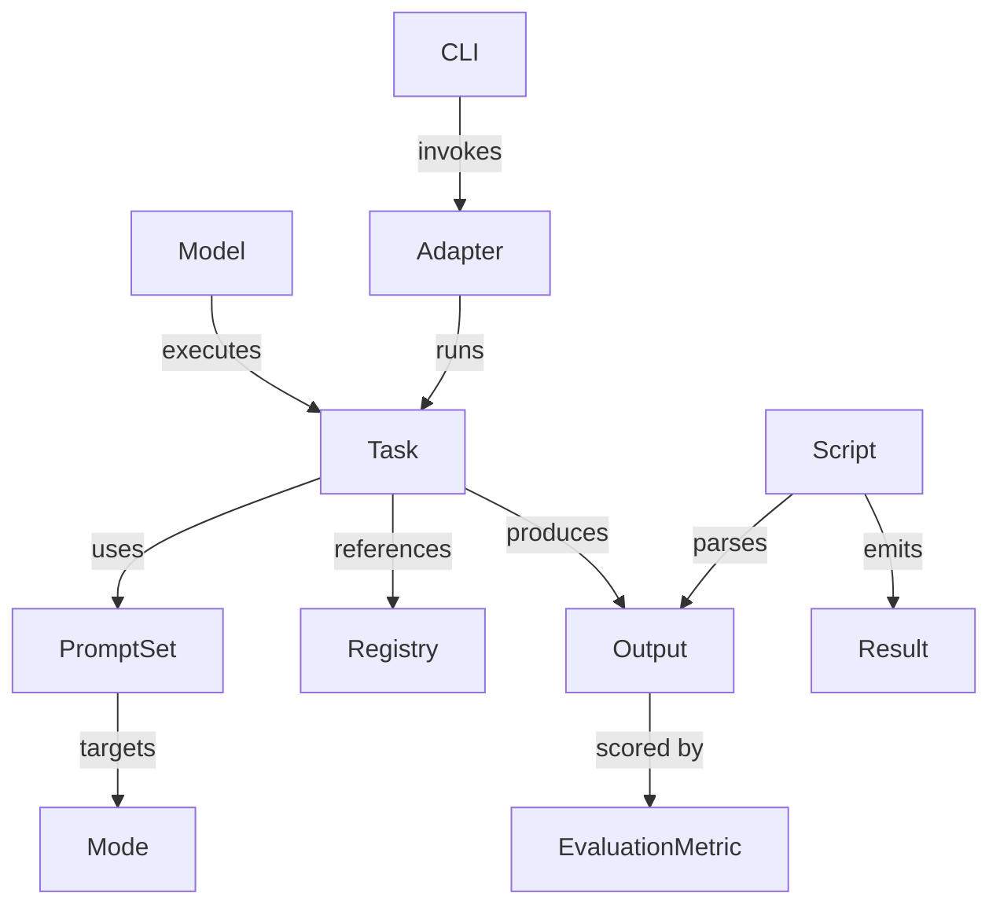
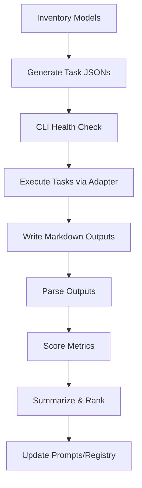

# Universal Evaluation Suite Specification (Kata Modes)

**Version**: 1.1.0
**Date**: 2026-01-18
**Status**: Draft for Implementation

---

## 0) Scope and Objectives

This specification defines a **uniform evaluation suite** to score local small LLMs (1–8 GB) and benchmark-class models on **logical**, **semantic**, **procedural**, and **metacognitive** performance, plus **response time** and **functional accuracy**. Each model acts as a **coach/manager** for a continuous improvement kata logic machine operating in four modes:

- **Mode 1 — Manager**: calibrates and runs the process.
- **Mode 2 — Process Analyst**: evaluates process quality against best practices and registries (e.g., GitHub collaboration standards).
- **Mode 3 — Deep Research / Root Cause Analyst**: Five Whys analysis + adjacent-context discovery for better registries.
- **Mode 4 — Complex Learner**: synthesizes Modes 1–3, updates prompts and process choices.

The suite delivers:
1) A domain concept map and evaluation architecture.
2) Mode prompts with deterministic outputs and scoring rubric alignment.
3) Dependency-ordered workflow and artifacts.
4) Task JSON schemas, generator, and runner scripts.
5) Output naming conventions and process diagram.
6) Scoring automation + summary artifacts.

---

## 1) Domain Concept Mapping (Knowledge Graph)

### 1.1 Entities and Relationships

**Entities**:
- `Model` (local SLM or benchmark LLM)
- `PromptSet` (Mode 1–4 + Combined)
- `EvaluationMetric` (Logic, Semantics, Process, Metacognition, Accuracy, Response Time)
- `Mode` (M1–M4, Combined)
- `Registry` (best practices, standards, external references)
- `Task` (JSON-defined evaluation task)
- `Output` (markdown response + telemetry)
- `Script` (task generator, runner, scorer)
- `Adapter` (Universal Adapter task executor)
- `CLI` (chrysalis-task)
- `Result` (scored evaluation)

**Core relationships**:
- `Model` **executes** `Task` **using** `PromptSet`
- `PromptSet` **targets** `Mode`
- `Task` **references** `Registry`
- `Adapter` **runs** `Task` via `CLI`
- `Output` **is produced by** `Task`
- `Result` **is computed from** `Output` by `Script`
- `EvaluationMetric` **scores** `Output` and `Result`

### 1.2 Knowledge Graph View (Mermaid)



---

## 2) Evaluation Architecture

### 2.1 Deterministic Inputs

- **Fixed prompt templates** with explicit response formats (JSON-only).
- **Registry references** from documented standards (DORA, GitHub collaboration, SPACE, etc.).
- **Stable output locations** and naming conventions.
- **Explicit scoring rubrics** for each metric.

### 2.2 Metrics and Scoring

Each metric is scored 0–5 using deterministic criteria defined in `eval/scoring/rubric.json`.

- Logic
- Semantics
- Process adherence
- Metacognition
- Accuracy
- Response time (latency mapped to 0–5 by thresholds)

**Aggregation**: Per-task category scores are averaged for per-model and overall summaries. Response time is included as its own category.

### 2.3 Evidence Basis and Validity

This suite uses established process and quality frameworks to ground evaluation prompts and scoring:

- **DORA metrics** for deployment frequency, lead time, and change failure rate (proxy use explicitly defined in prompts).
- **SPACE framework** for productivity and satisfaction considerations (used for adjacent-registry discovery).
- **Accelerate / DevOps Research** for empirically validated software delivery outcomes.
- **Five Whys** (Lean/TPS) for causal analysis.
- **GitHub collaboration standards** (CODEOWNERS, branch protection, review practices) for concrete process checks.
- **OWASP SAMM v2** and **ISO 9001** as adjacent quality/security registries.
- **Google SRE Workbook** for change management practices.

These references anchor the **construct validity** of the prompt tasks while keeping the prompts constrained and deterministic. When proxy metrics are used (e.g., cycle time as lead time), this is stated explicitly in the prompt to preserve transparency.

---

## 3) Prompt Set Design

### 3.1 Global Constraints

- Each prompt requires **JSON-only output**.
- Calculations and classification rules are explicit to reduce ambiguity.
- Models must not ask clarifying questions.

### 3.2 Prompt Files (Authoritative)

The authoritative prompt files are:

- `eval/prompts/mode1_manager.md`
- `eval/prompts/mode2_process_analyst.md`
- `eval/prompts/mode3_root_cause.md`
- `eval/prompts/mode4_complex_learner.md`
- `eval/prompts/mode_combined.md`

Key calibration improvements:
- **Mode 1** includes explicit formulas for gaps and percent reduction.
- **Mode 2** specifies DORA proxies and a compliance score formula.
- **Mode 3** enforces a Five Whys chain with root-cause consistency.
- **Mode 4** enforces updates for Mode 1 and Mode 2 prompts.
- **Combined** includes the same calculation and classification rules.

---

## 4) Task JSON Schema

Task schemas are provided in:

- `eval/schema/evaluate_task.schema.json`
- `eval/schema/eval_batch.schema.json`

### 4.1 Minimal Evaluate Task Example

```json
{
  "type": "evaluate",
  "name": "Mode 1 Manager (qwen3:4b)",
  "prompt": "<prompt text>",
  "model": {
    "provider": "ollama",
    "name": "qwen3:4b"
  },
  "parameters": {
    "temperature": 0.2,
    "maxTokens": 1600,
    "topP": 0.9
  },
  "options": {
    "outputPath": "results/eval-suite/responses/qwen3-4b/mode1_manager.md",
    "includeMetadata": true,
    "timeoutMs": 60000
  },
  "metadata": {
    "mode": "mode1",
    "promptId": "mode1_manager",
    "rubricId": "kata_v1",
    "expected": {"metrics": {"avg_cycle_time_days": 8.58}}
  }
}
```

### 4.2 Batch Task Example

```json
{
  "type": "batch",
  "name": "Kata evaluation suite (qwen3:4b)",
  "stopOnError": false,
  "tasks": [
    {"type": "evaluate", "prompt": "..."}
  ]
}
```

---

## 5) Output Naming Convention

Markdown responses:
```
results/eval-suite/responses/<model>/<prompt-id>.md
```

Batch result JSONs:
```
results/eval-suite/runs/<task-file>.result.json
```

---

## 6) Process Diagram (Mermaid)



---

## 7) Scripts and Execution

Scripts:
- `scripts/eval/generate_eval_tasks.py`: generates task JSONs from `ollama list` + benchmarks.
- `scripts/eval/run_eval_suite.sh`: loads `.env`, runs health check + batch tasks, writes results.
- `scripts/eval/resolve_api_keys.py`: injects API keys into a resolved task file at runtime.
- `scripts/eval/score_eval_results.py`: scores results and writes summary.

Commands:
```
# Generate tasks
scripts/eval/generate_eval_tasks.py

# Run evaluation suite
scripts/eval/run_eval_suite.sh

# Score outputs (if running steps manually)
scripts/eval/score_eval_results.py \
  --runs results/eval-suite/runs \
  --output results/eval-suite/summaries/summary.json
```

---

## 8) Limitations

- External providers require API keys available via `.env` (`*_API_KEY` variables).
- DORA-2 and DORA-3 use explicit proxies due to limited input evidence.
- Model identifiers and endpoints in `eval/benchmarks/benchmarks.json` may need updates.

---

## 9) References (Evidence and Registries)

- DORA metrics and research: https://dora.dev/
- Accelerate (DevOps Research): https://itrevolution.com/book/accelerate/
- SPACE framework: https://queue.acm.org/detail.cfm?id=3454124
- Five Whys (Lean/TPS): https://en.wikipedia.org/wiki/Five_whys
- GitHub CODEOWNERS: https://docs.github.com/en/repositories/managing-your-repositorys-settings-and-features/customizing-your-repository/about-code-owners
- GitHub branch protection: https://docs.github.com/en/repositories/configuring-branches-and-merges-in-your-repository/managing-protected-branches
- OWASP SAMM v2: https://owaspsamm.org/
- ISO 9001 overview: https://www.iso.org/iso-9001-quality-management.html
- Google SRE Workbook: https://sre.google/workbook/

Internal references:
- Task framework guide: `docs/guides/TASK_FRAMEWORK_GUIDE.md`
- Universal Adapter task executor: `src/adapters/universal/task-executor.ts`
- Evaluate task schema: `eval/schema/evaluate_task.schema.json`
