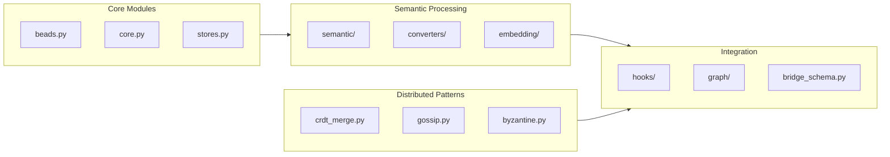

# Memory System - Semantic Services Package

**Last Updated**: January 12, 2026  
**Version**: 3.1.0  
**Tests**: 28/28 passing

Consolidated semantic processing, graph operations, and knowledge management utilities for Chrysalis.

---

## Overview

The Memory System package provides production-ready modules for semantic analysis, knowledge graphs, document processing, and embedding management.



---

## Installation

```bash
pip install -e memory_system/
```

---

## Quick Start

```python
from memory_system import create_embedding_service, create_graph_store

# Create embedding service (auto-detects provider)
embedding = create_embedding_service()

# Create graph store
graph = create_graph_store("sqlite", db_path="knowledge.db")
```

---

## Module Reference

### Beads (Short-term Memory)

Append-only context chain for ephemeral memory.

```python
from memory_system.beads import BeadsService

beads = BeadsService(db_path=":memory:", max_entries=100)
beads.append("user_123", "conversation context", blob=b"optional_data")
recent = beads.recent("user_123", limit=10)
```

### Embedding Service

Multi-provider embedding with automatic fallback.

```python
from memory_system.embedding import EmbeddingService

# Provider fallback: Voyage → OpenAI → Ollama → Deterministic
service = EmbeddingService(provider="auto")
vector = service.embed("Knowledge representation")
print(len(vector))  # Dimension varies by provider
```

**Environment Variables**:
- `VOYAGE_API_KEY` - Voyage AI (primary)
- `OPENAI_API_KEY` - OpenAI (fallback)
- `EMBEDDING_PROVIDER` - Force specific provider

### Graph Store

NetworkX and SQLite-based knowledge graphs.

```python
from memory_system.graph import GraphStoreFactory

# In-memory graph
graph = GraphStoreFactory.create("networkx")

# Persistent graph
graph = GraphStoreFactory.create("sqlite", db_path="knowledge.db")

# Operations
graph.add_node("Python", node_type="language")
graph.add_edge("Django", "Python", edge_type="built_with")
path = graph.find_path("Django", "Python")
```

### Semantic Decomposition

Intent detection and triple extraction.

```python
from memory_system.semantic import HeuristicStrategy, AnthropicStrategy

# Pattern-based (no API required)
strategy = HeuristicStrategy()
frame = await strategy.decompose("fix the login bug in auth.py")
print(frame.intent)  # Intent.DEBUG

# LLM-powered (requires ANTHROPIC_API_KEY)
strategy = AnthropicStrategy()
frame = await strategy.decompose("create user authentication")
```

### CRDT Merge

Conflict-free replicated data types for distributed state.

```python
from memory_system.crdt_merge import ORSet, LWWRegister, MemoryCRDTMerger

# OR-Set for skills
skills = ORSet()
skills.add("python", tag="instance_1")
skills.add("typescript", tag="instance_2")

# LWW-Register for knowledge
knowledge = LWWRegister()
knowledge.set("fact_1", timestamp=1234567890, writer="instance_1")
```

### Byzantine Validation

Byzantine-resistant aggregation for multi-instance consensus.

```python
from memory_system.byzantine import ByzantineMemoryValidator, SupermajorityChecker

# Validate memory across instances
validator = ByzantineMemoryValidator()
result = validator.validate_memory(votes, threshold=0.67)

# Check supermajority
checker = SupermajorityChecker()
has_consensus = checker.has_supermajority(votes, total_instances=5)
```

### Gossip Protocol

Epidemic spreading for experience propagation.

```python
from memory_system.gossip import MemoryGossipProtocol, GossipConfig

config = GossipConfig(fanout=3, interval_ms=1000)
protocol = MemoryGossipProtocol(config)
protocol.add_peer(peer)
await protocol.gossip_memory(memory)
```

---

## Architecture

### Design Principles

1. **Modularity** - Each module is independent and testable
2. **Graceful Degradation** - Fallback strategies when APIs unavailable
3. **Zero Dependencies for Core** - Core functionality works offline
4. **Type Safety** - Full type hints with Pydantic validation

### Provider Fallback Chain

```
┌─────────────┐
│   Voyage    │ ← Primary (VOYAGE_API_KEY)
└──────┬──────┘
       │ failure/missing
       ↓
┌─────────────┐
│   OpenAI    │ ← Fallback (OPENAI_API_KEY)
└──────┬──────┘
       │ failure/missing
       ↓
┌─────────────┐
│   Ollama    │ ← Local (localhost:11434)
└──────┬──────┘
       │ failure/missing
       ↓
┌─────────────┐
│Deterministic│ ← Always available (hash-based)
└─────────────┘
```

---

## Testing

```bash
cd memory_system
python3 -m pytest tests/ -v
```

**Test Results**: 28/28 passing

| Test File | Tests | Status |
|-----------|-------|--------|
| `test_beads.py` | 3 | ✅ |
| `test_security_integration.py` | 3 | ✅ |
| `test_singleton.py` | 18 | ✅ |
| `test_zep_client.py` | 4 | ✅ |

---

## Directory Structure

```
memory_system/
├── __init__.py          # Package exports
├── beads.py             # Short-term context chain
├── bridge_schema.py     # TypeScript bridge types
├── byzantine.py         # Byzantine validation
├── chrysalis_memory.py  # High-level memory API
├── chrysalis_types.py   # Core type definitions
├── core.py              # Memory primitives
├── crdt_merge.py        # CRDT implementations
├── embeddings.py        # Legacy embedding interface
├── fusion.py            # Retrieval fusion
├── gossip.py            # Gossip protocol
├── identity.py          # Memory identity/signing
├── retrieval.py         # Retrieval engine
├── sanitization.py      # Input sanitization
├── stores.py            # Memory stores
├── threshold.py         # Threshold cryptography
│
├── analysis/            # Shannon entropy analysis
├── converters/          # Document/code converters
├── embedding/           # Multi-provider embeddings
├── graph/               # Knowledge graph stores
├── hooks/               # Integration hooks (Zep)
├── lsp/                 # LSP adapters
├── resolvers/           # Entity resolvers
├── semantic/            # Semantic decomposition
└── tests/               # Test suite
```

---

## Environment Variables

| Variable | Purpose | Default |
|----------|---------|---------|
| `VOYAGE_API_KEY` | Voyage embeddings | - |
| `OPENAI_API_KEY` | OpenAI embeddings | - |
| `ANTHROPIC_API_KEY` | Claude decomposition | - |
| `EMBEDDING_PROVIDER` | Force provider | auto |

---

## Integration with TypeScript

The memory system bridges to TypeScript via:

- `bridge_schema.py` - Shared data structures
- `hooks/zep.py` - Zep integration stubs
- `embedding/service.py` - HTTP-callable embedding API

See `docs/AGENTIC_MEMORY_DESIGN.md` for full integration architecture.

---

## Related Documentation

| Document | Purpose |
|----------|---------|
| [Status](../docs/STATUS.md) | Implementation status |
| [Architecture](../ARCHITECTURE.md) | System design |
| [Memory Design](../docs/AGENTIC_MEMORY_DESIGN.md) | Memory architecture |

---

**Maintainer**: Chrysalis Team  
**License**: MIT (see repository LICENSE)