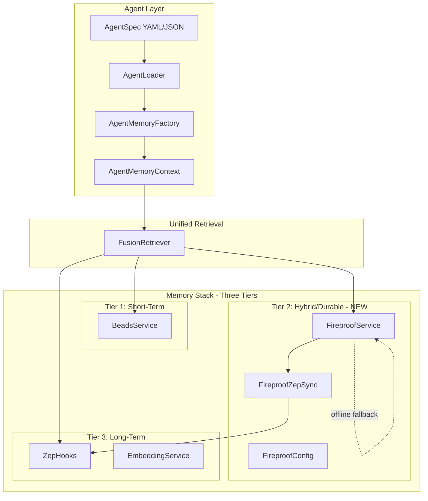
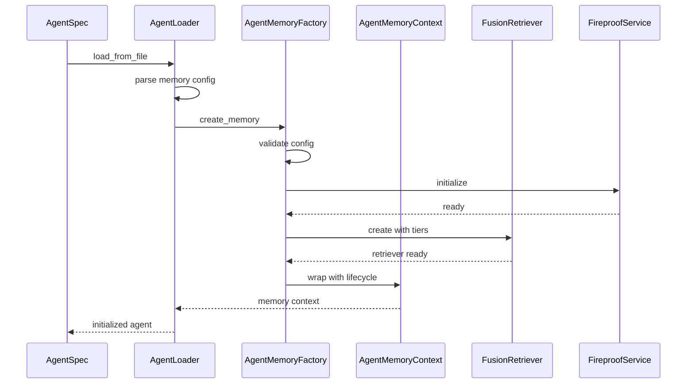
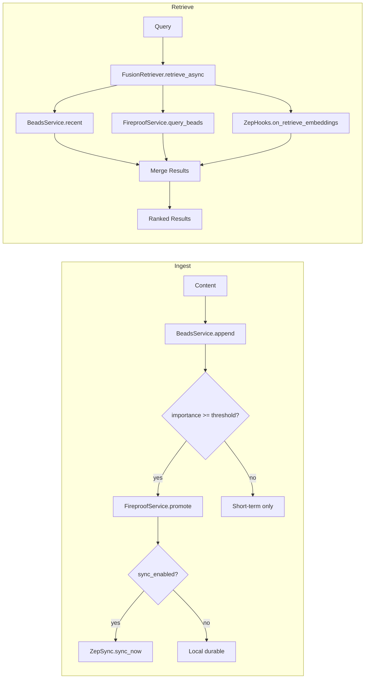

# Agent-Fireproof Memory Integration Plan

**Date**: 2026-01-13  
**Status**: Planning  
**Author**: Architect Mode

## Executive Summary

This plan connects the Uniform Semantic Agent (USA) specification system to the newly integrated Fireproof hybrid memory tier. The integration enables agents to leverage local-first durable storage with offline fallback capabilities while maintaining compatibility with the existing Zep long-term memory system.

## Current Architecture Analysis

### Memory Stack Components

| Component | Location | Purpose |
|-----------|----------|---------|
| **BeadsService** | `memory_system/beads.py` | Short-term context (SQLite) |
| **FireproofService** | `memory_system/fireproof/service.py` | Hybrid durable cache (NEW) |
| **ZepHooks** | `memory_system/hooks/zep.py` | Long-term vector storage |
| **FusionRetriever** | `memory_system/fusion.py` | Three-tier unified retrieval |
| **ChrysalisMemory** | `memory_system/chrysalis_memory.py` | Pattern-based memory with CRDT |

### Agent Specification System

| Component | Location | Purpose |
|-----------|----------|---------|
| **AgentSpec** | `usa_implementation/core/types.py` | Agent specification schema |
| **Memory config** | `usa_implementation/core/types.py:146-165` | Memory type/provider config |
| **Loader** | `usa_implementation/loader.py` | YAML/JSON spec loading |
| **BridgeSchema** | `memory_system/bridge_schema.py` | Cross-language interop |

### Identified Gaps

1. **MemoryType enum** lacks `HYBRID` option - agents cannot specify Fireproof
2. **BridgeMemoryLayer** lacks `DURABLE` layer - no cross-language interop for Fireproof
3. **No AgentMemoryFactory** - no factory to create FusionRetriever from AgentSpec
4. **No lifecycle management** - agents need memory context initialization/cleanup

## Target Architecture



## Data Flow Design

### Agent Initialization Flow



### Memory Ingest/Retrieve Flow



## Implementation Phases

### Phase 1: Extend Type Definitions

**Files to modify:**
- `usa_implementation/core/types.py`
- `usa_implementation/core/types_v2.py`  
- `memory_system/bridge_schema.py`

**Changes:**

1. Add `HYBRID` to MemoryType enum:
```python
class MemoryType(str, Enum):
    NONE = "none"
    SHORT_TERM = "short_term"
    LONG_TERM = "long_term"
    VECTOR = "vector"
    HYBRID = "hybrid"  # NEW - Fireproof-backed
```

2. Add `DURABLE` to BridgeMemoryLayer:
```python
class BridgeMemoryLayer(str, Enum):
    EPISODIC = "episodic"
    SEMANTIC = "semantic"
    PROCEDURAL = "procedural"
    WORKING = "working"
    ARCHIVAL = "archival"
    DURABLE = "durable"  # NEW - Fireproof layer
```

3. Extend Memory dataclass:
```python
@dataclass
class Memory:
    type: MemoryType
    scope: str
    provider: Optional[str] = None
    config: Dict[str, Any] = field(default_factory=dict)
    # NEW fields for Fireproof
    fireproof_enabled: bool = False
    fireproof_config: Optional[Dict[str, Any]] = None
```

### Phase 2: Create Agent Memory Adapter

**New file:** `memory_system/agent_adapter.py`

```python
# Conceptual structure
class AgentMemoryFactory:
    @classmethod
    def create_from_spec(cls, spec: AgentSpec) -> AgentMemoryContext
    
    @classmethod
    def create_fireproof_config(cls, config: Dict) -> FireproofConfig

class AgentMemoryContext:
    def __init__(self, fusion: FusionRetriever, fireproof: FireproofService)
    async def __aenter__(self) -> AgentMemoryContext
    async def __aexit__(self, ...) -> None
    
    @property
    def retriever(self) -> FusionRetriever
    
    async def ingest(self, content: str, **kwargs) -> Dict
    async def retrieve(self, query: str, **kwargs) -> Dict
    async def close(self) -> None
```

### Phase 3: Integration and Testing

**Update:** `usa_implementation/loader.py`
- Add memory initialization during agent loading
- Support async initialization for Fireproof

**New file:** `usa_implementation/tests/test_memory_integration.py`
- Test agent spec with memory.type = "hybrid"
- Test lifecycle management (init/close)
- Test ingest/retrieve through agent context

### Phase 4: Documentation

**Update:** `memory_system/README.md`
- Add agent integration section
- Include code examples

**New file:** `examples/agent_with_fireproof.yaml`
- Example agent spec with Fireproof memory

## Example Agent Spec with Fireproof

```yaml
apiVersion: usa/v2
kind: Agent
metadata:
  name: research-assistant
  version: 1.0.0

identity:
  role: Research Assistant
  goal: Help users find and synthesize information

capabilities:
  memory:
    type: hybrid  # NEW - enables Fireproof tier
    scope: session
    provider: fireproof
    config:
      promotion_threshold: 0.7
      sync_enabled: true
      sync_gateway: "http://zep:8000"
      local_vector_cache: true
      metadata_capture: true
    fireproof_enabled: true
    fireproof_config:
      db_path: "./agent_memory.db"
      max_documents: 10000
      auto_sync_interval: 300

execution:
  llm:
    provider: openai
    model: gpt-4
    temperature: 0.7
```

## Risk Assessment

| Risk | Probability | Impact | Mitigation |
|------|-------------|--------|------------|
| Backward compatibility | Low | High | Keep existing MemoryType values, add new |
| Async initialization complexity | Medium | Medium | Provide sync fallback methods |
| Config validation errors | Medium | Low | Add comprehensive validation in factory |
| Memory leaks | Low | High | Implement proper lifecycle management |

## Success Criteria

1. ✅ Agent spec with `memory.type: hybrid` loads successfully
2. ✅ AgentMemoryContext initializes Fireproof automatically
3. ✅ Ingest operations flow through all three tiers
4. ✅ Retrieve operations merge results correctly
5. ✅ Offline fallback works when Zep unavailable
6. ✅ All existing tests continue to pass
7. ✅ New integration tests cover agent-memory paths

## Next Steps

1. **Approve plan** - Review and confirm approach
2. **Switch to Code mode** - Implement Phase 1-4
3. **Run integration tests** - Validate implementation
4. **Update documentation** - Complete Phase 4

---

*Plan prepared by Architect Mode following Complex Learning Agent methodology*
