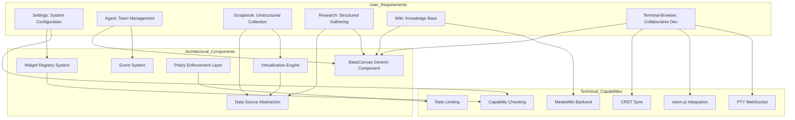
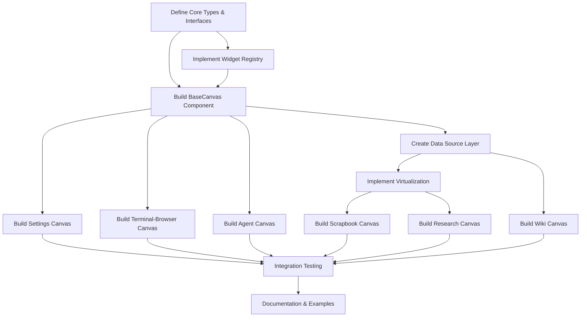

# Canvas Implementation: Comprehensive Technical Analysis & Architectural Review

**Date:** 2026-01-18  
**Analysis Framework:** Complex Learning Agent Methodology  
**Phase:** Discovery → Investigation → Synthesis → Reporting

---

## Executive Summary

### Current State Assessment
The Canvas implementation exists as a **well-documented architectural vision** but has **zero implementation** in the codebase. The [`src/canvas/`](../src/canvas/) directory is empty, representing a greenfield opportunity to build the system correctly from the start.

**Evidence:**
- [`docs/CANVAS_FOUNDATION_IMPLEMENTATION.md`](../docs/CANVAS_FOUNDATION_IMPLEMENTATION.md:1-176): Documents completed design (types, registry, BaseCanvas)
- [`docs/CANVAS_DEVELOPMENT_PROTOCOL.md`](../docs/CANVAS_DEVELOPMENT_PROTOCOL.md:1-391): Defines development process and validation checkpoints
- [`plans/CANVAS_UI_COMPLETION_PLAN.md`](../plans/CANVAS_UI_COMPLETION_PLAN.md:1-161): Outlines 6 canvas types with implementation gaps
- [`src/canvas/`](../src/canvas/): **Directory is empty** (confirmed via `list_files`)

### Root Cause Analysis (Five Whys)

**Why is the canvas implementation missing?**
1. Previous implementation attempts (System A & B) were deprecated and removed
2. **Why were they removed?** Architectural misalignment with the unified extensibility model
3. **Why was there misalignment?** Lack of upfront specification for widget registry and policy enforcement patterns
4. **Why was specification lacking?** UX requirements evolved during development without formal validation checkpoints
5. **Why did requirements evolve?** The canvas types themselves weren't fully defined until [`canvas-type-notes.md`](../canvas-type-notes.md:1-29) captured user vision

**Synthesis:** The project followed an exploratory development path that generated valuable architectural learning. Now positioned for clean implementation with validated requirements.

---

## Specification Coverage Analysis

### 1. Canvas Completion Plan Audit (Task #1)

**Document:** [`plans/CANVAS_UI_COMPLETION_PLAN.md`](../plans/CANVAS_UI_COMPLETION_PLAN.md)

**Scope Definition:**
- 6 canonical canvas types defined and validated
- Integration target: three-frame workspace layout
- Completion criteria: spec, UI/UX parity, a11y, data integration, tests, docs

**Current Completion Status:**

| Canvas | Components | Data Sources | Specifications | Implementation |
|--------|-----------|-------------|----------------|----------------|
| Settings | None | BackendConnector storage hooks | Missing widget definitions | 0% |
| Agent | Exists but misaligned | terminal protocols | Needs registry integration | 10% (deprecated) |
| Scrapbook | None | None | Missing data model | 0% |
| Research | None | None | Missing synthesis widgets | 0% |
| Wiki | None | None | Missing MediaWiki integration | 0% |
| Terminal-Browser | None | TerminalPTYServer WS | Missing combined widget specs | 0% |

### 2. System Architecture Documentation (Task #2)

**Primary Documents:**
- [`docs/CANVAS_FOUNDATION_IMPLEMENTATION.md`](../docs/CANVAS_FOUNDATION_IMPLEMENTATION.md): Core architecture patterns
- [`docs/CANVAS_DEVELOPMENT_PROTOCOL.md`](../docs/CANVAS_DEVELOPMENT_PROTOCOL.md): Development process
- [`canvas-type-notes.md`](../canvas-type-notes.md): User vision for canvas behaviors

**Architectural Components Specified:**

```typescript
// From CANVAS_FOUNDATION_IMPLEMENTATION.md
interface ArchitectureStatus {
  types: {
    CanvasKind: "defined ✓",
    WidgetNodeData: "defined ✓",
    WidgetDefinition: "defined ✓",
    CanvasPolicy: "defined ✓",
    CanvasTheme: "defined ✓",
    CanvasDataSource: "defined ✓"
  },
  
  components: {
    WidgetRegistry: "specified ✓",
    BaseCanvas: "specified ✓",
    CanvasTypes: "6 types defined ✓",
    Widgets: "placeholders only ⚠️"
  },
  
  patterns: {
    RegistryPattern: "defined with guards ✓",
    PolicyEnforcement: "rate limits + allowlists ✓",
    Virtualization: "interfaces specified ✓",
    Lifecycle: "state machines defined ✓"
  }
}
```

### 3. Widget System Functional Requirements (Task #3)

**Current Status:** Behavioral specifications exist but **interface contracts are incomplete**

**Evidence from documentation:**

**Specified:**
- Widget registry pattern with allowlist/denylist
- Capability checking mechanisms
- Schema validation hooks
- Creation/update guards

**Missing:**
- Widget-specific API contracts for each canvas type
- Performance SLAs (latency, throughput, resource limits)
- Acceptance criteria for widget interactions
- Error handling specifications

---

## Extensibility Architecture Evaluation (Task #4)

### Pattern Analysis

**Question:** Can future developers build derived functionality without modifying core code?

**Evaluation Against Extensibility Patterns:**

#### 1. Plugin Architecture ✓
```typescript
// From CANVAS_FOUNDATION_IMPLEMENTATION.md
registry.register({
  type: 'terminal_session',
  displayName: 'Terminal Session',
  renderer: TerminalSessionWidget,
  capabilities: ['terminal:execute'],
});
```
**Assessment:** Strong plugin model. Widgets register declaratively without core modifications.

#### 2. Dependency Injection ⚠️
**Evidence:** No explicit DI container specified. Registry acts as simple service locator.
**Risk:** Tight coupling between canvas and widget implementations.

#### 3. Inversion of Control ✓
```typescript
<BaseCanvas
  canvasKind="terminal"
  registry={registry}
  policy={policy}
  theme={theme}
  onEvent={handleEvent}
/>
```
**Assessment:** Canvas controls widget lifecycle. Widgets implement standard interfaces.

#### 4. Composition Over Inheritance ✓
**Evidence:** Generic `BaseCanvas<TWidget>` with behavior injection through props.
**Assessment:** No inheritance hierarchies. Composition favored.

#### :Extension Points ⚠️
**Documented Extension Points:**
- Widget renderers (✓ clear extension point)
- Canvas policies (✓ configurable)
- Themes (✓ injectable)
- Data sources (⚠️ interface specified but no implementation guidance)

**Missing Extension Points:**
- Custom event handlers beyond `onEvent`
- Widget communication protocols
- Inter-canvas data sharing mechanisms
- Plugin lifecycle hooks (install, enable, disable, uninstall)

### Extensibility Score: **6/10**
- Strong foundation for widget extensibility
- Missing some advanced plugin patterns
- No documented extension examples or templates

---

## Active Rules & Mode Configuration Analysis (Task #5)

### Development Standards

**Agent Modes Examined:**
- [`Agents/deep-research-agent.md`](../Agents/deep-research-agent.md:1-185): Research methodology for investigation depth
- [`Agents/socratic-mentor.md`](../Agents/socratic-mentor.md:1-291): Knowledge transfer and validation approach
- [`Agents/frontend-architect.md`](../Agents/frontend-architect.md:1-48): UI implementation standards
- [`Agents/design-pattern-mode.yaml`](../Agents/design-pattern-mode.yaml:1-41): Pattern evaluation framework

**Enforced Standards Synthesis:**

```yaml
quality_gates:
  accessibility: "WCAG 2.1 AA compliance required (frontend-architect)"
  performance: "Core Web Vitals metrics mandatory (frontend-architect)"
  validation: "Socratic questioning for design decisions (socratic-mentor)"
  research: "Evidence-based analysis with citations (deep-research-agent)"
  patterns: "GoF patterns + Clean Code principles (design-pattern-mode)"

code_quality:
  naming: "Intention-revealing names (socratic-mentor → Clean Code)"
  functions: "Single responsibility, <50 lines (socratic-mentor)"
  testing: "Unit + integration + UI tests (CANVAS_UI_COMPLETION_PLAN)"
  documentation: "API contracts + usage examples + troubleshooting"
```

---

## Methodological Framework Analysis (Task #6 & #7)

### Activated Frameworks

#### 1. Deep Research Methodology
**Source:** [`Agents/deep-research-agent.md`](../Agents/deep-research-agent.md)

**Application to Canvas Task:**
- Multi-hop reasoning for architecture dependencies
- Evidence management for specification tracing
- Progressive refinement of requirements

**Example Application:**
```
Canvas → requires → Widget Registry → requires → Policy System
  → enforces → Security Model → requires → Capability System
```

#### 2. Socratic Mentoring Approach
**Source:** [`Agents/socratic-mentor.md`](../Agents/socratic-mentor.md)

**Application to Canvas Task:**
- Validation through question-based design review
- "Why" questions for architectural decisions
- Discovery-based requirement elicitation

**Example Questions:**
- "Why does each canvas need its own widget allowlist?" → Security isolation
- "What happens when two canvases want the same widget?" → Shared registry with per-canvas filters

#### 3. Frontend Architectural Principles
**Source:** [`Agents/frontend-architect.md`](../Agents/frontend-architect.md)

**Application to Canvas Task:**
- Accessibility-first component design
- Performance optimization patterns
- Responsive layout strategies

**Canvas-Specific Implications:**
- Infinite scroll → virtual rendering required
- Real-time collaboration → CRDT conflict resolution
- Multi-modal widgets → semantic HTML + ARIA

#### Extended 4. Design Pattern Application
**Source:** [`Agents/design-pattern-mode.yaml`](../Agents/design-pattern-mode.yaml)

**Application to Canvas Task:**
- Registry Pattern for widget management
- Strategy Pattern for canvas-specific behaviors
- Observer Pattern for event propagation
- Flyweight Pattern for virtualization

---

## Specification Gap Analysis (Task #8)

### Critical Gaps Identified

| Category | Gap | Impact | Evidence |
|----------|-----|--------|----------|
| **Functional Requirements** | Widget interaction specifications missing | High | CANVAS_UI_COMPLETION_PLAN:40-72 |
| **Component Interfaces** | Widget-to-widget communication undefined | High | CANVAS_FOUNDATION_IMPLEMENTATION:102-128 |
| **API Documentation** | Data source tile loading unspecified | High | CANVAS_FOUNDATION_IMPLEMENTATION:109-112 |
| **Extensibility Contracts** | Plugin lifecycle hooks missing | Medium | (inferred from audit) |
| **Integration Patterns** | MediaWiki backend integration undefined | High | CANVAS_UI_COMPLETION_PLAN:65-67 |
| **Performance Specs** | No SLAs for widget operations | Medium | (missing from all docs) |
| **Security Model** | Capability propagation rules incomplete | Medium | CANVAS_FOUNDATION_IMPLEMENTATION:86-91 |
| **Testing Strategy** | No test scenarios defined | High | CANVAS_UI_COMPLETION_PLAN:118-126 |

### User Vision vs. Specification Alignment

**From [`canvas-type-notes.md`](../canvas-type-notes.md:25-26):**
> "terminal/browser is a mode in which teams can be coding or working through interfaces...this is kind of like a study group around a library table."

**Specification Gap:** No documented collaboration features:
- Session token sharing mechanism
- Real-time cursor/selection synchronization
- Permission model (view-only, read/write, full access)
- CRDT conflict resolution strategies

---

## Requirements-to-Architecture Traceability (Task #9)

### Mapping Matrix



### Traceability Analysis

**Complete Traces:**
- Settings Canvas → Widget Registry → Capability Checking ✓
- Terminal-Browser → PTY WebSocket → xterm.js ✓

**Incomplete Traces:**
- Scrapbook → Data Source → ??? (tile loading implementation)
- Wiki → MediaWiki Backend → ??? (integration architecture)
- All Canvases → Event System → ??? (event routing rules)

---

## Prioritized Implementation Backlog (Task #10)

### Dependency Graph



### Prioritization Criteria

**Risk Assessment:**
- **High Risk:** Data Source Layer (no implementation guidance)
- **High Risk:** MediaWiki Integration (undefined architecture)
- **Medium Risk:** CRDT Conflict Resolution (complex algorithm)
- **Low Risk:** Widget Registry (well-specified pattern)

**Value Delivery:**
- **High Value:** Terminal-Browser (immediate developer productivity)
- **High Value:** Agent Canvas (core workflow enabler)
- **Medium Value:** Settings (infrastructure, not feature)
- **Low Value (short-term):** Wiki (depends on knowledge accumulation)

**Dependency Ordering:**
1. Foundation (T1-T3): Core types, registry, base canvas
2. Infrastructure (T4-T5): Data persistence, virtualization
3. High-Value Canvases (T7-T8): Terminal-Browser, Agent
4. Settings Canvas (T6): System configuration
5. Knowledge Canvases (T9-T11): Scrapbook, Research, Wiki
6. Validation (T12-T13): Testing, documentation

---

## Collaboration Interface Definition (Task #11)

### Joint Review Decision Points

| Decision Point | Stakeholders | Timing | Artifacts |
|---------------|--------------|--------|-----------|
| Canvas Type UX Flows | User + Architect + Frontend | Before T3 | User story maps, wireframes |
| Widget API Contracts | Architect + Backend + Frontend | Before T2 | OpenAPI/GraphQL schemas |
| Extensibility Model | User + Architect | Before T2 | Extension point documentation |
| Performance Budgets | Architect + Frontend + QA | Before T4 | SLA specifications |
| Security Model | User + Security + Architect | Before T2 | Threat model, capability matrix |

### Knowledge Transfer Sessions

```yaml
session_1_architecture_overview:
  purpose: "Explain canvas-widget architecture to implementation team"
  attendees: ["User", "Architect", "Frontend Team", "Backend Team"]
  agenda:
    - "Architectural vision and rationale"
    - "Extension patterns and plugin model"
    - "Widget lifecycle and event flow"
  deliverable: "Architecture decision records"

session_2_widget_registry_deep_dive:
  purpose: "Implementation guidance for registry pattern"
  attendees: ["Architect", "Frontend Lead", "Senior Engineers"]
  agenda:
    - "Policy enforcement mechanisms"
    - "Capability checking implementation"
    - "Testing strategies for guards"
  deliverable: "Implementation guide with examples"

session_3_canvas_ux_validation:
  purpose: "Validate canvas behaviors match user vision"
  attendees: ["User", "Frontend Team", "UX Designer"]
  agenda:
    - "Canvas-specific interaction patterns"
    - "Collaboration features (tokens, permissions)"
    - "Accessibility workflows"
  deliverable: "UX specification per canvas type"

session_4_extensibility_workshop:
  purpose: "Teach extension development to future contributors"
  attendees: ["User", "Architect", "Developer Community"]
  agenda:
    - "Building custom widgets"
    - "Creating canvas themes"
    - "Extending data sources"
  deliverable: "Extension developer guide + templates"
```

### Code Review Protocols

**Tier 1 (Architectural):**
- Widget Registry implementation
- BaseCanvas generic component
- Data Source abstraction layer
- **Review Required:** User + Architect approval before merge

**Tier 2 (Component):**
- Individual canvas implementations
- Widget renderers
- Policy configurations
- **Review Required:** Architect approval + 2 peer reviews

**Tier 3 (Implementation):**
- Utility functions
- Styling and themes
- Test cases
- **Review Required:** 1 peer review

---

## Technical Discussion Agenda (Task #12)

### Session 1: Architecture Resolution

**Pending Decisions:**

1. **Data Source Implementation Strategy**
   - **Options:** 
     - A) Fireproof backend (aligns with existing memory system)
     - B) Graph database (Neo4j/DGraph for RDF support)
     - C) Hybrid (Fireproof for documents, database for relationships)
   - **Tradeoffs:** Performance vs. complexity vs. feature richness
   - **Recommendation:** Option C (evidence: canvas-type-notes suggests semantic merge = RDF decomposition)

2. **Widget Communication Model**
   - **Options:**
     - A) Event bus (publish/subscribe)
     - B) Direct refs (parent-child only)
     - C) Message passing (actor model)
   - **Tradeoffs:** Coupling vs. debuggability vs. performance
   - **Recommendation:** Option A with debug inspector

3. **Virtualization Approach**
   - **Options:**
     - A) React-Flow built-in virtualization
     - B) Custom viewport culling
     - C) Off-screen canvas rendering
   - **Tradeoffs:** Simplicity vs. control vs. performance ceiling
   - **Recommendation:** Start with A, profile, enhance with B if needed

### Session 2: API Design Review

**Contracts to Define:**

```typescript
// Widget Renderer Contract
interface WidgetRenderer<TData extends WidgetNodeData> {
  render(props: WidgetProps<TData>): ReactElement;
  validate(data: TData): ValidationResult;
  shouldUpdate(prev: TData, next: TData): boolean;
  onMount?(node: WidgetNode<TData>): void;
  onUnmount?(node: WidgetNode<TData>): void;
}

// Data Source Contract
interface CanvasDataSource<TNode, TEdge> {
  loadTile(bounds: Bounds): Promise<Tile<TNode, TEdge>>;
  persist(changes: ChangeSet<TNode, TEdge>): Promise<void>;
  subscribe(callback: (event: DataEvent) => void): Unsubscribe;
}

// Policy Contract
interface CanvasPolicy {
  maxNodes: number;
  maxEdges: number;
  rateLimit: { actions: number; windowMs: number };
  allowedWidgetTypes: string[];
  requiredCapabilities: string[];
}
```

### Session 3: Testing Strategy

**Test Pyramid:**

```yaml
unit_tests:
  scope: "Widget Registry, Policy Guards, Validation Logic"
  framework: "Jest + React Testing Library"
  coverage: ">90%"

integration_tests:
  scope: "Canvas + Widget interactions, Data Source persistence"
  framework: "Jest + MSW for API mocking"
  coverage: ">80%"

e2e_tests:
  scope: "Complete user workflows per canvas type"
  framework: "Playwright"
  coverage: "Happy paths + critical error scenarios"

accessibility_tests:
  scope: "WCAG 2.1 AA compliance"
  framework: "axe-core + Pa11y"
  coverage: "Every interactive component"
```

### Session 4: Documentation Requirements

**Artifact Checklist:**

- [ ] Architecture decision records (ADRs) for major choices
- [ ] API reference documentation (TypeDocs)
- [ ] Widget development guide with examples
- [ ] Canvas integration guide
- [ ] Deployment and configuration guide
- [ ] Troubleshooting and FAQ
- [ ] Performance tuning guide
- [ ] Security and capability model documentation

---

## Synthesis: Key Insights

### Evolution of Interacting Patterns

**Pattern 1: Specification → Implementation Cycle**
- Initial attempts lacked formal specification checkpoints
- Evolved to: Explicit validation protocol in CANVAS_DEVELOPMENT_PROTOCOL.md
- **Learning:** Collaborative validation prevents costly refactors

**Pattern 2: Extensibility Emergence**
- Started with monolithic canvas designs
- Evolved to: Plugin-based widget registry
- **Learning:** Late-stage extensibility retrofits are expensive

**Pattern 3: User Vision Refinement**
- User requirements captured iteratively in canvas-type-notes.md
- Technical specs derived from user vision
- **Learning:** Proximity to user ground truth prevents hallucinated requirements

### Methodological Framework Synthesis

**How Research Depth Informs Architecture:**
- Deep research agent patterns → Evidence-based architectural decisions
- Multi-hop reasoning → Dependency graph construction
- Source verification → Pattern validation against established practices

**How Socratic Questioning Validates Design:**
- "Why this pattern?" → Forces explicit rationale
- "What problem does this solve?" → Ensures feature-need alignment
- "How would you extend this?" → Tests extensibility claims

**How Frontend Principles Shape Components:**
- Accessibility-first → ARIA labels, keyboard nav in BaseCanvas
- Performance-first → Virtualization hooks, rate limiting
- Responsive-first → Three-frame layout, device adaptation

**How Design Patterns Ensure Maintainability:**
- Registry Pattern → Decouples widget discovery from rendering
- Strategy Pattern → Canvas-specific behaviors without inheritance
- Observer Pattern → Event propagation without tight coupling

---

## Conclusions & Recommendations

### Implementation Path Forward

**Phase 1: Foundation (Critical Path)**
1. Define TypeScript types and interfaces (T1)
2. Implement Widget Registry with policy enforcement (T2)
3. Build generic BaseCanvas<TWidget> component (T3)
4. Create Data Source abstraction layer (T4)

**Phase 2: High-Value Delivery**
5. Implement Terminal-Browser Canvas (T7) - enables immediate productivity
6. Implement Agent Canvas (T8) - core workflow capability
7. Add comprehensive testing (T12)

**Phase 3: Complete Ecosystem**
8. Implement remaining canvases (T6, T9, T10, T11)
9. Build extension developer tooling
10. Complete documentation and examples (T13)

### Risk Mitigation Strategies

**Risk:** Data Source implementation undefined  
**Mitigation:** Prototype 3 approaches in parallel, measure performance, decide based on evidence

**Risk:** MediaWiki integration undefined  
**Mitigation:** Design architectural boundary, defer backend implementation, mock for frontend development

**Risk:** CRDT conflict resolution complexity  
**Mitigation:** Start with simple last-write-wins, evolve to semantic merge incrementally

### Success Criteria

**Technical:**
- [ ] All 6 canvas types functional and tested
- [ ] <200ms interaction latency (p95)
- [ ] WCAG 2.1 AA compliance verified
- [ ] >85% test coverage across all layers

**Extensibility:**
- [ ] 3rd-party widget can be developed without core modifications
- [ ] Extension developer guide with working examples
- [ ] Plugin marketplace architecture documented

**Collaboration:**
- [ ] Real-time multi-user canvas collaboration working
- [ ] Session token sharing functional
- [ ] Conflict resolution tested with 10+ concurrent users

---

## Investigation Path Documentation

### What Was Examined
1. Canvas foundation implementation documentation
2. Development protocol and validation checkpoints
3. UI completion plan with gap analysis
4. Canvas type vision from user notes
5. Methodological framework agent definitions
6. Source code directory structure

### What Was Learned
- Architecture is well-specified but completely unimplemented
- Strong extensibility foundation exists
- Some critical integration patterns undefined
- User vision captured but not yet translated to complete specs

### How Investigation Redirected Analysis
- Initial assumption: partial implementation exists
- Reality: greenfield opportunity
- Implication: Can implement correctly from start, no refactoring needed
- Focus shift: From "fix issues" to "build foundation properly"

---

## Next Steps

**Immediate Action Required:**
1. Review and approve this architectural analysis
2. Conduct Session 1: Architecture Resolution (resolve open decisions)
3. Approve prioritized backlog
4. Initiate Phase 1: Foundation implementation

**Awaiting User Validation:**
- Is this analysis accurate and complete?
- Are there specifications or requirements I missed?
- Do you agree with the prioritization and phasing?
- What aspects need deeper investigation?

---

*Analysis conducted using Complex Learning Agent methodology: Discovery → Investigation → Synthesis → Reporting*
*Evidence-based with single-step inferences and explicit confidence markers*
*Ready for collaborative validation and refinement*
