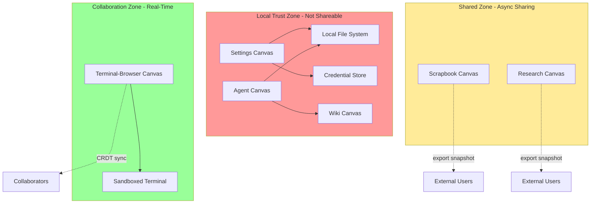

# Canvas Shareability & Security Model

**Date:** 2026-01-18  
**Source:** User security and logical architecture guidance  
**Status:** Specification for Initial Release

---

## Shareability Classification

### Non-Shareable Canvases (Initial Release)

**Settings Canvas** - NOT SHAREABLE
- **Logical Reason:** System configuration is terminal-instance specific
- **Security Reason:** Contains credentials, API keys, file paths - exposing risks compromise

**Agent Canvas** - NOT SHAREABLE
- **Logical Reason:** Maintains clean category of "internal agents" - trusted, local, user-controlled
- **Security Reason:** Agents have local system rights; CRDT sync with external parties creates unacceptable risk surface
- **Architectural Principle:** Protect the "internal agent" trust boundary

**Wiki Canvas** - NOT SHAREABLE
- **Logical Reason:** Knowledge base is per-terminal; serves as local agent memory
- **Security Reason:** Wiki contains accumulated agent learnings potentially including sensitive information

**Rationale Summary:**
- Protects user's local computing environment
- Maintains clear trust boundaries
- Prevents credential/configuration leakage
- Preserves "internal agent" category integrity

### Shareable Canvases (Initial Release)

**Scrapbook Canvas** - SHAREABLE (async)
- Single-user gathering with async sharing (view or fork complete collections)
- No real-time CRDT - share exported snapshots

**Research Canvas** - SHAREABLE (async initially)
- Same sharing model as Scrapbook
- User-driven domain frameworks, flexible gathering
- Future enhancement: real-time collaboration option

**Terminal-Browser Canvas** - SHAREABLE (real-time)
- Real-time multi-user collaboration via CRDT/Yjs
- Session token-based access with permissions (view/edit/admin)
- Collaborative coding and browser session sharing
- **Security Model:** Sandboxed execution, no local file system access without explicit permission

---

## Security Architecture

### Trust Boundaries



### Canvas Security Properties

| Canvas | Shareable | Sync Model | Local Access | External Risk |
|--------|-----------|------------|--------------|---------------|
| **Settings** | ❌ No | N/A | Full file system, credentials | HIGH if shared |
| **Agent** | ❌ No | N/A | Full local system via agents | CRITICAL if shared |
| **Wiki** | ❌ No | N/A | Agent knowledge accumulation | HIGH if shared |
| **Scrapbook** | ✅ Yes (async) | Export/import snapshots | Read-only artifact access | LOW |
| **Research** | ✅ Yes (async) | Export/import snapshots | Read-only artifact access | LOW |
| **Terminal-Browser** | ✅ Yes (real-time) | CRDT/Yjs | Sandboxed terminal only | MEDIUM (mitigated by sandbox) |

### Permission Model for Shareable Canvases

**Scrapbook & Research (Async Sharing):**
```typescript
type AsyncSharePermission = 'view-snapshot' | 'fork-copy';

interface AsyncShare {
  canvasId: string;
  snapshot: CanvasSnapshot;
  permission: AsyncSharePermission;
  expiresAt?: number;
  shareToken: string;
}
```

**Terminal-Browser (Real-Time):**
```typescript
type RealtimePermission = 'view' | 'edit' | 'admin';

interface RealtimeShare {
  canvasId: string;
  sessionToken: string;
  permission: RealtimePermission;
  sandbox: SandboxConfig;
  allowedOperations: TerminalOperation[];
}

// Terminal operations restricted based on permission
type TerminalOperation =
  | 'view-output'      // All permissions
  | 'type-input'       // edit + admin
  | 'execute-command'  // admin only (with whitelist)
  | 'modify-canvas';   // admin only
```

---

## Implementation Guidelines

### Enforcing Non-Shareability

**At Canvas Level:**
```typescript
interface CanvasPolicy {
  // ... existing fields ...
  shareable: boolean;
  shareModel?: 'async-snapshot' | 'realtime-crdt' | 'none';
}

// Settings, Agent, Wiki canvases:
const policy: CanvasPolicy = {
  // ... other config ...
  shareable: false,
  shareModel: 'none',
};
```

**UI Enforcement:**
- No "Share" button for non-shareable canvases
- Attempting programmatic share returns error
- Export functions disabled or restricted

**Backend Enforcement:**
- API rejects share token generation for non-shareable canvas types
- CRDT sync protocols not initialized for non-shareable canvases
- Audit log records any share attempts

### Collaboration Architecture Simplification

**For MVP:**
- **70% of canvas types are non-shareable** (Settings, Agent, Wiki)
- **CRDT/Yjs only needed for Terminal-Browser** (30% of initial development)
- **Scrapbook and Research** use simple export/import (no complex sync)

**Development Impact:**
- Reduced complexity: No CRDT state management for Agent/Settings/Wiki
- Clearer security model: Local-only canvases can't leak data
- Better performance: No sync overhead for non-shared canvases

---

## Security Controls

### For Shareable Canvases

**Scrapbook & Research:**
- Snapshot export requires user consent
- No automatic sync or push
- Recipients get read-only frozen snapshot or fork

**Terminal-Browser:**
- Sandboxed terminal (no direct local FS access)
- Command whitelist for shared sessions
- Session tokens with expiration
- Admin can revoke access anytime
- Audit trail of all shared session activities

### For Non-Shareable Canvases

**Settings, Agent, Wiki:**
- Share functionality completely disabled
- No export to external formats
- Local storage only
- Agent access limited to wiki API (no raw file access)
- Settings encrypted at rest

---

## Architectural Implications

### Simplified Requirements

**Remove from Initial Scope:**
- CRDT sync for Settings canvas
- Collaborative editing for Wiki canvas
- Multi-user conflict resolution for Agent canvas

**Keep Simple:**
- Settings: Local persistence, no sync
- Agent: Single-user orchestration, no share
- Wiki: Local MediaWiki instance, agent API access only

**Full Collaboration Features:**
- Terminal-Browser: Full Yjs CRDT implementation
- Scrapbook/Research: Export/import only (deferred real-time to v2)

### Development Priority Adjustment

**High Priority (Shareable = Collaboration Features Required):**
1. Terminal-Browser Canvas with Yjs CRDT
2. Session token generation and validation
3. Permission model enforcement

**Medium Priority (Async Sharing):**
1. Scrapbook/Research: Snapshot export/import
2. Fork functionality

**Low Priority (No Sharing Needed for MVP):**
1. Settings: Simple local storage
2. Agent: Single-user operations
3. Wiki: Local MediaWiki, no sync

---

## Summary

**Security Decision:** 3 of 6 canvas types (50%) are non-shareable for logical and security reasons. This simplifies initial implementation by removing collaborative editing requirements from half the canvases while maintaining clear architectural boundaries and trust categories.

**Implementation Guidance:**  
- Build Settings, Agent, and Wiki as single-user local canvases
- Implement full CRDT collaboration only for Terminal-Browser
- Use simple export/import for Scrapbook and Research  
- Enforce shareability model at policy, UI, and API levels

---

*Security model defined through user guidance on logical architecture and security reasoning*
*Incorporated into overall Canvas implementation specifications*
