# Chrysalis Development Streamlining Plan

**From Review Insights to Product Launch**

**Version**: 1.0.0  
**Date**: 2026-01-13  
**Source Document**: [CHRYSALIS_MULTI_AGENT_OFFSITE_REPORT.md](../docs/CHRYSALIS_MULTI_AGENT_OFFSITE_REPORT.md)  
**Plan Horizon**: 16 weeks (4 sprints × 4 phases)

---

## Executive Summary

This document transforms the multi-agent offsite review findings into an executable development plan. It sequences 23 discrete work items across 5 phases, with explicit dependency management, risk mitigation gates, and rollback procedures designed to achieve **launch-ready status** by end of Q2 2026.

**Critical Path Duration**: 14 weeks  
**Launch Gate Target**: Week 16  
**Risk Buffer**: 2 weeks (embedded in hardening phase)

---

## Table of Contents

1. [Categorized Review Takeaways](#1-categorized-review-takeaways)
2. [Technical Dependency Map](#2-technical-dependency-map)
3. [Launch Readiness Criteria](#3-launch-readiness-criteria)
4. [Critical Path Sequence](#4-critical-path-sequence)
5. [Phased Milestone Structure](#5-phased-milestone-structure)
6. [Risk Mitigation Checkpoints](#6-risk-mitigation-checkpoints)
7. [Rollback Procedures](#7-rollback-procedures)
8. [Development Plan Artifact](#8-development-plan-artifact)

---

## 1. Categorized Review Takeaways

### 1.1 Priority Classification Schema

| Priority | Definition | SLA | Count |
|----------|------------|-----|-------|
| 🔴 **Critical** | Blocks launch; system stability risk | Must fix before Phase 3 | 4 |
| 🟠 **High** | Significant technical debt; scaling blocker | Must fix before Phase 4 | 6 |
| 🟡 **Medium** | Quality improvement; maintainability | Should fix before launch | 8 |
| 🟢 **Low** | Nice-to-have; future optimization | Can defer post-launch | 5 |

### 1.2 Critical Priority Items (🔴)

| ID | Item | Source Finding | Impact | Owner Placeholder |
|----|------|----------------|--------|-------------------|
| C-1 | **Missing Observability Stack** | DevOps Architect, System Architect | Cannot detect production issues; blind flight | `[TBD: Platform Team]` |
| C-2 | **Memory Class SRP Violation** | Refactoring Expert, Design Patterns | 311 LOC monolith blocks independent scaling | `[TBD: Core Team]` |
| C-3 | **No Containerization** | DevOps Architect | Deployment irreproducibility; environment drift | `[TBD: Platform Team]` |
| C-4 | **Configuration Scatter** | System Architect, DevOps | 3+ config locations create deployment friction | `[TBD: Core Team]` |

### 1.3 High Priority Items (🟠)

| ID | Item | Source Finding | Impact | Owner Placeholder |
|----|------|----------------|--------|-------------------|
| H-1 | **No Prompt Registry** | Prompt Engineer | Token waste; no A/B testing; prompt drift | `[TBD: AI Team]` |
| H-2 | **Duplicate CLI Versions** | Frontend Architect, Refactoring | User confusion; maintenance burden | `[TBD: Core Team]` |
| H-3 | **Surface Area Sprawl** | Complex Learning Agent | 27 directories → cognitive load → bugs | `[TBD: Tech Lead]` |
| H-4 | **Scaling Bottlenecks** | System Architect | ChromaDB single-node; Python GIL | `[TBD: Platform Team]` |
| H-5 | **No Distributed Coordination** | System Architect | Agent coordination fails at scale | `[TBD: Platform Team]` |
| H-6 | **Dependency Fragility** | System Architect | yjs single maintainer; WebML maturity | `[TBD: Core Team]` |

### 1.4 Medium Priority Items (🟡)

| ID | Item | Source Finding | Impact | Owner Placeholder |
|----|------|----------------|--------|-------------------|
| M-1 | **Naming Inconsistency** | Socratic Mentor | morph/convert/transform confusion | `[TBD: Tech Lead]` |
| M-2 | **No Contributor Guide** | Socratic Mentor | Onboarding friction; tribal knowledge | `[TBD: Tech Lead]` |
| M-3 | **Missing ADR Process** | Socratic Mentor | Architectural decisions undocumented | `[TBD: Tech Lead]` |
| M-4 | **Test Coverage Gaps** | Refactoring Expert | Inferred from structure; risk unknown | `[TBD: QA Team]` |
| M-5 | **Documentation-Code Sync** | Refactoring Expert | Docs may be stale | `[TBD: Tech Writer]` |
| M-6 | **Hardcoded Store Types** | Design Patterns | OCP violation in Memory.initialize() | `[TBD: Core Team]` |
| M-7 | **Missing Factory Pattern** | Design Patterns | Direct instantiation couples to concrete | `[TBD: Core Team]` |
| M-8 | **Dual Language Overhead** | Complex Learning Agent | TS/Python coordination friction | `[TBD: Tech Lead]` |

### 1.5 Low Priority Items (🟢)

| ID | Item | Source Finding | Impact | Owner Placeholder |
|----|------|----------------|--------|-------------------|
| L-1 | **UI Workspace Unclear** | Frontend Architect | Integration with core unknown | `[TBD: Frontend Team]` |
| L-2 | **Missing Build Caching** | DevOps Architect | Slower CI; developer friction | `[TBD: Platform Team]` |
| L-3 | **No Service Mesh** | System Architect | Inter-service observability gap | `[TBD: Platform Team]` |
| L-4 | **Interface Documentation** | Refactoring Expert | Type contracts underdocumented | `[TBD: Tech Writer]` |
| L-5 | **God Object Risk** | Design Patterns | Memory class Composite opportunity | `[TBD: Core Team]` |

---

## 2. Technical Dependency Map

### 2.1 Component Dependency Graph


### 2.2 Dependency Matrix

| Item | Depends On | Enables | Blocking Risk |
|------|------------|---------|---------------|
| C-1: Observability | — | C-2, H-4, All debugging | 🔴 Critical |
| C-2: Memory Decomposition | C-1, C-4 | H-3, H-4 | 🔴 Critical |
| C-3: Containerization | — | H-4, H-5 | 🔴 Critical |
| C-4: Configuration | — | C-2, H-1 | 🔴 Critical |
| H-1: Prompt Registry | C-4 | H-4 | 🟠 High |
| H-2: CLI Consolidation | — | H-3 | 🟠 High |
| H-3: Directory Consolidation | C-2, H-2 | M-1, M-2 | 🟠 High |
| H-4: Scaling Architecture | C-1, C-2, C-3 | H-5 | 🟠 High |
| H-5: Distributed Coordination | C-3, H-4 | L-3 | 🟠 High |

### 2.3 Unblocking Sequence

Based on dependency analysis, the optimal execution order is:

```
Parallel Stream A (Platform):  C-1 → C-3 → H-4 → H-5 → L-3
Parallel Stream B (Core):      C-4 → C-2 → H-3 → M-1 → M-2
Parallel Stream C (Features):  H-2 → H-1 → M-4 → L-1
```

**Critical Path**: C-1 → C-2 → H-3 → H-4 → Launch Gate

---

## 3. Launch Readiness Criteria

### 3.1 Quality Gates

| Gate | Metric | Threshold | Measurement Method | Status |
|------|--------|-----------|-------------------|--------|
| **G1: Test Coverage** | Line coverage | ≥70% | `pytest --cov`, `jest --coverage` | ⬜ Not Started |
| **G2: Type Safety** | Type errors | 0 errors | `mypy`, `tsc --noEmit` | ⬜ Not Started |
| **G3: Security Scan** | Critical/High vulns | 0 findings | `bandit`, `npm audit` | ⬜ Not Started |
| **G4: Performance** | P95 latency | <200ms for core ops | Load test suite | ⬜ Not Started |
| **G5: Documentation** | Core API coverage | 100% public interfaces | Doc coverage tool | ⬜ Not Started |
| **G6: Observability** | Metric coverage | All services instrumented | Prometheus scrape check | ⬜ Not Started |

### 3.2 Performance Benchmarks

| Operation | Target P50 | Target P95 | Target P99 | Current Baseline |
|-----------|------------|------------|------------|------------------|
| Memory retrieval | <50ms | <100ms | <200ms | TBD |
| Agent morph | <500ms | <1000ms | <2000ms | TBD |
| Prompt execution | <100ms | <200ms | <500ms | TBD |
| Vector search | <30ms | <50ms | <100ms | TBD |

### 3.3 Documentation Completeness Checklist

| Document | Required | Status |
|----------|----------|--------|
| README.md with quick start | ✅ | ⬜ Needs Update |
| API Reference (generated) | ✅ | ⬜ Not Started |
| Architecture Overview | ✅ | ✅ Exists (KnowledgeBuilder) |
| Contributor Guide | ✅ | ⬜ Not Started |
| Deployment Runbook | ✅ | ⬜ Not Started |
| ADR Index | ✅ | ⬜ Not Started |
| Troubleshooting Guide | ✅ | ⬜ Not Started |

### 3.4 Launch Readiness Scorecard

| Category | Weight | Gate | Required Score |
|----------|--------|------|----------------|
| Functionality | 30% | All critical features working | 100% |
| Quality | 25% | G1-G3 pass | 100% |
| Performance | 20% | G4 pass | 100% |
| Documentation | 15% | G5 pass, docs complete | 100% |
| Observability | 10% | G6 pass | 100% |
| **Total** | 100% | — | **100%** |

---

## 4. Critical Path Sequence

### 4.1 Critical Path Items


### 4.2 Critical Path Analysis

| Sequence | Item | Duration | Slack | Notes |
|----------|------|----------|-------|-------|
| 1 | C-1: Observability Stack | 14 days | 0 | **Start immediately** |
| 1 | C-4: Configuration Centralization | 7 days | 7 days | Can start parallel |
| 2 | C-2: Memory Decomposition | 14 days | 0 | **Blocks everything downstream** |
| 3 | H-3: Directory Consolidation | 10 days | 4 days | — |
| 3 | H-4: Scaling Architecture | 14 days | 0 | **Second critical bottleneck** |
| 4 | Launch Gate | — | — | Week 16 target |

**Total Critical Path Duration**: 14 + 14 + 14 = **42 days (6 weeks core)** + 2 weeks buffer = **8 weeks minimum**

---

## 5. Phased Milestone Structure

### 5.1 Phase Overview

```mermaid
graph LR
    subgraph "Phase 1: Foundation"
        P1[Weeks 1-4<br/>Observability + Config]
    end
    
    subgraph "Phase 2: Stabilization"
        P2[Weeks 5-8<br/>Memory + CLI + Prompts]
    end
    
    subgraph "Phase 3: Integration"
        P3[Weeks 9-12<br/>Consolidation + Scaling]
    end
    
    subgraph "Phase 4: Hardening"
        P4[Weeks 13-14<br/>Testing + Docs]
    end
    
    subgraph "Phase 5: Launch"
        P5[Weeks 15-16<br/>Final Polish + Launch]
    end
    
    P1 --> G1((Gate 1))
    G1 --> P2
    P2 --> G2((Gate 2))
    G2 --> P3
    P3 --> G3((Gate 3))
    G3 --> P4
    P4 --> G4((Gate 4))
    G4 --> P5
    P5 --> LG((🚀 Launch))
    
    style G1 fill:#ff0,stroke:#333
    style G2 fill:#ff0,stroke:#333
    style G3 fill:#ff0,stroke:#333
    style G4 fill:#ff0,stroke:#333
    style LG fill:#0f0,stroke:#333
```



### 5.2 Phase 1: Foundation (Weeks 1-4)

**Objective**: Establish infrastructure for all subsequent work

| Week | Sprint Goal | Deliverables | Success Criteria |
|------|-------------|--------------|------------------|
| 1-2 | Observability MVP | OpenTelemetry instrumentation, Prometheus setup | Metrics scraping working |
| 1 | Config centralization design | RFC document, migration plan | Team approval |
| 2-3 | Config implementation | Central config module | All services use central config |
| 3-4 | Containerization | Dockerfiles for all services | `docker-compose up` works |

**Phase 1 Deliverables**:
- [ ] OpenTelemetry SDK integrated
- [ ] Prometheus + Grafana deployed
- [ ] Central configuration module
- [ ] Docker Compose for local dev
- [ ] Kubernetes manifests (draft)

**Exit Criteria (Gate 1)**:
- [ ] All services emit metrics
- [ ] Config changes require no code modifications
- [ ] Local dev runs in containers

---

### 5.3 Phase 2: Stabilization (Weeks 5-8)

**Objective**: Refactor core components; establish stable interfaces

| Week | Sprint Goal | Deliverables | Success Criteria |
|------|-------------|--------------|------------------|
| 5-6 | Memory decomposition | WorkingMemory, EpisodicMemory, SemanticMemory, CoreMemory classes | Each memory type independently testable |
| 5 | CLI consolidation | Single `chrysalis-cli` binary | v1 deprecated, v2 renamed |
| 6-7 | Prompt Registry MVP | Centralized prompt storage with versioning | Prompts retrievable by ID+version |
| 7-8 | Memory facade | Unified interface over decomposed classes | Zero breaking changes to consumers |

**Phase 2 Deliverables**:
- [ ] Four memory type classes with tests
- [ ] Memory facade maintaining backward compatibility
- [ ] Unified CLI with deprecation notices
- [ ] Prompt Registry with basic CRUD

**Exit Criteria (Gate 2)**:
- [ ] Memory class <100 LOC (facade only)
- [ ] Single CLI entry point
- [ ] 100% prompt migration complete
- [ ] All existing tests pass

---

### 5.4 Phase 3: Integration (Weeks 9-12)

**Objective**: Consolidate architecture; prepare for scale

| Week | Sprint Goal | Deliverables | Success Criteria |
|------|-------------|--------------|------------------|
| 9-10 | Directory restructure | 27 dirs → 8 dirs migration | All imports updated |
| 9-10 | Naming standardization | "morph" as canonical term | No "convert/transform" in APIs |
| 11-12 | Scaling architecture | Distributed vector store design | Design doc approved |
| 11-12 | Distributed coordination | NATS/Redis integration plan | POC working |

**Phase 3 Deliverables**:
- [ ] Consolidated directory structure
- [ ] Import alias layer for backward compatibility
- [ ] Distributed vector store RFC
- [ ] Coordination POC (NATS or similar)

**Exit Criteria (Gate 3)**:
- [ ] Codebase navigable in <8 top-level directories
- [ ] `grep -r "convert\|transform"` returns 0 in API surfaces
- [ ] Scaling design peer-reviewed
- [ ] Coordination POC handles 10 agents

---

### 5.5 Phase 4: Hardening (Weeks 13-14)

**Objective**: Quality assurance; documentation completion

| Week | Sprint Goal | Deliverables | Success Criteria |
|------|-------------|--------------|------------------|
| 13 | Test coverage push | Unit + integration tests | ≥70% coverage |
| 13 | Security audit | Bandit, npm audit remediation | 0 critical/high findings |
| 14 | Documentation sprint | Contributor guide, ADRs, runbooks | All docs complete |
| 14 | Performance testing | Load test suite | All benchmarks met |

**Phase 4 Deliverables**:
- [ ] Test suite with coverage report
- [ ] Security scan green
- [ ] Complete documentation set
- [ ] Performance benchmark results

**Exit Criteria (Gate 4)**:
- [ ] G1-G6 quality gates all pass
- [ ] Zero P0/P1 bugs open
- [ ] Deployment runbook tested

---

### 5.6 Phase 5: Launch (Weeks 15-16)

**Objective**: Final polish; go-live

| Week | Sprint Goal | Deliverables | Success Criteria |
|------|-------------|--------------|------------------|
| 15 | Final bug fixes | All P2 bugs resolved | Bug backlog empty |
| 15 | Launch checklist | Completed launch readiness review | All stakeholders sign-off |
| 16 | Launch execution | Production deployment | System operational |
| 16 | Hypercare | Monitoring, rapid response | SLA met for 48 hours |

**Phase 5 Deliverables**:
- [ ] Production deployment successful
- [ ] Monitoring dashboards active
- [ ] Incident response on standby
- [ ] Launch announcement published

**Exit Criteria (Launch Gate)**:
- [ ] Launch readiness score = 100%
- [ ] 48-hour hypercare period stable
- [ ] No rollback required

---

## 6. Risk Mitigation Checkpoints

### 6.1 Risk Register

| ID | Risk | Probability | Impact | Mitigation | Checkpoint |
|----|------|-------------|--------|------------|------------|
| R1 | Memory refactor breaks consumers | Medium | High | Feature flags, backward-compatible facade | Gate 2 |
| R2 | Directory consolidation causes import failures | High | Medium | Import aliases, staged migration | Gate 3 |
| R3 | Observability overhead degrades performance | Low | Medium | Sampling, async instrumentation | Gate 1 |
| R4 | Container migration delays | Medium | High | Parallel development tracks | Gate 1 |
| R5 | Test coverage target unachievable | Medium | Medium | Prioritize critical paths | Gate 4 |
| R6 | Dependency vulnerability discovered | Low | Critical | Automated scanning, update policy | All Gates |

### 6.2 Checkpoint Validation Matrix

| Gate | Validation Activities | Required Attendees | Go/No-Go Decision Maker |
|------|----------------------|--------------------|-----------------------|
| Gate 1 | Demo observability dashboards; verify container startup | Platform Lead, Tech Lead | `[TBD: Engineering Manager]` |
| Gate 2 | Memory class unit test review; CLI smoke tests | Core Team Lead, QA Lead | `[TBD: Tech Lead]` |
| Gate 3 | Import validation suite; naming audit | Full Team | `[TBD: Tech Lead]` |
| Gate 4 | Quality gate dashboard review; security scan report | QA Lead, Security, Tech Lead | `[TBD: Engineering Manager]` |
| Launch | Full launch readiness review | All Stakeholders | `[TBD: Product Owner]` |

### 6.3 Checkpoint Agenda Template

```markdown
## Gate [N] Review - [Date]

### Attendance
- [ ] Required: [Names]
- [ ] Optional: [Names]

### Agenda (60 minutes)
1. Phase [N-1] Retrospective (15 min)
   - What went well?
   - What could improve?
   - Action items from last gate?

2. Deliverable Review (20 min)
   - Demo completed work
   - Review acceptance criteria

3. Quality Metrics (10 min)
   - Test coverage: ___%
   - Open bugs: P0=___, P1=___, P2=___
   - Security findings: ___

4. Risk Review (10 min)
   - New risks identified?
   - Mitigation status?

5. Go/No-Go Decision (5 min)
   - [ ] GO - Proceed to Phase [N]
   - [ ] NO-GO - Remediation required: _______________
```

---

## 7. Rollback Procedures

### 7.1 Rollback Strategy Overview

Each major change category has a defined rollback path:


### 7.2 Component-Specific Rollback Procedures

#### **7.2.1 Memory Decomposition Rollback**

**Trigger**: Memory operations fail after decomposition

**Rollback Steps**:
```bash
# 1. Revert to monolithic Memory class
git revert --no-commit <decomposition-commit-range>

# 2. Restore original imports
find . -name "*.py" -exec sed -i 's/from memory_system.working/from memory_system.core/g' {} \;

# 3. Verify tests pass
pytest memory_system/ -v

# 4. Deploy reversion
./scripts/deploy.sh --service memory --version previous
```

**Recovery Time Objective (RTO)**: 30 minutes  
**Recovery Point Objective (RPO)**: Last stable deployment

---

#### **7.2.2 Configuration Centralization Rollback**

**Trigger**: Services fail to start with central config

**Rollback Steps**:
```bash
# 1. Revert config module
git revert <config-central-commit>

# 2. Restore environment variable fallbacks
export CHRYSALIS_USE_LEGACY_CONFIG=true

# 3. Restart affected services
docker-compose restart

# 4. Verify service health
curl http://localhost:8080/health
```

**RTO**: 15 minutes  
**RPO**: Immediate (config is stateless)

---

#### **7.2.3 Directory Consolidation Rollback**

**Trigger**: Import errors after directory restructure

**Rollback Steps**:
```bash
# 1. Checkout previous directory structure
git checkout <pre-consolidation-tag> -- src/

# 2. Reinstall dependencies
npm install
pip install -e .

# 3. Run full test suite
npm test && pytest

# 4. Deploy stable version
git tag -a rollback-$(date +%Y%m%d) -m "Rollback from consolidation"
```

**RTO**: 1 hour (requires rebuild)  
**RPO**: Last tagged release

---

#### **7.2.4 Observability Stack Rollback**

**Trigger**: Performance degradation from instrumentation

**Rollback Steps**:
```bash
# 1. Disable tracing at application level
export OTEL_SDK_DISABLED=true

# 2. Reduce metric collection frequency
# Edit prometheus.yml
scrape_interval: 60s  # Was 15s

# 3. Restart affected services
docker-compose restart

# 4. Monitor performance recovery
watch 'curl -s http://localhost:9090/api/v1/query?query=process_cpu_seconds_total'
```

**RTO**: 5 minutes  
**RPO**: N/A (observability is non-critical path)

---

#### **7.2.5 CLI Consolidation Rollback**

**Trigger**: Users report broken CLI commands

**Rollback Steps**:
```bash
# 1. Restore both CLI versions
git revert <cli-consolidation-commit>

# 2. Rebuild CLI binaries
npm run build

# 3. Reinstall globally
npm link

# 4. Notify users
echo "CLI rollback complete. Both 'agent-morph' and 'agent-morph-v2' available."
```

**RTO**: 10 minutes  
**RPO**: Immediate

---

### 7.3 Emergency Rollback Playbook

```markdown
# EMERGENCY ROLLBACK PLAYBOOK

## Trigger Criteria
- P0 bug affecting >10% of users
- Data corruption detected
- Security breach identified

## Immediate Actions (First 5 minutes)
1. [ ] Page on-call engineer
2. [ ] Assess scope: What's broken? Who's affected?
3. [ ] Decide: Rollback vs Hot Fix

## Rollback Execution (Next 10 minutes)
1. [ ] Identify last known good deployment
2. [ ] Execute rollback script: `./scripts/emergency-rollback.sh`
3. [ ] Verify system health: `./scripts/health-check.sh`
4. [ ] Monitor error rates for 5 minutes

## Communication (Next 10 minutes)
1. [ ] Update status page
2. [ ] Notify stakeholders via Slack
3. [ ] Send customer communication (if public-facing)

## Post-Mortem (Within 48 hours)
1. [ ] Schedule blameless post-mortem
2. [ ] Document root cause
3. [ ] Identify preventive measures
4. [ ] Create follow-up tickets
```

---

## 8. Development Plan Artifact

### 8.1 Master Schedule


### 8.2 Resource Allocation Matrix

| Phase | Platform Team | Core Team | AI Team | QA Team | Tech Writing |
|-------|--------------|-----------|---------|---------|--------------|
| Phase 1 | **80%** | 20% | 0% | 0% | 0% |
| Phase 2 | 20% | **60%** | **40%** | 10% | 0% |
| Phase 3 | 30% | **50%** | 20% | 20% | 10% |
| Phase 4 | 10% | 20% | 10% | **50%** | **40%** |
| Phase 5 | 30% | 30% | 10% | 20% | 10% |

### 8.3 Success Metrics Dashboard

| Metric | Baseline | Target | Current | Trend |
|--------|----------|--------|---------|-------|
| Test Coverage | TBD | ≥70% | — | — |
| Memory Class LOC | 311 | <100 | — | — |
| Directory Count | 27 | ≤8 | — | — |
| P0/P1 Open Bugs | TBD | 0 | — | — |
| Security Findings | TBD | 0 critical/high | — | — |
| Documentation Score | TBD | 100% | — | — |
| P95 Latency (Memory) | TBD | <100ms | — | — |
| Observability Coverage | 0% | 100% | — | — |

### 8.4 RACI Matrix

| Task | Tech Lead | Platform Lead | Core Lead | AI Lead | QA Lead | Product Owner |
|------|-----------|--------------|-----------|---------|---------|---------------|
| C-1: Observability | C | R/A | I | I | I | I |
| C-2: Memory Decomposition | A | I | R | I | C | I |
| C-3: Containerization | C | R/A | I | I | I | I |
| C-4: Configuration | A | C | R | I | I | I |
| H-1: Prompt Registry | C | I | I | R/A | I | I |
| H-2: CLI Consolidation | A | I | R | I | C | I |
| H-3: Directory Consolidation | R/A | C | C | C | I | I |
| H-4: Scaling Architecture | A | R | C | I | I | C |
| Gate Reviews | A | R | R | R | R | A |
| Launch Decision | C | C | C | C | C | R/A |

**Legend**: R=Responsible, A=Accountable, C=Consulted, I=Informed

### 8.5 Communication Plan

| Event | Frequency | Audience | Channel | Owner |
|-------|-----------|----------|---------|-------|
| Daily Standup | Daily | Active Sprint Team | Slack + Video | Scrum Master |
| Sprint Planning | Bi-weekly | All Teams | Video | Tech Lead |
| Gate Review | Per phase | All Stakeholders | Video + Doc | Engineering Manager |
| Status Update | Weekly | Leadership | Email + Slack | Tech Lead |
| Risk Escalation | As needed | Leadership | Direct | Tech Lead |
| Launch Communication | Launch day | All Company | Email + Slack | Product Owner |

---

## Appendix A: Work Item Detail Cards

### A.1 C-1: Observability Stack

```yaml
id: C-1
title: Implement Observability Stack
priority: 🔴 Critical
phase: 1
duration: 14 days
dependencies: []
owner: "[TBD: Platform Team]"

description: |
  Deploy OpenTelemetry instrumentation across all services,
  with Prometheus metrics collection and Grafana dashboards.

acceptance_criteria:
  - All TypeScript services emit OTLP traces
  - All Python services emit OTLP traces
  - Prometheus scrapes all service metrics
  - Grafana dashboard shows system health
  - Alert rules configured for critical metrics

technical_notes: |
  - Use @opentelemetry/sdk-node for TypeScript
  - Use opentelemetry-python for Python
  - Configure sampling at 10% for non-critical traces
  - Ensure trace context propagates across service boundaries

rollback_procedure: "See Section 7.2.4"

success_metrics:
  - metric: Services instrumented
    target: 100%
  - metric: Dashboard latency
    target: "<5s refresh"
```

### A.2 C-2: Memory Decomposition

```yaml
id: C-2
title: Decompose Memory Class (SRP Refactor)
priority: 🔴 Critical
phase: 2
duration: 14 days
dependencies: [C-1, C-4]
owner: "[TBD: Core Team]"

description: |
  Extract the monolithic Memory class (311 LOC) into four
  specialized classes: WorkingMemory, EpisodicMemory,
  SemanticMemory, CoreMemory. Maintain backward compatibility
  via facade pattern.

acceptance_criteria:
  - Four memory type classes, each <80 LOC
  - Memory facade <100 LOC
  - All existing tests pass without modification
  - Zero breaking changes to public API
  - Each class independently unit testable

technical_notes: |
  - Apply Composite pattern for unified traversal
  - Use Protocol (Python) for memory store interface
  - Preserve _ensure_initialized() lazy loading
  - Add feature flag for gradual rollout

rollback_procedure: "See Section 7.2.1"

success_metrics:
  - metric: Memory facade LOC
    target: "<100"
  - metric: Test pass rate
    target: "100%"
```

*(Additional work item cards follow same format for H-1 through M-8)*

---

## Appendix B: Glossary

| Term | Definition |
|------|------------|
| **ADR** | Architecture Decision Record — documented architectural decision |
| **Facade** | Design pattern providing simplified interface to complex subsystem |
| **Gate** | Quality checkpoint requiring explicit approval to proceed |
| **Hypercare** | Intensive monitoring period immediately after launch |
| **OTLP** | OpenTelemetry Protocol — standard for telemetry data |
| **P0/P1/P2** | Bug priority levels (P0=Critical, P1=High, P2=Medium) |
| **RACI** | Responsible, Accountable, Consulted, Informed matrix |
| **RTO** | Recovery Time Objective — maximum acceptable downtime |
| **RPO** | Recovery Point Objective — maximum acceptable data loss |
| **SRP** | Single Responsibility Principle — each class has one reason to change |

---

## Document Control

| Version | Date | Author | Changes |
|---------|------|--------|---------|
| 1.0.0 | 2026-01-13 | Multi-Agent Simulation | Initial release |

**Next Review Date**: Gate 1 Review (2026-02-14)  
**Document Owner**: `[TBD: Tech Lead]`

---

*"Plans are worthless, but planning is everything."* — Dwight D. Eisenhower