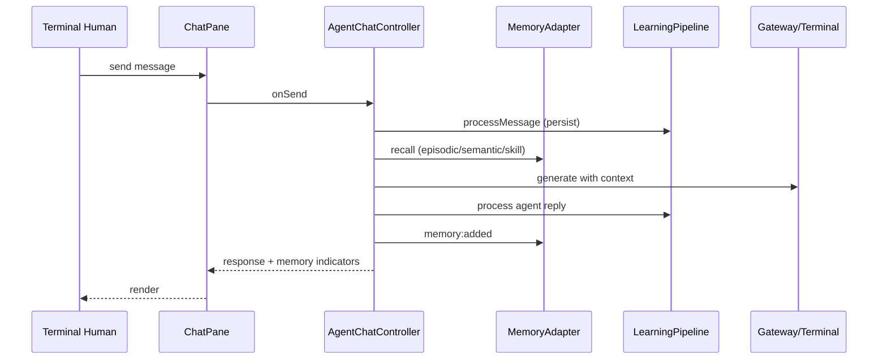
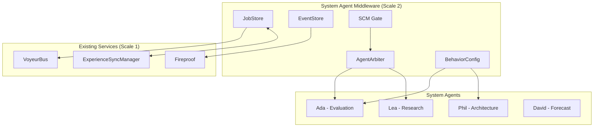

# Chrysalis Constituency Pattern Analysis (Rebuilt)

**Last Updated:** 2026-01-15
**Related Documents:**
- `CHRYSALIS_COMPREHENSIVE_PATTERN_ANALYSIS.md` — Full GoF pattern inventory
- `../Borrowed_Ideas/SYSTEM_AGENT_MIDDLEWARE_DESIGN.md` — System Agent Layer expansion

## Scope
Covers five constituencies and their interaction patterns in Chrysalis:
1) Terminal humans-in-the-loop (local terminals/UI)
2) System Agents (governance/orchestration services) **← See Middleware Design**
3) Internal Agents (platform-native agents)
4) External Agents (bridged/remote agents)
5) Other humans-in-the-loop (remote terminals/chats)

## Constituency Requirements & Patterns

### 1) Terminal Humans (local UI/terminal)
- Needs: chat, canvas manipulation, doc drop-to-learn, memory visibility, low-latency feedback.
- Mechanisms: ChrysalisWorkspace mediates dual chat panes + canvas; YJS optional sync; drag/drop documents to learning pipeline; memory indicators per message.
- Patterns: Mediator/Facade (workspace), Observer (YJS + chat events), Command (send/clear), Strategy (snap/grid), State (typing, agent states), Decorator-lite (memory badges), Template Method (message render).
- Evidence: [`src/components/ChrysalisWorkspace/ChrysalisWorkspace.tsx:264-1026`](src/components/ChrysalisWorkspace/ChrysalisWorkspace.tsx:264), [`src/components/ChrysalisWorkspace/ChatPane.tsx:364-560`](src/components/ChrysalisWorkspace/ChatPane.tsx:364), [`src/components/AgentCanvas/AgentCanvas.tsx:170-395`](src/components/AgentCanvas/AgentCanvas.tsx:170).

### 2) System Agents (active/adaptive governance)
- Needs: registry/bridge management, health/observability, resilience policies, capability routing **and adaptive learning** (system agents themselves evolve and retain memory/metrics to adjust governance).
- Mechanisms: AgentRegistry mediates bridge lifecycle + events; ObservabilityHub unifies logging/tracing/metrics/adaptation; CircuitBreaker for resilience; policies can learn from Voyeur/adaptation signals and memory stats to change routing/backoff.
- Patterns: Mediator (registry), Observer (event forwarding), Facade (observability), Circuit Breaker (resilience), Strategy (routing/backoff with adaptive tuning), Composite (health checks), Command (alerts), **Memento/Repository for governance state**, **Feedback Controller** via adaptation events.
- Evidence: [`src/agents/bridges/AgentRegistry.ts:53-388`](src/agents/bridges/AgentRegistry.ts:53), [`src/observability/ObservabilityHub.ts:155-495`](src/observability/ObservabilityHub.ts:155), [`src/utils/CircuitBreaker.ts:71-233`](src/utils/CircuitBreaker.ts:71).

### 3) Internal Agents (platform-native)
- Needs: chat + memory + learning loop; embeddings; skill learning; document ingestion; gateway/terminal LLM access.
- Mechanisms: AgentChatController ties AgentBinding to MemoryAdapter + LearningPipeline + GatewayLLMClient/Terminal; indicators for recalled/created memories; legend embedding loading; skill learning via action patterns.
- Patterns: Facade + Template Method (message flow), Strategy (LLM backend selection), Observer (learning events), Repository/Strategy (memory search tiers), Builder-like prompt construction.
- Evidence: [`src/agents/AgentChatController.ts:107-643`](src/agents/AgentChatController.ts:107), [`src/memory/AgentMemoryAdapter.ts:51-360`](memory_system/AgentMemoryAdapter.ts:51), [`src/learning/AgentLearningPipeline.ts:99-516`](src/learning/AgentLearningPipeline.ts:99).

### 4) External Agents (bridged)
- Needs: interop via bridges (Serena, DirectLLM, Eliza, etc.), capability discovery, connection lifecycle, resilience wrappers.
- Mechanisms: BaseBridge abstract with retry/timeout/tool registry/events; concrete bridges implement connect/send; Registry routes by capability/type; CircuitBreaker can wrap outbound calls; AgentCanvas can host external agents visually.
- Patterns: Template Method (bridge lifecycle), Strategy (per-bridge protocol), Observer (events), Command (tool calls), Mediator (registry), Adapter (bridge), Circuit Breaker (resilience), State (bridge status).
- Evidence: [`src/agents/bridges/BaseBridge.ts:39-392`](src/agents/bridges/BaseBridge.ts:39), [`src/agents/bridges/AgentRegistry.ts:53-388`](src/agents/bridges/AgentRegistry.ts:53).

### 5) Other Humans (remote terminals/chats)
- Needs: shared state, collaboration, memory consistency, event visibility.
- Mechanisms: YJS sync for chats; Voyeur/Observability events; experience sync (elsewhere in core); external doc drops mirrored via memory/learning events.
- Patterns: Observer (YJS/shared events), Mediator (workspace/session), Event Bus (Voyeur), Strategy (sync protocol selection in broader system), CRDT (YJS docs).
- Evidence: [`src/components/ChrysalisWorkspace/ChrysalisWorkspace.tsx:502-528`](src/components/ChrysalisWorkspace/ChrysalisWorkspace.tsx:502), [`src/observability/ObservabilityHub.ts:155-495`](src/observability/ObservabilityHub.ts:155).

## Interaction Maps (Mermaid)

### Constituency Interaction Overlay
```mermaid
flowchart LR
  TH[Terminal Humans] --> WS[Workspace Mediator]
  OA[Other Humans (remote)] -->|YJS/Voyeur| WS
  WS --> CP1[ChatPane L]
  WS --> CP2[ChatPane R]
  WS --> Canvas[AgentCanvas]
  CP1 --> ACtrl1[AgentChatController]
  CP2 --> ACtrl2[AgentChatController]
  ACtrl1 --> Mem[AgentMemoryAdapter]
  ACtrl2 --> Mem
  ACtrl1 --> Learn[AgentLearningPipeline]
  ACtrl2 --> Learn
  ACtrl1 --> LLM[Gateway/Terminal]
  ACtrl2 --> LLM
  Canvas --> Registry[AgentRegistry]
  Registry --> Bridges
  Bridges --> ExtAgents[External Agents]
  Registry --> SysAgents[System Agents/Policies]
  SysAgents --> Obs[ObservabilityHub]
  Obs --> Alerts
  Mem --> Obs
```

### Chat + Memory + Learning Loop


## Constituency-Specific Enablement & Differentiation
- Terminal Humans: Rich UI (chat/canvas), memory visibility, doc drop ingestion, optional YJS sync; low-latency feedback loops.
- System Agents: Governance knobs—registry, observability, circuit breakers, health checks, alerts; strategy points for routing and backoff.
- Internal Agents: Deep memory + learning integration, legend embeddings, skill learning, dual-pane conversation, shared adapter.
- External Agents: Onboarded via bridges + registry; resilient via retries/CB; capability-based lookup; can be placed on canvas and addressed in chat.
- Other Humans: Collaborate through YJS-synced chats/canvas states and observability events; consume/emit memory/learning updates indirectly.

## External Pattern Reinforcement (from MCP search)
- Industry guardrails emphasize circuit breakers and policy gates before execution to contain blast radius (cf. agentic AI architecture guides, API guardrail patterns).
- Provider-agnostic adapters + policy gates align with our Bridge + Registry + Observability stack; add SLO/tool ownership metadata and deprecation policy hooks at registry level.
- Guardian/oversight agents are recommended to auto-block out-of-policy actions (maps to adaptive governance System Agents + Observability/alerts + CB states).
- Human-in-the-loop checkpoints plus transparency/telemetry are standard; our Voyeur/metrics + memory indicators can be extended to show governance decisions.
- Adaptive feedback loops: anomalies should tune retry/backoff/routing thresholds (ObservabilityHub adaptation events feeding CircuitBreaker/Registry strategies).

## Gaps / Next Actions (expanded with guardrails)
- Add constituency-aware policy gates pre-execution (bridge/tool call) with allow/deny/budget/model-tier checks and audit trails; expose to ObservabilityHub with tags.
- Introduce guardian agents to review high-risk actions and auto-block out-of-policy behavior; surface decisions in chat/UI and Voyeur.
- Persist governance state snapshots (Memento/Repository) and couple with adaptation events to auto-tune CB thresholds, routing weights, and recall weighting.
- Attach SLO/owner metadata to bridges/tools; enforce deprecation and version policies at Registry.
- Extend CB/health signals into ChatPane headers for operator awareness; show recall rationale badges with policy outcomes when governance intervenes.
- Add hedging/fallback strategy hooks in Bridge/Controller for flaky providers; instrument with metrics for policy tuning.

## System Agent Middleware Expansion (New)

The System Agent constituency now has a comprehensive middleware design that implements a **fractal pattern repeat** at Scale 2 of Chrysalis's architecture. See `../Borrowed_Ideas/SYSTEM_AGENT_MIDDLEWARE_DESIGN.md` for the complete specification.

### New Patterns (from Borrowed_Ideas Integration)

| Pattern | Confidence | Purpose |
|---------|------------|---------|
| **Pattern 11: DURABLE WORKFLOW** | 92% | Jobs and Events as SSOT for workflow execution |
| **Pattern 12: SHARED CONVERSATION MIDDLEWARE** | 88% | Gate → Plan → Realize pipeline with multi-agent arbitration |
| **Pattern 13: AGENT BEHAVIOR CONFIG** | 90% | Declarative jobs, triggers, openers, idioms |

### Middleware Architecture



### Universal Pattern Application at Scale 2

| Pattern | Scale 1 Usage | Scale 2 (Middleware) Expansion |
|---------|---------------|--------------------------------|
| **Hash** | Agent fingerprinting | Job fingerprinting for provenance |
| **Signatures** | Experience auth | Job signature for audit trail |
| **Gossip** | Memory propagation | Job state propagation |
| **DAG** | Evolution tracking | Job execution history |
| **Convergence** | Skill aggregation | Multi-agent turn convergence |
| **Time** | Causal ordering | Job event ordering with vector clocks |
| **CRDT** | Memory merge | Turn state merge (who spoke last) |
| **Threshold** | Byzantine voting | Arbitration voting for agent selection |

## Anchors (key files)
- Workspace/chat/canvas: [`src/components/ChrysalisWorkspace/ChrysalisWorkspace.tsx:264-1026`](src/components/ChrysalisWorkspace/ChrysalisWorkspace.tsx:264), [`src/components/ChrysalisWorkspace/ChatPane.tsx:364-560`](src/components/ChrysalisWorkspace/ChatPane.tsx:364), [`src/components/AgentCanvas/AgentCanvas.tsx:170-395`](src/components/AgentCanvas/AgentCanvas.tsx:170)
- Memory + learning + controller: [`src/memory/AgentMemoryAdapter.ts:51-360`](memory_system/AgentMemoryAdapter.ts:51), [`src/agents/AgentChatController.ts:107-643`](src/agents/AgentChatController.ts:107), [`src/learning/AgentLearningPipeline.ts:99-516`](src/learning/AgentLearningPipeline.ts:99)
- Bridges/registry/system/observability: [`src/agents/bridges/BaseBridge.ts:39-392`](src/agents/bridges/BaseBridge.ts:39), [`src/agents/bridges/AgentRegistry.ts:53-388`](src/agents/bridges/AgentRegistry.ts:53), [`src/observability/ObservabilityHub.ts:155-495`](src/observability/ObservabilityHub.ts:155), [`src/utils/CircuitBreaker.ts:71-233`](src/utils/CircuitBreaker.ts:71)
- **System Agent Middleware (IMPLEMENTED)**: `../Borrowed_Ideas/SYSTEM_AGENT_MIDDLEWARE_DESIGN.md`
  - `src/agents/system/SharedConversationMiddleware.ts` ✅
  - `src/agents/system/AgentArbiter.ts` ✅
  - `src/agents/system/TriggerEvaluator.ts` ✅
  - `src/agents/system/OpenerSelector.ts` ✅
  - `src/agents/system/IdiomRegistry.ts` ✅
  - `src/agents/system/BehaviorLoader.ts` ✅
  - `src/agents/system/SCMRouting.ts` ✅
  - `src/agents/system/SystemAgentChatService.ts` ✅
  - `src/api/system-agents/controller.ts` ✅ (HTTP API)