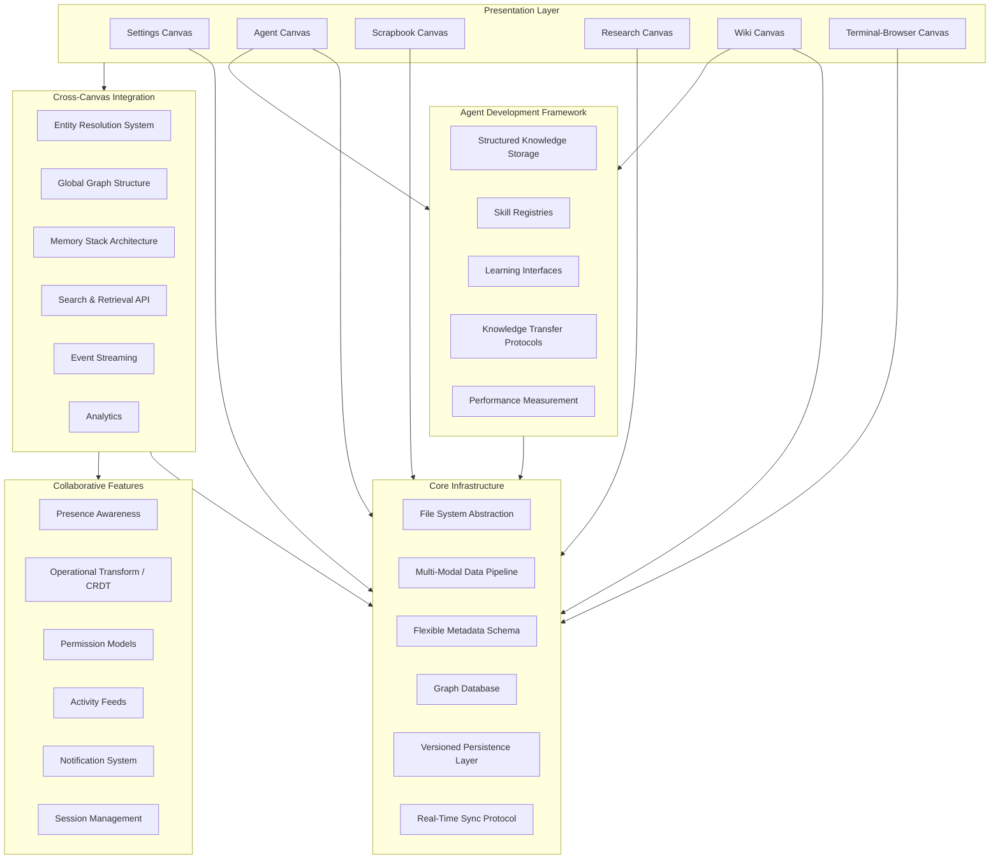

# Chrysalis Terminal: Multi-Canvas Workspace Implementation Roadmap

**Date:** 2026-01-18  
**Analysis Framework:** Complex Learning Agent Methodology  
**Scope:** Expanded requirements integrating user-specified detailed implementation tasks

---

## Executive Summary

This document synthesizes the original Canvas architectural analysis with newly provided comprehensive implementation requirements, creating a unified implementation roadmap for the Chrysalis Terminal multi-canvas collaborative workspace system.

**System Vision:** Human-agent collaborative knowledge work platform through specialized interaction modes, each with distinct architectural patterns while sharing common infrastructure for persistence, retrieval, and collaborative editing.

**Scope Expansion:** Original 6 canvas types + 4 cross-cutting infrastructure layers = 10 interconnected implementation tasks

---

## Architecture Synthesis

### Layered System Architecture



### Dependency Analysis

**Foundation Required by All:**
- Core Infrastructure (Task 2) → All canvases depend on this
- Collaborative Infrastructure (Task 9) → Multi-user scenarios across all canvases
- Cross-Canvas Integration (Task 8) → Unified knowledge graph

**Canvas-Specific Dependencies:**
- Settings Canvas (Task 1) → File System Abstraction, Configuration Versioning
- Scrapbook Canvas (Task 3) → Multi-Modal Pipeline, Graph Database, Annotations
- Research Canvas (Task 4) → All Scrapbook dependencies + Schema Enforcement
- Wiki Canvas (Task 5) → MediaWiki Backend, Agent API
- Terminal-Browser Canvas (Task 6) → Terminal Emulation, Browser Integration, Collaboration
- Agent Canvas (Task 7) → Wiki Canvas, Memory Stack, Skill Registries

**Agent Ecosystem Dependencies:**
- Agent Canvas (Task 7) → Agent Knowledge Framework (Task 10)
- Agent Knowledge Framework (Task 10) → Wiki Canvas, Cross-Canvas Integration

---

## Task Decomposition & Dependency Mapping

### Critical Path Identification

**Tier 0: Absolute Prerequisites**
1. **Task 2 (Part A): File System Abstraction** – Required by all persistence operations
2. **Task 2 (Part B): Multi-Modal Data Pipeline** – Required by Scrapbook, Research canvases

**Tier 1: Foundation Infrastructure**
3. **Task 2 (Part C): Flexible Metadata Schema** – Enables annotations across all canvases
4. **Task 2 (Part D): Graph Database** – Enables bidirectional linking
5. **Task 2 (Part E): Versioned Persistence Layer** – Conflict resolution foundation
6. **Task 9 (Parts A-C): Collaborative Core** – Presence, OT/CRDT, Permissions

**Tier 2: Settings & Basic Canvases**
7. **Task 1: Settings Canvas** – System configuration (can proceed once file system exists)
8. **Task 3: Scrapbook Canvas** – Exploratory gathering (needs multi-modal pipeline + graph)

**Tier 3: Structured Canvas & Wiki**
9. **Task 4: Research Canvas** – Structured gathering (builds on Scrapbook patterns)
10. **Task 5: Wiki Canvas** – Knowledge base (needs graph database + versioning)

**Tier 4: Collaborative Dev & Agents**
11. **Task 6: Terminal-Browser Canvas** – Collaborative dev workspace
12. **Task 2 (Part F): Real-Time Sync Protocol** – Required for Terminal-Browser collaboration
13. **Task 7: Agent Canvas** – Agent orchestration (depends on Wiki for knowledge base)

**Tier 5: Cross-System Integration**
14. **Task 8: Cross-Canvas Integration** – Entity resolution, global graph, memory stack
15. **Task 10: Agent Knowledge Framework** – Agent capability development
16. **Task 9 (Parts D-F):** Activity Feeds, Notifications, Session Management

---

## Detailed Implementation Task Breakdown

### Task 1: Settings Canvas Implementation

**Purpose:** System configuration management interface

**Components:**
```typescript
interface SettingsCanvas {
  configuration: {
    fileSystemPaths: PathConfiguration;
    toolConnectivity: ToolStatusMonitoring;
    terminalConfig: TerminalStateManagement;
    localSystemIntegration: SystemVerification;
    cloudResources: CloudConnectionOrchestration;
    llmEndpoints: LLMAuthenticationHandling;
  };
  
  features: {
    hierarchicalSchema: ConfigurationSchema;
    healthMonitoring: RealTimeConnectionHealth;
    versioning: ConfigurationVersioning;
    rollback: RollbackCapabilities;
  };
}
```

**Dependencies:**
- File System Abstraction (Task 2A)
- Versioned Persistence Layer (Task 2E) for configuration history
- BaseCanvas foundation (from original architectural analysis)

**Deliverables:**
1. Configuration schema definition (JSON Schema or TypeScript types)
2. Settings widget implementations (path selectors, connectivity status indicators, configuration editors)
3. Real-time health monitoring dashboard
4. Configuration versioning and rollback UI

---

### Task 2: Core Infrastructure Dependencies

**2A: Unified File System Abstraction**
```typescript
interface FileSystemAbstraction {
  local: LocalStorageProvider;
  cloud: CloudStorageProvider;
  
  operations: {
    read(path: string): Promise<FileContent>;
    write(path: string, content: FileContent): Promise<void>;
    list(path: string): Promise<DirectoryListing>;
    watch(path: string, callback: FileChangeCallback): Unsubscribe;
  };
  
  pathResolution: {
    resolve(userPath: string): AbsolutePath;
    normalize(path: string): NormalizedPath;
  };
}
```

**2B: Multi-Modal Data Ingestion Pipeline**
```typescript
interface DataIngestionPipeline {
  accept(artifact: unknown): Promise<IngestedArtifact>;
  detect(content: Buffer): ContentType;
  validate(artifact: IngestedArtifact): ValidationResult;
  transform(artifact: IngestedArtifact, target: ContentType): Promise<TransformedArtifact>;
}

type ContentType = 'text' | 'link' | 'file' | 'image' | 'video' | 'code' | 'document';
```

**2C: Flexible Metadata Schema**
```typescript
interface MetadataSchema {
  annotations: {
    attach(entityId: string, annotation: Annotation): Promise<void>;
    query(filter: AnnotationFilter): Promise<Annotation[]>;
  };
  
  associations: {
    link(from: EntityId, to: EntityId, type: AssociationType): Promise<void>;
    traverse(from: EntityId, relationship: TraversalSpec): Promise<Entity[]>;
  };
}
```

**2D: Graph Database Structure**
```typescript
interface GraphDatabase {
  nodes: {
    create(entity: Entity): Promise<NodeId>;
    update(id: NodeId, changes: Partial<Entity>): Promise<void>;
    delete(id: NodeId): Promise<void>;
    get(id: NodeId): Promise<Entity>;
  };
  
  edges: {
    createBidirectional(from: NodeId, to: NodeId, type: EdgeType): Promise<EdgeId>;
    query(spec: TraversalQuery): Promise<GraphPath[]>;
  };
}
```

**2E: Versioned Persistence Layer**
```typescript
interface VersionedPersistence {
  save(entityId: string, version: Version, data: Data): Promise<VersionId>;
  load(entityId: string, version?: VersionId): Promise<VersionedData>;
  history(entityId: string): Promise<Version[]>;
  conflictResolution: CRDTMergeStrategy | OTStrategy;
}
```

**2F: Real-Time Synchronization Protocol**
```typescript
interface RealtimeSyncProtocol {
  broadcast(change: ChangeEvent): void;
  subscribe(callback: ChangeHandler): Unsubscribe;
  presence: PresenceProtocol;
  conflictResolution: ConflictResolver;
}
```

---

### Task 3: Scrapbook Canvas - Exploratory Knowledge Gathering

**Pattern:** Domain understanding emerges through use

**Features:**
```typescript
interface ScrapbookCanvas {
  capture: {
    dragDrop: DragDropHandler;
    paste: PasteHandler;
    importFromUrl: UrlImportHandler;
  };
  
  linking: {
    createLink: (from: ArtifactId, to: ArtifactId) => Promise<LinkId>;
    dynamicLinks: DynamicLinkEngine; // No predefined schemas
  };
  
  arrangement: {
    spatial: SpatialLayoutEngine;
    grouping: EmergentGroupingEngine;
  };
  
  annotation: {
    attachNote: (artifactId: ArtifactId, note: Note) => Promise<void>;
    tagCluster: (artifactIds: ArtifactId[], tags: Tag[]) => Promise<void>;
  };
  
  discovery: {
    query: FlexibleQueryEngine;
    patternDetection: PatternDiscoveryEngine;
  };
  
  reorganization: {
    move: (artifactId: ArtifactId, newPosition: Position) => void;
    regroup: (artifactIds: ArtifactId[], group: Group) => Promise<void>;
  };
  
  temporalTracking: {
    timeline: (canvasId: string) => Promise<CanvasHistory>;
    replay: (timestamp: Date) => Promise<CanvasSnapshot>;
  };}
```

**Dependencies:**
- Multi-Modal Data Pipeline (Task 2B)
- Graph Database (Task 2D) for dynamic linking
- Flexible Metadata Schema (Task 2C) for annotations

---

### Task 4: Research Canvas - Structured Knowledge Acquisition

**Pattern:** Domain frameworks guide gathering

**Relationship to Scrapbook:** Shared infrastructure + schema enforcement

```typescript
interface ResearchCanvas extends ScrapbookCanvas {
  structure: {
    templates: DomainTemplateRegistry;
    schemas: DataCollectionSchema[];
    hierarchies: CategoryHierarchy;
  };
  
  collection: {
    structuredForms: FormEngine;
    requiredFields: ValidationRules;
  };
  
  organization: {
    hypothesisDriven: HypothesisTagging;
    frameworkAligned: FrameworkMapping;
  };
  
  provenance: {
    citations: CitationTracker;
    sources: ProvenanceChain;
  };
  
  validation: {
    domainRules: DomainValidator;
    completenessChecks: CompletenessValidator;
  };
  
  export: {
    toAnalysisTools: ExportPipeline;
    formats: ['csv', 'json', 'rdf', 'graphml'];
  };
}
```

**Dependencies:**
- All Scrapbook dependencies (inherits infrastructure)
- Schema enforcement engine
- Domain-specific template system

---

### Task 5: Wiki Canvas - Persistent Knowledge Base

**Backend:** MediaWiki architecture or equivalent

**Purpose:** Formalization layer for Research/Scrapbook insights + Agent knowledge base

```typescript
interface WikiCanvas {
  backend: {
    engine: MediaWikiEngine | EquivalentWikiEngine;
    storage: WikiPageStore;
    search: FullTextSearchEngine;
  };
  
  content: {
    markup: WikiMarkupParser;
    editor: WikiEditor;
    versioning: WikiVersionHistory;
  };
  
  linking: {
    bidirectional: BidirectionalLinkEngine;
    toArtifacts: ArtifactLinkResolver; // Links to Scrapbook/Research items
  };
  
  access: {
    private: PrivateKnowledgeBase;
    shared: TeamRepository;
    permissions: AccessControlList;
  };
  
  api: {
    agentRead: (query: SemanticQuery) => Promise<KnowledgeGraph>;
    agentWrite: (knowledge: StructuredKnowledge) => Promise<PageId>;
    agentNavigate: (start: PageId, traversal: TraversalSpec) => Promise<KnowledgePath>;
  };
}
```

**Dependencies:**
- Graph Database (Task 2D) for knowledge graph structure
- Versioned Persistence (Task 2E) for wiki page history
- File System Abstraction (Task 2A) for page storage
- Integration Layer (Task 8) for cross-canvas artifact links

---

### Task 6: Terminal-Browser Canvas - Collaborative Development Workspace

**Pattern:** Synchronous co-working

```typescript
interface TerminalBrowserCanvas {
  coding: {
    editors: CodeEditorWidget[];
    syntaxHighlighting: boolean;
    lsp: LanguageServerProtocol;
  };
  
  terminal: {
    emulation: TerminalEmulator; // xterm.js
    sessionPersistence: SessionStore;
    sharing: SessionSharingProtocol;
  };
  
  browser: {
    iframe: SandboxedBrowserWidget;
    externalResources: boolean;
  };
  
  collaboration: {
    cursors: CollaborativeCursors;
    screenSharing: ScreenShareProtocol;
    recording: SessionRecorder;
  };
  
  tools: {
    invoke: ExternalToolInvocation;
    databases: DatabaseConnections;
    apis: APIEndpoints;
  };
}
```

**Dependencies:**
- Real-Time Sync Protocol (Task 2F) for collaboration
- Collaborative Infrastructure (Task 9) for cursors, presence
- Terminal/Browser widget implementations (original architectural design)

---

### Task 7: Agent Canvas - AI Agent Orchestration

**Purpose:** Human-in-the-loop agent team management

```typescript
interface AgentCanvas {
  definition: {
    fromConfig: (config: AgentConfig) => Promise<AgentId>;
    fromCode: (code: AgentCode) => Promise<AgentId>;
  };
  
  lifecycle: {
    create: (definition: AgentDefinition) => Promise<AgentId>;
    revise: (agentId: AgentId, changes: AgentChanges) => Promise<VersionId>;
    archive: (agentId: AgentId) => Promise<void>;
    delete: (agentId: AgentId) => Promise<void>;
  };
  
  teams: {
    compose: (agentIds: AgentId[], teamConfig: TeamConfig) => Promise<TeamId>;
    assignToProject: (teamId: TeamId, projectId: ProjectId) => Promise<void>;
  };
  
  execution: {
    trigger: (agentId: AgentId, task: Task) => Promise<ExecutionId>;
    triggerTeam: (teamId: TeamId, workflow: Workflow) => Promise<ExecutionId>;
    monitor: (executionId: ExecutionId) => Promise<ExecutionStatus>;
  };
  
  inspection: {
    state: (agentId: AgentId) => Promise<AgentState>;
    decisions: (executionId: ExecutionId) => Promise<DecisionLog>;
    intermediateOutputs: (executionId: ExecutionId) => Promise<Output[]>;
  };
  
  integration: {
    wiki: WikiIntegration; // Read/write to wiki knowledge base
    memoryStack: MemoryStackIntegration; // Access shared memory
  };
}
```

**Dependencies:**
- Wiki Canvas (Task 5) for knowledge storage
- Agent Knowledge Framework (Task 10) for capability development
- Cross-Canvas Integration (Task 8) for memory stack access

---

### Task 8: Cross-Canvas Knowledge Integration Layer

**Purpose:** Unified knowledge graph across all canvases

```typescript
interface CrossCanvasIntegration {
  entityResolution: {
    recognize: (entity: Entity, context: CanvasContext) => Promise<ResolvedEntity>;
    merge: (entities: Entity[]) => Promise<CanonicalEntity>;
  };
  
  globalGraph: {
    nodes: Map<EntityId, Entity>;
    edges: Map<EdgeId, Edge>;
    canvasMetadata: Map<EntityId, CanvasOrigin>;
  };
  
  memoryStack: {
    store: (knowledge: Knowledge, source: CanvasId) => Promise<void>;
    query: (semanticQuery: Query) => Promise<Knowledge[]>;
    agentAccess: AgentMemoryAPI;
  };
  
  searchRetrieval: {
    semanticSearch: (query: string) => Promise<SearchResults>;
    crossCanvasFilter: (filter: CrossCanvasFilter) => Promise<Entity[]>;
  };
  
  eventStreaming: {
    publish: (event: CanvasEvent) => void;
    subscribe: (filter: EventFilter, handler: EventHandler) => Unsubscribe;
  };
  
  analytics: {
    knowledgeGrowth: () => Promise<GrowthMetrics>;
    connectionDensity: () => Promise<DensityMetrics>;
    usagePatterns: () => Promise<UsageInsights>;
  };
}
```

**Dependencies:**
- Graph Database (Task 2D) for global graph
- All canvases (provides integration layer on top)
- Event system from original architectural design

---

### Task 9: Collaborative Infrastructure

```typescript
interface CollaborativeInfrastructure {
  presence: {
    track: (userId: UserId, canvasId: CanvasId) => void;
    query: (canvasId: CanvasId) => Promise<ActiveUsers[]>;
  };
  
  editing: {
    strategy: OperationalTransform | CRDT;
    merge: ConflictResolution;
    guarantees: ['eventual_consistency', 'conflict_free'];
  };
  
  permissions: {
    canvasLevel: CanvasPermissions;
    entityLevel: EntityPermissions;
    capabilities: ['read', 'write', 'execute'];
  };
  
  activityFeeds: {
    log: (activity: Activity) => Promise<void>;
    query: (filter: ActivityFilter) => Promise<Activity[]>;
  };
  
  notifications: {
    subscribe: (userId: UserId, interests: Interest[]) => Unsubscribe;
    notify: (userId: UserId, notification: Notification) => void;
  };
  
  sessions: {
    synchronous: SyncSessionManager;
    asynchronous: AsyncHandoffManager;
  };
}
```

---

### Task 10: Agent Knowledge Accumulation Framework

**Purpose:** Agent learning and capability development

```typescript
interface AgentKnowledgeFramework {
  storage: {
    wiki: WikiKnowledgeStore; // Structured storage in wiki format
    format: 'mediawiki' | 'markdown' | 'structured_json';
  };
  
  skillRegistries: {
    register: (skill: Skill) => Promise<SkillId>;
    version: (skillId: SkillId) => Promise<SkillVersion>;
    dependencies: SkillDependencyGraph;
  };
  
  learning: {
    refine: (agentId: AgentId, feedback: Feedback) => Promise<void>;
    adapt: (agentId: AgentId, outcomes: Outcome[]) => Promise<Adaptation>;
  };
  
  knowledgeTransfer: {
    share: (from: AgentId, to: AgentId, knowledge: Knowledge) => Promise<void>;
    broadcast: (knowledge: Knowledge, team: TeamId) => Promise<void>;
  };
  
  performance: {
    measure: (agentId: AgentId, task: Task) => Promise<Metrics>;
    compare: (agentIds: AgentId[], task: Task) => Promise<Comparison>;
    optimize: (metrics: Metrics[]) => Promise<OptimizationPriorities>;
  };
}
```

**Dependencies:**
- Wiki Canvas (Task 5) for knowledge storage
- Agent Canvas (Task 7) for agent lifecycle
- Cross-Canvas Integration (Task 8) for knowledge sharing

---

## Updated Implementation Roadmap

### Phase 0: Architecture Resolution (2-3 days)

**Decisions Required:**
1. Graph database selection (Neo4j, DGraph, TigerGraph, or custom implementation)
2. CRDT vs. OT for collaborative editing
3. MediaWiki vs. alternative wiki engines
4. File system abstraction strategy (VFS library vs. custom)

**Deliverables:**
- Architecture Decision Records for each decision
- Technology selection rationale
- Proof-of-concept prototypes for critical paths

### Phase 1: Foundation Infrastructure (Week 1-2)

**Priority Order:**
1. File System Abstraction (Task 2A)
2. Multi-Modal Data Pipeline (Task 2B)
3. Flexible Metadata Schema (Task 2C)
4. Graph Database Integration (Task 2D)
5. Versioned Persistence Layer (Task 2E)
6. BaseCanvas, WidgetRegistry, types (from original analysis)

**Parallel Work Streams:**
- Stream A: Storage layer (2A, 2D, 2E)
- Stream B: Data pipeline (2B, 2C)
- Stream C: Canvas foundation (original architectural components)

### Phase 2: Essential Canvases (Week 3-4)

**Priority Order:**
1. Settings Canvas (Task 1) - Required for system configuration
2. Scrapbook Canvas (Task 3) - Foundation for knowledge work patterns
3. Collaborative Infrastructure Core (Task 9 Parts A-C) - Presence, CRDT/OT, Permissions

**Goal:** Functional system configuration + exploratory knowledge gathering + multi-user support

### Phase 3: Structured Knowledge & Agents (Week 5-7)

**Priority Order:**
1. Research Canvas (Task 4) - Structured gathering builds on Scrapbook
2. Wiki Canvas (Task 5) - Knowledge base foundation
3. Agent Canvas (Task 7) - Agent orchestration
4. Real-Time Sync Protocol (Task 2F) - Required for collaborative dev canvas
5. Terminal-Browser Canvas (Task 6) - Collaborative development

**Goal:** Complete canvas suite + agent orchestration capabilities

### Phase 4: Integration Layer (Week 8-9)

**Priority Order:**
1. Cross-Canvas Integration (Task 8) - Entity resolution, global graph, memory stack
2. Agent Knowledge Framework (Task 10) - Learning and capability development
3. Collaborative Infrastructure Complete (Task 9 Parts D-F) - Feeds, notifications, sessions

**Goal:** Unified knowledge graph + agent learning ecosystem

### Phase 5: Refinement & Documentation (Week 10)

**Deliverables:**
1. Comprehensive testing (unit, integration, E2E)
2. Performance optimization
3. User documentation
4. Developer extensibility guide
5. Deployment and operational documentation

---

## Risk Assessment & Mitigation

| Risk | Impact | Probability | Mitigation |
|------|--------|-------------|------------|
| Graph database performance at scale | High | Medium | Prototype early, benchmark queries, implement caching layer |
| CRDT complexity for rich content types | High | High | Start with simple text CRDTs, incrementally add rich types |
| MediaWiki integration coupling | Medium | Low | Define clean abstraction, make backend pluggable |
| Real-time sync protocol latency | High | Medium | Implement predictive conflict resolution, optimistic updates |
| Agent knowledge schema evolution | Medium | High | Version schemas, migrate incrementally, maintain backwards compatibility |
| Cross-canvas entity resolution accuracy | Medium | Medium | Implement confidence scoring, allow manual overrides |

---

## Success Criteria

**Technical:**
- [ ] All 6 canvas types functional with specified features
- [ ] Multi-user collaboration working with <500ms sync latency (p95)
- [ ] Graph database supporting >1M nodes with <100ms query time (p95)
- [ ] Agent knowledge accumulation demonstrable over 10+ sessions
- [ ] Cross-canvas entity resolution >90% accuracy
- [ ] WCAG 2.1 AA compliance across all canvases
- [ ] >85% test coverage

**Functional:**
- [ ] Users can capture artifacts in Scrapbook and discover patterns
- [ ] Researchers can use domain templates in Research canvas
- [ ] Teams can code collaboratively in Terminal-Browser canvas
- [ ] Agents can read/write wiki knowledge programmatically
- [ ] Knowledge flows seamlessly between canvases via global graph

**Extensibility:**
- [ ] 3rd-party canvas type can be developed without core modifications
- [ ] Custom agent skills can be registered and versioned
- [ ] Wiki templates can be customized per domain
- [ ] Extension developer documentation complete with examples

---

## Next Steps

1. **User Validation:** Review this integrated roadmap for alignment with vision
2. **Architecture Resolution:** Conduct decision sessions for open technology choices
3. **Resource Planning:** Determine team composition and workstream assignments
4. **Phase 0 Kickoff:** Begin architecture resolution and proof-of-concept development

---

*Roadmap created using Complex Learning Agent methodology integrating original architectural analysis ([`CANVAS_ARCHITECTURAL_REVIEW_2026-01-18.md`](CANVAS_ARCHITECTURAL_REVIEW_2026-01-18.md)) with user-provided comprehensive implementation specifications*
