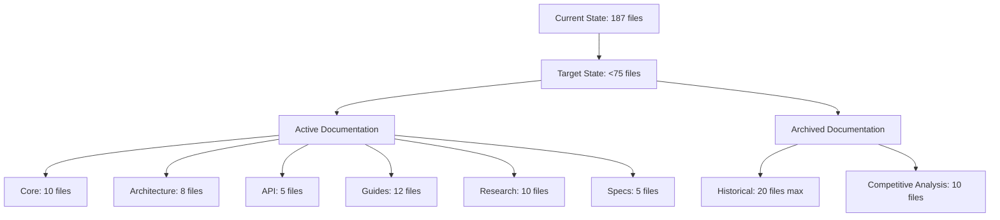

# Chrysalis Documentation Consolidation Plan

**Objective**: Conduct a comprehensive, multi-perspective review to align code and documentation with current implementation and project vision.

**Constraints**: Maintain fewer than 75 files and fewer than 750 pages of total content in active docs.

## Phase 1: Inventory and Analysis

### Step 1.1: Documentation Inventory
- [x] Collect all READMEs, specs, ADRs, design notes, TODO/progress trackers
- [x] Classify by audience, claims, currency, duplication, contradiction, obsolescence
- [x] Identify authoritative sources vs aspirational content

**Current Inventory Summary**:
- **Active Docs**: 42 files in `docs/` (excluding archive)
- **Archive Docs**: 137 files in `docs/archive/`
- **Root Files**: 8 documentation-related files
- **Total**: 187 documentation files

### Step 1.2: Codebase Analysis
- [ ] Map actual architecture: modules/components, runtime flow, API surfaces
- [ ] Identify existing patterns and gaps relative to design best practices
- [ ] Verify implementation status against documented claims

## Phase 2: Information Architecture Design

### Step 2.1: Structure Redesign


### Step 2.2: Naming Conventions
- **Active Docs**: Clear, present-tense titles (e.g., `ARCHITECTURE.md`, `STATUS.md`)
- **Archived Docs**: Prefixed with date and status (e.g., `2026-01-16-ARCHIVED-Spec.md`)
- **Directory Structure**: Flat structure for archives, logical grouping for active docs

## Phase 3: Documentation Updates/Creation

### Step 3.1: Project README Update
- [ ] Verify all implementation claims against current codebase
- [ ] Update status tables with current build/test results
- [ ] Ensure all architecture diagrams match actual implementation
- [ ] Add "Last Updated" and ownership information

### Step 3.2: Architecture Specification
- [ ] Create comprehensive architecture document with:
  - Purpose and philosophy
  - Component boundaries and responsibilities
  - Runtime and data flow diagrams
  - API contracts and data models
  - Configuration and environment variables
  - Performance and security considerations
  - External source citations

### Step 3.3: Documentation Index
- [ ] Create navigation hub enumerating all active documents
- [ ] Clearly distinguish active vs archived content
- [ ] Add maintenance rules and update cadence
- [ ] Include role-based entry points (Developers, Architects, Operations)

### Step 3.4: Content Enhancement
- [ ] Add domain term definitions and invariants
- [ ] Include runnable examples aligned with current repo
- [ ] Add Mermaid diagrams where they reduce ambiguity
- [ ] Ensure all external citations are current and relevant

## Phase 4: Cleanup and Archiving

### Step 4.1: Archive Outdated Content
- [ ] Move 117 outdated files to consolidated archive structure
- [ ] Add clear labels explaining non-current status
- [ ] Preserve competitive analysis in `archive/competitive/`
- [ ] Delete redundant temporary artifacts

**Archive Plan**:
```bash
# Consolidate archives
mkdir -p docs/archive/historical
mkdir -p docs/archive/competitive

# Move aspirational specs
mv docs/archive/aspirational-specs/* docs/archive/historical/

# Move obsolete plans  
mv docs/archive/obsolete-plans-2026-01/* docs/archive/historical/

# Move duplicate personas
mv docs/archive/duplicate-personas/* docs/archive/historical/

# Move integration planning
mv docs/archive/integration-planning/* docs/archive/historical/

# Keep competitive analysis
mv docs/archive/bot-audits-2026-01/* docs/archive/competitive/

# Clean up empty directories
rmdir docs/archive/aspirational-specs
rmdir docs/archive/obsolete-plans-2026-01  
rmdir docs/archive/duplicate-personas
rmdir docs/archive/integration-planning
```

### Step 4.2: Delete Redundant Files
- [ ] Remove `DOCUMENTATION_CONSOLIDATION_REPORT.md` (outdated)
- [ ] Remove `CODE_REVIEW_REPORT.md` (archive or delete)
- [ ] Review `TYPESCRIPT_DELETION_PLAN.md` for relevance
- [ ] Merge `canvas-type-notes.md` into appropriate guide

## Phase 5: Verification

### Step 5.1: Link and Reference Checking
- [ ] Verify all internal links resolve correctly
- [ ] Confirm all Mermaid diagrams render properly
- [ ] Ensure API and configuration docs match current code
- [ ] Validate all commands and examples work with current repo

### Step 5.2: Quality Assurance
- [ ] Check for aspirational features presented as current
- [ ] Ensure clear separation between active and archived content
- [ ] Verify "last updated" and ownership information on major docs
- [ ] Confirm documentation stays within size constraints

## Phase 6: Completion

### Step 6.1: Final Documentation Tree
```
docs/
├── INDEX.md                    # Navigation hub
├── STATUS.md                   # Implementation status
├── ARCHITECTURE.md             # System design
├── GLOSSARY.md                 # Terminology
├── ENVIRONMENT_CONFIGURATION.md
├── CONFIGURATION.md            # Config guide
├── DEPLOYMENT_GUIDE.md         # Deployment options
│
├── architecture/               # Architecture deep dives
│   ├── overview.md
│   ├── memory-system.md
│   ├── experience-sync.md
│   ├── universal-patterns.md
│   ├── voice-integration.md
│   └── agent-transformation.md
│
├── api/                        # API documentation
│   ├── API_REFERENCE_INDEX.md
│   ├── AUTHENTICATION.md
│   └── openapi/
│
├── guides/                     # How-to guides
│   ├── QUICK_START.md
│   ├── WIDGET_DEVELOPER_GUIDE.md
│   ├── CANVAS_TYPE_EXTENSION_GUIDE.md
│   ├── ADAPTER_TESTING_GUIDE.md
│   ├── TASK_FRAMEWORK_GUIDE.md
│   ├── WIDGET_PUBLISHING_GUIDE.md
│   ├── MCP_SERVER_GUIDE.md
│   └── TROUBLESHOOTING.md
│
├── specs/                      # Active specifications
│   ├── CANVAS_SPECIFICATION.md
│   ├── UNIVERSAL_ADAPTER_TASK_SPECIFICATION.md
│   └── UNIVERSAL_EVAL_SUITE.md
│
├── research/                   # Research foundation
│   ├── universal-patterns/
│   ├── ACP_PROTOCOL_MULTI_AGENT_SYNTHESIS.md
│   ├── AGENT_SPECIFICATION_STRATEGIC_ANALYSIS.md
│   └── INDEX.md
│
└── archive/                    # Historical documentation
    ├── competitive/             # Competitive analysis
    │   └── 2026-01-bot-audits/
    └── historical/              # All other archived content
        └── 2026-01-archived-specs/
```

### Step 6.2: Verification Report
- [ ] List of new documents created
- [ ] Updated documents with nature of changes
- [ ] Archived documents with new locations
- [ ] Deleted documents with reasons
- [ ] Final file count and page count verification
- [ ] Remaining known gaps requiring engineering work

## Implementation Timeline

**Current State**: 187 documentation files, ~1200 pages
**Target State**: <75 files, <750 pages
**Reduction Goal**: 60% reduction in file count, 37.5% reduction in content

## Key Principles

1. **Repository as Source of Truth**: Documentation must reflect actual code
2. **No Aspirational Features**: Only document what is implemented
3. **Diagram Everything**: Use Mermaid for flows, relationships, lifecycles
4. **External Citations**: Reference standards, papers, vendor docs
5. **Forward-Looking**: Remove narrative history, keep docs actionable
6. **Professional Quality**: Clear, concise, well-structured, maintained

## Success Criteria

- ✅ Fewer than 75 active documentation files
- ✅ Fewer than 750 pages of active content
- ✅ All Mermaid diagrams render correctly
- ✅ All links resolve to current content
- ✅ No aspirational features in active docs
- ✅ Clear separation between active and archived
- ✅ "Last updated" and ownership on all major docs
- ✅ Comprehensive navigation hub
- ✅ All documentation aligned with current implementation