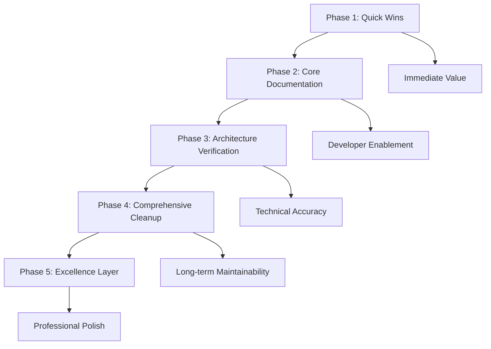
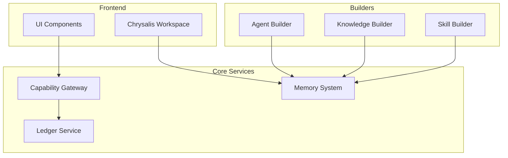
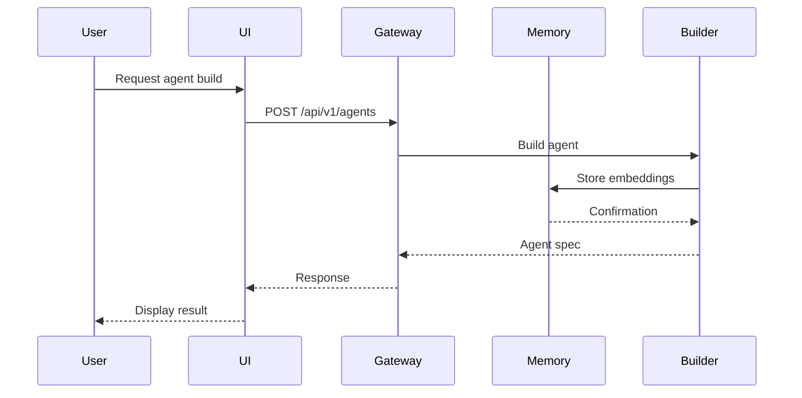
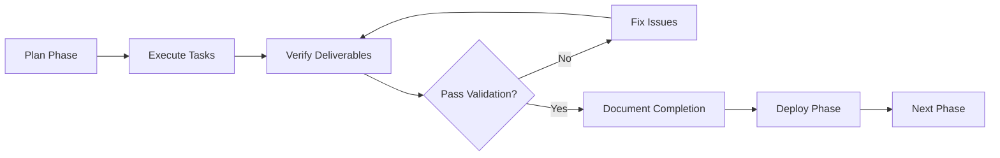

# Chrysalis Documentation Refresh: Phased Execution Plan

**Created**: 2026-01-11  
**Status**: Planning  
**Scope**: Comprehensive documentation synchronization and restructuring

## Executive Summary

This plan addresses the comprehensive documentation refresh initiative for the Chrysalis repository. Based on the completed inventory ([`docs/DOCUMENTATION_INVENTORY.md`](../docs/DOCUMENTATION_INVENTORY.md)), we identified 150+ documentation files with significant duplication, mixed currency (historical vs. current), and organizational inconsistency.

### Key Findings from Inventory
- **150+ markdown files** across 6+ top-level directories
- **Extensive duplication**: Multiple quick starts, status docs, code reviews
- **Archive structure exists** but lacks clear non-current labeling
- **Mixed organization**: Current and historical docs intermingled
- **Verification needed**: Technical claims must be validated against codebase

### Strategic Approach

Rather than attempting all work simultaneously, this plan breaks the initiative into **5 focused phases**, each delivering concrete value while building toward the complete vision. Each phase is independently valuable and can be executed, validated, and deployed before proceeding to the next.

## Phase Structure Overview



### Phase Priorities

| Phase | Focus | Primary Benefit | Dependency |
|-------|-------|-----------------|------------|
| 1 | Quick Wins | Immediate clarity, remove confusion | None |
| 2 | Core Documentation | Developer onboarding, system understanding | Phase 1 |
| 3 | Architecture Verification | Technical accuracy, trust | Phase 2 |
| 4 | Comprehensive Cleanup | Maintainability, scalability | Phase 3 |
| 5 | Excellence Layer | Professional polish, external readiness | Phase 4 |

---

## Phase 1: Quick Wins and Archive Organization

**Objective**: Deliver immediate value by eliminating obvious duplication, organizing archives, and fixing the most visible documentation issues.

### Success Criteria
- ✅ No duplicate quick start guides in active documentation
- ✅ All historical phase reports moved to archive with clear labeling
- ✅ Archive has comprehensive README explaining organization
- ✅ Root README provides accurate, verified quick start
- ✅ Single source of truth for implementation status

### Tasks

#### 1.1: Archive Historical Documents
**Action**: Move obviously historical documents to archive with clear labeling

**Documents to Archive**:
- `QUICK_WINS_IMPLEMENTATION_SUMMARY.md` → `docs/archive/2026-01-quick-wins/`
- `REVIEW_COMPLETE_SUMMARY.md` → `docs/archive/2026-01-code-reviews/`
- `builder_pipeline_report.md` → `docs/archive/2026-01-builder-reports/`
- `docs/PHASE_3_4_*.md` (4 files) → `docs/archive/2026-01-phase-reports/`
- `docs/IMMEDIATE_STEPS_COMPLETE.md` → `docs/archive/2026-01-phase-reports/`
- `docs/CODE_REVIEW_CHRYSALIS_2026-01-09.md` → `docs/archive/2026-01-code-reviews/`
- `docs/BEYOND_CODE_REVIEW_SUMMARY.md` → `docs/archive/2026-01-code-reviews/`
- `docs/CODE_VERIFICATION_ANALYSIS.md` → `docs/archive/2026-01-code-reviews/`
- `docs/DOCUMENTATION_CLEANUP_*.md` (2 files) → `docs/archive/2026-01-cleanup-history/`
- `docs/reports/PHASE11_*.md` → `docs/archive/2026-01-phase-reports/`
- `plans/PHASE_1_2_COMPLETION_REPORT.md` → `docs/archive/2026-01-phase-reports/`
- `plans/SENIOR_PM_ONBOARDING_ASSESSMENT.md` → `docs/archive/2026-01-assessments/`

**Labeling Strategy**: Add header to each archived document:
```markdown
> **⚠️ ARCHIVED DOCUMENT**  
> This document represents historical work completed on [DATE].  
> For current information, see [LINK TO CURRENT DOC].  
> Archived: 2026-01-11
```

#### 1.2: Create Archive README
**Action**: Create `docs/archive/README.md` explaining archive organization

**Content Structure**:
- Purpose of archive (historical reference, not current guidance)
- Organization by date and category
- Index of archived content with brief descriptions
- Clear statement: "Do not use archived documents for current development"
- Links to current equivalents where applicable

#### 1.3: Consolidate Quick Start Guides
**Action**: Merge three quick start guides into single authoritative version

**Current Duplicates**:
- Root `README.md` (Quick Start section)
- `docs/guides/QUICK_START.md`
- `docs/getting-started/quickstart.md`

**Strategy**:
1. Analyze all three for unique content
2. Create single comprehensive quick start in root `README.md`
3. Replace `docs/guides/QUICK_START.md` with redirect: "See [Quick Start](../../README.md#quick-start)"
4. Replace `docs/getting-started/quickstart.md` with redirect
5. Verify all commands execute successfully

#### 1.4: Consolidate Status Documents
**Action**: Merge status documents into single source of truth

**Current Duplicates**:
- `IMPLEMENTATION_STATUS.md` (root)
- `docs/current/STATUS.md`

**Strategy**:
1. Compare both documents for unique information
2. Determine canonical location (recommend `docs/current/STATUS.md`)
3. Merge content with clear sections
4. Replace root file with redirect or remove if redundant
5. Update all references

#### 1.5: Consolidate Documentation Indexes
**Action**: Merge duplicate indexes

**Current Duplicates**:
- `docs/README.md`
- `docs/index.md`

**Strategy**:
1. Keep `docs/README.md` as primary index
2. Archive or remove `docs/index.md`
3. Ensure comprehensive coverage of all active docs
4. Add clear navigation structure

#### 1.6: Update Root README
**Action**: Verify and update root README with accurate information

**Verification Checklist**:
- [ ] Installation commands execute successfully
- [ ] Prerequisites are accurate and complete
- [ ] Quick start example works
- [ ] Links to documentation are valid
- [ ] Project structure reflects reality
- [ ] Status summary is current

### Phase 1 Deliverables
1. Clean archive structure with README
2. 15+ historical documents properly archived and labeled
3. Single quick start guide (verified working)
4. Single status document
5. Single documentation index
6. Updated root README

### Phase 1 Validation
- All archived documents have non-current labels
- Archive README explains organization
- No duplicate quick starts in active docs
- Root README commands execute successfully
- All internal links resolve correctly

---

## Phase 2: Core Documentation Consolidation

**Objective**: Create authoritative, verified core documentation that enables developers to understand and work with the system.

### Success Criteria
- ✅ Single authoritative architecture document with diagrams
- ✅ Comprehensive API documentation verified against codebase
- ✅ Clear developer onboarding path
- ✅ Configuration documentation matches actual implementation
- ✅ Data models documented with verification

### Tasks

#### 2.1: Consolidate Architecture Documentation
**Action**: Merge architecture documents into single authoritative spec

**Current State**:
- `ARCHITECTURE.md` (root) - comprehensive
- `docs/architecture/overview.md` - alternative view
- Multiple architecture subdocs in `docs/architecture/`

**Strategy**:
1. Designate `ARCHITECTURE.md` as single source of truth
2. Extract unique content from `docs/architecture/overview.md`
3. Merge into `ARCHITECTURE.md` with clear sections
4. Keep specialized docs (`memory-system.md`, `experience-sync.md`) as supplements
5. Add cross-references between documents

#### 2.2: Consolidate Code Review Documents
**Action**: Create single code quality summary from multiple reviews

**Current State**:
- `docs/architecture/CODE_QUALITY_REVIEW_2026.md`
- `docs/architecture/CODE_REVIEW_SUMMARY.md`
- `docs/architecture/FINAL_CODE_REVIEW_SUMMARY.md`
- `docs/architecture/RATE_LIMITING_CODE_REVIEW.md`
- `docs/architecture/BACKEND_INTERFACE_REVIEW.md`
- `docs/architecture/CODE_IMPROVEMENTS_AND_REFACTORING.md`

**Strategy**:
1. Extract actionable items from all reviews
2. Create `docs/current/CODE_QUALITY_STATUS.md` with:
   - Current quality metrics
   - Outstanding issues (P0, P1, P2)
   - Completed improvements
   - Ongoing work
3. Archive individual review documents
4. Link to archived reviews for historical context

#### 2.3: Create Developer Onboarding Guide
**Action**: Create comprehensive onboarding document

**Location**: `docs/guides/DEVELOPER_ONBOARDING.md`

**Content Structure**:
1. **Prerequisites**: Tools, accounts, knowledge
2. **Setup**: Step-by-step environment setup
3. **Architecture Overview**: High-level system understanding
4. **Key Concepts**: Core abstractions and patterns
5. **Development Workflow**: How to make changes
6. **Testing**: How to run and write tests
7. **Common Tasks**: Frequent development scenarios
8. **Troubleshooting**: Common issues and solutions
9. **Resources**: Links to deeper documentation

#### 2.4: Verify Configuration Documentation
**Action**: Ensure configuration docs match implementation

**Documents to Verify**:
- `docs/CONFIGURATION.md`
- `docs/current/MCP_SETUP.md`
- `docs/current/VECTOR_INDEX_SETUP.md`

**Verification Process**:
1. Read configuration documentation
2. Examine actual config files (`.env.example`, config files)
3. Check code for environment variable usage
4. Document discrepancies
5. Update documentation to match reality
6. Add examples for all configuration options

#### 2.5: Verify Data Models Documentation
**Action**: Ensure data model docs match implementation

**Document to Verify**: `docs/DATA_MODELS.md`

**Verification Process**:
1. Read data model documentation
2. Examine TypeScript interfaces and types
3. Examine Python data classes and schemas
4. Check database schemas if applicable
5. Document discrepancies
6. Update documentation with actual models
7. Add Mermaid ER diagrams for complex relationships

#### 2.6: Create API Documentation
**Action**: Comprehensive API documentation from actual endpoints

**Strategy**:
1. Analyze all server files:
   - `projects/AgentBuilder/server.py`
   - `projects/KnowledgeBuilder/server.py`
   - `projects/SkillBuilder/server.py`
   - TypeScript services in `src/services/`
2. Document each endpoint:
   - HTTP method and path
   - Request schema
   - Response schema
   - Authentication requirements
   - Error responses
   - Example requests/responses
3. Consolidate into `docs/API_REFERENCE.md`
4. Add OpenAPI/Swagger spec if not present
5. Link from main documentation index

### Phase 2 Deliverables
1. Single authoritative `ARCHITECTURE.md`
2. Consolidated code quality status document
3. Comprehensive developer onboarding guide
4. Verified configuration documentation
5. Verified data models documentation
6. Complete API reference documentation

### Phase 2 Validation
- Architecture document has Mermaid diagrams
- All configuration options documented and verified
- All API endpoints documented with examples
- Developer onboarding guide tested with new developer
- Data models match implementation
- No contradictions between documents

---

## Phase 3: Architecture Verification and Diagram Enhancement

**Objective**: Verify all architectural claims against codebase and add comprehensive Mermaid diagrams for visual clarity.

### Success Criteria
- ✅ All architectural claims verified against code
- ✅ Component diagrams show actual module structure
- ✅ Sequence diagrams for critical flows
- ✅ State machine diagrams where applicable
- ✅ Data flow diagrams for pipelines
- ✅ External references for design decisions

### Tasks

#### 3.1: Verify Component Architecture
**Action**: Validate component boundaries and responsibilities

**Process**:
1. Read `ARCHITECTURE.md` component descriptions
2. Map to actual code structure:
   - TypeScript: `src/` directory structure
   - Python: `projects/`, `shared/` structure
3. Verify component responsibilities match implementation
4. Document actual dependencies between components
5. Update architecture doc with corrections
6. Add component diagram in Mermaid

**Component Diagram Template**:


#### 3.2: Create Sequence Diagrams for Critical Flows
**Action**: Document key execution paths with sequence diagrams

**Critical Flows to Diagram**:
1. Agent morphing flow
2. Memory storage and retrieval
3. Experience sync flow
4. Builder pipeline execution
5. API request lifecycle

**Example Sequence Diagram**:


#### 3.3: Create State Machine Diagrams
**Action**: Document lifecycle and state transitions

**State Machines to Document**:
1. Agent lifecycle states
2. Memory merge states
3. Builder pipeline states
4. Connection states (for sync)

#### 3.4: Create Data Flow Diagrams
**Action**: Document data transformation pipelines

**Pipelines to Diagram**:
1. Legend processing pipeline
2. Embedding generation pipeline
3. Skill extraction pipeline
4. Knowledge graph construction

#### 3.5: Add External References
**Action**: Add provenance for design decisions

**Process**:
1. Identify key architectural patterns
2. Research standard references:
   - Academic papers
   - Industry standards
   - Vendor documentation
   - Engineering blogs
3. Add footnote-style references
4. Create `docs/REFERENCES.md` with full citations

**Example Reference Format**:
```markdown
## Memory Architecture

The four-tier memory architecture follows the cognitive science model
of human memory systems[^1], adapted for agent applications.

[^1]: Atkinson, R. C., & Shiffrin, R. M. (1968). "Human memory: A proposed
system and its control processes." Psychology of Learning and Motivation, 2, 89-195.
https://doi.org/10.1016/S0079-7421(08)60422-3
```

#### 3.6: Verify Runtime Flows
**Action**: Trace actual execution paths in code

**Process**:
1. Read sequence diagrams in `ARCHITECTURE.md`
2. Trace execution in codebase
3. Verify call chains match documentation
4. Document discrepancies
5. Update diagrams to match reality
6. Add code references to diagrams

### Phase 3 Deliverables
1. Verified component architecture with diagram
2. 5+ sequence diagrams for critical flows
3. State machine diagrams for key lifecycles
4. Data flow diagrams for pipelines
5. External references document
6. Updated `ARCHITECTURE.md` with all diagrams

### Phase 3 Validation
- All diagrams render correctly in Mermaid
- Component boundaries match code structure
- Sequence diagrams trace actual execution
- State machines reflect implemented behavior
- External references are credible and relevant
- No contradictions between diagrams and code

---

## Phase 4: Comprehensive Cleanup and Restructuring

**Objective**: Complete the information architecture restructuring, eliminate all remaining duplication, and establish clear maintenance patterns.

### Success Criteria
- ✅ Single source of truth for every topic
- ✅ Clear separation between current and archived
- ✅ Consistent document organization
- ✅ All links verified and working
- ✅ Maintenance guidelines established

### Tasks

#### 4.1: Complete Archive Migration
**Action**: Move all remaining historical documents to archive

**Documents to Review and Archive**:
- All dated documents in `docs/architecture/`
- Implementation progress reports
- Phase-specific planning documents
- Completed migration plans

**Process**:
1. Review each document for currency
2. Determine if historical or current
3. Move historical docs to appropriate archive subdirectory
4. Add archived labels
5. Update archive README index

#### 4.2: Restructure docs/ Directory
**Action**: Implement consistent organization

**Proposed Structure**:
```
docs/
├── README.md                    # Main documentation index
├── API_REFERENCE.md             # Complete API documentation
├── ARCHITECTURE.md              # System architecture (link to root)
├── CONFIGURATION.md             # Configuration guide
├── DATA_MODELS.md               # Data model specifications
├── REFERENCES.md                # External citations
├── STANDARDS.md                 # Coding standards
├── guides/
│   ├── DEVELOPER_ONBOARDING.md
│   ├── TROUBLESHOOTING.md
│   └── DEPLOYMENT.md
├── architecture/
│   ├── memory-system.md
│   ├── experience-sync.md
│   ├── universal-patterns.md
│   └── voice-integration.md
├── features/
│   └── SEMANTIC_MERGE.md
├── adr/
│   ├── README.md
│   └── ADR-NNN-*.md
├── research/
│   └── [research docs]
└── archive/
    ├── README.md
    └── [archived content by date]
```

#### 4.3: Eliminate Remaining Duplication
**Action**: Find and consolidate all duplicate content

**Process**:
1. Search for similar document titles
2. Compare content for duplication
3. Merge into single authoritative version
4. Remove or redirect duplicates
5. Update all cross-references

#### 4.4: Verify All Links
**Action**: Comprehensive link validation

**Process**:
1. Extract all markdown links from active docs
2. Verify internal links resolve
3. Verify external links are accessible
4. Fix broken links
5. Update moved document references
6. Document any intentionally broken links

**Tool**: Create or use link checker script

#### 4.5: Standardize Document Structure
**Action**: Apply consistent formatting and structure

**Standards to Apply**:
- Consistent header hierarchy
- Standard front matter (title, date, status)
- Consistent code block formatting
- Consistent diagram placement
- Standard section ordering
- Consistent terminology

#### 4.6: Create Maintenance Guidelines
**Action**: Document how to keep documentation current

**Location**: `docs/MAINTENANCE.md`

**Content**:
1. **Update Triggers**: When to update docs
2. **Review Cadence**: Regular review schedule
3. **Ownership**: Who maintains what
4. **Standards**: Formatting and style rules
5. **Verification**: How to verify accuracy
6. **Archive Process**: When and how to archive
7. **Link Checking**: How to validate links

### Phase 4 Deliverables
1. Complete archive migration
2. Restructured docs/ directory
3. Zero duplicate documents in active docs
4. All links verified and working
5. Consistent document formatting
6. Maintenance guidelines document

### Phase 4 Validation
- No duplicate content in active documentation
- All internal links resolve correctly
- All external links are accessible
- Archive is complete and well-organized
- Document structure is consistent
- Maintenance guidelines are clear and actionable

---

## Phase 5: Excellence Layer and Professional Polish

**Objective**: Add professional polish, comprehensive examples, and external-facing documentation quality.

### Success Criteria
- ✅ All examples execute successfully
- ✅ Comprehensive ADR coverage
- ✅ Professional README suitable for external audiences
- ✅ Complete troubleshooting guide
- ✅ Deployment documentation
- ✅ Contributing guidelines

### Tasks

#### 5.1: Verify and Enhance Examples
**Action**: Ensure all code examples work

**Process**:
1. Inventory all code examples in documentation
2. Extract to executable files
3. Test each example
4. Fix broken examples
5. Add missing examples for common use cases
6. Document example prerequisites
7. Add example output/screenshots

#### 5.2: Expand ADR Coverage
**Action**: Document key architectural decisions

**Current State**: Only 1 ADR exists

**Target ADRs** (minimum):
1. ADR-001: Service layer independence (exists)
2. ADR-002: Memory architecture four-tier design
3. ADR-003: Embedding provider abstraction
4. ADR-004: YJS for collaborative editing
5. ADR-005: TypeScript + Python hybrid architecture
6. ADR-006: LanceDB for vector storage
7. ADR-007: Semantic merge strategy
8. ADR-008: Agent morphing approach

**ADR Template**:
```markdown
# ADR-NNN: Title

## Status
Accepted | Proposed | Deprecated | Superseded

## Context
What is the issue we're addressing?

## Decision
What decision did we make?

## Consequences
### Positive
- Benefit 1
- Benefit 2

### Negative
- Trade-off 1
- Trade-off 2

## Alternatives Considered
### Alternative 1
Why we didn't choose this

### Alternative 2
Why we didn't choose this

## References
- [External reference 1]
- [External reference 2]
```

#### 5.3: Create Comprehensive Troubleshooting Guide
**Action**: Consolidate and expand troubleshooting

**Current**: `docs/guides/TROUBLESHOOTING.md` exists

**Enhancement**:
1. Add common error messages with solutions
2. Add debugging techniques
3. Add performance troubleshooting
4. Add environment-specific issues
5. Add FAQ section
6. Add "How to get help" section

#### 5.4: Create Deployment Documentation
**Action**: Document deployment procedures

**Location**: `docs/guides/DEPLOYMENT.md`

**Content**:
1. **Prerequisites**: Infrastructure requirements
2. **Environment Setup**: Configuration for production
3. **Deployment Steps**: Step-by-step procedures
4. **Verification**: How to verify successful deployment
5. **Rollback**: How to rollback if needed
6. **Monitoring**: What to monitor post-deployment
7. **Scaling**: How to scale the system

#### 5.5: Create Contributing Guidelines
**Action**: Document contribution process

**Location**: `CONTRIBUTING.md` (root)

**Content**:
1. **Code of Conduct**: Community standards
2. **How to Contribute**: Process overview
3. **Development Setup**: Getting started
4. **Coding Standards**: Style and patterns
5. **Testing Requirements**: Test expectations
6. **Documentation Requirements**: Doc expectations
7. **Pull Request Process**: PR workflow
8. **Review Process**: How reviews work

#### 5.6: Polish Root README for External Audiences
**Action**: Make README professional and welcoming

**Enhancements**:
1. Add badges (build status, coverage, license)
2. Add compelling project description
3. Add visual examples/screenshots
4. Add clear value proposition
5. Add community links
6. Add acknowledgments/credits
7. Ensure professional tone throughout

### Phase 5 Deliverables
1. All examples verified and working
2. 8+ comprehensive ADRs
3. Enhanced troubleshooting guide
4. Complete deployment documentation
5. Contributing guidelines
6. Polished external-facing README

### Phase 5 Validation
- All code examples execute successfully
- ADRs cover major architectural decisions
- Troubleshooting guide addresses common issues
- Deployment docs enable successful deployment
- Contributing guidelines are clear and welcoming
- README is professional and compelling

---

## Cross-Phase Concerns

### Documentation Standards (All Phases)

#### Mermaid Diagram Standards
- Avoid double quotes ("") inside square brackets []
- Avoid parentheses () inside square brackets []
- Use single quotes or no quotes for labels
- Test all diagrams render correctly

#### Markdown Standards
- Use ATX-style headers (# ## ###)
- Use fenced code blocks with language identifiers
- Use reference-style links for repeated URLs
- Use tables for structured data
- Use task lists for checklists

#### Content Standards
- Write in present tense for current state
- Use active voice
- Be concise and specific
- Include examples for complex concepts
- Link to related documentation
- Add "Last Updated" dates where appropriate

### Verification Standards (All Phases)

#### Code Verification
- All code examples must execute
- All API endpoints must exist
- All configuration options must be implemented
- All data models must match code

#### Link Verification
- All internal links must resolve
- All external links must be accessible
- All code references must be accurate
- All file paths must be correct

#### Diagram Verification
- All Mermaid diagrams must render
- All diagrams must match implementation
- All diagrams must be readable
- All diagrams must add value

---

## Implementation Workflow

### Phase Execution Pattern

Each phase follows this pattern:



### Task Execution Pattern

Each task follows this pattern:

1. **Read**: Understand current state
2. **Analyze**: Identify issues and gaps
3. **Plan**: Determine specific actions
4. **Execute**: Make changes
5. **Verify**: Confirm correctness
6. **Document**: Record what was done

### Validation Checklist Template

For each phase:

```markdown
## Phase N Validation Checklist

### Deliverables
- [ ] Deliverable 1 complete
- [ ] Deliverable 2 complete
- [ ] Deliverable N complete

### Quality Checks
- [ ] All links resolve
- [ ] All diagrams render
- [ ] All examples work
- [ ] No contradictions
- [ ] Consistent formatting

### Verification
- [ ] Peer review complete
- [ ] User testing complete (if applicable)
- [ ] Documentation updated
- [ ] Changes committed
```

---

## Risk Assessment and Mitigation

### Risk Matrix

| Risk | Probability | Impact | Mitigation |
|------|-------------|--------|------------|
| Documentation-code drift during work | High | Medium | Frequent verification passes |
| Breaking existing links | Medium | Medium | Comprehensive link checking |
| Losing valuable historical context | Low | High | Careful archive process with labels |
| Inconsistent terminology | Medium | Low | Terminology glossary and review |
| Incomplete verification | Medium | High | Systematic verification checklist |
| Scope creep | High | Medium | Strict phase boundaries |

### Mitigation Strategies

#### Documentation-Code Drift
- Verify against code frequently
- Use automated tools where possible
- Mark unverified claims clearly
- Schedule regular re-verification

#### Breaking Links
- Use link checker before and after changes
- Test all internal links
- Document intentional external link removals
- Maintain redirect map

#### Losing Historical Context
- Never delete without archiving
- Add clear archive labels
- Maintain archive index
- Link to archived versions

#### Scope Creep
- Strict phase boundaries
- Defer non-critical work to later phases
- Document deferred work
- Regular scope reviews

---

## Success Metrics

### Phase 1 Metrics
- Historical documents archived: 15+
- Duplicate guides eliminated: 3
- Archive README created: 1
- Root README verified: 100%

### Phase 2 Metrics
- Core documents consolidated: 5+
- API endpoints documented: 100%
- Configuration options verified: 100%
- Developer onboarding guide created: 1

### Phase 3 Metrics
- Mermaid diagrams added: 10+
- Component boundaries verified: 100%
- Critical flows documented: 5+
- External references added: 20+

### Phase 4 Metrics
- Remaining duplicates eliminated: 100%
- Links verified: 100%
- Archive migration complete: 100%
- Maintenance guidelines created: 1

### Phase 5 Metrics
- Examples verified: 100%
- ADRs created: 8+
- Deployment docs created: 1
- Contributing guidelines created: 1

### Overall Success Metrics
- Documentation files reduced by: 30%+
- Duplicate content eliminated: 100%
- Broken links fixed: 100%
- Unverified claims: 0%
- Mermaid diagrams added: 15+
- External references added: 30+

---

## Dependencies and Prerequisites

### Phase 1 Prerequisites
- None (can start immediately)

### Phase 2 Prerequisites
- Phase 1 complete (clean foundation)
- Access to codebase
- Ability to run examples

### Phase 3 Prerequisites
- Phase 2 complete (core docs exist)
- Deep codebase understanding
- Mermaid diagram skills

### Phase 4 Prerequisites
- Phase 3 complete (verified content)
- Link checker tool
- Archive structure finalized

### Phase 5 Prerequisites
- Phase 4 complete (clean structure)
- Example execution environment
- External review capability

### External Dependencies
- Mermaid rendering support
- Link checker tool (or manual process)
- Code execution environment
- Git for version control

---

## Rollback and Recovery

### Phase Rollback Strategy

Each phase should be committed separately, allowing rollback:

1. **Commit Frequency**: After each major task
2. **Commit Messages**: Clear description of changes
3. **Branch Strategy**: Consider feature branches per phase
4. **Rollback Process**: Git revert to previous phase completion

### Recovery Procedures

#### If Documentation Becomes Inconsistent
1. Identify inconsistency
2. Determine source of truth (code vs. doc)
3. Update documentation to match code
4. Add verification note
5. Schedule re-verification

#### If Links Break
1. Run link checker
2. Identify broken links
3. Determine if target moved or deleted
4. Update or remove links
5. Document changes

#### If Examples Fail
1. Identify failing example
2. Determine if code changed or example wrong
3. Update example to match current code
4. Test updated example
5. Document prerequisites if needed

---

## Maintenance and Sustainability

### Ongoing Maintenance

After completion, establish:

1. **Quarterly Review**: Review all documentation for accuracy
2. **Update Triggers**: Update docs when code changes
3. **Link Checking**: Monthly automated link checks
4. **Example Testing**: CI/CD integration for example testing
5. **Archive Process**: Regular archival of completed work

### Documentation Ownership

Establish clear ownership:

| Document Type | Owner | Review Cadence |
|---------------|-------|----------------|
| README.md | Tech Lead | Monthly |
| ARCHITECTURE.md | Architect | Quarterly |
| API docs | Backend Team | Per release |
| Guides | Documentation Team | Quarterly |
| ADRs | Decision makers | As needed |

### Continuous Improvement

1. **Feedback Loop**: Collect user feedback on documentation
2. **Metrics Tracking**: Monitor documentation usage
3. **Gap Analysis**: Identify missing documentation
4. **Quality Reviews**: Regular quality assessments
5. **Tool Improvements**: Enhance documentation tooling

---

## Appendix A: Document Classification Guide

### Current vs. Historical

**Current Documents**:
- Describe present system state
- Provide actionable guidance
- Reference current code
- Updated regularly

**Historical Documents**:
- Describe past work
- Report on completed phases
- Reference old code versions
- Archived for reference

### Classification Decision Tree

```mermaid
graph TD
    A[Document] --> B{Describes current system?}
    B -->|Yes| C{Provides actionable guidance?}