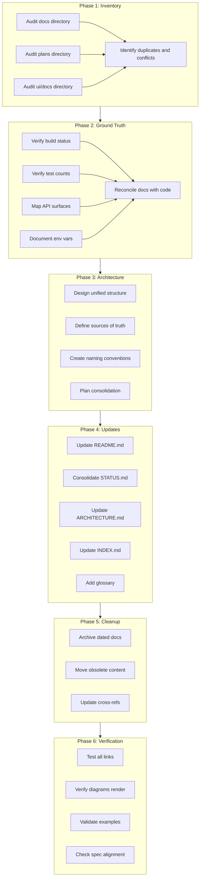

# Chrysalis Documentation Review Plan

**Created**: January 15, 2026  
**Status**: Planning Phase  
**Purpose**: Comprehensive multi-perspective review to align code and documentation with actual implementation

---

## Executive Summary

This plan outlines a systematic approach to audit, consolidate, and update Chrysalis documentation to ensure alignment with the working codebase. The goal is to create a professional, maintainable documentation system where the repository is the source of truth.

### Core Principles

1. **Repository is ground truth** - Documentation must reflect actual code
2. **No aspirational features as current** - Only describe what is implemented
3. **Diagram-first for flows/architectures** - Use Mermaid for clarity
4. **Citation of external sources** - Link design decisions to standards and references
5. **Forward-looking, not historical** - Remove transient logs from active docs

---

## Current State Assessment

### Documentation Locations

```
Chrysalis/
├── README.md                    # Project entry point
├── ARCHITECTURE.md              # System architecture spec
├── CONTRIBUTING.md              # Contributor guide
├── docs/                        # Main documentation
│   ├── STATUS.md                # Status - claimed authoritative
│   ├── INDEX.md                 # Navigation hub
│   ├── archive/                 # Historical docs - 30+ files
│   ├── architecture/            # Architecture deep-dives
│   ├── api/                     # API documentation
│   ├── current/                 # Active specifications
│   ├── guides/                  # How-to guides
│   ├── research/                # Research foundation
│   └── ...                      # 15+ subdirectories
├── ui/docs/                     # UI-specific docs - parallel hierarchy
│   └── CURRENT_STATUS.md        # Competing status document
├── plans/                       # Planning documents
├── memory_system/README.md      # Python package docs
└── shared/                      # Shared component docs
```

### Key Issues Identified

| Issue | Location | Impact |
|-------|----------|--------|
| Multiple status sources | docs/STATUS.md vs ui/docs/CURRENT_STATUS.md | Confusion about actual state |
| Test count discrepancy | README: 30/30, memory_system: 9 tests | Misleading metrics |
| Broken link patterns | `docs/current/STATUS.md` referenced but file is `docs/STATUS.md` | Navigation failures |
| Dated plans in active folder | plans/*.md with 2026-01-11 dates | Clutter |
| Duplicate quickstart content | Multiple entry points | Developer confusion |
| Orphaned session docs | Session-specific files in active directories | Noise |

---

## Workflow Overview



---

## Phase Details

### Phase 1: Documentation Inventory

**Goal**: Complete catalog of all documentation with classification

**Tasks**:
1. List all markdown files in docs/ with metadata
2. List all markdown files in plans/ with dates
3. List all markdown files in ui/docs/
4. Cross-reference to identify duplicates
5. Document contradictions between sources

**Output**: Inventory spreadsheet/table with classification by:
- Audience: Developer / Architect / Operations / User
- Currency: Current / Stale / Obsolete
- Type: Reference / Tutorial / Specification / Report

### Phase 2: Codebase Ground Truth

**Goal**: Verify documentation claims against actual code

**Tasks**:
1. Run `npm run build` and verify TypeScript status
2. Run `pytest memory_system/tests/` and verify Python test count
3. Map actual exports in src/index.ts
4. Document actual environment variables used
5. List implemented vs planned features

**Verification Commands**:
```bash
# TypeScript build
npm run build 2>&1 | tail -20

# Python tests
cd memory_system && python3 -m pytest tests/ -v --tb=no | tail -20

# API surface
grep -r "export" src/index.ts src/*/index.ts | head -50
```

### Phase 3: Information Architecture

**Goal**: Define target documentation structure

**Target Structure**:
```
docs/
├── README.md                 # Entry point with quick links
├── STATUS.md                 # Single authoritative status
├── INDEX.md                  # Navigation hub
├── GLOSSARY.md               # Domain term definitions
│
├── architecture/             # System design
│   ├── overview.md           # High-level architecture
│   ├── components.md         # Component details
│   └── data-flow.md          # Data flow diagrams
│
├── guides/                   # How-to content
│   ├── quick-start.md        # Getting started
│   ├── configuration.md      # Config reference
│   └── troubleshooting.md    # Problem resolution
│
├── api/                      # API reference
│   ├── index.md              # API overview
│   └── openapi/              # OpenAPI specs
│
├── adr/                      # Architecture Decision Records
│   └── ADR-NNN-*.md
│
└── archive/                  # Historical content
    ├── README.md             # Archive index
    └── YYYY-MM/              # Date-organized archives
```

### Phase 4: Core Documentation Updates

**Priority Order**:
1. **docs/STATUS.md** - Consolidate all status information here
2. **README.md** - Accurate quick start and links
3. **docs/INDEX.md** - Definitive navigation
4. **ARCHITECTURE.md** - Current state diagrams
5. **memory_system/README.md** - Accurate test counts

**For each document**:
- Verify all claims against code
- Update Mermaid diagrams
- Add external citations where applicable
- Include last updated date
- Set review cadence

### Phase 5: Cleanup and Archiving

**Archive Candidates** from initial analysis:
- `plans/CODE_REVIEW_REMEDIATION_PLAN_2026-01-11.md`
- `plans/COMPREHENSIVE_IMPROVEMENT_WORKPLAN_2026-01-11.md`
- Session-specific documents in ui/docs/archive/

**Archive Format**:
```markdown
# [Document Title]

> **ARCHIVED**: This document was archived on [DATE].
> **Reason**: [Superseded by X / Historical record / Completed work]
> **Current Document**: [Link to replacement if applicable]

[Original content below]
```

### Phase 6: Verification

**Checklist**:
- [ ] All internal links resolve to valid files
- [ ] Mermaid diagrams render correctly
- [ ] Code examples compile/run
- [ ] Commands work on fresh checkout
- [ ] No planned features described as implemented
- [ ] Environment variable documentation matches code
- [ ] API docs match actual endpoints

---

## Success Criteria

1. **Single source of truth** for each topic
2. **No broken links** in active documentation
3. **Accurate status** that matches code reality
4. **Clear archive separation** with explanatory labels
5. **Navigation hub** that serves all audiences
6. **Mermaid diagrams** for all major flows
7. **External citations** for architectural decisions

---

## Implementation Notes

### Mode Switching Requirements

- **Architect mode**: Planning, markdown document creation
- **Code mode**: Verifying build status, running tests, editing non-markdown files
- **Documentation Specialist mode**: Final review and polish

### Tools Available

- Mermaid for diagrams: Supported in GitHub markdown
- Link checkers: markdown-link-check configured in repo
- Search: grep/ripgrep for cross-reference mapping

---

## Related Documents

- [Current STATUS.md](../docs/STATUS.md)
- [Current INDEX.md](../docs/INDEX.md)
- [ARCHITECTURE.md](../ARCHITECTURE.md)
- [Documentation Inventory](../docs/DOCUMENTATION_INVENTORY.md)

---

**Plan Owner**: Review Team  
**Next Step**: Complete Phase 1 inventory audit
