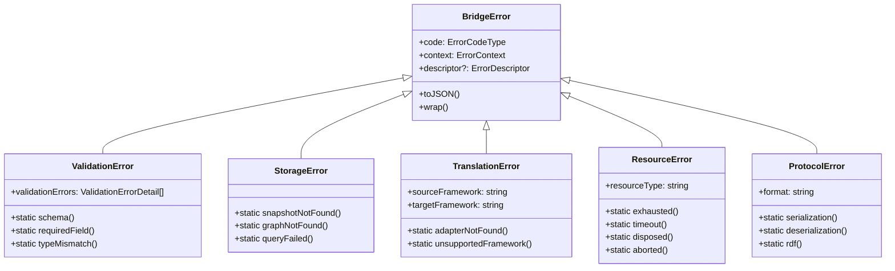

# Error Class Consolidation Plan

**Objective:** Reduce 18 error classes to 5 category classes with factory methods, achieving ~72% reduction in error class complexity.

---

## Executive Summary

| Metric | Current | Target | Reduction |
|--------|---------|--------|-----------|
| Error Classes | 18 | 5 | 72% |
| Lines of Code | ~500 | ~250 | 50% |
| Hierarchy Depth | 4 levels | 2 levels | 50% |

---

## Current Architecture Analysis

```
src/bridge/errors.ts (844 lines)
├── ErrorCode constants (70 lines) - KEEP
├── BridgeError base class (116 lines) - KEEP  
├── 17 derived error classes (~330 lines) - CONSOLIDATE
├── Utility functions (90 lines) - KEEP
└── Result pattern (50 lines) - KEEP
```

### Classes by Usage

| Category | Classes | Direct Usages | Decision |
|----------|---------|---------------|----------|
| Validation | ValidationError, Schema*, Required*, TypeMismatch* | 15 | Keep ValidationError, add factory methods |
| Storage | StorageError, Snapshot*, Graph*, Query* | 0 | Consolidate to StorageError + factories |
| Translation | Translation*, Adapter*, Unsupported* | 0 | Consolidate to TranslationError + factories |
| Resource | ResourceExhausted*, Timeout*, Disposed*, Abort* | 1 | Consolidate to ResourceError + factories |
| Protocol | Serialization*, Deserialization*, RDF* | 0 | Consolidate to ProtocolError + factories |
| Temporal | TemporalConflict*, InvalidTimeRange* | 0 | Consolidate to TemporalError + factories |
| Other | Configuration*, Dependency*, Aggregate* | 0 | Keep ConfigurationError, AggregateError |

---

## Target Architecture



---

## Implementation Steps

### Phase 1: Add Factory Methods to Existing Classes

**File: `src/bridge/errors.ts`**

1. Add static factory methods to ValidationError:
```typescript
export class ValidationError extends BridgeError {
  // Existing code...
  
  /** Factory: Schema validation error */
  static schema(schema: string, errors: ValidationErrorDetail[] = [], context: ErrorContext = {}): ValidationError {
    const error = new ValidationError(`Schema validation failed: ${schema}`, errors, {
      ...context,
      metadata: { ...context.metadata, schema }
    });
    error.code = ErrorCode.SCHEMA_INVALID as ErrorCodeType;
    return error;
  }
  
  /** Factory: Required field error */
  static requiredField(fieldPath: string, context: ErrorContext = {}): ValidationError {
    return new ValidationError(
      `Required field missing: ${fieldPath}`,
      [{ path: fieldPath, code: 'required', message: `${fieldPath} is required` }],
      context
    );
  }
  
  /** Factory: Type mismatch error */
  static typeMismatch(
    fieldPath: string,
    expectedType: string,
    actualType: string,
    context: ErrorContext = {}
  ): ValidationError {
    return new ValidationError(
      `Type mismatch at ${fieldPath}: expected ${expectedType}, got ${actualType}`,
      [{
        path: fieldPath,
        code: 'type',
        message: `Expected ${expectedType}, got ${actualType}`,
        expected: expectedType,
        actual: actualType,
      }],
      context
    );
  }
}
```

2. Add static factory methods to StorageError:
```typescript
export class StorageError extends BridgeError {
  // Existing code...
  
  /** Factory: Snapshot not found */
  static snapshotNotFound(agentId: string, timestamp?: Date, context: ErrorContext = {}): StorageError {
    const msg = timestamp
      ? `Snapshot not found for agent ${agentId} at ${timestamp.toISOString()}`
      : `No snapshots found for agent ${agentId}`;
    return new StorageError(ErrorCode.SNAPSHOT_NOT_FOUND, msg, {
      ...context,
      metadata: { ...context.metadata, agentId, timestamp: timestamp?.toISOString() },
    });
  }
  
  /** Factory: Graph not found */
  static graphNotFound(graphUri: string, context: ErrorContext = {}): StorageError {
    return new StorageError(ErrorCode.GRAPH_NOT_FOUND, `Graph not found: ${graphUri}`, {
      ...context,
      metadata: { ...context.metadata, graphUri },
    });
  }
  
  /** Factory: Query failed */
  static queryFailed(
    message: string,
    queryType: string,
    queryParams?: Record<string, unknown>,
    context: ErrorContext = {}
  ): StorageError {
    return new StorageError(ErrorCode.QUERY_FAILED, message, {
      ...context,
      metadata: { ...context.metadata, queryType, queryParams },
    });
  }
}
```

3. Create new ResourceError class with factories:
```typescript
export class ResourceError extends BridgeError {
  readonly resourceType: string;
  
  constructor(
    code: ErrorCodeType,
    message: string,
    resourceType: string,
    context: ErrorContext = {}
  ) {
    super(code, message, { ...context, metadata: { ...context.metadata, resourceType } });
    this.resourceType = resourceType;
  }
  
  /** Factory: Resource exhausted */
  static exhausted(
    resourceType: string,
    limit: number,
    current: number,
    context: ErrorContext = {}
  ): ResourceError {
    return new ResourceError(
      ErrorCode.RESOURCE_EXHAUSTED,
      `Resource exhausted: ${resourceType} (limit: ${limit}, current: ${current})`,
      resourceType,
      { ...context, metadata: { ...context.metadata, limit, current } }
    );
  }
  
  /** Factory: Timeout */
  static timeout(operation: string, timeoutMs: number, context: ErrorContext = {}): ResourceError {
    return new ResourceError(
      ErrorCode.TIMEOUT,
      `Operation timed out: ${operation} (${timeoutMs}ms)`,
      'timeout',
      { ...context, operation, metadata: { ...context.metadata, timeoutMs } }
    );
  }
  
  /** Factory: Disposed */
  static disposed(resourceType: string, context: ErrorContext = {}): ResourceError {
    return new ResourceError(
      ErrorCode.DISPOSED,
      `Resource has been disposed: ${resourceType}`,
      resourceType,
      context
    );
  }
  
  /** Factory: Aborted */
  static aborted(reason?: string, context: ErrorContext = {}): ResourceError {
    return new ResourceError(
      ErrorCode.ABORT_REQUESTED,
      reason ? `Operation aborted: ${reason}` : 'Operation aborted',
      'abort',
      { ...context, metadata: { ...context.metadata, reason } }
    );
  }
}
```

### Phase 2: Deprecate Old Classes

Add JSDoc deprecation notices to all classes being removed:

```typescript
/**
 * @deprecated Use ValidationError.schema() factory method instead
 */
export class SchemaValidationError extends ValidationError { /* ... */ }

/**
 * @deprecated Use ValidationError.requiredField() factory method instead  
 */
export class RequiredFieldError extends ValidationError { /* ... */ }

/**
 * @deprecated Use ResourceError.timeout() factory method instead
 */
export class TimeoutError extends BridgeError { /* ... */ }
```

### Phase 3: Create Type Aliases for Backward Compatibility

```typescript
// Backward compatibility aliases
/** @deprecated Use ValidationError.schema() */
export type SchemaValidationErrorLegacy = ValidationError;
/** @deprecated Use ValidationError.requiredField() */
export type RequiredFieldErrorLegacy = ValidationError;
/** @deprecated Use ResourceError.timeout() */
export type TimeoutErrorLegacy = ResourceError;
// ... etc
```

### Phase 4: Update Usages

Update `src/bridge/lifecycle.ts`:
```typescript
// Before
controller.abort(new TimeoutError('Operation', timeoutMs));

// After  
controller.abort(ResourceError.timeout('Operation', timeoutMs));
```

### Phase 5: Remove Deprecated Classes (Future)

After deprecation period, remove the old classes entirely.

---

## Metrics

### Code Volume Reduction

| Section | Current Lines | Target Lines | Reduction |
|---------|---------------|--------------|-----------|
| Error classes | ~330 | ~150 | 55% |
| Total file | 844 | ~550 | 35% |

### Anti-Pattern Resolution

| Anti-Pattern | Resolution |
|--------------|------------|
| Shotgun Surgery | Factory methods centralize error creation |
| Speculative Generality | Removed thin wrapper classes |
| Primitive Obsession | Consolidated metadata in context |
| Deep Hierarchy | Reduced to 2 levels max |

---

## Testing Strategy

1. **Unit Tests**: Add tests for each factory method
2. **Type Guards**: Verify `instanceof` checks still work
3. **Serialization**: Test `toJSON()` produces same output
4. **Integration**: Run full test suite to verify no regressions

---

## Rollout Plan

1. Phase 1: Add factory methods (non-breaking)
2. Phase 2: Add deprecation notices (non-breaking)  
3. Phase 3: Update internal usages
4. Phase 4: Update documentation
5. Phase 5: Remove deprecated classes (breaking, future release)

---

**Created:** 2026-01-11
**Author:** Architect Mode
**Target Completion:** Current sprint