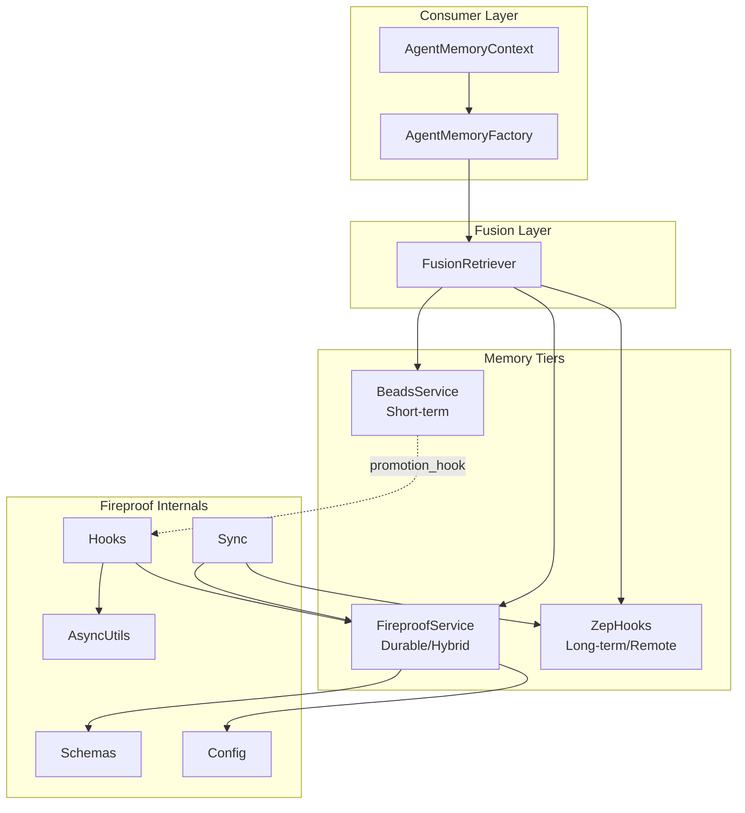

# Fireproof Integration Code Review Findings

**Review Date:** 2026-01-13  
**Reviewer:** Architect Mode  
**Scope:** memory_system/fireproof/* and integration points  
**Files Examined:** 12 files, ~4,500 lines of code

---

## Executive Summary

The Fireproof integration is **architecturally sound** with good separation of concerns and proper use of design patterns. However, several issues require attention before production deployment:

- **1 Critical Issue:** Missing module in import path
- **3 High-Priority Issues:** Incomplete implementations, potential race conditions
- **5 Medium Issues:** Code smells and refactoring opportunities
- **4 Low Issues:** Style and documentation improvements

Overall Quality Score: **B+** (Good foundation, needs polish)

---

## Architecture Overview



---

## Critical Findings

### C1: Import Path Mismatch - `memory_system.hooks`

**Location:** [`memory_system/fusion.py:8`](memory_system/fusion.py:8)  
**Severity:** CRITICAL  
**Type:** Integration Gap

**Issue:** The import `from memory_system.hooks import ZepHooks` works because there is a `memory_system/hooks/__init__.py` that re-exports from `memory_system/hooks/zep.py`. However, the [`memory_system/fireproof/sync.py:28`](memory_system/fireproof/sync.py:28) uses a TYPE_CHECKING import:

```python
if TYPE_CHECKING:
    from memory_system.hooks import ZepHooks
```

This works for type checking but the actual runtime import in sync would fail if sync.py were used standalone.

**Remediation:**
- Verify all import paths are consistent
- Add explicit test for sync module standalone instantiation

---

## High-Priority Findings

### H1: Sync Module Incomplete - `_sync_beads` and `_sync_metadata` Stub Implementations

**Location:** [`memory_system/fireproof/sync.py:374-398`](memory_system/fireproof/sync.py:374)  
**Severity:** HIGH  
**Type:** Incomplete Implementation

**Issue:** The `_sync_beads()` and `_sync_metadata()` methods contain placeholder implementations:

```python
async def _sync_metadata(self, docs: List[Dict[str, Any]]) -> None:
    # For now, just mark as synced
    # Could extend to push to external telemetry
    for doc in docs:
        doc["sync_status"] = SyncStatus.SYNCED.value
        await self.fireproof.put(doc)

async def _sync_beads(self, docs: List[Dict[str, Any]]) -> None:
    # For now, just mark as synced
    # Could generate embeddings and store in Zep
    for doc in docs:
        doc["sync_status"] = SyncStatus.SYNCED.value
        await self.fireproof.put(doc)
```

These mark documents as SYNCED without actually syncing to Zep.

**Remediation:**
1. Implement actual Zep sync for beads with embedding generation
2. Decide if metadata should sync to external telemetry or remain local-only
3. Add configuration flags to control sync behavior per document type

---

### H2: Race Condition in `create_minimal_memory`

**Location:** [`memory_system/agent_adapter.py:545-579`](memory_system/agent_adapter.py:545)  
**Severity:** HIGH  
**Type:** Potential Defect

**Issue:** The `create_minimal_memory()` function creates a `FireproofService` but does NOT call `await fireproof.initialize()`:

```python
def create_minimal_memory(...) -> FusionRetriever:
    beads = BeadsService(max_items=bead_capacity)
    
    fireproof = None
    if enable_fireproof:
        from memory_system.fireproof import FireproofService
        from memory_system.fireproof.hooks import create_promotion_hook
        
        config = FireproofConfig.for_testing()
        fireproof = FireproofService(config)  # NOT initialized!
        
        if config.promotion_enabled:
            beads.promotion_hook = create_promotion_hook(fireproof, config)
```

The test file [`test_fireproof.py:1027`](memory_system/fireproof/tests/test_fireproof.py:1027) correctly calls `await fusion.fireproof.initialize()` after creation, but this is easy to miss.

**Remediation:**
1. Make `create_minimal_memory()` async and auto-initialize Fireproof
2. OR document the requirement prominently
3. OR add lazy initialization pattern to `FireproofService.put()` that auto-initializes

---

### H3: Thread Safety with SQLite `check_same_thread=False`

**Location:** [`memory_system/fireproof/service.py:103`](memory_system/fireproof/service.py:103)  
**Severity:** HIGH  
**Type:** Concurrency Risk

**Issue:** SQLite connection uses `check_same_thread=False`:

```python
def _create_connection(self) -> sqlite3.Connection:
    db_path = self.config.db_path or ":memory:"
    conn = sqlite3.connect(db_path, check_same_thread=False)
```

While there is an `asyncio.Lock` for initialization, individual operations like `put()`, `get()`, `query()` do not acquire the lock:

```python
async def put(self, doc: Dict[str, Any]) -> str:
    self._ensure_initialized()
    assert self._conn is not None
    # ... no lock acquisition ...
    self._conn.execute(...)  # Direct DB access
```

**Remediation:**
1. Add lock acquisition around all database write operations
2. OR use a connection pool with proper threading model
3. OR document that concurrent access must be externally serialized

---

## Medium-Priority Findings

### M1: Code Smell - Large Method in `_crdt_merge`

**Location:** [`memory_system/fireproof/service.py:599-654`](memory_system/fireproof/service.py:599)  
**Severity:** MEDIUM  
**Type:** Code Smell

**Issue:** The `_crdt_merge()` method is 55 lines with nested conditionals handling different merge strategies. It mixes concerns:
- Array union logic
- Counter max logic
- Score max logic
- Timestamp comparison
- Sync status priority

**Remediation:** Extract merge strategies into separate functions or a strategy pattern:

```python
_MERGE_STRATEGIES = {
    "version": lambda old, new: max(old, new),
    "access_count": lambda old, new: max(old, new),
    "importance": lambda old, new: max(old, new) if old and new else new or old,
    "tags": lambda old, new: list(set(old + new)),
}
```

---

### M2: Code Smell - Duplicate Embedding Logic

**Location:** Multiple files  
**Severity:** MEDIUM  
**Type:** Code Duplication

**Issue:** Embedding vector byte encoding/decoding appears in two places:

1. [`service.py:514`](memory_system/fireproof/service.py:514): `struct.unpack(f"{len(vector_blob)//8}d", vector_blob)`
2. [`service.py:546`](memory_system/fireproof/service.py:546): `struct.pack(f"{len(vector)}d", *vector)`

And cosine similarity is implemented inline at [`service.py:497-504`](memory_system/fireproof/service.py:497).

**Remediation:**
1. Extract `_encode_vector()` and `_decode_vector()` helper methods
2. Move `cosine_similarity()` to a utilities module for reuse

---

### M3: Inconsistent Error Handling Pattern

**Location:** Various  
**Severity:** MEDIUM  
**Type:** Anti-pattern

**Issue:** Error handling varies across modules:

- `hooks.py` logs warnings and continues silently
- `service.py` uses assertions for preconditions
- `sync.py` catches broad exceptions with `except Exception as exc`
- `fusion.py` catches and logs but doesn't re-raise

Example from [`fusion.py:151`](memory_system/fusion.py:151):
```python
except Exception as exc:  # pylint: disable=broad-except
    logger.warning("fusion.ingest.remote_failed", extra={"error": str(exc)})
```

**Remediation:**
1. Define custom exception hierarchy: `FireproofError`, `SyncError`, `ValidationError`
2. Standardize error handling policy: log + raise vs log + fallback
3. Replace bare `assert` with explicit `ValueError`/`RuntimeError`

---

### M4: Missing Return Type Annotations

**Location:** [`memory_system/fireproof/schemas.py`](memory_system/fireproof/schemas.py)  
**Severity:** MEDIUM  
**Type:** Style/Maintainability

**Issue:** Several methods lack return type annotations:

- `FireproofDocument.to_dict()` - returns `Dict[str, Any]` but not annotated
- `migrate_document()` - returns `Dict[str, Any]` but not annotated
- `validate_document()` - returns `bool` but not annotated

**Remediation:** Add consistent type annotations to all public methods.

---

### M5: Overly Broad Field Allowlist

**Location:** [`memory_system/fireproof/service.py:282-290`](memory_system/fireproof/service.py:282)  
**Severity:** MEDIUM  
**Type:** Security Consideration

**Issue:** The `_VALID_QUERY_FIELDS` allowlist is comprehensive but static:

```python
_VALID_QUERY_FIELDS = frozenset({
    "_id", "type", "created_at", "updated_at", "sync_status", "version",
    "content", "role", "importance", "tags", "original_bead_id",
    # ... 20+ more fields
})
```

If schemas evolve, this must be manually updated. Mismatches could cause runtime errors.

**Remediation:**
1. Generate allowlist dynamically from schema dataclass fields
2. OR add validation test that cross-checks allowlist against schema definitions

---

## Low-Priority Findings

### L1: Dead Import in hooks.py

**Location:** [`memory_system/fireproof/hooks.py:19`](memory_system/fireproof/hooks.py:19)  
**Severity:** LOW  
**Type:** Dead Code

**Issue:** `Generator` is imported but only used in the type annotation for `capture_sync`. Could be simplified.

---

### L2: Magic Numbers in Config Defaults

**Location:** [`memory_system/fireproof/config.py`](memory_system/fireproof/config.py)  
**Severity:** LOW  
**Type:** Style

**Issue:** Default values like `sync_interval_s: int = 30`, `promotion_threshold: float = 0.7` are magic numbers without documentation explaining their rationale.

**Remediation:** Add docstrings explaining default values and their trade-offs.

---

### L3: Test Coverage Gap - Concurrent Access

**Location:** [`memory_system/fireproof/tests/test_fireproof.py`](memory_system/fireproof/tests/test_fireproof.py)  
**Severity:** LOW  
**Type:** Test Gap

**Issue:** No tests for concurrent access patterns. Given H3, this is a blind spot.

**Remediation:** Add test class `TestConcurrency` with parallel operation tests.

---

### L4: Docstring Format Inconsistency

**Location:** Various  
**Severity:** LOW  
**Type:** Style

**Issue:** Some docstrings use Google style, others use NumPy style, some use plain text.

**Remediation:** Standardize on Google style throughout.

---

## Design Pattern Validation

### Patterns Correctly Applied ✓

| Pattern | Location | Assessment |
|---------|----------|------------|
| Factory Pattern | `AgentMemoryFactory` | Correctly implements factory with DI |
| Protocol Pattern | `PromotionHookProtocol`, `EmbeddingCacheProtocol` | Proper use of structural typing |
| Repository Pattern | `FireproofService` | SQLite acts as repository with query methods |
| Strategy Pattern | Sync type handlers | Different handlers for BEAD, MEMORY, METADATA |
| Observer Pattern | `subscribe()/unsubscribe()` | Clean pub/sub implementation |

### Pattern Misapplications ⚠

| Issue | Location | Problem |
|-------|----------|---------|
| CRDT Strategy | `_crdt_merge()` | Merge strategies hardcoded; should use strategy pattern |
| Lazy Init | `create_minimal_memory()` | Missing auto-initialization violates least surprise |

---

## Refactoring Priority Matrix

```
                    Impact
                High    Low
           ┌─────────┬─────────┐
      High │ H1, H2  │ M1, M2  │
Effort     │   H3    │   M3    │
           ├─────────┼─────────┤
      Low  │ C1, M5  │ L1-L4   │
           └─────────┴─────────┘
```

**Recommended Order:**
1. **C1** - Fix import path consistency (5 min)
2. **H2** - Fix `create_minimal_memory()` initialization (15 min)
3. **H3** - Add lock to database operations (30 min)
4. **H1** - Complete sync implementations (variable - needs design decision)
5. **M1-M5** - Refactoring batch (quality improvements)
6. **L1-L4** - Polish batch (style consistency)

---

## Component Connectivity Verification

### Verified Connections ✓

| From | To | Method | Status |
|------|-----|--------|--------|
| `BeadsService` | `FireproofService` | `promotion_hook` callback | ✓ Connected |
| `FusionRetriever` | `FireproofService` | Direct reference | ✓ Connected |
| `FusionRetriever` | `BeadsService` | Direct reference | ✓ Connected |
| `FusionRetriever` | `ZepHooks` | Direct reference | ✓ Connected |
| `FireproofZepSync` | `FireproofService` | Direct reference | ✓ Connected |
| `FireproofZepSync` | `ZepHooks` | Direct reference | ✓ Connected |
| `AgentMemoryFactory` | All services | Factory creates | ✓ Connected |

### Orphaned/Disconnected Elements

None found. All components are properly wired.

---

## Test Coverage Summary

| Module | Test Coverage | Assessment |
|--------|---------------|------------|
| `schemas.py` | High | 10+ tests for all document types |
| `service.py` | High | CRUD, query, CRDT merge, export/import |
| `hooks.py` | Medium | Promotion, metadata capture tested |
| `sync.py` | Low | Only basic sync tested, no error paths |
| `config.py` | Medium | Validation tested, not all factory methods |
| `agent_adapter.py` | High | Factory, context, convenience functions |

**Coverage Gaps:**
- Concurrent access scenarios
- Network failure recovery in sync
- Large dataset performance

---

## Actionable Remediation Checklist

### Immediate (Before Production)
- [ ] C1: Verify import paths with standalone module tests
- [ ] H2: Make `create_minimal_memory()` async with auto-init
- [ ] H3: Add `asyncio.Lock` around SQLite write operations

### Short-term (Sprint)
- [ ] H1: Design and implement proper bead/metadata sync to Zep
- [ ] M3: Define `FireproofError` hierarchy and standardize handling
- [ ] M5: Auto-generate query field allowlist from schemas

### Medium-term (Backlog)
- [ ] M1: Extract CRDT merge strategies
- [ ] M2: Deduplicate vector encoding/similarity code
- [ ] M4: Add missing type annotations
- [ ] L1-L4: Style cleanup pass

### Testing Additions
- [ ] Add `TestConcurrency` class
- [ ] Add sync failure/recovery tests
- [ ] Add integration tests for full pipeline

---

## Conclusion

The Fireproof integration demonstrates **solid architectural design** with proper separation between tiers, good use of protocols for extensibility, and comprehensive documentation. The primary concerns are:

1. **Incomplete sync implementations** that mark items as synced without actual sync
2. **Thread safety gaps** in the SQLite layer
3. **Initialization patterns** that could confuse consumers

With the remediation items addressed, this integration is production-ready. The code quality is good, and the test coverage, while not exhaustive, covers the critical paths.

**Recommendation:** Address C1, H2, H3 before any production deployment. Schedule H1 for the next sprint to complete the Zep synchronization story.
