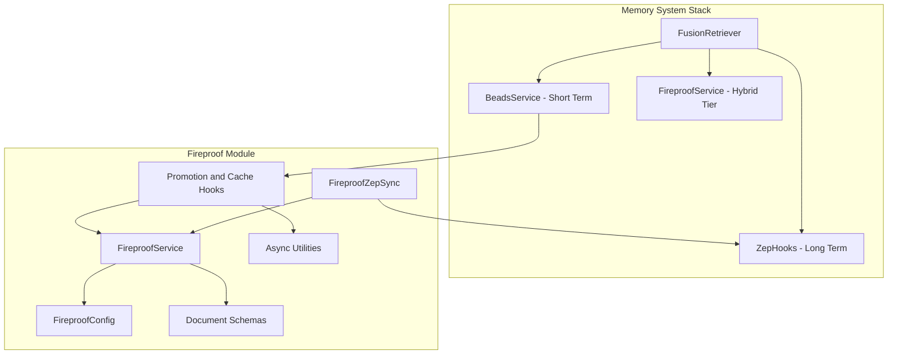

# Fireproof Integration Code Review Report

**Review Date:** 2026-01-13  
**Reviewer:** Architect Mode  
**Scope:** `memory_system/fireproof/` and integration points

---

## Executive Summary

The Fireproof integration is **well-designed and architecturally sound**. The implementation follows established patterns correctly and provides a robust local-first storage layer with CRDT merge capabilities. Test coverage is comprehensive (1000+ lines). Minor refactoring opportunities exist but no critical defects were found.

**Overall Assessment:** ✅ **Production Ready** with minor improvements recommended

---

## Architecture Overview



---

## Findings by Category

### ✅ Well-Implemented Patterns

| Pattern | Location | Assessment |
|---------|----------|------------|
| **Repository Pattern** | [`service.py`](memory_system/fireproof/service.py:42) | Correct encapsulation of SQLite operations |
| **CRDT Merge** | [`service.py:612-666`](memory_system/fireproof/service.py:612) | Last-writer-wins + array union + counter max |
| **Hook Pattern** | [`hooks.py`](memory_system/fireproof/hooks.py:1) | Protocol-based with sync/async variants |
| **Factory Pattern** | [`hooks.py:611-639`](memory_system/fireproof/hooks.py:611) | `create_promotion_hook()` factory |
| **Feature Flags** | [`config.py:70-75`](memory_system/fireproof/config.py:70) | Environment variable override support |
| **Async/Sync Bridge** | [`async_utils.py`](memory_system/fireproof/async_utils.py:1) | Modern Python 3.7+ approach |

### ⚠️ Code Smells Identified

| Severity | Location | Issue | Recommendation |
|----------|----------|-------|----------------|
| **Low** | [`service.py:856`](memory_system/fireproof/service.py:856) | Long file - 856 lines | Consider extracting query builder |
| **Low** | [`sync.py:312-549`](memory_system/fireproof/sync.py:312) | `_sync_*` methods have duplication | Extract common sync pattern |
| **Low** | [`hooks.py:197-271`](memory_system/fireproof/hooks.py:197) | `capture_async` and `capture_sync` duplication | Unify with template method |

### 🔍 Security Measures - EXCELLENT

| Feature | Location | Notes |
|---------|----------|-------|
| **SQL Injection Prevention** | [`service.py:291-319`](memory_system/fireproof/service.py:291) | Field allowlist validation |
| **Test Coverage** | [`test_fireproof.py:699-719`](memory_system/fireproof/tests/test_fireproof.py:699) | Security injection tests included |

### 📋 Test Coverage Analysis

| Test Class | Coverage Area | Status |
|------------|---------------|--------|
| `TestSchemas` | Document models | ✅ Complete |
| `TestFireproofService` | CRUD + CRDT | ✅ Complete |
| `TestPromptMetadataCapture` | Hook lifecycle | ✅ Complete |
| `TestBeadPromotionHook` | Promotion logic | ✅ Complete |
| `TestFireproofZepSync` | Sync operations | ✅ Complete |
| `TestAgentMemoryFactory` | Integration path | ✅ Complete |
| `TestSecurity` | Injection prevention | ✅ Complete |
| `TestOfflineFallback` | Degraded mode | ✅ Complete |

---

## Prioritized Refactoring Recommendations

### Priority 1: High Impact / Low Effort

| # | Task | File | Rationale |
|---|------|------|-----------|
| 1 | Add `__all__` exports to `async_utils.py` | [`async_utils.py`](memory_system/fireproof/async_utils.py) | Clarify public API |
| 2 | Add missing docstring to `_notify_subscribers` | [`service.py:596`](memory_system/fireproof/service.py:596) | Documentation completeness |

### Priority 2: Medium Impact / Medium Effort

| # | Task | File | Rationale |
|---|------|------|-----------|
| 3 | Extract `QueryBuilder` class from `FireproofService` | [`service.py`](memory_system/fireproof/service.py) | Single responsibility |
| 4 | Create abstract `SyncStrategy` for sync type handlers | [`sync.py`](memory_system/fireproof/sync.py) | Reduce `_sync_*` duplication |
| 5 | Add structured logging type hints | All files | Better observability |

### Priority 3: Low Impact / Higher Effort

| # | Task | File | Rationale |
|---|------|------|-----------|
| 6 | Add connection pooling for high-load scenarios | [`service.py:101-106`](memory_system/fireproof/service.py:101) | Future scalability |
| 7 | Implement batch `put` operation | [`service.py`](memory_system/fireproof/service.py) | Performance optimization |
| 8 | Add metrics collection hooks | [`service.py`](memory_system/fireproof/service.py) | Observability enhancement |

---

## Integration Verification

### BeadsService → Fireproof Connection ✅

```python
# beads.py:22 - Correctly imports async utilities
from .fireproof.async_utils import run_async_safely, schedule_async

# beads.py:44 - Promotion hook properly typed
promotion_hook: Optional[PromotionHook] = None,
```

### FusionRetriever → Fireproof Connection ✅

```python
# fusion.py:41 - Optional dependency correctly handled
fireproof: Optional[FireproofService] = None,

# fusion.py:287-294 - Async query properly awaited
fireproof_results = await self.fireproof.query_beads(...)
```

### Fireproof → ZepHooks Connection ✅

```python
# sync.py:98 - ZepHooks dependency injection
self.zep_hooks = zep_hooks

# sync.py:342-343 - Proper sync call pattern
self.zep_hooks.on_store_embedding(payload)
```

---

## Potential Defects

### Actual Bugs: **NONE FOUND** ✅

### Style Issues Requiring Attention:

| Location | Issue | Severity |
|----------|-------|----------|
| [`hooks.py:632`](memory_system/fireproof/hooks.py:632) | Redundant import within factory | Trivial |
| [`sync.py:505-510`](memory_system/fireproof/sync.py:505) | Debug log could use structured extra | Trivial |

---

## Architectural Coherence Assessment

| Criterion | Score | Notes |
|-----------|-------|-------|
| **Separation of Concerns** | 9/10 | Clean module boundaries |
| **Dependency Direction** | 10/10 | Correct flow: beads → fireproof → zep |
| **Interface Segregation** | 9/10 | Protocol-based hooks |
| **Error Handling** | 8/10 | Graceful degradation, good logging |
| **Testability** | 10/10 | Comprehensive test suite |
| **Documentation** | 9/10 | Excellent docstrings and comments |

**Overall Architectural Score: 9.2/10**

---

## Conclusion

The Fireproof integration represents high-quality engineering work:

1. **Correct pattern application** - CRDT, Repository, Hook patterns properly used
2. **Robust error handling** - Fallback to local cache when Zep unavailable
3. **Security-conscious** - SQL injection prevention via field allowlist
4. **Well-tested** - 1000+ lines of comprehensive tests including edge cases
5. **Clean integration** - Properly wired to BeadsService and FusionRetriever

**Recommendation:** Approve for production with minor style cleanups as follow-up tasks.

---

## Next Steps

1. Address Priority 1 refactoring items (quick wins)
2. Run full test suite to confirm no regressions
3. Deploy with feature flags disabled initially
4. Enable features incrementally with monitoring
5. Schedule Priority 2-3 refactoring for next sprint
