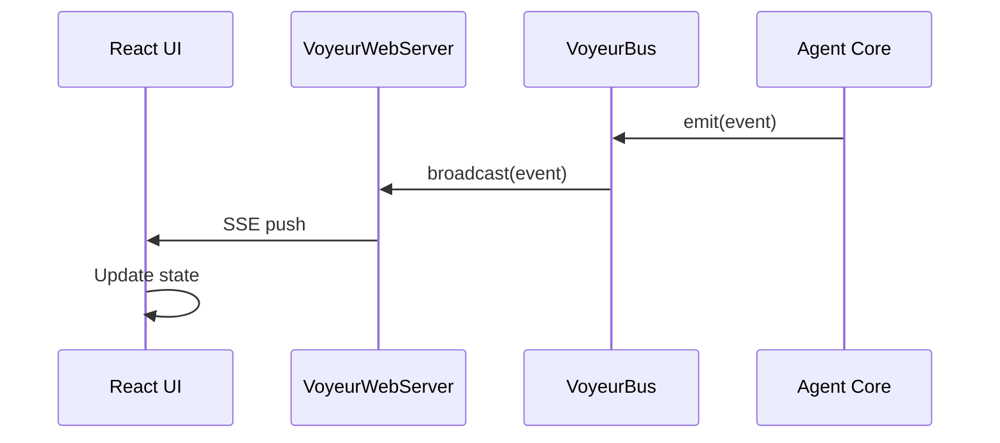
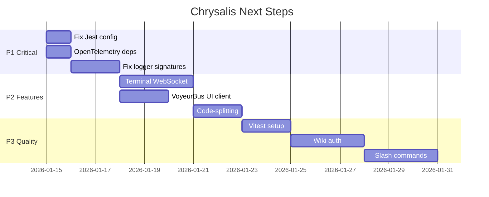

# Chrysalis Next Steps Plan

**Date**: January 15, 2026  
**Status**: Active  
**Owner**: Engineering Team  
**Version**: 3.1.1

---

## Executive Summary

The documentation review is complete. This plan outlines the prioritized engineering work needed to fix current issues and advance the project toward completion.

### Current State

| Domain | Build | Tests | Notes |
|--------|-------|-------|-------|
| TypeScript Core | ✅ Passing | ⚠️ UI tests failing | Jest config issue |
| Python memory_system | ✅ Passing | ✅ 34+ tests passing | Fireproof complete |
| UI (React/Vite) | ✅ Passing | ❌ 0% coverage | Test infrastructure needed |
| Go Crypto Server | ⚠️ Not verified | ⚠️ Not verified | Requires Go environment |

---

## Priority 1: Critical Fixes (Unblock Testing)

### 1.1 Fix Jest Test Configuration

**Problem**: UI tests in `ui/src/components/` fail with TypeScript errors:
- `toBeInTheDocument` does not exist on type `Assertion<HTMLElement>`
- `toHaveAttribute`, `toHaveFocus`, `toBeChecked` etc. missing

**Root Cause**: 
- Jest configured with `testEnvironment: 'node'` (see `jest.config.js`)
- UI tests require `jsdom` environment
- `@testing-library/jest-dom` matchers not imported

**Solution**:

1. Create separate Jest config for UI tests or add project configuration:

```javascript
// Option A: jest.config.js with projects
module.exports = {
  projects: [
    {
      displayName: 'core',
      preset: 'ts-jest',
      testEnvironment: 'node',
      testMatch: ['<rootDir>/src/**/*.test.ts'],
      testPathIgnorePatterns: ['/node_modules/', '/dist/', '/mcp-servers/']
    },
    {
      displayName: 'ui',
      preset: 'ts-jest',
      testEnvironment: 'jsdom',
      testMatch: ['<rootDir>/ui/src/**/*.test.{ts,tsx}'],
      setupFilesAfterEnv: ['<rootDir>/ui/jest.setup.ts']
    }
  ]
};
```

2. Create `ui/jest.setup.ts`:

```typescript
import '@testing-library/jest-dom';
```

3. Install missing dependencies:

```bash
npm install -D @testing-library/jest-dom @testing-library/react jest-environment-jsdom
```

**Files to modify**:
- `jest.config.js`
- Create `ui/jest.setup.ts`
- `package.json` (add dev dependencies)

---

### 1.2 Install OpenTelemetry Dependencies

**Problem**: `src/observability/index.ts` has `@ts-nocheck` due to missing OpenTelemetry types

**Solution**:

```bash
npm install -D @opentelemetry/api @opentelemetry/sdk-trace-base @opentelemetry/sdk-metrics
```

**Files to modify**:
- `package.json`
- Remove `@ts-nocheck` from `src/observability/index.ts`

---

### 1.3 Fix Logger Signature Issues in Sync Modules

**Problem**: `src/sync/CRDTState.ts` and `src/sync/GossipProtocol.ts` have logger signature mismatches

**Investigation needed**: Examine the logger interface expected vs provided

**Files to modify**:
- `src/sync/CRDTState.ts`
- `src/sync/GossipProtocol.ts`
- Potentially create a `Logger` interface type

---

## Priority 2: Feature Completeness

### 2.1 Terminal WebSocket Backend Connection

**Current State**: Terminal canvas implemented with xterm.js but no backend

**Required**:
1. Create WebSocket endpoint in `src/services/` or `src/api/`
2. Connect to shell process (PTY)
3. Bridge Terminal component to WebSocket

**Reference**: `ui/docs/TERMINAL_PANE_ARCHITECTURE.md`

---

### 2.2 VoyeurBus Client in UI

**Current State**: VoyeurBus (`src/observability/VoyeurEvents.ts`) and SSE server (`src/observability/VoyeurWebServer.ts`) exist, but no UI client

**Required**:
1. Create React hook: `useVoyeurEvents()`
2. Connect to SSE endpoint `/voyeur/events`
3. Display in Observability panel or dedicated canvas

**Architecture**:



---

### 2.3 Code-Splitting for UI Bundle

**Current State**: 1,183 kB bundle (342 kB gzipped)

**Target**: <600 kB bundle

**Strategy**:
1. Lazy load canvas components
2. Use `React.lazy()` + `Suspense`
3. Split heavy dependencies (ReactFlow, xterm.js, etc.)

```typescript
// Example lazy loading
const TerminalCanvas = React.lazy(() => import('./TerminalCanvas'));
const ReactFlowCanvas = React.lazy(() => import('./ReactFlowCanvas'));
```

---

## Priority 3: Quality & Polish

### 3.1 UI Test Infrastructure (Vitest)

**Rationale**: UI uses Vite; Vitest is the natural testing choice over Jest for UI

**Strategy**:
1. Keep Jest for core TypeScript tests
2. Add Vitest for UI component tests
3. Target 40% coverage

**Files to create**:
- `ui/vitest.config.ts`
- `ui/vitest.setup.ts`
- Test files alongside components

---

### 3.2 Wiki Authentication Flow

**Current State**: Wiki canvas complete but auth not implemented

**Required**:
1. MediaWiki OAuth integration
2. Token storage in Settings
3. Auth state management

---

### 3.3 Slash Command System

**Documented but not implemented**: `/invite`, `/agent`, `/canvas` commands

**Required**:
1. Command parser in chat input
2. Command handler registry
3. Integration with agent system

---

## Implementation Sequence



---

## Verification Checklist

### After P1 Complete
- [ ] `npm test` passes with 0 failures
- [ ] `npm run build` passes with 0 `@ts-nocheck`
- [ ] TypeScript strict mode enabled everywhere

### After P2 Complete
- [ ] Terminal canvas connects to backend
- [ ] VoyeurBus events visible in UI
- [ ] UI bundle < 600 kB

### After P3 Complete
- [ ] UI test coverage ≥ 40%
- [ ] Wiki canvas can authenticate
- [ ] Slash commands functional

---

## Related Documents

| Document | Purpose |
|----------|---------|
| [STATUS.md](../docs/STATUS.md) | Current implementation status |
| [ARCHITECTURE.md](../ARCHITECTURE.md) | System design |
| [Documentation Review Report](../docs/DOCUMENTATION_REVIEW_REPORT_2026-01-15.md) | Review findings |

---

**Document Owner**: Engineering Team  
**Review Cadence**: After each priority tier completion
