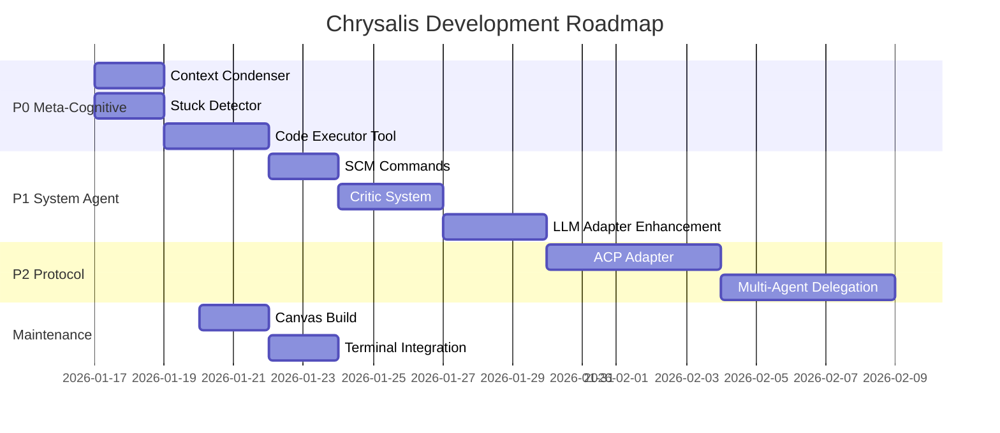

# Chrysalis Next Steps Plan

**Date**: January 16, 2026
**Status**: Active
**Owner**: Engineering Team
**Version**: 3.2.0

---

## Executive Summary

Following comprehensive research into **Open Interpreter**, **OpenHands V1 SDK**, **ACP Protocol**, and **AgentPipe**, we've identified strategic enhancements for the Chrysalis System Agent Middleware. This plan integrates those findings with existing engineering priorities.

### Current State

| Domain | Build | Tests | Notes |
|--------|-------|-------|-------|
| TypeScript Core | ✅ Passing | ⚠️ Partial | Some test failures |
| Python memory_system | ✅ Passing | ✅ 34+ tests | Complete |
| Canvas Architecture | ✅ Complete | 🔄 Prototype | Needs Vite integration |
| System Agent Middleware | ✅ Implemented | ⚠️ Partial | SCM, Arbiter, Routing done |
| Go LLM Gateway | ⚠️ Not verified | ⚠️ Not verified | Requires Go environment |

---

## Strategic Research Findings

### Key Integrations Identified

| Source | Pattern | Chrysalis Application |
|--------|---------|----------------------|
| **Open Interpreter** | LiteLLM multi-provider | Enhance `GatewayLLMClient` |
| **Open Interpreter** | Code execution `exec()` | System agent tools |
| **Open Interpreter** | Conversation commands | SCM control (`/reset`, `/undo`) |
| **OpenHands V1** | Context Condenser | Token budget management |
| **OpenHands V1** | Stuck Detector | Loop prevention |
| **OpenHands V1** | Critic System | Self-evaluation |
| **ACP Protocol** | Editor ↔ Agent standard | VS Code/Zed integration |
| **AgentPipe** | Multi-CLI orchestration | Multi-agent coordination |

---

## Priority 0: Meta-Cognitive Enhancements (This Sprint)

### 0.1 Context Condenser Implementation

**Source**: OpenHands V1 SDK condenser patterns

**Why Critical**: Multi-agent conversations accumulate context 3-4x faster, hitting token limits

**Implementation**:

```
src/experience/
├── ContextCondenser.ts        # NEW - Interface + implementations
│   ├── WindowCondenser        # Sliding window (simple)
│   ├── SummarizingCondenser   # LLM-based summarization
│   └── PipelineCondenser      # Chain strategies
```

**Effort**: 2 days

---

### 0.2 Stuck Detector Implementation

**Source**: OpenHands V1 SDK `stuck_detector.py`

**Why Critical**: Prevents runaway loops, wasted API credits

**Implementation**:

```
src/experience/
├── StuckDetector.ts           # NEW
│   ├── isStuck()              # Check for loops
│   ├── analyze()              # Get loop type/suggestion
│   └── Integration with OODARecorder
```

**Detection Patterns**:
1. Repeated action-observation cycles
2. Repeated action-error cycles
3. Agent monologue (no user input)
4. Alternating patterns
5. Context window errors

**Effort**: 2 days

---

### 0.3 Code Executor Tool

**Source**: Open Interpreter `exec(language, code)` pattern

**Why Critical**: System agents need to execute code/commands

**Implementation**:

```
src/agents/system/tools/
├── CodeExecutor.ts            # NEW
│   ├── execute(language, code)
│   ├── Permission system
│   ├── Timeout handling
│   └── Integration with TerminalManager
```

**Effort**: 3 days

---

## Priority 1: System Agent Enhancement (Next Sprint)

### 1.1 SCM Interactive Commands

**Source**: Open Interpreter `%reset`, `%undo`, `%verbose`

**Implementation**:

```
src/agents/system/commands/
├── SCMCommands.ts             # NEW
│   ├── /reset                 # Clear conversation
│   ├── /undo                  # Remove last exchange
│   ├── /debug on|off          # Toggle verbose mode
│   ├── /tokens                # Show token usage
│   ├── /agents                # List available agents
│   └── /delegate <agent> <task>
```

**Effort**: 2 days

---

### 1.2 Critic System

**Source**: OpenHands V1 SDK `critic/` module

**Implementation**:

```
src/agents/system/critic/
├── BaseCritic.ts              # NEW - Interface
├── FinishCritic.ts            # Did agent complete task?
├── CodeCritic.ts              # Is code valid?
└── CrossAgentCritic.ts        # Agent evaluates another agent
```

**Effort**: 3 days

---

### 1.3 LLM Adapter Enhancement

**Source**: Open Interpreter's LiteLLM pattern

**Enhancement to existing `GatewayLLMClient`**:

```typescript
// Enhanced to support multiple providers with unified interface
export class UniversalLLMAdapter {
  async chat(model: string, messages: Message[]): Promise<string>;
  async *stream(model: string, messages: Message[]): AsyncGenerator<string>;

  // Model routing:
  // - "gpt-4" → OpenAI
  // - "claude-3" → Anthropic
  // - "ollama/llama3" → Local Ollama
  // - "openai/x" → OpenAI-compatible (LM Studio)
}
```

**Effort**: 3 days

---

## Priority 2: Protocol Integration (✅ COMPLETE)

### 2.1 ACP Protocol Adapter ✅

**Source**: Agent Client Protocol (https://agentclientprotocol.com)

**Why**: ACP is THE standard for editor ↔ agent communication

**IMPLEMENTATION COMPLETE**:

```
src/adapters/acp/
├── types.ts                   # ✅ ACP types (ndjson, capabilities, requests/responses)
├── client.ts                  # ✅ Connect TO ACP agents (OpenCode, Codex, Gemini, etc.)
├── server.ts                  # ✅ Expose AS ACP agent (for VS Code, Zed, Emacs)
└── index.ts                   # ✅ Module exports

src/agents/bridges/
├── ACPBridge.ts               # ✅ Bridge implementation following ElizaOS pattern
```

**Capabilities implemented**:
- ✅ `WriteTextFileRequest` / `ReadTextFileRequest`
- ✅ `CreateTerminalRequest` / `TerminalOutputRequest`
- ✅ `SessionNotification` (streaming updates)
- ✅ `ACPBridgeFactory` for known agents (OpenCode, Codex, Gemini, Claude Code)
- ✅ Hybrid mode (ACP + LLM fallback)
- MCP integration (`mcpCapabilities`)

**Effort**: 5 days

---

### 2.2 Multi-Agent Delegation (OpenHands Pattern)

**Implementation**:

```
src/agents/system/delegation/
├── DelegateTool.ts            # Task delegation
├── DelegationVisualizer.ts    # Progress tracking
└── ResultSynthesizer.ts       # Merge sub-agent results
```

**Pattern**:
```
Main Agent → spawn sub-agents with shared memory
           → delegate tasks with OODA recording
           → merge results + experiences + skills
           → Byzantine validation of all contributions
```

**Effort**: 5 days

---

## Priority 3: Existing Fixes (Maintain)

### 3.1 Canvas Build Integration

**Status**: Architecture complete, React prototype exists

**Remaining**:
- Vite configuration for demo
- Integration with main build

**Effort**: 2 days

---

### 3.2 Terminal PTY Integration

**Status**: Server implemented (`src/services/terminal/TerminalPTYServer.ts`)

**Remaining**:
- WebSocket connection from canvas
- Session persistence

**Effort**: 2 days

---

## Implementation Roadmap



---

## Success Metrics

| Milestone | Metric | Target |
|-----------|--------|--------|
| Context Condenser | 3x longer conversations | Without hitting token limits |
| Stuck Detector | 0 runaway loops | In production |
| Code Executor | System agents can execute code | With permission system |
| ACP Adapter | Chrysalis works in VS Code | Via ACP extension |
| Multi-Agent | Sub-agent delegation working | With experience sharing |

---

## Research Documents

| Document | Purpose |
|----------|---------|
| [`docs/research/OPEN_INTERPRETER_CHRYSALIS_SYNTHESIS_2026-01-16.md`](../docs/research/OPEN_INTERPRETER_CHRYSALIS_SYNTHESIS_2026-01-16.md) | Open Interpreter integration |
| [`docs/research/ACP_PROTOCOL_MULTI_AGENT_SYNTHESIS.md`](../docs/research/ACP_PROTOCOL_MULTI_AGENT_SYNTHESIS.md) | ACP protocol analysis |
| [`docs/research/CHRYSALIS_STRATEGIC_FEEDBACK_2026-01-16.md`](../docs/research/CHRYSALIS_STRATEGIC_FEEDBACK_2026-01-16.md) | Strategic gaps and opportunities |
| [`docs/research/OPENHANDS_AGENTPIPE_INTEGRATION_ARCHITECTURE.md`](../docs/research/OPENHANDS_AGENTPIPE_INTEGRATION_ARCHITECTURE.md) | OpenHands + AgentPipe integration |

---

## Conclusion

The research synthesis reveals Chrysalis is **architecturally superior** in distributed memory, Byzantine resilience, and agent evolution - capabilities neither Open Interpreter, OpenHands, nor ACP directly address.

The strategic opportunity is to:
1. **Add meta-cognitive capabilities** (condenser, stuck detection, critics) from OpenHands
2. **Add execution capabilities** (code executor, terminal) from Open Interpreter
3. **Add protocol integration** (ACP) for editor ecosystem
4. **Maintain unique value** in distributed learning and agent evolution

---

**Next Action**: Begin P0 implementation - Context Condenser and Stuck Detector

---

**Document Owner**: Engineering Team
**Last Updated**: January 16, 2026
