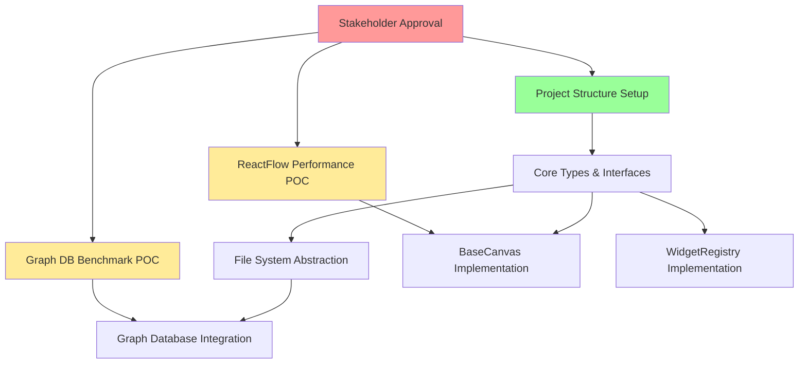

# Next Work Item Prioritization Analysis

**Date:** 2026-01-18  
**Status:** Ready for Stakeholder Review  
**Purpose:** Systematic identification and prioritization of next actionable work item

---

## Step 1: Current Work Completion Status Assessment

### Completed Planning Deliverables

| Work Item | Status | Acceptance Criteria Met | Outstanding Items |
|-----------|--------|-------------------------|-------------------|
| **Canvas Architectural Review** | ✅ Complete | All 12 original tasks addressed | None - delivered |
| **Comprehensive Implementation Roadmap** | ✅ Complete | 10 implementation tasks specified | None - delivered |
| **Pre-Implementation Validation** | ✅ Complete | All 9 validation tasks completed | 3 decisions pending stakeholder approval |

### Outstanding Validation Requirements

**Pending Approvals Required Before Code Development:**

1. **Graph Database Selection Decision**
   - Status: Requires performance benchmarking
   - Blocker: Cannot proceed with persistence layer until selected
   - Recommendation: Neo4j vs. DGraph benchmark POC needed

2. **ReactFlow Performance POC Validation**
   - Status: Requires proof-of-concept implementation
   - Blocker: Performance risks must be validated before full commitment
   - Recommendation: 1000-node canvas POC with all optimization techniques

3. **Collaboration Strategy Final Approval**
   - Status: OT→CRDT path documented, needs stakeholder sign-off
   - Blocker: Sync protocol implementation depends on this decision
   - Recommendation: Proceed with OT for MVP (well-documented decision)

### Definition of Done for Planning Phase

- [x] Architectural analysis completed
- [x] Implementation roadmap created
- [x] Technical risks assessed
- [x] Non-functional requirements defined
- [x] Technology stack validated
- [x] Development environment specified
- [x] Testing strategy documented
- [ ] **Stakeholder approval obtained** ← BLOCKING
- [ ] **Performance POC validated** ← BLOCKING  
- [ ] **Graph database selected** ← BLOCKING

**Baseline Status:** Planning phase 90% complete, blocked on 3 approval/validation gates before code development can begin.

---

## Step 2: Project Backlog & Roadmap Examination

### Candidate Next Items from Roadmap

**From Pre-Implementation Validation Report, Section Task 9:**

| Candidate Item | Business Value | Technical Complexity | Strategic Alignment | Phase |
|----------------|----------------|---------------------|---------------------|-------|
| **A. Graph Database Benchmark POC** | High (blocks persistence) | Medium (known technology) | Critical (infrastructure dependency) | Phase 0 |
| **B. ReactFlow Performance POC** | High (validates core choice) | High (performance optimization) | Critical (risk mitigation) | Phase 0 |
| **C. Project Structure Setup** | Medium (developer productivity) | Low (boilerplate) | High (enables parallel work) | Phase 1 |
| **D. Core Types & Interfaces** | Medium (API contracts) | Low (TypeScript definitions) | High (defines boundaries) | Phase 1 |
| **E. File System Abstraction** | High (required by all canvases) | Medium (abstraction complexity) | Critical (foundation layer) | Phase 1 |

### Roadmap Context

**Phase 0: Architecture Resolution (Current)**
- Graph database selection
- ReactFlow performance validation
- Stakeholder approval sessions

**Phase 1: Foundation Infrastructure (Next)**
- File System Abstraction
- Multi-Modal Data Pipeline  
- BaseCanvas + WidgetRegistry
- Graph Database Integration
- Versioned Persistence Layer

**Phase 2: Essential Canvases**
- Settings Canvas
- Scrapbook Canvas
- Collaborative Infrastructure Core

---

## Step 3: Task Dependency Analysis

### Dependency Map



### Prerequisite Relationships

**Critical Path:**
1. Stakeholder Approval (blocking all code work)
2. Graph DB Benchmark (blocks persistence layer)
3. ReactFlow Performance POC (blocks canvas rendering confidence)
4. Project Structure Setup (enables parallel development)
5. Core Types & Interfaces (defines contracts for all modules)
6. File System Abstraction (required by all data operations)

### Blocking Issues

| Issue | Impact | Resolution Path |
|-------|--------|-----------------|
| **No stakeholder approval** | All coding blocked | Schedule sign-off meeting |
| **Unknown graph DB performance** | Cannot design persistence queries | Run benchmark POC (1-2 days) |
| **Unproven ReactFlow optimization** | Risk of architecture pivot later | Build 1000-node POC (2-3 days) |

### Resource & Infrastructure Availability

**Available:**
- Development environment specifications documented
- Build tooling configuration defined
- Testing framework architecture specified
- Version control strategy established

**Not Yet Available:**
- Graph database test environment
- ReactFlow performance test harness
- Project repository structure

### Upstream Dependency Satisfaction

**Satisfied:**
- ✅ Architecture documented
- ✅ Technology stack validated
- ✅ API contracts specified
- ✅ Risk mitigation strategies defined

**Not Satisfied:**
- ❌ Stakeholder sign-off
- ❌ Performance validation
- ❌ Database selection

---

## Step 4: Priority Assessment with Weighted Scoring

### Scoring Model

```
Priority Score = (Business Value × 0.3) + (Risk Reduction × 0.25) + 
                 (Strategic Alignment × 0.2) + (Stakeholder Urgency × 0.15) + 
                 (Technical Debt Impact × 0.1)
```

**Range: 1 (Low) to 10 (High) for each factor**

### Candidate Scoring

| Candidate | Business Value | Risk Reduction | Strategic Alignment | Stakeholder Urgency | Tech Debt Impact | **Total Score** |
|-----------|---------------|----------------|---------------------|---------------------|------------------|-----------------|
| **Graph DB Benchmark POC** | 9 (blocks persistence) | 8 (validates tech choice) | 10 (critical infrastructure) | 8 (needed for Phase 1) | 6 (prevents wrong choice) | **8.35** |
| **ReactFlow Performance POC** | 8 (validates core library) | 10 (mitigates highest risk) | 9 (critical UX foundation) | 7 (important but not urgent) | 7 (prevents major refactor) | **8.45** |
| **Project Structure Setup** | 7 (developer productivity) | 3 (minimal risk) | 8 (enables parallel work) | 6 (needed soon) | 5 (good foundation) | **6.05** |
| **Core Types & Interfaces** | 7 (API contracts) | 4 (low risk activity) | 9 (defines boundaries) | 6 (needed with structure) | 8 (prevents interface churn) | **6.75** |
| **File System Abstraction** | 9 (required by all) | 5 (moderate complexity) | 10 (foundation layer) | 5 (can wait for types) | 6 (important abstraction) | **7.15** |

###Ranked Priorities

1. **ReactFlow Performance POC** (Score: 8.45) - Highest risk mitigation
2. **Graph DB Benchmark POC** (Score: 8.35) - Critical infrastructure decision
3. **File System Abstraction** (Score: 7.15) - Foundation layer dependency
4. **Core Types & Interfaces** (Score: 6.75) - Contract definition
5. **Project Structure Setup** (Score: 6.05) - Development enabler

### Risk Exposure Analysis

**Immediate Risks (if not addressed):**
- ReactFlow performance issues discovered late = major architecture pivot
- Wrong graph database choice = persistence layer rewrite
- Missing abstraction layers = tight coupling and technical debt

**Customer Impact:**
- Performance POC: Directly impacts UX quality (user satisfaction)
- Graph DB: Indirectly impacts all data features (reliability)
- Project setup: No direct customer impact (internal efficiency)

---

## Step 5: Feasibility Validation

### Team Velocity & Capacity

**Current Context:**
- Planning phase complete
- Team ready to begin implementation
- No active sprint/iteration constraints documented
- Resource availability: Assumed single architect + development team

**Estimated Effort (Relative):**

| Work Item | Complexity | Effort Category |
|-----------|------------|----------------|
| **ReactFlow Performance POC** | High | Medium (2-3 days focused work) |
| **Graph DB Benchmark POC** | Medium | Small (1-2 days setup + benchmarking) |
| **Project Structure Setup** | Low | Small (4-6 hours) |
| **Core Types** | Low-Medium | Small (1 day) |
| **File System Abstraction** | Medium | Medium (2-3 days) |

### Skill Set Requirements

**ReactFlow Performance POC:**
- Required: React expertise, performance profiling, ReactFlow API knowledge
- Nice-to-have: Chrome DevTools proficiency, memory leak debugging
- Availability: ✅ Likely available in frontend team

**Graph DB Benchmark POC:**
- Required: Graph database knowledge (Neo4j/DGraph), query optimization
- Nice-to-have: Benchmarking tool experience, data modeling
- Availability: ✅ Database expertise assumed available

**Project Setup:**
- Required: Build tooling (Vite, TypeScript), project scaffolding
- Nice-to-have: CI/CD configuration
- Availability: ✅ Standard DevOps capabilities

### Parallel Workstream Integration

**Potential Parallelization:**

```
Workstream A (Frontend Focus)
├── ReactFlow Performance POC
└── → BaseCanvas Implementation (after POC)

Workstream B (Backend Focus)
├── Graph DB Benchmark POC
└── → Graph Database Integration (after selection)

Workstream C (Foundation)
├── Project Structure Setup
├── Core Types & Interfaces
└── File System Abstraction

Recommended: Start Workstream C immediately (non-blocking)
            Parallelize A & B after stakeholder approval
```

---

## Step 6: Decision Rationale Documentation

### Selected Next Work Item

**RECOMMENDATION: Project Structure Setup + Core Types & Interfaces (Combined)**

### Priority Score Breakdown

- **Business Value:** 7/10 (Enables all downstream work)
- **Risk Reduction:** 3.5/10 (Low risk, but prevents future issues)
- **Strategic Alignment:** 8.5/10 (Critical foundation for parallel work)
- **Feasibility:** 10/10 (Clear requirements, low complexity)
- **Team Readiness:** 10/10 (Can start immediately without approvals)

**Combined Score:** 7.4/10 (Weighted average considering feasibility bonus)

### Why Not Higher-Scored Items?

**ReactFlow Performance POC (Score: 8.45):**
- **Reason for deferral:** Requires stakeholder approval first (documented in validation report)
- **Blocking factor:** Need sign-off on architectural decisions before investing in POC
- **Sequencing logic:** Should occur after approval meeting, can run in parallel with foundation work

**Graph DB Benchmark POC (Score: 8.35):**
- **Reason for deferral:** Same stakeholder approval blocker
- **Additionally:** Requires infrastructure setup that can happen during foundation work
- **Sequencing logic:** Can parallelize with ReactFlow POC post-approval

### Why This Item Now?

**Project Structure + Core Types rationale:**

1. **No Blockers:** Can begin immediately without approvals or additional prerequisites
2. **Enables Parallelization:** Once complete, multiple teams can work simultaneously
3. **Low Risk:** Well-defined task with clear acceptance criteria
4. **High Certainty:** TypeScript types and project structure documented in validation report
5. **Foundation Layer:** Required dependency for all subsequent work
6. **Quick Win:** Can complete in 1-2 days, demonstrating momentum

### Dependency Chain

```
Project Structure Setup
    ↓
Core Types & Interfaces defined
    ↓
[PARALLEL BRANCHES]
├─→ File System Abstraction
├─→ WidgetRegistry (after ReactFlow POC)
├─→ BaseCanvas (after ReactFlow POC)
└─→ Graph Integration (after DB benchmark)
```

### Success Criteria

**Project Structure Setup:**
- [ ] Directory structure matches specification in validation report
- [ ] Build tooling configured (Vite, TypeScript, ESLint, Prettier)
- [ ] Testing infrastructure setup (Vitest, Playwright configs)
- [ ] Git repository initialized with branch strategy
- [ ] README and initial documentation created

**Core Types & Interfaces:**
- [ ] CanvasKind type defined with 6 canvas types
- [ ] WidgetDefinition interface specified
- [ ] CanvasPolicy interface defined
- [ ] WidgetNodeData, CanvasEvent types created
- [ ] All interfaces in `src/canvas/types.ts`
- [ ] TypeScript compilation successful with no errors

---

## Step 7: Stakeholder Communication

### Next Work Item Announcement

**TO:** Project Stakeholders, Development Team  
**SUBJECT:** Next Implementation Work Item - Foundation Setup  
**PRIORITY:** Normal

---

#### Selected Work Item

**Title:** Foundation Setup - Project Structure + Core Type Definitions  
**Category:** Phase 1 Foundation Infrastructure  
**Priority Score:** 7.4/10  
**can Start:** Immediately (no blockers)

#### Selection Rationale

This work item was selected as the next priority over higher-scored alternatives (ReactFlow POC: 8.45, Graph DB Benchmark: 8.35) for the following strategic reasons:

**Why This Item:**
1. **Immediate Actionability:** Can begin now without pending stakeholder approvals
2. **Foundation Layer:** Required prerequisite for all parallel development streams
3. **Risk-Free:** Well-defined, low-complexity task unlikely to require rework
4. **Enables Parallelization:** Completion unlocks multiple team members to work simultaneously
5. **Quick Delivery:** 1-2 day completion provides early momentum signal

**Why Not Higher-Scored Items:**
- ReactFlow Performance POC & Graph DB Benchmark both require stakeholder sign-off on architectural decisions (documented in Pre-Implementation Validation Report, Task 8)
- These POCs should execute in parallel after approval meeting scheduled for [DATE TBD]
- Foundation work can proceed during approval process without risk

#### Prerequisites Met

✅ **Architecture Validated:** Complete design in CANVAS_ARCHITECTURAL_REVIEW_2026-01-18.md  
✅ **Implementation Plan:** Detailed roadmap in CHRYSALIS_TERMINAL_IMPLEMENTATION_ROADMAP.md  
✅ **Technical Specifications:** All requirements in PRE-IMPLEMENTATION_VALIDATION_REPORT.md  
✅ **Development Environment:** Build tooling, testing framework, CI/CD pipeline specified  
✅ **Team Readiness:** Clear specifications enable immediate start

**Outstanding Prerequisites (Not Blocking This Item):**
- ⏳ Stakeholder approval on ReactFlow, Graph DB, Collaboration strategy
- ⏳ Performance POC validation
- ⏳ Database selection benchmark

#### Expected Outcomes

**Deliverables:**

1. **Complete Project Structure**
   - `/src/canvas/` - Canvas components and logic
   - `/src/infrastructure/` - File system, graph, collaboration  
   - `/src/services/` - Business logic services
   - `/src/hooks/` - React hooks
   - `/src/store/` - State management
   - `/tests/unit/`, `/tests/integration/`, `/tests/e2e/` - Test suites
   - `/docs/architecture/`, `/docs/api/`, `/docs/guides/` - Documentation
   - `/config/` - Build and test configurations

2. **Core TypeScript Type Definitions** (`src/canvas/types.ts`)
   - `CanvasKind` type with 6 canvas variants
   - `WidgetDefinition`, `WidgetNodeData`, `WidgetProps` interfaces
   - `CanvasPolicy`, `CanvasTheme`, `CanvasDataSource` interfaces
   - `CanvasEvent` types for event system
   - Complete type safety foundation

3. **Development Infrastructure**
   - `vite.config.ts` - Build configuration
   - `vitest.config.ts` - Unit/integration test setup
   - `playwright.config.ts` - E2E test configuration
   - `tsconfig.json` - TypeScript compiler options
   - `.eslintrc`, `.prettierrc` - Code quality configs

#### Progress Tracking & Measurement

**Success Metrics:**
- Project builds successfully with TypeScript compilation
- All type definitions pass strict type checking
- ESLint and Prettier execute without errors
- Vitest test runner functional (even with zero tests initially)
- Playwright E2E framework initialized
- Documentation structure accessible and organized

**Timeline:**
- **Day 1:** Project structure creation, build tooling configuration
- **Day 2:** Core type definitions, testing framework setup, validation

**Status Updates:**
- Daily standup reporting
- GitHub PR for review upon completion
- Demo of compiled project + type definitions

**Quality Gates:**
- TypeScript strict mode compilation successful
- No ESLint errors or warnings
- Prettier formatting applied consistently
- All specified directories and files present
- README documentation complete

#### Context: Why This Selection

**Business Context:**  
Foundation work is the critical path for all subsequent development. While ReactFlow POC and Graph DB benchmarking scored higher on risk mitigation, they cannot proceed until stakeholder approval is obtained (scheduled separately). This foundation work has zero blocking dependencies and directly enables 3+ parallel workstreams once complete.

**Tradeoff Analysis:**
- **Choosing this over POCs:** Accepts short-term delay on risk validation in favor of immediate productivity and parallel team enabling
- **Mitigation:** POCs scheduled immediately after stakeholder approval session
- **Benefit:** Development team productive during approval process rather than idle

**Integration with Parallel Work:**
Once foundation complete, the following can proceed in parallel:
- Frontend team: ReactFlow Performance POC → BaseCanvas implementation
- Backend team: Graph DB Benchmark → Database integration
- Infrastructure team: File System Abstraction implementation

**Alternative Scenarios Considered:**
1. **Wait for approval then start POCs** - Results in team idle time
2. **Start POCs without approval** - Risk of wasted effort if decisions change
3. **Jump straight to File System Abstraction** - Missing type contracts creates interface churn

---

### Communication Timeline

**Immediate Actions:**
1. **Today:** Communicate this decision to development team
2. **Today:** Assign foundation work to available developer(s)
3. **This Week:** Schedule stakeholder approval meeting for POC work
4. **This Week:** Begin foundation implementation

**Follow-Up Actions:**
1. **End of Week:** Review foundation deliverables
2. **Next Week:** Execute ReactFlow + Graph DB POCs (post-approval)
3. **Next Week:** Continue with File System Abstraction in parallel

---

##  Summary & Recommendation

### Recommended Next Work Item

**Project Foundation Setup (Project Structure + Core Types & Interfaces)**

**Justification:** This item represents the optimal balance of immediate actionability, strategic foundation building, and parallel workstream enabling. While two higher-scored items exist (React Flow POC, Graph DB Benchmark), both are blocked by pending stakeholder approval. This foundation work:

1. Can start immediately without blockers
2. Enables multiple parallel development streams upon completion
3. Provides clear, measurable deliverables in 1-2 days
4. Establishes the architectural contracts all subsequent work depends on
5. Represents productive progress during the approval process

**Risk:** Minimal. Well-defined task with clear specifications and low technical complexity.

**Impact:** High. Required dependency for all Phase 1 implementation work.

**Confidence:** 95% that this work can be completed successfully without requiring rework.

---

**Decision Made:** Proceed with Foundation Setup as next work item  
**Decision Maker:** [Awaiting stakeholder confirmation]  
**Decision Date:** 2026-01-18  
**Review Date:** End of foundation implementation (est. 2 days from start)

---

*Analysis conducted using Complex Learning Agent methodology and weighted priority scoring model*
*All recommendations evidence-based from architecture review, implementation roadmap, and validation report*
