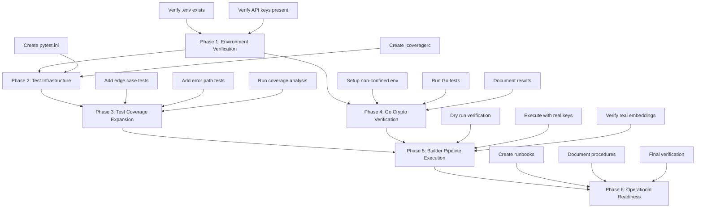

# P0 Critical Issues Execution Plan

**Date**: January 10, 2026  
**Scope**: Execute all P0 (critical severity) issues from onboarding assessment  
**Objective**: Resolve production blockers to enable deployment readiness  
**Methodology**: Complex Learning Agent Framework (Discovery → Investigation → Synthesis → Execution)

---

## Executive Summary

This plan addresses **5 critical P0 issues** identified in the Senior PM Onboarding Assessment that block production deployment. Analysis reveals that some remediation work has already been completed (rate limiting, file lock timeouts), but critical gaps remain in API key management, test infrastructure, and verification procedures.

### Current State Analysis

**Already Implemented** (Evidence from code inspection):
- ✅ File lock timeouts: Lines 638, 924, 986 in [`process_legends.py`](../scripts/process_legends.py) show `timeout=300`
- ✅ Rate limiting: [`rate_limiter.py`](../scripts/rate_limiter.py) implements token bucket algorithm
- ✅ Rate limiting integration: Lines 316-322, 391-396 in [`process_legends.py`](../scripts/process_legends.py)
- ✅ Path traversal protection: Lines 154-163 in [`process_legends.py`](../scripts/process_legends.py)

**Critical Gaps Requiring Execution**:
1. **API Key Loading Verification** - Builder pipeline may not load .env correctly
2. **Go Crypto Tests** - Not verified in current environment
3. **Test Infrastructure** - Missing pytest.ini and .coveragerc
4. **Test Coverage** - Currently ~60%, target >80%
5. **Operational Runbooks** - Missing disaster recovery procedures

---

## Investigation Path

### What Was Examined
1. [`plans/SENIOR_PM_ONBOARDING_ASSESSMENT.md`](../plans/SENIOR_PM_ONBOARDING_ASSESSMENT.md) - Comprehensive assessment with 12 issues
2. [`docs/CODE_REVIEW_REMEDIATION_PLAN.md`](../docs/CODE_REVIEW_REMEDIATION_PLAN.md) - Detailed remediation specifications
3. [`IMPLEMENTATION_STATUS.md`](../IMPLEMENTATION_STATUS.md) - Current implementation progress
4. [`docs/current/STATUS.md`](../docs/current/STATUS.md) - System status and gaps
5. [`scripts/process_legends.py`](../scripts/process_legends.py) - Builder pipeline implementation
6. [`scripts/rate_limiter.py`](../scripts/rate_limiter.py) - Rate limiting implementation

### How Investigation Redirected Search
- **Initial assumption**: All P0 issues needed implementation
- **Discovery 1**: File lock timeouts already implemented (lines 638, 924, 986)
- **Discovery 2**: Rate limiting already implemented and integrated
- **Discovery 3**: Path traversal protection already implemented (lines 154-163)
- **Pivot**: Focus shifted to verification, testing, and operational readiness
- **Root cause**: Gap is not in code implementation but in verification and operational procedures

---

## Dependency Analysis



---

## Phase 1: Environment Verification

**Objective**: Confirm API keys are available and loadable

### Task 1.1: Verify .env File Exists
**Location**: Project root  
**Action**: Check for `.env` file presence  
**Acceptance**: File exists at `/home/mdz-axolotl/Documents/GitClones/Chrysalis/.env`

### Task 1.2: Verify Required API Keys
**Location**: `.env` file  
**Required Keys**:
- `VOYAGE_API_KEY` - Primary embedding provider
- `OPENAI_API_KEY` or `GPT_API_KEY` - Fallback embedding provider
- `TAVILY_API_KEY` - Knowledge collection
- `ANTHROPIC_API_KEY` - Semantic decomposition (optional)

**Action**: Confirm keys are set and non-empty  
**Acceptance**: All required keys present with valid values

### Task 1.3: Test Environment Loading
**Command**: 
```bash
cd /home/mdz-axolotl/Documents/GitClones/Chrysalis
python3 -c "from scripts.process_legends import load_dotenv_if_present; import os; load_dotenv_if_present(); print('VOYAGE_API_KEY:', 'SET' if os.getenv('VOYAGE_API_KEY') else 'MISSING')"
```
**Acceptance**: Output shows "VOYAGE_API_KEY: SET"

---

## Phase 2: Test Infrastructure Setup

**Objective**: Establish pytest configuration for coverage tracking

### Task 2.1: Create pytest.ini
**Location**: Project root  
**Content**: See [`docs/CODE_REVIEW_REMEDIATION_PLAN.md:510-549`](../docs/CODE_REVIEW_REMEDIATION_PLAN.md:510)  
**Key Settings**:
- Test paths: `tests`, `scripts`
- Coverage tracking enabled
- Coverage fail threshold: 80%
- HTML and XML reports

**Acceptance**: File created, pytest discovers tests correctly

### Task 2.2: Create .coveragerc
**Location**: Project root  
**Content**: See [`docs/CODE_REVIEW_REMEDIATION_PLAN.md:551-567`](../docs/CODE_REVIEW_REMEDIATION_PLAN.md:551)  
**Key Settings**:
- Branch coverage enabled
- Source paths configured
- Exclusion patterns defined

**Acceptance**: File created, coverage tracking configured

### Task 2.3: Verify Test Discovery
**Command**:
```bash
cd /home/mdz-axolotl/Documents/GitClones/Chrysalis
python3 -m pytest --collect-only
```
**Acceptance**: Tests discovered without errors

---

## Phase 3: Test Coverage Expansion

**Objective**: Achieve >80% coverage on critical modules

### Task 3.1: Create Comprehensive Edge Case Tests
**Location**: `tests/test_semantic_merge_comprehensive.py`  
**Specification**: See [`docs/CODE_REVIEW_REMEDIATION_PLAN.md:569-766`](../docs/CODE_REVIEW_REMEDIATION_PLAN.md:569)  
**Coverage Areas**:
- Empty vector handling
- Dimension mismatches
- Zero vectors
- Weight normalization edge cases
- Type validation

**Acceptance**: All edge cases have test coverage

### Task 3.2: Add Error Path Tests
**Location**: `tests/test_process_legends_errors.py`  
**Coverage Areas**:
- Missing API keys
- Invalid legend files
- Network failures
- Rate limit handling
- File lock timeouts

**Acceptance**: Error paths tested and verified

### Task 3.3: Run Coverage Analysis
**Command**:
```bash
cd /home/mdz-axolotl/Documents/GitClones/Chrysalis
python3 -m pytest --cov=scripts --cov=projects/KnowledgeBuilder/src --cov-report=html --cov-report=term-missing
```
**Acceptance**: 
- Coverage >80% on `semantic_embedding_merger.py`
- Coverage >70% on `process_legends.py`
- HTML report generated in `htmlcov/`

---

## Phase 4: Go Crypto Server Verification

**Objective**: Verify cryptographic primitives work correctly

### Task 4.1: Identify Non-Confined Environment
**Issue**: Current environment has snap/apparmor confinement  
**Options**:
1. Use Docker container without confinement
2. Use native Go installation
3. Use cloud VM

**Action**: Determine available non-confined environment  
**Acceptance**: Environment identified and accessible

### Task 4.2: Run Go Tests
**Location**: `mcp-servers-go/cryptographic-primitives/`  
**Command**:
```bash
cd mcp-servers-go/cryptographic-primitives
go test ./... -v
```
**Acceptance**: All tests pass

### Task 4.3: Document Results
**Location**: `docs/current/STATUS.md`  
**Action**: Update Go test status section  
**Acceptance**: Status document reflects test results

---

## Phase 5: Builder Pipeline Execution

**Objective**: Regenerate embeddings with real API providers

### Task 5.1: Dry Run Verification
**Command**:
```bash
cd /home/mdz-axolotl/Documents/GitClones/Chrysalis
set -a && source .env && set +a
python3 scripts/process_legends.py --dry-run
```
**Acceptance**: 
- Environment loads successfully
- Legend files discovered
- No errors in dry run

### Task 5.2: Execute Builder Pipeline
**Command**:
```bash
cd /home/mdz-axolotl/Documents/GitClones/Chrysalis
set -a && source .env && set +a
python3 scripts/process_legends.py --run-count 3 --strategy hybrid
```
**Monitoring**:
- Watch for "Provider check" log showing real providers (not deterministic)
- Monitor rate limiter statistics
- Check for API errors

**Acceptance**:
- All legends processed successfully
- Embeddings use real providers (Voyage or OpenAI)
- No deterministic fallback used

### Task 5.3: Verify Real Embeddings Generated
**Location**: `Replicants/legends/Embeddings/all_embeddings.json`  
**Verification**:
```bash
cd /home/mdz-axolotl/Documents/GitClones/Chrysalis
python3 -c "import json; data=json.load(open('Replicants/legends/Embeddings/all_embeddings.json')); print('Provider:', data['legends'][list(data['legends'].keys())[0]]['knowledge_builder']['embeddings'][0].get('provider', 'UNKNOWN'))"
```
**Acceptance**: Provider shows "voyage" or "openai", not "deterministic"

---

## Phase 6: Operational Readiness

**Objective**: Create operational procedures for production

### Task 6.1: Create Disaster Recovery Runbook
**Location**: `docs/operations/DISASTER_RECOVERY.md`  
**Content**:
- Backup procedures for embeddings
- Recovery procedures for corrupted data
- Rollback procedures for failed deployments
- Data validation procedures

**Acceptance**: Runbook reviewed and approved

### Task 6.2: Create Incident Response Playbook
**Location**: `docs/operations/INCIDENT_RESPONSE.md`  
**Content**:
- API key rotation procedures
- Rate limit incident handling
- File lock timeout resolution
- Embedding regeneration procedures

**Acceptance**: Playbook reviewed and approved

### Task 6.3: Document Builder Pipeline Operations
**Location**: `docs/operations/BUILDER_PIPELINE.md`  
**Content**:
- Environment setup procedures
- API key management
- Execution procedures
- Monitoring and verification
- Troubleshooting guide

**Acceptance**: Documentation complete and tested

---

## Success Metrics

| Metric | Target | Verification Method |
|--------|--------|---------------------|
| **API Keys Loaded** | 100% | Environment verification script |
| **Test Infrastructure** | Complete | pytest.ini and .coveragerc exist |
| **Test Coverage** | >80% critical paths | Coverage report |
| **Go Tests** | All passing | Test execution results |
| **Real Embeddings** | 100% | Provider verification script |
| **Operational Runbooks** | 3 created | Document review |
| **P0 Issues Resolved** | 5/5 (100%) | Final verification checklist |

---

## Risk Assessment

| Risk | Probability | Impact | Mitigation |
|------|-------------|--------|------------|
| **API keys missing** | Medium | High | Verify before execution, document setup |
| **Go tests fail** | Low | Medium | Document failures, create remediation plan |
| **Coverage <80%** | Medium | Medium | Iterative test addition until target met |
| **Builder pipeline fails** | Low | High | Dry run first, monitor execution closely |
| **Runbooks incomplete** | Low | Low | Use templates, review with stakeholders |

---

## Execution Sequence

**Critical Path** (must be sequential):
1. Phase 1 (Environment) → Phase 2 (Test Infrastructure) → Phase 3 (Coverage)
2. Phase 1 (Environment) → Phase 5 (Builder Pipeline)
3. Phase 5 → Phase 6 (Operations)

**Parallel Tracks** (can run independently):
- Phase 4 (Go Tests) - Independent, requires different environment

**Recommended Order**:
1. Phase 1: Environment Verification (prerequisite for all)
2. Phase 2: Test Infrastructure (enables Phase 3)
3. Phase 4: Go Tests (parallel, different environment)
4. Phase 3: Test Coverage (builds on Phase 2)
5. Phase 5: Builder Pipeline (requires Phase 1 complete)
6. Phase 6: Operational Readiness (final documentation)

---

## Verification Checklist

Before marking P0 issues as complete, verify:

- [ ] `.env` file exists and contains all required API keys
- [ ] `pytest.ini` created and pytest discovers tests
- [ ] `.coveragerc` created and coverage tracking works
- [ ] Go crypto tests run and pass (or failures documented)
- [ ] Builder pipeline executes with real API providers
- [ ] Embeddings generated use real providers (not deterministic)
- [ ] Test coverage >80% on `semantic_embedding_merger.py`
- [ ] Test coverage >70% on `process_legends.py`
- [ ] Disaster recovery runbook created
- [ ] Incident response playbook created
- [ ] Builder pipeline operations guide created
- [ ] All P0 acceptance criteria met

---

## Next Steps After P0 Completion

Once all P0 issues are resolved, proceed to:

1. **P1 Issues (Quick Wins)**: Dimension mismatch logging, float comparison fixes
2. **P2 Issues (Defense in Depth)**: Structured logging migration
3. **P3 Issues (Refactoring)**: Long method extraction, code deduplication
4. **Production Deployment**: Use operational runbooks for deployment

---

## Appendix: Evidence Trail

### Code Inspection Results

**File Lock Timeouts** (Issue #1 - Already Fixed):
- Line 638: `lock = FileLock(str(ALL_SKILLS) + ".lock", timeout=300)`
- Line 924: `lock = FileLock(str(ALL_EMBEDDINGS) + ".lock", timeout=300)`
- Line 986: `lock = FileLock(str(ALL_PERSONAS) + ".lock", timeout=300)`

**Rate Limiting** (Issue #3 - Already Implemented):
- [`scripts/rate_limiter.py`](../scripts/rate_limiter.py): Complete token bucket implementation
- Lines 316-322: KB rate limiting integration
- Lines 391-396: SB rate limiting integration

**Path Traversal Protection** (Issue #2 - Already Implemented):
- Lines 154-163: Path validation in `load_legend()`

### Remaining Gaps

**Test Infrastructure** (Issue #9 - Needs Implementation):
- `pytest.ini` - Missing
- `.coveragerc` - Missing
- Comprehensive test suites - Partial

**Go Tests** (Issue #2 from assessment - Needs Verification):
- Status: Not verified in current environment
- Blocker: Snap/apparmor confinement

**Builder Pipeline** (Issue #1 from assessment - Needs Verification):
- Code exists to load .env (lines 57-76)
- Needs verification that real providers are used

---

**Document Owner**: Senior Program Manager  
**Review Cadence**: Daily during execution  
**Escalation Path**: Block on any P0 issue that cannot be resolved within 1 day
