# P2 Code Quality Refactoring Plan

**Document Version:** 1.0  
**Created:** January 11, 2026  
**Status:** Ready for Review  
**Scope:** Fresh comprehensive audit + remaining P2-P4 items from CODE_QUALITY_REVIEW.md

---

## Executive Summary

This plan addresses P2 code quality issues in the Chrysalis codebase through systematic elimination of code smells, including long method decomposition and feature envy resolution, along with value-stream analysis to identify non-essential features.

### Investigation Findings

**Already Completed (Prior Remediation):**
- ✅ usa-adapter.ts `toCanonical()` decomposed into 16+ focused methods
- ✅ lmos-adapter.ts `toCanonical()` decomposed into 12+ focused methods  
- ✅ base-adapter.ts helper methods added: `addQuadWithTracking`, `addOptionalLiteral`, `restoreExtension`, etc.
- ✅ WalletIntegratedLLMService feature envy resolved via KeyProvider DI
- ✅ adaptation-pipeline.ts `executePipelineStages` decomposed
- ✅ Input validation guards added to Orchestrator

**Remaining Issues Identified:**

| Issue | Location | Severity | Priority |
|-------|----------|----------|----------|
| Feature envy in `getAgent()` | [`src/bridge/orchestrator.ts:865-896`](src/bridge/orchestrator.ts:865) | Medium | P2 |
| Missing `createTypedNode` helper | [`src/adapters/base-adapter.ts`](src/adapters/base-adapter.ts) | Low | P2 |
| Loose `NativeAgent` type | [`src/adapters/base-adapter.ts:52`](src/adapters/base-adapter.ts:52) | Medium | P2 |
| TemporalRDFStore mixed responsibilities | [`src/rdf/temporal-store.ts`](src/rdf/temporal-store.ts) | Medium | P3 |
| Missing branded types | RDF types | Low | P4 |

---

## Phase 1: Feature Envy Resolution

### 1.1 Orchestrator.getAgent() Feature Envy

**Current Issue (lines 865-896):**
```typescript
async getAgent(...): Promise<NativeAgent | CanonicalAgent | null> {
  const snapshot = await this.store.getSnapshot(agentId, options);
  if (!snapshot) return null;

  // Feature Envy: Building canonical from snapshot internals
  const canonical: CanonicalAgent = {
    uri: `https://chrysalis.dev/agent/${agentId}`,
    quads: snapshot.quads,
    sourceFramework: (snapshot.sourceFormat as AgentFramework) || 'usa',
    extensions: [],
    metadata: {...}
  };
  ...
}
```

**Refactoring Approach:**
1. Add `snapshotToCanonical()` method to TemporalRDFStore
2. Update `getAgent()` to delegate to store method
3. Maintain backward compatibility

**Target Implementation:**
```typescript
// In TemporalRDFStore
snapshotToCanonical(snapshot: AgentSnapshot, agentId: string): CanonicalAgent {
  return {
    uri: `https://chrysalis.dev/agent/${agentId}`,
    quads: snapshot.quads,
    sourceFramework: (snapshot.sourceFormat as AgentFramework) || 'usa',
    extensions: [],
    metadata: {
      fidelityScore: snapshot.fidelityScore || 1.0,
      mappedFields: [],
      unmappedFields: [],
      lostFields: [],
      warnings: [],
      timestamp: snapshot.validFrom,
      durationMs: 0,
      adapterVersion: '1.0.0'
    }
  };
}

// In Orchestrator
async getAgent(...): Promise<NativeAgent | CanonicalAgent | null> {
  const snapshot = await this.store.getSnapshot(agentId, options);
  if (!snapshot) return null;
  
  const canonical = this.store.snapshotToCanonical(snapshot, agentId);
  
  if (!targetFramework) return canonical;
  return this.fromCanonical(canonical, targetFramework);
}
```

---

## Phase 2: Type Safety Improvements

### 2.1 Generic NativeAgent Interface

**Current:**
```typescript
export interface NativeAgent {
  data: Record<string, unknown>;  // Too loose
  framework: AgentFramework;
}
```

**Target:**
```typescript
export interface NativeAgent<TData extends Record<string, unknown> = Record<string, unknown>> {
  data: TData;
  framework: AgentFramework;
}

// Type guards
export function isUSAAgent(agent: NativeAgent): agent is NativeAgent<USAAgent> {
  return agent.framework === 'usa';
}

export function isLMOSAgent(agent: NativeAgent): agent is NativeAgent<LMOSAgent> {
  return agent.framework === 'lmos';
}
```

### 2.2 Add createTypedNode Helper

**Add to base-adapter.ts:**
```typescript
protected createTypedNode(
  quads: Quad[],
  parent: Subject,
  linkPredicate: NamedNode,
  typeUri: NamedNode,
  prefix: string
): BlankNode {
  const node = this.blank(this.generateBlankId(prefix));
  quads.push(this.quad(parent, linkPredicate, node));
  quads.push(this.quad(node, rdf('type'), typeUri));
  return node;
}
```

---

## Phase 3: TemporalRDFStore Responsibility Split (P3)

**Current Responsibilities (7 mixed concerns):**
1. RDF term factory
2. Quad storage
3. Temporal versioning
4. Query execution
5. Index management
6. Agent discovery
7. N-Triples serialization

**Target Module Structure:**
```
src/rdf/
├── data-factory.ts      # Term creation utilities
├── temporal-store.ts    # Core storage + versioning
├── query-engine.ts      # Query execution
├── serializers.ts       # Format conversion (N-Triples, etc.)
└── index.ts             # Re-exports
```

**Migration Strategy:**
1. Extract DataFactory class to separate file
2. Extract serialization functions
3. Extract query methods to QueryEngine class
4. Update imports across codebase
5. Maintain backward-compatible re-exports

---

## Phase 4: Audit TypeScript Codebase

### 4.1 Files to Audit for Long Methods (>100 lines)

Based on file sizes from CODE_QUALITY_REVIEW.md:

| File | Lines | Status |
|------|-------|--------|
| `src/rdf/temporal-store.ts` | 1,212 | Needs audit |
| `src/bridge/service-integration.ts` | 1,115 | Needs audit |
| `src/mcp-server/mcp-server.ts` | ~900 | Needs audit |
| `src/sync/CRDTState.ts` | ~800 | Needs audit |
| `src/services/llm/AgentLLMClient.ts` | ~450 | Needs audit |

### 4.2 Audit Criteria

- ESLint threshold: 100 lines per function
- Cyclomatic complexity: 15 max
- Max nesting depth: 4 levels
- Max parameters: 5

---

## Phase 5: Audit Python Codebase

### 5.1 Files to Audit

| File | Purpose | Status |
|------|---------|--------|
| `memory_system/chrysalis_memory.py` | Memory store | Needs audit |
| `memory_system/byzantine.py` | Byzantine consensus | Needs audit |
| `memory_system/gossip.py` | Gossip protocol | Needs audit |
| `memory_system/semantic/decomposer.py` | Semantic decomposition | Needs audit |

### 5.2 Python Audit Criteria

- Max function length: 50 lines (PEP 8 guideline)
- Cyclomatic complexity: 10 max
- Type hints coverage: 100% public APIs

---

## Phase 6: Value-Stream Analysis

### 6.1 Directories to Analyze

| Directory | Purpose | Core Use Case Alignment |
|-----------|---------|------------------------|
| `src/demo/` | Demo implementations | Low - historical |
| `projects/` | Example projects | Medium - educational |
| `examples/` | Usage examples | Medium - documentation |
| `src/voice/` | Voice integration | Unknown - verify usage |
| `src/terminal/` | Terminal connectors | Unknown - verify usage |

### 6.2 Feature Assessment Criteria

**Keep if:**
- Directly supports core capabilities from README.md
- Has test coverage >70%
- Used by other modules
- Part of documented API

**Deprecation Candidate if:**
- No test coverage
- No imports from other modules
- Not documented in README.md or docs/
- Duplicate functionality

### 6.3 Core Use Cases (from README.md)

1. Lossless Morphing - Agent transformation
2. Distributed Memory - Persistent memory with deduplication
3. Experience Synchronization - Learning from instances
4. Cryptographic Identity - Tamper-evident identity

---

## Implementation Workflow

```mermaid
flowchart TB
    subgraph Phase1[Phase 1: Feature Envy]
        FE1[Add snapshotToCanonical to Store]
        FE2[Update Orchestrator.getAgent]
        FE3[Add unit tests]
    end
    
    subgraph Phase2[Phase 2: Type Safety]
        TS1[Add generic NativeAgent]
        TS2[Create type guards]
        TS3[Add createTypedNode helper]
        TS4[Update adapter usage]
    end
    
    subgraph Phase3[Phase 3: Store Split]
        SS1[Extract DataFactory]
        SS2[Extract Serializers]
        SS3[Extract QueryEngine]
        SS4[Update imports]
    end
    
    subgraph Phase4[Phase 4: TS Audit]
        TA1[Audit temporal-store]
        TA2[Audit service-integration]
        TA3[Decompose long methods]
    end
    
    subgraph Phase5[Phase 5: Python Audit]
        PA1[Audit memory_system]
        PA2[Identify long methods]
        PA3[Refactor as needed]
    end
    
    subgraph Phase6[Phase 6: Value Stream]
        VS1[Analyze directories]
        VS2[Document deprecation candidates]
        VS3[Implement staged deprecation]
    end
    
    subgraph Validation[Validation]
        V1[Run ESLint]
        V2[Execute test suite]
        V3[Update documentation]
    end
    
    Phase1 --> Phase2
    Phase2 --> Phase3
    Phase3 --> Phase4
    Phase4 --> Phase5
    Phase5 --> Phase6
    Phase6 --> Validation
```



---

## Risk Assessment

| Risk | Impact | Mitigation |
|------|--------|------------|
| Breaking changes in NativeAgent generic | High | Maintain default type parameter |
| Store split affects imports | Medium | Use re-exports for backward compatibility |
| Feature removal breaks users | High | Staged deprecation with warnings |

---

## Success Criteria

1. **No methods >100 lines** in core modules
2. **Feature envy eliminated** from Orchestrator
3. **Type safety improved** with generic NativeAgent
4. **TemporalRDFStore** split into focused modules
5. **All tests passing** after refactoring
6. **ESLint clean** with configured rules

---

## Files to Create/Modify

### New Files
- `src/rdf/data-factory.ts`
- `src/rdf/query-engine.ts`
- `src/rdf/serializers.ts`

### Modified Files
- `src/bridge/orchestrator.ts` - Feature envy fix
- `src/rdf/temporal-store.ts` - Add snapshotToCanonical, reduce responsibilities
- `src/adapters/base-adapter.ts` - Add createTypedNode, generic types

---

*Plan Created: January 11, 2026*
*Status: Ready for User Review*