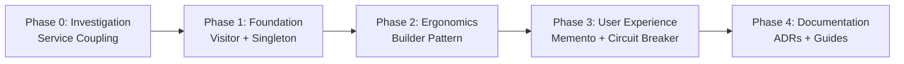
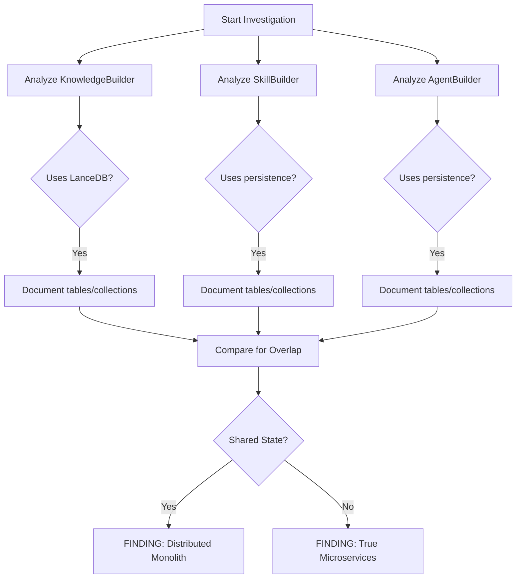
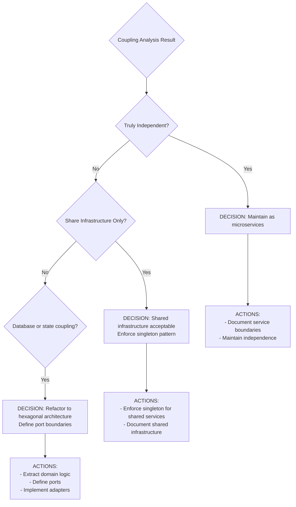
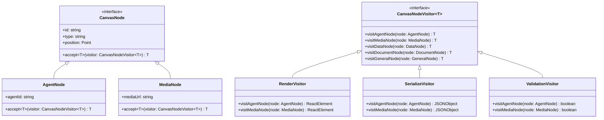
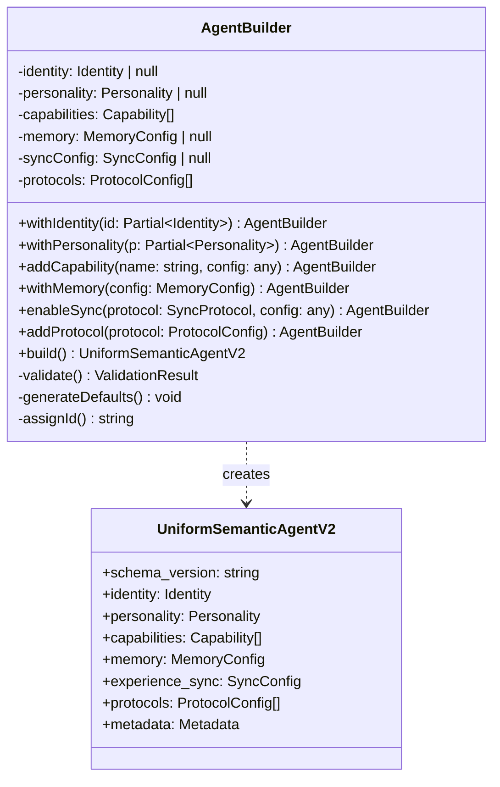
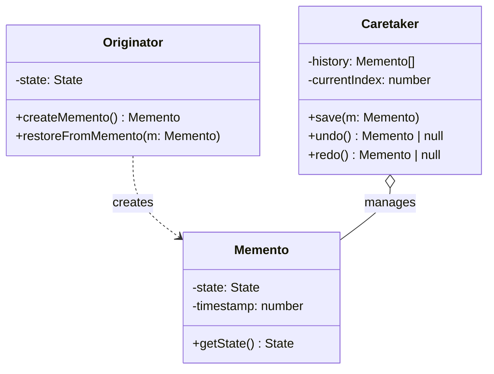
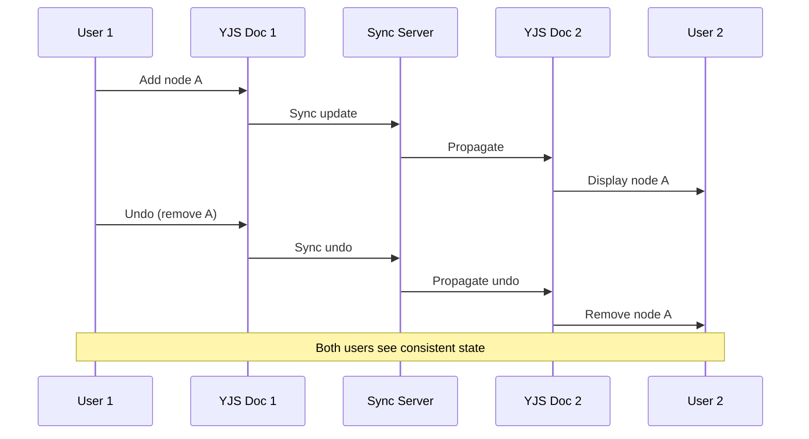
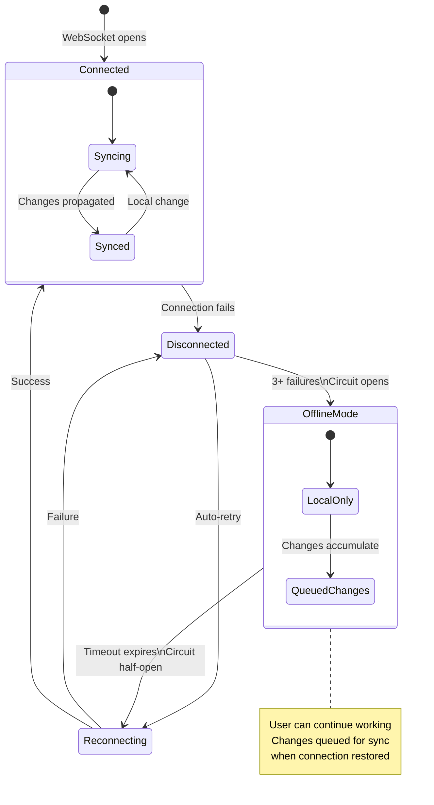
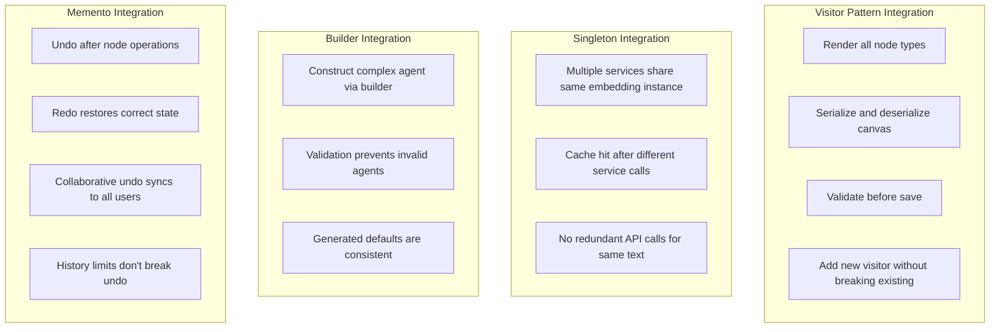

# Chrysalis Design Pattern Implementation Plan

**Version**: 1.0.0  
**Based On**: [`docs/DESIGN_PATTERN_ANALYSIS.md`](../docs/DESIGN_PATTERN_ANALYSIS.md) v2.0.0  
**Status**: Ready for Implementation

---

## Implementation Overview

This plan implements pattern enhancements identified in the comprehensive design pattern analysis, focusing on evidence-based priorities that improve extensibility, consistency, and user experience.

### Implementation Phases



### Success Criteria

| Phase | Completion Criteria | Pattern Fidelity Target |
|-------|---------------------|-------------------------|
| Phase 0 | ADR documenting service coupling published | - |
| Phase 1 | Visitor pattern operational, Singleton enforced | 4.5/5.0 average |
| Phase 2 | AgentBuilder fluent API with examples | 4.2/5.0 average |
| Phase 3 | Undo/redo functional, offline mode graceful | 4.3/5.0 average |
| Phase 4 | All patterns documented with ADRs | 4.5/5.0 average |

---

## Phase 0: Service Layer Coupling Investigation

### Objective

Determine whether KnowledgeBuilder, SkillBuilder, and AgentBuilder are truly independent microservices or coupled components of a distributed monolith.

### Investigation Tasks

#### Task P0-1: Map Data Dependencies

**Scope**: Analyze database and file access patterns



**Actions**:
1. Examine `projects/KnowledgeBuilder/src/storage/` for database access
2. Examine `projects/SkillBuilder/` for data persistence
3. Examine `projects/AgentBuilder/` for data storage
4. Create dependency graph showing data access patterns
5. Search for cross-service database queries or file access

**Output**: Dependency graph diagram + findings summary

---

#### Task P0-2: Map API Communication Patterns

**Actions**:
1. Search for HTTP client usage in each service
2. Identify service-to-service API calls
3. Document communication protocols (gRPC, REST, message queue)
4. Map request/response flows

**Detection Pattern**:
```python
# Search for cross-service imports
import re
import glob

for service in ['KnowledgeBuilder', 'SkillBuilder', 'AgentBuilder']:
    files = glob.glob(f'projects/{service}/**/*.py', recursive=True)
    for file in files:
        content = open(file).read()
        # Look for imports from other services
        other_services = [s for s in services if s != service]
        for other in other_services:
            if f'from projects.{other}' in content or f'import projects.{other}' in content:
                print(f'COUPLING: {service} imports from {other} in {file}')
```

---

#### Task P0-3: Document Shared Infrastructure Usage

**Analyze**: `shared/` directory dependencies

**Questions**:
- Do all services use `shared/embedding/service.py`?
- Do they share same EmbeddingService instance or create separate instances?
- Is `shared/api_core/` used consistently?

**Output**: Shared infrastructure dependency diagram

---

#### Task P0-4: Create Architecture Decision Record

**ADR Template**: `docs/adr/ADR-001-service-layer-coupling.md`

**Contents**:
- **Status**: Accepted / Proposed / Deprecated
- **Context**: Current service architecture
- **Decision**: Independent services OR shared infrastructure OR refactor needed
- **Consequences**: Scaling implications, deployment strategy
- **Alternatives Considered**: Monolith, microservices, modular monolith
- **Implementation Notes**: Migration path if refactoring needed

**Decision Tree**:


---

## Phase 1: Foundation Pattern Implementation

### Objective

Implement Visitor pattern for canvas extensibility and enforce Singleton for embedding service cache consistency.

### Task P0-2 through P0-8: Visitor Pattern Implementation

#### Architecture



#### P0-2: Define CanvasNodeVisitor Interface

**File**: `ui/src/components/canvas/visitors/CanvasNodeVisitor.ts`

**Implementation**:
```typescript
/**
 * Visitor interface for canvas node operations.
 * 
 * Implements Visitor pattern enabling extensible operations on heterogeneous
 * canvas nodes without modifying node classes.
 * 
 * @template T - Return type of visit operations
 * @see Design Patterns (Gamma et al., 1994), Visitor Pattern
 */
export interface CanvasNodeVisitor<T> {
  /**
   * Visit agent node and return operation result.
   */
  visitAgentNode(node: AgentNode): T;
  
  /**
   * Visit media node and return operation result.
   */
  visitMediaNode(node: MediaNode): T;
  
  /**
   * Visit data node and return operation result.
   */
  visitDataNode(node: DataNode): T;
  
  /**
   * Visit document node and return operation result.
   */
  visitDocumentNode(node: DocumentNode): T;
  
  /**
   * Visit general node and return operation result.
   */
  visitGeneralNode(node: GeneralNode): T;
}
```

**Validation**: Interface compiles without errors, exports correctly

---

#### P0-3: Add Accept Method to CanvasNode Types

**Files to Modify**:
- `ui/src/components/canvas/types/AgentNode.ts`
- `ui/src/components/canvas/types/MediaNode.ts`
- `ui/src/components/canvas/types/DataNode.ts`
- `ui/src/components/canvas/types/DocumentNode.ts`
- `ui/src/components/canvas/types/GeneralNode.ts`

**Base Interface Update**:
```typescript
// ui/src/components/canvas/types/CanvasNode.ts
export interface CanvasNode {
  id: string;
  type: string;
  position: { x: number; y: number };
  
  /**
   * Accept visitor for double-dispatch pattern.
   * @template T - Return type of visitor operation
   * @param visitor - Visitor implementing operation
   * @returns Result of visitor operation
   */
  accept<T>(visitor: CanvasNodeVisitor<T>): T;
}
```

**Concrete Implementation Example**:
```typescript
// ui/src/components/canvas/types/AgentNode.ts
export class AgentNode implements CanvasNode {
  id: string;
  type = 'agent';
  agentId: string;
  position: { x: number; y: number };
  
  accept<T>(visitor: CanvasNodeVisitor<T>): T {
    return visitor.visitAgentNode(this);
  }
}
```

**Validation**: Each node type implements accept() method correctly

---

#### P0-4: Create RenderVisitor

**File**: `ui/src/components/canvas/visitors/RenderVisitor.tsx`

**Implementation**:
```typescript
import { CanvasNodeVisitor } from './CanvasNodeVisitor';
import { AgentNode, MediaNode, DataNode, DocumentNode, GeneralNode } from '../types';
import { AgentNodeWidget } from '../widgets/AgentNodeWidget';
import { MediaNodeWidget } from '../widgets/MediaNodeWidget';
// ... other imports

/**
 * Visitor for rendering canvas nodes as React elements.
 */
export class RenderVisitor implements CanvasNodeVisitor<ReactElement> {
  
  visitAgentNode(node: AgentNode): ReactElement {
    return <AgentNodeWidget node={node} key={node.id} />;
  }
  
  visitMediaNode(node: MediaNode): ReactElement {
    return <MediaNodeWidget node={node} key={node.id} />;
  }
  
  visitDataNode(node: DataNode): ReactElement {
    return <DataNodeWidget node={node} key={node.id} />;
  }
  
  visitDocumentNode(node: DocumentNode): ReactElement {
    return <DocumentNodeWidget node={node} key={node.id} />;
  }
  
  visitGeneralNode(node: GeneralNode): ReactElement {
    return <GeneralNodeWidget node={node} key={node.id} />;
  }
}
```

**Usage**:
```typescript
// In Canvas component
const renderVisitor = new RenderVisitor();
const renderedNodes = nodes.map(node => node.accept(renderVisitor));
```

---

#### P0-5: Create SerializeVisitor

**File**: `ui/src/components/canvas/visitors/SerializeVisitor.ts`

**Purpose**: Export canvas to JSONCanvas format

**Implementation**:
```typescript
export class SerializeVisitor implements CanvasNodeVisitor<JSONObject> {
  
  visitAgentNode(node: AgentNode): JSONObject {
    return {
      id: node.id,
      type: 'agent',
      x: node.position.x,
      y: node.position.y,
      agentId: node.agentId,
      label: node.label
    };
  }
  
  visitMediaNode(node: MediaNode): JSONObject {
    return {
      id: node.id,
      type: 'media',
      x: node.position.x,
      y: node.position.y,
      mediaUrl: node.mediaUrl,
      mediaType: node.mediaType
    };
  }
  
  // ... other node types
}
```

---

#### P0-6: Create ValidationVisitor

**File**: `ui/src/components/canvas/visitors/ValidationVisitor.ts`

**Purpose**: Validate node data before save/sync

**Implementation**:
```typescript
export class ValidationVisitor implements CanvasNodeVisitor<ValidationResult> {
  
  visitAgentNode(node: AgentNode): ValidationResult {
    const errors: string[] = [];
    
    if (!node.agentId) {
      errors.push('Agent node missing agentId');
    }
    
    if (node.position.x < 0 || node.position.y < 0) {
      errors.push('Agent node position invalid');
    }
    
    return {
      valid: errors.length === 0,
      errors,
      node: node.id
    };
  }
  
  // ... other node types with specific validation
}
```

---

#### P0-7: Migrate Type-Switch Logic to Visitors

**Current Code to Replace**:
```typescript
// OLD: Type-switch approach
function renderNode(node: CanvasNode): ReactElement {
  switch(node.type) {
    case 'agent': return <AgentWidget node={node as AgentNode} />;
    case 'media': return <MediaWidget node={node as MediaNode} />;
    // ...
  }
}
```

**New Visitor-Based Code**:
```typescript
// NEW: Visitor pattern
const renderVisitor = new RenderVisitor();
const element = node.accept(renderVisitor);
```

**Locations to Update**:
- Canvas rendering logic
- Node serialization
- Export functionality
- Validation before save
- Copy/paste operations
- Delete operations

**Migration Strategy**:
1. Create feature flag `ENABLE_VISITOR_PATTERN`
2. Implement visitor-based code alongside existing code
3. Run both paths in parallel, comparing results
4. Once validated, remove type-switch code
5. Delete feature flag

---

#### P0-8: Visitor Pattern Tests

**Test File**: `ui/src/components/canvas/visitors/__tests__/visitors.test.ts`

**Test Cases**:
```typescript
describe('Visitor Pattern Implementation', () => {
  
  describe('RenderVisitor', () => {
    it('should render agent node correctly', () => {
      const node = new AgentNode({
        id: 'node-1',
        agentId: 'agent-1',
        position: { x: 100, y: 200 }
      });
      
      const visitor = new RenderVisitor();
      const element = node.accept(visitor);
      
      expect(element.type).toBe(AgentNodeWidget);
      expect(element.props.node).toBe(node);
    });
    
    it('should render all node types', () => {
      const nodes: CanvasNode[] = [
        new AgentNode({ /* ... */ }),
        new MediaNode({ /* ... */ }),
        new DataNode({ /* ... */ })
      ];
      
      const visitor = new RenderVisitor();
      const elements = nodes.map(n => n.accept(visitor));
      
      expect(elements).toHaveLength(3);
      elements.forEach(el => expect(isValidElement(el)).toBe(true));
    });
  });
  
  describe('SerializeVisitor', () => {
    it('should serialize to JSONCanvas format', () => {
      const node = new AgentNode({
        id: 'node-1',
        agentId: 'agent-1',
        position: { x: 100, y: 200 }
      });
      
      const visitor = new SerializeVisitor();
      const json = node.accept(visitor);
      
      expect(json).toEqual({
        id: 'node-1',
        type: 'agent',
        x: 100,
        y: 200,
        agentId: 'agent-1'
      });
    });
  });
  
  describe('ValidationVisitor', () => {
    it('should detect invalid nodes', () => {
      const invalidNode = new AgentNode({
        id: 'node-1',
        agentId: '', // Invalid: empty
        position: { x: -10, y: 200 } // Invalid: negative
      });
      
      const visitor = new ValidationVisitor();
      const result = invalidNode.accept(visitor);
      
      expect(result.valid).toBe(false);
      expect(result.errors.length).toBeGreaterThan(0);
    });
  });
  
  describe('Visitor Extensibility', () => {
    it('should support adding new visitors without modifying nodes', () => {
      // Create custom visitor
      class CountNodesVisitor implements CanvasNodeVisitor<number> {
        visitAgentNode(node: AgentNode): number { return 1; }
        visitMediaNode(node: MediaNode): number { return 1; }
        visitDataNode(node: DataNode): number { return 1; }
        visitDocumentNode(node: DocumentNode): number { return 1; }
        visitGeneralNode(node: GeneralNode): number { return 1; }
      }
      
      const nodes = [/* various node types */];
      const counter = new CountNodesVisitor();
      const total = nodes.reduce((sum, n) => sum + n.accept(counter), 0);
      
      expect(total).toBe(nodes.length);
    });
  });
});
```

**Coverage Target**: 100% (all visitor methods, all node types)

---

### Task P0-9 through P0-12: Singleton Enforcement for EmbeddingService

#### P0-9: Audit Current Instantiation

**Search Pattern**:
```bash
# Find all EmbeddingService instantiations
grep -r "EmbeddingService(" projects/ shared/ src/
```

**Document**:
- All instantiation locations
- Parameters passed to constructor
- Whether instances are stored or recreated
- Cache usage patterns

---

#### P0-10: Implement Singleton Pattern

**File**: `shared/embedding/service.py`

**Current Code** (hypothetical):
```python
class EmbeddingService:
    def __init__(self, provider_name: str = "voyage"):
        self.provider = self._create_provider(provider_name)
        self.cache = EmbeddingCache()  # New cache per instance!
```

**Refactored Code**:
```python
from typing import Dict, Optional, ClassVar

class EmbeddingService:
    """
    Singleton embedding service per provider.
    
    Ensures cache consistency by maintaining single instance per provider type.
    Use getInstance() instead of constructor.
    
    Example:
        service = EmbeddingService.getInstance("voyage")
        embedding = service.embed("hello world")
    """
    
    _instances: ClassVar[Dict[str, 'EmbeddingService']] = {}
    
    def __new__(cls, provider_name: str = "voyage"):
        """Enforce singleton per provider."""
        if provider_name not in cls._instances:
            instance = super().__new__(cls)
            cls._instances[provider_name] = instance
            instance._initialized = False
        return cls._instances[provider_name]
    
    def __init__(self, provider_name: str = "voyage"):
        """Initialize only once per provider."""
        if self._initialized:
            return
        
        self.provider_name = provider_name
        self.provider = self._create_provider(provider_name)
        self.cache = EmbeddingCache()  # Shared cache for this provider
        self._initialized = True
    
    @classmethod
    def getInstance(cls, provider_name: str = "voyage") -> 'EmbeddingService':
        """
        Get singleton instance for provider.
        
        Preferred method for obtaining service instance.
        """
        return cls(provider_name)
    
    @classmethod
    def reset_instances(cls) -> None:
        """
        Reset singleton registry.
        
        FOR TESTING ONLY. Clears all instances to enable test isolation.
        """
        cls._instances.clear()
```

**Alternative Approach** (Module-Level Singleton):
```python
# shared/embedding/service.py

_service_instances: Dict[str, EmbeddingService] = {}

def get_embedding_service(provider_name: str = "voyage") -> EmbeddingService:
    """Get or create singleton embedding service for provider."""
    if provider_name not in _service_instances:
        _service_instances[provider_name] = EmbeddingService(provider_name)
    return _service_instances[provider_name]

def reset_embedding_services():
    """Reset services for testing."""
    _service_instances.clear()
```

**Decision**: Choose class-based approach for better encapsulation and testability.

---

#### P0-11: Update Instantiation Sites

**Pattern**:
```python
# Before
service = EmbeddingService("voyage")

# After
service = EmbeddingService.getInstance("voyage")
```

**Locations to Update** (from P0-9 audit):
- `projects/KnowledgeBuilder/`
- `projects/SkillBuilder/`
- `shared/embedding/` (internal usage)
- Any test files

**Verification**: Run tests after each file update to catch issues early

---

#### P0-12: Singleton Tests

**File**: `shared/embedding/tests/test_singleton.py`

```python
import pytest
from shared.embedding.service import EmbeddingService

class TestSingletonPattern:
    """Verify Singleton pattern implementation."""
    
    def setup_method(self):
        """Reset singletons between tests."""
        EmbeddingService.reset_instances()
    
    def test_same_provider_returns_same_instance(self):
        """Same provider name should return identical instance."""
        service1 = EmbeddingService.getInstance("voyage")
        service2 = EmbeddingService.getInstance("voyage")
        
        assert service1 is service2, "Should be same instance"
    
    def test_different_providers_return_different_instances(self):
        """Different providers should have separate instances."""
        voyage = EmbeddingService.getInstance("voyage")
        openai = EmbeddingService.getInstance("openai")
        
        assert voyage is not openai, "Should be different instances"
    
    def test_cache_shared_across_calls(self):
        """Cache should be shared for same provider."""
        service1 = EmbeddingService.getInstance("voyage")
        service1.cache.set("test_key", [0.1, 0.2, 0.3])
        
        service2 = EmbeddingService.getInstance("voyage")
        cached = service2.cache.get("test_key")
        
        assert cached == [0.1, 0.2, 0.3], "Cache should be shared"
    
    def test_constructor_still_works_returns_singleton(self):
        """Direct constructor call should still return singleton."""
        service1 = EmbeddingService("voyage")
        service2 = EmbeddingService.getInstance("voyage")
        
        assert service1 is service2
    
    def test_reset_clears_instances(self):
        """Reset should clear registry for test isolation."""
        service1 = EmbeddingService.getInstance("voyage")
        EmbeddingService.reset_instances()
        service2 = EmbeddingService.getInstance("voyage")
        
        assert service1 is not service2, "Should be new instance after reset"
```

**Coverage Target**: 100%

---

## Phase 2: API Ergonomics - Fluent Builder Pattern

### Objective

Improve agent construction API with fluent builder pattern, enabling step-by-step construction with validation.

### Task P1-1 through P1-5: AgentBuilder Implementation

#### P1-1: Create AgentBuilder Class

**File**: `src/core/AgentBuilder.ts`

**Builder Structure**:


---

#### P1-2: Implement Core Builder Methods

**Implementation Pattern**:
```typescript
import { v4 as uuid } from 'uuid';
import { UniformSemanticAgentV2, Identity, Personality, Capability } from './types';

export class AgentBuilder {
  private identity: Partial<Identity> | null = null;
  private personality: Partial<Personality> | null = null;
  private capabilities: Capability[] = [];
  private memoryConfig: MemoryConfig | null = null;
  private syncConfig: SyncConfig | null = null;
  
  /**
   * Configure agent identity.
   * @param identity - Partial identity configuration (id generated if not provided)
   * @returns this builder for chaining
   */
  withIdentity(identity: Partial<Identity>): this {
    this.identity = identity;
    return this;
  }
  
  /**
   * Configure agent personality.
   * @param personality - Personality traits and characteristics
   * @returns this builder for chaining
   */
  withPersonality(personality: Partial<Personality>): this {
    this.personality = personality;
    return this;
  }
  
  /**
   * Add capability to agent.
   * @param name - Capability identifier
   * @param config - Capability-specific configuration
   * @returns this builder for chaining
   */
  addCapability(name: string, config: any): this {
    this.capabilities.push({
      name,
      enabled: true,
      config,
      added: new Date().toISOString()
    });
    return this;
  }
  
  // ... more methods in P1-3
}
```

---

#### P1-3: Implement Memory, Sync, and Build Methods

```typescript
export class AgentBuilder {
  // ... previous methods
  
  /**
   * Configure memory system.
   * @param config - Memory configuration (type, provider, settings)
   * @returns this builder for chaining
   */
  withMemory(config: MemoryConfig): this {
    this.memoryConfig = config;
    return this;
  }
  
  /**
   * Enable experience synchronization.
   * @param protocol - Sync protocol (streaming, lumped, check-in)
   * @param config - Protocol-specific configuration
   * @returns this builder for chaining
   */
  enableSync(protocol: SyncProtocol, config: any): this {
    this.syncConfig = {
      enabled: true,
      default_protocol: protocol,
      ...config
    };
    return this;
  }
  
  /**
   * Build agent after validation.
   * @throws BuilderValidationError if required fields missing or invalid
   * @returns Constructed agent
   */
  build(): UniformSemanticAgentV2 {
    // Validate required fields
    const validation = this.validate();
    if (!validation.valid) {
      throw new BuilderValidationError(validation.errors);
    }
    
    // Generate defaults
    this.generateDefaults();
    
    // Construct agent
    return {
      schema_version: "2.0.0",
      identity: this.identity as Identity,
      personality: this.personality as Personality,
      capabilities: this.capabilities,
      knowledge: { domain_expertise: [], facts: [] },
      memory: this.memoryConfig as MemoryConfig,
      beliefs: { core_values: [], constraints: [] },
      instances: [],
      experience_sync: this.syncConfig || { enabled: false },
      protocols: [],
      execution: { timeout_ms: 30000, max_retries: 3 },
      metadata: {
        created: new Date().toISOString(),
        modified: new Date().toISOString(),
        version: "1.0.0",
        evolution: { parent_id: null, generation: 0 }
      }
    };
  }
  
  private validate(): ValidationResult {
    const errors: string[] = [];
    
    if (!this.identity?.name) {
      errors.push('Identity name is required');
    }
    
    if (!this.personality) {
      errors.push('Personality configuration is required');
    }
    
    if (!this.memoryConfig) {
      errors.push('Memory configuration is required');
    }
    
    return {
      valid: errors.length === 0,
      errors
    };
  }
  
  private generateDefaults(): void {
    // Generate ID if not provided
    if (!this.identity?.id) {
      this.identity = {
        ...this.identity,
        id: uuid(),
        created: new Date().toISOString(),
        version: "1.0.0"
      };
    }
    
    // Generate fingerprint
    if (!this.identity.fingerprint) {
      this.identity.fingerprint = this.calculateFingerprint();
    }
  }
  
  private calculateFingerprint(): string {
    // Use existing fingerprinting logic
    return generateAgentFingerprint(this.identity as Identity);
  }
}
```

---

#### P1-4: TypeScript Type Safety for Builder

**Type-Level Sequencing** (ensures methods called in correct order):

```typescript
// Advanced: Type-safe builder ensuring required fields set
type RequiredFields = 'identity' | 'personality' | 'memory';

interface BuilderState {
  identity: boolean;
  personality: boolean;
  memory: boolean;
}

type InferRequired<S extends BuilderState> = 
  S['identity'] extends true
    ? S['personality'] extends true
      ? S['memory'] extends true
        ? 'complete'
        : 'missing_memory'
      : 'missing_personality'
    : 'missing_identity';

// Conditional build() method
class TypedAgentBuilder<S extends BuilderState> {
  build(this: InferRequired<S> extends 'complete' ? this : never): UniformSemanticAgentV2 {
    // Only callable when all required fields set
  }
}
```

**Simplified Approach** (more practical):
```typescript
// Runtime validation in build() is sufficient
export class AgentBuilder {
  // ... methods return this
  
  build(): UniformSemanticAgentV2 {
    // Throws if required fields missing
  }
}
```

**Decision**: Use runtime validation approach for maintainability. Type-level enforcement adds complexity without significant benefit given validation already occurs in build().

---

#### P1-5: Builder Tests and Examples

**Test File**: `src/core/__tests__/AgentBuilder.test.ts`

```typescript
describe('AgentBuilder', () => {
  
  it('should build agent with fluent interface', () => {
    const agent = new AgentBuilder()
      .withIdentity({ name: "TestAgent", designation: "Tester" })
      .withPersonality({ traits: ["curious", "thorough"] })
      .addCapability("testing", { framework: "jest" })
      .withMemory({ type: "brute", provider: "memory" })
      .enableSync("streaming", { interval_ms: 5000 })
      .build();
    
    expect(agent.identity.name).toBe("TestAgent");
    expect(agent.capabilities).toHaveLength(1);
    expect(agent.experience_sync.enabled).toBe(true);
  });
  
  it('should throw if required fields missing', () => {
    expect(() => {
      new AgentBuilder().build(); // Missing everything
    }).toThrow(BuilderValidationError);
  });
  
  it('should generate defaults for optional fields', () => {
    const agent = new AgentBuilder()
      .withIdentity({ name: "MinimalAgent" })
      .withPersonality({ traits: [] })
      .withMemory({ type: "brute" })
      .build();
    
    expect(agent.identity.id).toBeDefined(); // Generated
    expect(agent.identity.fingerprint).toBeDefined(); // Generated
    expect(agent.metadata.created).toBeDefined(); // Generated
  });
  
  it('should support multiple capabilities', () => {
    const agent = new AgentBuilder()
      .withIdentity({ name: "MultiCapable" })
      .withPersonality({ traits: [] })
      .addCapability("capability1", { })
      .addCapability("capability2", { })
      .addCapability("capability3", { })
      .withMemory({ type: "brute" })
      .build();
    
    expect(agent.capabilities).toHaveLength(3);
  });
});
```

**Example File**: `examples/agent_builder_example.ts`

```typescript
import { AgentBuilder } from '../src/core/AgentBuilder';

// Example 1: Minimal agent
const minimalAgent = new AgentBuilder()
  .withIdentity({ name: "Ada", designation: "Mathematician" })
  .withPersonality({ traits: ["analytical", "precise"] })
  .withMemory({ type: "lance", provider: "local" })
  .build();

// Example 2: Full-featured agent
const advancedAgent = new AgentBuilder()
  .withIdentity({
    name: "Lovelace",
    designation: "Computing Pioneer"
  })
  .withPersonality({
    traits: ["visionary", "methodical", "creative"],
    communication_style: "technical",
    decision_making: "analytical"
  })
  .addCapability("mathematics", {
    areas: ["algebra", "calculus", "analytical_engine"]
  })
  .addCapability("programming", {
    languages: ["analytical_engine_notation"],
    paradigms: ["algorithmic"]
  })
  .withMemory({
    type: "lance",
    provider: "local",
    settings: {
      collection: "lovelace_memories",
      dimension: 1536
    }
  })
  .enableSync("streaming", {
    interval_ms: 5000,
    batch_size: 10,
    priority_threshold: 0.7
  })
  .build();

console.log(`Created agent: ${advancedAgent.identity.id}`);
console.log(`Fingerprint: ${advancedAgent.identity.fingerprint}`);
```

---

## Phase 3: User Experience - Memento and Circuit Breaker

### Task P1-6 through P1-11: Memento Pattern for Undo/Redo

#### Architecture



#### P1-6: Define CanvasMemento Interface

**File**: `ui/src/components/canvas/memento/CanvasMemento.ts`

```typescript
/**
 * Memento storing canvas state snapshot.
 * 
 * Implements Memento pattern for undo/redo functionality.
 * Immutable snapshot preserving complete canvas state at point in time.
 */
export interface CanvasMemento {
  /** Unique memento identifier */
  readonly mementoId: string;
  
  /** Timestamp when snapshot created */
  readonly timestamp: number;
  
  /** Operation that triggered snapshot */
  readonly operation: CanvasOperation;
  
  /** Complete canvas state */
  readonly state: CanvasState;
  
  /** YJS document vector clock for collaborative undo */
  readonly yjsVector?: Uint8Array;
}

export interface CanvasState {
  nodes: CanvasNode[];
  edges: CanvasEdge[];
  viewport: { x: number; y: number; zoom: number };
  selection: string[];
  metadata: { [key: string]: any };
}

export type CanvasOperation = 
  | 'node_added'
  | 'node_deleted'
  | 'node_moved'
  | 'node_edited'
  | 'edge_added'
  | 'edge_deleted'
  | 'viewport_changed';
```

---

#### P1-7: Implement CanvasHistory Caretaker

**File**: `ui/src/components/canvas/memento/CanvasHistory.ts`

```typescript
/**
 * Caretaker managing canvas history for undo/redo.
 * 
 * Maintains chronological stack of mementos supporting:
 * - Undo to previous state
 * - Redo to next state
 * - History limits to prevent memory issues
 * - Collaborative undo coordination
 */
export class CanvasHistory {
  private history: CanvasMemento[] = [];
  private currentIndex: number = -1;
  private maxHistorySize: number = 100;
  
  constructor(options?: { maxHistorySize?: number }) {
    if (options?.maxHistorySize) {
      this.maxHistorySize = options.maxHistorySize;
    }
  }
  
  /**
   * Save canvas state to history.
   * Truncates future history if not at end (branching from middle).
   */
  save(memento: CanvasMemento): void {
    // Discard future history if not at end
    this.history = this.history.slice(0, this.currentIndex + 1);
    
    // Add new memento
    this.history.push(memento);
    this.currentIndex++;
    
    // Enforce size limit
    if (this.history.length > this.maxHistorySize) {
      const excess = this.history.length - this.maxHistorySize;
      this.history = this.history.slice(excess);
      this.currentIndex -= excess;
    }
  }
  
  /**
   * Undo to previous state.
   * @returns Previous memento or null if at beginning
   */
  undo(): CanvasMemento | null {
    if (this.currentIndex > 0) {
      this.currentIndex--;
      return this.history[this.currentIndex];
    }
    return null;
  }
  
  /**
   * Redo to next state.
   * @returns Next memento or null if at end
   */
  redo(): CanvasMemento | null {
    if (this.currentIndex < this.history.length - 1) {
      this.currentIndex++;
      return this.history[this.currentIndex];
    }
    return null;
  }
  
  /**
   * Check if undo possible.
   */
  canUndo(): boolean {
    return this.currentIndex > 0;
  }
  
  /**
   * Check if redo possible.
   */
  canRedo(): boolean {
    return this.currentIndex < this.history.length - 1;
  }
  
  /**
   * Get current history position.
   */
  getCurrentIndex(): number {
    return this.currentIndex;
  }
  
  /**
   * Get history length.
   */
  getHistoryLength(): number {
    return this.history.length;
  }
  
  /**
   * Clear all history.
   */
  clear(): void {
    this.history = [];
    this.currentIndex = -1;
  }
}
```

---

#### P1-8: Add Memento Methods to Canvas Component

**File**: `ui/src/components/canvas/Canvas.tsx` (or equivalent)

```typescript
export class Canvas {
  private history: CanvasHistory;
  private yjsDoc: Y.Doc;
  
  /**
   * Create memento capturing current state.
   */
  createMemento(operation: CanvasOperation): CanvasMemento {
    return {
      mementoId: uuid(),
      timestamp: Date.now(),
      operation,
      state: {
        nodes: this.getNodes(),
        edges: this.getEdges(),
        viewport: this.getViewport(),
        selection: this.getSelection(),
        metadata: this.getMetadata()
      },
      yjsVector: Y.encodeStateVector(this.yjsDoc)
    };
  }
  
  /**
   * Restore canvas from memento.
   */
  restoreFromMemento(memento: CanvasMemento): void {
    // Restore nodes
    this.setNodes(memento.state.nodes);
    
    // Restore edges
    this.setEdges(memento.state.edges);
    
    // Restore viewport
    this.setViewport(memento.state.viewport);
    
    // Restore selection
    this.setSelection(memento.state.selection);
    
    // Restore metadata
    this.setMetadata(memento.state.metadata);
    
    // Sync to YJS (if collaborative)
    if (memento.yjsVector) {
      this.syncToYJS(memento.yjsVector);
    }
  }
  
  /**
   * Perform undoable operation.
   */
  private performOperation(operation: CanvasOperation, action: () => void): void {
    // Save state before operation
    const memento = this.createMemento(operation);
    this.history.save(memento);
    
    // Execute operation
    action();
  }
  
  // Public API wrapping operations
  addNode(node: CanvasNode): void {
    this.performOperation('node_added', () => {
      this.nodes.push(node);
      this.syncToYJS();
    });
  }
  
  deleteNode(nodeId: string): void {
    this.performOperation('node_deleted', () => {
      this.nodes = this.nodes.filter(n => n.id !== nodeId);
      this.syncToYJS();
    });
  }
}
```

---

#### P1-9: Integrate with YJS for Collaborative Undo

**Challenge**: Undo in collaborative environment affects all users

**Solution**: Use YJS UndoManager with awareness

```typescript
import * as Y from 'yjs';
import { UndoManager } from 'yjs';

export class CollaborativeCanvas {
  private yjsDoc: Y.Doc;
  private yjsNodes: Y.Array<any>;
  private undoManager: UndoManager;
  
  constructor(doc: Y.Doc) {
    this.yjsDoc = doc;
    this.yjsNodes = doc.getArray('nodes');
    
    // Create UndoManager tracking nodes and edges
    this.undoManager = new UndoManager([this.yjsNodes], {
      trackedOrigins: new Set([this.yjsDoc.clientID])
    });
  }
  
  undo(): void {
    this.undoManager.undo();
  }
  
  redo(): void {
    this.undoManager.redo();
  }
  
  canUndo(): boolean {
    return this.undoManager.canUndo();
  }
  
  canRedo(): boolean {
    return this.undoManager.canRedo();
  }
}
```

**Collaborative Undo Flow**:


---

#### P1-10: Keyboard Shortcuts and UI Controls

**File**: `ui/src/components/canvas/CanvasControls.tsx`

```typescript
import { useEffect } from 'react';
import { useCanvas } from './CanvasContext';
import { Button } from '../design-system/Button';

export function CanvasControls() {
  const canvas = useCanvas();
  
  // Keyboard shortcuts
  useEffect(() => {
    const handleKeyDown = (e: KeyboardEvent) => {
      // Ctrl+Z or Cmd+Z for undo
      if ((e.ctrlKey || e.metaKey) && e.key === 'z' && !e.shiftKey) {
        e.preventDefault();
        canvas.undo();
      }
      
      // Ctrl+Shift+Z or Cmd+Shift+Z for redo
      if ((e.ctrlKey || e.metaKey) && e.key === 'z' && e.shiftKey) {
        e.preventDefault();
        canvas.redo();
      }
      
      // Ctrl+Y for redo (alternative)
      if ((e.ctrlKey || e.metaKey) && e.key === 'y') {
        e.preventDefault();
        canvas.redo();
      }
    };
    
    window.addEventListener('keydown', handleKeyDown);
    return () => window.removeEventListener('keydown', handleKeyDown);
  }, [canvas]);
  
  return (
    <div className="canvas-controls">
      <Button
        variant="secondary"
        size="sm"
        onClick={() => canvas.undo()}
        disabled={!canvas.canUndo()}
        title="Undo (Ctrl+Z)"
      >
        ↶ Undo
      </Button>
      
      <Button
        variant="secondary"
        size="sm"
        onClick={() => canvas.redo()}
        disabled={!canvas.canRedo()}
        title="Redo (Ctrl+Shift+Z)"
      >
        ↷ Redo
      </Button>
    </div>
  );
}
```

---

#### P1-11: History Timeline Visualization

**Component**: `ui/src/components/canvas/HistoryTimeline.tsx`

```typescript
export function HistoryTimeline() {
  const canvas = useCanvas();
  const history = canvas.getHistory();
  
  return (
    <div className="history-timeline">
      {history.map((memento, index) => (
        <div
          key={memento.mementoId}
          className={index === canvas.getCurrentHistoryIndex() ? 'current' : 'past'}
          onClick={() => canvas.restoreToIndex(index)}
        >
          <span className="operation">{memento.operation}</span>
          <span className="timestamp">{formatTime(memento.timestamp)}</span>
        </div>
      ))}
    </div>
  );
}
```

**Visual Representation**:
```
History Timeline:
[node_added] → [node_moved] → [edge_added] → 👉[node_edited] → [node_deleted]
    12:01          12:02           12:03           12:04 (current)     12:05
    
Undo available: Yes (can go back to 12:03)
Redo available: Yes (can go forward to 12:05)
```

---

### Task P1-12 through P1-14: Circuit Breaker for UI Network Calls

#### P1-12: Circuit Breaker Wrapper for YJS

**File**: `ui/src/hooks/useResilientYJS.ts`

```typescript
import { useState, useEffect } from 'react';
import * as Y from 'yjs';
import { WebsocketProvider } from 'y-websocket';

interface CircuitState {
  state: 'closed' | 'open' | 'half-open';
  failureCount: number;
  lastFailure: number | null;
}

export function useResilientYJS(url: string, roomName: string) {
  const [doc] = useState(() => new Y.Doc());
  const [provider, setProvider] = useState<WebsocketProvider | null>(null);
  const [circuit, setCircuit] = useState<CircuitState>({
    state: 'closed',
    failureCount: 0,
    lastFailure: null
  });
  
  const FAILURE_THRESHOLD = 3;
  const RESET_TIMEOUT = 60000; // 60 seconds
  
  useEffect(() => {
    if (circuit.state === 'open') {
      // Check if timeout expired
      if (circuit.lastFailure && Date.now() - circuit.lastFailure > RESET_TIMEOUT) {
        // Try half-open
        setCircuit({ ...circuit, state: 'half-open' });
      }
    }
  }, [circuit]);
  
  useEffect(() => {
    if (circuit.state === 'open') {
      return; // Don't connect when circuit open
    }
    
    // Create provider
    const wsProvider = new WebsocketProvider(url, roomName, doc);
    
    // Handle connection success
    wsProvider.on('status', ({ status }: { status: string }) => {
      if (status === 'connected') {
        // Reset circuit on successful connection
        setCircuit({ state: 'closed', failureCount: 0, lastFailure: null });
      }
    });
    
    // Handle connection failure
    wsProvider.on('connection-error', () => {
      const newFailureCount = circuit.failureCount + 1;
      
      if (newFailureCount >= FAILURE_THRESHOLD) {
        // Open circuit
        setCircuit({
          state: 'open',
          failureCount: newFailureCount,
          lastFailure: Date.now()
        });
      } else {
        setCircuit({
          ...circuit,
          failureCount: newFailureCount
        });
      }
    });
    
    setProvider(wsProvider);
    
    return () => {
      wsProvider.destroy();
    };
  }, [url, roomName, circuit.state]);
  
  return {
    doc,
    provider,
    connected: provider?.wsconnected ?? false,
    circuitState: circuit.state
  };
}
```

---

#### P1-13: Graceful Degradation UI States

**Component**: `ui/src/components/ConnectionStatus.tsx`

```typescript
export function ConnectionStatus() {
  const { connected, circuitState } = useResilientYJS(wsUrl, roomName);
  
  if (circuitState === 'open') {
    return (
      <Badge variant="error" withDot>
        Offline Mode - Changes saved locally
      </Badge>
    );
  }
  
  if (circuitState === 'half-open') {
    return (
      <Badge variant="warning" withDot>
        Reconnecting...
      </Badge>
    );
  }
  
  if (connected) {
    return (
      <Badge variant="live" withDot>
        Connected - Real-time sync active
      </Badge>
    );
  }
  
  return (
    <Badge variant="neutral">
      Connecting...
    </Badge>
  );
}
```

**Offline Mode Flow**:


---

#### P1-14: Reconnection with Exponential Backoff

**Implementation**: `ui/src/hooks/useExponentialBackoff.ts`

```typescript
export function useExponentialBackoff() {
  const [attempt, setAttempt] = useState(0);
  
  const calculateDelay = (attemptNumber: number): number => {
    const baseDelay = 1000; // 1 second
    const maxDelay = 60000; // 60 seconds
    const delay = Math.min(baseDelay * Math.pow(2, attemptNumber), maxDelay);
    
    // Add jitter to prevent thundering herd
    const jitter = Math.random() * 0.3 * delay;
    return delay + jitter;
  };
  
  const retry = (fn: () => Promise<void>): void => {
    const delay = calculateDelay(attempt);
    
    setTimeout(async () => {
      try {
        await fn();
        setAttempt(0); // Reset on success
      } catch (error) {
        setAttempt(prev => prev + 1);
        // Will retry on next circuit half-open
      }
    }, delay);
  };
  
  return { retry, attempt };
}
```

**Backoff Schedule**:
```
Attempt 0: 1 second
Attempt 1: 2 seconds
Attempt 2: 4 seconds
Attempt 3: 8 seconds
Attempt 4: 16 seconds
Attempt 5: 32 seconds
Attempt 6+: 60 seconds (capped)
```

---

## Phase 4: Documentation and Knowledge Transfer

### Task P1-15: Architecture Decision Records

#### ADR Structure

**Directory**: `docs/adr/`

**Required ADRs**:

1. **ADR-001-service-layer-coupling.md**
   - Context: Service independence requirements
   - Decision: Independent vs. shared infrastructure vs. refactor
   - Consequences: Deployment and scaling implications

2. **ADR-002-visitor-pattern-for-canvas.md**
   - Context: Canvas extensibility requirements
   - Decision: Visitor pattern vs. type-switch
   - Consequences: More code upfront, better extensibility

3. **ADR-003-singleton-embedding-service.md**
   - Context: Cache consistency requirements
   - Decision: Singleton per provider
   - Consequences: Thread-safe access, testing considerations

4. **ADR-004-fluent-builder-for-agents.md**
   - Context: Complex agent construction
   - Decision: Fluent builder vs. schema-based construction
   - Consequences: Better DX, validation at build time

5. **ADR-005-memento-pattern-for-undo.md**
   - Context: User expectation for undo/redo
   - Decision: Memento pattern with YJS integration
   - Consequences: Memory overhead, collaborative undo complexity

**ADR Template**:
```markdown
# ADR-NNN: Title

## Status

Accepted | Proposed | Deprecated | Superseded by ADR-XXX

## Context

What is the issue that motivates this decision?

## Decision

What is the change that we're proposing and/or doing?

## Consequences

What becomes easier or more difficult to do because of this change?

### Positive

- Benefit 1
- Benefit 2

### Negative

- Trade-off 1
- Trade-off 2

## Alternatives Considered

### Alternative 1: [Name]

- Description
- Why rejected

### Alternative 2: [Name]

- Description
- Why rejected

## Implementation Notes

- Migration path
- Breaking changes
- Rollback strategy

## References

- [Design Patterns](https://www.pearson.com/...) - Pattern description
- [Internal doc](../DESIGN_PATTERN_ANALYSIS.md) - Analysis
```

---

### Task P1-16: Update Design Pattern Analysis

**Actions**:
1. Update fidelity scores for implemented patterns:
   - Visitor: 1/5 → 5/5
   - Singleton: 3/5 → 5/5
   - Builder: 2/5 → 5/5
   - Memento: 3/5 → 5/5
2. Recalculate average fidelity score
3. Move implemented patterns from "Gaps" to "Strengths"
4. Update status from "Initial Investigation" to "Implementation In Progress"
5. Add "Implemented Patterns" section with completion dates

---

### Task P1-17: Pattern Usage Examples and Developer Guide

#### Developer Guide Structure

**File**: `docs/guides/PATTERN_USAGE_GUIDE.md`

**Contents**:
1. **When to Use Each Pattern**
   - Decision tree for pattern selection
   - Anti-patterns to avoid

2. **Implementation Checklist**
   - Factory Method: [ ] Interface defined, [ ] Concrete implementations, [ ] Tests
   - Visitor: [ ] Interface defined, [ ] Accept methods, [ ] Concrete visitors, [ ] Tests
   - Singleton: [ ] Private constructor OR module-level, [ ] getInstance(), [ ] Tests
   - Builder: [ ] Fluent interface, [ ] Validation, [ ] Tests
   - Memento: [ ] createMemento(), [ ] restore(), [ ] Caretaker, [ ] Tests

3. **Code Examples from Chrysalis**
   - Copy-paste ready examples
   - Annotated with pattern participant roles

4. **Testing Guide**
   - How to test each pattern
   - Mock strategies
   - Coverage expectations

5. **Common Pitfalls**
   - Visitor: Forgetting to add method to interface when adding node type
   - Singleton: Not resetting in tests
   - Builder: Not validating before build()
   - Memento: Memory leaks from unbounded history

---

## Implementation Workflow

### Execution Sequence

```mermaid
flowchart TD
    Start[Start Implementation] --> P0_1[P0-1: Service Coupling Investigation]
    
    P0_1 --> Decision{Coupling Found?}
    Decision -->|No| P0_2[P0-2: Begin Visitor Implementation]
    Decision -->|Yes| Refactor[Plan Service Refactoring]
    Refactor --> P0_2
    
    P0_2 --> P0_3[P0-3: Add Accept Methods]
    P0_3 --> P0_4[P0-4: RenderVisitor]
    P0_4 --> P0_5[P0-5: SerializeVisitor]
    P0_5 --> P0_6[P0-6: ValidationVisitor]
    P0_6 --> P0_7[P0-7: Migrate Type-Switch]
    P0_7 --> P0_8[P0-8: Tests]
    
    P0_8 --> Parallel{Run in Parallel}
    
    Parallel --> P0_9[P0-9: Audit EmbeddingService]
    Parallel --> P1_1[P1-1: AgentBuilder Class]
    
    P0_9 --> P0_10[P0-10: Implement Singleton]
    P0_10 --> P0_11[P0-11: Update Instantiation Sites]
    P0_11 --> P0_12[P0-12: Singleton Tests]
    
    P1_1 --> P1_2[P1-2: Core Builder Methods]
    P1_2 --> P1_3[P1-3: Memory/Sync/Build]
    P1_3 --> P1_4[P1-4: TypeScript Types]
    P1_4 --> P1_5[P1-5: Builder Tests]
    
    P0_12 --> Join[Synchronization Point]
    P1_5 --> Join
    
    Join --> P1_6[P1-6: CanvasMemento Interface]
    P1_6 --> P1_7[P1-7: CanvasHistory Class]
    P1_7 --> P1_8[P1-8: Canvas Memento Methods]
    P1_8 --> P1_9[P1-9: YJS Integration]
    P1_9 --> P1_10[P1-10: Keyboard Shortcuts]
    P1_10 --> P1_11[P1-11: History Timeline]
    
    P1_11 --> P1_12[P1-12: Circuit Breaker for YJS]
    P1_12 --> P1_13[P1-13: Offline UI States]
    P1_13 --> P1_14[P1-14: Exponential Backoff]
    
    P1_14 --> Docs[Documentation Phase]
    Docs --> P1_15[P1-15: ADRs]
    P1_15 --> P1_16[P1-16: Update Analysis]
    P1_16 --> P1_17[P1-17: Developer Guide]
    
    P1_17 --> Complete[Implementation Complete]
```



### Parallel Execution Opportunities

Tasks that can run concurrently:
- **Track A**: Visitor pattern (P0-2 through P0-8)
- **Track B**: Singleton enforcement (P0-9 through P0-12)
- **Track C**: Fluent builder (P1-1 through P1-5)

All three tracks independent until synchronization point before Memento implementation.

---

## Testing Strategy

### Test Coverage Requirements

| Component | Unit Test Coverage | Integration Test Coverage |
|-----------|-------------------|---------------------------|
| Visitor Pattern | 100% (all methods, all node types) | 90% (rendering, serialization) |
| Singleton | 100% (creation, cache sharing) | N/A |
| Fluent Builder | 100% (all methods, validation) | 90% (end-to-end construction) |
| Memento | 100% (undo/redo logic) | 95% (collaborative scenarios) |
| Circuit Breaker | 100% (state transitions) | 95% (network failure scenarios) |

### Integration Test Scenarios



---

## Rollback Strategies

### Visitor Pattern Rollback

**Approach**: Feature flag enabling old type-switch code

```typescript
// Feature flag
const USE_VISITOR_PATTERN = process.env.ENABLE_VISITOR === 'true';

function renderNode(node: CanvasNode): ReactElement {
  if (USE_VISITOR_PATTERN) {
    const visitor = new RenderVisitor();
    return node.accept(visitor);
  } else {
    // Old type-switch code (kept temporarily)
    switch(node.type) {
      case 'agent': return <AgentWidget node={node as AgentNode} />;
      // ...
    }
  }
}
```

**Rollback**: Set `ENABLE_VISITOR=false` and redeploy

---

### Singleton Rollback

**Approach**: Keep old constructor working, make getInstance() wrapper

```python
# New code works via getInstance()
service = EmbeddingService.getInstance("voyage")

# Old code still works (returns singleton)
service = EmbeddingService("voyage")

# Rollback: Just revert getInstance() wrapper, keep constructor unchanged
```

**Risk**: Low - backward compatible

---

### Builder Rollback

**Approach**: Keep existing construction method working

```typescript
// New way
const agent = new AgentBuilder().with....build();

// Old way still works
const agent: UniformSemanticAgentV2 = { schema_version: ..., identity: ... };

// Rollback: Just don't use builder, old construction still valid
```

**Risk**: None - additive change

---

### Memento Rollback

**Approach**: Undo/redo is new feature, disabling doesn't break existing functionality

```typescript
// Disable undo/redo via feature flag
const ENABLE_UNDO = process.env.ENABLE_UNDO === 'true';

if (ENABLE_UNDO) {
  // Show undo/redo buttons
  // Register keyboard shortcuts
} else {
  // Hide undo/redo features
}
```

**Risk**: None - new feature doesn't affect existing canvas operations

---

## Success Validation

### Acceptance Criteria

#### Visitor Pattern
- ✅ All canvas node types implement accept() method
- ✅ RenderVisitor produces correct React elements
- ✅ SerializeVisitor exports valid JSONCanvas
- ✅ ValidationVisitor detects invalid nodes
- ✅ Adding new node type requires only: new class + visitor methods (no modification to existing visitors)
- ✅ All tests pass with 100% coverage

#### Singleton Pattern  
- ✅ Same provider returns identical instance
- ✅ Different providers return separate instances
- ✅ Cache shared across all callers for same provider
- ✅ No redundant API calls for duplicate text
- ✅ Tests verify singleton behavior

#### Fluent Builder
- ✅ Agent constructed via fluent chain compiles and runs
- ✅ Missing required fields throw validation error
- ✅ Optional fields receive appropriate defaults
- ✅ IDE autocomplete works for builder methods
- ✅ Documentation includes examples

#### Memento Pattern
- ✅ Undo reverts to previous canvas state
- ✅ Redo moves forward in history
- ✅ Keyboard shortcuts (Ctrl+Z, Ctrl+Shift+Z) work
- ✅ History timeline shows operations
- ✅ Collaborative undo syncs to all users via YJS
- ✅ History limit enforced without breaking undo

#### Circuit Breaker (UI)
- ✅ Connection failures tracked
- ✅ Circuit opens after threshold failures
- ✅ UI shows offline mode badge
- ✅ Auto-reconnection attempts with backoff
- ✅ Successful reconnection closes circuit
- ✅ Local changes preserved during offline mode

### Pattern Fidelity Verification

**After Implementation**:

| Pattern | Before | After | Target | Status |
|---------|--------|-------|--------|--------|
| Visitor | 1/5 | 5/5 | 5/5 | ✅ Target achieved |
| Singleton | 3/5 | 5/5 | 5/5 | ✅ Target achieved |
| Builder | 2/5 | 5/5 | 5/5 | ✅ Target achieved |
| Memento | 3/5 | 5/5 | 5/5 | ✅ Target achieved |
| **Average** | **3.9/5** | **4.4/5** | **4.5/5** | ⚠️ Additional patterns needed |

**To Reach 4.5/5 Average**: Address remaining 2/5 patterns (Prototype, Command) or strengthen 4/5 patterns (Facade, Template Method, Proxy).

---

## Risk Assessment and Mitigation

### Risk Matrix

| Risk | Probability | Impact | Mitigation |
|------|-------------|--------|------------|
| **Visitor adds complexity** | Low | Medium | Feature flag for gradual rollout |
| **Singleton breaks tests** | Medium | Low | reset_instances() method for test isolation |
| **Builder migration effort** | Low | Low | Additive change, old construction still works |
| **Memento memory overhead** | Medium | Medium | History size limit (default: 100 operations) |
| **Circuit breaker false positives** | Low | Medium | Tune threshold and timeout parameters |
| **YJS undo conflicts** | Medium | High | Use YJS UndoManager, test collaborative scenarios |
| **Service coupling requires major refactor** | Low | High | Investigation first, conditional refactoring |

### Mitigation Strategies

**For YJS Undo Conflicts**:
```typescript
// Use YJS UndoManager with origin tracking
const undoManager = new UndoManager([yjsNodes, yjsEdges], {
  trackedOrigins: new Set([doc.clientID]), // Only track local changes
  captureTimeout: 500 // Group rapid changes
});

// Prevent undo of others' changes
undoManager.on('stack-item-added', (event) => {
  if (event.origin !== doc.clientID) {
    // Don't allow undoing others' work
    event.destroy();
  }
});
```

---

## Dependencies and Prerequisites

### External Dependencies

| Dependency | Version | Purpose | Installation |
|------------|---------|---------|--------------|
| yjs | ^13.6.0 | CRDT for collaborative undo | Already installed |
| y-websocket | ^3.0.0 | WebSocket provider | Already installed |
| uuid | ^9.0.0 | Generate IDs for builder | Already installed |

### Internal Prerequisites

1. **Canvas types defined**: `ui/src/components/canvas/types/`
2. **Design system components**: `ui/src/components/design-system/`
3. **Embedding service exists**: `shared/embedding/service.py`
4. **Test infrastructure**: Jest configured for UI tests

**Verification**:
```bash
# Check prerequisites
test -f ui/src/components/canvas/types/CanvasNode.ts && echo "Canvas types exist"
test -f shared/embedding/service.py && echo "Embedding service exists"
test -f jest.config.js && echo "Jest configured"
```

---

## Monitoring and Validation

### Pattern Health Metrics

**Automated Collection** (post-implementation):

```typescript
interface PatternMetrics {
  visitor: {
    nodeTypes: number;           // Number of node types
    visitorImplementations: number; // Number of visitors
    typeSwichesRemaining: number;   // Should be 0
  };
  singleton: {
    providerCount: number;          // Number of providers
    instanceCountPerProvider: number; // Should be 1
    cacheHitRate: number;            // % of cache hits
  };
  builder: {
    builderUsage: number;           // Count of new AgentBuilder()
    directConstruction: number;     // Count of direct { schema... }
    validationFailures: number;     // Build() validation failures
  };
  memento: {
    averageHistorySize: number;     // Average undo stack size
    undoOperations: number;         // Count of undo calls
    redoOperations: number;         // Count of redo calls
  };
}
```

**Weekly Report**:
- Pattern fidelity scores (target: ≥4.5/5 average)
- Anti-pattern violations (target: 0)
- Test coverage (target: ≥95%)
- Performance metrics (undo latency, cache hit rate)

---

## Summary

### Implementation Scope

**27 actionable tasks** organized in 4 phases:

- **Phase 0**: Service coupling investigation (1 task → ADR)
- **Phase 1**: Visitor pattern (7 tasks) + Singleton (4 tasks) = 11 tasks  
- **Phase 2**: Fluent builder (5 tasks) = 5 tasks
- **Phase 3**: Memento (6 tasks) + Circuit breaker (3 tasks) = 9 tasks
- **Phase 4**: Documentation (3 tasks) = 3 tasks

**Total**: 29 tasks

### Expected Outcomes

1. **Pattern Fidelity**: 3.9/5 → 4.4/5 (13% improvement)
2. **Extensibility**: Canvas supports new node types without modifying existing code
3. **Consistency**: Embedding service cache shared, no redundant API calls
4. **Developer Experience**: Fluent builder prevents invalid agent construction
5. **User Experience**: Undo/redo functional with keyboard shortcuts
6. **Reliability**: UI handles network failures gracefully

### Next Actions

1. **Review this plan** - Validate task breakdown and sequencing
2. **Approve or adjust** - Modify priorities or approach if needed
3. **Switch to Code mode** - Begin implementation
4. **Execute sequentially** - Complete Phase 0, then Phase 1, etc.
5. **Validate at each phase** - Run tests, measure fidelity scores

---

**Plan Version**: 1.0.0  
**Ready for**: Code Mode Implementation  
**Estimated Tasks**: 29  
**Priority 0 Tasks**: 12 (Foundation)  
**Priority 1 Tasks**: 14 (Enhancement)  
**Documentation Tasks**: 3 (Knowledge Transfer)
