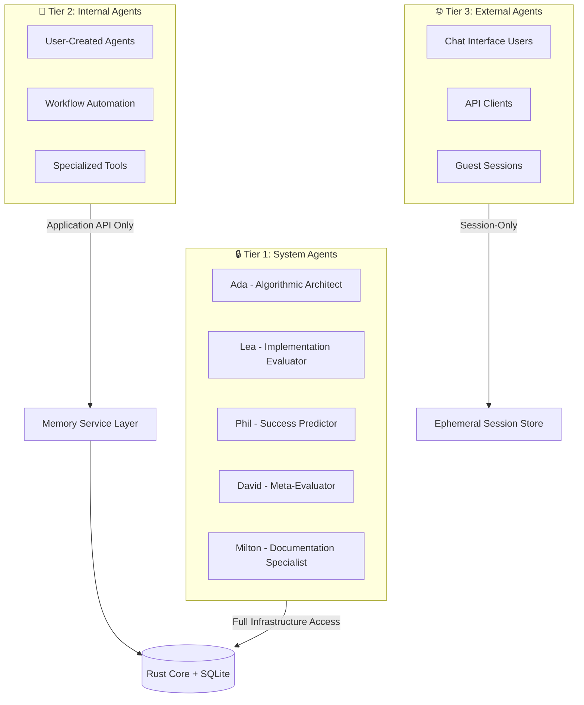
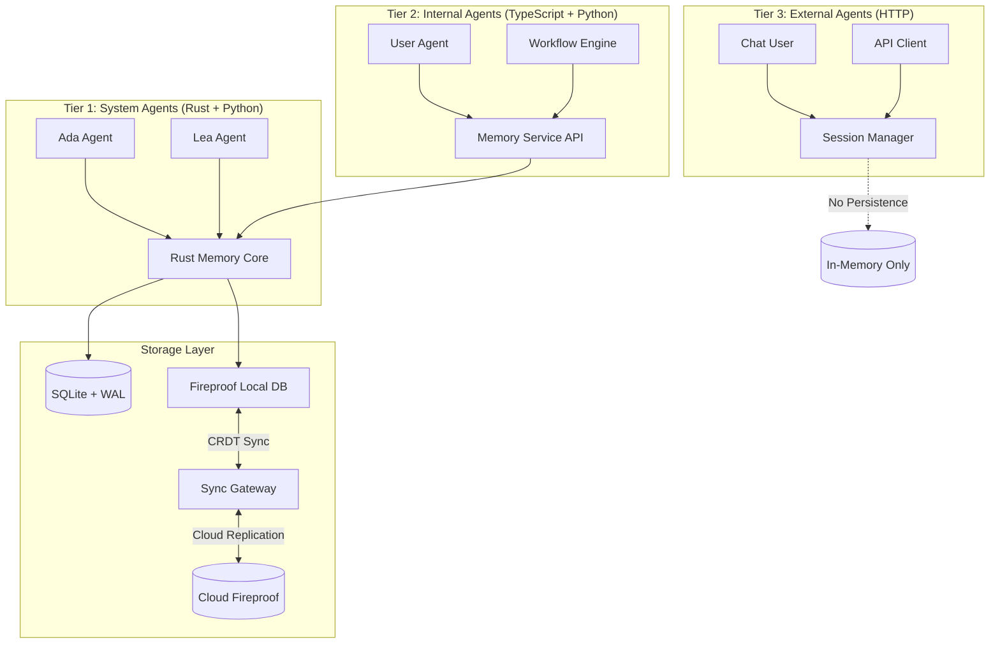
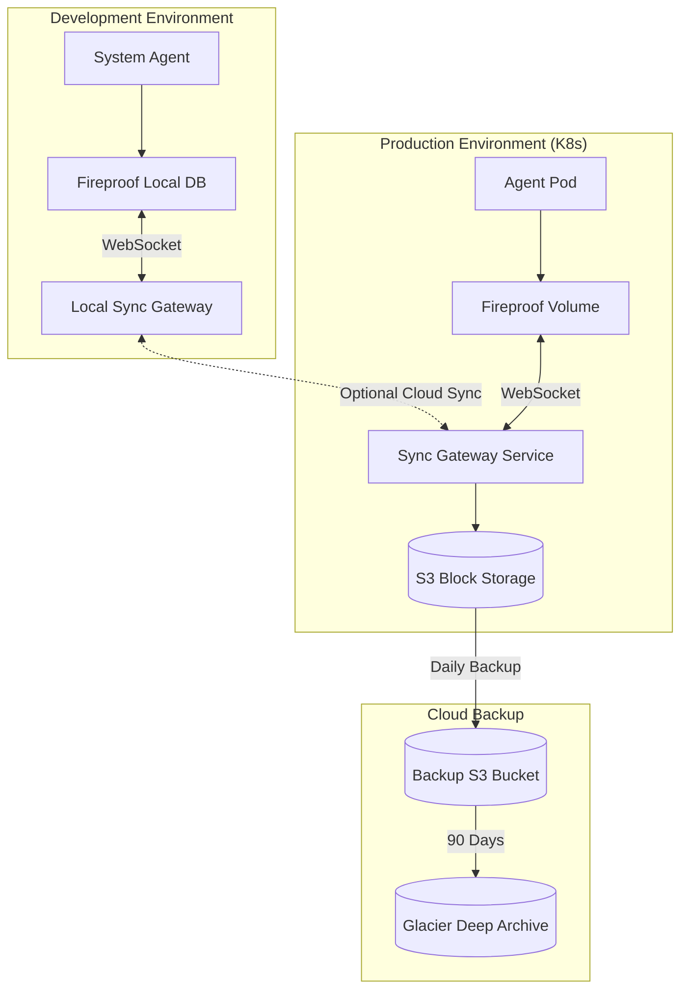
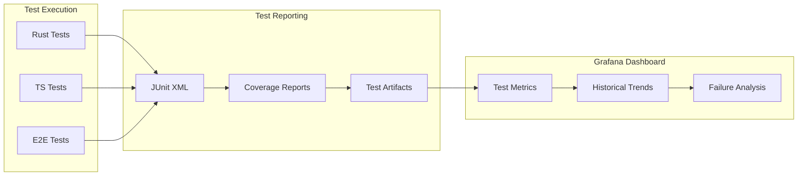
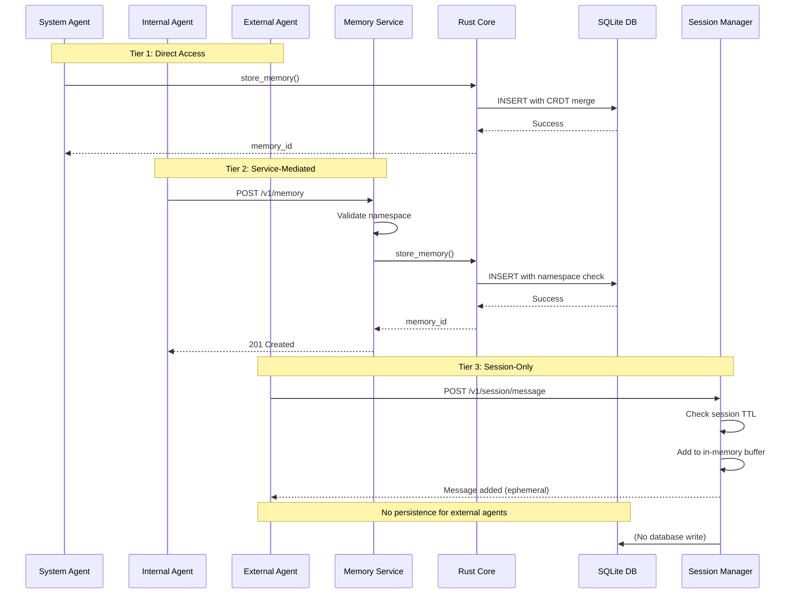
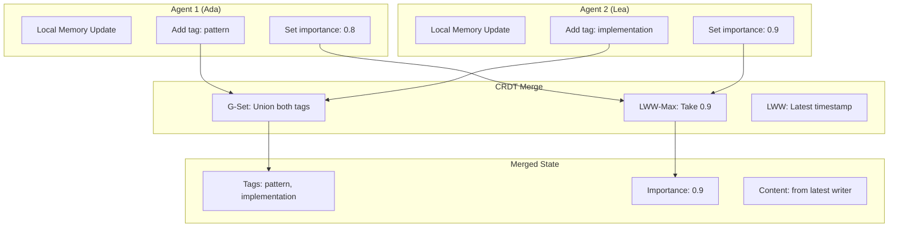

# Phase 4: Multi-Agent Memory Architecture with Three-Tier Security Model

**Version**: 1.0.0  
**Date**: 2026-01-25  
**Status**: Planning  
**Dependencies**: Phase 3 Complete (v0.34.0)

---

## Executive Summary

Phase 4 implements a comprehensive multi-agent memory architecture with three-tier security classification, cloud memory integration, and extensive testing infrastructure. This phase builds upon the existing Rust CRDT core and establishes secure, scalable memory access patterns for system, internal, and external agents.

### Key Deliverables

1. **Three-Tier Agent Security Model** - Formal classification and access control
2. **Cloud Memory Integration** - Production-ready Fireproof deployment with sync
3. **Memory Connection Patterns** - Differentiated access for each tier
4. **Comprehensive Testing** - UI, integration, and CI/CD test suites
5. **Security Documentation** - Policies, threat models, access control matrices

---

## 1. Three-Tier Agent Security Classification

### 1.1 Taxonomy Definition



### 1.2 Security Characteristics

| Tier | Access Level | Persistence | Memory Scope | Authentication | Example |
|------|-------------|-------------|--------------|----------------|---------|
| **System** | Infrastructure | Permanent | Global + Personal | Mutual TLS | Ada, Lea, Phil, David, Milton |
| **Internal** | Application API | Permanent | Namespace-scoped | API Key + JWT | User-created agents, workflows |
| **External** | HTTP/WebSocket | Session-only | Session-scoped | OAuth2 + CAPTCHA | Chat users, API consumers |

### 1.3 Access Control Matrix

| Operation | System Agents | Internal Agents | External Agents |
|-----------|--------------|-----------------|-----------------|
| Direct DB Access | ✅ | ❌ | ❌ |
| Memory Service API | ✅ | ✅ | ❌ |
| HTTP Memory Endpoint | ✅ | ✅ | ✅ (read-only) |
| CRDT Merge Operations | ✅ | ✅ (service-mediated) | ❌ |
| Cross-Agent Memory Read | ✅ | ✅ (same namespace) | ❌ |
| Memory Export | ✅ | ✅ (own data) | ❌ |
| Sync Gateway Access | ✅ | ✅ (via service) | ❌ |

---

## 2. Memory Architecture Design

### 2.1 System Overview



### 2.2 Data Models

#### Memory Document (Rust Core)

```rust
#[derive(Debug, Clone, Serialize, Deserialize)]
pub struct MemoryDocument {
    // Identity
    pub id: String,                    // UUID
    pub doc_type: DocumentType,        // bead, memory, embedding_ref
    
    // Content
    pub content: String,
    pub embedding_ref: Option<String>,
    
    // Classification
    pub memory_type: MemoryType,       // episodic, semantic, procedural
    pub tags: GSet<String>,            // CRDT G-Set for tags
    
    // Importance (CRDT LWW-Max)
    pub importance: LWWRegister<f64>,
    pub confidence: LWWRegister<f64>,
    pub access_count: Counter,
    
    // Provenance
    pub source_instance: String,       // Agent ID
    pub created_at: DateTime<Utc>,
    pub updated_at: DateTime<Utc>,
    
    // CRDT metadata
    pub version: u64,
    pub sync_status: SyncStatus,       // local, pending, synced
    
    // Relationships (G-Set)
    pub related_memories: GSet<String>,
    pub parent_memories: GSet<String>,
    pub evidence: GSet<String>,
    
    // Security
    pub tier: AgentTier,              // system, internal, external
    pub namespace: String,            // Isolation boundary
}
```

#### Session Memory (External Agents)

```typescript
interface SessionMemory {
  session_id: string;
  user_id?: string;
  created_at: Date;
  expires_at: Date;
  
  // Ephemeral context (not persisted)
  working_memory: Message[];
  conversation_state: ConversationState;
  
  // No embeddings, no CRDT, no sync
  max_messages: number;           // Default: 50
  ttl_seconds: number;            // Default: 3600 (1 hour)
}
```

### 2.3 Connection Patterns

#### Pattern 1: System Agent Direct Access

```python
# System agents use direct Rust memory integration
from rust_memory_integration import RustBackedMemoryManager, RustMemoryConfig

config = RustMemoryConfig.from_persona_config(Path("ada_config.json"))
memory = RustBackedMemoryManager(config)

async with memory:
    # Direct SQLite + CRDT access
    mem_id = await memory.store_memory(
        content="Discovered structural pattern",
        memory_type="semantic",
        importance=0.8,
        tags=["pattern", "structural"]
    )
    
    # Automatic CRDT merge on conflict
    memories = await memory.recall("structural patterns", k=5)
```

#### Pattern 2: Internal Agent Service-Layer Access

```typescript
// Internal agents use Memory Service API
import { MemoryServiceClient } from '@chrysalis/memory-client';

const client = new MemoryServiceClient({
  namespace: 'user_custom_agent',
  apiKey: process.env.CHRYSALIS_API_KEY,
  endpoint: 'http://localhost:8082/v1/memory'
});

// Service mediates all CRDT operations
const memoryId = await client.store({
  content: "User preference discovered",
  memoryType: "semantic",
  importance: 0.7,
  tags: ["user_preference"]
});

// Namespace-scoped recall
const memories = await client.recall({
  query: "user preferences",
  limit: 10,
  namespace: 'user_custom_agent'  // Automatic isolation
});
```

#### Pattern 3: External Agent Session-Only

```typescript
// External agents get ephemeral session memory
import { SessionMemoryManager } from '@chrysalis/session';

const session = new SessionMemoryManager({
  sessionId: 'chat_12345',
  ttl: 3600,  // 1 hour
  maxMessages: 50
});

// In-memory only, no persistence
session.addMessage({
  role: 'user',
  content: 'What is the capital of France?'
});

session.addMessage({
  role: 'assistant',
  content: 'Paris is the capital of France.'
});

// Session expires after TTL, data destroyed
// No CRDT, no sync, no permanent storage
```

---

## 3. Cloud Memory Solution: Fireproof

### 3.1 Selection Rationale (ADR-006)

Based on existing architecture in [`CHRYSALIS_SHARED_MEMORY_ARCHITECTURE.md`](../docs/CHRYSALIS_SHARED_MEMORY_ARCHITECTURE.md), Fireproof is the selected solution.

**Key Features**:
- ✅ Merkle CRDT for conflict-free replication
- ✅ Local-first architecture (offline capability)
- ✅ Content-addressed storage (cryptographic integrity)
- ✅ Browser + Node.js support
- ✅ Encrypted block storage
- ✅ Sync gateway for cloud replication

**Comparison with Alternatives**:

| Feature | Fireproof | Turso | Supabase | Ditto |
|---------|-----------|-------|----------|-------|
| Local-First | ✅ | ❌ | ❌ | ✅ |
| CRDT Support | ✅ Native | ❌ | ❌ | ✅ Native |
| Offline Mode | ✅ Full | ⚠️ Limited | ⚠️ Limited | ✅ Full |
| TypeScript API | ✅ | ✅ | ✅ | ✅ |
| Self-Hosted | ✅ | ❌ | ✅ | ❌ |
| Cost | Free (self-host) | $0.10/GB | $25/month | Enterprise |
| Rust Integration | ⚠️ Via FFI | ✅ Native | ⚠️ HTTP | ⚠️ Limited |

**Decision**: Fireproof aligns with local-first CRDT requirements and existing architecture.

### 3.2 Deployment Architecture



---

## 4. Integration Testing Strategy

### 4.1 Test Pyramid

```mermaid
flowchart TB
    subgraph E2E["E2E Tests (10%)"]
        E2E1[Full System Integration]
        E2E2[Cross-Agent Memory Sync]
        E2E3[Security Boundary Validation]
    end
    
    subgraph Integration["Integration Tests (40%)"]
        INT1[Memory Persistence]
        INT2[CRDT Merge Scenarios]
        INT3[API Layer Tests]
        INT4[Sync Gateway Tests]
        INT5[Isolation Tests]
    end
    
    subgraph Unit["Unit Tests (50%)"]
        UNIT1[CRDT Operations]
        UNIT2[Memory Document Validation]
        UNIT3[Access Control Rules]
        UNIT4[Serialization]
        UNIT5[Cache Behavior]
    end
    
    E2E1 --> E2E2 --> E2E3
    INT1 --> INT2 --> INT3 --> INT4 --> INT5
    UNIT1 --> UNIT2 --> UNIT3 --> UNIT4 --> UNIT5
```



### 4.2 Integration Test Suites

#### Suite 1: Memory Persistence Tests

**File**: `tests/integration/memory_persistence_test.rs`

```rust
#[tokio::test]
async fn test_system_agent_memory_persistence() {
    // Given: System agent with Rust memory backend
    let config = RustMemoryConfig {
        agent_id: "ada".to_string(),
        db_path: Some(":memory:"),  // In-memory SQLite
        ..Default::default()
    };
    let memory = RustBackedMemoryManager::new(config);
    await memory.initialize();
    
    // When: Store memory with CRDT fields
    let mem_id = memory.store_memory(
        "Test pattern",
        "semantic",
        0.8,
        0.9,
        Some(vec!["pattern".to_string()])
    ).await.unwrap();
    
    // Then: Memory persists correctly
    let retrieved = memory.get_memory(&mem_id).await.unwrap();
    assert_eq!(retrieved.content, "Test pattern");
    assert_eq!(retrieved.importance, 0.8);
    assert!(retrieved.tags.contains("pattern"));
}

#[tokio::test]
async fn test_crdt_merge_on_concurrent_updates() {
    // Test CRDT merge semantics with concurrent updates
    // ...
}

#[tokio::test]
async fn test_memory_ttl_expiry() {
    // Test episodic memory TTL enforcement
    // ...
}
```

#### Suite 2: Security Isolation Tests

**File**: `tests/integration/security_isolation_test.rs`

```rust
#[tokio::test]
async fn test_system_agent_full_access() {
    let ada_memory = setup_system_agent("ada");
    let lea_memory = setup_system_agent("lea");
    
    // System agents can read each other's memories
    let ada_mem_id = ada_memory.store_memory(...).await;
    let cross_read = lea_memory.get_memory(&ada_mem_id).await;
    assert!(cross_read.is_ok());
}

#[tokio::test]
async fn test_internal_agent_namespace_isolation() {
    let agent1 = setup_internal_agent("user_agent_1");
    let agent2 = setup_internal_agent("user_agent_2");
    
    // Internal agents cannot access other namespaces
    let agent1_mem = agent1.store_memory(...).await;
    let cross_read = agent2.get_memory(&agent1_mem).await;
    assert!(cross_read.is_err());  // Access denied
}

#[tokio::test]
async fn test_external_agent_no_persistence() {
    let session = SessionMemoryManager::new("session_123");
    
    session.add_message(...);
    
    // Drop session, data should be destroyed
    drop(session);
    
    // Verify memory not persisted to DB
    let db_check = query_sqlite_for_session("session_123");
    assert!(db_check.is_empty());
}
```

#### Suite 3: Sync Gateway Tests

**File**: `tests/integration/sync_gateway_test.ts`

```typescript
describe('Fireproof Sync Gateway', () => {
  test('should sync local changes to cloud', async () => {
    const localAgent = await setupLocalAgent('ada');
    const syncGateway = await setupSyncGateway();
    
    // Store memory locally
    const memId = await localAgent.storeMemory({
      content: 'Test sync',
      memoryType: 'episodic'
    });
    
    // Wait for sync
    await syncGateway.waitForSync(memId, 5000);
    
    // Verify remote replica has the memory
    const cloudMemory = await syncGateway.getMemory(memId);
    expect(cloudMemory.content).toBe('Test sync');
  });
  
  test('should handle offline operation', async () => {
    const agent = await setupAgent('ada', { offline: true });
    
    // Store memories while offline
    const ids = await Promise.all([
      agent.storeMemory({ content: 'offline 1' }),
      agent.storeMemory({ content: 'offline 2' })
    ]);
    
    // Go online and sync
    await agent.goOnline();
    await agent.sync();
    
    // Verify both memories synced
    const cloudCheck = await checkCloudMemories(ids);
    expect(cloudCheck.allSynced).toBe(true);
  });
});
```

### 4.3 UI Testing Strategy

#### Component Test Structure

```
tests/
├── unit/
│   ├── components/
│   │   ├── MemoryList.test.tsx
│   │   ├── MemoryCard.test.tsx
│   │   └── MemorySearch.test.tsx
│   └── hooks/
│       ├── useMemoryStore.test.ts
│       └── useMemorySync.test.ts
├── integration/
│   ├── memory-workflow.test.tsx
│   ├── agent-interaction.test.tsx
│   └── sync-behavior.test.tsx
└── e2e/
    ├── playwright/
    │   ├── memory-crud.spec.ts
    │   ├── multi-agent-collab.spec.ts
    │   └── accessibility.spec.ts
    └── cypress/
        ├── fixtures/
        └── screenshots/
```

#### Example UI Tests

**Unit Test**: `tests/unit/components/MemoryCard.test.tsx`

```typescript
import { render, screen } from '@testing-library/react';
import { MemoryCard } from '@/components/MemoryCard';

describe('MemoryCard', () => {
  test('renders memory content correctly', () => {
    const memory = {
      id: 'mem_123',
      content: 'Test memory',
      memoryType: 'episodic',
      importance: 0.8,
      tags: ['test']
    };
    
    render(<MemoryCard memory={memory} />);
    
    expect(screen.getByText('Test memory')).toBeInTheDocument();
    expect(screen.getByText('episodic')).toBeInTheDocument();
    expect(screen.getByText('test')).toBeInTheDocument();
  });
  
  test('shows sync status indicator', () => {
    const memory = { ...mockMemory, syncStatus: 'pending' };
    render(<MemoryCard memory={memory} />);
    
    expect(screen.getByLabelText('Syncing...')).toBeInTheDocument();
  });
});
```

**Integration Test**: `tests/integration/memory-workflow.test.tsx`

```typescript
describe('Memory Workflow', () => {
  test('complete memory lifecycle', async () => {
    const { user } = await setupTestUser();
    
    // 1. Create memory
    await user.click(screen.getByRole('button', { name: 'Add Memory' }));
    await user.type(screen.getByLabelText('Content'), 'New memory');
    await user.click(screen.getByRole('button', { name: 'Save' }));
    
    // 2. Verify in list
    await waitFor(() => {
      expect(screen.getByText('New memory')).toBeInTheDocument();
    });
    
    // 3. Edit memory
    await user.click(screen.getByLabelText('Edit'));
    await user.clear(screen.getByLabelText('Content'));
    await user.type(screen.getByLabelText('Content'), 'Updated memory');
    await user.click(screen.getByRole('button', { name: 'Save' }));
    
    // 4. Verify CRDT merge
    expect(screen.getByText('Updated memory')).toBeInTheDocument();
    
    // 5. Delete memory (for internal agents only)
    await user.click(screen.getByLabelText('Delete'));
    await user.click(screen.getByRole('button', { name: 'Confirm' }));
    
    expect(screen.queryByText('Updated memory')).not.toBeInTheDocument();
  });
});
```

**E2E Test**: `tests/e2e/playwright/accessibility.spec.ts`

```typescript
import { test, expect } from '@playwright/test';
import { injectAxe, checkA11y } from 'axe-playwright';

test.describe('Memory UI Accessibility', () => {
  test('memory list is keyboard navigable', async ({ page }) => {
    await page.goto('/memories');
    await injectAxe(page);
    
    // Tab through memory cards
    await page.keyboard.press('Tab');
    await page.keyboard.press('Tab');
    
    // Verify focus visible
    const focusedElement = await page.locator(':focus');
    await expect(focusedElement).toHaveAttribute('data-memory-id');
    
    // Check accessibility
    await checkA11y(page, null, {
      detailedReport: true,
      detailedReportOptions: { html: true }
    });
  });
  
  test('screen reader announces memory updates', async ({ page }) => {
    await page.goto('/memories');
    
    // Create memory
    await page.click('button[aria-label="Add Memory"]');
    
    // Verify ARIA live region updated
    const liveRegion = page.locator('[aria-live="polite"]');
    await expect(liveRegion).toContainText('Memory created successfully');
  });
});
```

---

## 5. CI/CD Pipeline Architecture

### 5.1 Pipeline Structure

```mermaid
flowchart LR
    subgraph PR["Pull Request Checks"]
        Lint[Linting]
        Format[Formatting]
        TypeCheck[Type Checking]
    end
    
    subgraph UnitTests["Unit Tests"]
        RustUnit[Rust Unit Tests]
        TSUnit[TypeScript Unit Tests]
        PyUnit[Python Unit Tests]
    end
    
    subgraph IntegrationTests["Integration Tests"]
        MemPersist[Memory Persistence]
        Security[Security Isolation]
        SyncGW[Sync Gateway]
    end
    
    subgraph E2ETests["E2E Tests"]
        Playwright[Playwright Tests]
        Cypress[Cypress Tests]
    end
    
    subgraph Deploy["Deployment"]
        BuildDocker[Build Docker Images]
        PushRegistry[Push to Registry]
        DeployStaging[Deploy to Staging]
        E2EStaging[Staging E2E Tests]
        DeployProd[Deploy to Production]
    end
    
    PR --> UnitTests
    UnitTests --> IntegrationTests
    IntegrationTests --> E2ETests
    E2ETests --> BuildDocker
    BuildDocker --> PushRegistry
    PushRegistry --> DeployStaging
    DeployStaging --> E2EStaging
    E2EStaging --> DeployProd
```



### 5.2 GitHub Actions Workflow

**File**: `.github/workflows/phase4-memory-tests.yml`

```yaml
name: Phase 4 - Memory Architecture Tests

on:
  push:
    branches: [main, develop]
  pull_request:
    branches: [main, develop]

jobs:
  rust-tests:
    name: Rust Memory Core Tests
    runs-on: ubuntu-latest
    steps:
      - uses: actions/checkout@v4
      
      - name: Setup Rust
        uses: dtolnay/rust-toolchain@stable
        
      - name: Cache Cargo
        uses: actions/cache@v3
        with:
          path: |
            ~/.cargo
            target/
          key: ${{ runner.os }}-cargo-${{ hashFiles('**/Cargo.lock') }}
      
      - name: Run Rust Tests
        run: |
          cd src/native/rust-system-agents
          cargo test --all-features --verbose
          
      - name: Run Memory Integration Tests
        run: |
          cargo test --test memory_persistence_test --verbose
          cargo test --test security_isolation_test --verbose
  
  typescript-tests:
    name: TypeScript Memory API Tests
    runs-on: ubuntu-latest
    steps:
      - uses: actions/checkout@v4
      
      - name: Setup Node.js
        uses: actions/setup-node@v4
        with:
          node-version: '20'
          cache: 'npm'
      
      - name: Install Dependencies
        run: npm ci
      
      - name: Run Unit Tests
        run: npm run test:unit
      
      - name: Run Integration Tests
        run: npm run test:integration
        env:
          MEMORY_SERVICE_URL: http://localhost:8082
  
  e2e-tests:
    name: E2E Memory UI Tests
    runs-on: ubuntu-latest
    needs: [rust-tests, typescript-tests]
    steps:
      - uses: actions/checkout@v4
      
      - name: Setup Node.js
        uses: actions/setup-node@v4
        with:
          node-version: '20'
      
      - name: Install Playwright
        run: npx playwright install --with-deps
      
      - name: Start Test Environment
        run: |
          docker-compose -f docker-compose.test.yml up -d
          npm run wait-for-services
      
      - name: Run E2E Tests
        run: npm run test:e2e
      
      - name: Upload Test Reports
        if: always()
        uses: actions/upload-artifact@v3
        with:
          name: playwright-report
          path: playwright-report/
  
  security-tests:
    name: Security Isolation Tests
    runs-on: ubuntu-latest
    steps:
      - uses: actions/checkout@v4
      
      - name: Run Security Tests
        run: |
          cargo test --test security_isolation_test --verbose
          npm run test:security
      
      - name: SAST Scan
        uses: github/codeql-action/analyze@v2
        with:
          languages: rust, typescript, python
```

### 5.3 Test Reporting Dashboard



---

## 6. Architecture Diagrams

### 6.1 Memory Access Control Flow



### 6.2 CRDT Merge Conflict Resolution



---

## 7. Security Policies and Access Control

### 7.1 Security Policy Document

**File**: `docs/MEMORY_SECURITY_POLICY.md`

#### Authentication Requirements

| Tier | Auth Method | Credential Type | Session Duration | MFA |
|------|------------|----------------|------------------|-----|
| System | Mutual TLS | X.509 Cert | Permanent | N/A |
| Internal | API Key + JWT | HMAC-SHA256 | 24 hours | Optional |
| External | OAuth2 | JWT | 1 hour | Required |

#### Data Isolation Rules

1. **System Agents**: Full cross-agent read access, write to own namespace or shared
2. **Internal Agents**: Read/write within assigned namespace only
3. **External Agents**: No persistence, session-scoped only

#### Encryption Standards

- At Rest: AES-256-GCM (SQLite database encryption)
- In Transit: TLS 1.3 (Sync Gateway WebSocket)
- Memory Documents: Optional field-level encryption for sensitive content

#### Audit Logging

```json
{
  "event": "memory_access",
  "timestamp": "2026-01-25T12:00:00Z",
  "agent_id": "ada",
  "agent_tier": "system",
  "operation": "store_memory",
  "memory_id": "mem_abc123",
  "namespace": "ada",
  "result": "success"
}
```

### 7.2 Threat Model

| Threat | Mitigation | Residual Risk |
|--------|-----------|---------------|
| **External agent data exfiltration** | Session-only storage, no persistence | Low |
| **Namespace escape (internal agents)** | Service-layer validation, DB constraints | Medium |
| **CRDT merge poisoning** | Signature verification, provenance tracking | Low |
| **Sync gateway hijacking** | TLS + API key authentication | Low |
| **SQLite injection** | Parameterized queries, Rust type safety | Very Low |

---

## 8. Implementation Roadmap

### 8.1 Phase Breakdown

#### Phase 4.1: Security Model Implementation (Week 1-2)

- [ ] Define agent tier enum in Rust core
- [ ] Implement namespace validation in memory service
- [ ] Create session manager for external agents
- [ ] Add authentication middleware to HTTP endpoints
- [ ] Write security isolation unit tests

#### Phase 4.2: Memory Architecture Enhancement (Week 3-4)

- [ ] Finalize MemoryDocument schema with tier field
- [ ] Implement namespace-scoped queries
- [ ] Add cross-agent read access for system tier
- [ ] Create memory service API endpoints
- [ ] Write memory persistence tests

#### Phase 4.3: Fireproof Integration (Week 5-6)

- [ ] Deploy Fireproof sync gateway (Docker)
- [ ] Configure sync clients in Rust agents
- [ ] Implement offline detection and queue
- [ ] Add sync status tracking
- [ ] Write sync gateway integration tests

#### Phase 4.4: UI Testing Infrastructure (Week 7-8)

- [ ] Setup Jest + React Testing Library
- [ ] Create component test suite (15+ tests)
- [ ] Setup Playwright for E2E tests
- [ ] Implement accessibility tests (axe-core)
- [ ] Create test fixtures and mocks

#### Phase 4.5: CI/CD Pipeline (Week 9-10)

- [ ] Configure GitHub Actions workflows
- [ ] Setup test parallelization
- [ ] Create test reporting dashboard (Grafana)
- [ ] Implement automated deployment (staging)
- [ ] Add performance regression tests

#### Phase 4.6: Documentation and Validation (Week 11-12)

- [ ] Write ADR-006 (Cloud Memory Selection)
- [ ] Document security policies
- [ ] Create developer integration guides
- [ ] Run comprehensive security audit
- [ ] Production deployment and monitoring

### 8.2 Milestones

| Milestone | Target Date | Deliverables | Success Criteria |
|-----------|------------|--------------|------------------|
| M1: Security Model | Week 2 | Tier classification, auth middleware | All security tests passing |
| M2: Memory Architecture | Week 4 | Enhanced schema, service API | Integration tests passing |
| M3: Fireproof Deployment | Week 6 | Sync gateway live, offline support | Sync tests passing |
| M4: Testing Infrastructure | Week 8 | Full test suite (100+ tests) | 90%+ code coverage |
| M5: CI/CD Live | Week 10 | Automated pipeline operational | Zero manual steps |
| M6: Production Ready | Week 12 | Documentation complete, audit passed | Sign-off from security team |

---

## 9. Success Criteria

### 9.1 Functional Requirements

- [ ] System agents can read/write memories with direct DB access
- [ ] Internal agents isolated to their namespaces via service API
- [ ] External agents have session-only memory with no persistence
- [ ] CRDT merge handles concurrent updates without data loss
- [ ] Fireproof sync gateway replicates changes within 5 seconds
- [ ] Offline agents queue changes and sync when reconnected

### 9.2 Non-Functional Requirements

| Requirement | Target | Measurement |
|------------|--------|-------------|
| Memory Write Latency | <10ms | P95 latency from Prometheus |
| Memory Read Latency | <5ms | P95 latency from Prometheus |
| CRDT Merge Time | <50ms | Benchmark in tests |
| Sync Propagation | <5s | E2E test verification |
| Test Suite Runtime | <5min | CI pipeline duration |
| Test Coverage | >90% | Coverage report |
| Security Tests | 100% passing | CI gate |

### 9.3 Quality Gates

**Merge to Main**:
- ✅ All unit tests passing
- ✅ All integration tests passing
- ✅ All security tests passing
- ✅ Code coverage >85%
- ✅ No critical vulnerabilities (SAST scan)
- ✅ Manual code review approved

**Deploy to Staging**:
- ✅ E2E tests passing
- ✅ Performance benchmarks within 10% of baseline
- ✅ Load test passed (100 concurrent users)

**Deploy to Production**:
- ✅ Staging E2E tests passing
- ✅ Security audit sign-off
- ✅ Rollback plan documented
- ✅ On-call engineer assigned

---

## 10. Risk Assessment

| Risk | Likelihood | Impact | Mitigation |
|------|-----------|--------|-----------|
| CRDT merge complexity introduces bugs | Medium | High | Extensive test coverage, property-based testing |
| Fireproof sync gateway downtime | Low | Medium | Offline queue, exponential backoff retry |
| Namespace escape vulnerability | Low | High | Service-layer validation, DB constraints, security audit |
| Test suite becomes too slow | Medium | Medium | Parallel execution, selective test runs, mocking |
| Memory bloat from external sessions | Medium | Low | Aggressive TTL, session count limits per user |

---

## 11. Dependencies and Blockers

### 11.1 Technical Dependencies

- ✅ Rust 1.70+ (for async traits)
- ✅ SQLite 3.40+ (for improved JSON support)
- ✅ Node.js 20+ (for Playwright)
- ⏳ Fireproof npm package stable release (currently v0.19)
- ⏳ Docker Compose v2 for test environment

### 11.2 External Blockers

- None identified - all components self-contained

---

## 12. Next Steps

### Immediate Actions (This Week)

1. Review and approve this Phase 4 plan
2. Create tracking issue: "Phase 4: Multi-Agent Memory Architecture"
3. Setup project board with milestones
4. Assign engineering resources to sub-phases
5. Create ADR-006 for cloud memory selection

### Week 1 Kickoff

1. Define agent tier enum in Rust
2. Draft security policy document
3. Setup test infrastructure (Jest + Playwright)
4. Create memory service API specification
5. Design session manager for external agents

---

## 13. References

### Internal Documentation

- [`CHRYSALIS_SHARED_MEMORY_ARCHITECTURE.md`](../docs/CHRYSALIS_SHARED_MEMORY_ARCHITECTURE.md) - Fireproof CRDT architecture
- [`AGENTIC_MEMORY_DESIGN.md`](../docs/AGENTIC_MEMORY_DESIGN.md) - Memory tiers and beads
- [`memory-system.md`](../docs/architecture/memory-system.md) - Current implementation
- [`ADR-001-cloud-only-llm.md`](../docs/architecture/ADR-001-cloud-only-llm.md) - Cloud infrastructure precedent
- [`ADR-004-integration-testing-strategy.md`](../docs/architecture/ADR-004-integration-testing-strategy.md) - Testing patterns

### External References

1. [Fireproof Documentation](https://use-fireproof.com/) - CRDT database guide
2. [CRDTs: Consistency without Concurrency Control](https://hal.inria.fr/inria-00555588) - Shapiro et al.
3. [Playwright Best Practices](https://playwright.dev/docs/best-practices) - E2E testing
4. [OWASP Secure Coding Practices](https://owasp.org/www-project-secure-coding-practices-quick-reference-guide/) - Security guidelines

---

**Plan Version**: 1.0.0  
**Last Updated**: 2026-01-25  
**Authors**: Systems Architecture Team  
**Reviewers**: Security Team, Engineering Team  
**Status**: Ready for Review
