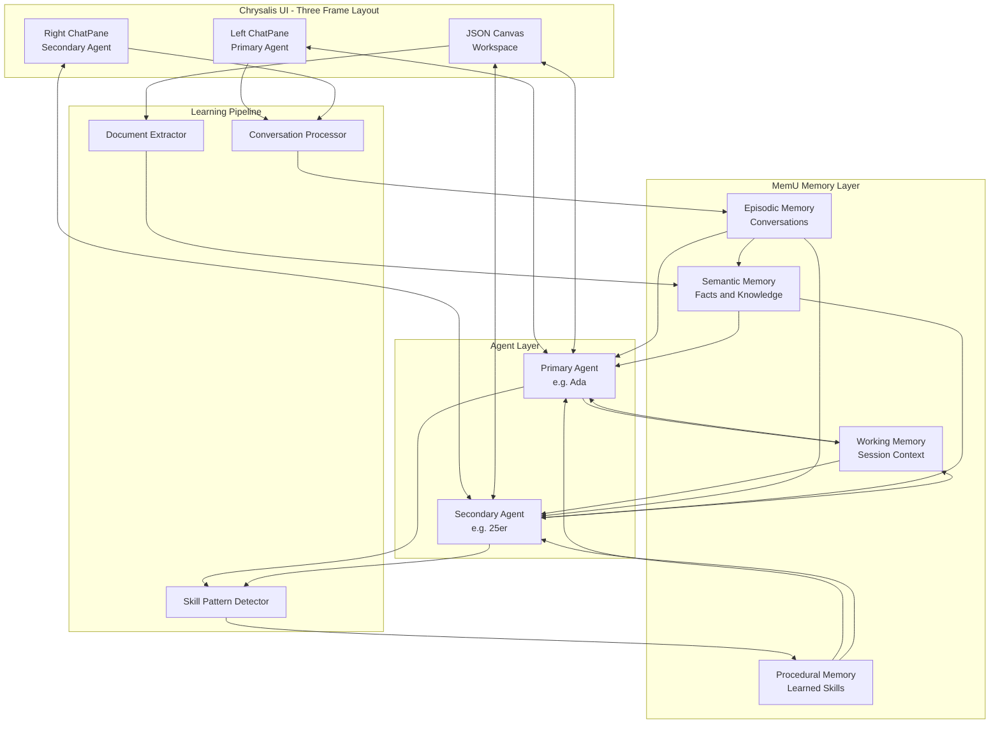
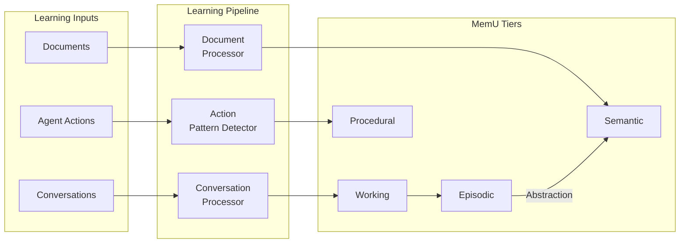
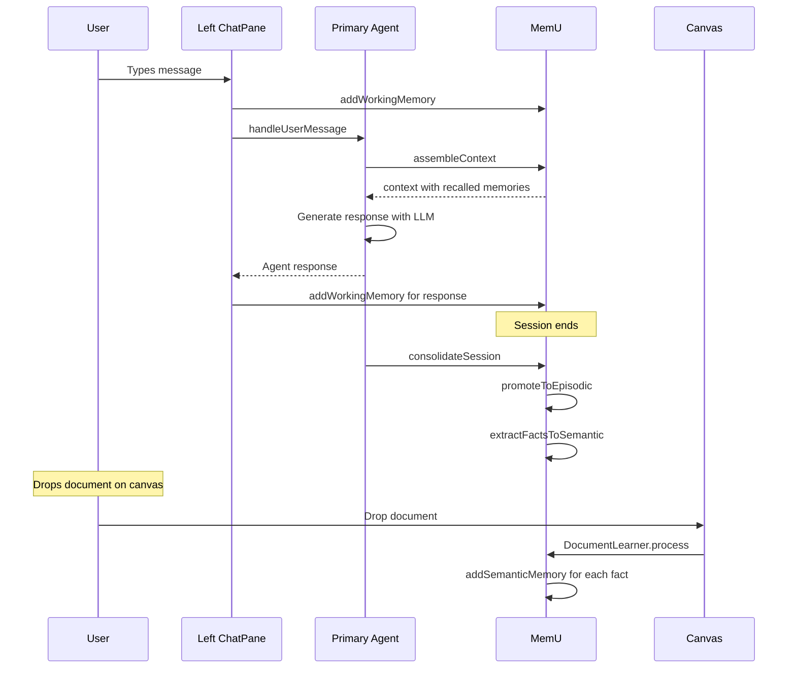

# Chrysalis Dual-Chat Canvas with MemU Learning

**Version**: 1.0.0  
**Status**: Ready for Implementation  
**Date**: 2026-01-09

---

## Executive Summary

This plan delivers a three-frame UI architecture with:
- **Left Frame**: Chat Pane bound to Primary Agent
- **Center Frame**: JSON Canvas for collaborative workspace
- **Right Frame**: Chat Pane bound to Secondary Agent / System

All interactions feed into MemU for persistent agent learning across conversations, documents, and skills.

---

## Architecture Overview



---

## Phase 12: Dual-Chat Canvas UI Design

### 12.1 Three-Frame Layout Specification

```typescript
interface ChrysalisLayout {
  leftFrame: {
    component: 'ChatPane';
    width: '25%';
    minWidth: 280;
    agentBinding: 'primary';
  };
  centerFrame: {
    component: 'JSONCanvas';
    width: '50%';
    minWidth: 400;
  };
  rightFrame: {
    component: 'ChatPane';
    width: '25%';
    minWidth: 280;
    agentBinding: 'secondary' | 'system';
  };
}
```

**Layout CSS Grid**:
```css
.chrysalis-workspace {
  display: grid;
  grid-template-columns: minmax(280px, 1fr) minmax(400px, 2fr) minmax(280px, 1fr);
  height: 100vh;
  gap: 0;
}
```

### 12.2 ChatPane Component Design

```typescript
interface ChatPaneProps {
  paneId: 'left' | 'right';
  agentId: string;
  agentName: string;
  
  // YJS binding
  yjsDoc: Y.Doc;
  
  // MemU binding
  memory: MemUAdapter;
  
  // Agent connection
  terminalClient: AgentTerminalClient;
  
  // Callbacks
  onMessageSent?: MessageHandler;
  onAgentResponse?: MessageHandler;
}

interface ChatMessage {
  id: string;
  timestamp: number;
  senderId: string;
  senderType: 'user' | 'agent' | 'system';
  content: string;
  metadata?: {
    memoryIds?: string[];  // IDs of memories this message created
    recalledMemories?: string[];  // IDs of memories recalled
    skillUsed?: string;  // Skill ID if agent used a learned skill
  };
}
```

### 12.3 JSONCanvas Center Component

Extends existing AgentCanvas with document drop handling:

```typescript
interface ChrysalisCanvasProps {
  // From existing AgentCanvas
  manager: AgentCanvasManager;
  
  // New: Document learning
  onDocumentDrop?: DocumentDropHandler;
  
  // New: Skill observation
  onAgentAction?: ActionObserverHandler;
}

interface DocumentDropHandler {
  file: File;
  position: { x: number; y: number };
  extractToSemantic: boolean;  // Flag to trigger learning
}
```

### 12.4 YJS Document Structure

```typescript
// Shared YJS state structure
interface ChrysalisYJSState {
  // Left chat pane messages
  leftChat: Y.Array<ChatMessage>;
  
  // Right chat pane messages  
  rightChat: Y.Array<ChatMessage>;
  
  // Canvas state
  canvas: Y.Map<{
    nodes: Y.Array<CanvasNode>;
    edges: Y.Array<CanvasEdge>;
    viewport: Y.Map<ViewportState>;
  }>;
  
  // Session metadata
  session: Y.Map<{
    id: string;
    primaryAgentId: string;
    secondaryAgentId: string;
    startedAt: number;
  }>;
}
```

---

## Phase 13: MemU Integration Enhancement

### 13.1 ChatPane → MemU Conversation Persistence

```typescript
class ConversationMemoryManager {
  constructor(
    private memory: MemUAdapter,
    private agentId: string
  ) {}
  
  async persistMessage(message: ChatMessage): Promise<string> {
    // Add to working memory for immediate context
    await this.memory.addWorkingMemory(message.content, {
      memoryType: 'conversation',
      source: message.senderType === 'user' ? 'user' : 'agent',
      importance: this.calculateImportance(message)
    });
    
    // Periodic promotion to episodic
    return message.id;
  }
  
  async consolidateSession(): Promise<void> {
    // Promote working memory to episodic at session end
    const working = this.memory.getWorkingMemories();
    for (const mem of working) {
      await this.memory.promoteToEpisodic(mem.memoryId);
    }
  }
}
```

### 13.2 AgentLearningPipeline



```typescript
class AgentLearningPipeline {
  constructor(
    private memory: MemUAdapter,
    private llm: LLMHydrationService
  ) {}
  
  // 13.2.1: Extract facts from conversation
  async extractFactsFromConversation(messages: ChatMessage[]): Promise<void> {
    const context = messages.map(m => 
      `${m.senderType}: ${m.content}`
    ).join('\n');
    
    // Use LLM to extract facts
    const extraction = await this.llm.complete({
      messages: [{
        role: 'user',
        content: `Extract 3-5 key facts from this conversation that should be remembered:\n\n${context}`
      }],
      agentId: 'learning-pipeline'
    });
    
    // Parse and store facts
    const facts = this.parseFacts(extraction.content);
    for (const fact of facts) {
      await this.memory.addSemanticMemory(fact, {
        confidence: 0.8,
        evidence: [messages[messages.length - 1].id]
      });
    }
  }
  
  // 13.2.2: Consolidate episodic to semantic
  async abstractToSemantic(): Promise<void> {
    const recent = await this.memory.searchEpisodic('', 20);
    // Group similar memories and abstract patterns
    // Store as semantic knowledge
  }
}
```

### 13.3 Document-to-Semantic Extraction

```typescript
class DocumentLearner {
  async processDroppedDocument(
    file: File,
    memory: MemUAdapter
  ): Promise<SemanticMemory[]> {
    // 1. Extract text from document
    const text = await this.extractText(file);
    
    // 2. Chunk into manageable pieces
    const chunks = this.chunkText(text, 500);
    
    // 3. Extract facts from each chunk
    const facts: SemanticMemory[] = [];
    for (const chunk of chunks) {
      const extracted = await this.extractFacts(chunk);
      for (const fact of extracted) {
        const mem = await memory.addSemanticMemory(fact, {
          evidence: [`document:${file.name}`],
          confidence: 0.85
        });
        facts.push(mem);
      }
    }
    
    return facts;
  }
}
```

### 13.4 Skill Learning from Patterns

```typescript
class SkillLearner {
  private actionBuffer: AgentAction[] = [];
  
  async observeAction(action: AgentAction): Promise<void> {
    this.actionBuffer.push(action);
    
    // Detect patterns when buffer has enough actions
    if (this.actionBuffer.length >= 5) {
      await this.detectAndLearnPatterns();
    }
  }
  
  private async detectAndLearnPatterns(): Promise<void> {
    // Group similar action sequences
    const patterns = this.findRepeatedSequences(this.actionBuffer);
    
    for (const pattern of patterns) {
      if (pattern.occurrences >= 2) {
        // Learned skill!
        await this.memory.learnSkill(pattern.name, {
          description: pattern.description,
          steps: pattern.steps,
          preconditions: pattern.preconditions,
          examples: pattern.examples
        });
      }
    }
  }
}
```

---

## Phase 14: Agent Chat Learning Loop

### 14.1 Primary Agent Chat Connection

```typescript
class AgentChatController {
  constructor(
    private agent: AgentTerminalClient,
    private memory: MemUAdapter,
    private llm: LLMHydrationService
  ) {}
  
  async handleUserMessage(message: ChatMessage): Promise<ChatMessage> {
    // 1. Add to working memory
    await this.memory.addWorkingMemory(message.content, {
      source: 'user',
      memoryType: 'conversation'
    });
    
    // 2. Recall relevant context
    const context = await this.memory.assembleContext(message.content, {
      includeWorking: true,
      includeRelevant: true,
      maxTokens: 2000
    });
    
    // 3. Generate response with memory context
    const response = await this.agent.chat(message.content, {
      systemPrompt: `You are a helpful agent. Use this context:\n\n${context}`,
      includeMemoryContext: true
    });
    
    // 4. Store agent response
    await this.memory.addWorkingMemory(response.content, {
      source: 'agent',
      memoryType: 'response'
    });
    
    return {
      id: response.id,
      timestamp: Date.now(),
      senderId: this.agent.agentId,
      senderType: 'agent',
      content: response.content,
      metadata: {
        recalledMemories: response.recalledMemoryIds
      }
    };
  }
}
```

### 14.3 Memory Recall During Conversation

```typescript
async function recallRelevantMemories(
  query: string,
  memory: MemUAdapter
): Promise<{
  episodic: Memory[];
  semantic: Memory[];
  skills: ProceduralMemory[];
}> {
  const [episodic, semantic, skills] = await Promise.all([
    memory.searchEpisodic(query, 3),
    memory.searchSemantic(query, 5),
    memory.searchSkills(query, 2)
  ]);
  
  return {
    episodic: episodic.memories,
    semantic: semantic.memories,
    skills: skills.memories as ProceduralMemory[]
  };
}
```

### 14.4 Learning Feedback UI

```typescript
interface MemoryIndicator {
  type: 'episodic' | 'semantic' | 'skill';
  content: string;
  confidence: number;
  usedInResponse: boolean;
}

interface ChatMessageWithMemory extends ChatMessage {
  memoryIndicators?: MemoryIndicator[];
}

// UI shows small badges on agent messages:
// 🧠 3 memories recalled
// 📚 1 fact learned
// ⚡ Skill used: "summarize"
```

---

## Data Flow Diagram



---

## File Structure

```
src/
├── components/
│   ├── ChrysalisWorkspace/
│   │   ├── ChrysalisWorkspace.tsx       # Main three-frame layout
│   │   ├── ChatPane.tsx                  # Reusable chat component
│   │   └── styles.ts
│   └── AgentCanvas/                      # Existing, enhanced
│
├── memory/
│   ├── MemUAdapter.ts                    # Existing ✓
│   ├── ConversationMemoryManager.ts      # NEW: Chat ↔ MemU
│   └── index.ts
│
├── learning/
│   ├── AgentLearningPipeline.ts          # NEW: Orchestrates learning
│   ├── ConversationProcessor.ts          # NEW: Extract from chat
│   ├── DocumentLearner.ts                # NEW: Extract from docs
│   ├── SkillLearner.ts                   # NEW: Learn from actions
│   └── index.ts
│
├── agents/
│   ├── AgentChatController.ts            # NEW: Agent ↔ Chat ↔ MemU
│   └── TerminalAgentConnector.ts         # Existing, enhanced
│
└── terminal/
    ├── protocols/
    │   ├── chat-pane-sync.ts             # NEW: YJS chat sync
    │   └── ...existing
    └── AgentTerminalClient.ts            # Existing ✓
```

---

## Implementation Order

1. **12.1** UI Layout - Create CSS grid three-frame structure
2. **12.2** ChatPane - Build reusable chat component
3. **12.4** YJS Sync - Wire YJS documents for real-time
4. **12.3** Canvas Integration - Connect existing AgentCanvas
5. **13.1** Conversation Persistence - Wire chat to MemU
6. **14.1** Primary Agent - Connect agent to left pane
7. **14.3** Memory Recall - Add context assembly
8. **14.2** Secondary Agent - Connect to right pane
9. **13.2** Learning Pipeline - Build consolidation logic
10. **13.3** Document Learning - Add drop-to-learn
11. **13.4** Skill Learning - Add pattern detection
12. **14.4** Feedback UI - Show memory indicators
13. **14.5** E2E Test - Verify full loop

---

## Success Criteria

1. ✅ User can chat with Primary Agent in left pane
2. ✅ User can chat with Secondary Agent in right pane
3. ✅ Conversations persist to MemU episodic memory
4. ✅ Agent recalls relevant memories in responses
5. ✅ Documents dropped on canvas create semantic memories
6. ✅ Repeated action patterns become learned skills
7. ✅ UI shows memory indicators on agent messages
8. ✅ Agent can discuss "what have you learned?" with accurate recall