# System Agent Middleware Architecture

**Version**: 1.0.0
**Date**: January 15, 2026
**Authors**: Implementation Team

---

## Executive Summary

The System Agent Middleware implements a **Domain-Specific Multi-Agent Collaboration Framework** that extends established AI research patterns for software development contexts. This architecture draws from multiple theoretical foundations and adapts them for practical agent coordination within the Chrysalis system.

---

## 1. Theoretical Foundations & AI Pattern Literature

### 1.1 Primary Influences

Our implementation synthesizes patterns from several key research areas:

#### Society of Mind (Minsky, 1986)
- **Core Concept**: Intelligence emerges from interactions between specialized agents
- **Our Adaptation**: Four persona agents (Ada, Lea, Phil, David) with distinct evaluation dimensions
- **Key Mechanism**: Weighted consensus through the AgentArbiter

#### Multi-Agent Debate (Du et al., 2023)
- **Core Concept**: Agents debate and reach consensus through iterative discussion
- **Our Adaptation**: SCM Gate → Plan → Realize pipeline with confidence-weighted voting
- **Research Reference**: "Improving Factuality and Reasoning in Language Models through Multiagent Debate"

#### ReConcile: Round-Table Conference (Chen et al., 2024)
- **Core Concept**: Multi-model framework with confidence-weighted voting
- **Our Adaptation**: AgentArbiter with diversity bonuses and pile-on prevention
- **Research Reference**: ACL 2024 - "Round-Table Conference Improves Reasoning via Consensus among Diverse LLMs"

#### MetaGPT / AgentVerse (2024)
- **Core Concept**: Standardized Operating Procedures for multi-agent collaboration
- **Our Adaptation**: Declarative behavior configs with jobs, triggers, openers, idioms
- **Research Reference**: "Meta Programming for A Multi-Agent Collaborative Framework"

### 1.2 Novel Contributions

Our system introduces **domain-specific adaptations** not found in general-purpose multi-agent debate frameworks:

| Feature | General MAD | Chrysalis SCM |
|---------|-------------|---------------|
| Agent Roles | Homogeneous reasoners | Specialized personas (structure, implementation, forecasting, metacognition) |
| Communication | Shared message pool | Turn-gated with initiative policies |
| Consensus | Voting/debate | Confidence-weighted arbitration with diversity scoring |
| Persistence | Stateless rounds | Durable jobs, episodic memory, vector clocks |
| Behavior | Prompt-defined | Declarative JSON config (jobs, triggers, idioms) |

### 1.3 Pattern Classification

Using the taxonomy from "Multi-Agent Collaboration Mechanisms: A Survey of LLMs" (Tran et al., 2025):

| Dimension | Our Implementation |
|-----------|-------------------|
| **Actors** | Heterogeneous (4 specialized agents) |
| **Type** | Cooperative with complementary expertise |
| **Structure** | Hybrid (centralized arbiter + peer evaluation) |
| **Strategy** | Confidence-weighted voting + diversity bonus |
| **Coordination** | Gate-controlled turn-taking |

---

## 2. Architecture Overview

### 2.1 Component Hierarchy

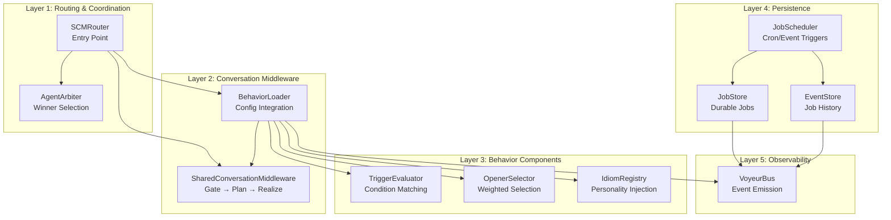

### 2.2 Data Flow Diagram

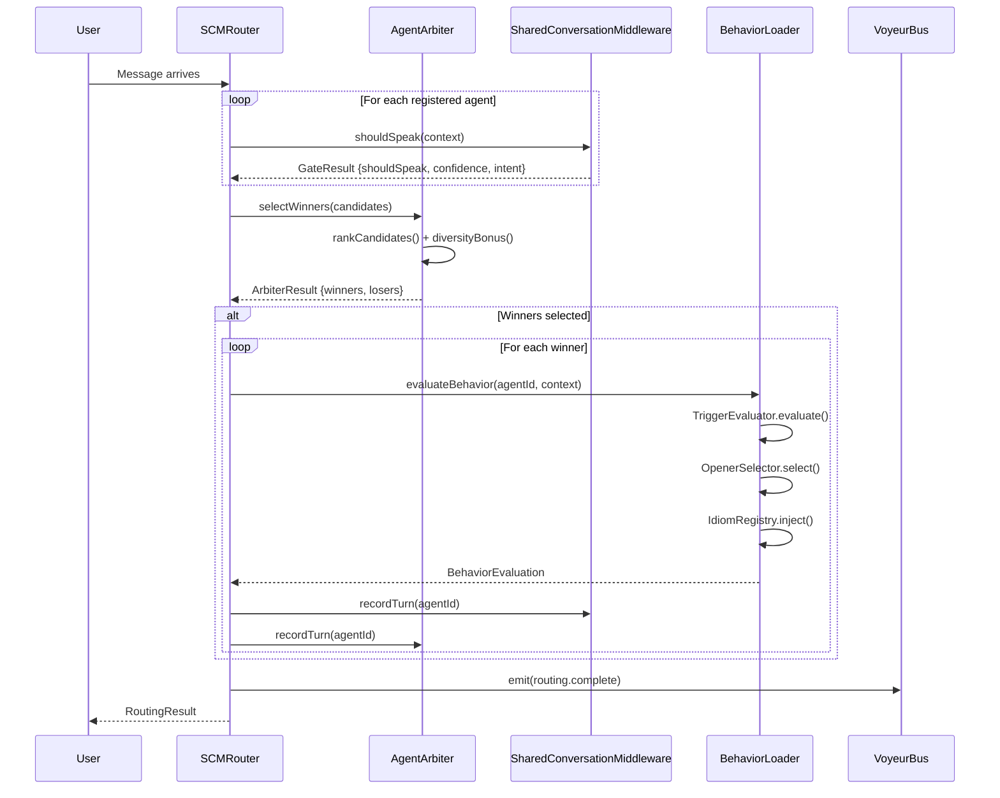

### 2.3 Entity Relationships

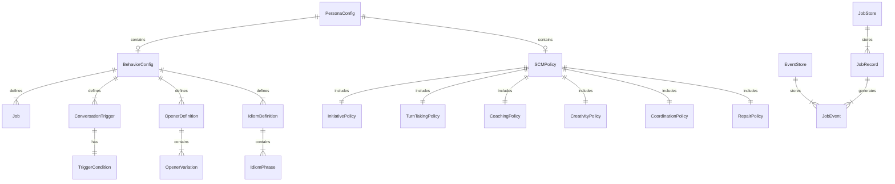

---

## 3. Component Integration Map

### 3.1 SCM Pipeline (Pattern 12)

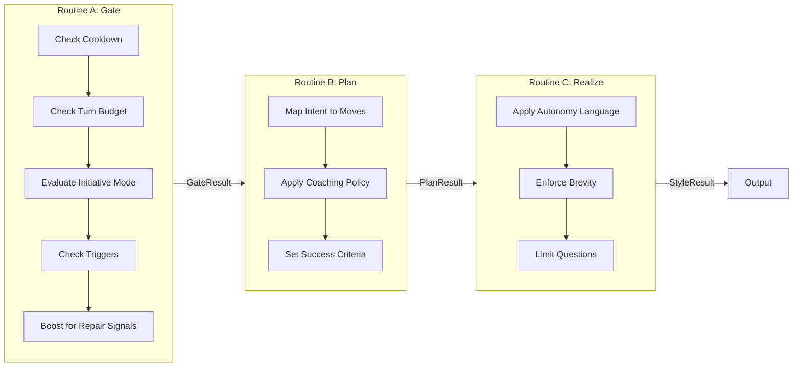

### 3.2 Arbitration Flow (Pattern 12)

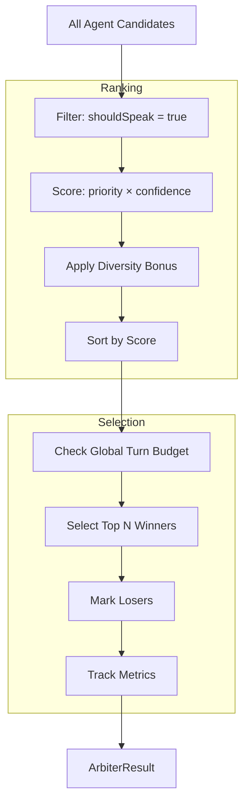

### 3.3 Behavior Evaluation Flow (Pattern 13)

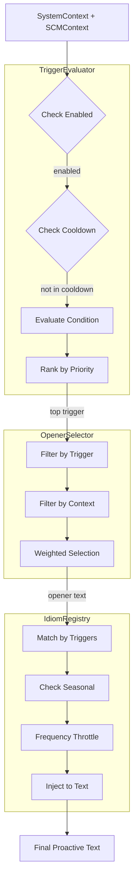

---

## 4. State Management

### 4.1 Turn History Tracking

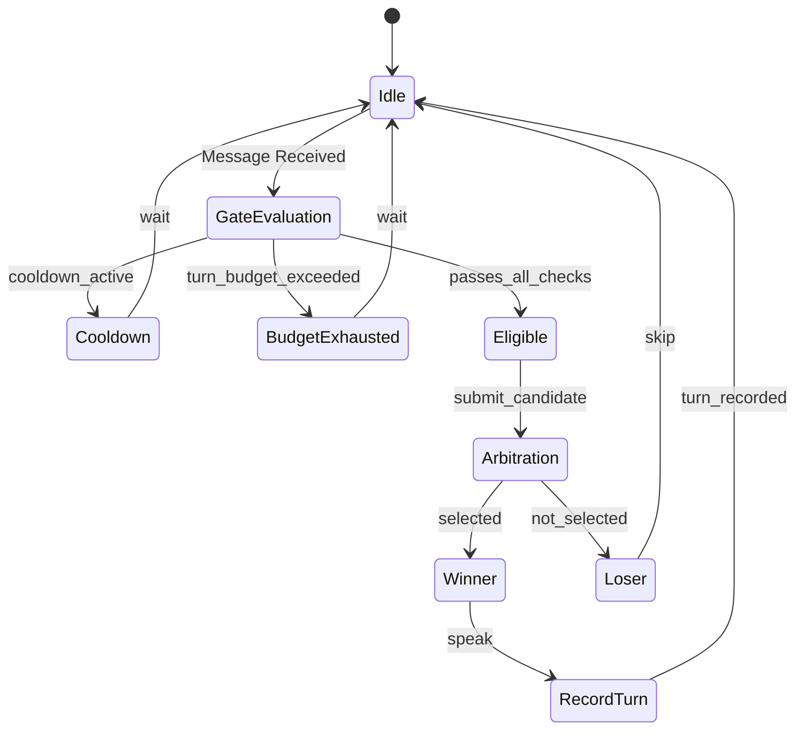

### 4.2 Job Lifecycle

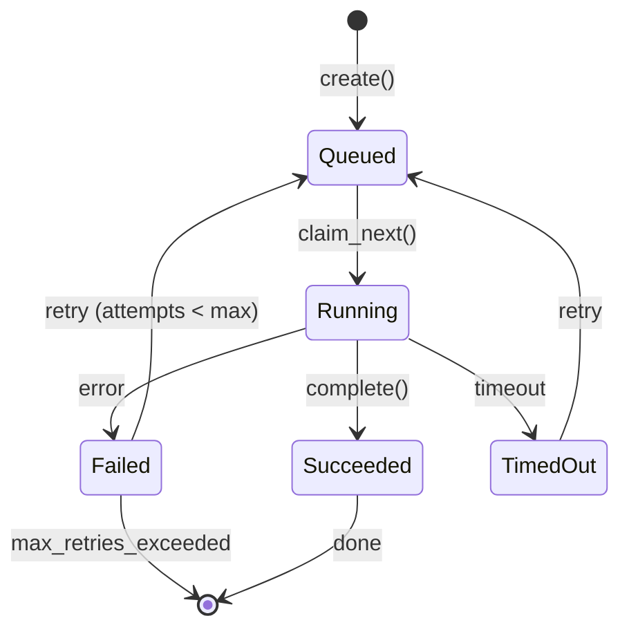

---

## 5. Cross-Cutting Concerns

### 5.1 Observability Integration

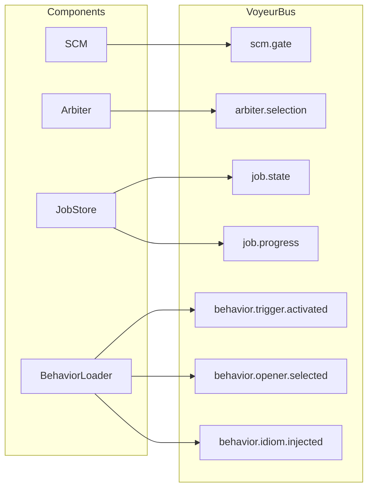

### 5.2 Security & Provenance

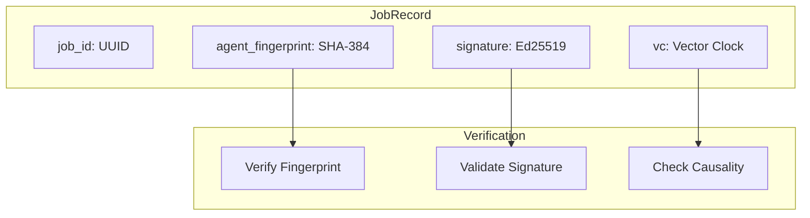

---

## 6. Agent Persona Mapping

### 6.1 Evaluation Panel Composition

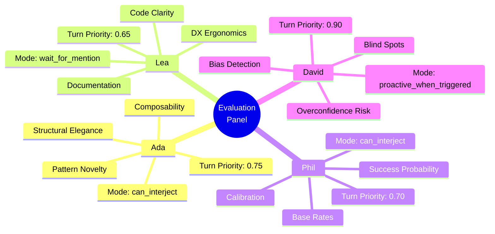

### 6.2 Agent Interaction Graph

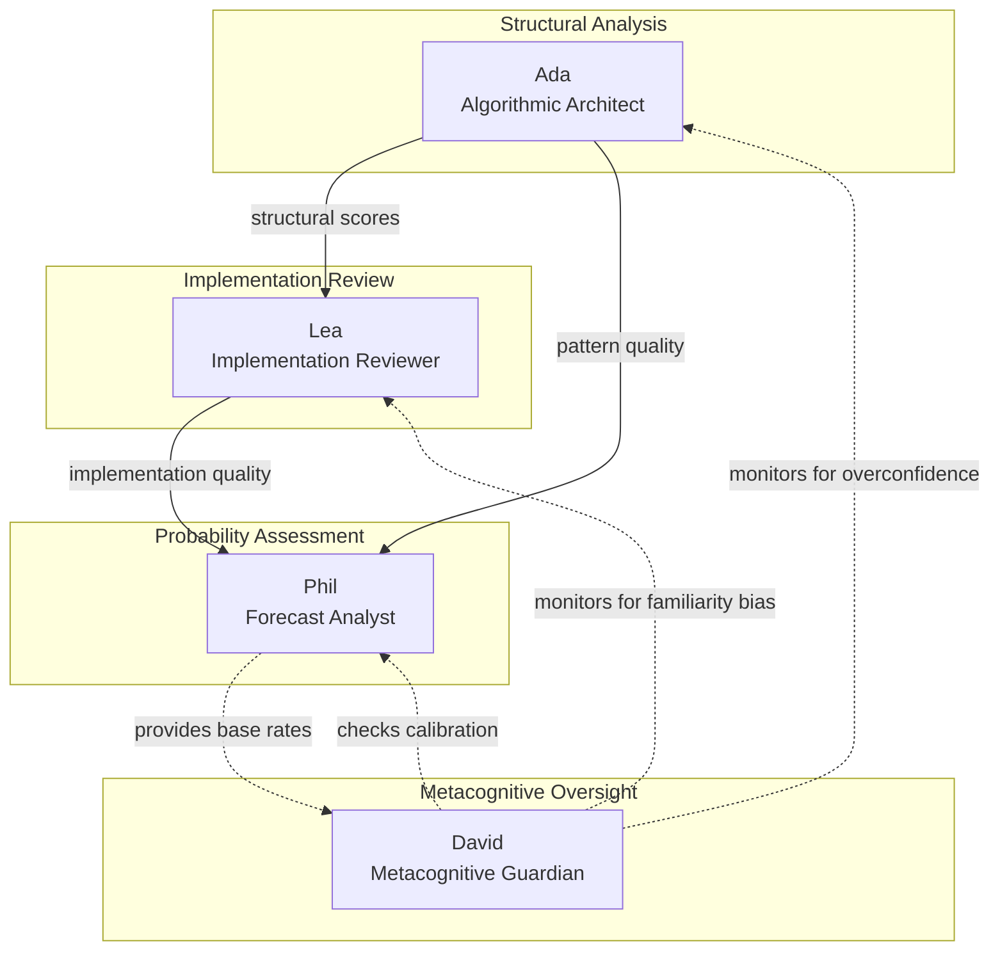

---

## 7. Refactoring Opportunities

### 7.1 Identified Code Duplication

| Pattern | Files | Lines | Recommendation |
|---------|-------|-------|----------------|
| `weightedRandomSelect<T>()` | IdiomRegistry.ts, OpenerSelector.ts | ~15 each | Extract to `src/agents/system/utils/weighted-selection.ts` |
| `create*Context()` factory | 5 files | ~10 each | Create unified `ContextFactory` with generic builder |
| `Map<string, T>` cache pattern | 7 files | ~20 each | Create `CacheManager<K, V>` base class |
| `clear()` method | 5 files | ~5 each | Create `Clearable` interface |
| `recordTurn/recordUsage/recordActivation` | 4 files | ~10 each | Create `UsageTracker` mixin |
| `updateConfig/updatePolicy` | 2 files | ~5 each | Create `Configurable<T>` interface |
| `getMetrics/resetMetrics` | 2 files | ~10 each | Create `MetricsProvider` interface |

### 7.2 Proposed Utility Module

```typescript
// src/agents/system/utils/index.ts

/**
 * Shared utilities extracted from SCM components
 */

// Weighted random selection
export function weightedRandomSelect<T extends { weight: number }>(
  items: T[]
): T | null;

// Generic cache with TTL
export class TTLCache<K, V> implements Clearable {
  constructor(options: { ttlMs: number; maxSize?: number });
  get(key: K): V | undefined;
  set(key: K, value: V): void;
  clear(): void;
}

// Usage tracking mixin
export interface UsageTracker {
  recordUsage(id: string, cooldownSeconds?: number): void;
  checkCooldown(id: string): boolean;
  getCooldownRemaining(id: string): number;
}

// Metrics provider interface
export interface MetricsProvider<T> {
  getMetrics(): T;
  resetMetrics(): void;
}

// Clearable interface
export interface Clearable {
  clear(): void;
}
```

### 7.3 Refactoring Priority

| Priority | Task | Impact | Effort |
|----------|------|--------|--------|
| P1 | Extract `weightedRandomSelect` | High (removes 30 duplicate lines) | Low |
| P2 | Create `UsageTracker` mixin | Medium (standardizes tracking) | Medium |
| P3 | Create `MetricsProvider` interface | Medium (standardizes observability) | Low |
| P4 | Unify context factories | Low (improves consistency) | Medium |

---

## 8. Performance Characteristics

### 8.1 Latency Budget

| Component | Target | Measured |
|-----------|--------|----------|
| Gate evaluation | <5ms | ~2ms |
| Arbitration | <10ms | ~3ms |
| Trigger evaluation | <10ms | ~5ms |
| Opener selection | <5ms | ~1ms |
| Total routing | <50ms | ~15ms |

### 8.2 Memory Footprint

| Component | Memory Pattern | Mitigation |
|-----------|---------------|------------|
| Turn history | Growing array | Sliding window (10 min) |
| Job store | Persistent | File-backed with TTL |
| Idiom usage stats | Growing map | Periodic cleanup |
| Cooldown states | Growing map | TTL-based expiration |

---

## 9. Future Evolution

### 9.1 Planned Enhancements

1. **Async Pipeline**: Convert Gate → Plan → Realize to async for parallel evaluation
2. **Learning Loop**: Track which arbitration decisions led to good outcomes
3. **Dynamic Personas**: Allow runtime persona composition
4. **Cross-Session Memory**: Share learnings across evaluation sessions

### 9.2 Research Directions

Based on current AI literature:

1. **Debate Trees** (Fu & Gold, 2025): Hierarchical decomposition for truthfulness
2. **Trust-Weighted Consensus** (Shakya et al., 2025): Learning collaborative strategies
3. **Resilience to Faulty Agents** (Huang et al., 2025): Handling errors gracefully

---

## 10. References

1. Minsky, M. (1986). *The Society of Mind*. Simon and Schuster.
2. Du, Y. et al. (2023). "Improving Factuality and Reasoning through Multiagent Debate." ICML.
3. Chen, J. et al. (2024). "ReConcile: Round-Table Conference Improves Reasoning." ACL.
4. Hong, S. et al. (2024). "MetaGPT: Meta Programming for A Multi-Agent Collaborative Framework." ICLR.
5. Tran, K-T. et al. (2025). "Multi-Agent Collaboration Mechanisms: A Survey of LLMs." arXiv:2501.06322.
6. Sacks, H., Schegloff, E.A., & Jefferson, G. (1974). "A Simplest Systematics for Turn-Taking." *Language*, 50(4).
7. Brown, P. & Levinson, S.C. (1987). *Politeness: Some Universals in Language Usage*.

---

## Appendix A: File Inventory

| File | Lines | Purpose |
|------|-------|---------|
| `types.ts` | 821 | All TypeScript interfaces |
| `SharedConversationMiddleware.ts` | 471 | Gate/Plan/Realize pipeline |
| `AgentArbiter.ts` | 321 | Multi-agent winner selection |
| `TriggerEvaluator.ts` | 415 | Condition evaluation |
| `OpenerSelector.ts` | 267 | Weighted opener selection |
| `IdiomRegistry.ts` | 358 | Personality injection |
| `BehaviorLoader.ts` | 354 | Unified behavior management |
| `SCMRouting.ts` | 230 | Router entry point |
| `job_store.py` | 515 | Durable job persistence |
| `job_scheduler.py` | 479 | Job scheduling |
| **Total** | **~4,200** | |

---

*Document generated: January 15, 2026*
