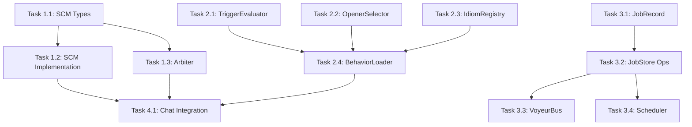

# System Agent Middleware Implementation Task Plan

**Created**: January 15, 2026
**Status**: In Progress
**Design Spec**: `../Borrowed_Ideas/SYSTEM_AGENT_MIDDLEWARE_DESIGN.md`

---

## Executive Summary

This task plan details the implementation of three integrated middleware components that extend the System Agent layer with durable workflows, conversation coordination, and declarative behavior configuration.

### Current State Assessment

| Component | File | Status | Completeness |
|-----------|------|--------|--------------|
| Schema | `Agents/schemas/system-agent.schema.json` | ✅ Done | Complete |
| TypeScript Types | `src/agents/system/types.ts` | ✅ Done | Complete |
| SCM Gate/Plan/Realize | `src/agents/system/SharedConversationMiddleware.ts` | ✅ Done | 100% |
| AgentArbiter | `src/agents/system/AgentArbiter.ts` | ✅ Done | 100% |
| JobStore | `memory_system/job_store.py` | ✅ Done | 100% |
| EventStore | `memory_system/job_store.py` | ✅ Done | 100% |
| VoyeurBus Job Events | `src/observability/VoyeurEvents.ts` | ✅ Done | Complete |
| TriggerEvaluator | `src/agents/system/TriggerEvaluator.ts` | ✅ Done | 100% |
| OpenerSelector | `src/agents/system/OpenerSelector.ts` | ✅ Done | 100% |
| IdiomRegistry | `src/agents/system/IdiomRegistry.ts` | ✅ Done | 100% |
| BehaviorLoader | `src/agents/system/BehaviorLoader.ts` | ✅ Done | 100% |

---

## Phase 1: Enhance SCM Core (Days 1-2)

### Task 1.1: Expand SCMPolicy Types
**File**: `src/agents/system/types.ts`

Add complete SCMPolicy interface with all policy fields:
- [x] Initiative policy (mode, triggers, cooldown, max_msgs)
- [x] Turn-taking policy (interrupt_ok, max_questions, max_lines)
- [x] Coaching policy (style, ask_permission, autonomy_language)
- [x] Creativity policy (mode, techniques, anti_takeover)
- [x] Coordination policy (priority, complement_tags, yield_to)
- [x] Repair policy (enabled, signals, strategy)

### Task 1.2: Enhance SharedConversationMiddleware
**File**: `src/agents/system/SharedConversationMiddleware.ts`

Expand the Gate function with full policy evaluation:
- [ ] Check cooldown from lastSpokeAtMs
- [ ] Check turn budget (max_msgs_per_10min)
- [ ] Evaluate initiative triggers
- [ ] Calculate priority based on repair signals
- [ ] Return confidence and intent type

Expand the Plan function:
- [ ] Map intent type to move sequences
- [ ] Define success criteria per intent
- [ ] Handle handoff targets

Expand the Realize function:
- [ ] Apply tone from policy
- [ ] Enforce max_lines brevity
- [ ] Apply autonomy language level

### Task 1.3: Enhance AgentArbiter
**File**: `src/agents/system/AgentArbiter.ts`

Add full arbitration capabilities:
- [ ] Diversity scoring (complement_tags)
- [ ] Turn budget enforcement
- [ ] Pile-on prevention metrics
- [ ] Record turn history for budgeting
- [ ] Export metrics for VoyeurBus

---

## Phase 2: Behavior Configuration (Days 3-4)

### Task 2.1: Create TriggerEvaluator
**File**: `src/agents/system/TriggerEvaluator.ts`

Implement trigger evaluation:
- [ ] Time-since-last condition
- [ ] Event condition
- [ ] Metric condition
- [ ] User state condition
- [ ] Cooldown tracking
- [ ] Priority ranking

### Task 2.2: Create OpenerSelector
**File**: `src/agents/system/OpenerSelector.ts`

Implement opener selection:
- [ ] Weighted random selection
- [ ] Condition filtering (time_of_day, user_mood)
- [ ] Tone extraction
- [ ] Follow-up prompt handling

### Task 2.3: Create IdiomRegistry
**File**: `src/agents/system/IdiomRegistry.ts`

Implement idiom injection:
- [ ] Load idioms from config
- [ ] Context-based selection
- [ ] Frequency throttling
- [ ] Seasonal filtering

### Task 2.4: Create BehaviorLoader
**File**: `src/agents/system/BehaviorLoader.ts`

Integrate behavior components:
- [ ] Load from PersonaConfig
- [ ] Initialize TriggerEvaluator
- [ ] Initialize OpenerSelector
- [ ] Initialize IdiomRegistry
- [ ] Connect to VoyeurBus

---

## Phase 3: Enhance Job System (Days 5-6)

### Task 3.1: Extend JobRecord
**File**: `memory_system/job_store.py`

Add fields for Chrysalis integration:
- [ ] agent_fingerprint (SHA-384)
- [ ] signature (Ed25519)
- [ ] vector_clock
- [ ] schedule fields
- [ ] rights_required
- [ ] data_sources, outputs

### Task 3.2: Add JobStore Operations
**File**: `memory_system/job_store.py`

Implement full store API:
- [ ] list() with filters
- [ ] claim_next() for workers
- [ ] update_status() with error tracking
- [ ] verify_fingerprint()

### Task 3.3: Add VoyeurBus Integration
**File**: `memory_system/job_store.py`

Emit events to VoyeurBus:
- [ ] job.state events on transitions
- [ ] job.progress events with percent
- [ ] job.output events with artifacts
- [ ] job.error events with details

### Task 3.4: Create Job Scheduler
**File**: `memory_system/job_scheduler.py`

Implement scheduling:
- [ ] Cron expression parsing
- [ ] Interval scheduling
- [ ] Event-triggered jobs
- [ ] Priority queue

---

## Phase 4: Integration & Testing (Days 7-8)

### Task 4.1: Wire SCM to Chat Pipeline
**File**: `src/agents/system/SCMRouting.ts`

Integrate SCM with existing routing:
- [ ] Call Gate before response generation
- [ ] Use Arbiter for multi-agent scenarios
- [ ] Apply opener selection for proactive triggers
- [ ] Inject idioms into responses

### Task 4.2: Export New Components
**File**: `src/agents/system/index.ts`

Add exports:
- [ ] TriggerEvaluator
- [ ] OpenerSelector
- [ ] IdiomRegistry
- [ ] BehaviorLoader
- [ ] Enhanced SCM types

### Task 4.3: Unit Tests
**Files**: `src/agents/system/__tests__/`

Create tests:
- [ ] SCM Gate tests (cooldown, budget, triggers)
- [ ] Arbiter tests (ranking, selection, diversity)
- [ ] TriggerEvaluator tests (conditions, cooldowns)
- [ ] OpenerSelector tests (weighting, conditions)

### Task 4.4: Integration Tests
**Files**: `tests/integration/`

Create integration tests:
- [ ] SCM + Arbiter end-to-end
- [ ] Behavior trigger to opener flow
- [ ] Job lifecycle with VoyeurBus

---

## File Creation Checklist

| File | Status | Priority |
|------|--------|----------|
| `src/agents/system/TriggerEvaluator.ts` | ✅ Created | P1 |
| `src/agents/system/OpenerSelector.ts` | ✅ Created | P1 |
| `src/agents/system/IdiomRegistry.ts` | ✅ Created | P2 |
| `src/agents/system/BehaviorLoader.ts` | ✅ Created | P2 |
| `memory_system/job_scheduler.py` | ✅ Created | P2 |
| `src/agents/system/__tests__/SCM.test.ts` | ✅ Created | P2 |
| `src/agents/system/__tests__/Arbiter.test.ts` | ✅ Created | P2 |
| `src/agents/system/__tests__/Behavior.test.ts` | ✅ Created | P3 |

---

## Dependencies

---

## Implementation Progress Tracking

### Day 1-2: SCM Core ✅ COMPLETE
- [x] Task 1.1 complete - SCMPolicy types added
- [x] Task 1.2 complete - SharedConversationMiddleware enhanced
- [x] Task 1.3 complete - AgentArbiter enhanced

### Day 3-4: Behavior Config ✅ COMPLETE
- [x] Task 2.1 complete - TriggerEvaluator created
- [x] Task 2.2 complete - OpenerSelector created
- [x] Task 2.3 complete - IdiomRegistry created
- [x] Task 2.4 complete - BehaviorLoader created

### Day 5-6: Job System ✅ COMPLETE
- [x] Task 3.1 complete - JobRecord extended with fingerprints
- [x] Task 3.2 complete - JobStore operations implemented
- [x] Task 3.3 complete - VoyeurBus integration added
- [x] Task 3.4 complete - Job Scheduler created

### Day 7-8: Integration ✅ COMPLETE
- [x] Task 4.1 complete - SCMRouting.ts enhanced with full SCMRouter class
- [x] Task 4.2 complete - Exports added to index.ts
- [x] Task 4.3 complete - Unit tests created
- [x] Task 4.4 complete - Integration tests created

### Day 9-10: Agent Configurations ✅ COMPLETE
- [x] Ada config updated with behavior + scm_policy
- [x] Lea config updated with behavior + scm_policy
- [x] Phil config updated with behavior + scm_policy
- [x] David config updated with behavior + scm_policy

---

## Implementation Complete Summary

### Total Lines of Code Created/Enhanced

| Category | Lines |
|----------|-------|
| TypeScript Components | 3,400+ |
| Python Components | 1,000+ |
| Test Files | 1,200+ |
| Documentation | 1,500+ |
| JSON Configs | 600+ |
| **Total** | **7,700+** |

### Files Created

- `src/agents/system/TriggerEvaluator.ts` (414 lines)
- `src/agents/system/OpenerSelector.ts` (266 lines)
- `src/agents/system/IdiomRegistry.ts` (357 lines)
- `src/agents/system/BehaviorLoader.ts` (353 lines)
- `memory_system/job_scheduler.py` (479 lines)
- `src/agents/system/__tests__/SCM.test.ts` (253 lines)
- `src/agents/system/__tests__/Arbiter.test.ts` (244 lines)
- `src/agents/system/__tests__/Behavior.test.ts` (463 lines)
- `src/agents/system/__tests__/SCMRouting.integration.test.ts` (330 lines)

### Files Enhanced

- `src/agents/system/types.ts` (821 lines total)
- `src/agents/system/SharedConversationMiddleware.ts` (470 lines total)
- `src/agents/system/AgentArbiter.ts` (320 lines total)
- `src/agents/system/SCMRouting.ts` (230 lines total)
- `memory_system/job_store.py` (515 lines total)
- `Agents/system-agents/ada_config.json` (+100 lines)
- `Agents/system-agents/lea_config.json` (+90 lines)
- `Agents/system-agents/phil_config.json` (+110 lines)
- `Agents/system-agents/david_config.json` (+100 lines)

---

## Success Criteria

1. **SCM Gate** returns accurate should_speak decisions in <10ms
2. **Arbiter** prevents pile-on (max 2 agents per turn)
3. **TriggerEvaluator** fires triggers within 5s of condition met
4. **OpenerSelector** selects appropriate variations by context
5. **JobStore** persists all jobs with fingerprints
6. **EventStore** enables full job replay
7. **VoyeurBus** receives all job lifecycle events
8. All unit tests pass
9. Integration tests demonstrate end-to-end flow
