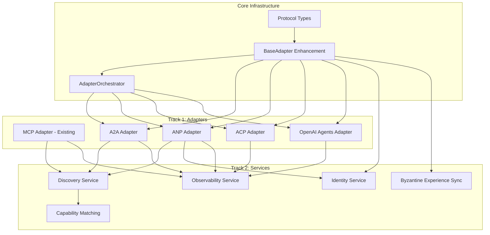

# Chrysalis Integration Platform - Technical Implementation Plan

**Document Version:** 1.0  
**Based on:** [`agentic-frameworks-network-protocols-research.md`](agentic-frameworks-network-protocols-research.md)  
**Date:** January 11, 2026  
**Status:** Engineering Specification

---

## Executive Summary

This document specifies a comprehensive technical implementation plan for the Chrysalis Integration Platform, enabling multi-protocol interoperability across the emerging agentic AI ecosystem. The plan addresses two primary implementation tracks:

1. **Track 1: Adapter Development** - Protocol adapters for MCP, A2A, ANP, ACP, and OpenAI Agents SDK
2. **Track 2: Value-Added Services** - Infrastructure services addressing ecosystem fragmentation, identity, discovery, and observability

The implementation follows a phased approach with clear dependencies, complexity classifications, and acceptance criteria, building toward full multi-protocol orchestration capability.

---

## Table of Contents

1. [Architectural Overview](#1-architectural-overview)
2. [Track 1: Protocol Adapter Development](#2-track-1-protocol-adapter-development)
3. [Track 2: Value-Added Services](#3-track-2-value-added-services)
4. [Dependency Graph and Critical Path](#4-dependency-graph-and-critical-path)
5. [Phased Implementation Roadmap](#5-phased-implementation-roadmap)
6. [Risk Assessment and Mitigation](#6-risk-assessment-and-mitigation)
7. [Appendices](#7-appendices)

---

## 1. Architectural Overview

### 1.1 Current Chrysalis Adapter Architecture

The existing [`src/adapters/base-adapter.ts`](../src/adapters/base-adapter.ts:252) defines the foundational adapter pattern:

```typescript
// Current adapter interface contract
abstract class BaseAdapter {
  abstract readonly framework: AgentFramework;
  abstract readonly name: string;
  abstract readonly version: string;
  
  abstract toCanonical(native: NativeAgent): Promise<CanonicalAgent>;
  abstract fromCanonical(canonical: CanonicalAgent): Promise<NativeAgent>;
  abstract validateNative(native: NativeAgent): ValidationResult;
  abstract getFieldMappings(): FieldMapping[];
}
```

**Existing Adapters:**
- [`MCPAdapter.ts`](../src/adapters/MCPAdapter.ts) - Anthropic MCP integration
- [`CrewAIAdapter.ts`](../src/adapters/CrewAIAdapter.ts) - CrewAI role-playing agents
- [`ElizaOSAdapter.ts`](../src/adapters/ElizaOSAdapter.ts) - ElizaOS integration
- [`langchain-adapter.ts`](../src/adapters/langchain-adapter.ts) - LangChain agents
- [`lmos-adapter.ts`](../src/adapters/lmos-adapter.ts) - Eclipse LMOS
- [`usa-adapter.ts`](../src/adapters/usa-adapter.ts) - Uniform Semantic Agent

### 1.2 Extended Architecture for Multi-Protocol Support

```
┌─────────────────────────────────────────────────────────────────────────────┐
│                     Chrysalis Integration Platform                           │
├─────────────────────────────────────────────────────────────────────────────┤
│                                                                             │
│  ┌──────────────────────────────────────────────────────────────────────┐  │
│  │                      Value-Added Services Layer                       │  │
│  │  ┌─────────────┐ ┌─────────────┐ ┌─────────────┐ ┌─────────────────┐ │  │
│  │  │  Discovery  │ │  Identity   │ │ Observab-   │ │   Capability    │ │  │
│  │  │   Service   │ │   Service   │ │   ility     │ │    Matching     │ │  │
│  │  └─────────────┘ └─────────────┘ └─────────────┘ └─────────────────┘ │  │
│  └──────────────────────────────────────────────────────────────────────┘  │
│                                    │                                        │
│  ┌──────────────────────────────────────────────────────────────────────┐  │
│  │                    Protocol Abstraction Layer                         │  │
│  │  ┌─────────────────────────────────────────────────────────────────┐ │  │
│  │  │              AdapterOrchestrator - Runtime Selection             │ │  │
│  │  │         Graceful Degradation / Protocol Fallback Logic          │ │  │
│  │  └─────────────────────────────────────────────────────────────────┘ │  │
│  └──────────────────────────────────────────────────────────────────────┘  │
│                                    │                                        │
│  ┌──────────────────────────────────────────────────────────────────────┐  │
│  │                       Protocol Adapter Layer                          │  │
│  │  ┌────────┐ ┌────────┐ ┌────────┐ ┌────────┐ ┌────────┐ ┌────────┐  │  │
│  │  │  MCP   │ │  A2A   │ │  ANP   │ │  ACP   │ │ OpenAI │ │ AGNTCY │  │  │
│  │  │Adapter │ │Adapter │ │Adapter │ │Adapter │ │ Agents │ │ Bridge │  │  │
│  │  └────────┘ └────────┘ └────────┘ └────────┘ └────────┘ └────────┘  │  │
│  └──────────────────────────────────────────────────────────────────────┘  │
│                                    │                                        │
│  ┌──────────────────────────────────────────────────────────────────────┐  │
│  │                   Chrysalis Core (USA v2)                             │  │
│  │  ┌──────────────┐ ┌──────────────┐ ┌──────────────┐ ┌──────────────┐ │  │
│  │  │  Byzantine   │ │    CRDTs     │ │   Gossip     │ │  Cognitive   │ │  │
│  │  │     FT       │ │   Merging    │ │   Protocol   │ │   Memory     │ │  │
│  │  └──────────────┘ └──────────────┘ └──────────────┘ └──────────────┘ │  │
│  └──────────────────────────────────────────────────────────────────────┘  │
└─────────────────────────────────────────────────────────────────────────────┘
```

### 1.3 Design Principles

1. **Interface Segregation**: Each adapter implements a focused contract
2. **Dependency Inversion**: Adapters depend on abstractions, not concrete protocols
3. **Graceful Degradation**: System operates with reduced functionality when protocols unavailable
4. **Extension Preservation**: Framework-specific data preserved through extension mechanisms
5. **Fidelity Tracking**: Every translation tracks semantic preservation metrics

---

## 2. Track 1: Protocol Adapter Development

### 2.1 Adapter Abstraction Layer Architecture

#### 2.1.1 Extended Type Definitions

**File:** `src/adapters/protocol-types.ts`

```typescript
/**
 * Extended AgentFramework enumeration for new protocols
 */
export type AgentFramework = 
  | 'usa'           // Chrysalis Uniform Semantic Agent
  | 'mcp'           // Anthropic Model Context Protocol
  | 'a2a'           // Google Agent2Agent Protocol
  | 'anp'           // Agent Network Protocol
  | 'acp'           // IBM Agent Communication Protocol
  | 'openai-agents' // OpenAI Agents SDK
  | 'langchain'     // LangChain Agent
  | 'crewai'        // CrewAI
  | 'autogen'       // Microsoft AutoGen
  | 'lmos'          // Eclipse LMOS
  | 'semantic-kernel'; // Microsoft Semantic Kernel

/**
 * Protocol capability declaration
 */
export interface ProtocolCapability {
  /** Protocol identifier */
  protocol: AgentFramework;
  /** Protocol version supported */
  version: string;
  /** Capability level: full, partial, read-only */
  level: 'full' | 'partial' | 'read-only';
  /** Features supported by this adapter */
  features: ProtocolFeature[];
}

export type ProtocolFeature = 
  | 'agent-discovery'
  | 'task-delegation'
  | 'tool-invocation'
  | 'resource-access'
  | 'streaming'
  | 'authentication'
  | 'identity-verification'
  | 'capability-negotiation';

/**
 * Protocol health status
 */
export interface ProtocolHealth {
  protocol: AgentFramework;
  available: boolean;
  latencyMs?: number;
  lastCheck: Date;
  errorCount: number;
  consecutiveFailures: number;
}

/**
 * Adapter selection strategy
 */
export type AdapterSelectionStrategy = 
  | 'prefer-native'      // Use native protocol when available
  | 'prefer-performance' // Select lowest latency
  | 'prefer-fidelity'    // Select highest semantic preservation
  | 'fallback-chain';    // Try protocols in priority order
```

#### 2.1.2 AdapterOrchestrator

**File:** `src/adapters/AdapterOrchestrator.ts`

```typescript
/**
 * Runtime protocol selection and graceful degradation
 */
export interface AdapterOrchestratorConfig {
  /** Adapter selection strategy */
  strategy: AdapterSelectionStrategy;
  /** Protocol priority order for fallback */
  protocolPriority: AgentFramework[];
  /** Health check interval in milliseconds */
  healthCheckIntervalMs: number;
  /** Circuit breaker threshold */
  circuitBreakerThreshold: number;
  /** Enable automatic fallback */
  enableFallback: boolean;
}

export interface AdapterOrchestrator {
  /**
   * Select optimal adapter for a target protocol
   */
  selectAdapter(
    target: AgentFramework,
    context?: SelectionContext
  ): Promise<BaseAdapter | null>;
  
  /**
   * Execute with automatic fallback on failure
   */
  executeWithFallback<T>(
    operation: AdapterOperation<T>,
    fallbackChain: AgentFramework[]
  ): Promise<T>;
  
  /**
   * Get health status of all protocols
   */
  getProtocolHealth(): Map<AgentFramework, ProtocolHealth>;
  
  /**
   * Register adapter for a protocol
   */
  registerAdapter(adapter: BaseAdapter): void;
  
  /**
   * Get supported protocol capabilities
   */
  getCapabilities(): ProtocolCapability[];
}
```

---

### 2.2 A2A Adapter (Google Agent2Agent Protocol)

#### 2.2.1 Interface Contract

**File:** `src/adapters/a2a-adapter.ts`

| Property | Type | Description |
|----------|------|-------------|
| `framework` | `'a2a'` | Protocol identifier |
| `name` | `string` | `'Google A2A Adapter'` |
| `version` | `string` | `'1.0.0'` |
| `extensionNamespace` | `string` | `'https://a2a.dev/ns#'` |

#### 2.2.2 A2A Type Definitions

```typescript
/**
 * A2A Agent Card - capability discovery document
 */
export interface A2AAgentCard {
  name: string;
  description?: string;
  url: string;
  provider?: {
    organization: string;
    contactEmail?: string;
  };
  version: string;
  documentationUrl?: string;
  capabilities: {
    streaming?: boolean;
    pushNotifications?: boolean;
    stateTransitionHistory?: boolean;
  };
  authentication: {
    schemes: A2AAuthScheme[];
  };
  defaultInputModes: A2AInputMode[];
  defaultOutputModes: A2AOutputMode[];
  skills: A2ASkill[];
}

/**
 * A2A Skill declaration
 */
export interface A2ASkill {
  id: string;
  name: string;
  description?: string;
  tags?: string[];
  examples?: A2AExample[];
  inputModes?: A2AInputMode[];
  outputModes?: A2AOutputMode[];
}

/**
 * A2A Task message (JSON-RPC 2.0)
 */
export interface A2ATaskMessage {
  jsonrpc: '2.0';
  method: A2AMethod;
  params: A2ATaskParams;
  id: string;
}

export type A2AMethod = 
  | 'tasks/send'
  | 'tasks/get'
  | 'tasks/cancel'
  | 'tasks/list';

export interface A2ATaskParams {
  taskId: string;
  message?: {
    role: 'user' | 'agent';
    parts: A2AMessagePart[];
  };
  state?: A2ATaskState;
}

export type A2ATaskState = 
  | 'submitted'
  | 'working'
  | 'input-required'
  | 'completed'
  | 'failed'
  | 'canceled';
```

#### 2.2.3 Data Transformation Layer

| Source Path (A2A) | Target Predicate (Chrysalis) | Transform | Bidirectional |
|-------------------|------------------------------|-----------|---------------|
| `name` | `chrysalis:name` | `String()` | ✓ |
| `description` | `chrysalis:description` | `String()` | ✓ |
| `url` | `a2a:agentUrl` | URI | ✓ |
| `version` | `chrysalis:version` | `String()` | ✓ |
| `skills[*].name` | `chrysalis:hasCapability` | Map to Capability | ✓ |
| `skills[*].inputModes` | `a2a:inputModes` | JSON Extension | ✓ |
| `authentication.schemes` | `chrysalis:authScheme` | Map to Auth | ✓ |
| `capabilities.streaming` | `chrysalis:supportsStreaming` | Boolean | ✓ |

#### 2.2.4 Authentication Handling

```typescript
export interface A2AAuthHandler {
  /**
   * Resolve authentication credentials for A2A endpoint
   */
  resolveCredentials(
    agentCard: A2AAgentCard,
    context: AuthContext
  ): Promise<A2ACredentials>;
  
  /**
   * Validate A2A authentication response
   */
  validateAuthentication(
    response: A2AResponse,
    expectedScheme: A2AAuthScheme
  ): ValidationResult;
  
  /**
   * Supported authentication schemes
   */
  supportedSchemes: A2AAuthScheme[];
}

export type A2AAuthScheme = 
  | { type: 'none' }
  | { type: 'bearer'; tokenUrl?: string }
  | { type: 'oauth2'; flows: OAuth2Flows }
  | { type: 'apiKey'; header: string };
```

#### 2.2.5 Error Propagation Patterns

```typescript
export class A2AError extends Error {
  constructor(
    public code: A2AErrorCode,
    message: string,
    public taskId?: string,
    public retryable: boolean = false
  ) {
    super(message);
  }
}

export enum A2AErrorCode {
  TASK_NOT_FOUND = 'TASK_NOT_FOUND',
  INVALID_TASK_STATE = 'INVALID_TASK_STATE',
  SKILL_NOT_FOUND = 'SKILL_NOT_FOUND',
  AUTHENTICATION_REQUIRED = 'AUTHENTICATION_REQUIRED',
  RATE_LIMITED = 'RATE_LIMITED',
  AGENT_UNAVAILABLE = 'AGENT_UNAVAILABLE',
  PROTOCOL_ERROR = 'PROTOCOL_ERROR'
}
```

#### 2.2.6 Version Compatibility Matrix

| A2A Version | Adapter Version | Compatibility | Notes |
|-------------|-----------------|---------------|-------|
| 1.0.0 | 1.0.x | Full | Initial release |
| 1.1.0 | 1.0.x | Partial | New streaming features |
| 2.0.0 | 2.0.x | Full | Breaking changes |

#### 2.2.7 Implementation Specification

| Attribute | Value |
|-----------|-------|
| **Complexity** | Medium-High |
| **Prerequisites** | BaseAdapter, AdapterOrchestrator |
| **External Dependencies** | `@a2aproject/a2a-python` SDK, JSON-RPC 2.0 library |
| **Estimated LOC** | 1,200-1,500 |
| **Test Coverage Target** | 90% |

**Integration Points:**
- [`src/adapters/base-adapter.ts`](../src/adapters/base-adapter.ts) - BaseAdapter extension
- [`src/core/UniformSemanticAgentV2.ts`](../src/core/UniformSemanticAgentV2.ts) - USA type mapping
- A2A SDK HTTP client for JSON-RPC communication

**Acceptance Criteria:**
- [ ] Agent Card ↔ CanonicalAgent round-trip with ≥95% fidelity
- [ ] Task lifecycle (create, update, complete, cancel) functional
- [ ] Skill invocation via Chrysalis capability system
- [ ] Authentication for all A2A auth schemes
- [ ] Streaming support for long-running tasks
- [ ] Error mapping to Chrysalis error taxonomy
- [ ] Unit tests: 50+, Integration tests: 15+

---

### 2.3 ANP Adapter (Agent Network Protocol)

#### 2.3.1 Interface Contract

**File:** `src/adapters/anp-adapter.ts`

| Property | Type | Description |
|----------|------|-------------|
| `framework` | `'anp'` | Protocol identifier |
| `name` | `string` | `'Agent Network Protocol Adapter'` |
| `version` | `string` | `'1.0.0'` |
| `extensionNamespace` | `string` | `'https://agent-network-protocol.com/ns#'` |

#### 2.3.2 ANP Type Definitions

```typescript
/**
 * ANP Agent Description (W3C DID-based identity)
 */
export interface ANPAgentDescription {
  /** W3C DID identifier */
  did: string;
  /** DID Document */
  didDocument: DIDDocument;
  /** Agent capabilities */
  capabilities: ANPCapability[];
  /** Supported protocols */
  protocols: ANPProtocolDeclaration[];
  /** Service endpoints */
  services: ANPServiceEndpoint[];
  /** Agent metadata */
  metadata: ANPAgentMetadata;
}

/**
 * W3C DID Document (subset for ANP)
 */
export interface DIDDocument {
  '@context': string[];
  id: string;
  verificationMethod: VerificationMethod[];
  authentication: string[];
  service?: ServiceEndpoint[];
}

/**
 * ANP Meta-Protocol negotiation
 */
export interface ANPMetaProtocol {
  /** Initiate protocol negotiation */
  negotiate(
    targetDid: string,
    requiredCapabilities: ANPCapability[]
  ): Promise<ANPNegotiationResult>;
  
  /** Get supported protocols for target agent */
  getSupportedProtocols(targetDid: string): Promise<ANPProtocolDeclaration[]>;
}

/**
 * ANP Discovery Protocol
 */
export interface ANPDiscovery {
  /** Discover agents by capability */
  discoverByCapability(
    capability: ANPCapability,
    options?: DiscoveryOptions
  ): Promise<ANPAgentDescription[]>;
  
  /** Resolve agent by DID */
  resolveAgent(did: string): Promise<ANPAgentDescription | null>;
  
  /** Register agent in discovery network */
  registerAgent(description: ANPAgentDescription): Promise<void>;
}
```

#### 2.3.3 Data Transformation Layer

| Source Path (ANP) | Target Predicate (Chrysalis) | Transform | Notes |
|-------------------|------------------------------|-----------|-------|
| `did` | `chrysalis:hasIdentity` | DID → Identity node | W3C DID format |
| `didDocument.verificationMethod` | `chrysalis:verificationMethod` | Ed25519 mapping | Align with Chrysalis signatures |
| `capabilities[*]` | `chrysalis:hasCapability` | Capability mapping | Semantic matching |
| `protocols[*]` | `anp:supportsProtocol` | Protocol URI | Extension |
| `services[*].serviceEndpoint` | `chrysalis:serviceEndpoint` | URI | Standard mapping |
| `metadata.name` | `chrysalis:name` | String | Direct |

#### 2.3.4 Identity Integration

ANP's W3C DID identity system integrates with Chrysalis's existing Ed25519 signature infrastructure:

```typescript
export interface ANPIdentityBridge {
  /**
   * Generate ANP DID from Chrysalis identity
   */
  chrysalisToANPDid(
    chrysalisFingerprint: string,
    ed25519PublicKey: Uint8Array
  ): Promise<string>;
  
  /**
   * Resolve Chrysalis identity from ANP DID
   */
  anpDidToChrysalis(
    did: string
  ): Promise<ChrysalisIdentity | null>;
  
  /**
   * Verify ANP signature using Chrysalis verification
   */
  verifyANPSignature(
    message: Uint8Array,
    signature: Uint8Array,
    did: string
  ): Promise<boolean>;
}
```

#### 2.3.5 Implementation Specification

| Attribute | Value |
|-----------|-------|
| **Complexity** | High |
| **Prerequisites** | BaseAdapter, W3C DID resolver, Ed25519 integration |
| **External Dependencies** | `did-resolver`, `did:wba` method implementation |
| **Estimated LOC** | 1,500-1,800 |
| **Test Coverage Target** | 85% |

**Acceptance Criteria:**
- [ ] DID generation from Chrysalis Ed25519 keys
- [ ] DID resolution for did:wba method
- [ ] Capability description ↔ Chrysalis mapping
- [ ] Meta-protocol negotiation functional
- [ ] Agent discovery by capability
- [ ] Signature verification bridge
- [ ] Unit tests: 60+, Integration tests: 20+

---

### 2.4 ACP Adapter (IBM Agent Communication Protocol)

#### 2.4.1 Interface Contract

**File:** `src/adapters/acp-adapter.ts`

| Property | Type | Description |
|----------|------|-------------|
| `framework` | `'acp'` | Protocol identifier |
| `name` | `string` | `'IBM ACP Adapter'` |
| `version` | `string` | `'1.0.0'` |
| `extensionNamespace` | `string` | `'https://ibm.com/acp/ns#'` |

#### 2.4.2 ACP Type Definitions

```typescript
/**
 * ACP Agent Definition
 */
export interface ACPAgentDefinition {
  id: string;
  name: string;
  version: string;
  description?: string;
  capabilities: ACPCapability[];
  endpoints: ACPEndpoint[];
  security: ACPSecurityConfig;
  metadata?: Record<string, unknown>;
}

/**
 * ACP Message format
 */
export interface ACPMessage {
  messageId: string;
  correlationId?: string;
  timestamp: string;
  sender: string;
  receiver: string;
  type: ACPMessageType;
  payload: unknown;
  headers?: Record<string, string>;
}

export type ACPMessageType = 
  | 'request'
  | 'response'
  | 'notification'
  | 'error';
```

#### 2.4.3 Implementation Specification

| Attribute | Value |
|-----------|-------|
| **Complexity** | Medium |
| **Prerequisites** | BaseAdapter |
| **External Dependencies** | IBM BeeAI SDK (when available) |
| **Estimated LOC** | 800-1,000 |
| **Test Coverage Target** | 85% |

**Acceptance Criteria:**
- [ ] Agent definition ↔ CanonicalAgent mapping
- [ ] Message format translation
- [ ] Security configuration handling
- [ ] Enterprise audit logging integration
- [ ] Unit tests: 40+, Integration tests: 10+

---

### 2.5 OpenAI Agents SDK Adapter

#### 2.5.1 Interface Contract

**File:** `src/adapters/openai-agents-adapter.ts`

| Property | Type | Description |
|----------|------|-------------|
| `framework` | `'openai-agents'` | Protocol identifier |
| `name` | `string` | `'OpenAI Agents SDK Adapter'` |
| `version` | `string` | `'1.0.0'` |
| `extensionNamespace` | `string` | `'https://platform.openai.com/agents/ns#'` |

#### 2.5.2 OpenAI Agents Type Definitions

```typescript
/**
 * OpenAI Agent definition
 */
export interface OpenAIAgent {
  name: string;
  instructions: string;
  model: string;
  tools: OpenAITool[];
  handoffs?: OpenAIHandoff[];
  guardrails?: OpenAIGuardrail[];
}

/**
 * OpenAI Tool definition
 */
export interface OpenAITool {
  type: 'function' | 'code_interpreter' | 'file_search' | 'handoff';
  function?: {
    name: string;
    description: string;
    parameters: JSONSchema;
  };
}

/**
 * Agent handoff for multi-agent patterns
 */
export interface OpenAIHandoff {
  agent: string;
  trigger: string;
  description: string;
}
```

#### 2.5.3 Implementation Specification

| Attribute | Value |
|-----------|-------|
| **Complexity** | Medium |
| **Prerequisites** | BaseAdapter, MCP adapter (for tool interop) |
| **External Dependencies** | `openai` Python/Node SDK |
| **Estimated LOC** | 900-1,100 |
| **Test Coverage Target** | 90% |

**Acceptance Criteria:**
- [ ] Agent ↔ CanonicalAgent round-trip
- [ ] Tool definition mapping to Chrysalis capabilities
- [ ] Handoff pattern translation
- [ ] Guardrail configuration preservation
- [ ] Function calling integration
- [ ] Unit tests: 45+, Integration tests: 12+

---

### 2.6 Protocol Version Compatibility Matrix

| Adapter | Protocol Version | Min SDK Version | Breaking Changes |
|---------|------------------|-----------------|------------------|
| MCP | 1.0.x | python-sdk 1.0 | None |
| A2A | 1.0.x | a2a-python 1.0 | None |
| ANP | 0.9.x | - | Specification evolving |
| ACP | 1.0.x | BeeAI 1.0 | None |
| OpenAI | 1.0.x | openai 1.50+ | Agents SDK stable |

---

## 3. Track 2: Value-Added Services

### 3.1 Service Evaluation Matrix

| Service | Market Need | Technical Feasibility | Competitive Differentiation | Protocol Gap Addressed | Priority |
|---------|-------------|----------------------|----------------------------|------------------------|----------|
| Cross-Protocol Discovery | High | Medium | High | Ecosystem fragmentation | P0 |
| Decentralized Identity | High | High | Very High | Agent trust/identity | P0 |
| Multi-Protocol Observability | Medium | High | Medium | Debugging complexity | P1 |
| Capability Semantic Matching | Medium | Medium | High | Interoperability | P1 |
| Byzantine Experience Sync | Medium | High | Very High | Unique Chrysalis capability | P2 |

### 3.2 Cross-Protocol Agent Discovery Service

#### 3.2.1 Service Overview

**Purpose:** Unified discovery interface across MCP registry, A2A Agent Cards, ANP DID resolution, and AGNTCY directory.

**Market Need:** Agents built on different protocols cannot discover each other, creating ecosystem silos.

**Competitive Differentiation:** First unified discovery service spanning all major protocols.

#### 3.2.2 Technical Specification

```typescript
/**
 * Unified Discovery Service Interface
 */
export interface CrossProtocolDiscoveryService {
  /**
   * Discover agents by capability across all protocols
   */
  discoverByCapability(
    capability: CapabilityQuery,
    options?: DiscoveryOptions
  ): Promise<DiscoveredAgent[]>;
  
  /**
   * Discover agents by semantic similarity
   */
  discoverBySemantic(
    description: string,
    threshold?: number
  ): Promise<DiscoveredAgent[]>;
  
  /**
   * Resolve agent by protocol-specific identifier
   */
  resolveAgent(
    identifier: string,
    protocol?: AgentFramework
  ): Promise<DiscoveredAgent | null>;
  
  /**
   * Register Chrysalis agent in all supported registries
   */
  registerAgent(
    agent: CanonicalAgent,
    targetProtocols: AgentFramework[]
  ): Promise<RegistrationResult[]>;
  
  /**
   * Get health status of discovery backends
   */
  getBackendHealth(): Map<AgentFramework, HealthStatus>;
}

/**
 * Unified discovery result
 */
export interface DiscoveredAgent {
  /** Chrysalis canonical representation */
  canonical: CanonicalAgent;
  /** Source protocol */
  sourceProtocol: AgentFramework;
  /** Protocol-specific identifier */
  protocolId: string;
  /** Discovery timestamp */
  discoveredAt: Date;
  /** Confidence score (0.0 - 1.0) */
  confidence: number;
  /** Capability match score */
  matchScore?: number;
}
```

#### 3.2.3 Discovery Backend Integration

| Backend | Protocol | Integration Method | Caching Strategy |
|---------|----------|-------------------|------------------|
| MCP Registry | MCP | HTTP API | 5 minute TTL |
| A2A Agent Cards | A2A | Well-known URL fetch | 10 minute TTL |
| ANP DID Resolver | ANP | DID resolution | Indefinite (immutable) |
| AGNTCY Directory | AGNTCY | gRPC API | 5 minute TTL |

#### 3.2.4 Implementation Specification

| Attribute | Value |
|-----------|-------|
| **Complexity** | High |
| **Prerequisites** | All protocol adapters, caching infrastructure |
| **External Dependencies** | Redis/Memcached, HTTP client, gRPC client |
| **Estimated LOC** | 2,000-2,500 |
| **Test Coverage Target** | 85% |

**Acceptance Criteria:**
- [ ] Unified query across 4+ discovery backends
- [ ] Semantic similarity search with ≥80% relevance
- [ ] Registration to all supported registries
- [ ] Response latency <500ms (cached), <2s (uncached)
- [ ] Graceful degradation when backends unavailable
- [ ] Unit tests: 60+, Integration tests: 25+

---

### 3.3 Decentralized Identity Service

#### 3.3.1 Service Overview

**Purpose:** Bridge between Chrysalis Ed25519 identity system and ANP W3C DID, providing unified agent identity across protocols.

**Market Need:** Agents lack consistent identity across platforms, preventing trust establishment.

**Competitive Differentiation:** Only solution bridging decentralized (ANP) and federated (A2A, MCP) identity models.

#### 3.3.2 Technical Specification

```typescript
/**
 * Decentralized Identity Service Interface
 */
export interface DecentralizedIdentityService {
  /**
   * Generate W3C DID from Chrysalis identity
   */
  generateDID(
    chrysalisIdentity: ChrysalisIdentity,
    method?: DIDMethod
  ): Promise<DIDGenerationResult>;
  
  /**
   * Resolve identity from any supported identifier
   */
  resolveIdentity(
    identifier: string | DID | ChrysalisFingerprint
  ): Promise<UnifiedIdentity | null>;
  
  /**
   * Verify signature across identity systems
   */
  verifySignature(
    message: Uint8Array,
    signature: Uint8Array,
    signer: UnifiedIdentity
  ): Promise<VerificationResult>;
  
  /**
   * Issue verifiable credential
   */
  issueCredential(
    subject: UnifiedIdentity,
    claims: CredentialClaims
  ): Promise<VerifiableCredential>;
  
  /**
   * Verify credential chain
   */
  verifyCredential(
    credential: VerifiableCredential
  ): Promise<CredentialVerificationResult>;
}

/**
 * Unified identity spanning protocols
 */
export interface UnifiedIdentity {
  /** Chrysalis fingerprint (primary) */
  chrysalisFingerprint: string;
  /** W3C DID (ANP) */
  did?: string;
  /** Public key (Ed25519) */
  publicKey: Uint8Array;
  /** Key derivation path */
  keyDerivation?: string;
  /** Identity attestations */
  attestations: IdentityAttestation[];
  /** Protocol-specific identifiers */
  protocolIds: Map<AgentFramework, string>;
}

export type DIDMethod = 'did:wba' | 'did:key' | 'did:web';
```

#### 3.3.3 Identity Bridge Architecture

```
┌─────────────────────────────────────────────────────────────────┐
│                  Decentralized Identity Service                  │
├─────────────────────────────────────────────────────────────────┤
│  ┌─────────────────────────────────────────────────────────┐    │
│  │              Unified Identity Registry                    │    │
│  │  Chrysalis Fingerprint ↔ W3C DID ↔ Protocol IDs          │    │
│  └─────────────────────────────────────────────────────────┘    │
│                             │                                    │
│  ┌──────────────┬──────────────┬──────────────┬──────────────┐  │
│  │  Chrysalis   │   W3C DID    │     A2A      │    OAuth     │  │
│  │   Ed25519    │   Resolver   │    Auth      │   2.0/OIDC   │  │
│  │   Bridge     │   (did:wba)  │   Bridge     │    Bridge    │  │
│  └──────────────┴──────────────┴──────────────┴──────────────┘  │
│                             │                                    │
│  ┌─────────────────────────────────────────────────────────┐    │
│  │           Verifiable Credentials Engine                   │    │
│  │  Issue │ Verify │ Revoke │ Chain Validation               │    │
│  └─────────────────────────────────────────────────────────┘    │
└─────────────────────────────────────────────────────────────────┘
```

#### 3.3.4 Implementation Specification

| Attribute | Value |
|-----------|-------|
| **Complexity** | Very High |
| **Prerequisites** | ANP adapter, Chrysalis identity module |
| **External Dependencies** | `did-resolver`, `@veramo/core`, Ed25519 libraries |
| **Estimated LOC** | 2,500-3,000 |
| **Test Coverage Target** | 90% |

**Acceptance Criteria:**
- [ ] DID generation from Chrysalis Ed25519 keys
- [ ] Bidirectional identity resolution
- [ ] Cross-protocol signature verification
- [ ] Verifiable credential issuance and verification
- [ ] Key rotation support
- [ ] Unit tests: 80+, Integration tests: 30+

---

### 3.4 Multi-Protocol Observability Service

#### 3.4.1 Service Overview

**Purpose:** Unified tracing, logging, and metrics across multi-protocol agent interactions.

**Market Need:** Debugging multi-agent systems spanning protocols is extremely difficult.

**Competitive Differentiation:** Protocol-aware observability with semantic correlation.

#### 3.4.2 Technical Specification

```typescript
/**
 * Multi-Protocol Observability Service Interface
 */
export interface ObservabilityService {
  /**
   * Start a distributed trace across protocols
   */
  startTrace(
    context: TraceContext
  ): Trace;
  
  /**
   * Correlate events across protocol boundaries
   */
  correlateEvents(
    events: ProtocolEvent[],
    correlationStrategy?: CorrelationStrategy
  ): CorrelatedEventChain;
  
  /**
   * Record protocol translation metrics
   */
  recordTranslation(
    source: AgentFramework,
    target: AgentFramework,
    metrics: TranslationMetrics
  ): void;
  
  /**
   * Query traces by semantic criteria
   */
  queryTraces(
    query: TraceQuery
  ): Promise<Trace[]>;
  
  /**
   * Export to standard observability formats
   */
  export(
    format: 'otlp' | 'jaeger' | 'zipkin',
    filter?: ExportFilter
  ): AsyncIterable<ExportedSpan>;
}

/**
 * Protocol-aware trace span
 */
export interface ProtocolSpan {
  traceId: string;
  spanId: string;
  parentSpanId?: string;
  protocol: AgentFramework;
  operation: string;
  startTime: Date;
  endTime?: Date;
  status: SpanStatus;
  attributes: Map<string, unknown>;
  events: SpanEvent[];
  /** Protocol-specific context */
  protocolContext: {
    /** MCP: tool invocation details */
    mcp?: MCPSpanContext;
    /** A2A: task details */
    a2a?: A2ASpanContext;
    /** ANP: DID and negotiation */
    anp?: ANPSpanContext;
  };
}
```

#### 3.4.3 Implementation Specification

| Attribute | Value |
|-----------|-------|
| **Complexity** | Medium-High |
| **Prerequisites** | All protocol adapters |
| **External Dependencies** | OpenTelemetry SDK, Jaeger/Zipkin (optional) |
| **Estimated LOC** | 1,500-1,800 |
| **Test Coverage Target** | 80% |

**Acceptance Criteria:**
- [ ] Distributed tracing across 4+ protocols
- [ ] Automatic trace correlation
- [ ] OTLP export compatibility
- [ ] Protocol translation metrics dashboard
- [ ] Sub-millisecond tracing overhead
- [ ] Unit tests: 50+, Integration tests: 15+

---

### 3.5 Capability Semantic Matching Service

#### 3.5.1 Service Overview

**Purpose:** Semantic matching of agent capabilities across different protocol ontologies.

**Market Need:** Capabilities described differently across protocols cannot be automatically matched.

**Competitive Differentiation:** Ontology-aware semantic matching using embeddings and knowledge graphs.

#### 3.5.2 Technical Specification

```typescript
/**
 * Capability Semantic Matching Service Interface
 */
export interface CapabilityMatchingService {
  /**
   * Find semantically similar capabilities across protocols
   */
  findSimilarCapabilities(
    capability: CanonicalCapability,
    threshold?: number
  ): Promise<CapabilityMatch[]>;
  
  /**
   * Translate capability between protocol ontologies
   */
  translateCapability(
    capability: ProtocolCapability,
    sourceProtocol: AgentFramework,
    targetProtocol: AgentFramework
  ): Promise<TranslatedCapability>;
  
  /**
   * Build capability embedding for fast matching
   */
  embedCapability(
    capability: CanonicalCapability
  ): Promise<CapabilityEmbedding>;
  
  /**
   * Register custom capability mapping
   */
  registerMapping(
    mapping: CapabilityMapping
  ): void;
}

/**
 * Capability match result
 */
export interface CapabilityMatch {
  capability: CanonicalCapability;
  protocol: AgentFramework;
  similarityScore: number;
  matchType: 'exact' | 'semantic' | 'partial';
  mappingPath?: string[];
}
```

#### 3.5.3 Implementation Specification

| Attribute | Value |
|-----------|-------|
| **Complexity** | High |
| **Prerequisites** | Embedding service, capability ontology |
| **External Dependencies** | Sentence transformers, vector DB (optional) |
| **Estimated LOC** | 1,800-2,200 |
| **Test Coverage Target** | 85% |

**Acceptance Criteria:**
- [ ] Semantic matching with ≥85% precision
- [ ] Cross-protocol capability translation
- [ ] Sub-100ms matching latency (cached embeddings)
- [ ] Custom mapping registration
- [ ] Unit tests: 55+, Integration tests: 20+

---

### 3.6 Byzantine Experience Synchronization Service

#### 3.6.1 Service Overview

**Purpose:** Leverage Chrysalis's unique Byzantine fault tolerance and CRDT capabilities to provide robust experience synchronization across distributed agent instances.

**Market Need:** Multi-instance agents need consistent experience without single points of failure.

**Competitive Differentiation:** Only solution offering Byzantine-tolerant agent experience sync.

#### 3.6.2 Technical Specification

```typescript
/**
 * Byzantine Experience Sync Service Interface
 * Extends existing Chrysalis gossip and Byzantine FT capabilities
 */
export interface ByzantineExperienceSyncService {
  /**
   * Sync experience with Byzantine fault tolerance
   */
  syncExperience(
    agentId: string,
    experience: AgentExperience,
    options?: SyncOptions
  ): Promise<SyncResult>;
  
  /**
   * Get merged experience using CRDTs
   */
  getMergedExperience(
    agentId: string,
    validatorThreshold?: number
  ): Promise<MergedExperience>;
  
  /**
   * Register as experience validator
   */
  registerValidator(
    validatorId: string,
    publicKey: Uint8Array
  ): Promise<void>;
  
  /**
   * Get sync protocol status
   */
  getSyncStatus(agentId: string): Promise<SyncStatus>;
}

/**
 * Experience with Byzantine validation
 */
export interface MergedExperience {
  /** Merged experience data (CRDT-resolved) */
  experience: AgentExperience;
  /** Byzantine validation result */
  validation: ByzantineValidation;
  /** Merge vector clock */
  vectorClock: VectorClock;
  /** Contributing instances */
  contributors: string[];
}
```

#### 3.6.3 Integration with Chrysalis Core

This service builds on existing Chrysalis implementations:
- [`memory_system/byzantine.py`](../memory_system/byzantine.py) - Byzantine validation
- [`memory_system/gossip.py`](../memory_system/gossip.py) - Gossip protocol
- [`memory_system/crdt_merge.py`](../memory_system/crdt_merge.py) - CRDT merging

#### 3.6.4 Implementation Specification

| Attribute | Value |
|-----------|-------|
| **Complexity** | Medium (leverages existing code) |
| **Prerequisites** | Chrysalis Byzantine/CRDT/Gossip modules |
| **External Dependencies** | None (internal Chrysalis) |
| **Estimated LOC** | 1,000-1,200 |
| **Test Coverage Target** | 90% |

**Acceptance Criteria:**
- [ ] Byzantine-tolerant sync with >2/3 threshold
- [ ] CRDT-based experience merging
- [ ] Gossip-based propagation (O(log N))
- [ ] Conflict resolution via vector clocks
- [ ] Integration with existing memory system
- [ ] Unit tests: 40+, Integration tests: 15+

---

## 4. Dependency Graph and Critical Path

### 4.1 Component Dependency Graph



### 4.2 Critical Path Analysis

**Critical Path:** Protocol Types → BaseAdapter Enhancement → AdapterOrchestrator → A2A Adapter → Discovery Service → Capability Matching

| Phase | Components | Duration | Dependencies |
|-------|------------|----------|--------------|
| 1 | PT, BA Enhancement | 2 sprints | None |
| 2 | AO, A2A Adapter | 3 sprints | Phase 1 |
| 3 | ANP Adapter, IDS | 3 sprints | Phase 2 |
| 4 | DIS, OBS | 2 sprints | Phase 3 |
| 5 | CMS, ACP, OAI | 2 sprints | Phase 4 |
| 6 | BES, Integration | 2 sprints | Phase 5 |

### 4.3 Parallelization Opportunities

**Parallel Streams:**
1. **Stream A:** A2A Adapter → A2A-specific services
2. **Stream B:** ANP Adapter → Identity Service
3. **Stream C:** ACP + OpenAI Adapters (independent)
4. **Stream D:** Observability (can start after any adapter)

**Maximum Parallelization:** 4 concurrent workstreams after Phase 1

---

## 5. Phased Implementation Roadmap

### Phase 1: Foundation (Sprints 1-2)

**Objective:** Establish core infrastructure for multi-protocol support

**Deliverables:**
- [ ] Extended protocol type definitions
- [ ] BaseAdapter enhancements for new protocols
- [ ] AdapterOrchestrator implementation
- [ ] Protocol health monitoring
- [ ] Graceful degradation framework

**Success Criteria:**
- AdapterOrchestrator can manage existing adapters
- Health monitoring operational
- Fallback logic tested

**Dependencies:** None

---

### Phase 2: Primary Protocol Adapters (Sprints 3-5)

**Objective:** Implement highest-priority protocol adapters

**Deliverables:**
- [ ] A2A Adapter with full task lifecycle
- [ ] ANP Adapter with DID support
- [ ] Identity bridge (Chrysalis ↔ ANP)

**Success Criteria:**
- A2A round-trip fidelity ≥95%
- ANP DID generation/resolution functional
- Cross-protocol identity verification working

**Dependencies:** Phase 1

---

### Phase 3: Core Services (Sprints 6-8)

**Objective:** Launch essential value-added services

**Deliverables:**
- [ ] Cross-Protocol Discovery Service
- [ ] Decentralized Identity Service
- [ ] Multi-Protocol Observability Service

**Success Criteria:**
- Unified discovery across MCP, A2A, ANP
- DID issuance and verification
- Distributed tracing operational

**Dependencies:** Phase 2

---

### Phase 4: Extended Adapters (Sprints 9-10)

**Objective:** Complete protocol adapter coverage

**Deliverables:**
- [ ] ACP Adapter
- [ ] OpenAI Agents SDK Adapter
- [ ] AGNTCY integration (discovery backend)

**Success Criteria:**
- All adapter round-trip tests passing
- AGNTCY discovery integration functional

**Dependencies:** Phase 3

---

### Phase 5: Advanced Services (Sprints 11-12)

**Objective:** Deliver differentiated capabilities

**Deliverables:**
- [ ] Capability Semantic Matching Service
- [ ] Byzantine Experience Sync Service
- [ ] Full integration testing

**Success Criteria:**
- Semantic matching ≥85% precision
- Byzantine sync with 4+ validators
- End-to-end multi-protocol flows validated

**Dependencies:** Phase 4

---

### Phase 6: Production Readiness (Sprints 13-14)

**Objective:** Production deployment and documentation

**Deliverables:**
- [ ] Performance optimization
- [ ] Security audit completion
- [ ] Documentation and examples
- [ ] Migration guides for existing users

**Success Criteria:**
- All SLAs met (latency, availability)
- Security audit passed
- Documentation coverage ≥90%

**Dependencies:** Phase 5

---

## 6. Risk Assessment and Mitigation

### 6.1 Technical Risks

| Risk | Probability | Impact | Mitigation |
|------|-------------|--------|------------|
| Protocol specification changes | High | Medium | Version pinning, adapter versioning |
| ANP low adoption | Medium | Low | Fallback to A2A discovery |
| Performance overhead | Medium | Medium | Profiling, caching, lazy loading |
| DID resolution latency | Low | High | Caching, parallel resolution |

### 6.2 External Dependency Risks

| Dependency | Risk | Mitigation |
|------------|------|------------|
| A2A SDK availability | Medium | Direct HTTP implementation fallback |
| ANP specification stability | High | Track specification, contribute feedback |
| AGNTCY API stability | Medium | Abstract behind interface |

### 6.3 Resource Risks

| Risk | Probability | Impact | Mitigation |
|------|-------------|--------|------------|
| Complexity underestimation | Medium | High | Buffer sprints, scope flexibility |
| Cross-team dependencies | Low | Medium | Clear interface contracts |

---

## 7. Appendices

### 7.1 Glossary

| Term | Definition |
|------|------------|
| **A2A** | Agent-to-Agent Protocol (Google/Linux Foundation) |
| **ACP** | Agent Communication Protocol (IBM BeeAI) |
| **AGNTCY** | Linux Foundation agent infrastructure project |
| **ANP** | Agent Network Protocol |
| **CRDT** | Conflict-free Replicated Data Type |
| **DID** | Decentralized Identifier (W3C standard) |
| **MCP** | Model Context Protocol (Anthropic) |
| **USA** | Uniform Semantic Agent (Chrysalis specification) |

### 7.2 Reference Implementation Repositories

| Protocol | Reference Repository | SDK |
|----------|---------------------|-----|
| MCP | https://github.com/modelcontextprotocol/servers | python-sdk, typescript-sdk |
| A2A | https://github.com/a2aproject/a2a-python | a2a-python |
| ANP | https://github.com/agent-network-protocol/AgentNetworkProtocol | - |
| OpenAI | https://github.com/openai/openai-agents-python | openai-agents-python |

### 7.3 Testing Strategy

| Test Type | Coverage Target | Tools |
|-----------|-----------------|-------|
| Unit Tests | 85%+ | Jest, pytest |
| Integration Tests | 70%+ | Custom harness |
| Round-Trip Tests | 100% adapters | Adapter test framework |
| Performance Tests | Key paths | k6, custom benchmarks |
| Security Tests | Critical paths | OWASP, custom scanners |

---

*Document Version: 1.0*  
*Last Updated: January 11, 2026*
