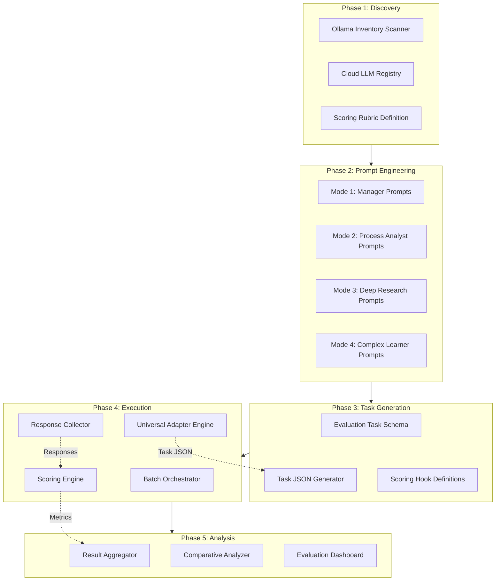
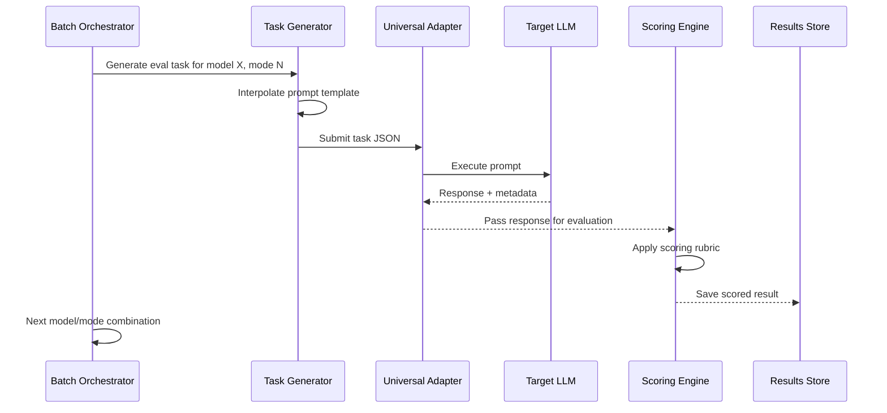

# LLM Capability Assessment Framework

**Purpose**: Benchmark small local LLMs vs cloud LLMs for neurosymbolic continuous improvement system

**Version**: 1.0.0  
**Created**: 2026-01-18  
**Status**: Architecture Design

---

## Executive Summary

This framework evaluates LLM capabilities for operating as cognitive agents within a four-mode continuous improvement kata system integrated with the Chrysalis Universal Adapter. The system tests models across Manager, Process Analyst, Deep Research, and Complex Learner modes to determine which LLMs excel at different cognitive functions.  

**Core Innovation**: Uses the Universal Adapter's JSON-driven task execution to create reproducible, comparative benchmarks across heterogeneous LLM providers.

---

## System Architecture



---

## Four-Mode Cognitive Framework

### Mode 1: Manager
**Capability**: Process calibration and runtime management  
**Tests**:
- Task prioritization under resource constraints
- Dynamic adaptation to changing conditions
- Meta-cognitive monitoring of process state
- Decision-making under uncertainty

**Example Prompt**:
> You are managing a continuous improvement process with 5 concurrent tasks. Resource availability just dropped by 40%. Re-prioritize tasks based on impact vs effort, explaining your reasoning using OODA loop principles.

### Mode 2: Process Analyst
**Capability**: Evaluation against external registries  
**Tests**:
- W3C standards compliance checking
- GitHub best practices validation
- Design pattern recognition
- Anti-pattern detection

**Example Prompt**:
> Analyze this API design against W3C HTTP standard {{registry:w3c_http}}. Identify deviations, explain severity, and propose corrections. Reference specific standard sections.

### Mode 3: Deep Research Analyst
**Capability**: Root cause analysis and resource discovery  
**Tests**:
- Five Whys application
- Causal chain tracing
- Information foraging
- Source credibility assessment

**Example Prompt**:
> A distributed system experiences cascading failures every 72 hours. Apply Five Whys to identify root cause. Discover relevant research papers on temporal failure patterns. Synthesize findings into actionable recommendations.

### Mode 4: Complex Learner
**Capability**: Cross-mode synthesis and adaptive questioning  
**Tests**:
- Integration of Modes 1-3 outputs
- Knowledge graph construction
- Emergent pattern recognition
- Strategic questioning to fill knowledge gaps

**Example Prompt**:
> Given Manager output {{response:M1}}, Process Analyst findings {{response:M2}}, and Deep Research conclusions {{response:M3}}, synthesize a comprehensive improvement strategy. Identify missing information and formulate targeted questions to address gaps.

---

## Evaluation Task Schema

Extends [`Universal Adapter Task Schema`](../src/universal_adapter/README.md:703-752):

```json
{
  "name": "eval-{model-id}-mode-{1-4}",
  "version": "1.0.0",
  "task_type": "capability_assessment",
  "priority": "high",
  
  "goal": {
    "description": "Evaluate {model-id} capability in Mode {N}",
    "target_conditions": [
      {
        "description": "Response demonstrates mode-specific cognitive capability",
        "evaluation_type": "CUSTOM",
        "scoring_hook": "mode_capability_scorer"
      }
    ]
  },
  
  "resource_llm": {
    "provider": "{provider}",
    "model": "{model}",
    "temperature": 0.7,
    "max_tokens": 4096,
    "api_key_env": "{API_KEY_ENV}"
  },
  
  "resource_registry": {
    "entries": [
      {
        "name": "w3c_http",
        "category": "standard",
        "source_url": "https://www.w3.org/Protocols/rfc2616/rfc2616.html"
      }
    ]
  },
  
  "prompts": [
    {
      "template": "{mode_specific_prompt}",
      "role": "user",
      "description": "Mode {N} evaluation prompt"
    }
  ],
  
  "flow_diagram": {
    "mermaid": "graph TD\n    START --> P0\n    P0 --> SCORE\n    SCORE --> END"
  },
  
  "evaluation_config": {
    "scoring_dimensions": [
      {
        "name": "logical_accuracy",
        "weight": 0.25,
        "rubric": "Correctness of reasoning steps"
      },
      {
        "name": "semantic_coherence",
        "weight": 0.20,
        "rubric": "Internal consistency of response"
      },
      {
        "name": "procedural_correctness",
        "weight": 0.20,
        "rubric": "Adherence to prescribed methodology"
      },
      {
        "name": "metacognitive_depth",
        "weight": 0.20,
        "rubric": "Self-awareness and reflection quality"
      },
      {
        "name": "response_time_ms",
        "weight": 0.15,
        "rubric": "Time to complete response",
        "scoring_function": "inverse_normalized"
      }
    ],
    "output_path": "./evaluation_results/{model-id}/mode-{N}/{timestamp}.json"
  }
}
```

---

## Scoring Rubric

### Dimension Definitions

| Dimension | Range | Excellent (4.0-5.0) | Good (3.0-3.9) | Adequate (2.0-2.9) | Poor (0-1.9) |
|-----------|-------|---------------------|----------------|-------------------|--------------|
| **Logical Accuracy** | 0-5 | All inferences valid, grounded in evidence | Minor logical gaps, mostly sound | Several unsupported claims | Frequent logical errors |
| **Semantic Coherence** | 0-5 | Unified conceptual framework, no contradictions | Mostly consistent with minor tension | Some contradictory statements | Incoherent or conflicting ideas |
| **Procedural Correctness** | 0-5 | Perfect adherence to methodology | Minor procedural deviations | Partial methodology application | Methodology ignored |
| **Metacognitive Depth** | 0-5 | Explicit uncertainty quantification, alternative consideration | Some self-reflection | Minimal awareness | No metacognition |
| **Response Time** | 0-5 | <2 sec | 2-5 sec | 5-15 sec | >15 sec |

### Composite Scoring Function

```python
def calculate_composite_score(metrics: dict, weights: dict) -> float:
    """
    Weighted average with normalization
    """
    weighted_sum = sum(
        metrics[dim] * weights[dim]
        for dim in weights.keys()
    )
    return weighted_sum / sum(weights.values())
```

---

## Target Model Inventory

### Local Models (Ollama)

Query via `ollama list`, filter by size constraint (1-8GB):

**Expected models** (will be discovered):
- `llama3.2:3b` - 3B parameter base
- `mistral:7b` - 7B parameter
- `phi3:3.8b` - 3.8B parameter
- `qwen2.5:7b` - 7B parameter
- `gemma2:9b` - 9B parameter

### Cloud LLMs

| Provider | Model | Context | Strengths |
|----------|-------|---------|-----------|
| Anthropic | `claude-3-5-sonnet-20241022` | 200K | Reasoning, structured output |
| Anthropic | `claude-3-5-opus-20250514` | 200K | Deep analysis (if available) |
| OpenAI | `gpt-4o-2024-11-20` | 128K | Balanced performance |
| OpenAI | `o1-preview` | 128K | Extended reasoning |
| DeepSeek | `deepseek-chat` | 64K | Code reasoning |

---

## Execution Flow



---

## Implementation Phases

### Phase 1: Foundation (Tasks 1-3)
- Query Ollama models: `ollama list | jq`
- Compile cloud LLM registry with API configuration
- Define JSON schema for scoring rubric

### Phase 2: Prompt Engineering (Tasks 4-8)
- Design 4 sets of mode-specific prompts
- Create prompt templates with `{{variable}}` interpolation
- Document inter-mode dependencies (Mode 4 depends on 1-3)

### Phase 3: Task Generation (Tasks 9-13)
- Extend Universal Adapter schema for evaluation tasks
- Generate `N_models × 4_modes` task JSON files
- Configure output directory structure

### Phase 4: Execution (Tasks 14-17)
- Build Python batch orchestrator
- Execute tasks via Universal Adapter CLI: `python -m universal_adapter run <task>`
- Aggregate results into comparative analysis

### Phases 5-8: Deferred Features
- Canvas collaborative token sharing (reference design only)
- Distributed merge consensus protocol (specification)
- RDF-based semantic conflict resolution (prompt engineering guide)

---

## Deliverables

| Artifact | Location | Purpose |
|----------|----------|---------|
| **Task JSONs** | `evaluation_tasks/{model-id}/mode-{1-4}.json` | Universal Adapter task definitions |
| **Prompt Library** | `evaluation_prompts/mode-{1-4}_prompts.md` | Reusable prompt templates |
| **Batch Orchestrator** | `scripts/run_llm_evaluation.py` | Execution automation |
| **Results Database** | `evaluation_results/{model-id}/mode-{N}/{timestamp}.json` | Scored responses |
| **Analysis Report** | `evaluation_results/comparative_analysis.md` | Model rankings and insights |
| **Architecture Doc** | `plans/llm-capability-assessment-framework.md` | This document |

---

## Integration with Chrysalis

### Universal Adapter Integration

The evaluation framework uses the Universal Adapter's existing infrastructure:

1. **Task Definition**: Evaluation tasks are standard Universal Adapter JSON tasks
2. **Execution**: Tasks run via `python -m universal_adapter run <task>`
3. **Output**: Responses follow standard [`AdapterResult`](../src/universal_adapter/README.md:63-68) schema

### Security Context

Evaluation tasks run with `AGENT` permission level:

```python
from universal_adapter import create_agent_context

ctx = create_agent_context(
    allowed_providers=["anthropic", "openai", "ollama"]
)
```

### Task Library Registration

Register evaluation tasks for easy access:

```python
from universal_adapter.task_library import TaskLibrary

library = TaskLibrary()
library.register("eval-llama3-mode1", path="./evaluation_tasks/llama3/mode-1.json")
```

---

## Risk Mitigation

| Risk | Impact | Mitigation |
|------|--------|-----------|
| **Ollama unavailable** | Cannot test local models | Graceful degradation; cloud-only evaluation |
| **API rate limits** | Incomplete evaluation | Batch with exponential backoff; respect rate limits |
| **Model unavailability** | Missing data points | Skip unavailable models; document in report |
| **Prompt injection** | LLM manipulation | Sanitize all inputs; validate outputs |
| **Cost overruns** | Budget exceeded | Set max tokens; implement cost tracking |

---

## Success Criteria

1. **Coverage**: Evaluation tasks for ≥3 local models and ≥3 cloud models
2. **Validity**: Scoring rubric demonstrates inter-rater reliability >0.7
3. **Actionability**: Comparative analysis identifies clear model strengths/weaknesses per mode
4. **Reproducibility**: All evaluations can be re-run with identical tasks
5. **Documentation**: Complete architecture and execution guide

---

## Future Extensions

- **Adaptive prompting**: Use Model 4 (Complex Learner) to generate improved prompts
- **Multi-turn dialogues**: Extend evaluation to conversational coherence
- **Knowledge retention**: Test episodic memory across sessions
- **Collaborative canvas**: Implement token-based multi-user evaluation sessions

---

## References

- [Universal Adapter Documentation](../src/universal_adapter/README.md)
- [Chrysalis Architecture](../ARCHITECTURE.md)
- [Complex Learning Agent Reference](../AGENT.md)

---

**Document Owner**: Evaluation Framework Team  
**Review Cadence**: As needed  
**Last Updated**: 2026-01-18
