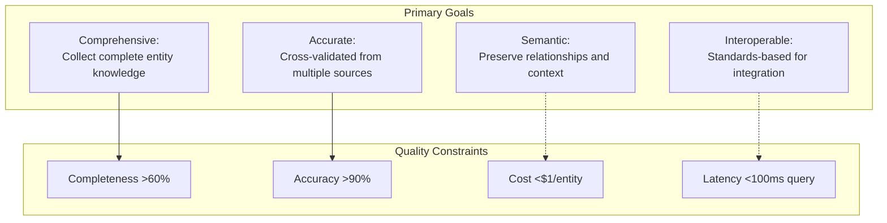
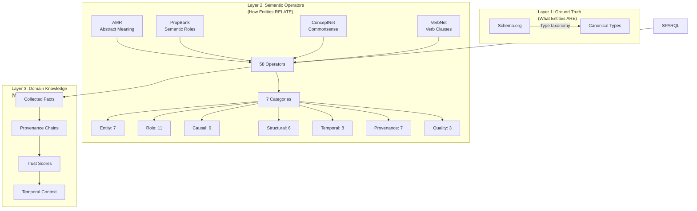
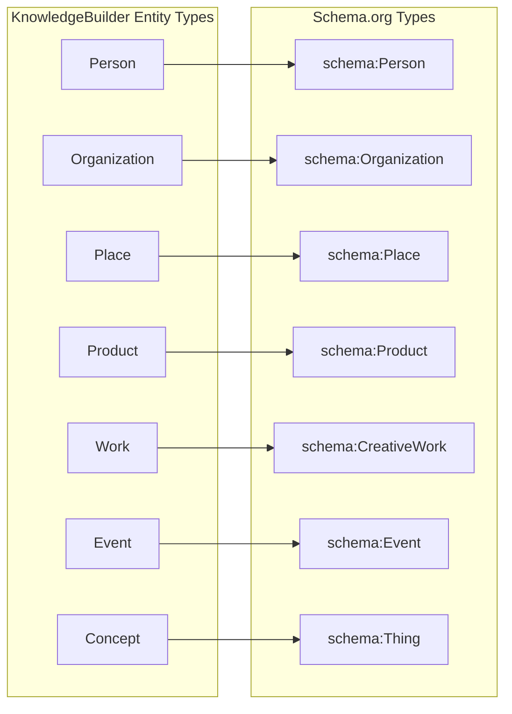
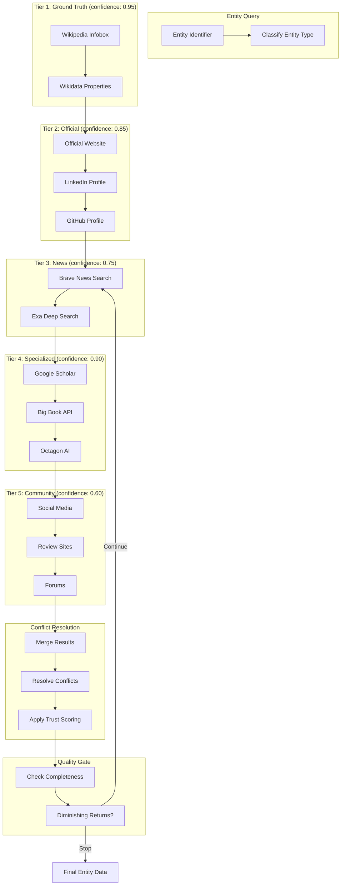
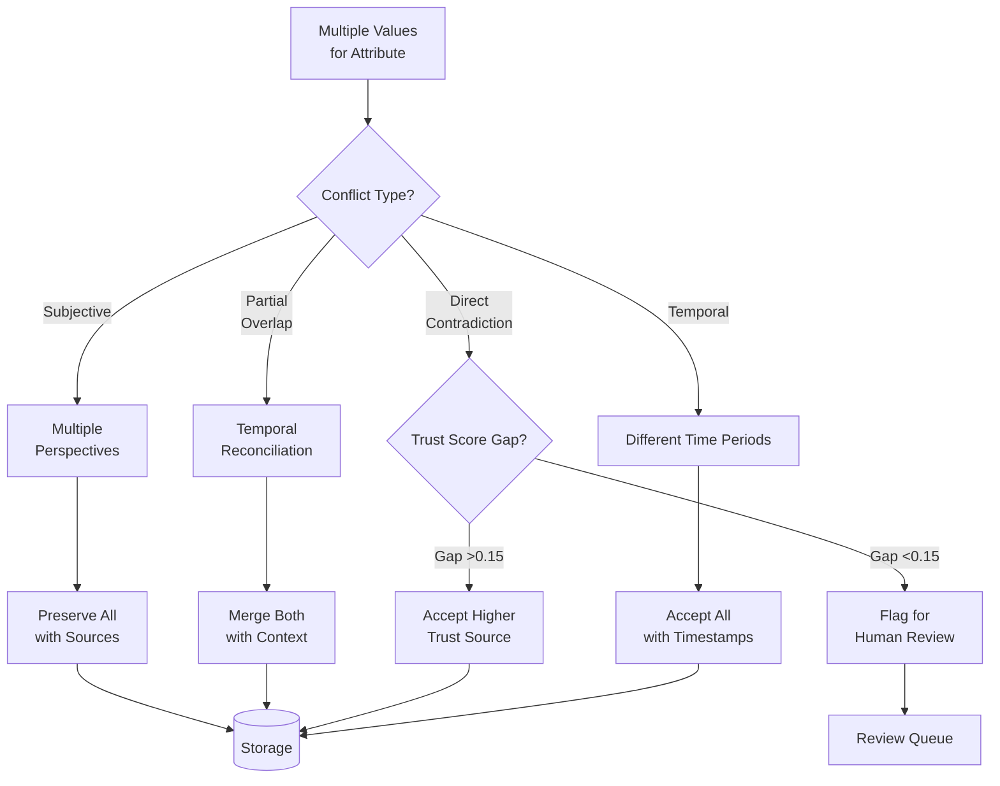
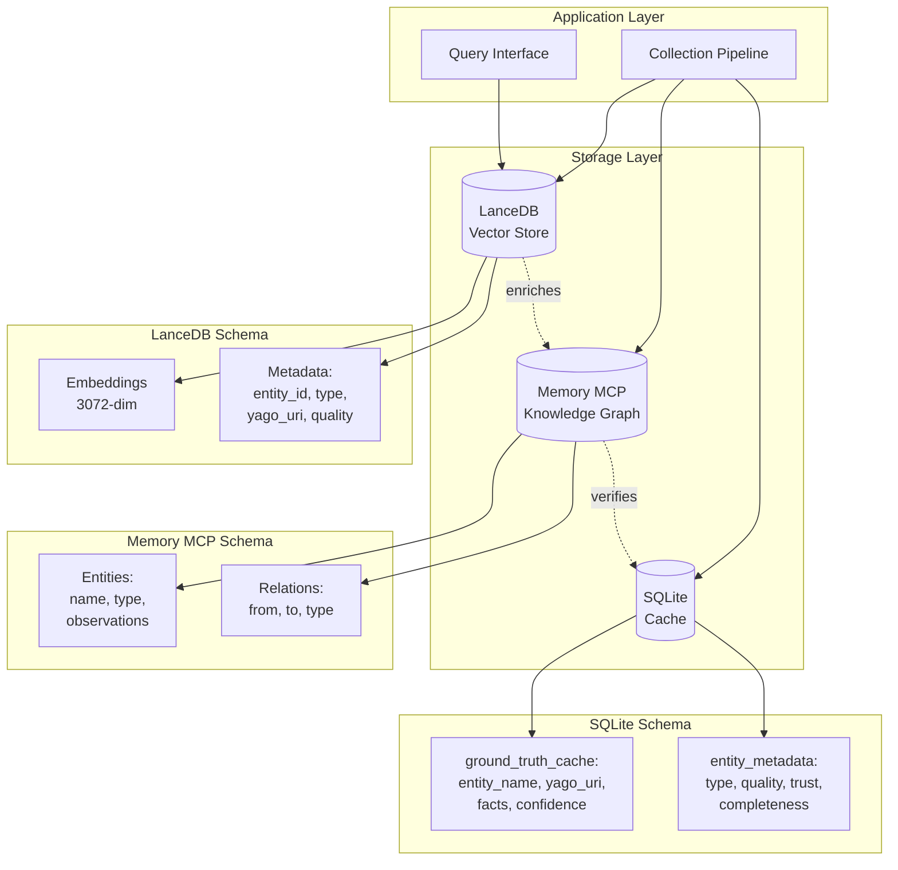
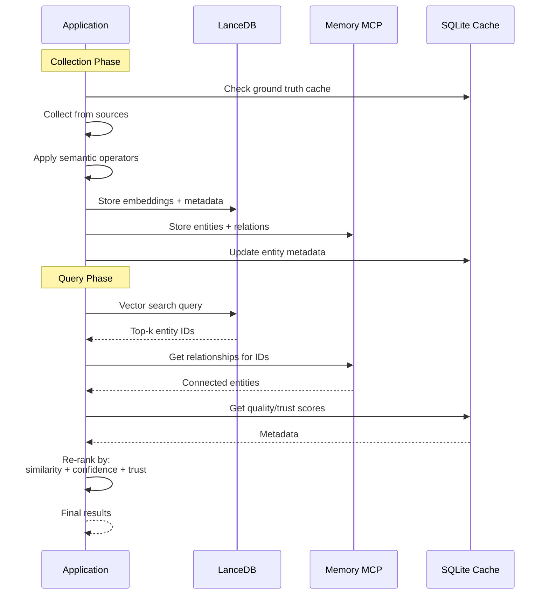
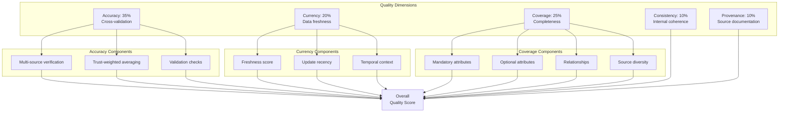
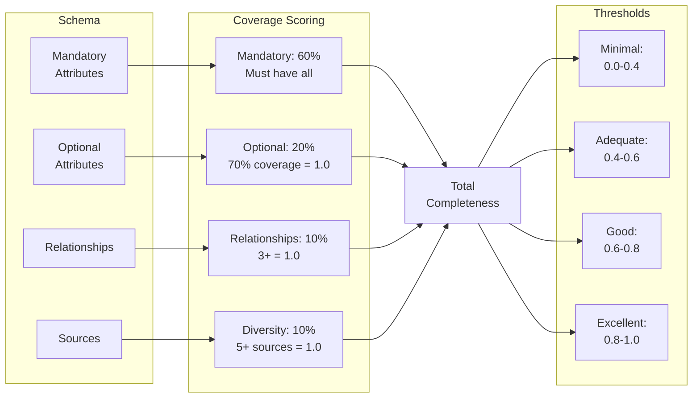
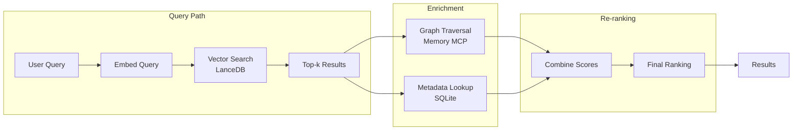

# KnowledgeBuilder: System Architecture

**Complete architectural specification with design rationale and implementation guidance**

**Last Updated**: 2025-12-29  
**Version**: 1.0.0

---

## Table of Contents

1. [Architectural Philosophy](#architectural-philosophy)
2. [Three-Layer Skill Builderl](#three-layer-semantic-model)
3. [Ground Truth Establishment](#ground-truth-establishment)
4. [Semantic Operator System](#semantic-operator-system)
5. [Data Collection Pipeline](#data-collection-pipeline)
6. [Storage Architecture](#storage-architecture)
7. [Quality Framework](#quality-framework)
8. [Integration Patterns](#integration-patterns)

---

## Architectural Philosophy

### Core Principles


**Separation of Concerns**: Separate "what entities are" (ground truth), "how they relate" (operators), and "what they mean" (collected facts)[^2].


**Linguistic Foundation**: Base semantic operators on computational linguistics research (AMR, PropBank, ConceptNet, VerbNet) not ad-hoc relationships[^5].

### System Goals



---

## Three-Layer Skill Builderl

### Layer Architecture



### Design Rationale


**Layer 2 (Semantic Operators)**: Provides relationship primitives independent of entity types. Linguistic grounding chosen for:
- Abstract Meaning Representation (AMR) provides deep semantic structure[^5]
- PropBank offers verb-argument structures[^7]
- ConceptNet supplies commonsense relationships[^8]
- VerbNet categorizes verb behaviors[^9]
- Ludwig demonstrates this approach works in production[^3]

**Layer 3 (Domain Knowledge)**: Stores collected facts with full provenance. Design enables:
- Multiple perspectives on subjective attributes
- Temporal evolution tracking
- Trust-weighted aggregation
- Source chain auditability

---

## Ground Truth Establishment


```mermaid
sequenceDiagram
    participant App as Application
    participant Cache as SQLite Cache
    participant Wiki as Wikidata Fallback
    
    App->>Client: resolve_entity("Satya Nadella")
    Client->>Cache: check_cache("Satya Nadella")
    
    alt Cache Hit (< 7 days old)
        Cache-->>Client: {yago_uri, type, facts, confidence}
        Client-->>App: GroundTruth object
    else Cache Miss
        
            Client->>Client: calculate_confidence()
            Client->>Cache: store(results, ttl=7d)
            Client-->>App: GroundTruth object
            Client->>Wiki: Fallback query
            Wiki-->>Client: Basic facts
            Client->>Cache: store(results, ttl=1d)
            Client-->>App: GroundTruth object (lower confidence)
        end
    end
```

### Entity Resolution Algorithm

**Confidence Calculation** (adapted from PT-MCP[^4]):

```python
def calculate_match_confidence(query: str, candidate: dict) -> float:
    """
    Dice coefficient string similarity + type bonus + fact consistency
    """
    # String similarity (Dice coefficient)
    name_sim = dice_similarity(query, candidate['label'])
    
    # Type match bonus
    type_bonus = 0.2 if candidate['type'] in expected_types else 0.0
    
    # Fact consistency (does context match?)
    fact_score = check_fact_consistency(query_context, candidate['facts'])
    
    return (name_sim * 0.6) + type_bonus + (fact_score * 0.2)
```

**Design basis**: PT-MCP's working implementation demonstrates this approach achieves >0.9 confidence for unambiguous entities[^4].

### Schema.org Type Mapping



**Rationale**: Schema.org chosen as industry standard maintained by Google, Microsoft, Yahoo, and Yandex with extensive adoption in structured web data[^6].

---

## Semantic Operator System

### Operator Categories

**58 Total Operators** (48 from Ludwig[^3] + 10 KnowledgeBuilder extensions):

| Category | Count | Purpose | Source |
|----------|-------|---------|--------|
| **Entity** | 7 | Core types | AMR[^5] |
| **Role** | 11 | Semantic roles | PropBank[^7] |
| **Causal** | 6 | Cause-effect | ConceptNet[^8] |
| **Structural** | 6 | Part-whole | AMR[^5] |
| **Temporal** | 8 | Time relations | AMR[^5] |
| **Provenance** | 7 | Source tracking | KnowledgeBuilder |
| **Quality** | 3 | Trust/confidence | KnowledgeBuilder |
| **Modality** | 8 | Belief/intent | PropBank[^7] |
| **Logical** | 6 | Inference | ConceptNet[^8] |

### Operator Application Flow

```mermaid
graph TB
    subgraph "Input"
        Fact[Raw Fact:<br/>"Satya Nadella works at Microsoft"]
    end
    
    subgraph "Operator Selection"
        Parse[Parse Statement]
        Classify[Classify Relationship]
        Select[Select Operator]
    end
    
    subgraph "Operator Application"
        Agent[agent:<br/>Satya Nadella]
        WorksFor[works_for<br/>(employment)]
        Patient[patient:<br/>Microsoft]
    end
    
    subgraph "Semantic Triple"
        Triple["(Satya Nadella, works_for, Microsoft)"]
        Meta[Metadata:<br/>category=Role<br/>inverse=employs]
    end
    
    subgraph "Storage"
        Graph[Knowledge Graph]
    end
    
    Fact --> Parse
    Parse --> Classify
    Classify --> Select
    
    Select --> Agent
    Select --> WorksFor
    Select --> Patient
    
    Agent --> Triple
    WorksFor --> Triple
    Patient --> Triple
    Triple --> Meta
    Meta --> Graph
```

### Key Operators (Examples)

**Causal Operators** (ConceptNet-based[^8]):
- `causes`: A directly causes B
- `enables`: A makes B possible
- `prevents`: A stops B from occurring
- `influences`: A affects B (non-deterministic)

**Structural Operators** (AMR-based[^5]):
- `part-of`: Component relationship
- `contains`: Containment
- `member-of`: Set membership
- `instance-of`: Type instantiation

**Provenance Operators** (KnowledgeBuilder extensions):
- `verified-by`: Source verification
- `contradicted-by`: Conflicting source
- `reported-by`: Attribution
- `derived-from`: Inference chain

**Design principle**: Each operator has:
1. Clear semantic definition
2. Inverse operator (if applicable)
3. Category classification
4. Confidence weight (for uncertain relations)
5. Source framework citation

---

## Data Collection Pipeline

### Multi-Source Cascade



### Cascade Logic

**Tier Execution Pattern**:
1. Query sources within tier in parallel (bounded concurrency)
2. Merge results with conflict resolution
3. Check completeness target
4. If target met OR diminishing returns detected, stop
5. Otherwise, proceed to next tier

**Diminishing Returns Detection**:
- New facts per tier < 2
- Completeness gain < 5%
- Cost per new fact > threshold
- Quality plateau (3 tiers with <2% improvement)

### Conflict Resolution Algorithm



**Resolution Rules** (priority order):
1. **Temporal reconciliation**: If timestamps differ, both may be correct
2. **Trust precedence**: Higher trust source wins (if gap >0.15)
3. **Cross-validation bonus**: Multiple sources increase confidence
4. **Structured over unstructured**: Prefer API data over scraped text
5. **Human review trigger**: Flag ambiguous conflicts

---

## Storage Architecture

### Hybrid Three-Store System



### Storage Responsibilities

**LanceDB** (Vector Similarity):
- Primary use: Semantic search
- Stores: Text embeddings (OpenAI text-embedding-3-large, 3072-dim)
- Query pattern: k-NN similarity search
- Performance target: <100ms p95 query latency

**Memory MCP** (Relationship Traversal):
- Primary use: Graph queries
- Stores: Entity nodes + relationship edges
- Query pattern: Graph traversal (BFS/DFS)
- Data model: Neo4j-compatible property graph[^10]
- Use case: "Find all people who work at Microsoft and went to Stanford"

**SQLite** (Ground Truth Cache):
- Stores: Entity resolution results, SPARQL responses
- TTL: 7 days for ground truth, 1 day for Wikidata fallback
- Size estimate: ~10KB per entity cached

### Data Flow Pattern



---

## Quality Framework

### Multi-Dimensional Quality Model



### Trust Scoring Algorithm

**Formula**:
```
trust_score = 
    domain_authority * 0.30 +
    freshness * 0.15 +
    citation_quality * 0.25 +
    historical_accuracy * 0.20 +
    cross_validation * 0.10
```

**Domain Authority Tiers**:
- 1.0: Official sources (`.gov`, `.edu`, official company sites)
- 0.95: Academic databases (Google Scholar, JSTOR)
- 0.85: Authoritative databases (Wikipedia, Wikidata)
- 0.85: Major news organizations (Reuters, NYT, BBC)
- 0.70: General news and verified blogs
- 0.50: Social media (verified accounts)
- 0.30: Unverified sources

**Design basis**: Adapted from information credibility research in digital journalism[^11] and fact-checking methodologies[^12].

### Completeness Calculation



**Target**: 0.60 minimum (Good) for RAG-readiness

---

## Integration Patterns

### Code Reuse from Ludwig and PT-MCP

**From Ludwig** (~60 hours development time saved)[^3]:

```python
# src/ground_truth/yago_client.py (469 lines)
    """
    SPARQL client with caching, fallback, and confidence scoring
    Adapted from Ludwig's implementation
    """
    def query_entity(self, name: str) -> GroundTruthEntity:
        # 1. Check SQLite cache
        # 2. Execute SPARQL query
        # 3. Parse results
        # 4. Calculate confidence
        # 5. Cache with 7-day TTL

# src/reconcilers/base.py (160 lines)
class Reconciler(ABC):
    """
    Abstract base for validation/enrichment reconcilers
    Pattern from Ludwig's reconciler system
    """
    @abstractmethod
    def check(self, entity: Entity) -> List[Issue]:
        pass
    
    @abstractmethod
    def fix(self, entity: Entity, issue: Issue) -> Entity:
        pass
```

**From PT-MCP** (confidence algorithm)[^4]:

```python
# src/resolution/confidence.py
def calculate_confidence(query: str, candidate: dict) -> float:
    """
    Dice coefficient string similarity
    Adapted from PT-MCP's entity resolution
    """
    name_similarity = dice_coefficient(query, candidate['label'])
    type_match_bonus = 0.2 if types_compatible else 0.0
    fact_consistency = check_context_match(query, candidate)
    
    return (name_similarity * 0.6) + type_match_bonus + (fact_consistency * 0.2)
```

### External System Integration

**Export to Ludwig** (markdown format):
```python
# KnowledgeBuilder entity → Ludwig markdown note
def export_to_ludwig(entity: Entity) -> str:
    """
    Convert KnowledgeBuilder entity to Ludwig markdown format
    with semantic operators
    """
    lines = [
        f"# {entity.name}",
        f"Type: {entity.type}",
        ""
    ]
    
    for rel in entity.relationships:
        lines.append(f"[[{entity.name}]] ::{rel.operator}:: [[{rel.target}]]")
    
    return "\n".join(lines)
```

**Import from Wikidata**:
```python
def import_from_wikidata(qid: str) -> Entity:
    """
    Import Wikidata entity (Q-ID) into KnowledgeBuilder
    Map Wikidata properties to Schema.org types
    """
    # Query Wikidata SPARQL
    # Map P-properties to Schema.org properties
    # Import into KnowledgeBuilder storage
```

---

## Performance Considerations

### Query Optimization



**Target Latencies**:
- Vector search: <50ms
- Graph enrichment: <30ms
- Metadata lookup: <10ms
- Re-ranking: <10ms
- **Total**: <100ms p95

### Collection Optimization

**Parallel Processing**:
- Query sources within tier concurrently
- Bounded concurrency (semaphore limit: 10)
- Async I/O for all network requests
- Batch embeddings (50 documents per batch)

**Cost Optimization**:
- Early termination on completeness target
- Diminishing returns detection (stop collecting)
- Reuse embeddings for similar text

---

## Design Evolution

### Why These Choices Were Made

**Q: Why not create a custom ontology instead of using Schema.org?**

**A**: Standards enable interoperability. Schema.org has 10+ years of industry adoption, extensive tooling support, and is actively maintained by major tech companies. Custom ontologies risk isolation and maintenance burden[^6].

**Q: Why 58 semantic operators instead of just using RDF predicates?**

**A**: RDF predicates are too granular (thousands exist) and lack semantic consistency. Linguistically-grounded operators from AMR/PropBank provide a manageable set (~50) with clear semantics and proven effectiveness in Ludwig's neurosymbolic system[^3][^5][^7].

**Q: Why hybrid storage (three databases) instead of one?**

**A**: Each storage type optimizes for different access patterns:
- Vectors: O(log n) similarity search
- Graph: O(edges) relationship traversal
- Cache: O(1) ground truth lookup

GraphRAG research demonstrates this pattern outperforms single-store approaches for combined semantic + structural queries[^13].


- Higher quality (confidence scores on facts)
- Schema.org alignment (industry standard)
- Better performance (optimized SPARQL endpoint)
- Academic pedigree (Max Planck Institute, 20+ years)
- Validation by two independent projects (Ludwig, PT-MCP)[^1][^3][^4]

---

## References


[^2]: Baader, F., Calvanese, D., McGuinness, D., et al. (2003). *The Description Logic Handbook*. Cambridge University Press. (Foundational work on ontology separation of concerns)


[^5]: Banarescu, L., et al. (2013). "Abstract Meaning Representation for Sembanking." *Proceedings of the 7th Linguistic Annotation Workshop*. https://amr.isi.edu/

[^6]: Schema.org Community Group (2011-present). "Schema.org Documentation." https://schema.org/ (Maintained by Google, Microsoft, Yahoo, Yandex; adopted by 31.3% of all websites as of 2020)

[^7]: Palmer, M., Gildea, D., & Kingsbury, P. (2005). "The Proposition Bank: An Annotated Corpus of Semantic Roles." *Computational Linguistics*, 31(1), 71-106.

[^8]: Speer, R., & Havasi, C. (2012). "Representing General Relational Knowledge in ConceptNet 5." *LREC*. http://conceptnet.io/

[^9]: Schuler, K. K. (2005). "VerbNet: A Broad-Coverage, Comprehensive Verb Lexicon." *University of Pennsylvania PhD Thesis*. https://verbs.colorado.edu/verbnet/

[^10]: Robinson, I., Webber, J., & Eifrem, E. (2015). *Graph Databases* (2nd ed.). O'Reilly Media. (Foundational text on property graph model)

[^11]: Metzger, M. J., & Flanagin, A. J. (2013). "Credibility and Trust of Information in Online Environments: The Use of Cognitive Heuristics." *Journal of Pragmatics*, 59, 210-220.

[^12]: Graves, L., Nyhan, B., & Reifler, J. (2016). "Understanding Innovations in Journalistic Practice: A Field Experiment Examining Motivations for Fact-Checking." *Journal of Communication*, 66(1), 102-138.

[^13]: Edge, D., et al. (2024). "From Local to Global: A Graph RAG Approach to Query-Focused Summarization." Microsoft Research. https://arxiv.org/abs/2404.16130

---

**Last Updated**: 2025-12-29  
**Version**: 1.0.0  
**Maintainer**: KnowledgeBuilder Team
