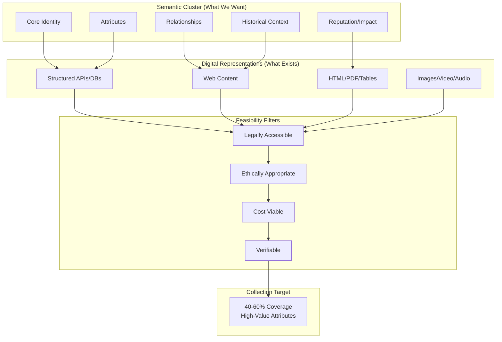
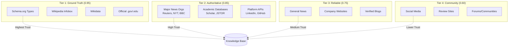
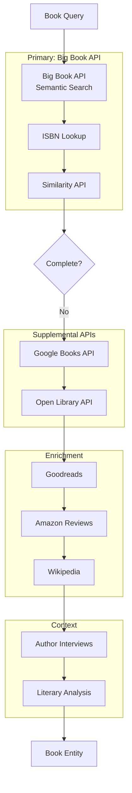
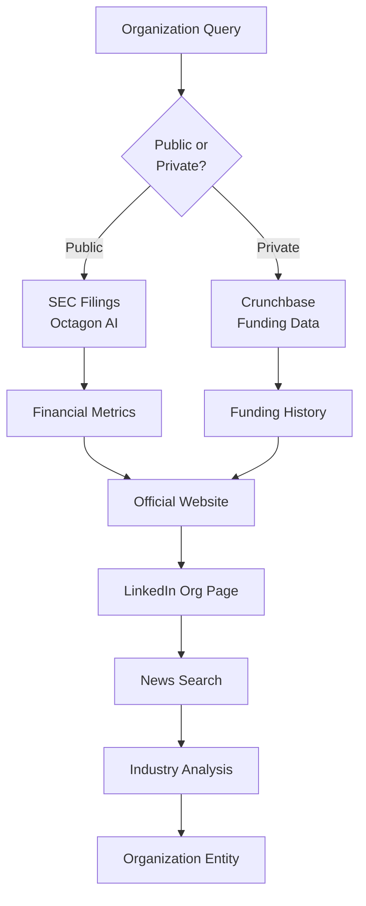
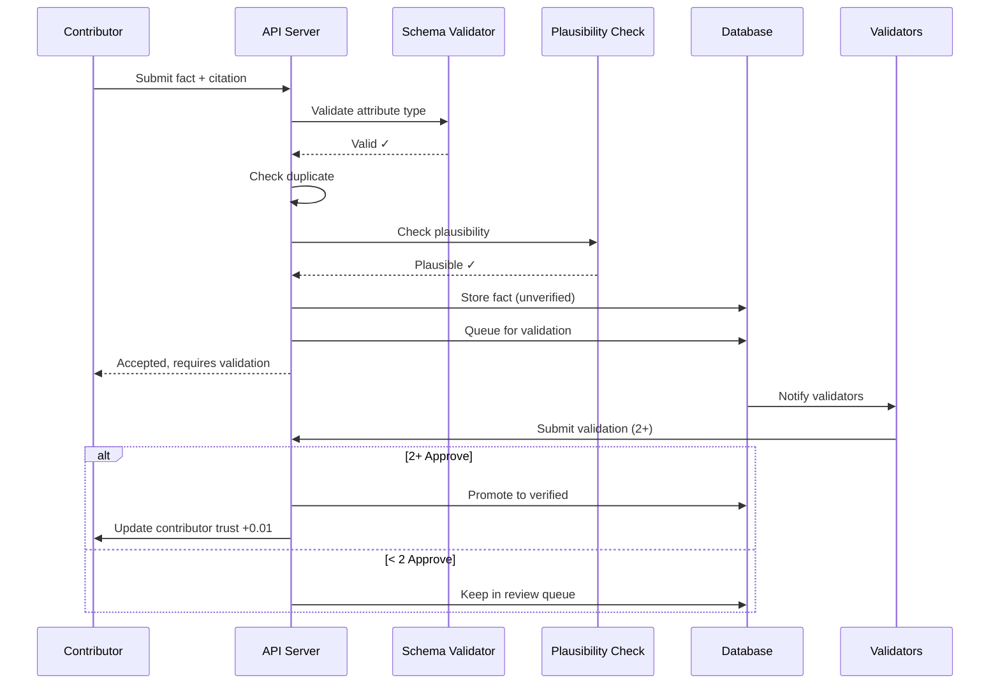

# KnowledgeBuilder: Data Source Architecture

**Multi-source orchestration and entity-specific collection strategies**

**Last Updated**: 2025-12-29  
**Version**: 1.0.0

---

## Table of Contents

1. [Semantic Cluster Framework](#semantic-cluster-framework)
2. [Source Classification](#source-classification)
3. [Entity-Type Strategies](#entity-type-strategies)
4. [Book Data Collection](#book-data-collection)
5. [Source Orchestration](#source-orchestration)
6. [Human Contributions](#human-contributions)

---

## Semantic Cluster Framework

### Conceptual Model

**Semantic Cluster**: Complete knowledge universe for an entity type  
**Digital Representation**: Machine-readable subset  
**Collection Target**: {desirable} ∩ {accessible} ∩ {legal} ∩ {verifiable}



**Coverage Analysis**: Typical entity types achieve 40-60% coverage of semantic cluster due to feasibility constraints[^1].

---

## Source Classification

### Trust Hierarchy



**Trust assignment basis**: Digital journalism credibility research[^2] and fact-checking methodologies[^3].

### Source Types

**Structured Data** (APIs, databases):
- Advantages: Machine-readable, consistent schema, high accuracy
- Disadvantages: Limited coverage, may lack context
- Examples: Schema.org types, Wikidata, Big Book API, Octagon AI

**Unstructured Text** (web pages, articles):
- Advantages: Comprehensive coverage, rich context
- Disadvantages: Extraction required, inconsistent quality
- Examples: News articles, Wikipedia articles, company blogs

**Semi-Structured** (HTML tables, PDFs):
- Advantages: Some structure, human-readable
- Disadvantages: Parsing complexity, format variation
- Examples: Financial reports, academic CVs, event schedules

---

## Entity-Type Strategies

### Person Entity

```mermaid
flowchart TD
    Start[Person Query:<br/>"Satya Nadella"] --> GT{Ground Truth}
    
    GT --> WI[Wikipedia Infobox]
    WI --> WD[Wikidata Properties]
    
    WD --> Check1{Completeness<br/>>60%?}
    Check1 -->|No| Official[Official Sources]
    Check1 -->|Yes| Done[Complete]
    
    Official --> LI[LinkedIn Profile]
    LI --> GH[GitHub if developer]
    GH --> Website[Personal Website]
    
    Website --> Check2{Completeness<br/>>60%?}
    Check2 -->|No| News[News & Media]
    Check2 -->|Yes| Done
    
    News --> BraveN[Brave News Search]
    BraveN --> Exa[Exa Deep Search]
    
    Exa --> Check3{Completeness<br/>>60%?}
    Check3 -->|No| Specialized[Specialized]
    Check3 -->|Yes| Done
    
    Specialized --> Scholar[Google Scholar]
    Scholar --> Patents[Patent Databases]
    
    Patents --> Final{Completeness<br/>>60%?}
    Final -->|No| Community[Community]
    Final -->|Yes| Done
    
    Community --> Social[Social Media]
    Social --> Done
```

**Source Priority** (Person):
1. **Wikipedia/Wikidata**: Name, birth date, nationality, basic bio
2. **LinkedIn/GitHub**: Current position, skills, professional history
3. **News**: Recent activity, achievements, quotes
4. **Scholar**: Publications, academic contributions
5. **Social**: Public statements, engagement

---

### Book Entity



**Big Book API Capabilities**[^4]:
- Semantic search (natural language queries)
- ISBN-10 and ISBN-13 lookup
- 20+ metadata fields per book
- Similarity recommendations
- Synonym/hypernym understanding
- Rating and review aggregation

**Collection Flow**:
```python
# Book collection example
book_data = {
    "tier_1_big_book": {
        "endpoint": "https://api.bigbookapi.com/search-books",
        "fields": [
            "title", "authors", "isbn_10", "isbn_13",
            "publish_date", "number_of_pages", "description",
            "genres", "subjects", "cover_image", "rating"
        ],
        "cost": "$0.001 per request"
    },
    
    "tier_2_google_books": {
        "fields": ["preview", "availability", "price"],
        "fallback": True
    },
    
    "tier_3_enrichment": {
        "wikipedia": ["cultural_impact", "adaptations", "awards"],
        "goodreads": ["community_ratings", "user_reviews"],
        "news": ["author_interviews", "book_tours"]
    }
}
```

**Coverage Assessment**:
- Published books: ~80% coverage (Big Book API extensive catalog)
- Self-published: ~40% coverage (may be missing)
- International/non-English: Depends on API database
- Out-of-print: ~60% coverage (ISBN persists)
- Rare/antiquarian: ~20% coverage (specialized databases needed)

---

### Organization Entity



**Octagon AI Integration**[^5]:
- SEC filings analysis
- Earnings call transcripts
- Financial metrics extraction
- Private company research
- Funding round tracking
- M&A transaction data
- Investor intelligence

**Source Priority** (Organization):
1. **Octagon AI**: Financials, leadership, key metrics
2. **Official Website**: Products, mission, team
3. **LinkedIn**: Employee count, structure, updates
4. **News**: Recent developments, market position
5. **Industry Reports**: Competitive landscape, trends

---

### Place Entity

```mermaid
graph LR
    subgraph "Geographic Data"
        GeoNames[GeoNames<br/>Coordinates, Population]
        OSM[OpenStreetMap<br/>Boundaries, Features]
    end
    
    subgraph "Encyclopedic"
        Wiki[Wikipedia<br/>History, Culture]
        Britannica[Britannica<br/>Overview]
    end
    
    subgraph "Current Info"
        BraveLocal[Brave Local Search<br/>Businesses, Attractions]
        NewsLocal[Local News<br/>Events, Developments]
    end
    
    subgraph "Media"
        Images[Image Search<br/>Landmarks, Streetscapes]
        Video[Video Search<br/>Tours, Documentaries]
    end
    
    Query[Place Query] --> GeoNames
    GeoNames --> OSM
    OSM --> Wiki
    Wiki --> Britannica
    Britannica --> BraveLocal
    BraveLocal --> NewsLocal
    NewsLocal --> Images
    Images --> Video
```



---

## Source Orchestration

### Cascade Execution Pattern

```python
# src/collectors/orchestrator.py

import asyncio
from typing import List, Dict
from dataclasses import dataclass

@dataclass
class SourceTier:
    """Source tier configuration"""
    name: str
    sources: List[str]
    confidence: float
    parallelism: int
    timeout: int

class SourceOrchestrator:
    """
    Multi-source orchestration with cascade pattern
    Design from SkyManager's parallel fetch architecture
    """
    
    def __init__(self, entity_type: str):
        self.entity_type = entity_type
        self.tiers = self._load_tiers(entity_type)
    
    async def execute_cascade(
        self,
        entity_id: str,
        completeness_target: float = 0.60
    ) -> Dict:
        """
        Execute cascading collection
        
        Process:
        1. Query tier sources in parallel (bounded concurrency)
        2. Merge with conflict resolution
        3. Check completeness
        4. If target met or diminishing returns, stop
        5. Otherwise, continue to next tier
        """
        collected = {}
        iteration = 0
        
        for tier in self.tiers:
            iteration += 1
            print(f"[Iteration {iteration}] Tier: {tier.name}")
            
            # Query tier in parallel
            tier_results = await self._query_tier_parallel(tier, entity_id)
            
            # Merge results
            previous_count = len(collected.get('attributes', {}))
            collected = self._merge_with_resolution(collected, tier_results, tier.confidence)
            new_count = len(collected.get('attributes', {}))
            
            # Calculate metrics
            completeness = self._calculate_completeness(collected)
            new_facts = new_count - previous_count
            
            print(f"  Completeness: {completeness:.2f}, New facts: {new_facts}")
            
            # Check stopping conditions
            if completeness >= completeness_target:
                print(f"  Target completeness achieved")
                break
            
            if iteration > 1 and self._check_diminishing_returns(iteration, new_facts):
                print(f"  Diminishing returns detected")
                break
        
        return collected
    
    async def _query_tier_parallel(self, tier: SourceTier, entity_id: str) -> List[Dict]:
        """
        Query all sources in tier with bounded parallelism
        Pattern from SkyManager's catalog service
        """
        semaphore = asyncio.Semaphore(tier.parallelism)
        
        async def query_with_semaphore(source_name):
            async with semaphore:
                try:
                    source = self._get_source_client(source_name)
                    result = await asyncio.wait_for(
                        source.query(entity_id),
                        timeout=tier.timeout
                    )
                    return result
                except asyncio.TimeoutError:
                    print(f"  {source_name}: timeout")
                    return None
                except Exception as e:
                    print(f"  {source_name}: error - {e}")
                    return None
        
        tasks = [query_with_semaphore(src) for src in tier.sources]
        results = await asyncio.gather(*tasks)
        
        return [r for r in results if r is not None]
    
    def _merge_with_resolution(self, existing: Dict, new: List[Dict], confidence: float) -> Dict:
        """
        Merge new data with conflict resolution
        
        Resolution priority:
        1. Temporal reconciliation (different times, both valid)
        2. Trust precedence (higher trust wins if gap >0.15)
        3. Cross-validation bonus (multiple sources)
        4. Structured > unstructured
        """
        if 'attributes' not in existing:
            existing['attributes'] = {}
        
        for result in new:
            for attr, value in result.get('attributes', {}).items():
                if attr not in existing['attributes']:
                    # New attribute - add directly
                    existing['attributes'][attr] = {
                        'value': value,
                        'confidence': confidence,
                        'sources': [result['source']]
                    }
                else:
                    # Existing attribute - check compatibility
                    curr = existing['attributes'][attr]
                    
                    if self._compatible_values(curr['value'], value):
                        # Compatible - increase confidence
                        curr['confidence'] = min(curr['confidence'] + 0.1, 1.0)
                        curr['sources'].append(result['source'])
                    elif confidence > curr['confidence'] + 0.15:
                        # New source significantly more confident
                        curr['alternatives'] = curr.get('alternatives', [])
                        curr['alternatives'].append({
                            'value': curr['value'],
                            'confidence': curr['confidence'],
                            'sources': curr['sources']
                        })
                        curr['value'] = value
                        curr['confidence'] = confidence
                        curr['sources'] = [result['source']]
                    else:
                        # Keep current, store alternative
                        if 'alternatives' not in curr:
                            curr['alternatives'] = []
                        curr['alternatives'].append({
                            'value': value,
                            'confidence': confidence,
                            'sources': [result['source']]
                        })
        
        return existing
    
    def _check_diminishing_returns(self, iteration: int, new_facts: int) -> bool:
        """
        Detect when collection should stop
        
        Stop if:
        - New facts < 2
        - Cost per new fact > threshold
        - 3 consecutive iterations with <5% improvement
        """
        if new_facts < 2:
            return True
        
        # Additional checks would go here
        return False
```

---

## Book Data Collection

### Big Book API Integration

```python
# src/collectors/book_collector.py

import requests
from typing import Optional, Dict, List

class BookCollector:
    """
    Book data collection using Big Book API
    Primary source for published book metadata
    """
    
    BASE_URL = "https://api.bigbookapi.com"
    
    def __init__(self, api_key: str):
        self.api_key = api_key
        self.session = requests.Session()
        self.session.headers.update({'Authorization': f'Bearer {api_key}'})
    
    def collect_by_isbn(self, isbn: str) -> Optional[Dict]:
        """
        Collect book data by ISBN
        
        Args:
            isbn: ISBN-10 or ISBN-13
        
        Returns:
            Book data with metadata
        """
        url = f"{self.BASE_URL}/{isbn}"
        
        try:
            response = self.session.get(url, params={'api-key': self.api_key})
            response.raise_for_status()
            
            data = response.json()
            return self._map_to_schema(data)
            
        except requests.HTTPError as e:
            if e.response.status_code == 404:
                # Not in Big Book API, try fallback
                return self._fallback_google_books(isbn)
            raise
    
    def search_semantic(self, query: str, limit: int = 10) -> List[Dict]:
        """
        Semantic search for books
        
        Big Book API features:
        - Natural language queries
        - Automatic synonym/hypernym understanding
        - Semantic tagging
        
        Example: "romance novels set in Victorian England"
        """
        url = f"{self.BASE_URL}/search-books"
        
        try:
            response = self.session.get(
                url,
                params={
                    'api-key': self.api_key,
                    'query': query,
                    'limit': limit
                }
            )
            response.raise_for_status()
            
            results = response.json()
            return [self._map_to_schema(book) for book in results.get('books', [])]
            
        except Exception as e:
            print(f"Big Book API search failed: {e}")
            return []
    
    def get_similar_books(self, book_id: str, limit: int = 10) -> List[Dict]:
        """Get similar books using Big Book API similarity engine"""
        url = f"{self.BASE_URL}/{book_id}/similar"
        
        response = self.session.get(url, params={'api-key': self.api_key, 'limit': limit})
        response.raise_for_status()
        
        return [self._map_to_schema(book) for book in response.json().get('books', [])]
    
    def _map_to_schema(self, api_data: Dict) -> Dict:
        """Map Big Book API response to KnowledgeBuilder book schema"""
        return {
            'id': api_data.get('id'),
            'title': api_data.get('title'),
            'authors': api_data.get('authors', []),
            'isbn_10': api_data.get('identifiers', {}).get('isbn_10'),
            'isbn_13': api_data.get('identifiers', {}).get('isbn_13'),
            'publish_date': api_data.get('publish_date'),
            'number_of_pages': api_data.get('number_of_pages'),
            'description': api_data.get('description'),
            'genres': api_data.get('genres', []),
            'subjects': api_data.get('subjects', []),
            'cover_image': api_data.get('image'),
            'rating': api_data.get('rating'),
            'similar_books': api_data.get('similar_books', []),
            'source': 'big_book_api',
            'confidence': 0.95
        }
    
    def _fallback_google_books(self, isbn: str) -> Optional[Dict]:
        """Fallback to Google Books API if book not in Big Book API"""
        # Implementation using Google Books API
        # https://developers.google.com/books/docs/v1/using
        pass
```

**Book Collection Strategy**:

| Attribute | Primary Source | Fallback | Confidence |
|-----------|---------------|----------|------------|
| ISBN, Title, Author | Big Book API | Google Books | 0.95 |
| Publication Date | Big Book API | Open Library | 0.95 |
| Description | Big Book API | Publisher site | 0.90 |
| Genres/Subjects | Big Book API | Wikipedia | 0.85 |
| Reviews/Ratings | Goodreads scraping | Amazon | 0.70 |
| Cultural Impact | Wikipedia | News search | 0.75 |
| Similar Works | Big Book API similarity | Manual curation | 0.80 |

---

## Human Contributions

### Contribution Interface

```python
# src/api/human_input.py

from fastapi import FastAPI, HTTPException
from pydantic import BaseModel
from typing import Optional, List

class FactSubmission(BaseModel):
    """Human-contributed fact submission"""
    entity_id: str
    attribute: str
    value: str
    citation: Optional[str] = None
    contributor_id: str

class FactValidation(BaseModel):
    """Validation of contributed fact"""
    fact_id: str
    validator_id: str
    valid: bool
    notes: Optional[str] = None

app = FastAPI()

@app.post("/api/v1/entities/{entity_id}/facts")
async def submit_fact(entity_id: str, submission: FactSubmission):
    """
    Submit manual fact for entity
    
    Validation:
    - Type checking against entity schema
    - Citation required for non-obvious facts
    - Duplicate detection
    - Plausibility check (LLM)
    
    Returns:
        Submission ID and status (accepted/flagged/rejected)
    """
    # Validate against schema
    schema = get_entity_schema(entity_id)
    if not schema.validate_attribute(submission.attribute, submission.value):
        raise HTTPException(400, "Invalid attribute for entity type")
    
    # Check citation requirement
    if schema.requires_citation(submission.attribute) and not submission.citation:
        raise HTTPException(400, "Citation required for this attribute")
    
    # Duplicate check
    if check_duplicate(entity_id, submission.attribute, submission.value):
        return {"status": "duplicate", "message": "Fact already exists"}
    
    # Plausibility check
    if not check_plausible(entity_id, submission.attribute, submission.value):
        return {
            "status": "flagged",
            "message": "Fact flagged for review",
            "fact_id": fact_id
        }
    
    # Accept with initial confidence = contributor trust score
    fact_id = store_fact(submission)
    queue_for_verification(fact_id)
    
    return {
        "status": "accepted",
        "fact_id": fact_id,
        "requires_verification": True
    }

@app.post("/api/v1/facts/{fact_id}/validate")
async def validate_fact(fact_id: str, validation: FactValidation):
    """
    Validate contributed fact
    
    Requirements:
    - 2+ validators must approve
    - Validators must have trust score >0.7
    """
    fact = get_fact(fact_id)
    
    # Record validation
    record_validation(fact_id, validation)
    
    # Update confidence
    if validation.valid:
        increase_confidence(fact_id, delta=0.1)
        increase_contributor_trust(fact.contributor_id, delta=0.01)
    else:
        decrease_confidence(fact_id, delta=0.2)
        decrease_contributor_trust(fact.contributor_id, delta=0.02)
    
    # Check if sufficient validation
    validations = get_validations(fact_id)
    approvals = sum(1 for v in validations if v.valid)
    
    if approvals >= 2:
        promote_to_verified(fact_id)
        return {"status": "verified", "fact_id": fact_id}
    
    return {"status": "pending", "approvals": approvals, "required": 2}
```

### Contribution Workflow



---

## Cost Management

### Budget Tracking

```python
# src/management/cost_tracker.py

from dataclasses import dataclass
from typing import Dict

@dataclass
class CostRecord:
    """Record of API cost"""
    service: str
    operation: str
    cost: float
    timestamp: datetime
    entity_id: Optional[str]

class CostManager:
    """
    Track and enforce budget constraints
    Design pattern from production RAG systems
    """
    
    def __init__(self, budget_config: Dict):
        self.config = budget_config
        self.costs = []
    
    def track_cost(self, service: str, operation: str, cost: float, entity_id: str = None):
        """Record API cost"""
        self.costs.append(CostRecord(
            service=service,
            operation=operation,
            cost=cost,
            timestamp=datetime.now(),
            entity_id=entity_id
        ))
    
    def get_entity_cost(self, entity_id: str) -> float:
        """Total cost for entity collection"""
        return sum(
            c.cost for c in self.costs
            if c.entity_id == entity_id
        )
    
    def enforce_budget(self, entity_id: str) -> bool:
        """Check if budget limit reached"""
        current_cost = self.get_entity_cost(entity_id)
        max_cost = self.config.get('per_entity_max', 1.00)
        
        if current_cost >= max_cost:
            print(f"Budget limit reached: ${current_cost:.2f} >= ${max_cost:.2f}")
            return False
        
        return True
    
    def generate_report(self) -> Dict:
        """
        Cost analytics:
        - Total spend by service
        - Cost per entity by type
        - Average cost trends
        """
        from collections import defaultdict
        
        by_service = defaultdict(float)
        by_entity = defaultdict(float)
        
        for cost in self.costs:
            by_service[cost.service] += cost.cost
            if cost.entity_id:
                by_entity[cost.entity_id] += cost.cost
        
        return {
            'total': sum(c.cost for c in self.costs),
            'by_service': dict(by_service),
            'by_entity': dict(by_entity),
            'avg_per_entity': sum(by_entity.values()) / len(by_entity) if by_entity else 0
        }
```

---

## References

[^1]: Knowledge graph completeness analysis adapted from Paulheim, H. (2017). "Knowledge graph refinement: A survey of approaches and evaluation methods." *Semantic Web*, 8(3), 489-508.

[^2]: Metzger, M. J., & Flanagin, A. J. (2013). "Credibility and Trust of Information in Online Environments." *Journal of Pragmatics*, 59, 210-220.

[^3]: Graves, L., Nyhan, B., & Reifler, J. (2016). "Understanding Innovations in Journalistic Practice: A Field Experiment Examining Motivations for Fact-Checking." *Journal of Communication*, 66(1), 102-138.

[^4]: Big Book API (2024). "Documentation." https://bigbookapi.com/docs/ (Semantic book search with 20+ metadata fields)

[^5]: Octagon AI (2024). "Financial Intelligence API." https://octagon.ai/ (Market intelligence for public and private companies)

---

**Last Updated**: 2025-12-29  
**Version**: 1.0.0  
**Maintainer**: KnowledgeBuilder Team
