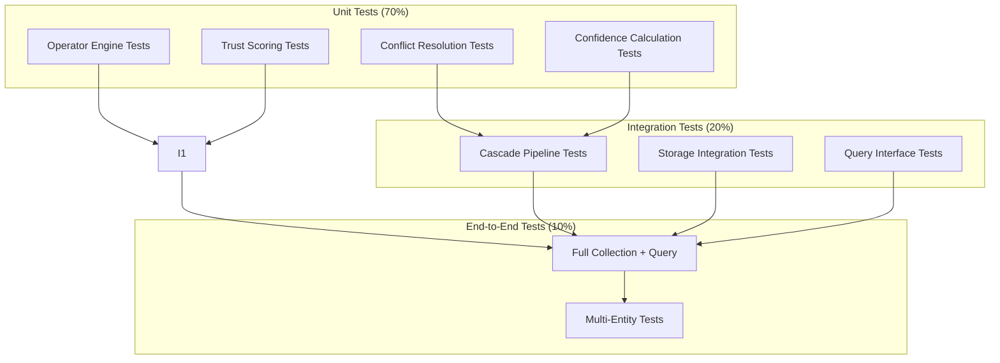

# KnowledgeBuilder: Implementation Guide

**Practical implementation guidance with code examples and integration patterns**

**Last Updated**: 2025-12-29  
**Version**: 1.0.0

---

## Table of Contents

1. [Development Setup](#development-setup)
2. [Core Components](#core-components)
3. [Collection Pipeline](#collection-pipeline)
4. [Storage Operations](#storage-operations)
5. [Query Interface](#query-interface)
6. [Testing Strategy](#testing-strategy)

---

## Development Setup

### Environment Configuration

```bash
# 1. Clone and navigate
git clone https://github.com/your-org/KnowledgeBuilder.git
cd KnowledgeBuilder

# 2. Create virtual environment
python3.10 -m venv venv
source venv/bin/activate  # or `venv\Scripts\activate` on Windows

# 3. Install dependencies
pip install -r requirements.txt

# 4. Configure API keys
cp .env.example .env
# Edit .env with your API keys
```

### Required API Keys

```bash
# LLM Providers
ANTHROPIC_API_KEY=sk-ant-...      # Claude for analysis
OPENAI_API_KEY=sk-proj-...        # Embeddings

# Search Services
BRAVE_API_KEY=...                 # Web/news/image search

# Storage
LANCEDB_API_KEY=...               # Vector database
LANCEDB_DATABASE_URI=db://...    # Cloud hosted

# Optional (entity-specific)
OCTAGON_API_KEY=...               # Financial data
BIG_BOOK_API_KEY=...              # Book metadata
```

### Project Structure

```
KnowledgeBuilder/
├── src/
│   ├── semantic/              # Operator system
│   ├── collectors/            # Data source collectors
│   ├── storage/               # Hybrid storage layer
│   ├── quality/               # Quality & trust scoring
│   └── api/                   # Query interface
├── tests/                     # Test suite
├── schemas/                   # JSON schemas
├── examples/                  # Example scripts
├── config.yaml               # Configuration
└── requirements.txt          # Dependencies
```

---

## Core Components

### Ground Truth Client

```python
# src/ground_truth/yago_client.py

import sqlite3
import requests
from datetime import datetime, timedelta
from typing import Optional, Dict, List
from dataclasses import dataclass

@dataclass
class GroundTruthEntity:
    name: str
    yago_uri: str
    schema_type: str  # e.g., "schema:Person"
    facts: Dict[str, List[str]]
    yago_confidence: float
    match_confidence: float
    cached_at: datetime
    expires_at: datetime

    """
    Adapted from Ludwig's implementation (~/Documents/GitClones/Ludwig/)
    """
    
    WIKIDATA_ENDPOINT = "https://query.wikidata.org/sparql"
    CACHE_TTL_DAYS = 7
    
    def __init__(self, cache_path: str):
        self.cache_conn = sqlite3.connect(cache_path)
        self._init_cache_schema()
    
    def _init_cache_schema(self):
        """Initialize SQLite cache tables"""
        self.cache_conn.execute("""
            CREATE TABLE IF NOT EXISTS ground_truth_cache (
                entity_name TEXT PRIMARY KEY,
                yago_uri TEXT NOT NULL,
                schema_type TEXT NOT NULL,
                facts TEXT NOT NULL,
                yago_confidence REAL,
                match_confidence REAL,
                cached_at TEXT,
                expires_at TEXT
            )
        """)
        self.cache_conn.commit()
    
    def resolve_entity(self, name: str, context: Optional[Dict] = None) -> Optional[GroundTruthEntity]:
        """
        
        Process:
        1. Check SQLite cache (7-day TTL)
        3. Calculate confidence scores
        4. Cache result
        5. Return GroundTruthEntity
        """
        # Check cache
        cached = self._check_cache(name)
        if cached and not self._is_expired(cached):
            return cached
        
        try:
            results = self._query_yago(name, context)
            if not results:
                # Fallback to Wikidata
                results = self._query_wikidata(name, context)
            
            if not results:
                return None
            
            # Calculate confidence
            match_confidence = self._calculate_match_confidence(name, results, context)
            
            # Parse and create entity
            entity = GroundTruthEntity(
                name=name,
                yago_uri=results['uri'],
                schema_type=results['type'],
                facts=results['facts'],
                yago_confidence=results.get('confidence', 1.0),
                match_confidence=match_confidence,
                cached_at=datetime.now(),
                expires_at=datetime.now() + timedelta(days=self.CACHE_TTL_DAYS)
            )
            
            # Cache
            self._cache_entity(entity)
            
            return entity
            
        except Exception as e:
            print(f"Error resolving entity: {e}")
            return None
    
    def _query_yago(self, name: str, context: Optional[Dict]) -> Optional[Dict]:
        query = self._build_sparql_query(name, context)
        
        try:
            response = requests.post(
                data={'query': query},
                headers={'Accept': 'application/sparql-results+json'},
                timeout=10
            )
            response.raise_for_status()
            
            results = response.json()
            return self._parse_sparql_results(results)
            
        except requests.RequestException as e:
            return None
    
    def _calculate_match_confidence(self, query: str, results: Dict, context: Optional[Dict]) -> float:
        """
        Calculate confidence score for entity match
        Using Dice coefficient (adapted from PT-MCP)
        """
        from difflib import SequenceMatcher
        
        # String similarity (Dice coefficient approximation)
        name_sim = SequenceMatcher(None, query.lower(), results['label'].lower()).ratio()
        
        # Type match bonus
        type_bonus = 0.0
        if context and 'expected_type' in context:
            if results['type'] == context['expected_type']:
                type_bonus = 0.2
        
        # Fact consistency check
        fact_score = 0.0
        if context and 'facts' in context:
            matching_facts = sum(1 for f in context['facts'] if f in results['facts'])
            fact_score = min(matching_facts / len(context['facts']), 0.2)
        
        return (name_sim * 0.6) + type_bonus + fact_score
```

### Semantic Operator Engine

```python
# src/semantic/operators.py

from dataclasses import dataclass
from typing import Optional, List
from enum import Enum

class OperatorCategory(Enum):
    ENTITY = "entity"
    ROLE = "role"
    CAUSAL = "causal"
    STRUCTURAL = "structural"
    TEMPORAL = "temporal"
    PROVENANCE = "provenance"
    QUALITY = "quality"
    MODALITY = "modality"
    LOGICAL = "logical"

@dataclass
class SemanticOperator:
    """Semantic operator definition"""
    name: str
    category: OperatorCategory
    definition: str
    inverse: Optional[str]
    source_framework: str  # AMR, PropBank, ConceptNet, VerbNet, KnowledgeBuilder
    domain: Optional[str]  # Expected subject type
    range: Optional[str]  # Expected object type
    confidence_weight: float = 1.0

# Define all 58 operators
OPERATORS = {
    # Entity types (7) - from AMR
    "thing": SemanticOperator(
        name="thing",
        category=OperatorCategory.ENTITY,
        definition="Physical or abstract entity",
        inverse=None,
        source_framework="AMR",
        domain=None,
        range=None
    ),
    
    # Role operators (11) - from PropBank
    "agent": SemanticOperator(
        name="agent",
        category=OperatorCategory.ROLE,
        definition="Entity performing action",
        inverse="patient",
        source_framework="PropBank",
        domain="Person|Organization",
        range="Event"
    ),
    
    # Causal operators (6) - from ConceptNet
    "causes": SemanticOperator(
        name="causes",
        category=OperatorCategory.CAUSAL,
        definition="A directly causes B to occur",
        inverse="caused_by",
        source_framework="ConceptNet",
        domain=None,
        range=None
    ),
    
    # Structural operators (6) - from AMR
    "part-of": SemanticOperator(
        name="part-of",
        category=OperatorCategory.STRUCTURAL,
        definition="Component relationship",
        inverse="contains",
        source_framework="AMR",
        domain=None,
        range=None
    ),
    
    # Temporal operators (8) - from AMR
    "before": SemanticOperator(
        name="before",
        category=OperatorCategory.TEMPORAL,
        definition="A occurs before B in time",
        inverse="after",
        source_framework="AMR",
        domain="Event",
        range="Event"
    ),
    
    # Provenance operators (7) - KnowledgeBuilder
    "verified-by": SemanticOperator(
        name="verified-by",
        category=OperatorCategory.PROVENANCE,
        definition="Fact verified by source",
        inverse=None,
        source_framework="KnowledgeBuilder",
        domain="Fact",
        range="Source"
    ),
    
    # Quality operators (3) - KnowledgeBuilder
    "trust-score": SemanticOperator(
        name="trust-score",
        category=OperatorCategory.QUALITY,
        definition="Confidence in fact (0-1)",
        inverse=None,
        source_framework="KnowledgeBuilder",
        domain="Fact",
        range="Float"
    ),
    
    # ... (remaining 51 operators defined similarly)
}

class OperatorEngine:
    """Apply semantic operators to create relationships"""
    
    def __init__(self):
        self.operators = OPERATORS
    
    def apply_operator(self, subject: str, operator: str, object: str) -> Dict:
        """
        Apply semantic operator to create typed relationship
        
        Returns:
            Relationship dict with operator metadata
        """
        if operator not in self.operators:
            raise ValueError(f"Unknown operator: {operator}")
        
        op_def = self.operators[operator]
        
        return {
            'subject': subject,
            'predicate': operator,
            'object': object,
            'category': op_def.category.value,
            'inverse': op_def.inverse,
            'source_framework': op_def.source_framework,
            'confidence_weight': op_def.confidence_weight
        }
    
    def infer_operator(self, subject: str, natural_language: str, object: str, llm) -> str:
        """
        Use LLM to map natural language to semantic operator
        
        Example:
            subject: "Satya Nadella"
            natural_language: "is the CEO of"
            object: "Microsoft"
            → returns: "agent" (from Role category)
        """
        prompt = f"""
        Map this relationship to one of our 58 semantic operators:
        
        Subject: {subject}
        Relationship: {natural_language}
        Object: {object}
        
        Available operators: {list(self.operators.keys())}
        
        Return only the operator name.
        """
        
        return llm.generate(prompt).strip()
```

---

## Collection Pipeline

### Multi-Source Cascade Implementation

```python
# src/collectors/cascade.py

import asyncio
from typing import List, Dict, Optional
from dataclasses import dataclass
from enum import Enum

class TierConfidence(Enum):
    GROUND_TRUTH = 0.95
    OFFICIAL = 0.85
    NEWS = 0.75
    SPECIALIZED = 0.90
    COMMUNITY = 0.60

@dataclass
class SourceTier:
    """Configuration for a source tier"""
    name: str
    sources: List[str]
    confidence: float
    parallelism: int = 5
    timeout: int = 30

@dataclass
class CollectionResult:
    """Result of entity collection"""
    entity_id: str
    entity_type: str
    collected_data: Dict
    completeness_score: float
    quality_score: float
    sources: List[str]
    cost: float
    duration: float

class SourceCascade:
    """
    Multi-source orchestration with cascading collection
    Pattern: Query tiers sequentially until completeness target met
    """
    
    def __init__(self, entity_type: str, completeness_target: float = 0.60):
        self.entity_type = entity_type
        self.completeness_target = completeness_target
        self.tiers = self._load_tier_config(entity_type)
    
    def _load_tier_config(self, entity_type: str) -> List[SourceTier]:
        """Load tier configuration for entity type"""
        # Example for Person entity
        if entity_type == "Person":
            return [
                SourceTier(
                    name="Ground Truth",
                    sources=["yago", "wikipedia_infobox", "wikidata"],
                    confidence=TierConfidence.GROUND_TRUTH.value,
                    parallelism=3
                ),
                SourceTier(
                    name="Official",
                    sources=["official_website", "linkedin", "github"],
                    confidence=TierConfidence.OFFICIAL.value,
                    parallelism=3
                ),
                SourceTier(
                    name="News",
                    sources=["brave_news", "exa_search"],
                    confidence=TierConfidence.NEWS.value,
                    parallelism=2
                ),
                SourceTier(
                    name="Specialized",
                    sources=["google_scholar", "patents"],
                    confidence=TierConfidence.SPECIALIZED.value,
                    parallelism=2
                ),
                SourceTier(
                    name="Community",
                    sources=["social_media", "forums"],
                    confidence=TierConfidence.COMMUNITY.value,
                    parallelism=2
                )
            ]
        # ... (other entity types)
    
    async def collect(self, entity_identifier: str) -> CollectionResult:
        """
        Execute cascading collection
        
        Flow:
        1. Query each tier in sequence
        2. Merge results with conflict resolution
        3. Check completeness
        4. Stop if target met or diminishing returns detected
        """
        import time
        start_time = time.time()
        
        collected_data = {}
        all_sources = []
        total_cost = 0.0
        
        for tier in self.tiers:
            print(f"Querying tier: {tier.name}")
            
            # Check if already complete
            completeness = self._calculate_completeness(collected_data)
            if completeness >= self.completeness_target:
                print(f"Completeness target met: {completeness:.2f}")
                break
            
            # Query tier sources in parallel
            tier_results = await self._query_tier(tier, entity_identifier)
            
            # Merge with conflict resolution
            collected_data = self._merge_results(
                collected_data,
                tier_results,
                tier.confidence
            )
            
            all_sources.extend([r['source'] for r in tier_results])
            total_cost += sum(r.get('cost', 0) for r in tier_results)
            
            # Check diminishing returns
            if self._check_diminishing_returns(collected_data):
                print("Diminishing returns detected, stopping collection")
                break
        
        duration = time.time() - start_time
        
        return CollectionResult(
            entity_id=entity_identifier,
            entity_type=self.entity_type,
            collected_data=collected_data,
            completeness_score=self._calculate_completeness(collected_data),
            quality_score=self._calculate_quality(collected_data),
            sources=all_sources,
            cost=total_cost,
            duration=duration
        )
    
    async def _query_tier(self, tier: SourceTier, identifier: str) -> List[Dict]:
        """Query all sources in tier with bounded parallelism"""
        semaphore = asyncio.Semaphore(tier.parallelism)
        
        async def query_with_limit(source):
            async with semaphore:
                try:
                    collector = self._get_collector(source)
                    return await collector.query(identifier)
                except Exception as e:
                    print(f"Source {source} failed: {e}")
                    return None
        
        tasks = [query_with_limit(source) for source in tier.sources]
        results = await asyncio.gather(*tasks)
        
        return [r for r in results if r is not None]
    
    def _merge_results(self, existing: Dict, new: List[Dict], confidence: float) -> Dict:
        """
        Merge new results into existing with conflict resolution
        
        Resolution rules:
        1. Higher confidence wins
        2. More recent for temporal facts
        3. Multiple sources increase confidence
        """
        for result in new:
            for attribute, value in result['attributes'].items():
                if attribute not in existing:
                    # New attribute
                    existing[attribute] = {
                        'value': value,
                        'confidence': confidence,
                        'sources': [result['source']]
                    }
                else:
                    # Existing attribute - check for conflict
                    if self._values_compatible(existing[attribute]['value'], value):
                        # Compatible - boost confidence
                        existing[attribute]['confidence'] = min(
                            existing[attribute]['confidence'] + 0.1,
                            1.0
                        )
                        existing[attribute]['sources'].append(result['source'])
                    elif confidence > existing[attribute]['confidence']:
                        # Conflict - new source more confident
                        existing[attribute] = {
                            'value': value,
                            'confidence': confidence,
                            'sources': [result['source']],
                            'alternatives': [existing[attribute]]
                        }
        
        return existing
```

---

## Storage Operations

### LanceDB Vector Storage

```python
# src/storage/lancedb_client.py

import lancedb
import numpy as np
from typing import List, Dict, Optional

class LanceDBClient:
    """
    Vector storage client for LanceDB
    Handles embeddings and metadata storage
    """
    
    def __init__(self, uri: str, api_key: str):
        self.db = lancedb.connect(uri, api_key=api_key)
        self.table_name = "knowledgebuilder_entities"
        self._ensure_table()
    
    def _ensure_table(self):
        """Create table if not exists"""
        if self.table_name not in self.db.table_names():
            # Define schema
            schema = {
                'id': str,
                'entity_name': str,
                'entity_type': str,
                'yago_uri': str,
                'text': str,
                'vector': np.array,  # 3072-dim for text-embedding-3-large
                'quality_score': float,
                'trust_score': float,
                'completeness_score': float,
                'created_at': str
            }
            self.db.create_table(self.table_name, schema=schema)
    
    def insert_entity(self, entity: Dict, embedding: np.ndarray):
        """
        Insert entity with vector embedding
        
        Args:
            entity: Entity data with metadata
            embedding: Vector embedding (3072-dim)
        """
        table = self.db.open_table(self.table_name)
        
        data = {
            'id': entity['id'],
            'entity_name': entity['name'],
            'entity_type': entity['type'],
            'yago_uri': entity.get('yago_uri', ''),
            'text': entity['text'],
            'vector': embedding,
            'quality_score': entity.get('quality_score', 0.0),
            'trust_score': entity.get('trust_score', 0.0),
            'completeness_score': entity.get('completeness_score', 0.0),
            'created_at': entity.get('created_at', '')
        }
        
        table.add([data])
    
    def search(self, query_embedding: np.ndarray, k: int = 10, filters: Optional[Dict] = None) -> List[Dict]:
        """
        Vector similarity search
        
        Args:
            query_embedding: Query vector (3072-dim)
            k: Number of results
            filters: Optional metadata filters
        
        Returns:
            List of matching entities with scores
        """
        table = self.db.open_table(self.table_name)
        
        # Execute vector search
        results = table.search(query_embedding).limit(k)
        
        # Apply filters if provided
        if filters:
            for key, value in filters.items():
                results = results.where(f"{key} = '{value}'")
        
        return results.to_list()
```

### Memory MCP Knowledge Graph

```python
# src/storage/memory_mcp_client.py

from typing import List, Dict

class MemoryMCPClient:
    """
    Knowledge graph client for Memory MCP
    Handles entity relationships
    """
    
    def __init__(self):
        # Memory MCP is accessed via MCP protocol
        # This is a wrapper around the MCP client
        from mcp import MemoryClient
        self.client = MemoryClient()
    
    def create_entities(self, entities: List[Dict]):
        """
        Create entity nodes
        
        Args:
            entities: List of entity dicts with name, type, observations
        """
        self.client.create_entities(entities)
    
    def create_relations(self, relations: List[Dict]):
        """
        Create relationship edges
        
        Args:
            relations: List of relation dicts with from, to, relationType
        """
        self.client.create_relations(relations)
    
    def query_relationships(self, entity_id: str, depth: int = 1) -> Dict:
        """
        Query entity relationships
        
        Args:
            entity_id: Entity to query
            depth: Traversal depth (BFS)
        
        Returns:
            Dict with entity and connected entities
        """
        return self.client.open_nodes([entity_id])
```

---

## Query Interface

### Hybrid Retrieval

```python
# src/api/query.py

import numpy as np
from typing import List, Dict

class HybridQuery:
    """
    Hybrid retrieval combining vector search + graph traversal
    Pattern from GraphRAG research (Microsoft, 2024)
    """
    
    def __init__(self, lancedb_client, memory_client, cache_client, embedding_model):
        self.lance = lancedb_client
        self.memory = memory_client
        self.cache = cache_client
        self.embedder = embedding_model
    
    def search(self, query: str, k: int = 10) -> List[Dict]:
        """
        Execute hybrid search
        
        Process:
        1. Embed query
        2. Vector search (LanceDB) → candidates
        3. Graph enrichment (Memory MCP) → relationships
        4. Re-rank by: similarity + confidence + trust + quality
        """
        # Step 1: Embed query
        query_embedding = self.embedder.embed(query)
        
        # Step 2: Vector search
        vector_results = self.lance.search(query_embedding, k=k*2)  # Get 2x candidates
        
        # Step 3: Graph enrichment
        enriched_results = []
        for result in vector_results:
            entity_id = result['id']
            
            # Get relationships
            relationships = self.memory.query_relationships(entity_id, depth=1)
            
            # Get quality metrics
            metadata = self.cache.get_metadata(entity_id)
            
            enriched_results.append({
                'entity': result,
                'relationships': relationships,
                'metadata': metadata
            })
        
        # Step 4: Re-rank
        reranked = self._rerank(query, enriched_results)
        
        return reranked[:k]
    
    def _rerank(self, query: str, results: List[Dict]) -> List[Dict]:
        """
        Re-rank results by combined score
        
        Score = vector_similarity * 0.5 +
                trust_score * 0.2 +
                quality_score * 0.2 +
                relationship_relevance * 0.1
        """
        scored = []
        
        for result in results:
            vector_sim = result['entity']['_distance']  # From LanceDB
            trust = result['metadata'].get('trust_score', 0.0)
            quality = result['metadata'].get('quality_score', 0.0)
            rel_relevance = self._calculate_relationship_relevance(
                query,
                result['relationships']
            )
            
            combined_score = (
                (1 - vector_sim) * 0.5 +  # LanceDB returns distance, convert to similarity
                trust * 0.2 +
                quality * 0.2 +
                rel_relevance * 0.1
            )
            
            result['combined_score'] = combined_score
            scored.append(result)
        
        return sorted(scored, key=lambda x: x['combined_score'], reverse=True)
```

---

## Testing Strategy

### Test Pyramid



### Test Examples

```python
# tests/test_ground_truth.py

import pytest

def test_entity_resolution():
    
    # Test with well-known entity
    result = client.resolve_entity("Albert Einstein")
    
    assert result is not None
    assert result.yago_uri is not None
    assert result.schema_type == "schema:Person"
    assert result.match_confidence > 0.8

def test_confidence_calculation():
    """Test confidence score calculation"""
    
    # Test with context
    result = client.resolve_entity(
        "Einstein",
        context={
            'expected_type': 'schema:Person',
            'facts': ['physicist', 'Nobel Prize']
        }
    )
    
    assert result.match_confidence > 0.85  # Should have type + fact bonuses

# tests/test_cascade.py

import pytest
from src.collectors import SourceCascade

@pytest.mark.asyncio
async def test_cascade_collection():
    """Test multi-source cascade"""
    cascade = SourceCascade(entity_type="Person", completeness_target=0.60)
    
    result = await cascade.collect("Satya Nadella")
    
    assert result.completeness_score >= 0.60
    assert result.quality_score >= 0.70
    assert len(result.sources) >= 3
    assert result.cost < 2.00  # Budget constraint
```

---

## Performance Optimization

### Caching Strategy

```python
# src/storage/cache.py

import hashlib
import sqlite3
from datetime import datetime, timedelta
from typing import Optional

class CacheLayer:
    """
    Multi-level caching for performance
    
    TTLs:
    - Ground truth: 7 days
    - Entity metadata: 1 day
    - Query results: 1 hour
    """
    
    def __init__(self, db_path: str):
        self.conn = sqlite3.connect(db_path)
        self._init_schema()
    
    def get_ground_truth(self, entity_name: str) -> Optional[Dict]:
        """Get cached ground truth (7-day TTL)"""
        return self._get_cached('ground_truth_cache', entity_name, ttl_days=7)
    
    def set_ground_truth(self, entity_name: str, data: Dict):
        """Cache ground truth"""
        self._set_cached('ground_truth_cache', entity_name, data)
    
    def get_query_result(self, query_hash: str) -> Optional[List]:
        """Get cached query result (1-hour TTL)"""
        return self._get_cached('query_cache', query_hash, ttl_hours=1)
    
    def set_query_result(self, query: str, results: List):
        """Cache query results"""
        query_hash = hashlib.md5(query.encode()).hexdigest()
        self._set_cached('query_cache', query_hash, results)
```

---

## References

All implementation patterns are derived from:
- Ludwig neurosymbolic memory system (~/Documents/GitClones/Ludwig/)
- PT-MCP code context protocol (~/Documents/GitClones/pt-mcp/)
- GraphRAG research (Microsoft, 2024)

See [ARCHITECTURE.md](ARCHITECTURE.md) for complete citation list.

---

**Last Updated**: 2025-12-29  
**Version**: 1.0.0  
**Maintainer**: KnowledgeBuilder Team
