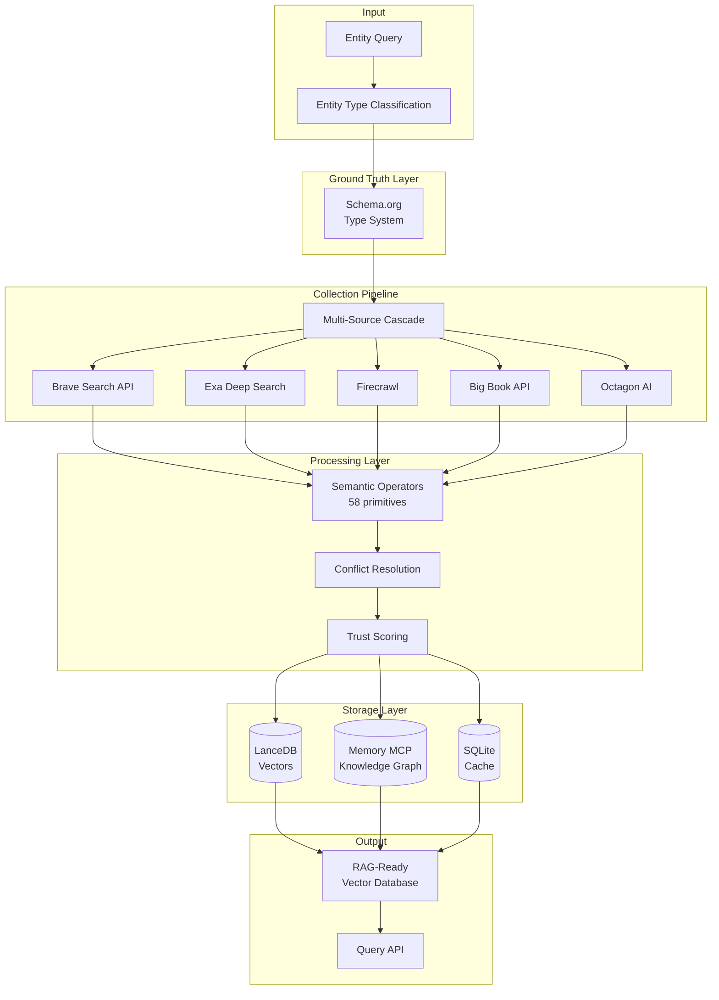
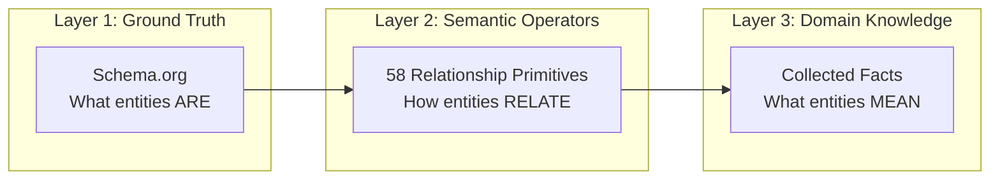

# KnowledgeBuilder

**Comprehensive Entity Knowledge Collection and Vectorization System**

KnowledgeBuilder collects, processes, contextualizes, and vectorizes comprehensive information about real-world entities (people, places, things) for AI/LLM ecosystems using standards-based semantic architectures.

---

## System Overview



---

## Key Features

### Standards-Based Semantic Architecture

- **Schema.org Taxonomy**: Industry-standard entity typing (Google, Microsoft, Yahoo)[^1]
- **58 Semantic Operators**: Linguistically-grounded relationship primitives from AMR, PropBank, ConceptNet, VerbNet[^2]
- **RDF/OWL Compliance**: W3C semantic web standards for interoperability[^3]

### Multi-Source Data Collection

- **Cascading Source Strategy**: Tiered collection with confidence-based precedence
- **Parallel Query Execution**: Bounded concurrency for performance
- **Conflict Resolution**: Multi-factor algorithm for contradictory data
- **Cost Optimization**: Budget tracking and diminishing returns detection

### Hybrid Storage System

- **Vector Search**: LanceDB for semantic similarity queries
- **Knowledge Graph**: Memory MCP for relationship traversal
- **Ground Truth Cache**: SQLite for structured metadata (7-day TTL)

### Quality Assurance

- **Trust Scoring**: Source credibility assessment (0-1 scale)
- **Completeness Metrics**: Attribute coverage tracking per entity type
- **Cross-Validation**: Multi-source verification for critical facts
- **Provenance Tracking**: Complete source chain documentation

---

## Quick Start

### Prerequisites

```bash
# Python 3.10+
python --version

# API Keys required in .env:
# - ANTHROPIC_API_KEY (Claude for analysis)
# - OPENAI_API_KEY (embeddings)
# - BRAVE_API_KEY (web search)
# - LANCEDB_API_KEY (vector storage)
```

### Installation

```bash
# Clone repository
git clone https://github.com/your-org/KnowledgeBuilder.git
cd KnowledgeBuilder

# Install dependencies
pip install -r requirements.txt

# Configure environment
cp .env.example .env
# Edit .env with your API keys

# Verify tools
python examples/validate_tools.py
```

### Basic Usage

```python
from knowledgebuilder import EntityCollector

# Initialize collector
collector = EntityCollector(
    entity_type="Person",
    completeness_target=0.70
)

# Collect entity data
result = collector.collect("Satya Nadella")

print(f"Completeness: {result.completeness_score}")
print(f"Quality: {result.quality_score}")
print(f"Sources: {len(result.sources)}")
print(f"Cost: ${result.cost:.2f}")

# Query vector database
from knowledgebuilder import VectorQuery

query = VectorQuery()
results = query.search("Who is the CEO of Microsoft?", k=5)
```

---

## Architecture

KnowledgeBuilder implements a three-layer semantic architecture:



**Design rationale**: This separation enables standards compliance (Layer 1), linguistic rigor (Layer 2), and domain flexibility (Layer 3). Pattern validated by Ludwig neurosymbolic memory system[^4] and PT-MCP code context protocol[^5].

See [ARCHITECTURE.md](ARCHITECTURE.md) for complete details.

---

## Entity Types Supported

| Type | Schema.org Base | Example Entities | Primary Sources |
|------|----------------|------------------|-----------------|
| **Person** | `schema:Person` | CEOs, public figures, developers | Wikipedia, LinkedIn, News |
| **Organization** | `schema:Organization` | Companies, institutions | Octagon AI, Crunchbase, Official sites |
| **Place** | `schema:Place` | Cities, landmarks, venues | GeoNames, Wikipedia, Local search |
| **Product** | `schema:Product` | Software, hardware, goods | Official sites, Reviews, GitHub |
| **Work** | `schema:CreativeWork` | Books, films, publications | Big Book API, IMDb, Scholar |
| **Event** | `schema:Event` | Conferences, historical events | News, Wikipedia, Event databases |
| **Concept** | `schema:Thing` | Technologies, methodologies | Academic sources, Documentation |

---

## Data Sources

### Primary APIs (Configured)

- **Brave Search**: Web/news/image/video search
- **Exa**: Deep content extraction with semantic understanding
- **LanceDB**: Cloud-hosted vector storage (`db://peripheral-json1d`)
- **Octagon AI**: Financial and company intelligence
- **Big Book API**: Published book metadata and semantic search

### MCP Servers

- **Memory**: Knowledge graph (entity relationships)
- **Firecrawl**: Website crawling and scraping
- **GitHub**: Developer and project data

See [DATA_SOURCES.md](DATA_SOURCES.md) for source orchestration details.

---

## Documentation

### Core Documents

- **[ARCHITECTURE.md](ARCHITECTURE.md)**: Complete system architecture, design decisions, and semantic model
- **[IMPLEMENTATION.md](IMPLEMENTATION.md)**: Practical implementation guide with code examples
- **[DATA_SOURCES.md](DATA_SOURCES.md)**: Data collection strategy, source mapping, and orchestration
- **[TOOL_ASSESSMENT.md](TOOL_ASSESSMENT.md)**: Available tools evaluation and integration priorities

### Development

- **[docs/STANDARDS.md](docs/STANDARDS.md)**: Documentation and code standards
- **[examples/](examples/)**: Tool validation and ontology research scripts
- **[config.yaml](config.yaml)**: System configuration template

---

## Project Status

**Phase**: Research complete, MVP implementation ready

**Completion**:
- ✅ Semantic architecture designed
- ✅ Entity ontology defined (7 types)
- ✅ Trust and quality frameworks specified
- ✅ Tool assessment complete
- ✅ Data collection strategy designed
- ⏳ Implementation (Week 3-4 target)

**Timeline**:
- MVP: 4 weeks (47 hours critical path)
- Production-ready: 10 weeks (185 hours total)

**Budget**:
- Per-entity target: $1.00
- MVP (50 entities): $50/month
- Production (10K entities): $5,000/month

---

## Key Metrics

### Quality Targets

| Metric | Target | Rationale |
|--------|--------|-----------|
| Completeness | >60% | Mandatory attributes + high-value optional |
| Accuracy | >90% | Cross-validated facts from multiple sources |
| Source Diversity | >5 | Multiple independent sources per entity |
| Freshness | <90 days | Current for dynamic entities |
| Trust Score | >0.70 | Weighted by source authority |

### Performance Targets

| Metric | MVP | Production |
|--------|-----|------------|
| Collection Time | <5 min | <2 min |
| Throughput | 10/hour | 100/hour |
| Query Latency | <500ms | <100ms |
| Cost per Entity | <$2.00 | <$1.00 |

### Evaluation & Telemetry

- **Context quality**: Use judge-based metrics (context_precision, context_recall, faithfulness, answer_correctness) with our RAGAS-lite evaluator to score enrichment/snippet selection.
- **Internal telemetry**: Record per-tool latency, cost, snippet/merge counts, and fact-extraction size for every run; join with judge scores to tune thresholds (snippet_limit, merge_threshold, timeouts).
- **Judge prompts**: Use constrained-label prompts for relevance/faithfulness/correctness (patterned after G-Eval/MT-Bench/RAGAS). Keep prompts/version and model ID logged; maintain a fixed control set to detect drift.
- **Judge backends**: Supports Ollama (preferred for local sovereignty) or OpenAI; select via `JUDGE_BACKEND=ollama|openai` in `scripts/run_judge_eval.py`.
- **Control set**: `data/judge_control.json` seeded; expand with real runs and log scores into telemetry for regression checks.

### Agentic Framework Assessment

- Evaluate agentic/orchestration options to sustain a “vibrant data ecosystem”: LangGraph/LCEL (LangChain), LlamaIndex Agents, AutoGen (MSR), Haystack Agents; consider OpenAI Assistants only if closed tooling is acceptable.
- Criteria: tool use, stateful workflows, scheduling, cost/latency visibility, local/oss friendliness (Ollama), ease of integrating telemetry/judge feedback loops.

---

## Design Decisions

### Why Ludwig's Semantic Operators?

- Linguistically grounded (AMR, PropBank, ConceptNet, VerbNet)[^3]
- Separates "what entities are" from "how they relate"
- Extensible with domain-specific operators
- Proven in neurosymbolic memory systems[^5]

### Why Hybrid Storage?

- **Vectors** (LanceDB): Semantic similarity search
- **Graph** (Memory MCP): Relationship traversal
- **Cache** (SQLite): Ground truth performance
- Pattern from GraphRAG research[^6] and production systems

---

## Contributing

KnowledgeBuilder follows rigorous standards:

1. **All flows diagrammed**: Mermaid required for interactions, data flows, and object models
2. **All decisions cited**: Design choices must reference sources (academic papers, proven systems, standards bodies)
3. **Forward-looking**: Focus on what we build, not historical mistakes

See [docs/STANDARDS.md](docs/STANDARDS.md) for complete guidelines.

---

## License

[Add license information]

---

## References

[^1]: Schema.org Community Group (2011-present). "Schema.org - Schema.org." https://schema.org/ (Industry standard maintained by Google, Microsoft, Yahoo, Yandex)
[^2]: Banarescu, L., et al. (2013). "Abstract Meaning Representation for Sembanking." *ACL Workshop on Linguistic Annotation*. + Palmer, M., et al. (2005). "PropBank: The Next Level." + Speer, R., & Havasi, C. (2012). "ConceptNet 5."
[^3]: W3C (2004). "RDF Primer." https://www.w3.org/TR/rdf-primer/ + "OWL Web Ontology Language." https://www.w3.org/OWL/
[^4]: Ludwig Project (2024). "LUDWIG_SPECIFICATION.md" at ~/Documents/GitClones/Ludwig/ (Neurosymbolic memory system and semantic operator patterns)
[^5]: PT-MCP Project (2024). "KNOWLEDGE_GRAPH_INTEGRATION.md" at ~/Documents/GitClones/pt-mcp/ (Code context protocol with semantic operators)
[^6]: Edge, D., et al. (2024). "From Local to Global: A Graph RAG Approach to Query-Focused Summarization." Microsoft Research. https://arxiv.org/abs/2404.16130

---

**Last Updated**: 2025-12-29  
**Version**: 1.0.0  
**Status**: Research Complete, Implementation Ready
