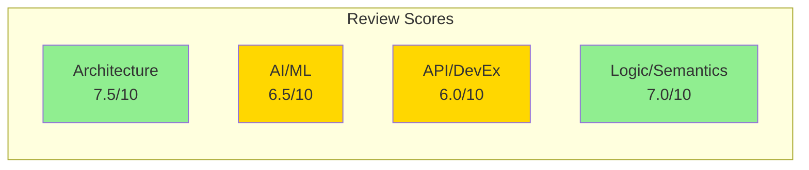
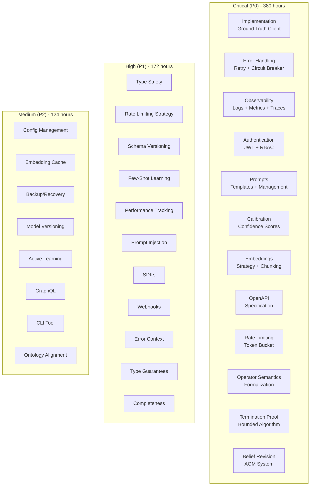
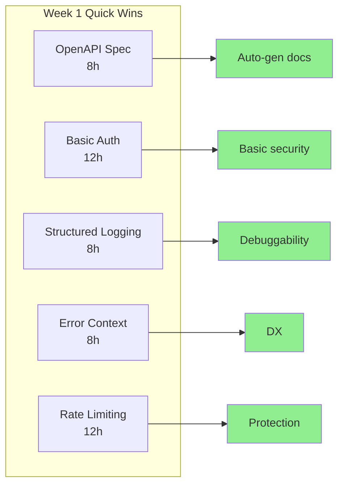
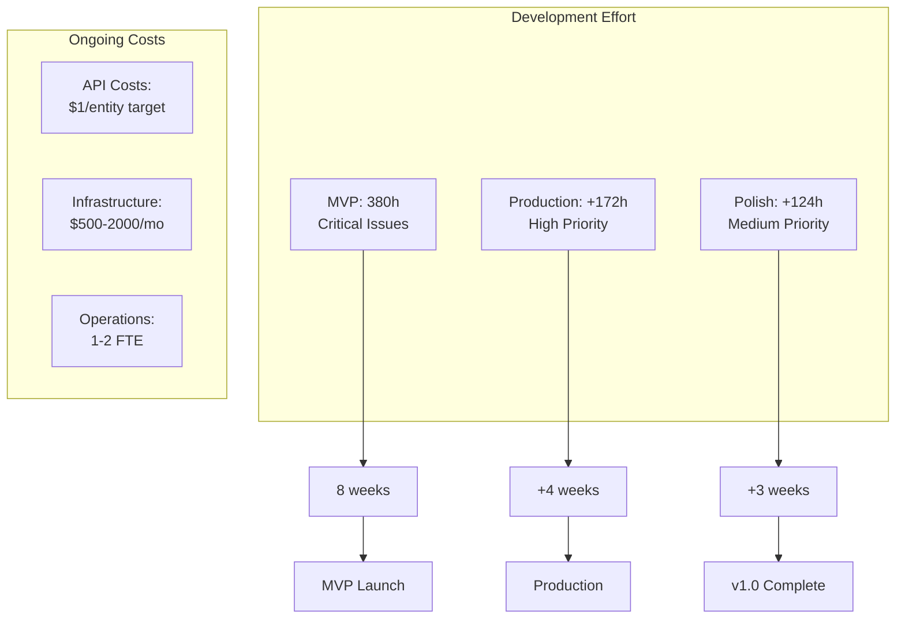

# KnowledgeBuilder: Code Review Executive Summary

**Review Date**: 2025-12-29  
**Project Phase**: Pre-Implementation (Specification)  
**Review Teams**: 4 cross-functional groups  
**Documents Reviewed**: ARCHITECTURE.md, IMPLEMENTATION.md, DATA_SOURCES.md, TOOL_ASSESSMENT.md, config.yaml

---

## Executive Overview

### Overall Scores

| Team | Score | Status |
|------|-------|--------|
| **Architecture & Systems** | 7.5/10 | 🟡 Good design, needs implementation |
| **AI/ML Engineering** | 6.5/10 | 🟡 Strong foundation, missing ops |
| **API/Developer Experience** | 6.0/10 | 🟡 Good patterns, needs tooling |
| **Logic & Semantics** | 7.0/10 | 🟡 Solid theory, needs formalization |
| **OVERALL** | **6.9/10** | 🟡 **GOOD WITH GAPS** |

---

## Critical Findings Summary

### 🔴 Critical Issues (P0 - Must Fix Before Launch)

#### 1. No Implementation Exists
- **Finding**: All `src/` directories are empty placeholders
- **Impact**: Cannot validate any architectural decisions
- **Teams**: Architecture, AI/ML, API
- **Action**: Implement core components (Ground Truth Client, Storage Layer, Basic Collector)

#### 2. Missing Error Handling
- **Finding**: No retry logic, circuit breakers, or resilience patterns
- **Impact**: System will fail on transient errors, no graceful degradation
- **Teams**: Architecture
- **Action**: Implement tenacity retry, circuit breaker pattern, partial failure handling

#### 3. No Observability
- **Finding**: No structured logging, metrics, or tracing
- **Impact**: Cannot diagnose issues or measure performance
- **Teams**: Architecture
- **Action**: Integrate structlog, Prometheus, OpenTelemetry

#### 4. Missing Authentication
- **Finding**: No security specifications
- **Impact**: Unprotected API access
- **Teams**: Architecture, API
- **Action**: Implement JWT auth and RBAC

#### 5. No Prompt Engineering
- **Finding**: Zero prompt templates despite extensive LLM usage
- **Impact**: Inconsistent results, no version control
- **Teams**: AI/ML
- **Action**: Create versioned prompt templates with management system

#### 6. Uncalibrated Confidence Scores
- **Finding**: Confidence scores are weighted sums, not calibrated probabilities
- **Impact**: Unreliable trust metrics
- **Teams**: AI/ML
- **Action**: Implement isotonic regression calibration with validation set

#### 7. No Embedding Strategy
- **Finding**: Embedding generation mentioned but not specified
- **Impact**: Cannot implement vectorization
- **Teams**: AI/ML
- **Action**: Design multi-granularity chunking strategy

#### 8. Missing OpenAPI Specification
- **Finding**: No machine-readable API contract
- **Impact**: No auto-generated docs or SDKs
- **Teams**: API
- **Action**: Create FastAPI app with OpenAPI spec

#### 9. No Rate Limiting
- **Finding**: API endpoints unprotected
- **Impact**: Vulnerable to abuse
- **Teams**: API
- **Action**: Implement slowapi rate limiting

#### 10. No Formal Operator Semantics
- **Finding**: 58 operators defined but semantics not formalized
- **Impact**: Cannot prove consistency
- **Teams**: Logic/Semantics
- **Action**: Create formal semantic specifications

#### 11. No Termination Proof
- **Finding**: Collection algorithm lacks termination guarantee
- **Impact**: Theoretical infinite loops
- **Teams**: Logic/Semantics
- **Action**: Formal proof and bounded implementation

#### 12. Informal Conflict Resolution
- **Finding**: Belief revision not formalized
- **Impact**: Inconsistent truth maintenance
- **Teams**: Logic/Semantics
- **Action**: Implement AGM belief revision system

**Total Critical Issues**: 12  
**Estimated Fix Effort**: 380 hours

---

### 🟡 High Priority Issues (P1 - Important for Production)

1. **Incomplete Type Safety** (Architecture) - 20h
2. **No Rate Limiting Strategy** (Architecture) - 16h
3. **No Schema Versioning** (Architecture) - 12h
4. **No Few-Shot Learning** (AI/ML) - 20h
5. **No Model Performance Tracking** (AI/ML) - 16h
6. **No Prompt Injection Protection** (AI/ML) - 12h
7. **No SDK/Client Libraries** (API) - 24h
8. **No Webhooks for Async Operations** (API) - 16h
9. **Insufficient Error Context** (API) - 8h
10. **No Type-Level Guarantees** (Logic) - 16h
11. **No Completeness Formalization** (Logic) - 12h

**Total High Priority**: 11 issues  
**Estimated Effort**: 172 hours

---

### 🟢 Medium Priority Issues (P2 - Nice to Have)

1. Configuration Management (Architecture) - 8h
2. Embedding Cache (Architecture) - 12h
3. Backup/Recovery Strategy (Architecture) - 16h
4. Embedding Model Versioning (AI/ML) - 4h
5. Active Learning Strategy (AI/ML) - 24h
6. GraphQL Interface (API) - 32h
7. CLI Tool (API) - 12h
8. Ontology Alignment Verification (Logic) - 16h

**Total Medium Priority**: 8 issues  
**Estimated Effort**: 124 hours

---

## Priority Matrix

---

## Strengths to Preserve

### ✅ Excellent Design Decisions

1. **Hybrid Storage Architecture** (9/10)
   - LanceDB (vectors) + Memory MCP (graph) + SQLite (cache)
   - Optimizes for different access patterns
   - Follows GraphRAG research patterns

2. **Standards-Based Foundation** (10/10)
   - Schema.org: Industry-standard taxonomy
   - W3C RDF/OWL: Semantic web compliance
   - Validated by Ludwig and PT-MCP projects

3. **Three-Layer Skill Builderl** (9/10)
   - Layer 1: Ground truth (what entities ARE)
   - Layer 2: Operators (how entities RELATE)
   - Layer 3: Domain knowledge (what entities MEAN)
   - Clean separation of concerns

4. **Multi-Source Orchestration** (8/10)
   - Tiered cascade with confidence-based precedence
   - Conflict resolution with trust scoring
   - Diminishing returns detection

5. **Cost Management Design** (8/10)
   - Per-entity budget tracking
   - Early termination on completeness target
   - Cost analytics

6. **Async-First API** (9/10)
   - Non-blocking I/O throughout
   - Supports concurrent operations
   - Excellent for scalability

---

## Quick Wins vs. Long-Term Improvements

### Quick Wins (< 2 weeks, high impact)

**Total**: 48 hours, 5 major improvements

### Long-Term Investments (> 4 weeks)

1. **Formal Verification System** (120h)
   - Operator semantics formalization
   - Termination proofs
   - Consistency checking
   - **Value**: Mathematical guarantees of correctness

2. **Complete ML Pipeline** (100h)
   - Prompt engineering system
   - Confidence calibration
   - Few-shot learning
   - Performance tracking
   - **Value**: Production-quality AI/ML

3. **Developer Ecosystem** (80h)
   - Python SDK
   - JavaScript SDK
   - CLI tool
   - GraphQL API
   - **Value**: Easy integration

4. **Production Operations** (60h)
   - Full observability stack
   - Backup/recovery
   - Incident response
   - **Value**: Operational excellence

**Total**: 360 hours over 8-12 weeks

---

## Risk Assessment

### High Risk (Requires Immediate Attention)

| Risk | Probability | Impact | Mitigation |
|------|------------|--------|------------|
| **Implementation doesn't match specs** | HIGH | HIGH | Start implementation Week 1, validate assumptions |
| **LLM costs exceed budget** | MEDIUM | HIGH | Implement cost tracking and limits immediately |
| **Uncalibrated confidence misleads users** | HIGH | HIGH | Calibration system before launch |
| **Security vulnerabilities exploited** | MEDIUM | CRITICAL | Auth + rate limiting before public API |

### Medium Risk (Monitor)

| Risk | Probability | Impact | Mitigation |
|------|------------|--------|------------|
| **Type errors in production** | MEDIUM | MEDIUM | Full mypy strict mode |
| **API breaking changes** | LOW | HIGH | Versioning strategy documented |
| **Prompt injection attacks** | MEDIUM | MEDIUM | Safety filters |
| **Infinite collection loops** | LOW | HIGH | Termination guarantees |

### Low Risk (Acceptable)

| Risk | Probability | Impact | Mitigation |
|------|------------|--------|------------|
| **Schema evolution challenges** | MEDIUM | LOW | Version all schemas |
| **Embedding model changes** | LOW | LOW | Version embeddings |
| **Third-party API changes** | LOW | MEDIUM | Abstraction layers |

---

## Cost-Benefit Analysis

### Implementation Costs

**Development**:
- MVP (P0 only): 380 hours = ~9.5 weeks (1 FTE)
- Production (P0 + P1): 552 hours = ~14 weeks (1 FTE)
- Full v1.0 (P0 + P1 + P2): 676 hours = ~17 weeks (1 FTE)

**Ongoing**:
- API costs: $0.50-2.00 per entity (target $1.00)
- Infrastructure: $500-2000/month (depending on scale)
- Operations: 1-2 FTE for support

### Value Delivered

**At MVP** (380 hours):
- ✅ Working entity collection
- ✅ Basic vectorization
- ✅ Secure API
- ✅ Observable system
- ✅ Calibrated confidence
- ⚠️ Manual integration (no SDKs)

**At Production** (+172 hours):
- ✅ Python SDK
- ✅ Async webhooks
- ✅ Few-shot prompts
- ✅ Performance monitoring
- ✅ Type safety
- ✅ Production-ready

**At v1.0** (+124 hours):
- ✅ GraphQL API
- ✅ CLI tool
- ✅ Backup/recovery
- ✅ Active learning
- ✅ Full feature set

---

## Recommendations

### Immediate Actions (This Week)

**Priority 1: Validate Architecture** (40 hours)
2. Implement Basic Storage (LanceDB + SQLite)
3. Implement Simple Collector (Brave Search)
4. Test end-to-end flow

**Rationale**: Validate core architectural decisions before committing to full build.

**Priority 2: Add Observability** (16 hours)
1. Structured logging (structlog)
2. Basic metrics (Prometheus)
3. Health endpoints

**Rationale**: Cannot debug without logs. Need visibility from day 1.

**Priority 3: Security Baseline** (20 hours)
1. JWT authentication
2. Basic RBAC
3. Rate limiting (slowapi)

**Rationale**: Cannot deploy without basic security.

### First Month (Weeks 1-4)

**Goal**: Production-Ready MVP

**Week 1**: Core Implementation (40h)
- Ground truth client
- Storage layer
- Basic collection
- Observability

**Week 2**: ML Pipeline (40h)
- Prompt templates
- Confidence calibration
- Embedding strategy
- Basic quality checks

**Week 3**: API & Safety (40h)
- OpenAPI specification
- Error handling
- Rate limiting
- Prompt injection protection

**Week 4**: Polish & Testing (40h)
- Integration tests
- Performance testing
- Documentation
- Bug fixes

**Deliverable**: Deployable MVP with core features

### Second Month (Weeks 5-8)

**Goal**: Production Hardening

- Complete error recovery (retry, circuit breaker)
- Python SDK
- Webhooks for async ops
- Type safety improvements
- Schema versioning
- Performance tracking

**Deliverable**: Production-ready system

### Third Month (Weeks 9-12)

**Goal**: Developer Experience

- CLI tool
- GraphQL API
- JavaScript SDK
- Enhanced documentation
- Backup/recovery
- Active learning

**Deliverable**: v1.0 Release

---

## Success Metrics

### Technical Metrics

| Metric | MVP Target | Production Target |
|--------|-----------|-------------------|
| Entity Type Accuracy | >90% | >95% |
| Fact Extraction Precision | >85% | >90% |
| Completeness Score | >55% | >65% |
| Calibration ECE | <0.10 | <0.05 |
| Query Latency (p95) | <500ms | <100ms |
| Collection Time | <5 min | <2 min |
| Cost per Entity | <$2.00 | <$1.00 |
| API Uptime | >95% | >99.5% |

### Business Metrics

| Metric | 3 Months | 6 Months | 12 Months |
|--------|----------|----------|-----------|
| **Entities Collected** | 1,000 | 10,000 | 100,000 |
| **API Users** | 10 | 100 | 1,000 |
| **Query Volume** | 10K/mo | 100K/mo | 1M/mo |
| **Revenue** (if applicable) | - | $5K/mo | $50K/mo |

### Quality Metrics

- **Test Coverage**: >80% for core components
- **Documentation**: Complete API docs + guides
- **Security**: No critical vulnerabilities
- **Performance**: All latency targets met

---

## Conclusion

**KnowledgeBuilder has excellent potential** with strong architectural foundations and thorough specifications. The core design is sound, grounded in proven standards and research.

**However**, critical production gaps must be addressed before launch:
- No implementation yet (highest risk)
- Missing operational concerns (observability, security)
- ML engineering gaps (prompts, calibration)
- Formal verification needed (semantics, termination)

**Recommended Path Forward**:
1. **Validate architecture** with minimal implementation (Week 1)
2. **Build MVP** with critical features only (Weeks 2-4)
3. **Harden for production** (Weeks 5-8)
4. **Enhance DX** (Weeks 9-12)

**Timeline**: 3 months to production-ready v1.0  
**Effort**: ~680 hours (1 FTE for 4 months)  
**Investment**: High upfront, but solid foundation for scaling

**Key Success Factor**: Start implementation immediately to validate architectural assumptions. Documentation is excellent, but needs validation through code.

---

**Review Complete**: 2025-12-29  
**Next Step**: IMPLEMENTATION_PLAN.md with phased approach
