# KnowledgeBuilder: Code Review Visual Summary

**Review Date**: 2025-12-29  
**Assessment**: 6.9/10 - Good Design, Critical Gaps  
**Timeline to v1.0**: 17 weeks (676 hours)

---

## Overall Scores

```mermaid
graph TB
    subgraph "Team Scores"
        T1[Architecture<br/>7.5/10<br/>🟢 Good]
        T2[AI/ML<br/>6.5/10<br/>🟡 Needs Work]
        T3[API/DevEx<br/>6.0/10<br/>🟡 Needs Work]
        T4[Logic/Semantics<br/>7.0/10<br/>🟢 Good]
    end
    
    subgraph "Composite"
        Overall[OVERALL<br/>6.9/10<br/>🟡 Good with Gaps]
    end
    
    T1 --> Overall
    T2 --> Overall
    T3 --> Overall
    T4 --> Overall
    
    style T1 fill:#90EE90
    style T2 fill:#FFD700
    style T3 fill:#FFD700
    style T4 fill:#90EE90
    style Overall fill:#FFD700
```



---

## Issue Distribution


---

## Critical Issues Map


---

## Strengths vs. Gaps


---

## Implementation Timeline


---

## Priority Matrix


---

## Architecture Validation Flow


**This flow must work in Phase 1 to validate architecture.**

---

## Error Handling Requirements


**Critical**: Every failure mode must have defined handler.

---

## ML Pipeline Architecture


**Yellow components**: Critical ML gaps that must be implemented.

---

## Security Architecture

```mermaid
graph TB
    subgraph "Authentication"
        User[User/Agent]
        JWT[JWT Token<br/>Service]
        Verify[Token<br/>Verification]
    end
    
    subgraph "Authorization"
        RBAC[RBAC<br/>Engine]
        Roles[User Roles:<br/>viewer, collector,<br/>admin]
    end
    
    subgraph "Protection"
        Rate[Rate<br/>Limiter]
        PI[Prompt Injection<br/>Filter]
        Valid[Input<br/>Validation]
    end
    
    subgraph "API Endpoints"
        E1[/entities]
        E2[/search]
        E3[/admin]
    end
    
    User -->|Login| JWT
    JWT -->|Issue| Token[Access Token]
    Token -->|Present| Verify
    Verify -->|Check| RBAC
    RBAC -->|Enforce| Roles
    
    Roles --> Rate
    Rate --> PI
    PI --> Valid
    
    Valid --> E1
    Valid --> E2
    Valid --> E3
    
    style User fill:#87CEEB
    style Token fill:#90EE90
    style Rate fill:#FFD700
    style PI fill:#FFD700
    style Valid fill:#90EE90
```

**Critical**: All security components currently missing from specifications.

---

## Observability Stack


**Critical**: Zero observability currently - cannot operate without this.

---

## Formal Verification Requirements

```mermaid
graph TB
    subgraph "What Must Be Proven"
        T1[Termination:<br/>Collection terminates<br/>in O(m) iterations]
        T2[Consistency:<br/>No contradictory<br/>beliefs in KB]
        T3[Soundness:<br/>Operators preserve<br/>semantic properties]
        T4[Completeness:<br/>Operators can express<br/>all relationships]
        T5[Correctness:<br/>Algorithms produce<br/>correct results]
    end
    
    subgraph "Methods"
        M1[Mathematical<br/>Proof]
        M2[Type System<br/>Guarantees]
        M3[Property Testing<br/>QuickCheck]
        M4[Formal<br/>Specification]
    end
    
    T1 --> M1
    T2 --> M4
    T3 --> M2
    T4 --> M4
    T5 --> M3
    
    M1 --> Verified[Formally<br/>Verified System]
    M2 --> Verified
    M3 --> Verified
    M4 --> Verified
    
    style T1 fill:#FFD700
    style T2 fill:#FFD700
    style T3 fill:#FFD700
    style T4 fill:#FFD700
    style T5 fill:#FFD700
    style Verified fill:#90EE90
```

**Required**: Formal proofs before claiming correctness guarantees.

---

## Implementation Dependencies


**Critical Path**: Phase 1 validation blocks everything. Must succeed.

---

## Effort Distribution by Team


---

## Cost-Benefit Analysis


### ROI Projections

**Break-Even Analysis** (if commercialized):

| Metric | 6 Months | 12 Months | 24 Months |
|--------|----------|-----------|-----------|
| **Entities** | 10,000 | 100,000 | 1,000,000 |
| **Users** | 100 | 1,000 | 10,000 |
| **Queries/mo** | 100K | 1M | 10M |
| **Revenue/mo** | $5K | $50K | $500K |
| **Costs/mo** | $3K | $15K | $75K |
| **Net/mo** | $2K | $35K | $425K |

**Assumptions**:
- $0.10 per query (premium tier)
- 50K queries per user per month
- $30/month infrastructure per 10K entities
- 70% gross margin

---

## Technical Debt Quadrant


---

## Week 1 Validation Checklist

### Must Prove These Work

  - [ ] SPARQL queries return results (<5s)
  - [ ] Entity resolution achieves >80% success rate
  - [ ] SQLite cache reduces latency to <10ms
  - [ ] Fallback to Wikidata works

- [ ] **Storage Integration**
  - [ ] LanceDB stores vectors successfully
  - [ ] Vector search returns results (<100ms)
  - [ ] SQLite metadata cache works
  - [ ] Memory MCP (if time) basic test

- [ ] **Collection Flow**
  - [ ] Brave Search returns data (<5s)
  - [ ] Can extract structured facts
  - [ ] End-to-end flow completes
  - [ ] Data persists correctly

- [ ] **Architecture Validated**
  - [ ] No blocking issues found
  - [ ] Performance acceptable
  - [ ] Integration complexity manageable
  - [ ] Can proceed to Phase 2 with confidence

### Validation Tests

```python
# tests/validation/test_architecture.py

@pytest.mark.critical
def test_yago_integration():
    result = client.resolve_entity("Albert Einstein")
    assert result is not None
    assert result['yago_uri']
    assert result['schema_type'] == "schema:Person"

@pytest.mark.critical
def test_storage_integration():
    """Validate hybrid storage"""
    # Test LanceDB
    lance = LanceDBClient(uri=TEST_URI, api_key=TEST_KEY)
    embedding = np.random.rand(3072)
    lance.insert_entity(test_entity, embedding)
    results = lance.search(embedding, k=1)
    assert len(results) == 1
    
    # Test SQLite
    cache = SQLiteCache()
    cache.set_metadata("test", {"quality": 0.85})
    metadata = cache.get_metadata("test")
    assert metadata["quality"] == 0.85

@pytest.mark.critical
async def test_collection_flow():
    """Validate collection pipeline"""
    collector = BraveSearchCollector()
    data = await collector.collect("Satya Nadella", "Person")
    assert data['attributes']
    assert data['confidence'] > 0.0
    assert data['cost'] < 0.01

@pytest.mark.critical
async def test_end_to_end():
    """Validate complete flow"""
    # This is the ultimate validation test
    pass  # Implemented in Phase 1
```

**If any validation test fails**: Reassess architecture before continuing.

---

## Risk Heatmap


---

## Success Criteria by Phase

```mermaid
graph LR
    subgraph "Phase 1: Validation"
        V2[Storage <100ms<br/>latency]
        V3[Collection <5s]
        V4[E2E test<br/>passes]
    end
    
    subgraph "Phase 2: MVP"
        M1[Classification<br/>>90% accuracy]
        M2[Calibration<br/>ECE <0.10]
        M3[Retrieval<br/>MRR@10 >0.7]
        M4[All tests<br/>passing]
    end
    
    subgraph "Phase 3: Production"
        P1[Uptime<br/>>99%]
        P2[Latency p95<br/><500ms]
        P3[Cost/entity<br/><$1.50]
        P4[Zero critical<br/>bugs]
    end
    
    subgraph "Phase 4: Polish"
        L1[SDKs<br/>published]
        L2[CLI<br/>working]
        L3[Docs<br/>complete]
    end
    
    subgraph "Phase 5: Launch"
        R1[Security<br/>audit passed]
        R2[Load tests<br/>passed]
        R3[v1.0<br/>released]
    end
    
    V1 --> M1
    V2 --> M1
    V3 --> M1
    V4 --> M1
    
    M1 --> P1
    M2 --> P1
    M3 --> P1
    M4 --> P1
    
    P1 --> L1
    P2 --> L1
    P3 --> L1
    P4 --> L1
    
    L1 --> R1
    L2 --> R1
    L3 --> R1
    
    R1 --> R2
    R2 --> R3
```

---

## Quality Gates

### Gate 1: Phase 1 → Phase 2
✅ Architecture validation tests pass  
✅ No critical architectural flaws found  
✅ Performance within 2x of targets  
✅ Integration complexity manageable

**Decision**: GO / NO-GO to Phase 2

---

### Gate 2: Phase 2 → Phase 3
✅ MVP functionally complete  
✅ Classification accuracy >90%  
✅ Calibration ECE <0.10  
✅ Retrieval quality MRR@10 >0.7  
✅ Core tests passing  
✅ Basic observability working

**Decision**: GO / NO-GO to Phase 3

---

### Gate 3: Phase 3 → Phase 4
✅ Production features complete  
✅ Security audit preliminary passed  
✅ Performance targets met  
✅ Error handling comprehensive  
✅ Uptime >95% in staging

**Decision**: GO / NO-GO to Phase 4

---

### Gate 4: Phase 4 → Phase 5
✅ All enhancements complete  
✅ SDKs tested and published  
✅ Documentation reviewed  
✅ No known critical bugs  
✅ Load testing preliminary results good

**Decision**: GO / NO-GO to Launch

---

## Immediate Action Items

### This Week (Week 1)

**Monday (Day 1)**: 
- [ ] Set up development environment
- [ ] Create SQLite cache schema
- [ ] First SPARQL query test

**Tuesday (Day 2)**:
- [ ] Implement caching layer
- [ ] Test with 10 entities

**Wednesday (Day 3)**:
- [ ] Implement LanceDB client
- [ ] Create table schema
- [ ] Test vector insert/search

**Thursday (Day 4)**:
- [ ] Implement Brave Search collector
- [ ] Basic fact extraction
- [ ] Integration test

**Friday (Day 5)**:
- [ ] End-to-end validation test
- [ ] Performance measurement
- [ ] Phase 1 review
- [ ] GO/NO-GO decision for Phase 2

---

## Key Metrics Dashboard

### Development Progress

| Metric | Current | Phase 1 | Phase 2 | Phase 3 | Phase 4 | Phase 5 |
|--------|---------|---------|---------|---------|---------|---------|
| **Features Complete** | 0% | 10% | 40% | 75% | 95% | 100% |
| **Tests Passing** | 0 | 5 | 25 | 60 | 80 | 100 |
| **Test Coverage** | 0% | 30% | 60% | 80% | 85% | 90% |
| **Documentation** | 90% | 90% | 95% | 95% | 98% | 100% |

### Quality Metrics

| Metric | Target | Status |
|--------|--------|--------|
| Entity Type Accuracy | >90% | 📊 TBD |
| Fact Precision | >85% | 📊 TBD |
| Calibration ECE | <0.10 | 📊 TBD |
| Retrieval MRR@10 | >0.7 | 📊 TBD |
| Query Latency p95 | <500ms | 📊 TBD |
| Cost per Entity | <$1.50 | 📊 TBD |

### Operational Metrics

| Metric | Target | Status |
|--------|--------|--------|
| API Uptime | >99.5% | 🔴 Not deployed |
| Error Rate | <1% | 🔴 No data |
| Mean Time to Recovery | <15min | 🔴 No incidents |

---

## Recommended Reading

### For Implementers

1. **COMPREHENSIVE_CODE_REVIEW.md** - Full technical findings
2. **IMPLEMENTATION_PLAN.md** - Detailed task breakdown
3. **ARCHITECTURE.md** - System design reference
4. **IMPLEMENTATION.md** - Code patterns

### For Leadership

1. **REVIEW_SUMMARY.md** - Executive overview
2. **IMPLEMENTATION_PLAN.md** § Timeline - Schedule
3. **IMPLEMENTATION_PLAN.md** § Cost-Benefit - ROI analysis

### For Security

1. **COMPREHENSIVE_CODE_REVIEW.md** § Team 1 - Security architecture
2. **COMPREHENSIVE_CODE_REVIEW.md** § Team 2 - Prompt injection
3. **IMPLEMENTATION_PLAN.md** § Security - Implementation

---

## Final Recommendation

**START PHASE 1 IMMEDIATELY**

KnowledgeBuilder has:
- ✅ Excellent architectural design
- ✅ Strong semantic foundations
- ✅ Comprehensive documentation
- ✅ Clear value proposition

But needs:
- 🔴 Implementation (highest priority)
- 🔴 Production readiness (security, observability, error handling)
- 🔴 ML operations (prompts, calibration, embedding strategy)
- 🔴 Formal verification (proofs, semantics)

**The design is sound. Time to build.**

**Timeline**: 17 weeks to v1.0 with validated architecture and production-ready implementation.

---

**Visual Summary Version**: 1.0  
**Created**: 2025-12-29  
**Next Update**: After Phase 1 Validation
