# KnowledgeBuilder: Code Review Quick Reference

**Review Date**: 2025-12-29  
**Overall Score**: 6.9/10 - Good with Critical Gaps  
**Status**: Ready for Phase 1 Implementation

---

## TL;DR - What You Need to Know

**✅ GOOD NEWS**: 
- Excellent architectural design (hybrid storage, standards-based)
- Comprehensive documentation (22 Mermaid diagrams, 40 citations)

**🔴 CRITICAL GAPS**:
- No implementation exists (src/ directories empty)
- Missing production concerns (error handling, observability, security)
- ML engineering gaps (prompts, calibration, embedding strategy)
- Needs formal verification (termination proofs, operator semantics)

**🎯 ACTION**: Start Phase 1 validation immediately (Week 1, 40 hours)

---

## Critical Issues (Must Fix - P0)

| # | Issue | Team | Fix Time | Phase |
|---|-------|------|----------|-------|
| 1 | No implementation | All | 40h | 1 |
| 2 | No error handling | Arch | 32h | 2 |
| 3 | No observability | Arch | 24h | 2 |
| 4 | No authentication | Arch/API | 20h | 2 |
| 5 | No prompt system | AI/ML | 40h | 2 |
| 6 | Uncalibrated confidence | AI/ML | 60h | 2 |
| 7 | No embedding strategy | AI/ML | 30h | 2 |
| 8 | No OpenAPI spec | API | 12h | 2 |
| 9 | No rate limiting | API | 16h | 2 |
| 10 | No operator semantics | Logic | 60h | 3 |
| 11 | No termination proof | Logic | 20h | 3 |
| 12 | Informal conflict resolution | Logic | 26h | 3 |

**Total**: 380 hours across Phases 1-3

---

## Week 1 Validation Tasks (40h)

### Day 1-2: Ground Truth Client (12h)

```python
# src/ground_truth/yago_client.py
    def resolve_entity(self, name: str) -> Optional[Dict]:
        # 1. Check cache (SQLite)
        # 3. Calculate confidence
        # 4. Cache result
```

**Test**: Resolve "Albert Einstein", "Microsoft", "Paris"  
**Success**: >80% success rate, <2s latency

---

### Day 2-3: Storage Layer (16h)

```python
# src/storage/lancedb_client.py
class LanceDBClient:
    def insert_entity(self, entity, embedding): pass
    def search(self, query_embedding, k=10): pass

# src/storage/sqlite_cache.py
class SQLiteCache:
    def set_metadata(self, entity_id, metadata): pass
    def get_metadata(self, entity_id): pass
```

**Test**: Store and retrieve 100 entities  
**Success**: <100ms p95 query latency

---

### Day 4: Simple Collector (12h)

```python
# src/collectors/brave_collector.py
class BraveSearchCollector:
    async def collect(self, identifier, entity_type):
        # 1. Build search query
        # 2. Call Brave API
        # 3. Extract attributes
        # 4. Return structured data
```

**Test**: Collect "Satya Nadella"  
**Success**: Returns structured attributes in <5s

---

### Day 5: Validation (8h)

```python
# tests/validation/test_architecture.py
@pytest.mark.critical
async def test_end_to_end():
    # 2. Collect data (Brave)
    # 3. Store (LanceDB + SQLite)
    # 4. Query and retrieve
    pass  # Must pass for Phase 2 GO
```

**GO/NO-GO Decision**: If validation passes → Phase 2. If fails → Reassess.

---

## Most Critical Code Examples

### 1. Error Handling Pattern (P0)

```python
from tenacity import retry, stop_after_attempt, wait_exponential
from circuitbreaker import circuit

@retry(
    stop=stop_after_attempt(3),
    wait=wait_exponential(multiplier=1, min=2, max=10)
)
@circuit(failure_threshold=5, recovery_timeout=60)
async def query_with_resilience(source: str, identifier: str):
    """Query with retry and circuit breaker"""
    async with asyncio.timeout(30):
        return await api_call(source, identifier)
```

---

### 2. Observability Pattern (P0)

```python
import structlog
from prometheus_client import Histogram

logger = structlog.get_logger()
duration = Histogram('collection_duration_seconds', 'Collection time', ['entity_type'])

async def collect_entity(identifier: str):
    with tracer.start_as_current_span("collect_entity"):
        logger.info("collection_started", entity_id=identifier)
        
        with duration.labels(entity_type=self.entity_type).time():
            result = await self._collect(identifier)
        
        logger.info("collection_completed", completeness=result.completeness)
        return result
```

---

### 3. Authentication Pattern (P0)

```python
from fastapi import Depends, HTTPException
from fastapi.security import HTTPBearer
from jose import jwt

security = HTTPBearer()

def verify_token(credentials = Depends(security)):
    try:
        payload = jwt.decode(credentials.credentials, SECRET_KEY)
        return payload
    except JWTError:
        raise HTTPException(401, "Invalid token")

@app.post("/api/v1/entities")
async def collect_entity(request, auth = Depends(verify_token)):
    pass  # Only authenticated users
```

---

### 4. Prompt Template Pattern (P0)

```python
from jinja2 import Template

ENTITY_TYPE_CLASSIFICATION = """
Classify this entity into ONE type:
Person, Organization, Place, Product, Work, Event, or Concept

Entity: {{ entity_name }}
Context: {{ context }}

Type (one word):
"""

def classify_entity(name: str, context: str) -> str:
    prompt = Template(ENTITY_TYPE_CLASSIFICATION).render(
        entity_name=name,
        context=context
    )
    
    response = anthropic.messages.create(
        model="claude-3-5-sonnet-20241022",
        temperature=0.0,
        max_tokens=100,
        messages=[{"role": "user", "content": prompt}]
    )
    
    return response.content[0].text.strip()
```

---

### 5. Confidence Calibration Pattern (P0)

```python
from sklearn.isotonic import IsotonicRegression

class ConfidenceCalibrator:
    def __init__(self):
        self.calibrator = IsotonicRegression(out_of_bounds='clip')
    
    def fit(self, predictions: list[float], ground_truth: list[bool]):
        self.calibrator.fit(predictions, ground_truth)
    
    def calibrate(self, score: float) -> float:
        """Convert uncalibrated score to probability"""
        return float(self.calibrator.predict([score])[0])

# Usage
calibrator = ConfidenceCalibrator()
calibrator.fit(validation_scores, validation_correct)

# Now all confidence scores are calibrated
raw_score = 0.75
calibrated_prob = calibrator.calibrate(raw_score)  # True probability
```

---

### 6. Embedding Strategy Pattern (P0)

```python
from openai import AsyncOpenAI

class EntityEmbeddingStrategy:
    def chunk_entity(self, entity: Dict) -> List[Dict]:
        """Multi-granularity chunking"""
        chunks = []
        
        # Entity summary (500 tokens)
        chunks.append({
            "text": self._create_summary(entity),
            "type": "summary",
            "metadata": {"entity_id": entity["id"]}
        })
        
        # Per-attribute (100 tokens each)
        for attr, value in entity["attributes"].items():
            chunks.append({
                "text": f"{attr}: {value}",
                "type": "attribute",
                "metadata": {"entity_id": entity["id"], "attribute": attr}
            })
        
        return chunks
    
    async def embed_chunks(self, chunks: List[Dict]) -> List[Dict]:
        """Generate embeddings"""
        texts = [c["text"] for c in chunks]
        response = await openai.embeddings.create(
            model="text-embedding-3-large",
            input=texts
        )
        return [{"embedding": r.embedding, **chunks[i]} for i, r in enumerate(response.data)]
```

---

## Decision Framework

### Should I Start Implementation?

```mermaid
flowchart TD
    Start{Ready to<br/>Implement?}
    
    Start -->|Check| Q1{Have reviewed<br/>REVIEW_SUMMARY.md?}
    Q1 -->|No| Read1[Read Summary]
    Q1 -->|Yes| Q2{Understand<br/>critical issues?}
    
    Q2 -->|No| Read2[Read<br/>COMPREHENSIVE_CODE_REVIEW.md]
    Q2 -->|Yes| Q3{Have 40 hours<br/>for Week 1?}
    
    Q3 -->|No| Wait[Wait for<br/>availability]
    Q3 -->|Yes| Q4{API keys<br/>configured?}
    
    Q4 -->|No| Config[Configure .env]
    Q4 -->|Yes| Q5{Development<br/>environment ready?}
    
    Q5 -->|No| Setup[Run setup]
    Q5 -->|Yes| GO[✅ START<br/>PHASE 1]
    
    Read1 --> Q2
    Read2 --> Q3
    Config --> Q5
    Setup --> GO
```



---

## Implementation Checklist

### Before Starting Phase 1

- [ ] Read REVIEW_SUMMARY.md (20 minutes)
- [ ] Understand critical issues (30 minutes)
- [ ] Review IMPLEMENTATION_PLAN.md Phase 1 section (15 minutes)
- [ ] Set up development environment:
  - [ ] Python 3.10+ installed
  - [ ] Virtual environment created
  - [ ] Dependencies installed (`pip install -r requirements.txt`)
  - [ ] API keys in `.env` file
  - [ ] Git configured

### During Phase 1 (Week 1)

**Monday**:
- [ ] Start ground truth client implementation
- [ ] Create SQLite cache schema

**Tuesday**:
- [ ] Implement caching layer
- [ ] Test with 10 diverse entities

**Wednesday**:
- [ ] Implement LanceDB client
- [ ] Test vector storage
- [ ] Verify search works

**Thursday**:
- [ ] Implement Brave Search collector
- [ ] Basic fact extraction
- [ ] Integration between components

**Friday**:
- [ ] End-to-end validation test
- [ ] Performance measurement
- [ ] Phase 1 review meeting
- [ ] **GO/NO-GO decision for Phase 2**

---

## Red Flags to Watch For

### During Implementation

- Indicates entity matching algorithm needs tuning
- Action: Review matching logic, add Wikidata fallback

🚩 **Storage latency >100ms consistently**
- Indicates indexing or connection issues
- Action: Review LanceDB configuration, check network

🚩 **Collection takes >10s for simple entities**
- Indicates API performance issues
- Action: Add caching, reduce API calls

🚩 **Integration complexity exploding**
- Indicates architectural issues
- Action: Simplify, consider redesign

🚩 **Cannot achieve 60% completeness**
- Indicates source quality or extraction issues
- Action: Review data sources, improve extraction

---

## Quick Wins (High Impact, Low Effort)

1. **OpenAPI Specification** (12h, P0)
   - FastAPI auto-generates
   - Enables Swagger UI at `/docs`
   - Instant API documentation

2. **Structured Logging** (8h, P0)
   - Replace `print()` with `structlog`
   - Searchable logs immediately
   - Production-ready logging

3. **Rate Limiting** (12h, P0)
   - `slowapi` library (5 lines)
   - Protection from abuse
   - Production-safe API

4. **Error Context** (8h, P1)
   - Structured error responses
   - Better developer experience
   - Easier debugging

5. **CLI Tool** (12h, P2)
   - `click` library
   - Quick testing capability
   - Developer productivity

**Total**: 52 hours for 5 major improvements

---

## Resource Links

### Review Documents
- [COMPREHENSIVE_CODE_REVIEW.md](COMPREHENSIVE_CODE_REVIEW.md) - Complete findings (35,000 words)
- [REVIEW_SUMMARY.md](REVIEW_SUMMARY.md) - Executive summary (5,000 words)
- [IMPLEMENTATION_PLAN.md](IMPLEMENTATION_PLAN.md) - 17-week roadmap (8,000 words)
- [REVIEW_VISUAL_SUMMARY.md](REVIEW_VISUAL_SUMMARY.md) - Visual analysis (6,000 words)

### Architecture Documents
- [ARCHITECTURE.md](ARCHITECTURE.md) - System design
- [IMPLEMENTATION.md](IMPLEMENTATION.md) - Code patterns
- [DATA_SOURCES.md](DATA_SOURCES.md) - Data collection

### Standards
- [docs/STANDARDS.md](docs/STANDARDS.md) - Documentation and code standards
- [docs/NAVIGATION.md](docs/NAVIGATION.md) - Documentation guide

---

## Questions & Answers

**Q: Should we start implementing now?**  
A: **YES**. Phase 1 validation is critical. Documentation is excellent; need code to validate assumptions.

**Q: What's the minimum viable implementation?**  
A: Ground Truth Client + Storage Layer + Simple Collector + E2E test (40 hours).

**Q: What if Phase 1 validation fails?**  
A: Reassess architecture. Use buffer time (4 weeks) to pivot. Document learnings.

**Q: Can we skip any critical issues?**  
A: **NO**. All P0 issues must be addressed for production readiness.

**Q: What's the fastest path to deployment?**  
A: Complete P0 issues only (380 hours = 9.5 weeks). Deploy MVP, iterate on P1/P2.

**Q: How much will this cost?**  
A: Development: ~$67K (676h @ $100/hr). Operations: $500-2100/month.

**Q: What's the ROI?**  
A: If commercialized: ~$2K/month at 6 months, ~$35K/month at 12 months (assumes $0.10/query pricing).

**Q: What happens after v1.0?**  
A: Continuous improvement: active learning, model updates, new entity types, performance optimization.

---

## Team-Specific Quick Reference

### For Backend Developers
**Focus**: Phase 1-2 (Weeks 1-4)
- Add error handling (retry, circuit breaker)
- Set up observability (logs, metrics)
- Read: IMPLEMENTATION.md, ARCHITECTURE.md

### For ML Engineers
**Focus**: Phase 2-3 (Weeks 2-8)
- Build prompt engineering system
- Implement confidence calibration
- Design embedding strategy
- Add safety filters
- Read: COMPREHENSIVE_CODE_REVIEW.md § Team 2

### For API Developers
**Focus**: Phase 2-4 (Weeks 2-11)
- Create OpenAPI specification
- Build Python SDK
- Implement webhooks
- Add rate limiting
- Read: COMPREHENSIVE_CODE_REVIEW.md § Team 3

### For Researchers
**Focus**: Phase 3 (Weeks 5-8)
- Formalize operator semantics
- Prove termination guarantees
- Implement belief revision
- Verify consistency
- Read: COMPREHENSIVE_CODE_REVIEW.md § Team 4

---

## Timeline at a Glance

| Phase | Weeks | Hours | Key Deliverable |
|-------|-------|-------|----------------|
| **1: Validation** | 1 | 40 | Architecture proven |
| **2: MVP Core** | 2-4 | 120 | Working MVP |
| **3: Production** | 5-8 | 220 | Production-ready |
| **4: Polish** | 9-11 | 180 | Enhanced features |
| **5: Launch** | 12-13 | 80 | v1.0 Release |
| **Buffer** | 14-17 | 36 | Contingency |
| **TOTAL** | **17** | **676** | **Complete System** |

---

## Success Metrics

### Must Achieve for Launch

| Metric | Target | How to Measure |
|--------|--------|----------------|
| Entity Type Accuracy | >95% | Manual validation (n=1000) |
| Calibration ECE | <0.05 | Expected Calibration Error |
| Query Latency | <100ms | p95 latency monitoring |
| Cost per Entity | <$1.00 | API cost tracking |
| API Uptime | >99.5% | Health check monitoring |
| Test Coverage | >80% | pytest-cov |
| Security Audit | Pass | Third-party audit |

---

## When to Use Each Document

**Starting out?**  
→ This document (CODE_REVIEW_QUICK_REFERENCE.md)

**Need executive summary?**  
→ REVIEW_SUMMARY.md

**Want complete technical findings?**  
→ COMPREHENSIVE_CODE_REVIEW.md

**Need implementation guidance?**  
→ IMPLEMENTATION_PLAN.md

**Want visual overview?**  
→ REVIEW_VISUAL_SUMMARY.md

**Need architecture details?**  
→ ARCHITECTURE.md

**Ready to code?**  
→ IMPLEMENTATION.md + IMPLEMENTATION_PLAN.md § Phase 1

---

## Key Contacts & Resources

### Code Review Teams

- **Team 1 (Architecture)**: Senior Software Architect
- **Team 2 (AI/ML)**: ML Engineer
- **Team 3 (API)**: API Design Specialist
- **Team 4 (Logic)**: Formal Methods Specialist
- **Facilitator**: Semantic & Socratic Deep Researcher

### Reference Projects

- **PT-MCP**: ~/Documents/GitClones/pt-mcp/ (Entity resolution, confidence scoring)
- **SkyManager**: ~/Documents/GitClones/SkyManager/ (Multi-source orchestration)
- **SkyPrompt**: ~/Documents/GitClones/SkyPrompt/ (Semantic decomposition)

### External Standards

- **Schema.org**: https://schema.org/
- **GraphRAG**: https://arxiv.org/abs/2404.16130

---

## Final Recommendation

**START PHASE 1 VALIDATION IMMEDIATELY**

1. Review this quick reference (10 min)
2. Read REVIEW_SUMMARY.md (30 min)
3. Review Week 1 tasks in IMPLEMENTATION_PLAN.md (20 min)
4. Begin implementation

**The design is excellent. The path is clear. Time to build.**

---

**Quick Reference Version**: 1.0  
**Created**: 2025-12-29  
**For**: Developers starting KnowledgeBuilder implementation  
**Next**: Phase 1 Validation (Week 1)
