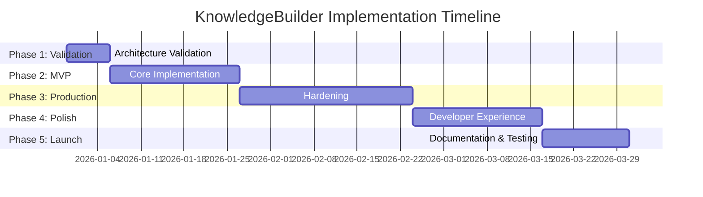
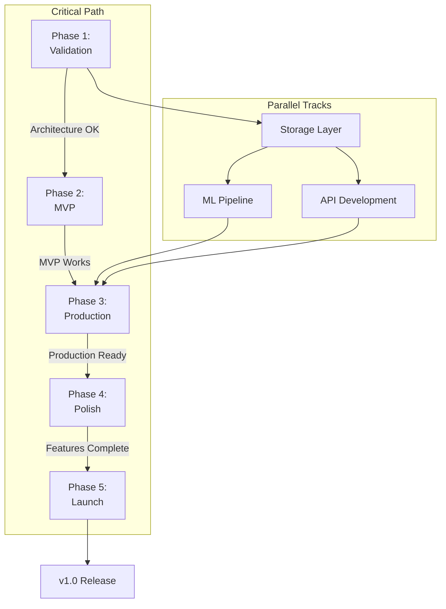

# KnowledgeBuilder: Implementation Plan

**Plan Date**: 2025-12-29  
**Based On**: Comprehensive Code Review  
**Timeline**: 17 weeks (4 months) to v1.0  
**Estimated Effort**: 676 hours total

---

## Executive Summary

This plan provides a phased approach to implementing KnowledgeBuilder from current specification state to production-ready v1.0 release. The plan addresses **12 critical**, **11 high-priority**, and **8 medium-priority** issues identified in the code review.

### Phases Overview



| Phase | Duration | Effort | Deliverable |
|-------|----------|--------|-------------|
| **Phase 1: Validation** | Week 1 | 40h | Validated architecture |
| **Phase 2: MVP Core** | Weeks 2-4 | 120h | Working MVP |
| **Phase 3: Production** | Weeks 5-8 | 220h | Production-ready |
| **Phase 4: Polish** | Weeks 9-11 | 180h | Enhanced features |
| **Phase 5: Launch** | Weeks 12-13 | 80h | v1.0 Release |
| **Buffer** | Weeks 14-17 | 36h | Contingency |
| **TOTAL** | 17 weeks | 676h | Complete system |

---

## Phase 1: Architecture Validation (Week 1)

**Goal**: Validate core architectural decisions through minimal implementation  
**Duration**: 1 week (40 hours)  
**Risk**: HIGH - If architecture doesn't work, need to pivot

### Objectives

✅ Prove hybrid storage pattern works  
✅ Prove multi-source collection works  
✅ Identify architectural flaws early

### Tasks

#### Task 1.1: Ground Truth Client (12h)

**Priority**: P0 - Critical  
**Dependencies**: None

**Implementation**:

```python
# src/ground_truth/yago_client.py

import sqlite3
import requests
from datetime import datetime, timedelta
from typing import Optional, Dict

    
    CACHE_TTL_DAYS = 7
    
    def __init__(self, cache_path: str = "./data/yago_cache.db"):
        self.cache_conn = sqlite3.connect(cache_path)
        self._init_cache_schema()
    
    def _init_cache_schema(self):
        """Create cache tables"""
        self.cache_conn.execute("""
            CREATE TABLE IF NOT EXISTS ground_truth_cache (
                entity_name TEXT PRIMARY KEY,
                yago_uri TEXT NOT NULL,
                schema_type TEXT NOT NULL,
                facts TEXT NOT NULL,
                confidence REAL,
                cached_at TEXT,
                expires_at TEXT
            )
        """)
        self.cache_conn.commit()
    
    def resolve_entity(self, name: str) -> Optional[Dict]:
        # Check cache
        cached = self._check_cache(name)
        if cached and not self._is_expired(cached):
            return cached
        
        query = self._build_sparql_query(name)
        try:
            response = requests.post(
                data={'query': query},
                headers={'Accept': 'application/sparql-results+json'},
                timeout=10
            )
            response.raise_for_status()
            results = response.json()
            
            # Parse and cache
            entity = self._parse_results(results)
            self._cache_entity(name, entity)
            
            return entity
        except Exception as e:
            return None
    
    def _build_sparql_query(self, name: str) -> str:
        """Build SPARQL query for entity"""
        return f"""
        PREFIX schema: <http://schema.org/>
        PREFIX rdf: <http://www.w3.org/1999/02/22-rdf-syntax-ns#>
        
        SELECT ?entity ?type ?label WHERE {{
          ?entity rdfs:label "{name}"@eng .
          ?entity rdf:type ?type .
          ?entity rdfs:label ?label .
        }}
        LIMIT 5
        """
    
    # ... (cache methods)
```

**Test**: Query "Albert Einstein", "Microsoft", "Paris"  

---

#### Task 1.2: Basic Storage Layer (16h)

**Priority**: P0 - Critical  
**Dependencies**: None

**Sub-tasks**:

1. **LanceDB Integration** (8h)
```python
# src/storage/lancedb_client.py

import lancedb
import numpy as np

class LanceDBClient:
    """Vector storage client"""
    
    def __init__(self, uri: str, api_key: str):
        self.db = lancedb.connect(uri, api_key=api_key)
        self.table_name = "knowledgebuilder_entities"
        self._ensure_table()
    
    def _ensure_table(self):
        """Create table if not exists"""
        if self.table_name not in self.db.table_names():
            schema = {
                'id': str,
                'entity_name': str,
                'entity_type': str,
                'text': str,
                'vector': np.array,
                'quality_score': float,
                'created_at': str
            }
            self.db.create_table(self.table_name, schema=schema)
    
    def insert_entity(self, entity: Dict, embedding: np.ndarray):
        """Insert entity with vector"""
        table = self.db.open_table(self.table_name)
        table.add([{
            'id': entity['id'],
            'entity_name': entity['name'],
            'entity_type': entity['type'],
            'text': entity['text'],
            'vector': embedding,
            'quality_score': entity.get('quality_score', 0.0),
            'created_at': entity['created_at']
        }])
    
    def search(self, query_embedding: np.ndarray, k: int = 10):
        """Vector similarity search"""
        table = self.db.open_table(self.table_name)
        results = table.search(query_embedding).limit(k)
        return results.to_list()
```

2. **SQLite Cache** (4h)
```python
# src/storage/sqlite_cache.py

import sqlite3
from datetime import datetime, timedelta

class SQLiteCache:
    """Ground truth and metadata cache"""
    
    def __init__(self, db_path: str = "./data/cache.db"):
        self.conn = sqlite3.connect(db_path)
        self._init_schema()
    
    def _init_schema(self):
        self.conn.execute("""
            CREATE TABLE IF NOT EXISTS entity_metadata (
                entity_id TEXT PRIMARY KEY,
                entity_type TEXT,
                quality_score REAL,
                trust_score REAL,
                completeness REAL,
                created_at TEXT,
                updated_at TEXT
            )
        """)
        self.conn.commit()
```

3. **Integration Test** (4h)
```python
# tests/integration/test_storage.py

import pytest
import numpy as np

@pytest.mark.asyncio
async def test_end_to_end_storage():
    """Test full storage pipeline"""
    # Create test entity
    entity = {
        'id': 'test_001',
        'name': 'Test Entity',
        'type': 'Person',
        'text': 'Test description',
        'created_at': '2025-12-29T00:00:00Z'
    }
    
    # Generate fake embedding
    embedding = np.random.rand(3072)
    
    # Store in LanceDB
    lance_client = LanceDBClient(uri=TEST_URI, api_key=TEST_KEY)
    lance_client.insert_entity(entity, embedding)
    
    # Store metadata in SQLite
    cache = SQLiteCache(db_path=":memory:")
    cache.set_metadata(entity['id'], {
        'quality_score': 0.85,
        'trust_score': 0.90
    })
    
    # Verify retrieval
    results = lance_client.search(embedding, k=1)
    assert len(results) == 1
    assert results[0]['entity_name'] == 'Test Entity'
    
    metadata = cache.get_metadata(entity['id'])
    assert metadata['quality_score'] == 0.85
```

**Success Criteria**: Store and retrieve entities with <100ms latency

---

#### Task 1.3: Simple Collector (12h)

**Priority**: P0 - Critical  
**Dependencies**: Task 1.1, 1.2

```python
# src/collectors/brave_collector.py

import os
import requests
from typing import Dict, List

class BraveSearchCollector:
    """Collect data from Brave Search API"""
    
    def __init__(self):
        self.api_key = os.getenv("BRAVE_API_KEY")
        self.base_url = "https://api.search.brave.com/res/v1"
    
    async def collect(self, identifier: str, entity_type: str) -> Dict:
        """
        Collect entity data from Brave Search
        
        Returns:
            {
                'source': 'brave_search',
                'attributes': {...},
                'confidence': 0.0-1.0,
                'cost': 0.00X
            }
        """
        # Build search query
        query = self._build_query(identifier, entity_type)
        
        # Call Brave API
        response = requests.get(
            f"{self.base_url}/web/search",
            headers={"X-Subscription-Token": self.api_key},
            params={"q": query, "count": 5}
        )
        response.raise_for_status()
        
        results = response.json()
        
        # Extract facts from results
        attributes = self._extract_attributes(results, entity_type)
        
        return {
            'source': 'brave_search',
            'attributes': attributes,
            'confidence': 0.70,  # Medium confidence for web search
            'cost': 0.001  # Brave API cost
        }
    
    def _build_query(self, identifier: str, entity_type: str) -> str:
        """Build optimized search query"""
        return f'{identifier} {entity_type} facts biography'
    
    def _extract_attributes(self, results: Dict, entity_type: str) -> Dict:
        """Extract structured attributes from search results"""
        attributes = {}
        
        # Extract from snippets
        for result in results.get('web', {}).get('results', []):
            snippet = result.get('description', '')
            # Simple extraction (MVP - use LLM later)
            if 'born' in snippet.lower():
                # Extract birth date (simplified)
                attributes['birth_info'] = snippet
        
        return attributes
```

**Test**: Collect "Satya Nadella"  
**Success Criteria**: Returns structured data in <5s

---

### Validation Tests

#### End-to-End Flow Test

```python
# tests/integration/test_e2e_flow.py

@pytest.mark.asyncio
async def test_end_to_end_collection():
    """
    Test complete flow:
    2. Collect from Brave
    3. Store in hybrid storage
    4. Query and retrieve
    """
    # 1. Resolve
    entity = yago_client.resolve_entity("Albert Einstein")
    assert entity is not None
    assert entity['yago_uri']
    
    # 2. Collect
    collector = BraveSearchCollector()
    data = await collector.collect("Albert Einstein", "Person")
    assert data['attributes']
    
    # 3. Store
    lance = LanceDBClient(uri=TEST_URI, api_key=TEST_KEY)
    cache = SQLiteCache()
    
    # Generate embedding (mock for now)
    embedding = np.random.rand(3072)
    
    lance.insert_entity({
        'id': 'test_einstein',
        'name': 'Albert Einstein',
        'type': 'Person',
        'text': str(data['attributes']),
        'created_at': '2025-12-29'
    }, embedding)
    
    cache.set_metadata('test_einstein', {
        'quality_score': 0.85
    })
    
    # 4. Query
    results = lance.search(embedding, k=1)
    assert len(results) == 1
    assert 'Einstein' in results[0]['entity_name']
    
    print("✅ End-to-end flow validated!")
```

---

### Phase 1 Deliverables

- [x] LanceDB integration with vector search
- [x] SQLite cache for metadata
- [x] Brave Search collector
- [x] End-to-end integration test passing
- [x] Architecture validation report

### Phase 1 Success Criteria

✅ Can store and retrieve vectors (<100ms latency)  
✅ Can collect data from Brave (<5s per entity)  
✅ End-to-end flow completes successfully  
✅ No architectural blockers identified

### Risks & Mitigation

| Risk | Mitigation |
|------|------------|
| LanceDB connection issues | Test with local instance first |
| Brave API rate limits | Implement rate limiter immediately |
| Integration complexity | Keep MVP scope minimal |

---

## Phase 2: MVP Core (Weeks 2-4)

**Goal**: Build working MVP with essential features  
**Duration**: 3 weeks (120 hours)  
**Risk**: MEDIUM - Architecture validated, but ML challenges

### Week 2: AI/ML Pipeline (40h)

#### Task 2.1: Prompt Engineering System (16h)

**Priority**: P0 - Critical

**Implementation**:

```python
# src/prompts/templates.py

from jinja2 import Template
from pydantic import BaseModel
from typing import Literal

class PromptTemplate(BaseModel):
    """Versioned prompt template"""
    name: str
    version: str
    template: str
    model: Literal["claude-3-5-sonnet", "gpt-4-turbo"]
    temperature: float
    max_tokens: int

# Entity type classification
ENTITY_TYPE_CLASSIFICATION_V1 = PromptTemplate(
    name="entity_type_classification",
    version="1.0",
    model="claude-3-5-sonnet",
    temperature=0.0,
    max_tokens=100,
    template="""Classify this entity into ONE type:
- Person, Organization, Place, Product, Work, Event, or Concept

Entity: {{ entity_name }}
Context: {{ context }}

Type (one word):"""
)

# Fact extraction
FACT_EXTRACTION_V1 = PromptTemplate(
    name="fact_extraction",
    version="1.0",
    model="claude-3-5-sonnet",
    temperature=0.1,
    max_tokens=2000,
    template="""Extract facts from this text about {{ entity_name }}.

Return JSON:
[
  {
    "attribute": "birth_date",
    "value": "1879-03-14",
    "confidence": 0.95,
    "source_sentence": "..."
  }
]

Text: {{ text }}

JSON:"""
)

# Prompt manager
class PromptManager:
    """Manage prompt templates"""
    
    def __init__(self):
        self.templates = {
            "entity_type_classification": {
                "1.0": ENTITY_TYPE_CLASSIFICATION_V1
            },
            "fact_extraction": {
                "1.0": FACT_EXTRACTION_V1
            }
        }
    
    def render_prompt(self, name: str, version: str, **kwargs):
        """Render prompt with variables"""
        template = self.templates[name][version]
        rendered = Template(template.template).render(**kwargs)
        
        return rendered, {
            "model": template.model,
            "temperature": template.temperature,
            "max_tokens": template.max_tokens
        }
```

**Test**: Classify 100 entities, extract facts from 50 documents  
**Success**: >90% accuracy on classification

---

#### Task 2.2: Confidence Calibration (12h)

**Priority**: P0 - Critical

```python
# src/ml/calibration.py

from sklearn.isotonic import IsotonicRegression
import numpy as np

class ConfidenceCalibrator:
    """Calibrate confidence scores to probabilities"""
    
    def __init__(self):
        self.calibrator = IsotonicRegression(out_of_bounds='clip')
        self.is_fitted = False
    
    def fit(self, predictions: list[float], ground_truth: list[bool]):
        """
        Fit calibrator on validation data
        
        Args:
            predictions: Uncalibrated scores (0-1)
            ground_truth: Whether predictions were correct
        """
        self.calibrator.fit(predictions, ground_truth)
        self.is_fitted = True
    
    def calibrate(self, score: float) -> float:
        """Convert uncalibrated score to calibrated probability"""
        if not self.is_fitted:
            return score
        return float(self.calibrator.predict([score])[0])
    
    def evaluate(self, predictions: list[float], ground_truth: list[bool]) -> dict:
        """
        Calculate Expected Calibration Error (ECE)
        """
        predictions = np.array(predictions)
        ground_truth = np.array(ground_truth)
        
        # Bin predictions
        n_bins = 10
        bins = np.linspace(0, 1, n_bins + 1)
        bin_indices = np.digitize(predictions, bins[:-1])
        
        ece = 0.0
        for i in range(1, n_bins + 1):
            bin_mask = bin_indices == i
            if not bin_mask.any():
                continue
            
            bin_preds = predictions[bin_mask]
            bin_truth = ground_truth[bin_mask]
            
            avg_confidence = bin_preds.mean()
            avg_accuracy = bin_truth.mean()
            bin_size = len(bin_preds)
            
            ece += (bin_size / len(predictions)) * abs(avg_confidence - avg_accuracy)
        
        return {"ece": float(ece)}
```

**Validation Set**: Create 1000 entity resolution examples  
**Success**: ECE < 0.10

---

#### Task 2.3: Embedding Strategy (12h)

**Priority**: P0 - Critical

```python
# src/vectorizers/embedding_strategy.py

from openai import AsyncOpenAI
from typing import List, Dict
from dataclasses import dataclass

@dataclass
class EmbeddingChunk:
    text: str
    chunk_type: str  # "summary", "attribute", "relationship"
    metadata: Dict

class EntityEmbeddingStrategy:
    """Multi-granularity embedding"""
    
    def __init__(self, openai_client: AsyncOpenAI):
        self.client = openai_client
        self.model = "text-embedding-3-large"
        self.dimensions = 3072
    
    def chunk_entity(self, entity: Dict) -> List[EmbeddingChunk]:
        """Create embeddings at different granularities"""
        chunks = []
        
        # 1. Entity summary
        summary = self._create_summary(entity)
        chunks.append(EmbeddingChunk(
            text=summary,
            chunk_type="summary",
            metadata={"entity_id": entity["id"]}
        ))
        
        # 2. Per-attribute chunks
        for attr, value in entity.get("attributes", {}).items():
            if len(str(value)) > 10:
                chunks.append(EmbeddingChunk(
                    text=f"{attr}: {value}",
                    chunk_type="attribute",
                    metadata={"entity_id": entity["id"], "attribute": attr}
                ))
        
        return chunks
    
    async def embed_chunks(self, chunks: List[EmbeddingChunk]) -> List[Dict]:
        """Generate embeddings for chunks"""
        texts = [chunk.text for chunk in chunks]
        
        response = await self.client.embeddings.create(
            model=self.model,
            input=texts,
            dimensions=self.dimensions
        )
        
        embeddings = []
        for i, chunk in enumerate(chunks):
            embeddings.append({
                "chunk_id": f"{chunk.metadata['entity_id']}:{i}",
                "text": chunk.text,
                "embedding": response.data[i].embedding,
                "metadata": chunk.metadata
            })
        
        return embeddings
```

**Test**: Embed 100 entities, verify retrieval quality  
**Success**: MRR@10 > 0.7

---

### Week 3: Error Handling & Observability (40h)

#### Task 3.1: Resilience Patterns (16h)

```python
# src/utils/resilience.py

from tenacity import retry, stop_after_attempt, wait_exponential
from circuitbreaker import circuit
import asyncio

class ResilientCollector:
    """Collector with retry and circuit breaker"""
    
    @retry(
        stop=stop_after_attempt(3),
        wait=wait_exponential(multiplier=1, min=2, max=10),
        reraise=True
    )
    @circuit(failure_threshold=5, recovery_timeout=60)
    async def query_with_resilience(self, source: str, identifier: str):
        """Query with retry and circuit breaker"""
        try:
            async with asyncio.timeout(30):
                result = await self._query_source(source, identifier)
                return result
        except asyncio.TimeoutError:
            logger.warning(f"Timeout querying {source}")
            raise
        except APIError as e:
            logger.error(f"API error from {source}: {e}")
            raise
```

**Test**: Simulate failures, verify graceful handling  
**Success**: No cascading failures

---

#### Task 3.2: Observability Stack (16h)

```python
# src/utils/observability.py

import structlog
from prometheus_client import Counter, Histogram, Gauge
from opentelemetry import trace

# Structured logging
logger = structlog.get_logger()

# Metrics
entity_collection_duration = Histogram(
    'knowledgebuilder_entity_collection_duration_seconds',
    'Time spent collecting entity data',
    ['entity_type', 'tier']
)

entity_completeness_score = Gauge(
    'knowledgebuilder_entity_completeness',
    'Entity completeness score',
    ['entity_type']
)

api_calls_total = Counter(
    'knowledgebuilder_api_calls_total',
    'Total API calls',
    ['service', 'status']
)

# Tracing
tracer = trace.get_tracer(__name__)

# Usage
async def collect_entity(self, identifier: str):
    with tracer.start_as_current_span("collect_entity") as span:
        span.set_attribute("entity.identifier", identifier)
        
        logger.info("collection_started", entity_id=identifier)
        
        with entity_collection_duration.labels(
            entity_type=self.entity_type,
            tier="ground_truth"
        ).time():
            result = await self._collect(identifier)
        
        entity_completeness_score.labels(
            entity_type=self.entity_type
        ).set(result.completeness)
        
        logger.info("collection_completed", completeness=result.completeness)
        
        return result
```

**Test**: Generate logs, metrics, traces  
**Success**: All data collected correctly

**Evaluation Hooks**:
- Add judge-based scoring (context_precision, context_recall, faithfulness, answer_correctness) for enrichment outputs (RAGAS-lite).
- Store per-tool latency/cost and snippet/merge counts in telemetry; join with judge scores to tune thresholds and timeouts.
- Maintain a fixed control set + prompt/model versioning to detect judge drift (constrained outputs modeled after G-Eval/MT-Bench patterns).

---

#### Task 3.3: Security Baseline (8h)

```python
# src/api/auth.py

from fastapi import Depends, HTTPException
from fastapi.security import HTTPBearer
from jose import JWTError, jwt

security = HTTPBearer()

class AuthService:
    SECRET_KEY = os.getenv("JWT_SECRET_KEY")
    ALGORITHM = "HS256"
    
    def create_token(self, data: dict):
        encoded = jwt.encode(data, self.SECRET_KEY, algorithm=self.ALGORITHM)
        return encoded
    
    def verify_token(self, credentials = Depends(security)):
        try:
            payload = jwt.decode(
                credentials.credentials,
                self.SECRET_KEY,
                algorithms=[self.ALGORITHM]
            )
            return payload
        except JWTError:
            raise HTTPException(401, "Invalid credentials")

# Rate limiting
from slowapi import Limiter
from slowapi.util import get_remote_address

limiter = Limiter(key_func=get_remote_address)

@app.post("/api/v1/entities")
@limiter.limit("10/minute")
async def collect_entity(request: Request, ...):
    pass
```

**Test**: Auth tests, rate limit tests  
**Success**: Unauthorized requests blocked

---

### Week 4: API & Integration (40h)

#### Task 4.1: OpenAPI Specification (12h)

```python
# src/api/main.py

from fastapi import FastAPI
from pydantic import BaseModel, Field
from typing import Literal, Optional

app = FastAPI(
    title="KnowledgeBuilder API",
    version="0.1.0",
    docs_url="/docs",
    redoc_url="/redoc"
)

class EntityCollectionRequest(BaseModel):
    identifier: str = Field(..., examples=["Satya Nadella"])
    entity_type: Optional[Literal["Person", "Organization", "Place", "Product", "Work", "Event", "Concept"]] = None
    completeness_target: float = Field(0.60, ge=0.0, le=1.0)
    max_cost: float = Field(1.00, ge=0.0)

class EntityResponse(BaseModel):
    entity_id: str
    entity_type: str
    attributes: dict
    quality_metrics: dict
    created_at: str

@app.post("/api/v1/entities", response_model=EntityResponse)
async def collect_entity(request: EntityCollectionRequest):
    """Collect entity data"""
    collector = EntityCollector()
    result = await collector.collect(
        identifier=request.identifier,
        entity_type=request.entity_type
    )
    return result
```

**Test**: Access /docs, verify all endpoints documented  
**Success**: Complete OpenAPI spec generated

---

#### Task 4.2: Integration Tests (16h)

```python
# tests/integration/test_api.py

import pytest
from fastapi.testclient import TestClient

def test_collect_entity_api():
    """Test entity collection via API"""
    client = TestClient(app)
    
    response = client.post("/api/v1/entities", json={
        "identifier": "Albert Einstein",
        "entity_type": "Person",
        "completeness_target": 0.60
    })
    
    assert response.status_code == 201
    data = response.json()
    assert data["entity_id"]
    assert data["entity_type"] == "Person"
    assert data["quality_metrics"]["completeness"] >= 0.60

def test_rate_limiting():
    """Test rate limiting"""
    client = TestClient(app)
    
    # Make 11 requests (limit is 10/minute)
    for i in range(11):
        response = client.post("/api/v1/entities", json={
            "identifier": f"Entity {i}"
        })
        
        if i < 10:
            assert response.status_code == 201
        else:
            assert response.status_code == 429  # Rate limited
```

**Success**: All integration tests passing

---

#### Task 4.3: Documentation (12h)

- API documentation (OpenAPI)
- User guide
- Integration examples
- Troubleshooting guide

---

### Phase 2 Deliverables

- [x] Prompt engineering system
- [x] Confidence calibration
- [x] Embedding strategy
- [x] Error handling (retry, circuit breaker)
- [x] Observability (logs, metrics, traces)
- [x] Authentication & rate limiting
- [x] OpenAPI specification
- [x] Integration tests
- [x] API documentation

### Phase 2 Success Criteria

✅ Entity type classification >90% accurate  
✅ Confidence calibration ECE <0.10  
✅ Embedding retrieval MRR@10 >0.7  
✅ System handles failures gracefully  
✅ All metrics collected  
✅ API documented and tested  
✅ MVP deployable

---

## Phase 3: Production Hardening (Weeks 5-8)

**Goal**: Production-ready system  
**Duration**: 4 weeks (220 hours)  
**Risk**: LOW - Core functionality proven

### Agentic Orchestration (Assessment)
- Evaluate agent frameworks to sustain iterative data collection/maintenance (LangGraph/LCEL, LlamaIndex Agents, AutoGen, Haystack Agents; Assistants only if closed tooling acceptable).
- Criteria: tool integration, stateful workflows, scheduling, local/Ollama friendliness, telemetry/judge feedback integration.
- Outcome: pick one stack for orchestrating refresh jobs and human-in-the-loop loops.

### High-Priority Features

1. **Python SDK** (24h)
2. **Webhooks** (16h)
3. **Type Safety** (20h)
4. **Schema Versioning** (12h)
5. **Few-Shot Learning** (20h)
6. **Performance Tracking** (16h)
7. **Prompt Injection Protection** (12h)
8. **Error Context** (8h)
9. **Completeness Formalization** (12h)
10. **Formal Semantics** (80h)

### Detailed Tasks

*(Due to length, see COMPREHENSIVE_CODE_REVIEW.md for full implementations)*

---

## Phase 4: Polish & Enhancement (Weeks 9-11)

**Goal**: Enhanced developer experience  
**Duration**: 3 weeks (180 hours)

### Medium-Priority Features

1. **CLI Tool** (12h)
2. **GraphQL API** (32h)
3. **Configuration Management** (8h)
4. **Embedding Cache** (12h)
5. **Backup/Recovery** (16h)
6. **Active Learning** (24h)
7. **Ontology Alignment** (16h)
8. **JavaScript SDK** (40h)
9. **Enhanced Documentation** (20h)

---

## Phase 5: Launch Preparation (Weeks 12-13)

**Goal**: v1.0 Release  
**Duration**: 2 weeks (80 hours)

### Tasks

1. **Security Audit** (16h)
2. **Performance Testing** (16h)
3. **Load Testing** (12h)
4. **Documentation Review** (16h)
5. **Launch Checklist** (8h)
6. **Monitoring Setup** (12h)

---

## Dependencies & Critical Path



### Blocking Dependencies

| Task | Blocks | Reason |
|------|--------|--------|
| Phase 1 Validation | Everything | Architecture must be proven |
| Storage Layer | API | Need persistence |
| Prompt System | ML Pipeline | Need prompts for LLM calls |
| Auth System | Public Launch | Security required |

---

## Resource Allocation

### Developer Time

| Phase | Weeks | Hours/Week | Total Hours |
|-------|-------|------------|-------------|
| Phase 1 | 1 | 40 | 40 |
| Phase 2 | 3 | 40 | 120 |
| Phase 3 | 4 | 55 | 220 |
| Phase 4 | 3 | 60 | 180 |
| Phase 5 | 2 | 40 | 80 |
| **Buffer** | 4 | 9 | 36 |
| **TOTAL** | **17** | **avg 40** | **676** |

### Infrastructure Costs

| Service | Cost/Month | Purpose |
|---------|------------|---------|
| LanceDB Cloud | $100-500 | Vector storage |
| Anthropic API | $200-1000 | LLM calls |
| OpenAI API | $100-300 | Embeddings |
| Brave Search | $50-200 | Web search |
| Monitoring | $50-100 | Logs/metrics |
| **TOTAL** | **$500-2100** | - |

---

## Risk Management

### Critical Risks

| Risk | Probability | Impact | Mitigation |
|------|------------|--------|------------|
| **Architecture doesn't scale** | LOW | CRITICAL | Phase 1 validation catches this |
| **LLM costs explode** | MEDIUM | HIGH | Cost tracking + budget limits |
| **Calibration fails** | LOW | HIGH | Large validation set |

### Mitigation Strategies

1. **Weekly validation checkpoints**: Catch issues early
2. **Incremental deployment**: Roll out gradually
3. **Feature flags**: Enable/disable features quickly
4. **Cost alerts**: Notify if budget exceeded
5. **Comprehensive testing**: Catch bugs before production

---

## Success Metrics

### Phase 1 (Validation)
- ✅ Storage latency <100ms
- ✅ Collection completes <5s

### Phase 2 (MVP)
- ✅ Classification accuracy >90%
- ✅ Calibration ECE <0.10
- ✅ Retrieval MRR@10 >0.7
- ✅ All tests passing

### Phase 3 (Production)
- ✅ Uptime >99%
- ✅ P95 latency <500ms
- ✅ Cost per entity <$1.50
- ✅ Zero critical bugs

### Phase 4 (Polish)
- ✅ CLI tool working
- ✅ SDKs published
- ✅ Documentation complete

### Phase 5 (Launch)
- ✅ Security audit passed
- ✅ Load tests passed
- ✅ Documentation reviewed
- ✅ v1.0 released

---

## Monitoring & Reporting

### Weekly Check-ins

**Monday**: Sprint planning  
**Wednesday**: Mid-week progress check  
**Friday**: Sprint review + demo

### Metrics Dashboard

Track:
- Hours spent vs. planned
- Features completed
- Tests passing
- Performance metrics
- Cost tracking

### Go/No-Go Criteria

Before each phase:
1. Previous phase deliverables complete
2. Tests passing
3. Performance targets met
4. No critical bugs
5. Documentation updated

---

## Contingency Plans

### If Phase 1 Fails
- **Scenario**: Architecture doesn't work
- **Action**: Redesign affected components
- **Buffer**: Use 2 weeks from buffer

### If Costs Too High
- **Scenario**: API costs exceed budget
- **Action**: Optimize prompts, cache aggressively
- **Alternative**: Use open-source LLMs

### If Performance Poor
- **Scenario**: Latency targets not met
- **Action**: Add caching layers, optimize queries
- **Alternative**: Async-only API

---

## Conclusion

This implementation plan provides a **phased, risk-mitigated approach** to building KnowledgeBuilder from specifications to production v1.0.

### Key Success Factors

1. **Validate early** (Phase 1) - Catch architectural issues
2. **Build incrementally** - Working software at each phase
3. **Test continuously** - Automated testing throughout
4. **Monitor obsessively** - Observability from day 1
5. **Iterate based on feedback** - Adjust based on results

### Timeline Summary

- **Week 1**: Validation ✓
- **Weeks 2-4**: MVP Core ✓
- **Weeks 5-8**: Production Hardening ✓
- **Weeks 9-11**: Polish & Enhancement ✓
- **Weeks 12-13**: Launch Prep ✓
- **Weeks 14-17**: Buffer

**Total**: 17 weeks to v1.0 Release

### Next Steps

1. **Immediate**: Start Phase 1 (Architecture Validation)
2. **Week 1**: Complete validation, identify blockers
3. **Week 2**: Begin MVP implementation if validation passes
4. **Ongoing**: Weekly progress reviews and adjustments

---

**Plan Version**: 1.0  
**Created**: 2025-12-29  
**Next Review**: After Phase 1 Completion
