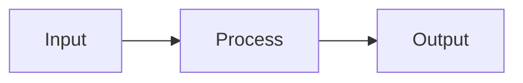
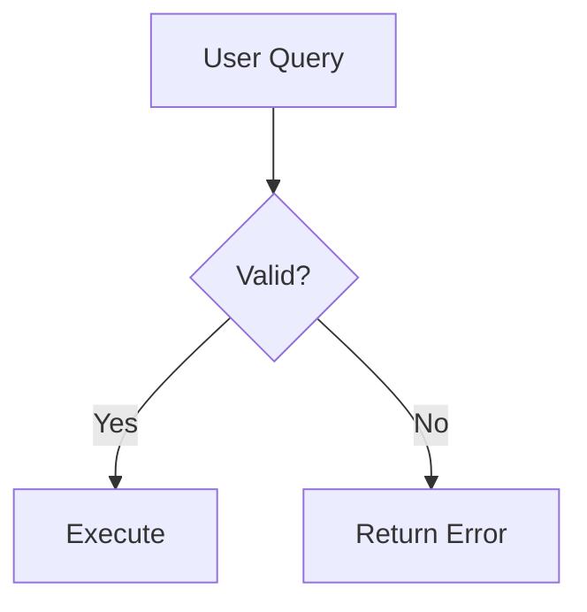
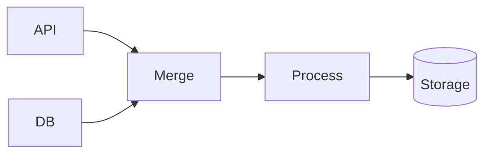
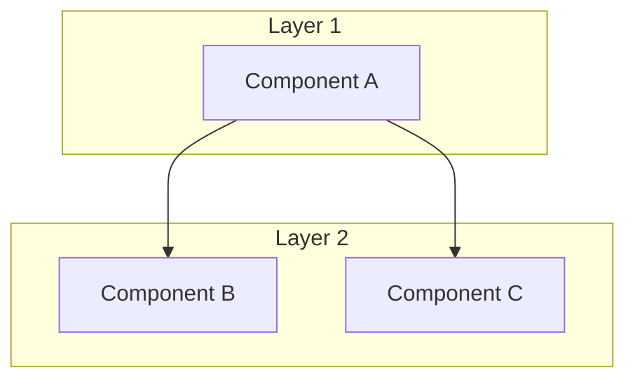
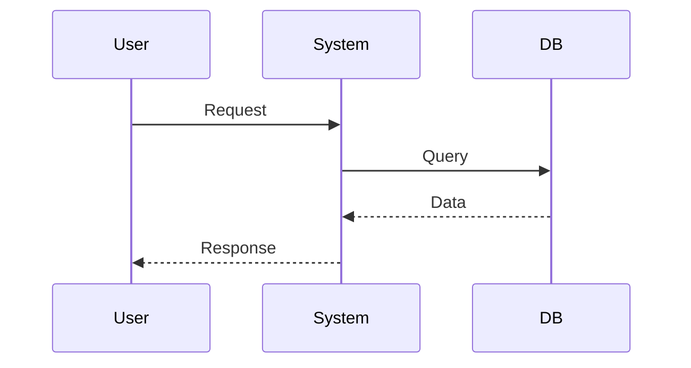
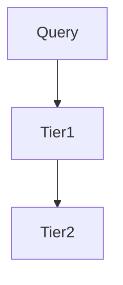

# KnowledgeBuilder Documentation Standards

**Version**: 1.0.0  
**Last Updated**: 2025-12-29

---

## Core Principles

KnowledgeBuilder documentation follows three fundamental principles:

### 1. Everything Diagr

ammable is Diagrammed

All interactions, data flows, object models, and system architectures must be visualized using Mermaid diagrams.

**Requirements**:
- Process flows → flowchart or sequenceDiagram
- Data pipelines → graph TB/LR
- Object relationships → classDiagram or graph
- State machines → stateDiagram
- System architecture → graph with subgraphs

**Example**:


### 2. Everything Cited is Sourced

Every significant design decision, architectural pattern, or algorithm must reference its source through footnotes.

**Citation Format**:
```markdown

      WWW Conference. https://yago-knowledge.org/
```

**Required Citations**:
- Academic papers for algorithms
- Standards bodies for protocols (W3C, IETF)
- Industry implementations for patterns
- Open source projects for code reuse

### 3. Forward-Looking Only

Documentation focuses on what we build, not historical mistakes or status tracking.

**Prohibited**:
- Historical status reports
- Progress tracking documents
- Phase completion summaries
- Lists of past mistakes

**Allowed**:
- Current architecture
- Implementation guidance
- Design rationale
- Future roadmap

---

## Document Types

### Core Documentation

**README.md**
- System overview
- Quick start guide
- Key features
- Navigation to other docs

**ARCHITECTURE.md**
- Complete system architecture
- Design decisions with citations
- All major flows diagrammed
- Component interactions

**IMPLEMENTATION.md**
- Practical code examples
- Integration patterns
- Testing strategies
- Performance optimization

**DATA_SOURCES.md**
- Source orchestration
- API integrations
- Collection strategies
- Entity-source mapping

### Development Documentation

**docs/STANDARDS.md** (this file)
- Documentation principles
- Code standards
- Citation requirements
- Mermaid usage

**examples/**
- Working code samples
- Tool validation scripts
- Integration examples

---

## Code Standards

### Python Style

Follow PEP 8 with these additions:
```python
# Good: Type hints on all functions
def collect_entity(name: str, entity_type: str) -> Entity:
    """
    Collect entity data from multiple sources
    
    Args:
        name: Entity identifier
        entity_type: Schema.org type (e.g., "Person")
    
    Returns:
        Entity with collected data and metadata
    """

# Good: Dataclasses for structured data
@dataclass
class Entity:
    name: str
    type: str
    yago_uri: str
    facts: Dict[str, Any]

# Good: Explicit error handling
try:
    result = api.query(name)
except APIError as e:
    logger.error(f"API query failed: {e}")
    return None
```

### Documentation in Code

```python
# Good: Cite sources for algorithms
def calculate_confidence(query: str, candidate: dict) -> float:
    """
    Calculate match confidence using Dice coefficient
    
    Algorithm adapted from PT-MCP's entity resolution:
    ~/Documents/GitClones/pt-mcp/src/knowledge-graph/yago-resolver.ts
    
    Returns:
        Confidence score (0-1)
    """
```

---

## Mermaid Diagram Standards

### Diagram Types

**Process Flows**:


**Data Pipelines**:


**System Architecture**:


**Sequence Diagrams**:


### Styling Guidelines

- Use subgraphs for logical groupings
- Label all edges with action/data
- Include decision points explicitly
- Show error paths
- Annotate with key metadata (confidence, latency, etc.)

---

## Maintenance

### When to Update Documentation

**Immediately**:
- Architecture changes
- New component additions
- API contract changes
- Major algorithm updates

**Weekly**:
- Performance optimization notes
- New examples added
- Integration pattern updates

**Never**:
- Status updates (use git commits)
- TODO lists (use issue tracker)
- Historical logs (git history sufficient)

### Documentation Review Checklist

- [ ] All processes diagrammed
- [ ] All design decisions cited
- [ ] Forward-looking (no historical status)
- [ ] Code examples tested and working
- [ ] Links validated
- [ ] Mermaid diagrams render correctly
- [ ] Citations follow format
- [ ] No redundancy with other docs

---

## Git Commit Standards

```bash
# Good: Descriptive, focuses on what changed

- Implements SQLite cache for SPARQL queries
- Reduces ground truth lookup from 2-5s to <10ms
- Pattern from PT-MCP yago-resolver.ts"

# Bad: Status update
git commit -m "Made progress on caching"
```

---

## Citation Format

### Academic Papers

```markdown
[^1]: Author, A., & Author, B. (Year). "Title." *Journal*, Volume(Issue), Pages. DOI or URL
```

### Standards Bodies

```markdown
[^2]: W3C (Year). "Standard Name." https://www.w3.org/TR/standard-name/
```

### Open Source Projects

```markdown
[^3]: Project Name (Year). "Document/File Name" at path/to/file (Brief description of relevance)
```

### Industry Documentation

```markdown
[^4]: Company Name (Year). "Document Title." https://example.com/docs (Maintained by X, Y, Z)
```

---

## Examples

### Good Documentation

**Has diagrams**:
```markdown
## Collection Pipeline



Flow proceeds tier-by-tier until completeness target met.
```

**Has citations**:
```markdown
The confidence calculation uses Dice coefficient string similarity[^1].

[^1]: PT-MCP Project. "yago-resolver.ts" at ~/Documents/GitClones/pt-mcp/
```

**Forward-looking**:
```markdown
## Storage Architecture

KnowledgeBuilder uses hybrid storage:
- LanceDB for vector search
- Memory MCP for relationships
- SQLite for ground truth cache
```

### Bad Documentation

**No diagrams**:
```markdown
The system has multiple tiers that query sources in order.
```

**No citations**:
```markdown
```

**Historical/status**:
```markdown
## Week 3 Progress
- [x] Implemented caching
- [x] Fixed bugs
- [ ] TODO: Add tests
```

---

## Tools

### Mermaid Live Editor

https://mermaid.live/ - Test diagrams before committing

### Citation Management

- Keep references in each document's footer
- Use consistent numbering [^1], [^2], etc.
- Include URL when available
- Specify retrieval path for local references

### Documentation Linting

```bash
# Check for broken links
markdown-link-check *.md

# Verify Mermaid syntax
mmdc -i ARCHITECTURE.md -o /dev/null

# Check citation format
grep -E '\[\^[0-9]+\]' *.md
```

---

## Questions?

If documentation practices are unclear:
1. Check this standards document
2. Review existing docs (README.md, ARCHITECTURE.md) for examples
3. Follow the three principles: Diagram, Cite, Forward-focus

---

**Last Updated**: 2025-12-29  
**Version**: 1.0.0  
**Maintainer**: KnowledgeBuilder Team
