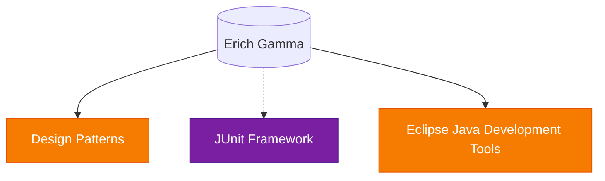

```mermaid
graph TD
    %% Knowledge Graph for PLang Mode
    %% Generated from Erich Gamma synthesis

    exemplar[("Erich Gamma")]

    %% Skill Nodes
    skill0["Design Patterns"]:::emerging
    skill1["JUnit Framework"]:::frontier
    skill2["Eclipse Java Development Tools"]:::emerging

    %% Relationships
    exemplar --> skill0
    exemplar -.-> skill1
    exemplar --> skill2

    %% Styling
    classDef established fill:#2e7d32,color:#fff,stroke:#1b5e20
    classDef emerging fill:#f57c00,color:#fff,stroke:#e65100
    classDef frontier fill:#7b1fa2,color:#fff,stroke:#4a148c
```