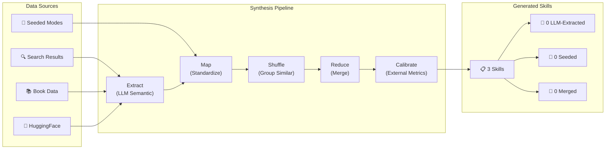

```mermaid
flowchart LR
    %% Synthesis Flow for PLang Mode

    subgraph Sources["Data Sources"]
        search["🔍 Search Results"]
        books["📚 Book Data"]
        hf["🤗 HuggingFace"]
        seed["🌱 Seeded Modes"]
    end

    subgraph Pipeline["Synthesis Pipeline"]
        extract["Extract\n(LLM Semantic)"]
        map["Map\n(Standardize)"]
        shuffle["Shuffle\n(Group Similar)"]
        reduce["Reduce\n(Merge)"]
        calibrate["Calibrate\n(External Metrics)"]
    end

    subgraph Output["Generated Skills"]
        skills["📋 3 Skills"]
        llm_skills["🧠 0 LLM-Extracted"]
        seed_skills["🌱 0 Seeded"]
        merged_skills["🔗 0 Merged"]
    end

    search --> extract
    books --> extract
    hf --> extract
    seed --> map

    extract --> map
    map --> shuffle
    shuffle --> reduce
    reduce --> calibrate

    calibrate --> skills
    skills --> llm_skills
    skills --> seed_skills
    skills --> merged_skills
```