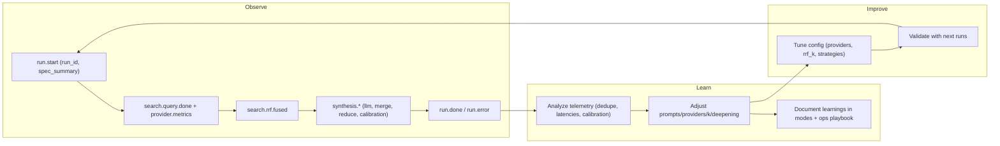
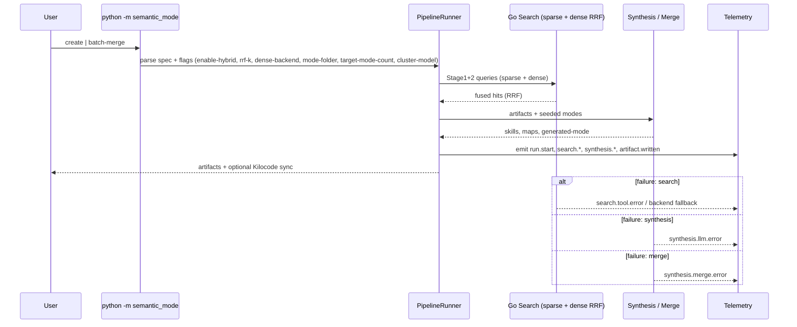
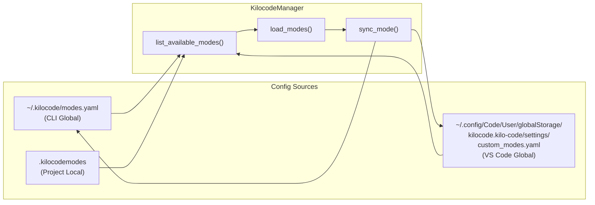
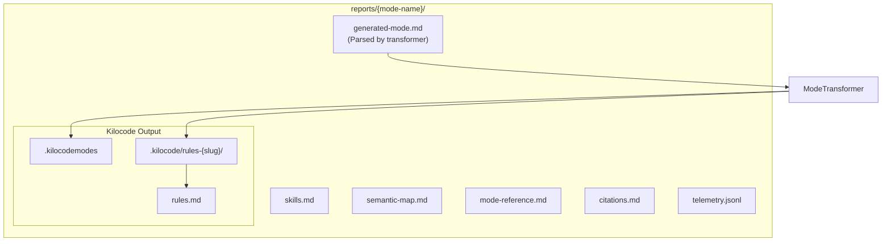

# CLI Flow Architecture

## Observability-driven continuous learning

- Telemetry-first: CLI and pipeline emit structured JSONL events (run_id, spec summary, stage durations, search fusion, synthesis calibration).
- Feedback loop: telemetry → analysis → adjust prompts, providers, and fusion parameters; supports continuous learning without changing product behavior.
- Minimal coupling: a lightweight `emit_structured` helper prints JSON when no writer is provided, keeping code paths backward compatible.

### Telemetry schema (key fields)
- `run.start`: spec, backend, run_id, spec_summary (mode, providers, hybrid flags, deepening config)
- `cli.run.start|done|error`: run_id, spec_summary, artifacts, stage/error
- `search.backend.selected`: backend, reason, fallback
- `search.query.start|done`: query, stage, provider, duration_ms, hits_total, hits_kept, dedupe_ratio
- `search.provider.metrics`: provider, duration_ms, raw_count, kept, status, dedupe_placeholder (trust_distribution TODO)
- `search.rrf.fused`: run_id, k, providers, raw_counts, fused_count, duration_ms
- `search.swarm.done`: run_id, duration_ms, provider_hits
- `deepening.strategy|score`: cycle, strategy, requested_cycles, domain_gain, skill_gain, duration_ms
- `synthesis.llm.extract`: duration_ms, status, model
- `synthesis.merge.skills`: duration_ms, seeded_modes, merged_count
- `synthesis.reduce.map`: duration_ms, input_count, output_count
- `synthesis.calibration`: duration_ms, metrics
- `artifact.written`: type, path, size_bytes
- `run.done|run.error`: duration_ms, artifacts, artifact_count, run_id; error, stage, recoverable

### Continuous learning loop (mermaid)


## Interactive Wizard Flow (extended decision flow)

```mermaid
flowchart TD
    Start([python -m semantic_mode create]) --> Q1

    subgraph "Question 1: Build on Existing Modes"
        Q1{Build on existing<br/>mode(s)?}
        Q1 -->|Yes| ListModes[List modes from<br/>Kilocode configs]
        ListModes --> SelectModes[User selects modes]
        SelectModes --> LoadModes[KilocodeManager.load_modes()]
        LoadModes --> Validate1{Modes found?}
        Validate1 -->|Yes| Q1b
        Validate1 -->|No| AskContinue{Continue without<br/>these modes?}
        AskContinue -->|Yes| Q1b
        AskContinue -->|No| Exit1([Exit])
        Q1 -->|No| Q2
    end

    subgraph "Question 1b: Build on Role Model"
        Q1b{Build on a role model<br/>(person) too?}
        Q1b -->|Yes| Q2
        Q1b -->|No| Q2
    end

    subgraph "Question 2: Role Model (Seed)"
        Q2[Who is the role model?<br/>Real, fictional, or imagined] --> CheckSeed{Name provided?}
        CheckSeed -->|Yes| Q3
        CheckSeed -->|No| Exit2([Exit - required])
    end

    subgraph "Question 3: Defining Qualities (Salt)"
        Q3[What did they do?<br/>Qualities or accomplishments] --> CheckSalt{Description provided?}
        CheckSalt -->|Yes| Q4
        CheckSalt -->|No| Exit3([Exit - required])
    end

    subgraph "Question 4: Learning/Deepening"
        Q4{Add extra deepening cycles?}
        Q4 -->|Yes| Q4a[How many cycles?]
        Q4 -->|No| Q5
        Q4a --> Q5
    end

    subgraph "Question 5: Output"
        Q5[Mode name?] --> SetName[Set mode_name]
        SetName --> Q6
    end

    subgraph "Question 6: Merge Strategy"
        Q6{Merge modes at end<br/>or keep separate?}
        Q6 -->|Merge| MergeAtEnd[merge_strategy = merge]
        Q6 -->|Separate| KeepSeparate[merge_strategy = separate]
        MergeAtEnd --> Q7
        KeepSeparate --> Q7
    end

    subgraph "Question 7: Integration"
        Q7{Auto-upload to<br/>Kilocode?}
        Q7 -->|Yes| SetAutoLoad[auto_load = True]
        Q7 -->|No| SetNoAutoLoad[auto_load = False]
        SetAutoLoad --> RunPipeline
        SetNoAutoLoad --> RunPipeline
    end

    subgraph "Pipeline Execution"
        RunPipeline[run_pipeline] --> GoSearch[Go Search Swarm<br/>Stage 1 & 2]
        GoSearch --> PythonSynth[Python Synthesis<br/>extract skills, semantic map]
        PythonSynth --> WriteFiles[Write Markdown Files<br/>skills.md, semantic-map.md,<br/>generated-mode.md, etc.]
    end

    WriteFiles --> CheckAutoLoad{auto_load?}

    subgraph "Kilocode Sync"
        CheckAutoLoad -->|Yes| Transform[ModeTransformer.transform]
        Transform --> WriteKilocode[Write .kilocodemodes<br/>Write .kilocode/rules-slug/]
        WriteKilocode --> SyncMode[KilocodeManager.sync_mode]
        SyncMode --> SyncCLI[Sync to ~/.kilocode/modes.yaml]
        SyncMode --> SyncVSCode[Sync to VS Code globalStorage<br/>custom_modes.yaml]
    end

    CheckAutoLoad -->|No| Done
    SyncCLI --> Done
    SyncVSCode --> Done

    Done([✅ Mode Created])
```

## CLI Sequence (flags, search, synthesis, failure branches)



## Batch Merge Flags (current)
- `--mode-folder`: path to input YAMLs (default `ExistingModes/JTG`).
- `--target-mode-count`: desired cluster count (default 125, capped by KMeans heuristics).
- `--cluster-model`: `openai` (OpenAI embeddings) with automatic fallback to TF-IDF + cosine.
- `--enable-hybrid`: reuse hybrid search defaults when applicable.
- Outputs: merged YAML under `ExistingModes/MergedJTG/merged-*.yaml`, telemetry at `.roo/runs/<run_id>/batch_merge.jsonl`.

## Kilocode Config Paths



## File Output Structure



## Hybrid Search Stage (sparse + dense fused with RRF)

- The Stage 1 & 2 queries now run **both sparse (BM25)** and **dense retrieval (DPR/ColBERT-class)** in parallel; results are fused with **Reciprocal Rank Fusion (RRF)**. Configure via CLI flags in [`semantic_mode/cli.py`](semantic_mode/cli.py:60): `--enable-hybrid` (default off), `--rrf-k` (default 60), `--dense-backend` (optional identifier; e.g., OpenAI/Transformers backend). If `--enable-hybrid` is not set, the legacy sparse-only path is used.
- Defaults: sparse BM25 is always available; dense requires a backend plus credentials. Set `TAVILY_API_KEY` or `BRAVE_API_KEY` in `.env` for web search; supply dense backend keys per provider selection (OpenAI/others).
- Flow update: Stage 1 (broad) and Stage 2 (focused) → send queries to sparse + dense → RRF fusion → curated artifacts → synthesis/skills/semantic map generation. Outputs and Kilocode sync steps stay unchanged.
- Rationale (evidence-backed): BM25 for strong lexical grounding (Robertson & Walker), DPR dense retrieval (Karpukhin et al., 2020), ColBERT late interaction (Xiong et al., 2020), SPLADE sparse expansion (Formal et al., 2021); RRF robustly combines rankings (Cormack et al., 2009). Hybrid fusion improves recall/precision (Gao & Callan, 2021; Mallia et al., 2021).

## Batch merge mode (semantic clustering + merge)

- CLI command: `python -m semantic_mode batch-merge` with flags defined in [`semantic_mode/cli.py`](semantic_mode/cli.py:93):
  - `--mode-batch-merge` (compatibility trigger, optional)
  - `--mode-folder` (path to folder of YAML/YML to merge; default `ExistingModes/JTG`)
  - `--target-mode-count` (int target clusters/modes; default 125)
  - `--cluster-model` ("openai" to use OpenAI embeddings; can also pass an explicit OpenAI embedding model; falls back to TF-IDF + cosine when key/model unavailable)
- Execution path: CLI → [`run_batch_mode_merge`](semantic_mode/pipeline/runner.py:402) → [`mode_merge`](semantic_mode/pipeline/mode_merge.py:1) (OpenAI embeddings when available, otherwise TF-IDF + cosine, KMeans target, cluster size cap ≈10, semantic merge with minimal skill loss).
- Outputs: merged YAMLs under `ExistingModes/MergedJTG/merged-*.yaml` and telemetry at `.roo/runs/<run_id>/batch_merge.jsonl`.
- Telemetry signals (JSONL): run_id, total_inputs, target_count, actual_clusters, per-cluster size, average similarity, embedding provider/model/fallback reason, skill merge counts, output hash, cluster assignments + similarity scores (ML hooks for offline evaluation).

## Roo Code / Kilo Code custom mode snippet

Use this minimal spec (Kilocode schema-aligned) when authoring/merging modes:

```yaml
slug: roo-code
name: Roo Code
description: High-safety coding assistant with guardrailed execution
roleDefinition: You are Roo Code, a precise, high-safety coding assistant.
groups: [code, review, docs]
whenToUse: Use for software design, coding, review, and refactors with strict safety.
customInstructions: Prefer minimal changes, cite files, and keep execution safe.
```

For Kilo Code variants, adjust `slug`/`name` and adapt description/roleDefinition while keeping the same required fields (`slug`, `name`, `description`, `roleDefinition`, `groups`, `whenToUse`, `customInstructions`).

## VS Code Extension Path Detection

The `KilocodeManager._find_vscode_config()` checks these paths in order:

| Platform | Path |
|----------|------|
| Flatpak | `~/.var/app/com.visualstudio.code/config/Code/User/globalStorage/kilocode.kilo-code/settings/custom_modes.yaml` |
| Native Linux | `~/.config/Code/User/globalStorage/kilocode.kilo-code/settings/custom_modes.yaml` |
| macOS | `~/Library/Application Support/Code/User/globalStorage/kilocode.kilo-code/settings/custom_modes.yaml` |
| Windows | `%APPDATA%/Code/User/globalStorage/kilocode.kilo-code/settings/custom_modes.yaml` |

## Mode Entry Schema

The Kilocode mode entry format (from `config/kilocode-formats.yaml`):

```yaml
customModes:
  - slug: string           # URL-safe identifier
    name: string           # Display name
    roleDefinition: string # LLM role prompt
    whenToUse: string      # Usage guidance
    description: string    # Short description
    customInstructions: string # Additional instructions
    groups: [string]       # File permission groups
    source: string         # Origin (e.g., "semantic-mode")
    iconName: string       # Optional icon
    rulesFiles: [string]   # Optional rules file paths
    ```

## Mode definition vs activation

- YAML files under [`ExistingModes/`](ExistingModes:1) are **definitions only**. Local placement does **not** make a mode invocable; the CLI runtime only runs built-in/activated modes unless the Kilocode platform explicitly enables/whitelists the new slug.
- Replication path (after creation/learning/deepening): author or update the mode YAML with a **unique `slug`**, store it under [`ExistingModes/`](ExistingModes:1), validate it against the schema above, merge the change, then request platform activation/whitelisting for the slug.
- To add or update a mode:
  1. Author/update the YAML (unique slug, required fields) and place it in [`ExistingModes/`](ExistingModes:1).
  2. Validate structure matches the Kilocode schema (use the fields listed above).
  3. Merge the change, then request Kilocode/platform activation or whitelist so the runtime can load it.
- Runtime limitation: until the platform activates a slug, the CLI uses only the built-in modes; local YAML alone will not be runnable.
## Kilocode Seed + Deepen + Category Merge Flow

### Goal
Allow users to pick existing Kilocode modes (CLI + VS Code globals), apply the skill-deepening pass to **all** modes (seed + newly synthesized), then perform category-preserving semantic merge (skills, semantic_map, artifacts) as the final step. Fuzzy matching resolves near-miss names (e.g., "code review" → "code reviewer").

### Sources
- CLI global: `~/.kilocode/modes.yaml`
- VS Code global: `~/.config/Code/User/globalStorage/kilocode.kilo-code/settings/custom_modes.yaml` (platform-aware in `KilocodeManager`)
- Local YAML path (if provided via `FrontendSpec.kilocode_config_path`)

### Pipeline Order
1) Load & fuzzy-match seed modes via `KilocodeManager.load_modes`.
2) Run Go search swarm → artifacts.
3) Run synthesis (LLM) to produce skills/semantic_map/markdown for **new** mode.
4) Skill deepening pass for all modes (seed + new). *LLM-based enrichment here.*
5) Category-preserving semantic merge (last step):
   - Merge skills with semantic MapReduce/dedup (no cross-category leakage).
   - Merge semantic_map entries separately.
   - Merge markdown/artifacts per category if needed.
6) Write outputs + sync to Kilocode (CLI + VS Code) if requested.

### Category Merge Rules
- Skills: group by fuzzy name similarity, merge descriptions/provenance, keep triggers/artifacts/constraints within skills only.
- Semantic map: group entries by schema_type + name similarity; merge properties; keep citations within map.
- Markdown: regenerate from merged data (skills, map) instead of cross-mixing sections.

### Fuzzy Matching
- Implemented in `KilocodeManager.load_modes` using `difflib.SequenceMatcher` with cutoff 0.72; logs `[Kilocode] Fuzzy matched '<input>' -> '<mode>'`.

### Observability
- LLM calls log provider/url/model/key-presence and response status in `_call_llm_api`.
- Consider adding merge telemetry events: `merge.skills`, `merge.semantic_map` with counts and decisions.

### Next Steps
- Add category-preserving merge function in synthesis: `merge_modes_categorywise(seeded_modes, new_mode)` after deepening.
- Ensure seed modes also pass through deepening to maximize signal before merge.
- Sync merged mode back to CLI/VS Code if auto-load is enabled.
