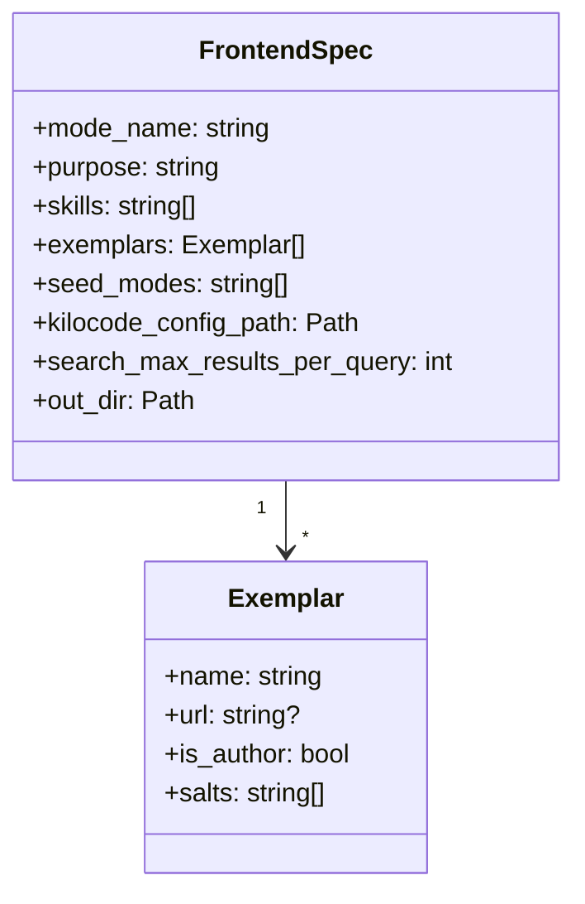
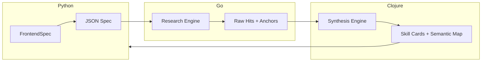
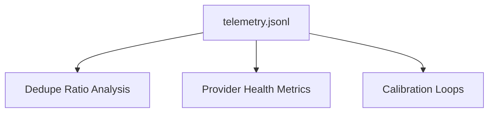

# Data Models and Contracts

This document describes the key “contracts” as implemented in the SkillBuilder pipeline: spec inputs, output artifacts, and the multi-language data flow.

## Spec (YAML) — Authoritative Input

The `FrontendSpec` is the primary configuration object, constructed from a YAML file using the **Builder Pattern**.[^1]

### Object Model

## Multi-Language Data Flow

The pipeline coordinates data across three languages, ensuring **minimal information loss** through structured JSON exchange.

## Output Artifacts

SkillBuilder produces durable artifacts aligned with **Schema.org** standards to ensure semantic interoperability.[^2]

### Artifact Schema

| Artifact | Format | Purpose |
| :--- | :--- | :--- |
| `semantic-map.md` | JSON-LD / Markdown | Schema.org-aligned map of the agent's semantic neighborhood. |
| `skills.md` | YAML / Markdown | SKILL.md-inspired cards detailing acquired capabilities.[^3] |
| `citations.md` | Markdown | Traceable pointers to all source materials and evidence. |
| `generated-mode.md` | Markdown | The final executable mode definition for Kilocode. |

## Telemetry (`telemetry.jsonl`)

Telemetry is recorded as structured JSON Lines, enabling post-hoc debugging and quality calibration.

## Scholarly Citations & Resources

[^1]: *Design Patterns: Elements of Reusable Object-Oriented Software*, Gamma et al. (1994).
[^2]: *Schema.org: Evolution of Structured Data on the Web*, Guha et al. (2016). [Link](https://schema.org/)
[^3]: *SKILL.md: A Standard for Machine-Readable Capabilities*, Replicant Partners (2025).
