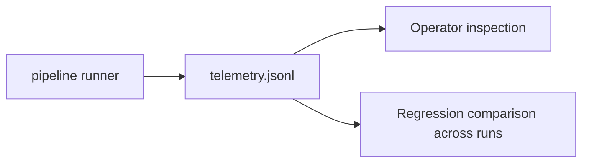
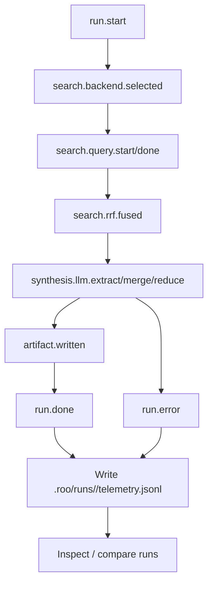

# Observability (Telemetry)

SkillBuilder emits JSONL telemetry to support:
- debugging “what went wrong”
- calibration “what should be improved”
- reproducibility “what happened and why”

## Event stream (high level)

## Telemetry Lifecycle (Mermaid)

## Emitted fields (representative)
- Run lifecycle: `run.start`, `run.done`, `run.error` (run_id, stage, duration_ms, artifacts)
- Search: `search.backend.selected` (backend, fallback), `search.query.start|done`, `search.provider.metrics`, `search.rrf.fused` (k, providers, counts)
- Hybrid search: flags and providers captured in run.start spec_summary
- Synthesis/Merge: `synthesis.llm.extract`, `synthesis.merge.skills`, `synthesis.reduce.map`
- Batch merge: `batch_merge.*` events in `batch_merge.jsonl` (embedding provider/model/fallback, target_count, actual_clusters, similarity stats)
- Artifacts: `artifact.written` (path, size_bytes, type)

## Paths
- Default telemetry: `.roo/runs/<run_id>/telemetry.jsonl`
- Batch merge telemetry: `.roo/runs/<run_id>/batch_merge.jsonl`

## Core events

- Run lifecycle: `run.start`, `run.done`, `run.error`
- Backend selection: `search.backend.selected`
- MCP startup (when enabled): `mcp.server.*`, `mcp.skipped`
- Search tracing:
  - `search.query.start`
  - `search.tool.ok` / `search.tool.error`
  - `search.query.done`
- Stage 2 anchors: `search.stage2.anchors`

## Recommended debugging workflow

1. Search for `run.error` to see the failing boundary.
2. Confirm backend selection and required env vars.
3. Look for provider errors (e.g., missing API keys, HTTP errors, rate limiting).
