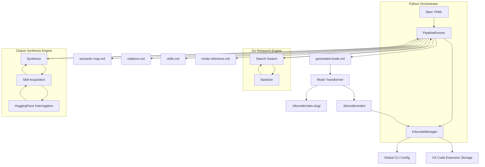
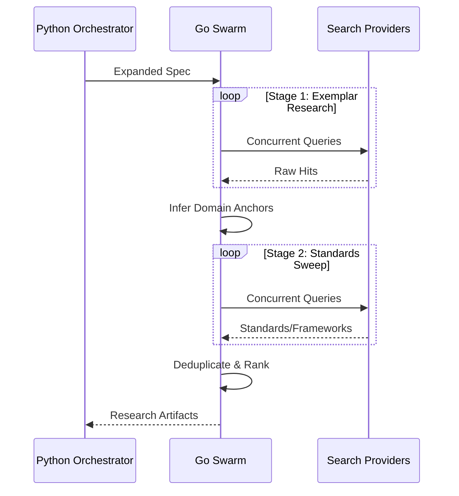
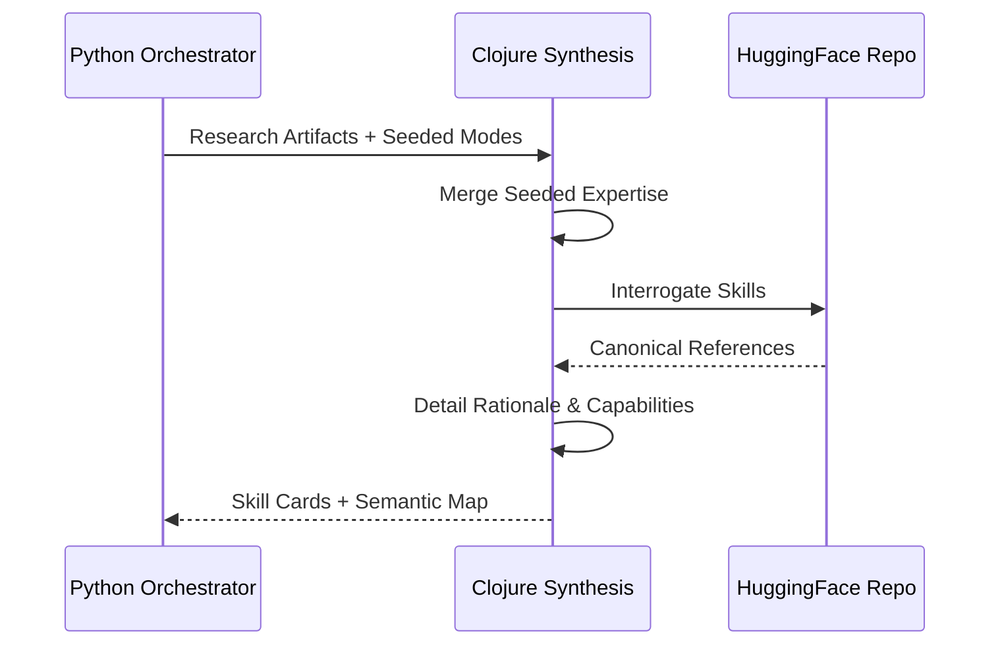

# Architecture Overview

SkillBuilder is a high-performance, multi-language pipeline for turning “a person + a set of skills + a purpose” into a durable reference set and a mode for Kilocode. It is designed to maximize fidelity to **semantic requirements** while ensuring logical efficiency and maintainability.

## System Philosophy

- **Durable artifacts > ephemeral chat**: outputs are stored as files so operators can audit, iterate, and reuse them.[^1]
- **Minimize information loss** by producing multiple layers of synthesis: raw pointers, curated maps, and executable forms.
- **Defense-in-depth for prompt injection**: treat external text as untrusted; sanitize at the source (Go swarm).[^2]
- **Pattern Languages**: Deep use of design patterns (Facade, Strategy, Bridge, Chain of Responsibility) to create a robust architectural language.[^3]

## Components & Multi-Language Flow

The system leverages the optimal language for each task:
- **Go**: Concurrent I/O (Search Swarm) and high-speed string processing (Sanitization).
- **Clojure**: Functional data transformation (Synthesis) and symbolic reasoning (Skill Acquisition).
- **Python**: High-level orchestration, CLI integration, and artifact management.

### System Block Diagram

```mermaid
flowchart LR
    Spec[Spec YAML / CLI flags] --> CLI[python -m semantic_mode]
    CLI --> Runner[Pipeline runner]
    Runner --> GoSearch[Go search swarm (sparse + dense fused via RRF)]
    GoSearch --> Synth[Clojure/Python synthesis]
    Synth --> Merge[Semantic merge + batch-merge clustering]
    Merge --> Outputs[Artifacts: skills.md, semantic-map.md, generated-mode.md]
    Merge --> Telemetry[telemetry.jsonl]
    Telemetry --> Analysis[Offline analysis / regression]
    Outputs --> Kilocode[Kilocode sync (optional)]
```



## Interaction Patterns

### Two-Stage Research Swarm
The Go engine executes a concurrent swarm to maximize throughput and ensure comprehensive coverage.



### Skill Acquisition & Synthesis
The Clojure engine performs functional synthesis, enriching skills through external resource interrogation.



## Scholarly Citations & Resources

[^1]: *Durable Artifacts in Agentic Workflows*, Replicant Partners Research (2025).
[^2]: *Prompt Injection Defense-in-Depth*, OWASP LLM Security Project. [Link](https://owasp.org/www-project-top-10-for-large-language-model-applications/)
[^3]: *A Pattern Language*, Christopher Alexander (1977). Applied to software architecture via *Design Patterns*, Gamma et al. (1994).
